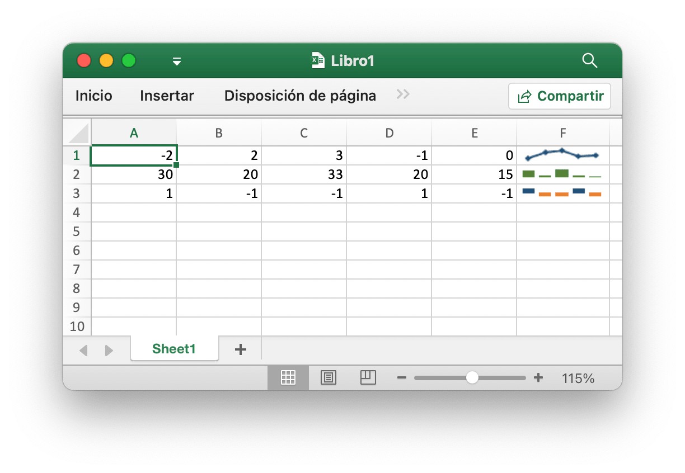
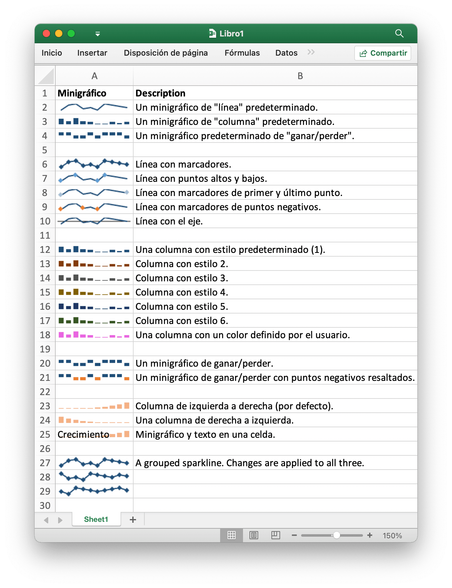

# Minigráficos

Los minigráficos son una característica de Excel 2010+ que le permite agregar gráficos pequeños a las celdas de la hoja de trabajo. Son útiles para mostrar tendencias visuales en datos en un formato compacto.

<p align="center"></p>

[Minigráficos](https://en.wikipedia.org/wiki/Sparklines) fue inventado por [Edward Tufte](https://es.wikipedia.org/wiki/Edward_Tufte).

## Agregar minigráfico

```go
func (f *File) AddSparkline(sheet string, opt *SparklineOption) error
```

AddSparkline proporciona una función para agregar minigráficos a la hoja de trabajo mediante opciones de formato dadas. Los minigráficos son gráficos pequeños que caben en una sola celda y se utilizan para mostrar tendencias en los datos. Los minigráficos son una característica de Excel 2010 y versiones posteriores únicamente. Puede escribirlos en un archivo de hoja de cálculo que pueda leer Excel 2007, pero no se mostrarán. Por ejemplo, agregue un minigráfico agrupado. Los cambios se aplican a los tres:

```go
err := f.AddSparkline("Sheet1", &excelize.SparklineOption{
    Location: []string{"A1", "A2", "A3"},
    Range:    []string{"Sheet2!A1:J1", "Sheet2!A2:J2", "Sheet2!A3:J3"},
    Markers:  true,
})
```

<p align="center"></p>

A continuación, se muestran las opciones de formato de minigráfico admitidas por excelize:

Parámetro | Descripción
---|---
Location  | Obligatorio, debe tener el mismo número que el parámetro `Range`
Range     | Obligatorio, debe tener el mismo número que el parámetro `Location`
Type      | Valor de enumeración: `line`, `column`, `win_loss`
Style     | Rango de valores: 0 - 35
Hight     | Alternar puntos altos del minigráfico
Low       | Alternar puntos bajos del minigráfico
First     | Alternar primeros puntos del minigráfico
Last      | Alternar los últimos puntos del minigráfico
Negative  | Alternar puntos negativos de minigráfico
Markers   | Alternar marcadores minigráficos
ColorAxis | Un color RGB se especifica como `RRGGBB`
Axis      | Mostrar eje de minigráfico
