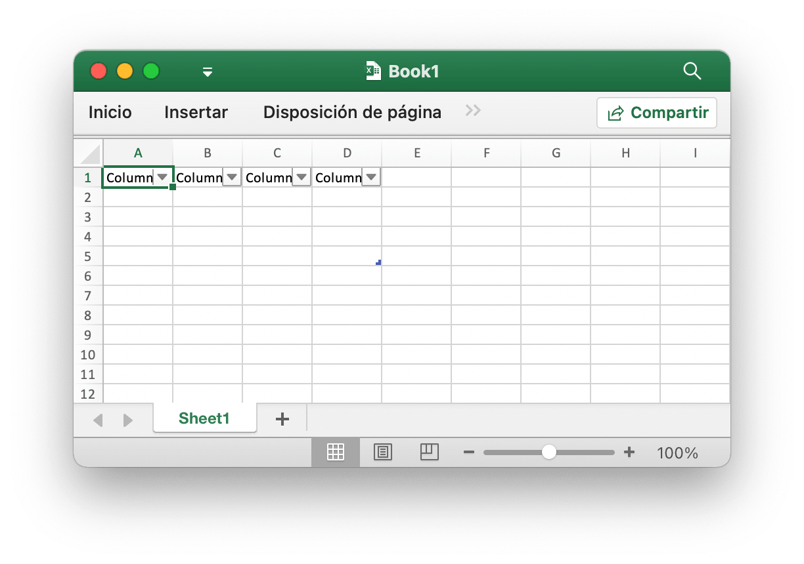
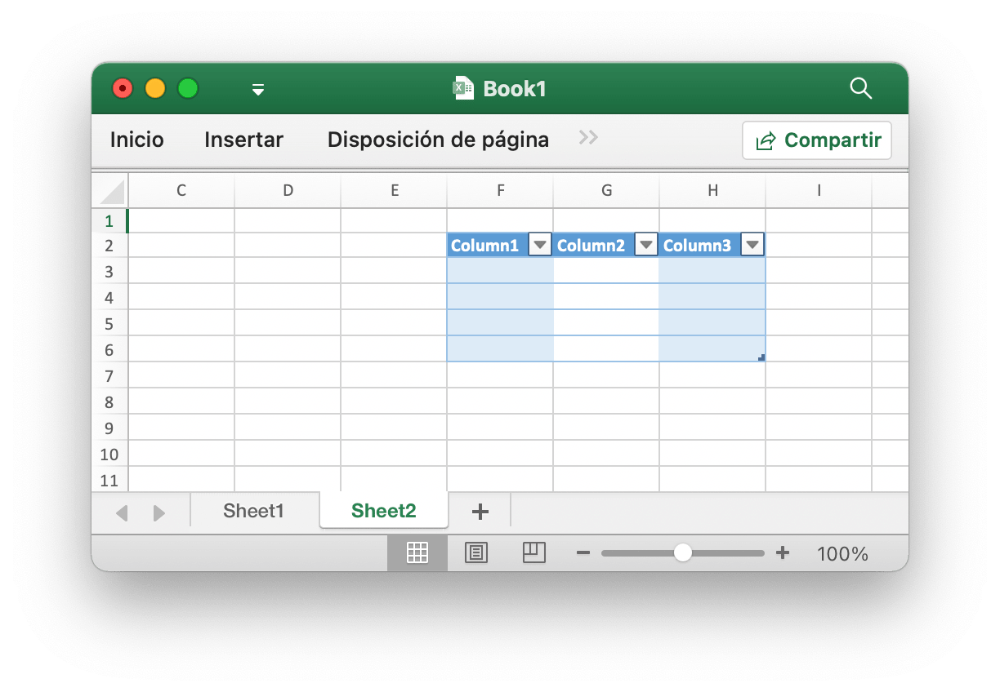
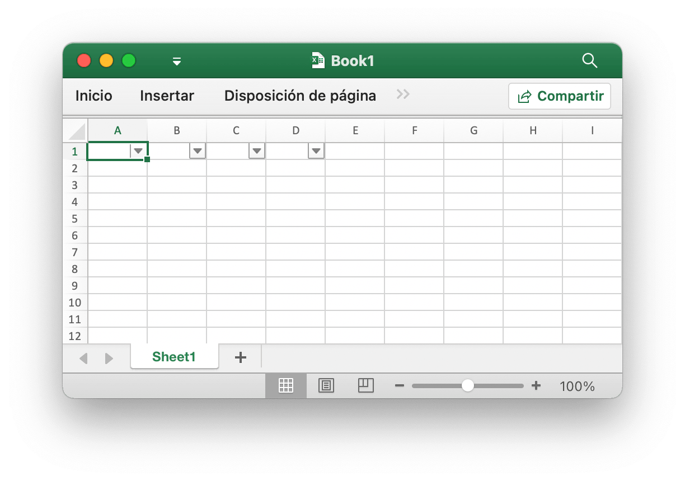
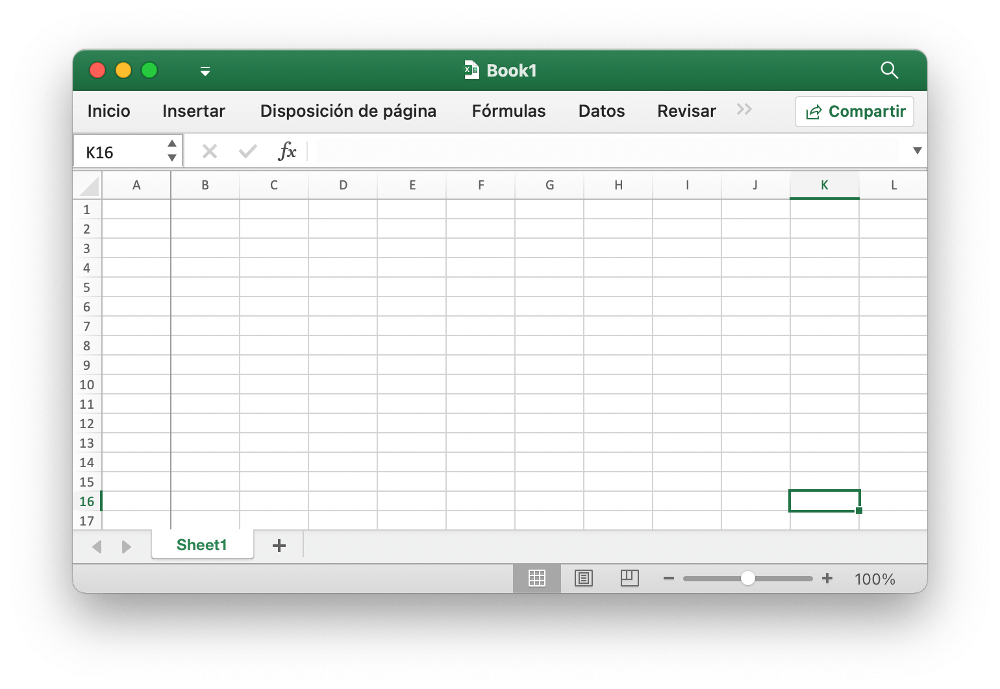
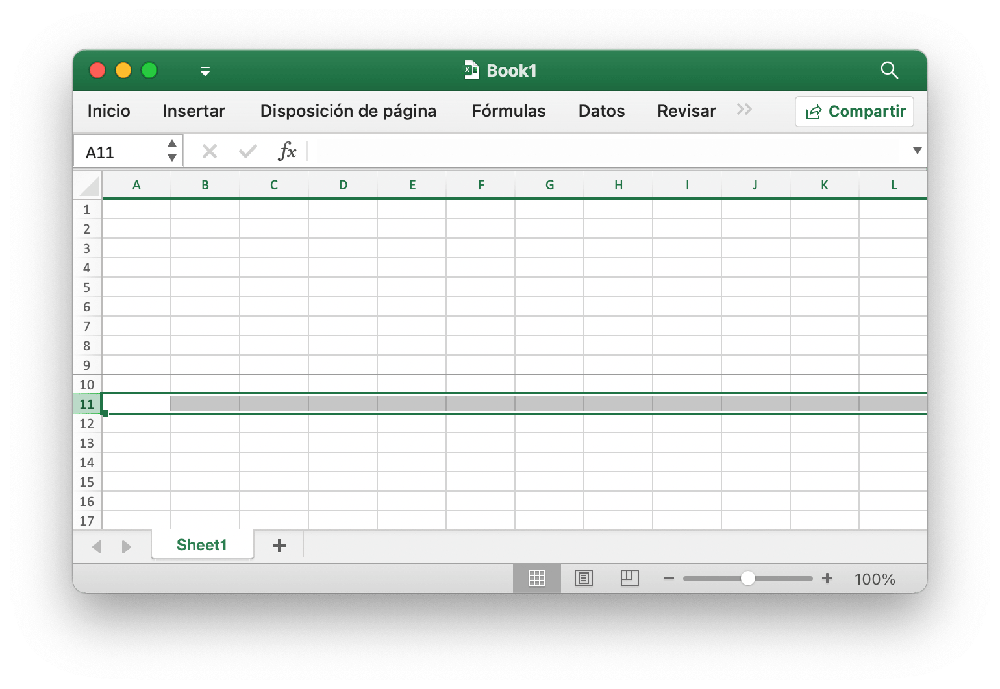
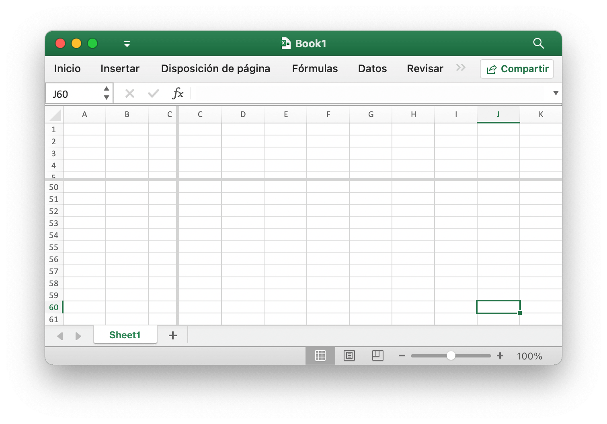

# Utilidades

## Mesa {#AddTable}

```go
func (f *File) AddTable(sheet, hcell, vcell, format string) error
```

AddTable proporciona el método para agregar una tabla en una hoja de trabajo por el nombre de la hoja de trabajo, el área de coordenadas y el conjunto de formato dados.

- Ejemplo 1, cree una tabla de `A1:D5` en `Sheet1`:

<p align="center"></p>

```go
err := f.AddTable("Sheet1", "A1", "D5", ``)
```

- Ejemplo 2, cree una tabla de `F2:H6` en `Sheet2` con el formato establecido:

<p align="center"></p>

```go
err := f.AddTable("Sheet2", "F2", "H6", `{
    "table_name": "table",
    "table_style": "TableStyleMedium2",
    "show_first_column": true,
    "show_last_column": true,
    "show_row_stripes": false,
    "show_column_stripes": true
}`)
```

Tenga en cuenta que la tabla debe tener al menos dos líneas, incluido el encabezado. Las celdas del encabezado deben contener cadenas y deben ser únicas, y deben establecer los datos de la fila del encabezado de la tabla antes de llamar a la función AddTable. Varias tablas coordinan áreas que no pueden tener una intersección.

`table_name`: El nombre de la tabla, en el mismo nombre de hoja de trabajo de la tabla, debe ser único.

`table_style`: Los nombres de estilo de tabla integrados:

```text
TableStyleLight1 - TableStyleLight21
TableStyleMedium1 - TableStyleMedium28
TableStyleDark1 - TableStyleDark11
```

Índice|Estilo|Índice|Estilo|Índice|Estilo
---|---|---|---|---|---
||TableStyleLight1||TableStyleLight2|
TableStyleLight3||TableStyleLight4||TableStyleLight5|
TableStyleLight6||TableStyleLight7||TableStyleLight8|
TableStyleLight9||TableStyleLight10||TableStyleLight11|
TableStyleLight12||TableStyleLight13||TableStyleLight14|
TableStyleLight15||TableStyleLight16||TableStyleLight17|
TableStyleLight18||TableStyleLight19||TableStyleLight20|
TableStyleLight21||TableStyleMedium1||TableStyleMedium2|
TableStyleMedium3||TableStyleMedium4||TableStyleMedium5|
TableStyleMedium6||TableStyleMedium7||TableStyleMedium8|
TableStyleMedium9||TableStyleMedium10||TableStyleMedium11|
TableStyleMedium12||TableStyleMedium13||TableStyleMedium14|
TableStyleMedium15||TableStyleMedium16||TableStyleMedium17|
TableStyleMedium18||TableStyleMedium19||TableStyleMedium20|
TableStyleMedium21||TableStyleMedium22||TableStyleMedium23|
TableStyleMedium24||TableStyleMedium25||TableStyleMedium26|
TableStyleMedium27||TableStyleMedium28||TableStyleDark1|
TableStyleDark2||TableStyleDark3||TableStyleDark4|
TableStyleDark5||TableStyleDark6||TableStyleDark7|
TableStyleDark8||TableStyleDark9||TableStyleDark10|
TableStyleDark11|||||

## Filtro automático {#AutoFilter}

```go
func (f *File) AutoFilter(sheet, hcell, vcell, format string) error
```

AutoFilter proporciona el método para agregar un filtro automático en una hoja de trabajo por el nombre de la hoja de trabajo, el área de coordenadas y la configuración. Un filtro automático en Excel es una forma de filtrar un rango de datos 2D basado en algunos criterios simples.

Ejemplo 1, aplicando un filtro automático a un rango de celdas `A1:D4` en la `Sheet1`:

<p align="center"></p>

```go
err := f.AutoFilter("Sheet1", "A1", "D4", "")
```

Ejemplo 2, filtrar datos en un filtro automático:

```go
err := f.AutoFilter("Sheet1", "A1", "D4", `{"column":"B","expression":"x != blanks"}`)
```

`column` define las columnas de filtro en un rango de filtro automático basado en criterios simples.

No es suficiente especificar la condición del filtro. También debe ocultar las filas que no coincidan con la condición del filtro. Las filas se ocultan mediante el método [`SetRowVisible()`](sheet.md#SetRowVisible). Excelize no puede filtrar filas automáticamente porque esto no es parte del formato de archivo.

Establecer criterios de filtro para una columna:

`expression` define las condiciones, los siguientes operadores están disponibles para establecer los criterios de filtrado:

```text
==
!=
>
<
>=
<=
and
or
```

Una expresión puede comprender una sola declaración o dos declaraciones separadas por los operadores `and` y `or`. Por ejemplo:

```text
x <  2000
x >  2000
x == 2000
x >  2000 and x <  5000
x == 2000 or  x == 5000
```

El filtrado de datos en blanco o no en blanco se puede lograr utilizando un valor de Blanks o NonBlanks en la expresión:

```text
x == Blanks
x == NonBlanks
```

Office Excel también permite algunas operaciones simples de coincidencia de cadenas:

```text
x == b*      // comienza con b
x != b*      // no comienza con b
x == *b      // termina con b
x != *b      // no termina con b
x == *b*     // contiene b
x != *b*     // no contiene b
```

También puede utilizar `*` para hacer coincidir cualquier carácter o número y `?` Para hacer coincidir cualquier carácter o número. Los filtros de Excel no admiten ningún otro cuantificador de expresión regular. Los caracteres de expresión regular de Excel se pueden escapar usando `~`.

La variable de marcador de posición `x` en los ejemplos anteriores se puede reemplazar por cualquier cadena simple. El nombre real del marcador de posición se ignora internamente, por lo que los siguientes son todos equivalentes:

```text
x     < 2000
col   < 2000
Price < 2000
```

## Actualizar valor vinculado {#UpdateLinkedValue}

```go
func (f *File) UpdateLinkedValue() error
```

UpdateLinkedValue corrige los valores vinculados dentro de una hoja de cálculo no se actualizan en Office Excel 2007 y 2010. Esta función eliminará la etiqueta de valor cuando se encuentre una celda que tenga un valor vinculado. Referencia [https://social.technet.microsoft.com/Forums/office/en-US/e16bae1f-6a2c-4325-8013-e989a3479066/excel-2010-linked-cells-not-updating](https://social.technet.microsoft.com/Forums/office/en-US/e16bae1f-6a2c-4325-8013-e989a3479066/excel-2010-linked-cells-not-updating) Aviso: después de abrir el archivo de hoja de cálculo, Excel actualizará el valor vinculado y generará un nuevo valor y solicitará guardar el archivo o no.

El efecto de borrar el caché de la celda en el libro de trabajo aparece como una modificación de la etiqueta `<v>`, por ejemplo, el caché de la celda antes de borrar:

```xml
<row r="19" spans="2:2">
    <c r="B19">
        <f>SUM(Sheet2!D2,Sheet2!D11)</f>
        <v>100</v>
     </c>
</row>
```

Después de borrar la memoria caché de la celda:

```xml
<row r="19" spans="2:2">
    <c r="B19">
        <f>SUM(Sheet2!D2,Sheet2!D11)</f>
    </c>
</row>
```

## Nombre de celda dividida {#SplitCellName}

```go
func SplitCellName(cell string) (string, int, error)
```

SplitCellName divide el nombre de la celda en el nombre de la columna y el número de fila. Por ejemplo:

```go
excelize.SplitCellName("AK74") // regreso "AK", 74, nil
```

## Unir el nombre de la celda {#JoinCellName}

```go
func JoinCellName(col string, row int) (string, error)
```

JoinCellName une el nombre de la celda del nombre de la columna y el número de fila.

## Nombre de columna a número {#ColumnNameToNumber}

```go
func ColumnNameToNumber(name string) (int, error)
```

ColumnNameToNumber proporciona una función para convertir el nombre de la columna de la hoja de Excel a `int`. El nombre de la columna no distingue entre mayúsculas y minúsculas. La función devuelve un error si el nombre de la columna es incorrecto. Por ejemplo:

```go
excelize.ColumnNameToNumber("AK") // regreso 37, nil
```

## El número de columna al nombre {#ColumnNumberToName}

```go
func ColumnNumberToName(num int) (string, error)
```

ColumnNumberToName proporciona una función para convertir el número entero al título de la columna de la hoja de Excel. Por ejemplo:

```go
excelize.ColumnNumberToName(37) // regreso "AK", nil
```

## Nombre de la celda a las coordenadas {#CellNameToCoordinates}

```go
func CellNameToCoordinates(cell string) (int, int, error)
```

CellNameToCoordinates convierte el nombre de celda alfanumérico en coordenadas `[X, Y]` o devuelve un error. Por ejemplo:

```go
CellCoordinates("A1") // regreso 1, 1, nil
CellCoordinates("Z3") // regreso 26, 3, nil
```

## Coordenadas al nombre de la celda {#CoordinatesToCellName}

```go
func CoordinatesToCellName(col, row int) (string, error)
```

CoordinatesToCellName convierte las coordenadas `[X, Y]` a un nombre de celda alfanumérico o devuelve un error. Por ejemplo:

```go
CoordinatesToCellName(1, 1) // regreso "A1", nil
```

## Estilo condicional {#NewConditionalStyle}

```go
func (f *File) NewConditionalStyle(style string) (int, error)
```

NewConditionalStyle proporciona una función para crear un estilo para el formato condicional por formato de estilo dado. Los parámetros son los mismos que los de la función [`NewStyle()`](style.md#NewStyle). Tenga en cuenta que el campo de color utiliza código de color RGB y solo admite la configuración de fuente, rellenos, alineación y bordes actualmente.

## Formato condicional {#SetConditionalFormat}

```go
func (f *File) SetConditionalFormat(sheet, area, formatSet string) error
```

SetConditionalFormat proporciona una función para crear una regla de formato condicional para el valor de la celda. El formato condicional es una característica de Office Excel que le permite aplicar un formato a una celda o un rango de celdas según ciertos criterios.

La opción `type` es un parámetro obligatorio y no tiene un valor predeterminado. Los valores de tipo permitidos y sus parámetros asociados son:

<table>
    <thead>
        <tr>
            <th>Tipo</th>
            <th>Parámetros</th>
        </tr>
    </thead>
    <tbody>
        <tr>
            <td rowspan=4>cell</td>
            <td>criteria</td>
        </tr>
        <tr>
            <td>value</td>
        </tr>
        <tr>
            <td>minimum</td>
        </tr>
        <tr>
            <td>maximum</td>
        </tr>
        <tr>
            <td rowspan=4>date</td>
            <td>criteria</td>
        </tr>
        <tr>
            <td>value</td>
        </tr>
        <tr>
            <td>minimum</td>
        </tr>
        <tr>
            <td>maximum</td>
        </tr>
        <tr>
            <td>time_period</td>
            <td>criteria</td>
        </tr>
        <tr>
            <td rowspan=2>text</td>
            <td>criteria</td>
        </tr>
        <tr>
            <td>value</td>
        </tr>
        <tr>
            <td>average</td>
            <td>criteria</td>
        </tr>
        <tr>
            <td>duplicate</td>
            <td>(none)</td>
        </tr>
        <tr>
            <td>unique</td>
            <td>(none)</td>
        </tr>
        <tr>
            <td rowspan=2>top</td>
            <td>criteria</td>
        </tr>
        <tr>
            <td>value</td>
        </tr>
        <tr>
            <td rowspan=2>bottom</td>
            <td>criteria</td>
        </tr>
        <tr>
            <td>value</td>
        </tr>
        <tr>
            <td>blanks</td>
            <td>(none)</td>
        </tr>
        <tr>
            <td>no_blanks</td>
            <td>(none)</td>
        </tr>
        <tr>
            <td>errors</td>
            <td>(none)</td>
        </tr>
        <tr>
            <td>no_errors</td>
            <td>(none)</td>
        </tr>
        <tr>
            <td rowspan=6>2_color_scale</td>
            <td>min_type</td>
        </tr>
        <tr>
            <td>max_type</td>
        </tr>
        <tr>
            <td>min_value</td>
        </tr>
        <tr>
            <td>max_value</td>
        </tr>
        <tr>
            <td>min_color</td>
        </tr>
        <tr>
            <td>max_color</td>
        </tr>
        <tr>
            <td rowspan=9>3_color_scale</td>
            <td>min_type</td>
        </tr>
        <tr>
            <td>mid_type</td>
        </tr>
        <tr>
            <td>max_type</td>
        </tr>
        <tr>
            <td>min_value</td>
        </tr>
        <tr>
            <td>mid_value</td>
        </tr>
        <tr>
            <td>max_value</td>
        </tr>
        <tr>
            <td>min_color</td>
        </tr>
        <tr>
            <td>mid_color</td>
        </tr>
        <tr>
            <td>max_color</td>
        </tr>
        <tr>
            <td rowspan=5>data_bar</td>
            <td>min_type</td>
        </tr>
        <tr>
            <td>max_type</td>
        </tr>
        <tr>
            <td>min_value</td>
        </tr>
        <tr>
            <td>max_value</td>
        </tr>
        <tr>
            <td>bar_color</td>
        </tr>
        <tr>
            <td>formula</td>
            <td>criteria</td>
        </tr>
    </tbody>
</table>

El parámetro `criteria` se utiliza para establecer los criterios por los cuales se evaluarán los datos de la celda. No tiene ningún valor predeterminado. Los criterios más comunes aplicados a `{"type"："cell"}` son:

Carácter de descripción de texto|Representación simbólica
---|---
between|
not between|
equal to|==
not equal to|!=
greater than|>
less than|<
greater than or equal to|>=
less than or equal to|<=

Puede utilizar las cadenas de descripción textual de Excel, en la primera columna de arriba, o las alternativas simbólicas más comunes.

Los criterios adicionales que son específicos de otros tipos de formato condicional se muestran en las secciones relevantes a continuación.

`value`: El valor se usa generalmente junto con el parámetro `criteria` para establecer la regla por la cual se evaluarán los datos de la celda:

```go
f.SetConditionalFormat("Sheet1", "D1:D10", fmt.Sprintf(`[
{
    "type": "cell",
    "criteria": ">",
    "format": %d,
    "value": "6"
}]`, format))
```

La propiedad `value` también puede ser una referencia de celda:

```go
f.SetConditionalFormat("Sheet1", "D1:D10", fmt.Sprintf(`[
{
    "type": "cell",
    "criteria": ">",
    "format": %d,
    "value": "$C$1"
}]`, format))
```

type: `format` - El parámetro `format` se utiliza para especificar el formato que se aplicará a la celda cuando se cumpla el criterio de formato condicional. El formato se crea usando el método [`NewConditionalStyle()`](utils.md#NewConditionalStyle) de la misma manera que los formatos de celda:

```go
format, err = f.NewConditionalStyle(`{
    "font":
    {
        "color": "#9A0511"
    },
    "fill":
    {
        "type": "pattern",
        "color": ["#FEC7CE"],
        "pattern": 1
    }
}`)
if err != nil {
    fmt.Println(err)
}
f.SetConditionalFormat("Sheet1", "A1:A10", fmt.Sprintf(`[
{
    "type": "cell",
    "criteria": ">",
    "format": %d,
    "value": "6"
}]`, format))
```

Nota: En Excel, se superpone un formato condicional sobre el formato de celda existente y no todas las propiedades del formato de celda se pueden modificar. Las propiedades que no se pueden modificar en un formato condicional son nombre de fuente, tamaño de fuente, superíndice y subíndice, bordes diagonales, todas las propiedades de alineación y todas las propiedades de protección.

Excel especifica algunos formatos predeterminados que se utilizarán con formato condicional. Estos se pueden replicar utilizando los siguientes formatos de Excel:

```go
// Formato rosa para mal condicional.
format1, err = f.NewConditionalStyle(`{
    "font":
    {
        "color": "#9A0511"
    },
    "fill":
    {
        "type": "pattern",
        "color": ["#FEC7CE"],
        "pattern": 1
    }
}`)

// Formato amarillo claro para condicional neutro.
format2, err = f.NewConditionalStyle(`{
    "font":
    {
        "color": "#9B5713"
    },
    "fill":
    {
        "type": "pattern",
        "color": ["#FEEAA0"],
        "pattern": 1
    }
}`)

// Formato verde claro para buenas condiciones.
format3, err = f.NewConditionalStyle(`{
    "font":
    {
        "color": "#09600B"
    },
    "fill":
    {
        "type": "pattern",
        "color": ["#C7EECF"],
        "pattern": 1
    }
}`)
```

type: `minimum` - El parámetro `minimum` se utiliza para establecer el valor límite inferior cuando el `criteria` es `between` o `not between`.

```go
// Regla de las celdas resaltadas: entre...
f.SetConditionalFormat("Sheet1", "A1:A10", fmt.Sprintf(`[
{
    "type": "cell",
    "criteria": "between",
    "format": %d,
    "minimum": "6",
    "maximum": "8"
}]`, format))
```

type: `maximum` - El parámetro `maximum` se utiliza para establecer el valor límite superior cuando los criterios están `between` o `not between`. Vea el ejemplo anterior.

type: `average` - El tipo `average` se utiliza para especificar el formato condicional de estilo "Average" de Office Excel:

```go
// Reglas superiores/inferiores: por encima del promedio...
f.SetConditionalFormat("Sheet1", "A1:A10", fmt.Sprintf(`[
{
    "type": "average",
    "criteria": "=",
    "format": %d,
    "above_average": true
}]`, format1))

// Reglas superiores/inferiores: Inferior al promedio...
f.SetConditionalFormat("Sheet1", "B1:B10", fmt.Sprintf(`[
{
    "type": "average",
    "criteria": "=",
    "format": %d,
    "above_average": false
}]`, format2))
```

type: `duplicate` - El tipo `duplicate` se usa para resaltar celdas duplicadas en un rango:

```go
// Resaltar reglas de celdas: valores duplicados...
f.SetConditionalFormat("Sheet1", "A1:A10", fmt.Sprintf(`[
{
    "type": "duplicate",
    "criteria": "=",
    "format": %d
}]`, format))
```

type: `unique` - El tipo `unique` se usa para resaltar celdas únicas en un rango:

```go
// Resaltar reglas de celdas: No es igual a...
f.SetConditionalFormat("Sheet1", "A1:A10", fmt.Sprintf(`[
{
    "type": "unique",
    "criteria": "=",
    "format": %d
}]`, format))
```

type: `top` - El tipo `top` se usa para especificar los n valores principales por número o porcentaje en un rango:

```go
// Reglas de Top/Bottom: Top 10.
f.SetConditionalFormat("Sheet1", "H1:H10", fmt.Sprintf(`[
{
    "type": "top",
    "criteria": "=",
    "format": %d,
    "value": "6"
}]`, format))
```

Los criterios se pueden utilizar para indicar que se requiere una condición de porcentaje:

```go
f.SetConditionalFormat("Sheet1", "A1:A10", fmt.Sprintf(`[
{
    "type": "top",
    "criteria": "=",
    "format": %d,
    "value": "6",
    "percent": true
}]`, format))
```

type: `2_color_scale` - El tipo `2_color_scale` se utiliza para especificar el formato condicional de estilo "Escala de 2 colores" de Excel:

```go
// Escalas de color: 2 colores.
f.SetConditionalFormat("Sheet1", "A1:A10", `[
{
    "type": "2_color_scale",
    "criteria": "=",
    "min_type": "min",
    "max_type": "max",
    "min_color": "#F8696B",
    "max_color": "#63BE7B"
}]`)
```

Este tipo condicional se puede modificar con `min_type`, `max_type`, `min_value`, `max_value`, `min_color` y `max_color`, ver más abajo.

type: `3_color_scale` - El tipo `3_color_scale` se utiliza para especificar el formato condicional de estilo "Escala de 3 colores" de Excel:

```go
// Escalas de color: 3 colores.
f.SetConditionalFormat("Sheet1", "A1:A10", `[
{
    "type": "3_color_scale",
    "criteria": "=",
    "min_type": "min",
    "mid_type": "percentile",
    "max_type": "max",
    "min_color": "#F8696B",
    "mid_color": "#FFEB84",
    "max_color": "#63BE7B"
}]`)
```

Este tipo condicional se puede modificar con `min_type`, `mid_type`, `max_type`, `min_value`, `mid_value`, `max_value`, `min_color`, `mid_color` y `max_color`, ver más abajo.

type: `data_bar` - El tipo `data_bar` se utiliza para especificar el formato condicional de estilo "Data Bar" de Excel.

`min_type` - Las propiedades `min_type` y `max_type` están disponibles cuando el tipo de formato condicional es `2_color_scale`, `3_color_scale` o `data_bar`. El `mid_type` está disponible para `3_color_scale`. Las propiedades se utilizan de la siguiente manera:

```go
// Barras de datos: relleno degradado.
f.SetConditionalFormat("Sheet1", "K1:K10", `[
{
    "type": "data_bar",
    "criteria": "=",
    "min_type": "min",
    "max_type": "max",
    "bar_color": "#638EC6"
}]`)
```

Los tipos `min/mid/max` disponibles son:

Parámetro|Explicación
---|---
min|El valor mínimo (solo para `min_type`)
num|Numérica
percent|Porcentaje
percentile|Percentil
formula|Fórmula
max|Máxima (solo para `max_type`)

`mid_type` - Usado para `3_color_scale`. Igual que `min_type`, ver arriba.

`max_type` - Igual que `min_type`, ver arriba.

`min_value` - Las propiedades `min_value` y `max_value` están disponibles cuando el tipo de formato condicional es `2_color_scale`, `3_color_scale` o `data_bar`. El `mid_value` está disponible para `3_color_scale`.

`mid_value` - Usado para `3_color_scale`. Igual que `min_value`, ver arriba.

`max_value` - Igual que `min_value`, ver arriba.

`min_color` - Las propiedades `min_color` y `max_color` están disponibles cuando el tipo de formato condicional es `2_color_scale`, `3_color_scale` o `data_bar`. El `mid_color` está disponible para `3_color_scale`. Las propiedades se utilizan de la siguiente manera:

```go
// Escalas de color: 3 colores.
f.SetConditionalFormat("Sheet1", "B1:B10", `[
{
    "type": "3_color_scale",
    "criteria": "=",
    "min_type": "min",
    "mid_type": "percentile",
    "max_type": "max",
    "min_color": "#F8696B",
    "mid_color": "#FFEB84",
    "max_color": "#63BE7B"
}]`)
```

`mid_color` - Usado para `3_color_scale`. Igual que `min_color`, ver arriba.

`max_color` - Igual que `min_color`, ver arriba.

`bar_color` - Usado para `data_bar`. Igual que `min_color`, ver arriba.

## Eliminar formato condicional {#UnsetConditionalFormat}

```go
func (f *File) UnsetConditionalFormat(sheet, area string) error
```

UnsetConditionalFormat proporciona una función para anular el formato condicional por el nombre y el rango de la hoja de trabajo.

## Paneles {#SetPanes}

```go
func (f *File) SetPanes(sheet, panes string)
```

SetPanes proporciona una función para crear y eliminar paneles congelados y paneles divididos según el nombre de la hoja de trabajo y el formato de paneles determinados.

`activePane` define el panel que está activo. Los posibles valores para este atributo se definen en la siguiente tabla:

Valor de enumeración|Descripción
---|---
bottomLeft (Panel inferior izquierdo) |Panel inferior izquierdo cuando se aplican divisiones verticales y horizontales.<br><br>Este valor también se usa cuando solo se ha aplicado una división horizontal, dividiendo el panel en regiones superior e inferior. En ese caso, este valor especifica el panel inferior.
bottomRight (Panel inferior derecho) | Panel inferior derecho, cuando se aplican divisiones verticales y horizontales.
topLeft (Panel superior izquierdo)|Panel superior izquierdo, cuando se aplican divisiones verticales y horizontales.<br><br>Este valor también se usa cuando solo se ha aplicado una división horizontal, dividiendo el panel en regiones superior e inferior. En ese caso, este valor especifica el panel superior.<br><br>Este valor también se usa cuando solo se ha aplicado una división vertical, dividiendo el panel en regiones derecha e izquierda. En ese caso, este valor especifica el panel izquierdo.
topRight (Panel superior derecho)|Panel superior derecho, cuando se aplican divisiones verticales y horizontales.<br><br> Este valor también se usa cuando solo se ha aplicado una división vertical, dividiendo el panel en regiones derecha e izquierda. En ese caso, este valor especifica el panel derecho.

El tipo de estado de panel está restringido a los valores admitidos actualmente enumerados en la siguiente tabla:

Valor de enumeración|Descripción
---|---
frozen (Congelada)|Los paneles están congelados, pero no se dividieron al congelarse. En este estado, cuando los paneles se descongelan nuevamente, se produce un solo panel, sin división.<br><br>En este estado, las barras divididas no son ajustables.
split (División)|Los paneles están divididos, pero no congelados. En este estado, las barras divididas son ajustables por el usuario.

`x_split` - Posición horizontal de la división, en una vigésima parte de un punto; 0 (cero) si ninguno. Si el panel está congelado, este valor indica el número de columnas visibles en el panel superior.

`y_split` - La posición vertical de la división, en una vigésima parte de un punto; 0 (cero) si ninguno. Si el panel está congelado, este valor indica el número de filas visibles en el panel izquierdo. Los valores posibles para este atributo están definidos por el tipo de datos doble del esquema XML del W3C.

`top_left_cell` - Ubicación de la celda visible superior izquierda en el panel inferior derecho (en el modo de izquierda a derecha).

`sqref` - Rango de la selección. Puede ser un conjunto de rangos no contiguos.

Ejemplo 1: congelar la columna `A` en la `Sheet1` y establecer la celda activa en `Sheet1!K16`:

<p align="center"></p>

```go
f.SetPanes("Sheet1", `{
    "freeze": true,
    "split": false,
    "x_split": 1,
    "y_split": 0,
    "top_left_cell": "B1",
    "active_pane": "topRight",
    "panes": [
    {
        "sqref": "K16",
        "active_cell": "K16",
        "pane": "topRight"
    }]
}`)
```

Ejemplo 2: congele las filas 1 a 9 en la `Sheet1` y establezca los rangos de celdas activas en `Sheet1!A11:XFD11`:

<p align="center"></p>

```go
f.SetPanes("Sheet1", `{
    "freeze": true,
    "split": false,
    "x_split": 0,
    "y_split": 9,
    "top_left_cell": "A34",
    "active_pane": "bottomLeft",
    "panes": [
    {
        "sqref": "A11:XFD11",
        "active_cell": "A11",
        "pane": "bottomLeft"
    }]
}`)
```

Ejemplo 3: cree paneles divididos en `Sheet1` y establezca la celda activa en `Sheet1!J60`:

<p align="center"></p>

```go
f.SetPanes("Sheet1", `{
    "freeze": false,
    "split": true,
    "x_split": 3270,
    "y_split": 1800,
    "top_left_cell": "N57",
    "active_pane": "bottomLeft",
    "panes": [
    {
        "sqref": "I36",
        "active_cell": "I36"
    },
    {
        "sqref": "G33",
        "active_cell": "G33",
        "pane": "topRight"
    },
    {
        "sqref": "J60",
        "active_cell": "J60",
        "pane": "bottomLeft"
    },
    {
        "sqref": "O60",
        "active_cell": "O60",
        "pane": "bottomRight"
    }]
}`)
```

Ejemplo 4, descongelar y quitar todos los paneles en `Sheet1`:

```go
f.SetPanes("Sheet1", `{"freeze":false,"split":false}`)
```

## Color {#ThemeColor}

```go
func ThemeColor(baseColor string, tint float64) string
```

ThemeColor aplicó el color con valor de tinte:

```go
package main

import (
    "fmt"
    "strings"

    "github.com/360EntSecGroup-Skylar/excelize/v2"
)

func main() {
    f, err := excelize.OpenFile("Book1.xlsx")
    if err != nil {
        fmt.Println(err)
        return
    }
    fmt.Println(getCellBgColor(f, "Sheet1", "A1"))
}

func getCellBgColor(f *excelize.File, sheet, axix string) string {
    styleID, err := f.GetCellStyle(sheet, axix)
    if err != nil {
        return err.Error()
    }
    fillID := *f.Styles.CellXfs.Xf[styleID].FillID
    fgColor := f.Styles.Fills.Fill[fillID].PatternFill.FgColor
    if fgColor.Theme != nil {
        children := f.Theme.ThemeElements.ClrScheme.Children
        if *fgColor.Theme < 4 {
            dklt := map[int]string{
                0: children[1].SysClr.LastClr,
                1: children[0].SysClr.LastClr,
                2: *children[3].SrgbClr.Val,
                3: *children[2].SrgbClr.Val,
            }
            return strings.TrimPrefix(
                excelize.ThemeColor(dklt[*fgColor.Theme], fgColor.Tint), "FF")
        }
        srgbClr := *children[*fgColor.Theme].SrgbClr.Val
        return strings.TrimPrefix(excelize.ThemeColor(srgbClr, fgColor.Tint), "FF")
    }
    return strings.TrimPrefix(fgColor.RGB, "FF")
}
```

## Convertir RGB a HSL {#RGBToHSL}

```go
func RGBToHSL(r, g, b uint8) (h, s, l float64)
```

RGBToHSL convierte un triple RGB en un triple HSL.

## Convertir HSL a RGB {#HSLToRGB}

```go
func HSLToRGB(h, s, l float64) (r, g, b uint8)
```

HSLToRGB convierte un triple HSL en un triple RGB.

## Escritor de archivos {#FileWriter}

### Write {#Write}

```go
func (f *File) Write(w io.Writer) error
```

Write proporciona una función para escribir en un `io.Writer`.

### WriteTo {#WriteTo}

```go
func (f *File) WriteTo(w io.Writer) (int64, error)
```

WriteTo implementa `io.WriterTo` para escribir el archivo.

### WriteToBuffer {#WriteToBuffer}

```go
func (f *File) WriteToBuffer() (*bytes.Buffer, error)
```

WriteToBuffer proporciona una función para obtener `*bytes.Buffer` del archivo guardado.

## Agregar proyecto VBA {#AddVBAProject}

```go
func (f *File) AddVBAProject(bin string) error
```

AddVBAProject proporciona el método para agregar el archivo `vbaProject.bin` que contiene funciones y/o macros. La extensión del archivo debe ser `.xlsm`. Por ejemplo:

```go
if err := f.SetSheetPrOptions("Sheet1", excelize.CodeName("Sheet1")); err != nil {
    fmt.Println(err)
}
if err := f.AddVBAProject("vbaProject.bin"); err != nil {
    fmt.Println(err)
}
if err := f.SaveAs("macros.xlsm"); err != nil {
    fmt.Println(err)
}
```

## Fecha de Excel a la hora {#ExcelDateToTime}

```go
func ExcelDateToTime(excelDate float64, use1904Format bool) (time.Time, error)
```

ExcelDateToTime convierte una representación de fecha de Excel basada en flotante en un `time.Time`.

## Transcodificador Charset {#CharsetTranscoder}

```go
func (f *File) CharsetTranscoder(fn charsetTranscoderFn) *File
```

CharsetTranscoder Establece la función de transcodificador de página de códigos definida por el usuario para abrir la hoja de cálculo desde una codificación que no sea UTF-8.
