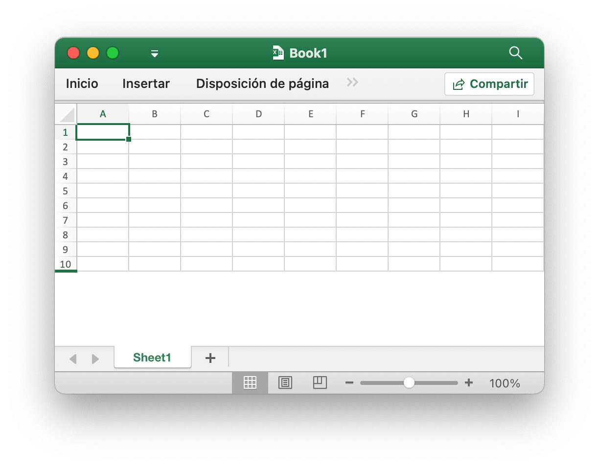
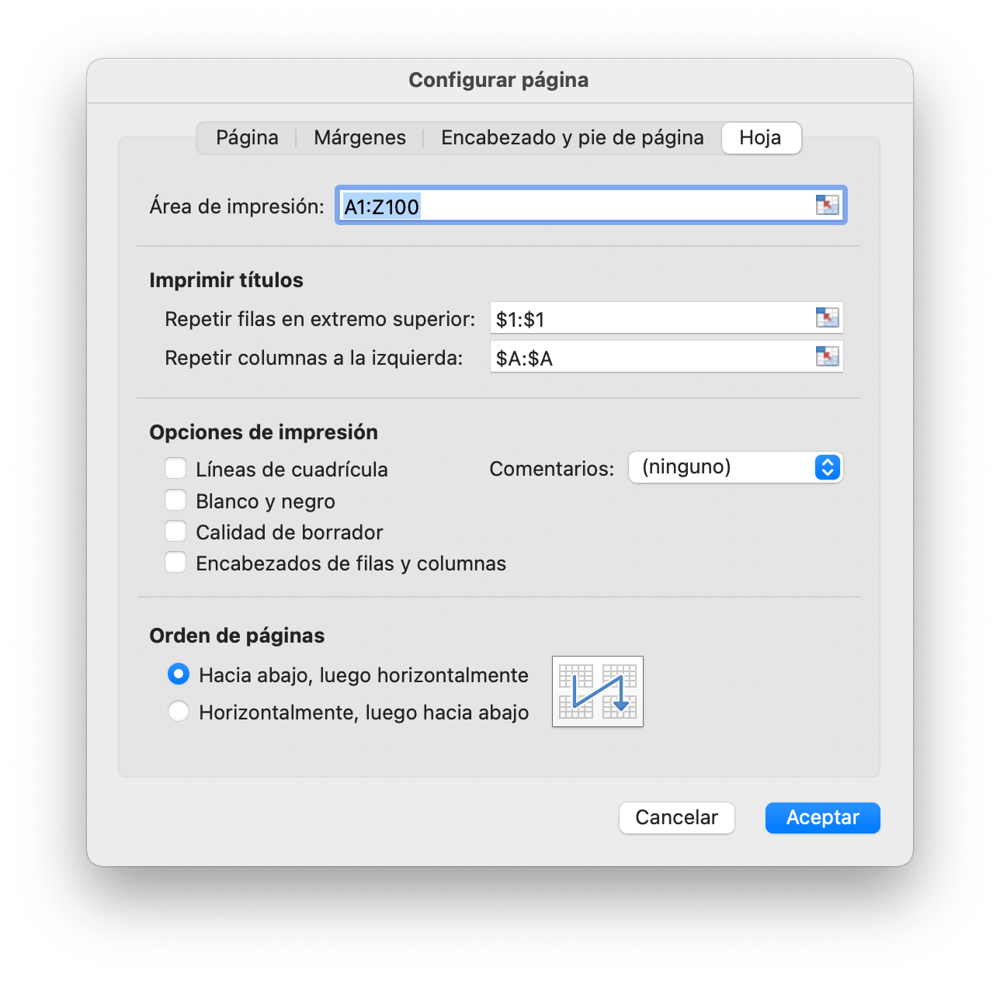

# Libro

`Options` define las opciones para leer y escribir hojas de cálculo.

```go
type Options struct {
    MaxCalcIterations uint
    Password          string
    RawCellValue      bool
    UnzipSizeLimit    int64
    UnzipXMLSizeLimit int64
    ShortDatePattern  string
    LongDatePattern   string
    LongTimePattern   string
    CultureInfo       CultureName
}
```

`MaxCalcIterations` especifica las iteraciones máximas para el cálculo iterativo, el valor predeterminado es 0.

`Password` especifica la contraseña de la hoja de cálculo en texto plano.

`RawCellValue` especifica si se aplica el formato de número para el valor de la celda o se obtiene el valor sin procesar.

`UnzipSizeLimit` especifica el límite de tamaño de descompresión en bytes al abrir la hoja de cálculo, este valor debe ser mayor o igual que `UnzipXMLSizeLimit`, el límite de tamaño predeterminado es 16GB.

`UnzipXMLSizeLimit` especifica el límite de memoria al descomprimir la hoja de trabajo y la tabla de cadenas compartidas en bytes, la hoja de trabajo XML se extraerá al directorio temporal del sistema cuando el tamaño del archivo supere este valor, este valor debe ser menor o igual a `UnzipSizeLimit`, el valor predeterminado El valor es 16MB.

`ShortDatePattern` especifica el código de formato de número de fecha corta. En las aplicaciones de hojas de cálculo, los formatos de fecha muestran números de serie de fecha y hora como valores de fecha. Los formatos de fecha que comienzan con un asterisco (\*) responden a cambios en la configuración regional de fecha y hora que se especifican para el sistema operativo. Los formatos sin asterisco no se ven afectados por la configuración del sistema operativo. El `ShortDatePattern` usado para especifica aplicar formatos de fecha que comienzan con un asterisco.

`LongDatePattern` especifica el código de formato de número de fecha larga.

`LongTimePattern` especifica el código de formato de número de larga duración.

`CultureInfo` especifica el código de país para aplicar el código de formato de número de idioma integrado que se aplica a la configuración de idioma local del sistema.

`HeaderFooterImagePositionType` es el tipo de posición de la imagen de encabezado y pie de página.

```go
type HeaderFooterImagePositionType byte
```

Esta sección define la enumeración de tipos de posición de imágenes de encabezado y pie de página de la hoja de cálculo.

```go
const (
    HeaderFooterImagePositionLeft HeaderFooterImagePositionType = iota
    HeaderFooterImagePositionCenter
    HeaderFooterImagePositionRight
)
```

`CustomProperty` asigna directamente la propiedad personalizada del libro. El tipo de fecha del valor puede ser uno de los siguientes: `int32`, `float64`, `string`, `bool`, `time.Time` o `nil`.

```go
type CustomProperty struct {
    Name  string
    Value interface{}
}
```

`CalcPropsOptions` define la colección de propiedades que utiliza la aplicación para registrar el estado y los detalles del cálculo.

```go
type CalcPropsOptions struct {
    CalcID                *uint
    CalcMode              *string
    FullCalcOnLoad        *bool
    RefMode               *string
    Iterate               *bool
    IterateCount          *uint
    IterateDelta          *float64
    FullPrecision         *bool
    CalcCompleted         *bool
    CalcOnSave            *bool
    ConcurrentCalc        *bool
    ConcurrentManualCount *uint
    ForceFullCalc         *bool
}
```

## Crear una hoja de cálculo {#NewFile}

```go
func NewFile(opts ...Options) *File
```

NewFile proporciona una función para crear un nuevo archivo de forma predeterminada. El libro recién creado contendrá de forma predeterminada una hoja de cálculo denominada `Sheet1`. Por ejemplo:

## Abierto {#OpenFile}

```go
func OpenFile(filename string, opts ...Options) (*File, error)
```

OpenFile toma el nombre de un archivo de hoja de cálculo y devuelve una estructura de archivo de hoja de cálculo rellenada para él. Por ejemplo, abra una hoja de cálculo con protección con contraseña:

```go
f, err := excelize.OpenFile("Book1.xlsx", excelize.Options{Password: "password"})
if err != nil {
    return
}
```

Cierre el archivo por [`Close()`](workbook.md#Close) después de abrir la hoja de cálculo.

## Flujo de datos abiertos {#OpenReader}

```go
func OpenReader(r io.Reader, opts ...Options) (*File, error)
```

OpenReader lee el flujo de datos de `io.Reader` y devuelva un archivo de hoja de cálculo rellenado.

Por ejemplo, cree un servidor HTTP para manejar la plantilla de carga y, a continuación, el archivo de descarga de respuesta con la nueva hoja de cálculo agregada:

```go
package main

import (
    "fmt"
    "net/http"

    "github.com/xuri/excelize/v2"
)

func process(w http.ResponseWriter, req *http.Request) {
    file, _, err := req.FormFile("file")
    if err != nil {
        fmt.Fprint(w, err.Error())
        return
    }
    defer file.Close()
    f, err := excelize.OpenReader(file)
    if err != nil {
        fmt.Fprint(w, err.Error())
        return
    }
    f.Path = "Book1.xlsx"
    f.NewSheet("NewSheet")
    w.Header().Set("Content-Disposition", fmt.Sprintf("attachment; filename=%s", f.Path))
    w.Header().Set("Content-Type", req.Header.Get("Content-Type"))
    if err := f.Write(w); err != nil {
        fmt.Fprint(w, err.Error())
    }
}

func main() {
    http.HandleFunc("/process", process)
    http.ListenAndServe(":8090", nil)
}
```

Prueba con cURL:

```bash
curl --location --request GET 'http://127.0.0.1:8090/process' \
--form 'file=@/tmp/template.xltx' -O -J
```

## Salvar {#Save}

```go
func (f *File) Save(opts ...Options) error
```

Save proporciona una función para invalidar el archivo de hoja de cálculo con la ruta de origen.

## Guardar como {#SaveAs}

```go
func (f *File) SaveAs(name string, opts ...Options) error
```

SaveAs proporciona una función para crear o actualizar el archivo de hoja de cálculo en la ruta proporcionada.

## Cerrar libro de trabajo {#Close}

```go
func (f *File) Close() error
```

Close cierra y limpia el archivo temporal abierto para la hoja de cálculo.

## Crear hoja de trabajo {#NewSheet}

```go
func (f *File) NewSheet(sheet string) (int, error)
```

NewSheet proporciona la función para crear una nueva hoja por un nombre de hoja de cálculo y devuelve el índice de las hojas en el libro (hoja de cálculo) después de anexar. Tenga en cuenta que al crear un nuevo archivo de hoja de cálculo, se creará la hoja de cálculo predeterminada denominada `Sheet1`.

## Eliminar hoja de trabajo {#DeleteSheet}

```go
func (f *File) DeleteSheet(sheet string) error
```

DeleteSheet proporciona una función para eliminar la hoja de trabajo en un libro de trabajo por el nombre de la hoja de trabajo dado, los nombres de las hojas no distinguen entre mayúsculas y minúsculas. Utilice este método con precaución, ya que afectará los cambios en las referencias, como fórmulas, gráficos, etc. Si hay algún valor de referencia de la hoja de cálculo eliminada, se producirá un error de archivo cuando lo abra. Esta función no será válida cuando solo quede una hoja de trabajo.

## Mover hoja de trabajo {#MoveSheet}

```go
func (f *File) MoveSheet(source, target string) error
```

MoveSheet mueve una hoja a una posición específica en el libro de trabajo. La función mueve la hoja de origen antes que la hoja de destino. Después de moverla, las demás hojas se desplazarán hacia la izquierda o hacia la derecha. Si la hoja ya está en la posición de destino, la función no realizará ninguna acción. Tenga en cuenta que esta función desagrupará todas las hojas después de moverla. Por ejemplo, mueva `Hoja2` antes que `Hoja1`:

```go
err := f.MoveSheet("Hoja2", "Hoja1")
```

## Copiar hoja de trabajo {#CopySheet}

```go
func (f *File) CopySheet(from, to int) error
```

CopySheet proporciona una función para duplicar una hoja de cálculo mediante el índice de hoja de cálculo de origen y destino dado. Tenga en cuenta que actualmente no admite libros de trabajo duplicados que contengan tablas, gráficos o imágenes. Por ejemplo:

```go
// Sheet1 ya existe...
index, err := f.NewSheet("Sheet2")
if err != nil {
    fmt.Println(err)
    return
}
err := f.CopySheet(1, index)
```

## Hojas de trabajo grupales {#GroupSheets}

```go
func (f *File) GroupSheets(sheets []string) error
```

GroupSheets proporciona una función para agrupar hojas de trabajo por nombres de hojas de trabajo dados. Las hojas de trabajo grupales deben contener una hoja de trabajo activa.

## Desagrupar hojas de trabajo {#UngroupSheets}

```go
func (f *File) UngroupSheets() error
```

UngroupSheets proporciona una función para desagrupar hojas de trabajo.

## Establecer el fondo de la hoja de trabajo {#SetSheetBackground}

```go
func (f *File) SetSheetBackground(sheet, picture string) error
```

SetSheetBackground proporciona una función para configurar la imagen de fondo según el nombre de la hoja de trabajo y la ruta del archivo. Tipos de imágenes compatibles: BMP, EMF, EMZ, GIF, JPEG, JPG, PNG, SVG, TIF, TIFF, WMF y WMZ.

```go
func (f *File) SetSheetBackgroundFromBytes(sheet, extension string, picture []byte) error
```

SetSheetBackgroundFromBytes proporciona una función para configurar la imagen de fondo según el nombre de la hoja de trabajo, el nombre de la extensión y los datos de la imagen. Tipos de imágenes compatibles: BMP, EMF, EMZ, GIF, JPEG, JPG, PNG, SVG, TIF, TIFF, WMF y WMZ.

## Establecer la hoja de trabajo predeterminada {#SetActiveSheet}

```go
func (f *File) SetActiveSheet(index int)
```

SetActiveSheet proporciona una función para establecer la hoja activa predeterminada del libro por un índice determinado. Tenga en cuenta que el índice activo es diferente del identificador devuelto por la función [`GetSheetMap`](sheet.md#GetSheetMap). Debe ser mayor o igual que 0 y menor que el total de números de hoja de cálculo.

## Obtener índice de hoja activo {#GetActiveSheetIndex}

```go
func (f *File) GetActiveSheetIndex() int
```

GetActiveSheetIndex proporciona una función para obtener una hoja de cálculo activa del libro. Si no se encuentra, la hoja activa devolverá el entero '0'.

## Establecer la hoja de trabajo visible {#SetSheetVisible}

```go
func (f *File) SetSheetVisible(sheet string, visible bool, veryHidden ...bool) error
```

SetSheetVisible proporciona una función para establecer la hoja de cálculo visible por el nombre de la hoja de cálculo dado. Un libro de trabajo debe contener al menos una hoja de cálculo visible. Si se ha activado la hoja de cálculo determinada, esta configuración se invalidará. El tercer parámetro opcional `veryHidden` solo funciona cuando `visible` es `false`.

Por ejemplo, ocultar `Sheet1`:

```go
err := f.SetSheetVisible("Sheet1", false)
```

## Obtener la hoja de trabajo visible {#GetSheetVisible}

```go
func (f *File) GetSheetVisible(sheet string) (bool, error)
```

GetSheetVisible proporciona una función para que la hoja de cálculo sea visible con el nombre de la hoja de cálculo especificado. Por ejemplo, obtenga el estado visible de `Sheet1`:

```go
visible, err := f.GetSheetVisible("Sheet1")
```

## Establecer propiedades de hoja {#SetSheetProps}

```go
func (f *File) SetSheetProps(sheet string, opts *SheetPropsOptions) error
```

SetSheetProps proporciona una función para establecer las propiedades de la hoja de cálculo. Las propiedades que se pueden establecer son:

Opciones|Tipo|Descripción
---|---|---
CodeName                          | `*string`  | Especifica un nombre estable de la hoja, que no debe cambiar con el tiempo y no cambia a partir de la entrada del usuario. Este nombre debe ser utilizado por código para hacer referencia a una hoja en particular
EnableFormatConditionsCalculation | `*bool`    | Indicando si se evaluarán los cálculos de formato condicional. Si se establece en false, los valores mínimos/máximos de las escalas de color o las barras de datos o los valores umbral en las reglas Top N no se actualizarán. Esencialmente, el formato condicional "calc" está desactivado
Published                         | `*bool`    | Indicando si la hoja de cálculo está publicada, el valor predeterminado es `true`
AutoPageBreaks                    | `*bool`    | Indicando si la hoja muestra saltos de página automáticos, el valor predeterminado es `true`
FitToPage                         | `*bool`    | Indicando si la opción de impresión Ajustar a página está habilitada, el valor predeterminado es `false`
TabColorIndexed                   | `*int`     | Representa el valor de color indizado
TabColorRGB                       | `*string`  | Representa el valor de color ARGB (Alpha Red Green Blue) estándar
TabColorTheme                     | `*int`     | Representa el índice basado en cero en la colección, haciendo referencia a un valor determinado expresado en el elemento Tema
TabColorTint                      | `*float64` | Especifica el valor de tinte aplicado al color, el valor predeterminado es `0.0`
OutlineSummaryBelow               | `*bool`    | Indicando si las filas de resumen aparecen debajo del detalle en un esquema, al aplicar un contorno, el valor predeterminado es `true`
OutlineSummaryRight               | `*bool`    | Indicando si las columnas de resumen aparecen a la derecha de detalle en un esquema, al aplicar un esquema, el valor predeterminado es `true`
BaseColWidth                      | `*uint8`   | Especifica el número de caracteres del ancho máximo de dígitos de la fuente del estilo normal. Este valor no incluye el relleno de margen ni el relleno adicional para las líneas de rejilla. Es solo el número de caracteres, el valor predeterminado es `8`
DefaultColWidth                   | `*float64` | Especifica el ancho de columna predeterminado medido como el número de caracteres del ancho máximo de dígitos de la fuente del estilo normal
DefaultRowHeight                  | `*float64` | Especifica la altura de fila predeterminada medida en tamaño de punto. Optimización para que no tengamos que escribir la altura en todas las filas. Esto se puede escribir si la mayoría de las filas tienen altura personalizada, para lograr la optimización
CustomHeight                      | `*bool`    | Especifica la altura personalizada, el valor predeterminado es `false`
ZeroHeight                        | `*bool`    | Especifica que si las filas están ocultas, el valor predeterminado es `false`
ThickTop                          | `*bool`    | Especifica que si las filas tienen un borde superior grueso de forma predeterminada, el valor predeterminado es `false`
ThickBottom                       | `*bool`    | Especifica que si las filas tienen un borde inferior grueso de forma predeterminada, el valor predeterminado es `false`

Por ejemplo, haga que las filas de la hoja de cálculo sean predeterminadas como ocultas:

<p align="center"></p>

```go
f, enable := excelize.NewFile(), true
if err := f.SetSheetProps("Sheet1", &excelize.SheetPropsOptions{
    ZeroHeight: &enable,
}); err != nil {
    fmt.Println(err)
}
if err := f.SetRowVisible("Sheet1", 10, true); err != nil {
    fmt.Println(err)
}
f.SaveAs("Book1.xlsx")
```

Hay 4 tipos de ajustes preestablecidos "Opciones de escala personalizadas" en las aplicaciones de hojas de cálculo, si necesita establecer ese tipo de opciones de escala, utilice las funciones [`SetSheetProps`](workbook.md#SetSheetProps) y [`SetPageLayout`](workbook.md#SetPageLayout) para abordar estas 4 opciones de escala:

1. Sin escala (imprima hojas a su tamaño real):

    ```go
    disable := false
    if err := f.SetSheetProps("Hoja1", &excelize.SheetPropsOptions{
        FitToPage: &disable,
    }); err != nil {
        fmt.Println(err)
    }
    ```

2. Ajustar la hoja en una página (reduzca la impresión para que quepa en una página):

    ```go
    enable := true
    if err := f.SetSheetProps("Hoja1", &excelize.SheetPropsOptions{
        FitToPage: &enable,
    }); err != nil {
        fmt.Println(err)
    }
    ```

3. Ajuste todas las columnas en una página (reduzca la impresión para que tenga una página de ancho):

    ```go
    enable, zero := true, 0
    if err := f.SetSheetProps("Hoja1", &excelize.SheetPropsOptions{
        FitToPage: &enable,
    }); err != nil {
        fmt.Println(err)
    }
    if err := f.SetPageLayout("Hoja1", &excelize.PageLayoutOptions{
        FitToHeight: &zero,
    }); err != nil {
        fmt.Println(err)
    }
    ```

4. Ajuste todas las filas en una página (reduzca la impresión para que tenga una página de altura):

    ```go
    enable, zero := true, 0
    if err := f.SetSheetProps("Hoja1", &excelize.SheetPropsOptions{
        FitToPage: &enable,
    }); err != nil {
        fmt.Println(err)
    }
    if err := f.SetPageLayout("Hoja1", &excelize.PageLayoutOptions{
        FitToWidth: &zero,
    }); err != nil {
        fmt.Println(err)
    }
    ```

## Obtener propiedades de la hoja {#GetSheetProps}

```go
func (f *File) GetSheetProps(sheet string) (SheetPropsOptions, error)
```

GetSheetProps proporciona una función para obtener las propiedades de la hoja de cálculo.

## Establecer propiedades de vista de hoja de cálculo {#SetSheetView}

```go
func (f *File) SetSheetView(sheet string, viewIndex int, opts *ViewOptions) error
```

SetSheetView establece las propiedades de la vista de hoja. El `viewIndex` puede ser negativo y, de ser así, se cuenta hacia atrás (`-1` es la última vista). Las propiedades que se pueden establecer son:

Opciones|Tipo|Descripción
---|---|---
DefaultGridColor  | `*bool`    | Indicando que la aplicación consumidora debe utilizar el color predeterminado de las líneas de cuadrícula (dependiente del sistema). Anula cualquier color especificado en colorId, el valor predeterminado es `true`
RightToLeft       | `*bool`    | Indicando si la hoja está en modo de visualización "de derecha a izquierda". Cuando está en este modo, la columna A está en el extremo derecho, la columna B; es una columna a la izquierda de la columna A, y así sucesivamente. Además, la información en las celdas se muestra en el formato de derecha a izquierda, el valor predeterminado es `false`
ShowFormulas      | `*bool`    | Indicando si esta hoja debe mostrar fórmulas, el valor predeterminado es `false`
ShowGridLines     | `*bool`    | Indicando si esta hoja debe mostrar líneas de cuadrícula, el valor predeterminado es `true`
ShowRowColHeaders | `*bool`    | Indicando si la hoja debe mostrar encabezados de fila y columna, el valor predeterminado es `true`
ShowRuler         | `*bool`    | Indicando que esta hoja debe mostrar la regla, el valor predeterminado es `true`
ShowZeros         | `*bool`    | Indicando si se debe "mostrar un cero en celdas que tienen valor cero". Cuando se utiliza una fórmula para hacer referencia a otra celda que está vacía, el valor referenciado se convierte en `0` cuando el indicador es `true`, el valor predeterminado es `true`
TopLeftCell       | `*string`  | Especifica una ubicación de la celda visible superior izquierda Ubicación de la celda visible superior izquierda en el panel inferior derecho (cuando está en modo de izquierda a derecha)
View              | `*string`  | Indicando cómo se muestra la hoja, por defecto utiliza cadena vacía, opciones disponibles: `normal`, `pageBreakPreview` y `pageLayout`
ZoomScale         | `*float64` | Especifica una ampliación del zoom de ventana para la vista actual que representa los valores porcentuales. Este atributo está restringido a valores que van desde `10` a `400`. Escala horizontal y vertical juntas, el valor predeterminado es `100`

## Obtener propiedades de vista de hoja de cálculo {#GetSheetView}

```go
func (f *File) GetSheetView(sheet string, viewIndex int) (ViewOptions, error)
```

GetSheetView obtiene el valor de las propiedades de la vista de hoja. El `viewIndex` puede ser negativo y, de ser así, se cuenta hacia atrás (`-1` es la última vista).

## Establecer el diseño de la página de la hoja de trabajo {#SetPageLayout}

```go
func (f *File) SetPageLayout(sheet string, opts *PageLayoutOptions) error
```

SetPageLayout proporciona una función para establecer el diseño de página de hoja de cálculo. Opciones disponibles:

`Size` proporciona un método para establecer el tamaño del papel de la hoja de trabajo, el tamaño de papel predeterminado de la hoja de trabajo es "Papel carta (8.5 pulgadas por 11 pulgadas)". A continuación se muestra el tamaño del papel ordenado por el número de índice de Excelize:

Indice|Tamaño del papel
---|---
1   | Papel de carta (8.5 pulgada × 11 pulgada)
2   | Carta de papel pequeño (8.5 pulgada × 11 pulgada)
3   | Papel tabloide (11 pulgada × 17 pulgada)
4   | Papel contable (17 pulgada × 11 pulgada)
5   | Documento legal (8.5 pulgada × 14 pulgada)
6   | Documento de estado de cuenta (5.5 pulgada × 8.5 pulgada)
7   | Documento ejecutivo (7.25 pulgada × 10.5 pulgada)
8   | Papel A3 (297 milímetros × 420 milímetros)
9   | Papel A4 (210 milímetros × 297 milímetros)
10  | Papel pequeño A4 (210 milímetros × 297 milímetros)
11  | Papel A5 (148 milímetros × 210 milímetros)
12  | Papel B4 (250 milímetros × 353 milímetros)
13  | Papel B5 (176 milímetros × 250 milímetros)
14  | Folio papel (8.5 pulgada × 13 pulgada)
15  | Papel de cuarzo (215 milímetros × 275 milímetros)
16  | Papel estándar (10 pulgada × 14 pulgada)
17  | Papel estándar (11 pulgada × 17 pulgada)
18  | Papel de la nota (8.5 pulgada × 11 pulgada)
19  | #9 Sobre (3.875 pulgada × 8.875 pulgada)
20  | #10 Sobre (4.125 pulgada × 9.5 pulgada)
21  | #11 Sobre (4.5 pulgada × 10.375 pulgada)
22  | #12 Sobre (4.75 pulgada × 11 pulgada)
23  | #14 Sobre (5 pulgada × 11.5 pulgada)
24  | C papel (17 pulgada × 22 pulgada)
25  | D papel (22 pulgada × 34 pulgada)
26  | E papel (34 pulgada × 44 pulgada)
27  | DL Sobre (110 milímetros × 220 milímetros)
28  | C5 Sobre (162 milímetros × 229 milímetros)
29  | C3 Sobre (324 milímetros × 458 milímetros)
30  | C4 Sobre (229 milímetros × 324 milímetros)
31  | C6 Sobre (114 milímetros × 162 milímetros)
32  | C65 Sobre (114 milímetros × 229 milímetros)
33  | B4 Sobre (250 milímetros × 353 milímetros)
34  | B5 Sobre (176 milímetros × 250 milímetros)
35  | B6 Sobre (176 milímetros × 125 milímetros)
36  | Italia Sobre (110 milímetros × 230 milímetros)
37  | Monarca Sobre (3.875 pulgada × 7.5 pulgada)
38  | 6¾ Sobre (3.625 pulgada × 6.5 pulgada)
39  | Ventilador estándar de EE. UU. (14.875 pulgada × 11 pulgada)
40  | Ventilador estándar alemán (8.5 pulgada × 12 pulgada)
41  | Fanfold legal alemán (8.5 pulgada × 13 pulgada)
42  | ISO B4 (250 milímetros × 353 milímetros)
43  | Postal japonesa (100 milímetros × 148 milímetros)
44  | Estándar papel (9 pulgada × 11 pulgada)
45  | Estándar papel (10 pulgada × 11 pulgada)
46  | Estándar papel (15 pulgada × 11 pulgada)
47  | Invite Sobre (220 milímetros × 220 milímetros)
50  | Papel extra carta (9.275 pulgada × 12 pulgada)
51  | Documento adicional legal (9.275 pulgada × 15 pulgada)
52  | Papel extra tabloide (11.69 pulgada × 18 pulgada)
53  | A4 papel extra (236 milímetros × 322 milímetros)
54  | Papel transversal de carta (8.275 pulgada × 11 pulgada)
55  | Papel transversal A4 (210 milímetros × 297 milímetros)
56  | Papel transversal adicional carta (9.275 pulgada × 12 pulgada)
57  | SuperA/SuperA/Papel A4 (227 milímetros × 356 milímetros)
58  | SuperB/SuperB/Papel A3 (305 milímetros × 487 milímetros)
59  | Carta más papel (8.5 pulgada × 12.69 pulgada)
60  | Papel A4 más (210 milímetros × 330 milímetros)
61  | A5 papel transversal (148 milímetros × 210 milímetros)
62  | JIS B5 papel transversal (182 milímetros × 257 milímetros)
63  | A3 papel extra (322 milímetros × 445 milímetros)
64  | A5 papel extra (174 milímetros × 235 milímetros)
65  | ISO B5 papel extra (201 milímetros × 276 milímetros)
66  | A2 papel (420 milímetros × 594 milímetros)
67  | A3 papel transversal (297 milímetros × 420 milímetros)
68  | A3 extra papel transversal (322 milímetros × 445 milímetros)
69  | Postal Doble Japonesa (200 milímetros × 148 milímetros)
70  | A6 (105 milímetros × 148 milímetros)
71  | Sobre japonés Kaku #2
72  | Sobre japonés Kaku #3
73  | Sobre japonés Chou #3
74  | Sobre japonés Chou #4
75  | Carta rotada (11 pulgada × 8½ pulgada)
76  | A3 rotada (420 milímetros × 297 milímetros)
77  | A4 rotada (297 milímetros × 210 milímetros)
78  | A5 rotada (210 milímetros × 148 milímetros)
79  | B4 (JIS) rotada (364 milímetros × 257 milímetros)
80  | B5 (JIS) rotada (257 milímetros × 182 milímetros)
81  | Postal Japonesa Rotada (148 milímetros × 100 milímetros)
82  | Doble postal japonesa rotada (148 milímetros × 200 milímetros)
83  | A6 rotada (148 milímetros × 105 milímetros)
84  | Sobre japonés Kaku #2 Rotado
85  | Sobre japonés Kaku #3 Rotado
86  | Sobre japonés Chou #3 Rotado
87  | Sobre japonés Chou #4 Rotado
88  | B6 (JIS) (128 milímetros × 182 milímetros)
89  | B6 (JIS) rotada (182 milímetros × 128 milímetros)
90  | 12 pulgada × 11 pulgada
91  | Sobre japonés que #4
92  | Sobre japonés que #4 rotado
93  | PRC 16K (146 milímetros × 215 milímetros)
94  | PRC 32K (97 milímetros × 151 milímetros)
95  | PRC 32K(Big) (97 milímetros × 151 milímetros)
96  | #1 Sobre de la PRC (102 milímetros × 165 milímetros)
97  | #2 Sobre de la PRC (102 milímetros × 176 milímetros)
98  | #3 Sobre de la PRC (125 milímetros × 176 milímetros)
99  | #4 Sobre de la PRC (110 milímetros × 208 milímetros)
100 | #5 Sobre de la PRC (110 milímetros × 220 milímetros)
101 | #6 Sobre de la PRC (120 milímetros × 230 milímetros)
102 | #7 Sobre de la PRC (160 milímetros × 230 milímetros)
103 | #8 Sobre de la PRC (120 milímetros × 309 milímetros)
104 | #9 Sobre de la PRC (229 milímetros × 324 milímetros)
105 | #10 Sobre de la PRC (324 milímetros × 458 milímetros)
106 | PRC 16K rotada
107 | PRC 32K rotada
108 | PRC 32K(Big) rotada
109 | Sobre PRC #1 rota (165 milímetros × 102 milímetros)
110 | Sobre PRC #2 rota (176 milímetros × 102 milímetros)
111 | Sobre PRC #3 rota (176 milímetros × 125 milímetros)
112 | Sobre PRC #4 rota (208 milímetros × 110 milímetros)
113 | Sobre PRC #5 rota (220 milímetros × 110 milímetros)
114 | Sobre PRC #6 rota (230 milímetros × 120 milímetros)
115 | Sobre PRC #7 rota (230 milímetros × 160 milímetros)
116 | Sobre PRC #8 rota (309 milímetros × 120 milímetros)
117 | Sobre PRC #9 rota (324 milímetros × 229 milímetros)
118 | Sobre PRC #10 rota (458 milímetros × 324 milímetros)

`Orientación` especificó la orientación de la hoja de cálculo, la orientación predeterminada es `portrait`. Los valores posibles para este campo son `portrait` y `landscape`.

`FirstPageNumber` especificó el primer número de página impreso. Si no se especifica ningún valor, se asume "automático".

`AdjustTo` especificó la escala de impresión. Este atributo está restringido a valores que van desde 10 (10%) a 400 (400%). Esta configuración se anula cuando `FitToWidth` y/o `FitToHeight` están en uso.

`FitToHeight` especificaba el número de páginas verticales en las que cabría.

`FitToWidth` especificaba el número de páginas horizontales en las que cabría.

`BlackAndWhite` especificó la impresión en blanco y negro.

`PageOrder` especifica el orden de varias páginas. Valores aceptados: `overThenDown` y `downThenOver`.

Por ejemplo, configure el diseño de página para `Sheet1` con impresión en blanco y negro, primer número de página impresa desde `2`, papel pequeño A4 horizontal (210 mm por 297 mm), 2 páginas verticales para ajustar, 2 páginas verticales para encajar y 2 páginas horizontales para encajar:

```go
f := excelize.NewFile()
var (
    size                 = 10
    orientation          = "landscape"
    firstPageNumber uint = 2
    adjustTo        uint = 100
    fitToHeight          = 2
    fitToWidth           = 2
    blackAndWhite        = true
)
if err := f.SetPageLayout("Sheet1", &excelize.PageLayoutOptions{
    Size:            &size,
    Orientation:     &orientation,
    FirstPageNumber: &firstPageNumber,
    AdjustTo:        &adjustTo,
    FitToHeight:     &fitToHeight,
    FitToWidth:      &fitToWidth,
    BlackAndWhite:   &blackAndWhite,
}); err != nil {
    fmt.Println(err)
}
```

## Obtener el diseño de la página de la hoja de trabajo {#GetPageLayout}

```go
func (f *File) GetPageLayout(sheet string) (PageLayoutOptions, error)
```

GetPageLayout proporciona una función para obtener el diseño de página de la hoja de cálculo.

## Establecer márgenes de página de hoja de cálculo {#SetPageMargins}

```go
func (f *File) SetPageMargins(sheet string, opts *PageLayoutMarginsOptions) error
```

SetPageMargins proporciona una función para establecer los márgenes de la página de la hoja de cálculo. Opciones disponibles:

Opciones|Tipo|Descripción
---|---|---
Bottom       | `*float64` | Abajo
Footer       | `*float64` | Pie de página
Header       | `*float64` | Encabezado
Left         | `*float64` | Izquierda
Right        | `*float64` | Derecha
Top          | `*float64` | Arriba
Horizontally | `*bool`    | Centrar en la página: Horizontalmente
Vertically   | `*bool`    | Centrar en la página: Verticalmente

## Obtener márgenes de página de la hoja de trabajo {#GetPageMargins}

```go
func (f *File) GetPageMargins(sheet string) (PageLayoutMarginsOptions, error)
```

GetPageMargins proporciona una función para obtener márgenes de página de hoja de cálculo.

## Establecer las propiedades del libro de trabajo {#SetWorkbookProps}

```go
func (f *File) SetWorkbookProps(opts *WorkbookPropsOptions) error
```

SetWorkbookProps proporciona una función para establecer las propiedades del libro. Opciones Disponibles:

Opciones|Tipo|Descripción
---|---|---
Date1904      | `*bool`   | Indica si se debe usar un sistema de fechas de 1900 o 1904 al convertir fechas y horas en serie en el libro de trabajo a fechas.
FilterPrivacy | `*bool`   | Especifica un valor booleano que indica si la aplicación ha inspeccionado el libro en busca de información de identificación personal (PII). Si se establece este indicador, la aplicación advierte al usuario cada vez que realiza una acción que insertará PII en el documento.
CodeName      | `*string` | Especifica el nombre en clave de la aplicación que creó este libro. Utilice este atributo para realizar un seguimiento del contenido del archivo en las versiones incrementales de la aplicación.

## Obtener propiedades del libro de trabajo {#GetWorkbookProps}

```go
func (f *File) GetWorkbookProps() (WorkbookPropsOptions, error)
```

GetWorkbookProps proporciona una función para obtener las propiedades del libro de trabajo.

## Establecer encabezado y pie de página {#SetHeaderFooter}

```go
func (f *File) SetHeaderFooter(sheet string, opts *HeaderFooterOptions) error
```

SetHeaderFooter proporciona una función para establecer encabezados y pies de página por el nombre de la hoja de cálculo y los caracteres de control.

Los encabezados y pies de página se especifican mediante los siguientes campos de configuración:

Campos           | Descripción
---|---
AlignWithMargins | Alinee los márgenes de pie de página de encabezado con los márgenes de página
DifferentFirst   | Diferente indicador de encabezado y pie de página de primera página
DifferentOddEven | Diferente indicador de encabezados y pies de página impares e pares
ScaleWithDoc     | Escalar encabezado y pie de página con escalado de documentos
OddFooter        | Pie de página impar o pie de página principal si `DifferentOddEven` es `false`
OddHeader        | Encabezado impar o encabezado de página principal si `DifferentOddEven` es `false`
EvenFooter       | Pie de página par
EvenHeader       | Incluso encabezado de página
FirstFooter      | Primer pie de página
FirstHeader      | Encabezado de la primera página

Los siguientes códigos de formato se pueden utilizar en 6 campos de tipo de cadena: `OddHeader`, `OddFooter`, `EvenHeader`, `EvenFooter`, `FirstFooter`, `FirstHeader`

<table>
    <thead>
        <tr>
            <th>Formato de código</th>
            <th>Descripción</th>
        </tr>
    </thead>
    <tbody>
        <tr>
            <td><code>&amp;&amp;</code></td>
            <td>El personaje &quot;&amp;&quot;</td>
        </tr>
        <tr>
            <td><code>&amp;font-size</code></td>
            <td>Tamaño de la fuente de texto, donde el tamaño de fuente es un tamaño de fuente decimal en puntos</td>
        </tr>
        <tr>
            <td><code>&amp;&quot;font name,font type&quot;</code></td>
            <td>Una cadena de nombre de fuente de texto, un nombre de fuente y una cadena de tipo de fuente de texto, tipo de fuente</td>
        </tr>
        <tr>
            <td><code>&amp;&quot;-,Regular&quot;</code></td>
            <td>Formato de texto normal. Alterna los modos en negrita y cursiva a desactivados</td>
        </tr>
        <tr>
            <td><code>&amp;A</code></td>
            <td>Nombre de la pestaña de la hoja de trabajo actual</td>
        </tr>
        <tr>
            <td><code>&amp;B</code> or <code>&amp;&quot;-,Bold&quot;</code></td>
            <td>Formato de texto en negrita, de apagado a en adelante, o viceversa. El modo predeterminado está desactivado</td>
        </tr>
        <tr>
            <td><code>&amp;D</code></td>
            <td>Fecha actual</td>
        </tr>
        <tr>
            <td><code>&amp;C</code></td>
            <td>Sección central</td>
        </tr>
        <tr>
            <td><code>&amp;E</code></td>
            <td>Formato de texto de subrayado doble</td>
        </tr>
        <tr>
            <td><code>&amp;F</code></td>
            <td>Nombre de archivo del libro de trabajo actual</td>
        </tr>
        <tr>
            <td><code>&amp;G</code></td>
            <td>Dibujar objeto como fondo (Utilice AddHeaderFooterImage)</td>
        </tr>
        <tr>
            <td><code>&amp;H</code></td>
            <td>Formato de texto de sombra</td>
        </tr>
        <tr>
            <td><code>&amp;I</code> or <code>&amp;&quot;-,Italic&quot;</code></td>
            <td>Formato de texto en cursiva</td>
        </tr>
        <tr>
            <td><code>&amp;K</code></td>
            <td>Color de fuente de texto<br>Un color RGB se especifica como RRGGBB<br>Un color de tema se especifica como TTSNNN donde TT es el identificador de color del tema, S es &quot;+&quot; o &quot;-&quot; del valor de tinte/sombra, y NNN es el valor de tinte/sombra</td>
        </tr>
        <tr>
            <td><code>&amp;L</code></td>
            <td>Sección izquierda</td>
        </tr>
        <tr>
            <td><code>&amp;N</code></td>
            <td>Número total de páginas</td>
        </tr>
        <tr>
            <td><code>&amp;O</code></td>
            <td>Formato de texto de esquema</td>
        </tr>
        <tr>
            <td><code>&amp;P[[+\|-]n]</code></td>
            <td>Sin el sufijo opcional, el número de página actual en decimal</td>
        </tr>
        <tr>
            <td><code>&amp;R</code></td>
            <td>Sección derecha</td>
        </tr>
        <tr>
            <td><code>&amp;S</code></td>
            <td>Formato de texto tachado</td>
        </tr>
        <tr>
            <td><code>&amp;T</code></td>
            <td>Hora actual</td>
        </tr>
        <tr>
            <td><code>&amp;U</code></td>
            <td>Formato de texto de subrayado único. Si el modo de subrayado doble está activado, la siguiente aparición en un especificador de sección cambia el modo de subrayado doble a desactivado; de lo contrario, alterna el modo de subrayado único, de apagado a encendido, o viceversa. El modo predeterminado está desactivado</td>
        </tr>
        <tr>
            <td><code>&amp;X</code></td>
            <td>Formato de texto superíndice</td>
        </tr>
        <tr>
            <td><code>&amp;Y</code></td>
            <td>Formato de texto de subíndice</td>
        </tr>
        <tr>
            <td><code>&amp;Z</code></td>
            <td>Current workbook&#39;s file path</td>
        </tr>
    </tbody>
</table>

Por ejemplo:

```go
err := f.SetHeaderFooter("Sheet1", &excelize.HeaderFooterOptions{
    DifferentFirst:   true,
    DifferentOddEven: true,
    OddHeader:        "&R&P",
    OddFooter:        "&C&F",
    EvenHeader:       "&L&P",
    EvenFooter:       "&L&D&R&T",
    FirstHeader:      `&CCenter &"-,Bold"Bold&"-,Regular"HeaderU+000A&D`,
})
```

Este ejemplo muestra:

- La primera página tiene su propio encabezado y pie de página
- Las páginas impares e pares tienen diferentes encabezados y pies de página
- Número de página actual en la sección derecha de los encabezados de página impar
- Nombre de archivo del libro de trabajo actual en la sección central de pies de página impar
- Número de página actual en la sección izquierda de encabezados de página par
- Fecha actual en la sección izquierda y la hora actual en la sección derecha de pies de página pares
- El texto "Center Bold Header" en la primera línea de la sección central de la primera página, y la fecha en la segunda línea de la sección central de esa misma página
- No hay pie de página en la primera página

## Agregar imagen de encabezado y pie de página {#AddHeaderFooterImage}

```go
func (f *File) AddHeaderFooterImage(sheet string, opts *HeaderFooterImageOptions) error
```

AddHeaderFooterImage proporciona un mecanismo para establecer los gráficos a los que se puede hacer referencia en las definiciones de encabezado y pie de página a través de `&G`, tipos de imágenes admitidos: EMF, EMZ, GIF, JPEG, JPG, PNG, SVG, TIF, TIFF, WMF y WMZ.

## Establecer nombre definido {#SetDefinedName}

```go
func (f *File) SetDefinedName(definedName *DefinedName) error
```

SetDefinedName proporciona una función para establecer los nombres definidos del libro o la hoja de cálculo. Si no se especifica el ámbito, el ámbito predeterminado es el libro. Por ejemplo:

```go
err := f.SetDefinedName(&excelize.DefinedName{
    Name:     "Amount",
    RefersTo: "Hoja1!$A$2:$D$5",
    Comment:  "defined name comment",
    Scope:    "Hoja2",
})
```

Configuración del área de impresión e impresión de títulos para la hoja de trabajo:

<p align="center"></p>

```go
if err := f.SetDefinedName(&excelize.DefinedName{
    Name:     "_xlnm.Print_Area",
    RefersTo: "Hoja1!$A$1:$Z$100",
    Scope:    "Hoja1",
}); err != nil {
    fmt.Println(err)
}
if err := f.SetDefinedName(&excelize.DefinedName{
    Name:     "_xlnm.Print_Titles",
    RefersTo: "Hoja1!$A:$A,Hoja1!$1:$1",
    Scope:    "Hoja1",
}); err != nil {
    fmt.Println(err)
}
```

Si completa la propiedad `RefersTo` con un solo rango de columnas sin coma, funcionará solo como "Columnas para repetir a la izquierda". Por ejemplo:

```go
if err := f.SetDefinedName(&excelize.DefinedName{
    Name:     "_xlnm.Print_Titles",
    RefersTo: "Hoja1!$A:$A",
    Scope:    "Hoja1",
}); err != nil {
    fmt.Println(err)
}
```

Si completa la propiedad `RefersTo` con un solo rango de filas sin coma, funcionará solo como "Filas para repetir en la parte superior". Por ejemplo:

```go
if err := f.SetDefinedName(&excelize.DefinedName{
    Name:     "_xlnm.Print_Titles",
    RefersTo: "Hoja1!$1:$1",
    Scope:    "Hoja1",
}); err != nil {
    fmt.Println(err)
}
```

## Obtener el nombre definido {#GetDefinedName}

```go
func (f *File) GetDefinedName() []DefinedName
```

GetDefinedName proporciona una función para obtener los nombres definidos del libro o la hoja de cálculo.

## Eliminar nombre definido {#DeleteDefinedName}

```go
func (f *File) DeleteDefinedName(definedName *DefinedName) error
```

DeleteDefinedName proporciona una función para eliminar los nombres definidos del libro o la hoja de cálculo. Si no se especifica el ámbito, el ámbito predeterminado es el libro. Por ejemplo:

```go
err := f.DeleteDefinedName(&excelize.DefinedName{
    Name:     "Amount",
    Scope:    "Hoja2",
})
```

## Establecer propiedades de la aplicación {#SetAppProps}

```go
func (f *File) SetAppProps(appProperties *AppProperties) error
```

SetAppProps proporciona una función para establecer las propiedades de la aplicación de documentos. Las propiedades que se pueden configurar son:

Propiedad      | Descripción
---|---
Application       | El nombre de la aplicación que creó este documento.
ScaleCrop         | Indica el modo de visualización de la miniatura del documento. Establezca este elemento en `true` para habilitar la escala de la miniatura del documento en la pantalla. Establezca este elemento en `false` para permitir el recorte de la miniatura del documento para mostrar solo las secciones que se ajustarán a la pantalla.
DocSecurity       | Nivel de seguridad de un documento como valor numérico. La seguridad del documento se define como:<br>1 - El documento está protegido con contraseña.<br>2 - Se recomienda abrir el documento como de solo lectura.<br>3 - El documento debe abrirse como de solo lectura.<Br >4 - el documento está bloqueado para anotaciones.
Company           | The name of a company associated with the document.
LinksUpToDate     | Indica si los hipervínculos de un documento están actualizados. Establezca este elemento en `true` para indicar que los hipervínculos están actualizados. Establezca este elemento en `false` para indicar que los hipervínculos están desactualizados.
HyperlinksChanged | Especifica que uno o más hipervínculos en esta parte fueron actualizados exclusivamente en esta parte por un productor. El próximo productor que abra este documento deberá actualizar las relaciones de hipervínculos con los nuevos hipervínculos especificados en esta parte.
AppVersion        | Especifica la versión de la aplicación que produjo este documento. El contenido de este elemento tendrá la forma XX.YYYY donde X e Y representan valores numéricos, o el documento se considerará no conforme.

Por ejemplo:

```go
err := f.SetAppProps(&excelize.AppProperties{
    Application:       "Microsoft Excel",
    ScaleCrop:         true,
    DocSecurity:       3,
    Company:           "Company Name",
    LinksUpToDate:     true,
    HyperlinksChanged: true,
    AppVersion:        "16.0000",
})
```

## Obtener propiedades de la aplicación {#GetAppProps}

```go
func (f *File) GetAppProps() (*AppProperties, error)
```

GetAppProps proporciona una función para obtener propiedades de la aplicación de documentos.

## Establecer las propiedades del documento {#SetDocProps}

```go
func (f *File) SetDocProps(docProperties *DocProperties) error
```

SetDocProps proporciona una función para establecer las propiedades del núcleo del documento. Las propiedades que se pueden establecer son:

Propiedad      | Descripción
---|---
Category       | Una categorización del contenido de este paquete.
ContentStatus  | El estado del contenido. Por ejemplo, los valores pueden incluir "Draft", "Reviewed" y "Final".
Created        | La hora de modificación del contenido del recurso.
Creator        | Una entidad responsable principal de hacer que el contenido del recurso.
Description    | Una explicación del contenido del recurso.
Identifier     | Una referencia inequívoca al recurso dentro de un contexto determinado.
Keywords       | Un conjunto delimitado de palabras clave para admitir la búsqueda y la indexación. Normalmente se trata de una lista de términos que no están disponibles en otras partes de las propiedades.
Language       | El lenguaje del contenido intelectual del recurso.
LastModifiedBy | El usuario que realizó la última modificación. La identificación es específica del entorno.
Modified       | La hora de modificación del contenido del recurso.
Revision       | El número de revisión del contenido del recurso.
Subject        | El tema del contenido del recurso.
Title          | El nombre se dio al recurso.
Version        | El número de versión. Este valor lo establece el usuario o la aplicación.

Por ejemplo:

```go
err := f.SetDocProps(&excelize.DocProperties{
    Category:       "category",
    ContentStatus:  "Draft",
    Created:        "2019-06-04T22:00:10Z",
    Creator:        "Go Excelize",
    Description:    "This file created by Go Excelize",
    Identifier:     "xlsx",
    Keywords:       "Spreadsheet",
    LastModifiedBy: "Go Author",
    Modified:       "2019-06-04T22:00:10Z",
    Revision:       "0",
    Subject:        "Test Subject",
    Title:          "Test Title",
    Language:       "en-US",
    Version:        "1.0.0",
})
```

## Obtener propiedades del documento {#GetDocProps}

```go
func (f *File) GetDocProps() (*DocProperties, error)
```

GetDocProps proporciona una función para obtener las propiedades principales del documento.

## Establecer propiedades personalizadas {#SetCustomProps}

```go
func (f *File) SetCustomProps(prop CustomProperty) error
```

SetCustomProps proporciona una función para establecer propiedades de archivo personalizadas según el nombre y el valor de la propiedad. Si el nombre de la propiedad ya existe, se actualizará; de lo contrario, se añadirá una nueva. El valor puede ser de tipo `int32`, `float64`, `bool`, `string`, `time.Time` o `nil`. La propiedad se eliminará si el valor es `nil`. La función devuelve un error si el valor de la propiedad no es del tipo correcto.

## Obtenga propiedades personalizadas {#GetCustomProps}

```go
func (f *File) GetCustomProps() ([]CustomProperty, error)
```

GetCustomProps proporciona una función para obtener propiedades de archivos personalizadas.

## Establecer propiedades de cálculo {#SetCalcProps}

```go
func (f *File) SetCalcProps(opts *CalcPropsOptions) error
```

SetCalcProps proporciona una función para establecer propiedades de cálculo.

El valor opcional de la propiedad `CalcMode` es: `manual`, `auto` o `autoNoTable`.

El valor opcional de la propiedad `RefMode` es: `A1` o `R1C1`.

## Obtener propiedades de cálculo {#GetCalcProps}

```go
func (f *File) GetCalcProps() (CalcPropsOptions, error)
```

GetCalcProps proporciona una función para obtener propiedades de cálculo.

## Proteger el libro de trabajo {#ProtectWorkbook}

```go
func (f *File) ProtectWorkbook(opts *WorkbookProtectionOptions) error
```

ProtectWorkbook proporciona una función para evitar que otros usuarios cambien, muevan o eliminen datos en un libro de forma accidental o deliberada. El algoritmo hash especificado del campo opcional `AlgorithmName`, compatible con XOR, MD4, MD5, SHA-1, SHA2-56, SHA-384 y SHA-512 actualmente, si no se especifica ningún algoritmo hash, utilizará el algoritmo XOR de forma predeterminada. Por ejemplo, proteja el libro de trabajo con la configuración de protección:

```go
err := f.ProtectWorkbook(&excelize.WorkbookProtectionOptions{
    Password:      "password",
    LockStructure: true,
})
```

WorkbookProtectionOptions asigna directamente la configuración de la protección del libro.

```go
type WorkbookProtectionOptions struct {
    AlgorithmName string
    Password      string
    LockStructure bool
    LockWindows   bool
}
```

## Desproteger libro de trabajo {#UnprotectWorkbook}

```go
func (f *File) UnprotectWorkbook(password ...string) error
```

UnprotectWorkbook proporciona una función para eliminar la protección del libro de trabajo, especificó el parámetro de contraseña opcional para eliminar la protección del libro de trabajo con verificación de contraseña.
