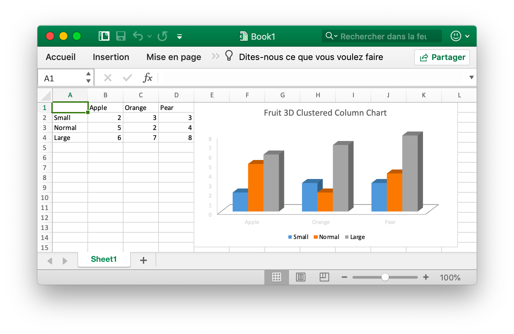

# Utilisation basique

## Installation {#install}

L'utilisation de la dernière version de la bibliothèque Excelize nécessite Go version 1.15 ou ultérieure.

- Installation

```bash
go get github.com/xuri/excelize
```

- Si votre gestion de package avec des [Go Modules](https://blog.golang.org/using-go-modules), veuillez installer avec la commande suivante.

```bash
go get github.com/xuri/excelize/v2
```

## Mise à niveau {#update}

- Mise à niveau

```bash
go get -u github.com/xuri/excelize/v2
```

## Créer un document Excel {#NewFile}

Voici un exemple d'utilisation minimale qui créera le fichier XLSX:

```go
package main

import (
    "fmt"

    "github.com/xuri/excelize/v2"
)

func main() {
    f := excelize.NewFile()
    // Créer une nouvelle feuille.
    index := f.NewSheet("Sheet2")
    // Définir la valeur d'une cellule.
    f.SetCellValue("Sheet2", "A2", "Hello world.")
    f.SetCellValue("Sheet1", "B2", 100)
    // Définir la feuille active du classeur.
    f.SetActiveSheet(index)
    // Enregistrer le fichier xlsx par le chemin donné.
    if err := f.SaveAs("Book1.xlsx"); err != nil {
        fmt.Println(err)
    }
}
```

## Lire un document Excel {#read}

Ce qui suit constitue le seul à lire un document XLSX:

```go
package main

import (
    "fmt"

    "github.com/xuri/excelize/v2"
)

func main() {
    f, err := excelize.OpenFile("Book1.xlsx")
    if err != nil {
        fmt.Println(err)
        return
    }
    // Obtenir la valeur de la cellule par nom de feuille de calcul donné et axe.
    cell, err := f.GetCellValue("Sheet1", "B2")
    if err != nil {
        fmt.Println(err)
        return
    }
    fmt.Println(cell)
    // Obtenez toutes les lignes de la feuille Sheet1.
    rows, err := f.GetRows("Sheet1")
    for _, row := range rows {
        for _, colCell := range row {
            fmt.Print(colCell, "\t")
        }
        fmt.Println()
    }
    if err = f.Close(); err != nil {
        fmt.Println(err)
    }
}
```

## Ajouter un graphique au document Excel {#chart}

Avec Excelize, la génération et la gestion des graphiques est aussi simple que quelques lignes de code. Vous pouvez créer des graphiques basés sur des données dans votre feuille de calcul ou générer des graphiques sans aucune donnée dans votre feuille de calcul.

<p align="center"></p>

```go
package main

import (
    "fmt"

    "github.com/xuri/excelize/v2"
)

func main() {
    categories := map[string]string{
        "A2": "Small", "A3": "Normal", "A4": "Large", "B1": "Apple", "C1": "Orange", "D1": "Pear"}
    values := map[string]int{
        "B2": 2, "C2": 3, "D2": 3, "B3": 5, "C3": 2, "D3": 4, "B4": 6, "C4": 7, "D4": 8}
    f := excelize.NewFile()
    for k, v := range categories {
        f.SetCellValue("Sheet1", k, v)
    }
    for k, v := range values {
        f.SetCellValue("Sheet1", k, v)
    }
    if err := f.AddChart("Sheet1", "E1", `{
        "type": "col3DClustered",
        "series": [
        {
            "name": "Sheet1!$A$2",
            "categories": "Sheet1!$B$1:$D$1",
            "values": "Sheet1!$B$2:$D$2"
        },
        {
            "name": "Sheet1!$A$3",
            "categories": "Sheet1!$B$1:$D$1",
            "values": "Sheet1!$B$3:$D$3"
        },
        {
            "name": "Sheet1!$A$4",
            "categories": "Sheet1!$B$1:$D$1",
            "values": "Sheet1!$B$4:$D$4"
        }],
        "title":
        {
            "name": "Fruit 3D Clustered Column Chart"
        }
    }`); err != nil {
        fmt.Println(err)
        return
    }
    // Enregistrez le fichier xlsx par le chemin donné.
    if err := f.SaveAs("Book1.xlsx"); err != nil {
        fmt.Println(err)
    }
}
```

## Ajouter l'image au document Excel {#image}

```go
package main

import (
    "fmt"
    _ "image/gif"
    _ "image/jpeg"
    _ "image/png"

    "github.com/xuri/excelize/v2"
)

func main() {
    f, err := excelize.OpenFile("Book1.xlsx")
    if err != nil {
        fmt.Println(err)
        return
    }
    // Insérer une image.
    if err := f.AddPicture("Sheet1", "A2", "image.png", ""); err != nil {
        fmt.Println(err)
    }
    // Insérer une image dans une feuille de calcul avec mise à l'échelle.
    if err := f.AddPicture("Sheet1", "D2", "image.jpg", `{
        "x_scale": 0.5,
        "y_scale": 0.5
    }`); err != nil {
        fmt.Println(err)
    }
    // Insérer un décalage d'image dans la cellule avec support d'impression.
    if err := f.AddPicture("Sheet1", "H2", "image.gif", `{
        "x_offset": 15,
        "y_offset": 10,
        "print_obj": true,
        "lock_aspect_ratio": false,
        "locked": false
    }`); err != nil {
        fmt.Println(err)
    }
    // Enregistrez le fichier xlsx avec le chemin d'origine.
    if err = f.Save(); err != nil {
        fmt.Println(err)
    }
    if err = f.Close(); err != nil {
        fmt.Println(err)
    }
}
```
