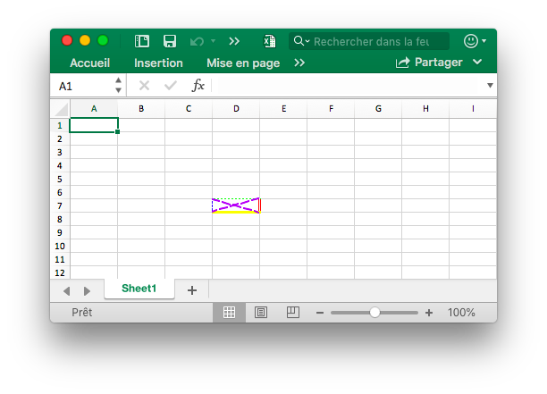
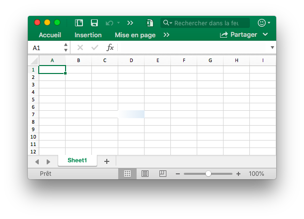
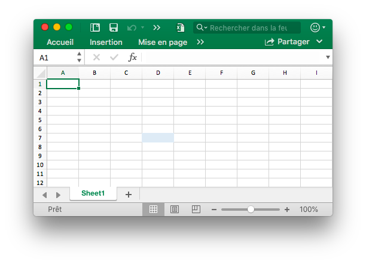
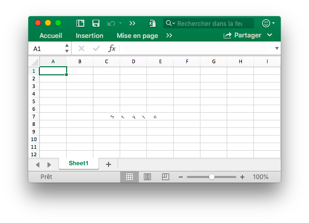
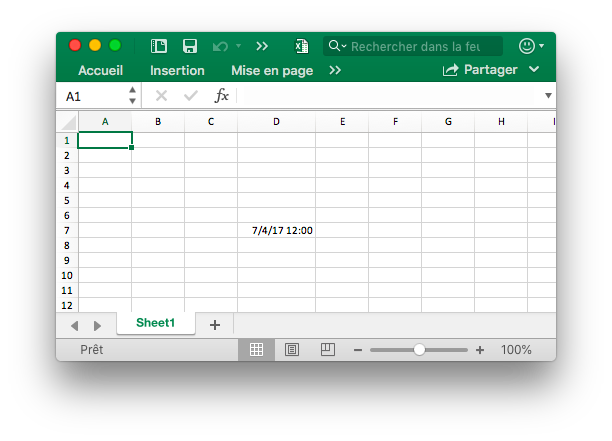
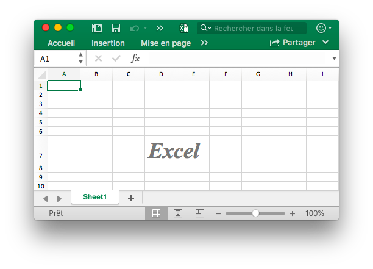
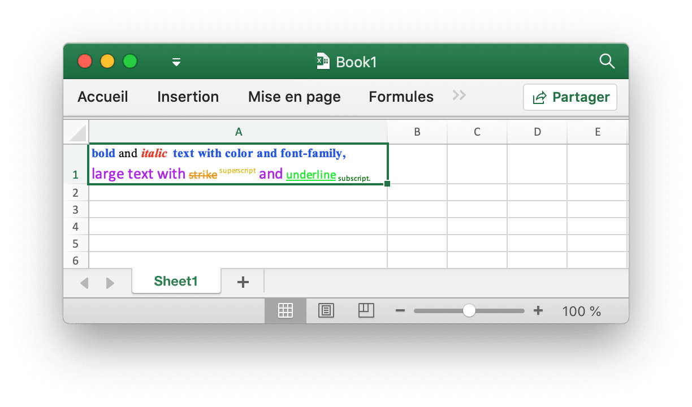
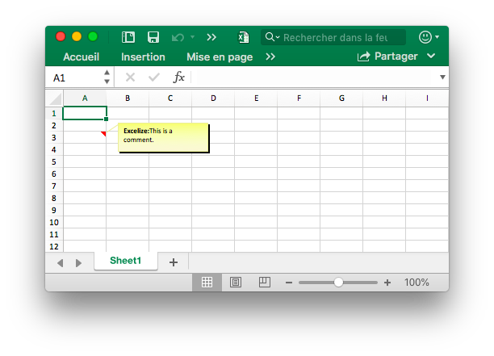

# Cellule

RichTextRun mappe directement les paramètres de l'exécution de texte riche.

```go
type RichTextRun struct {
    Font *Font
    Text string
}
```

HyperlinkOpts peut être transmis à [`SetCellHyperlink`](cell.md#SetCellHyperlink) pour définir des attributs de lien hypertexte facultatifs (par exemple, le texte à afficher et le texte de l'info-bulle à l'écran).

```go
type HyperlinkOpts struct {
    Display *string
    Tooltip *string
}
```

FormulaOpts peut être transmis à [`SetCellFormula`](cell.md#SetCellFormula) pour utiliser d’autres types de formules.

```go
type FormulaOpts struct {
    Type *string // Type de formule
    Ref  *string // Référence de formule partagée
}
```

## Définir la valeur de la cellule {#SetCellValue}

```go
func (f *File) SetCellValue(sheet, axis string, value interface{}) error
```

SetCellValue fournit une fonction pour définir la valeur d'une cellule. Les coordonnées spécifiées ne doivent pas figurer dans la première ligne du tableau. Voici les types de données pris en charge:

|Types de données pris en charge|
|---|
|int|
|int8|
|int16|
|int32|
|int64|
|uint|
|uint8|
|uint16|
|uint32|
|uint64|
|float32|
|float64|
|string|
|[]byte|
|time.Duration|
|time.Time|
|bool|
|nil|

Notez que le format de date par défaut est `m/d/yy h:mm` de la valeur de type `time.Time`. Vous pouvez définir le format des nombres par la méthode [`SetCellStyle`](cell.md#SetCellStyle). Si vous devez définir la date spécialisée dans Excel comme le 0 janvier 1900 ou le 29 février 1900, ces heures ne peuvent pas être représentées dans le type de données `time.Time` du langage Go. Veuillez définir la valeur de la cellule sur le nombre 0 ou 60, puis créez et liez le style de format de nombre date-heure pour la cellule.

## Définir la valeur booléenne {#SetCellBool}

```go
func (f *File) SetCellBool(sheet, axis string, value bool) error
```

SetCellBool fournit une fonction pour définir la valeur du type booléen d'une cellule par nom de feuille de calcul donné, coordonnées de cellule et valeur de cellule.

## Définir la valeur RAW {#SetCellDefault}

```go
func (f *File) SetCellDefault(sheet, axis, value string) error
```

SetCellDefault fournit une fonction pour définir la valeur de type chaîne d'une cellule comme format par défaut sans échapper à la cellule.

## Définir la valeur entière {#SetCellInt}

```go
func (f *File) SetCellInt(sheet, axis string, value int) error
```

SetCellInt fournit une fonction pour définir la valeur de type int d'une cellule par nom de feuille de calcul donné, coordonnées de cellule et valeur de cellule.

## Définir la valeur de chaîne {#SetCellStr}

```go
func (f *File) SetCellStr(sheet, axis, value string) error
```

SetCellStr fournit une fonction pour définir la valeur du type de chaîne d'une cellule. Nombre total de caractères qu'une cellule peut contenir `32767`.

## Définir le style de cellule {#SetCellStyle}

```go
func (f *File) SetCellStyle(sheet, hCell, vCell string, styleID int) error
```

SetCellStyle fournit la fonction pour ajouter l'attribut de style pour les cellules par nom de feuille de calcul donné, zone de coordonnées et ID de style. Les index de style peuvent être obtenus avec la fonction [`NewStyle`](style.md#NewStyle). Notez que les bordures de type `diagonalDown` et` diagonalUp` doivent utiliser la même couleur dans la même zone de coordonnées. SetCellStyle écrasera les styles existants pour la cellule, il n'ajoutera ni ne fusionnera le style avec les styles existants.

- Exemple 1, créez une bordure de la cellule `D7` sur `Sheet1`:

```go
style, err := f.NewStyle(&excelize.Style{
    Border: []excelize.Border{
        {Type: "left", Color: "0000FF", Style: 3},
        {Type: "top", Color: "00FF00", Style: 4},
        {Type: "bottom", Color: "FFFF00", Style: 5},
        {Type: "right", Color: "FF0000", Style: 6},
        {Type: "diagonalDown", Color: "A020F0", Style: 7},
        {Type: "diagonalUp", Color: "A020F0", Style: 8},
    },
})
if err != nil {
    fmt.Println(err)
}
err = f.SetCellStyle("Sheet1", "D7", "D7", style)
```

<p align="center"></p>

Les quatre bordures de la cellule `D7` sont définies avec des styles et des couleurs différents. Ceci est lié aux paramètres lors de l'appel de la fonction [`NewStyle`](style.md#NewStyle). Vous devez définir différents styles pour faire référence à la documentation de ce chapitre.

- Exemple 2, définition du style de dégradé pour la cellule `D7` de la feuille de calcul nommée `Sheet1`:

```go
style, err := f.NewStyle(&excelize.Style{
    Fill: excelize.Fill{Type: "gradient", Color: []string{"#FFFFFF", "#E0EBF5"}, Shading: 1},
})
if err != nil {
    fmt.Println(err)
}
err = f.SetCellStyle("Sheet1", "D7", "D7", style)
```

<p align="center"></p>

La cellule `D7` est définie avec le remplissage de couleur de l'effet de dégradé. L'effet de remplissage de dégradé est lié au paramètre lorsque la fonction [`NewStyle`](style.md#NewStyle) est appelée. Vous devez définir différents styles pour vous référer à la documentation de ce chapitre.

- Exemple 3, définissez un remplissage solide pour la cellule `D7` nommée `Sheet1`:

```go
style, err := f.NewStyle(&excelize.Style{
    Fill: excelize.Fill{Type: "pattern", Color: []string{"#E0EBF5"}, Pattern: 1},
})
if err != nil {
    fmt.Println(err)
}
err = f.SetCellStyle("Sheet1", "D7", "D7", style)
```

<p align="center"></p>

La cellule `D7` est définie avec un remplissage solide.

- Exemple 4, définissez l'espacement des caractères et l'angle de rotation pour la cellule `D7` nommée `Sheet1`:

```go
f.SetCellValue("Sheet1", "D7", "Style")
style, err := f.NewStyle(&excelize.Style{
    Alignment: &excelize.Alignment{
        Horizontal:      "center",
        Indent:          1,
        JustifyLastLine: true,
        ReadingOrder:    0,
        RelativeIndent:  1,
        ShrinkToFit:     true,
        TextRotation:    45,
        Vertical:        "",
        WrapText:        true,
    },
})
if err != nil {
    fmt.Println(err)
}
err = f.SetCellStyle("Sheet1", "D7", "D7", style)
```

<p align="center"></p>

- Exemple 5, la date et l'heure dans Excel sont représentées par des nombres réels, par exemple, `2017/7/4 12:00:00 PM` peut être représenté par le nombre `42920.5`. Définissez le format d'heure pour la cellule `D7` de la feuille de calcul nommée `Sheet1`:

```go
f.SetCellValue("Sheet1", "D7", 42920.5)
f.SetColWidth("Sheet1", "D", "D", 13)
style, err := f.NewStyle(&excelize.Style{NumFmt: 22})
if err != nil {
    fmt.Println(err)
}
err = f.SetCellStyle("Sheet1", "D7", "D7", style)
```

<p align="center"></p>

La cellule `D7` est définie sur le format de l'heure. Notez que lorsque la largeur de la cellule avec le format d'heure appliqué est trop étroite pour être entièrement affichée, elle sera affichée comme `####`, vous pouvez faire glisser et déposer la largeur de colonne ou définir la taille appropriée de la colonne en appelant le Fonction `SetColWidth` pour le rendre normal. afficher.

- Exemple 6, définition de la police, de la taille de police, de la couleur et du style de décalage pour la cellule de la feuille de calcul `D7` nommée `Sheet1`:

```go
f.SetCellValue("Sheet1", "D7", "Excel")
style, err := f.NewStyle(&excelize.Style{
    Font: &excelize.Font{
        Bold:   true,
        Italic: true,
        Family: "Times New Roman",
        Size:   36,
        Color:  "#777777",
    },
})
if err != nil {
    fmt.Println(err)
}
err = f.SetCellStyle("Sheet1", "D7", "D7", style)
```

<p align="center"></p>

- Exemple 7, verrouillage et masquage de la cellule `D7` de la feuille de calcul nommée `Sheet1`:

```go
style, err := f.NewStyle(&excelize.Style{
    Protection: &excelize.Protection{
        Hidden: true,
        Locked: true,
    },
})
if err != nil {
    fmt.Println(err)
}
err = f.SetCellStyle("Sheet1", "D7", "D7", style)
```

Pour verrouiller une cellule ou masquer une formule, protégez la feuille de calcul. Dans l'onglet "La revue", cliquez sur "Protéger la feuille de travail".

## Définir un lien hypertexte {#SetCellHyperLink}

```go
func (f *File) SetCellHyperLink(sheet, axis, link, linkType string, opts ...HyperlinkOpts) error
```

SetCellHyperLink fournit une fonction pour définir le lien hypertexte de cellule par nom de feuille de calcul donné et adresse URL de lien. LinkType définit deux types d'hyperliens `External` pour site Web ou `Location` pour passer à l'une des cellules de ce classeur. Le nombre maximal d’hyperliens de limite dans une feuille de calcul est `65530`. Cette fonction est uniquement utilisée pour définir le lien hypertexte de la cellule et n'affecte pas la valeur de la cellule. Si vous devez définir la valeur de la cellule, veuillez utiliser les autres fonctions telles que [`SetCellStyle`](cell.md#SetCellStyle) ou [`SetSheetRow`](sheet.md#SetSheetRow). Ce qui suit est un exemple de lien externe.

- Exemple 1, ajout d'un lien externe à la cellule `A3` de la feuille de calcul nommée `Sheet1`:

```go
display, tooltip := "https://github.com/xuri/excelize", "Excelize on GitHub"
if err := f.SetCellHyperLink("Sheet1", "A3",
    "https://github.com/xuri/excelize", "External", excelize.HyperlinkOpts{
        Display: &display,
        Tooltip: &tooltip,
    }); err != nil {
    fmt.Println(err)
}
// Définir le style de police et de soulignement pour la cellule
style, err := f.NewStyle(&excelize.Style{
    Font: &excelize.Font{Color: "#1265BE", Underline: "single"},
})
if err != nil {
    fmt.Println(err)
}
err = f.SetCellStyle("Sheet1", "A3", "A3", style)
```

- Exemple 2, ajout d'un lien d'emplacement interne à la cellule `A3` nommée `Sheet1`:

```go
err := f.SetCellHyperLink("Sheet1", "A3", "Sheet1!A40", "Location")
```

## Définir le texte riche pour la cellule {#SetCellRichText}

```go
func (f *File) SetCellRichText(sheet, cell string, runs []RichTextRun) error
```

SetCellRichText fournit une fonction pour définir une cellule avec du texte riche par feuille de calcul donnée.

Par exemple, définissez du texte enrichi dans la cellule `A1` de la feuille de calcul nommée `Sheet1`:

<p align="center"></p>

```go
package main

import (
    "fmt"

    "github.com/xuri/excelize/v2"
)

func main() {
    f := excelize.NewFile()
    if err := f.SetRowHeight("Sheet1", 1, 35); err != nil {
        fmt.Println(err)
        return
    }
    if err := f.SetColWidth("Sheet1", "A", "A", 44); err != nil {
        fmt.Println(err)
        return
    }
    if err := f.SetCellRichText("Sheet1", "A1", []excelize.RichTextRun{
        {
            Text: "bold",
            Font: &excelize.Font{
                Bold:   true,
                Color:  "2354e8",
                Family: "Times New Roman",
            },
        },
        {
            Text: " and ",
            Font: &excelize.Font{
                Family: "Times New Roman",
            },
        },
        {
            Text: "italic ",
            Font: &excelize.Font{
                Bold:   true,
                Color:  "e83723",
                Italic: true,
                Family: "Times New Roman",
            },
        },
        {
            Text: "text with color and font-family,",
            Font: &excelize.Font{
                Bold:   true,
                Color:  "2354e8",
                Family: "Times New Roman",
            },
        },
        {
            Text: "\r\nlarge text with ",
            Font: &excelize.Font{
                Size:  14,
                Color: "ad23e8",
            },
        },
        {
            Text: "strike",
            Font: &excelize.Font{
                Color:  "e89923",
                Strike: true,
            },
        },
        {
            Text: " superscript",
            Font: &excelize.Font{
                Color:     "dbc21f",
                VertAlign: "superscript",
            },
        },
        {
            Text: " and ",
            Font: &excelize.Font{
                Size:      14,
                Color:     "ad23e8",
                VertAlign: "baseline",
            },
        },
        {
            Text: "underline",
            Font: &excelize.Font{
                Color:     "23e833",
                Underline: "single",
            },
        },
        {
            Text: " subscript.",
            Font: &excelize.Font{
                Color:     "017505",
                VertAlign: "subscript",
            },
        },
    }); err != nil {
        fmt.Println(err)
        return
    }
    style, err := f.NewStyle(&excelize.Style{
        Alignment: &excelize.Alignment{
            WrapText: true,
        },
    })
    if err != nil {
        fmt.Println(err)
        return
    }
    if err := f.SetCellStyle("Sheet1", "A1", "A1", style); err != nil {
        fmt.Println(err)
        return
    }
    if err := f.SaveAs("Book1.xlsx"); err != nil {
        fmt.Println(err)
    }
}
```

## Obtenir le texte enrichi de la cellule {#GetCellRichText}

```go
func (f *File) GetCellRichText(sheet, cell string) ([]RichTextRun, error)
```

GetCellRichText fournit une fonction pour obtenir le texte enrichi des cellules par feuille de calcul donnée.

## Obtenir la valeur de la cellule {#GetCellValue}

```go
func (f *File) GetCellValue(sheet, axis string, opts ...Options) (string, error)
```

La valeur de la cellule est récupérée en fonction de la feuille de calcul et des coordonnées de la cellule, et la valeur de retour est convertie en type `string`. Si le format de cellule peut être appliqué à la valeur d'une cellule, la valeur appliquée sera renvoyée, sinon la valeur d'origine sera renvoyée. Les valeurs de toutes les cellules seront les mêmes dans une plage fusionnée.

## Obtenir le type de cellule {#GetCellType}

```go
func (f *File) GetCellType(sheet, axis string) (CellType, error)
```

GetCellType fournit une fonction pour obtenir le type de données de la cellule par nom de feuille de calcul et axe donnés dans un fichier de feuille de calcul.

## Obtenir toutes les valeurs des cellules par colonnes {#GetCols}

```go
func (f *File) GetCols(sheet string, opts ...Options) ([][]string, error)
```

Obtient la valeur de toutes les cellules par colonnes sur la feuille de calcul en fonction du nom de feuille de calcul donné (sensible à la casse), renvoyé sous la forme d'un tableau à deux dimensions, où la valeur de la cellule est convertie en type `string`. Si le format de cellule peut être appliqué à la valeur de la cellule, la valeur appliquée sera utilisée, sinon la valeur d'origine sera utilisée.

Par exemple, obtenez et parcourez la valeur de toutes les cellules par colonnes dans une feuille de calcul nommée `Sheet1`:

```go
cols, err := f.GetCols("Sheet1")
if err != nil {
    fmt.Println(err)
    return
}
for _, col := range cols {
    for _, rowCell := range col {
        fmt.Print(rowCell, "\t")
    }
    fmt.Println()
}
```

## Obtenir toutes les valeurs de la cellule par des lignes {#GetRows}

```go
func (f *File) GetRows(sheet string, opts ...Options) ([][]string, error)
```

GetRows renvoie toutes les lignes d'une feuille par nom de feuille de calcul donné (sensible à la casse), renvoyé sous la forme d'un tableau à deux dimensions, où la valeur de la cellule est convertie en type `string`. Si le format de cellule peut être appliqué à la valeur de la cellule, la valeur appliquée sera utilisée, sinon la valeur d'origine sera utilisée. GetRows a récupéré les lignes avec des cellules de valeur ou de formule, les cellules continuellement vides à la fin de chaque ligne seront ignorées, de sorte que la longueur de chaque ligne peut être incohérente.

Par exemple, obtenez et parcourez la valeur de toutes les cellules par lignes sur une feuille de calcul nommée `Sheet1`:

```go
rows, err := f.GetRows("Sheet1")
if err != nil {
    fmt.Println(err)
    return
}
for _, row := range rows {
    for _, colCell := range row {
        fmt.Print(colCell, "\t")
    }
    fmt.Println()
}
if err = rows.Close(); err != nil {
    fmt.Println(err)
}
```

## Obtenir un lien hypertexte {#GetCellHyperLink}

```go
func (f *File) GetCellHyperLink(sheet, axis string) (bool, string, error)
```

Obtient un lien hypertexte de cellule basé sur le nom de feuille de calcul donné (sensible à la casse) et les coordonnées de cellule. Si la cellule a un lien hypertexte, elle retournera `true` et l'adresse du lien, sinon elle retournera `false` et une adresse de lien vide.

Par exemple, obtenez un lien hypertexte vers une cellule `H6` sur une feuille de calcul nommée `Sheet1`:

```go
link, target, err := f.GetCellHyperLink("Sheet1", "H6")
```

## Obtenir l'index de style {#GetCellStyle}

```go
func (f *File) GetCellStyle(sheet, axis string) (int, error)
```

L'index de style de cellule est obtenu à partir du nom de feuille de calcul donné (sensible à la casse) et des coordonnées de cellule, et l'index obtenu peut être utilisé comme paramètre pour appeler la fonction `SetCellValue` lors de la copie du style de cellule.

## Fusionner les cellules {#MergeCell}

```go
func (f *File) MergeCell(sheet, hCell, vCell string) error
```

Fusionner des cellules en fonction du nom de feuille de calcul donné (sensible à la casse) et des régions de coordonnées de cellule. La fusion de cellules ne conserve que la valeur de la cellule supérieure gauche et ignore les autres valeurs. Par exemple, fusionner des cellules dans la zone `D3:E9` sur une feuille de calcul nommée `Sheet1`:

```go
err := f.MergeCell("Sheet1", "D3", "E9")
```

Si la zone de coordonnées de cellule donnée chevauche d'autres cellules fusionnées existantes, les cellules fusionnées existantes seront supprimées.

## Dissocier les cellules {#UnmergeCell}

```go
func (f *File) UnmergeCell(sheet string, hCell, vCell string) error
```

UnmergeCell fournit une fonction pour annuler la fusion d'une zone de coordonnées donnée. Par exemple, annuler la fusion de la zone `D3:E9` sur `Sheet1`:

```go
err := f.UnmergeCell("Sheet1", "D3", "E9")
```

Attention: les zones qui se chevauchent seront également non fusionnées.

## Obtenir les cellules fusionnées {#GetMergeCells}

GetMergeCells fournit une fonction pour obtenir toutes les cellules fusionnées à partir d'une feuille de calcul.

```go
func (f *File) GetMergeCells(sheet string) ([]MergeCell, error)
```

### Obtenir la valeur de cellule fusionnée

```go
func (m *MergeCell) GetCellValue() string
```

GetCellValue renvoie la valeur de cellule fusionnée.

### Obtenez les coordonnées de la cellule en haut à gauche de la plage fusionnée

```go
func (m *MergeCell) GetStartAxis() string
```

GetStartAxis renvoie les coordonnées de la cellule supérieure gauche de la plage fusionnée, par exemple: `C2`.

### Obtenez les coordonnées de la cellule en bas à droite de la plage fusionnée

```go
func (m *MergeCell) GetEndAxis() string
```

GetEndAxis renvoie les coordonnées de la cellule en bas à droite de la plage fusionnée, par exemple: `D4`.

## Ajouter un commentaire {#AddComment}

```go
func (f *File) AddComment(sheet, cell, format string) error
```

AddComment fournit la méthode pour ajouter un commentaire dans une feuille par index de feuille de calcul, cellule et ensemble de formats donnés (tels que l'auteur et le texte). Notez que la longueur maximale de l'auteur est 255 et la longueur maximale du texte est 32512. Par exemple, ajoutez un commentaire dans `Sheet1!$A$3`:



```go
err := f.AddComment("Sheet1", "A3", `{"author":"Excelize: ","text":"This is a comment."}`)
```

## Obtenir un commentaire {#GetComments}

```go
func (f *File) GetComments() (comments map[string][]Comment)
```

GetComments récupère tous les commentaires et renvoie une carte de nom de feuille de calcul dans les commentaires de feuille de calcul.

## Formule de définition de cellule {#SetCellFormula}

```go
func (f *File) SetCellFormula(sheet, axis, formula string, opts ...FormulaOpts) error
```

SetCellFormula fournit une fonction pour définir la formule sur la cellule en fonction du nom de feuille de calcul donné (sensible à la casse) et des paramètres de formule de cellule. Le résultat de la cellule de formule peut être calculé lorsque la feuille de travail est ouverte par l’application Office Excel ou peut utiliser la fonction [CalcCellValue](cell.md#CalcCellValue) peut également obtenir la valeur cellulaire calculée. Si l'application Excel ne calcule pas la formule automatiquement lorsque le classeur a été ouvert, veuillez appeler [UpdateLinkedValue](utils.md#UpdateLinkedValue) après avoir défini les fonctions de formule de cellule.

- Exemple 1, définissez la formule normale `=SUM(A1,B1)` pour la cellule `A3` sur `Sheet1`:

```go
err := f.SetCellFormula("Sheet1", "A3", "=SUM(A1,B1)")
```

- Exemple 2, définissez la formule de tableau de constantes verticales unidimensionnelles (tableau de lignes) `1,2,3` pour la cellule `A3` sur `Sheet1`:

```go
err := f.SetCellFormula("Sheet1", "A3", "={1,2,3}")
```

- Exemple 3, définissez la formule de tableau constant horizontal unidimensionnel (tableau de colonnes) `"a","b","c"` pour la cellule `A3` sur `Sheet1`:

```go
err := f.SetCellFormula("Sheet1", "A3", "={\"a\",\"b\",\"c\"}")
```

- Exemple 4, définissez la formule matricielle constante à deux dimensions `{1,2,"a","b"}` pour la cellule `A3` sur `Sheet1`:

```go
formulaType, ref := excelize.STCellFormulaTypeArray, "A3:A3"
err := f.SetCellFormula("Sheet1", "A3", "={1,2,\"a\",\"b\"}",
    excelize.FormulaOpts{Ref: &ref, Type: &formulaType})
```

- Exemple 5, définissez la formule matricielle de plage `A1:A2` pour la cellule `A3` sur `Sheet1`:

```go
formulaType, ref := excelize.STCellFormulaTypeArray, "A3:A3"
err := f.SetCellFormula("Sheet1", "A3", "=A1:A2",
    excelize.FormulaOpts{Ref: &ref, Type: &formulaType})
```

- Exemple 6, définissez la formule partagée `=A1+B1` pour les cellules `C1:C5` sur `Sheet1`, `C1` est la cellule maître:

```go
formulaType, ref := excelize.STCellFormulaTypeShared, "C1:C5"
err := f.SetCellFormula("Sheet1", "C1", "=A1+B1",
    excelize.FormulaOpts{Ref: &ref, Type: &formulaType})
```

- Exemple 7, définissez la formule de table `=SUM(Table1[[A]:[B]])` pour la cellule `C2` sur `Sheet1`:

```go
package main

import (
    "fmt"

    "github.com/xuri/excelize/v2"
)

func main() {
    f := excelize.NewFile()
    for idx, row := range [][]interface{}{{"A", "B", "C"}, {1, 2}} {
        if err := f.SetSheetRow("Sheet1", fmt.Sprintf("A%d", idx+1), &row); err != nil {
            fmt.Println(err)
            return
        }
    }
    if err := f.AddTable("Sheet1", "A1", "C2",
        `{"table_name":"Table1","table_style":"TableStyleMedium2"}`); err != nil {
        fmt.Println(err)
        return
    }
    formulaType := excelize.STCellFormulaTypeDataTable
    if err := f.SetCellFormula("Sheet1", "C2", "=SUM(Table1[[A]:[B]])",
        excelize.FormulaOpts{Type: &formulaType}); err != nil {
        fmt.Println(err)
        return
    }
    if err := f.SaveAs("Book1.xlsx"); err != nil {
        fmt.Println(err)
    }
}
```

## Obtenir la formule cellulaire {#GetCellFormula}

```go
func (f *File) GetCellFormula(sheet, axis string) (string, error)
```

Obtenez la formule sur la cellule en fonction du nom de feuille de calcul donné (sensible à la casse) et des coordonnées de cellule.

## Calculer la valeur de la cellule {#CalcCellValue}

```go
func (f *File) CalcCellValue(sheet, cell string) (string, error)
```

CalcCellValue fournit une fonction pour obtenir la valeur de cellule calculée. Cette fonctionnalité est actuellement en cours de traitement. Le calcul itératif, l'intersection implicite, l'intersection explicite, la formule matricielle, la formule de tableau et certaines autres formules ne sont pas pris en charge actuellement.

Formules prises en charge:

```text
ABS
ACCRINT
ACCRINTM
ACOS
ACOSH
ACOT
ACOTH
ADDRESS
AMORDEGRC
AMORLINC
AND
ARABIC
ASIN
ASINH
ATAN
ATAN2
ATANH
AVEDEV
AVERAGE
AVERAGEA
AVERAGEIF
AVERAGEIFS
BASE
BESSELI
BESSELJ
BESSELK
BESSELY
BETADIST
BETA.DIST
BETAINV
BETA.INV
BIN2DEC
BIN2HEX
BIN2OCT
BINOMDIST
BINOM.DIST
BINOM.DIST.RANGE
BINOM.INV
BITAND
BITLSHIFT
BITOR
BITRSHIFT
BITXOR
CEILING
CEILING.MATH
CEILING.PRECISE
CHAR
CHIDIST
CHIINV
CHITEST
CHISQ.DIST
CHISQ.DIST.RT
CHISQ.INV
CHISQ.INV.RT
CHISQ.TEST
CHOOSE
CLEAN
CODE
COLUMN
COLUMNS
COMBIN
COMBINA
COMPLEX
CONCAT
CONCATENATE
CONFIDENCE
CONFIDENCE.NORM
CONFIDENCE.T
CONVERT
CORREL
COS
COSH
COT
COTH
COUNT
COUNTA
COUNTBLANK
COUNTIF
COUNTIFS
COUPDAYBS
COUPDAYS
COUPDAYSNC
COUPNCD
COUPNUM
COUPPCD
COVAR
COVARIANCE.P
COVARIANCE.S
CRITBINOM
CSC
CSCH
CUMIPMT
CUMPRINC
DATE
DATEDIF
DATEVALUE
DAVERAGE
DAY
DAYS
DAYS360
DB
DCOUNT
DCOUNTA
DDB
DEC2BIN
DEC2HEX
DEC2OCT
DECIMAL
DEGREES
DELTA
DEVSQ
DGET
DISC
DMAX
DMIN
DOLLARDE
DOLLARFR
DPRODUCT
DSTDEV
DSTDEVP
DSUM
DURATION
DVAR
DVARP
EFFECT
EDATE
ENCODEURL
EOMONTH
ERF
ERF.PRECISE
ERFC
ERFC.PRECISE
ERROR.TYPE
EUROCONVERT
EVEN
EXACT
EXP
EXPON.DIST
EXPONDIST
FACT
FACTDOUBLE
FALSE
F.DIST
F.DIST.RT
FDIST
FIND
FINDB
F.INV
F.INV.RT
FINV
FISHER
FISHERINV
FIXED
FLOOR
FLOOR.MATH
FLOOR.PRECISE
FORMULATEXT
F.TEST
FTEST
FV
FVSCHEDULE
GAMMA
GAMMA.DIST
GAMMADIST
GAMMA.INV
GAMMAINV
GAMMALN
GAMMALN.PRECISE
GAUSS
GCD
GEOMEAN
GESTEP
GROWTH
HARMEAN
HEX2BIN
HEX2DEC
HEX2OCT
HLOOKUP
HOUR
HYPERLINK
HYPGEOM.DIST
HYPGEOMDIST
IF
IFERROR
IFNA
IFS
IMABS
IMAGINARY
IMARGUMENT
IMCONJUGATE
IMCOS
IMCOSH
IMCOT
IMCSC
IMCSCH
IMDIV
IMEXP
IMLN
IMLOG10
IMLOG2
IMPOWER
IMPRODUCT
IMREAL
IMSEC
IMSECH
IMSIN
IMSINH
IMSQRT
IMSUB
IMSUM
IMTAN
INDEX
INDIRECT
INT
INTRATE
IPMT
IRR
ISBLANK
ISERR
ISERROR
ISEVEN
ISFORMULA
ISLOGICAL
ISNA
ISNONTEXT
ISNUMBER
ISODD
ISREF
ISTEXT
ISO.CEILING
ISOWEEKNUM
ISPMT
KURT
LARGE
LCM
LEFT
LEFTB
LEN
LENB
LN
LOG
LOG10
LOGINV
LOGNORM.DIST
LOGNORMDIST
LOGNORM.INV
LOOKUP
LOWER
MATCH
MAX
MAXA
MAXIFS
MDETERM
MDURATION
MEDIAN
MID
MIDB
MIN
MINA
MINIFS
MINUTE
MINVERSE
MIRR
MMULT
MOD
MODE
MODE.MULT
MODE.SNGL
MONTH
MROUND
MULTINOMIAL
MUNIT
N
NA
NEGBINOM.DIST
NEGBINOMDIST
NETWORKDAYS
NETWORKDAYS.INTL
NOMINAL
NORM.DIST
NORMDIST
NORM.INV
NORMINV
NORM.S.DIST
NORMSDIST
NORM.S.INV
NORMSINV
NOT
NOW
NPER
NPV
OCT2BIN
OCT2DEC
OCT2HEX
ODD
ODDFPRICE
OR
PDURATION
PEARSON
PERCENTILE.EXC
PERCENTILE.INC
PERCENTILE
PERCENTRANK.EXC
PERCENTRANK.INC
PERCENTRANK
PERMUT
PERMUTATIONA
PHI
PI
PMT
POISSON.DIST
POISSON
POWER
PPMT
PRICE
PRICEDISC
PRICEMAT
PRODUCT
PROPER
PV
QUARTILE
QUARTILE.EXC
QUARTILE.INC
QUOTIENT
RADIANS
RAND
RANDBETWEEN
RANK
RANK.EQ
RATE
RECEIVED
REPLACE
REPLACEB
REPT
RIGHT
RIGHTB
ROMAN
ROUND
ROUNDDOWN
ROUNDUP
ROW
ROWS
RRI
RSQ
SEC
SECH
SECOND
SERIESSUM
SHEET
SHEETS
SIGN
SIN
SINH
SKEW
SKEW.P
SLN
SLOPE
SMALL
SQRT
SQRTPI
STANDARDIZE
STDEV
STDEV.P
STDEV.S
STDEVA
STDEVP
STDEVPA
STEYX
SUBSTITUTE
SUM
SUMIF
SUMIFS
SUMPRODUCT
SUMSQ
SUMX2MY2
SUMX2PY2
SUMXMY2
SWITCH
SYD
T
TAN
TANH
TBILLEQ
TBILLPRICE
TBILLYIELD
T.DIST
T.DIST.2T
T.DIST.RT
TDIST
TEXTJOIN
TIME
TIMEVALUE
T.INV
T.INV.2T
TINV
TODAY
TRANSPOSE
TREND
TRIM
TRIMMEAN
TRUE
TRUNC
T.TEST
TTEST
TYPE
UNICHAR
UNICODE
UPPER
VALUE
VAR
VAR.P
VAR.S
VARA
VARP
VARPA
VDB
VLOOKUP
WEEKDAY
WEEKNUM
WEIBULL
WEIBULL.DIST
WORKDAY
WORKDAY.INTL
XIRR
XLOOKUP
XNPV
XOR
YEAR
YEARFRAC
YIELD
YIELDDISC
YIELDMAT
Z.TEST
ZTEST
```
