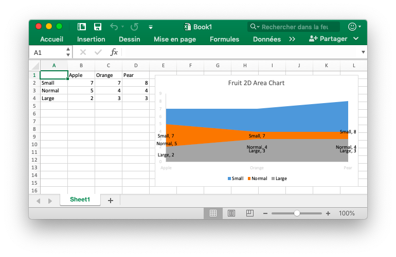
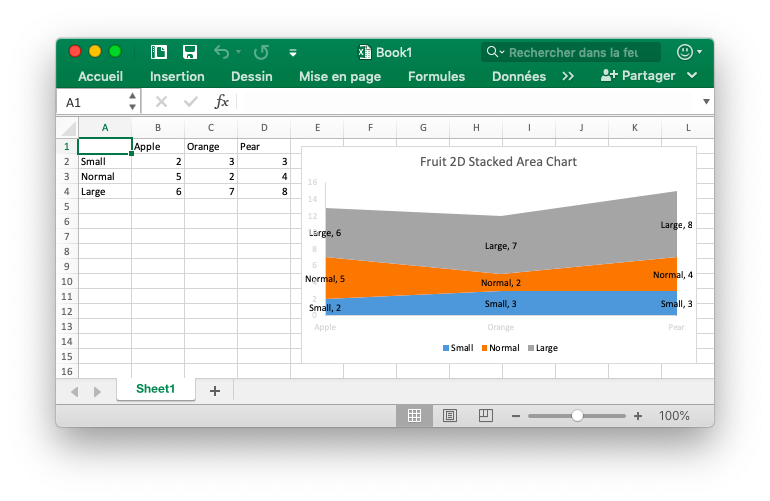
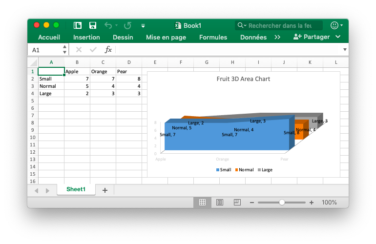
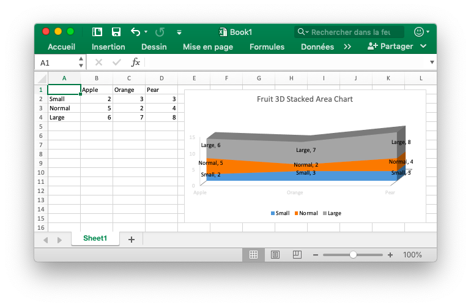
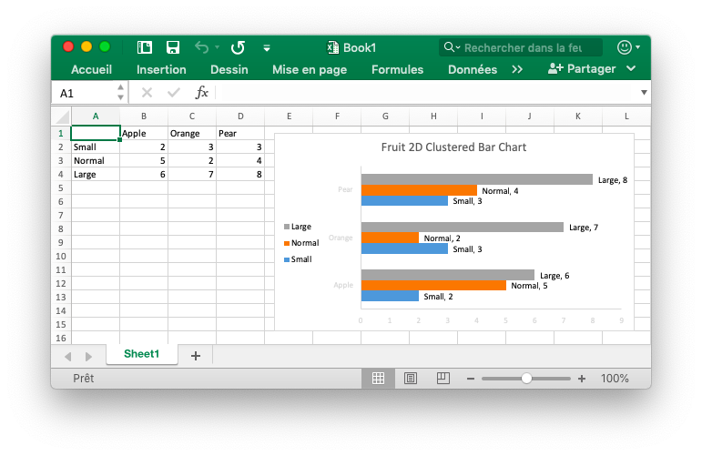
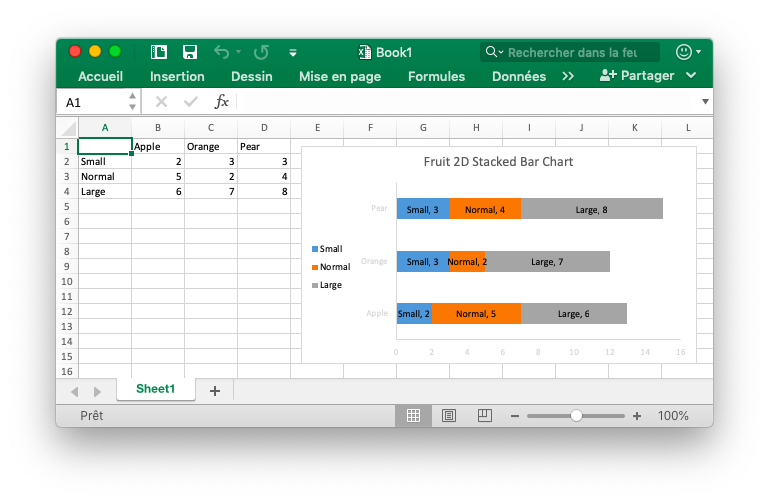
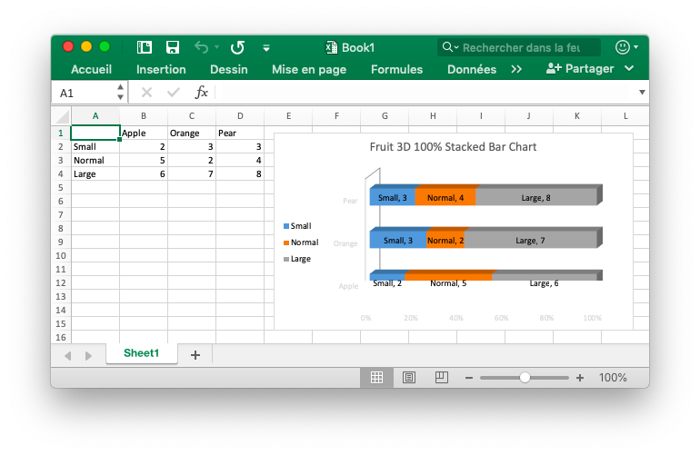
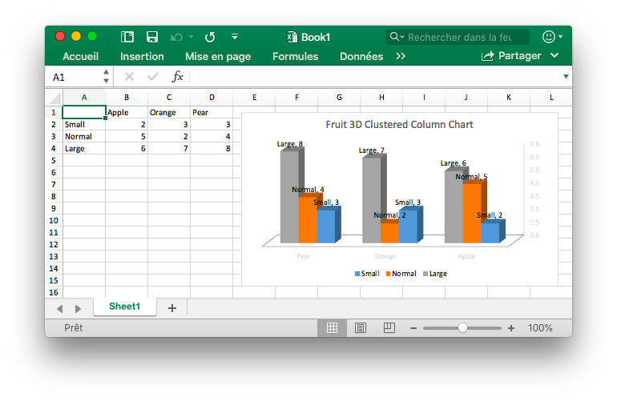
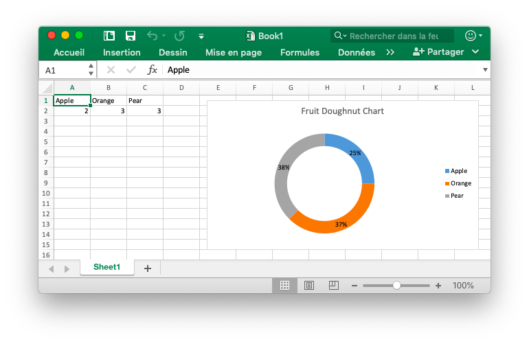
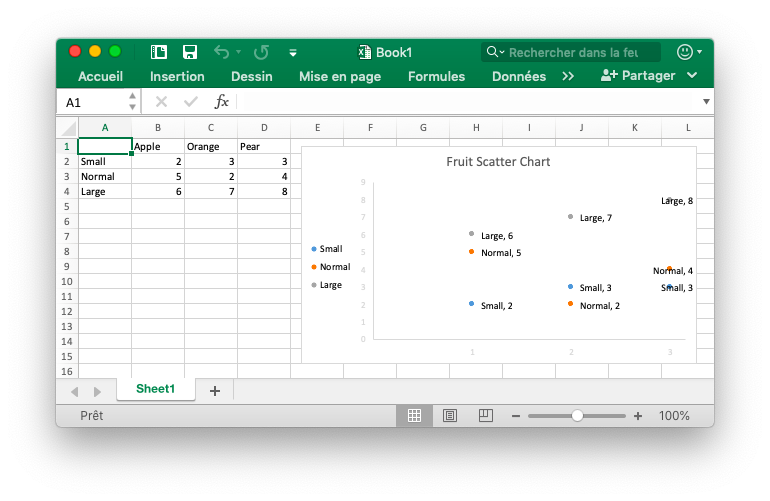

# Graphique

## Ajouter un graphique

```go
func (f *File) AddChart(sheet, cell, format string) error
```

AddChart fournit la méthode pour ajouter un graphique dans une feuille en fonction d'un ensemble de formats de graphique donné (tel que le décalage, l'échelle, le paramètre de rapport d'aspect et les paramètres d'impression) et le jeu de propriétés.

Voici le `type` de graphique supporté par excelize:

Type|Graphique
---|---
area                        | 2D graphique à aires
areaStacked                 | 2D graphique à aires empilées
areaPercentStacked          | 2D 100% graphique à aires empilées
area3D                      | 3D graphique à aires
area3DStacked               | 3D graphique à aires empilées
area3DPercentStacked        | 3D 100% graphique à aires empilées
bar                         | 2D graphique à barres en cluster
barStacked                  | 2D graphique à barres empilées
barPercentStacked           | 2D 100% graphique à barres empilées
bar3DClustered              | 3D graphique à barres en cluster
bar3DStacked                | 3D graphique à barres empilées
bar3DPercentStacked         | 3D 100% graphique à barres empilées
bar3DConeClustered          | 3D graphique à barres groupée de cône
bar3DConeStacked            | 3D graphique à barres empilés de cône
bar3DConePercentStacked     | 3D graphique à barres cône
bar3DPyramidClustered       | 3D graphique à barres groupée pyramide
bar3DPyramidStacked         | 3D graphique de barre empilé de pyramide
bar3DPyramidPercentStacked  | 3D 100% graphique à barres empilées pyramide
bar3DCylinderClustered      | 3D graphique à barres groupée de cylindres
bar3DCylinderStacked        | 3D graphique à barres empilés de cylindre
bar3DCylinderPercentStacked | 3D 100% graphique à barres cylindre empilées
col                         | 2D tableau à colonnes groupées
colStacked                  | 2D graphique à colonnes empilées
colPercentStacked           | 2D 100% graphique à colonnes empilées
col3D                       | 3D graphique à colonnes
col3DClustered              | 3D tableau à colonnes groupées
col3DStacked                | 3D graphique à colonnes empilées
col3DPercentStacked         | 3D 100% graphique à colonnes empilées
col3DCone                   | 3D graphique de colonne de cône
col3DConeClustered          | 3D graphique de colonne groupé de cône
col3DConeStacked            | 3D graphique de colonne empilé de cône
col3DConePercentStacked     | 3D 100% graphique de colonne empilé cône empilé
col3DPyramid                | 3D graphique de colonne de pyramide
col3DPyramidClustered       | 3D graphique de colonne groupé de pyramide
col3DPyramidStacked         | 3D graphique de colonne empilé de pyramide
col3DPyramidPercentStacked  | 3D 100% graphique de colonne empilée pyramide
col3DCylinder               | 3D graphique de colonne de cylindre
col3DCylinderClustered      | 3D graphique de colonne groupé de cylindre
col3DCylinderStacked        | 3D graphique de colonne empilé de cylindre
col3DCylinderPercentStacked | 3D 100 graphique de colonne cylindre empilé
doughnut                    | tableau de donut
line                        | graphique en ligne
pie                         | graphique tarte
pie3D                       | 3D graphique tarte
radar                       | graphique radar
scatter                     | graphique de dispersion
surface3D                   | 3D graphique de surface
wireframeSurface3D          | 3D graphique de surface de fil
contour                     | graphique de contour
wireframeContour            | graphique de contour de trame de fil
bubble                      | graphique à bulles
bubble3D                    | 3D graphique à bulles

Dans la zone de données de graphique Office Excel `series` spécifie l'ensemble des informations pour lesquelles les données doivent être dessinées, l'élément de légende (série) et l'étiquette d'axe horizontal (catégorie).

Les options `series` qui peuvent être définies sont:

Paramètre|Explication
---|---
name|Élément de légende (série), affiché dans la légende du graphique et la barre de formule. Le paramètre `name` est facultatif. Si vous ne spécifiez pas cette valeur, la valeur par défaut sera `Series 1 .. n`. Support `name` pour la représentation de la formule, par exemple: `Sheet1!$A$1`.
categories|Etiquette d'axe horizontal (catégorie). Le paramètre `categories` est facultatif dans la plupart des types de graphiques, la valeur par défaut est une séquence contiguë de la forme `1..n`.
values|La zone de données de graphique, qui est le paramètre le plus important dans `series`, est également le seul paramètre requis lors de la création d'un graphique. Cette option lie le graphique aux données de la feuille de calcul qu'il affiche.
line|Ceci définit le format de ligne du graphique en courbes. La propriété line est facultative et si elle n'est pas fournie, le style par défaut. Les options pouvant être définies sont `width`. La plage de `width` est comprise entre 0,25 et 999 pt. Si la valeur de width est en dehors de la plage, la largeur par défaut de la ligne est de 2 pt.

Définir les propriétés de la légende du graphique. Les options qui peuvent être définies sont:

Paramètre|Type|Explication
---|---|---
position|string|La position de la légende du graphique
show_legend_key|bool|Afficher la légende sans chevauchement avec le graphique

Définissez la `position` de la légende du graphique. La position de la légende par défaut est `right`. Les postes disponibles sont:

Paramètre|Explication
---|---
top|En haut
bottom|Au fond
left|Sur la gauche
right|Sur la droite
top_right|En haut à droite

Le paramètre `show_legend_key` défini les clés de légende doit être affiché dans les étiquettes de données. La valeur par défaut est `false`.

Le titre du graphique est défini en sélectionnant le paramètre `name` de l'objet `title` et le titre sera affiché au-dessus du graphique. Le paramètre `name` prend en charge l'utilisation de représentations de formules, telles que `Sheet1!$A$1`, si vous ne spécifiez pas de titre d'icône, la valeur par défaut est null.

Le paramètre `show_blanks_as` fournit le paramètre "Hide and empty cells". La valeur par défaut est: `gap`. Dans l'application Excel "cellule vide est affiché comme": "espace". Les valeurs suivantes sont des valeurs facultatives pour ce paramètre:

Paramètre|Explication
---|---
gap|espace
span|Connecter des points de données avec des lignes droites
zero|zvaleur zéro

Le paramètre `format` fournit des paramètres pour des paramètres tels que le décalage de diagramme, l'échelle, les paramètres de format et les propriétés d'impression, ainsi que ceux utilisés dans la fonction [`AddPicture()`](image.md#AddPicture).

Définissez la position de la zone de tracé de graphique par plotarea. Les propriétés qui peuvent être définies sont:

Paramètre|Type|Défaut|Explication
---|---|---|---
show_bubble_size|bool|`false`|Spécifie que la taille de la bulle doit apparaître dans une étiquette de données.
show_cat_name|bool|`true`|Nom de catégorie
show_leader_lines|bool|`false`|Indique que le nom de la catégorie doit apparaître dans l'étiquette de données.
show_percent|bool|`false`|Indique que le pourcentage doit être indiqué dans une étiquette de données.
show_series_name|bool|`false`|Indique que le nom de la série doit apparaître dans une étiquette de données.
show_val|bool|`false`|Indique que la valeur doit apparaître dans une étiquette de données.

Définissez les options de l'axe horizontal et vertical principal par `x_axis` et `y_axis`. Les propriétés qui peuvent être définies sont:

Paramètre|Type|Défaut|Explication
---|---|---|---
reverse_order|bool|`false`|Spécifie que les catégories ou valeurs dans l'ordre inverse (orientation du graphique). La propriété `reverse_order` est facultative.
maximum|int|`0`|Indique que le maximum fixé, 0 est auto. La propriété maximum est facultative.
minimum|int|`0`|Spécifie que le minimum fixé, 0 est auto. La propriété minimum est facultative. La valeur par défaut est auto.

Définissez la taille du graphique par la propriété `dimension`. La propriété dimension est facultative. Les propriétés qui peuvent être définies sont:

Paramètre|Type|Défaut|Explication
---|---|---|---
height|int|290|Hauteur
width|int|480|Largeur

### 2D graphique à aires {#area}

Par exemple, ajoutez un graphique qui ressemble à ceci:

<p align="center"></p>

```go
package main

import (
    "fmt"

    "github.com/360EntSecGroup-Skylar/excelize"
)

func main() {
    categories := map[string]string{"A2": "Small", "A3": "Normal", "A4": "Large", "B1": "Apple", "C1": "Orange", "D1": "Pear"}
    values := map[string]int{"B2": 2, "C2": 3, "D2": 3, "B3": 5, "C3": 2, "D3": 4, "B4": 6, "C4": 7, "D4": 8}
    f := excelize.NewFile()
    for k, v := range categories {
        f.SetCellValue("Sheet1", k, v)
    }
    for k, v := range values {
        f.SetCellValue("Sheet1", k, v)
    }
    err := f.AddChart("Sheet1", "E1", `{"type":"bar","series":[{"name":"Sheet1!$A$2","categories":"","values":"Sheet1!$B$2:$D$2"},{"name":"Sheet1!$A$3","categories":"Sheet1!$B$1:$D$1","values":"Sheet1!$B$3:$D$3"},{"name":"Sheet1!$A$4","categories":"Sheet1!$B$1:$D$1","values":"Sheet1!$B$4:$D$4"}],"format":{"x_scale":1.0,"y_scale":1.0,"x_offset":15,"y_offset":10,"print_obj":true,"lock_aspect_ratio":false,"locked":false},"legend":{"position":"left","show_legend_key":false},"title":{"name":"Fruit 2D Clustered Bar Chart"},"plotarea":{"show_bubble_size":true,"show_cat_name":false,"show_leader_lines":false,"show_percent":true,"show_series_name":true,"show_val":true},"show_blanks_as":"zero"}`)
    if err != nil {
        fmt.Println(err)
    }
    // Enregistrer le classeur
    err = f.SaveAs("./Book1.xlsx")
    if err != nil {
        fmt.Println(err)
    }
}
```

### 2D graphique à aires empilées {#areaStacked}

Par exemple, ajoutez un graphique qui ressemble à ceci:

<p align="center"></p>

```go
package main

import (
    "fmt"

    "github.com/360EntSecGroup-Skylar/excelize"
)

func main() {
    categories := map[string]string{"A2": "Small", "A3": "Normal", "A4": "Large", "B1": "Apple", "C1": "Orange", "D1": "Pear"}
    values := map[string]int{"B2": 2, "C2": 3, "D2": 3, "B3": 5, "C3": 2, "D3": 4, "B4": 6, "C4": 7, "D4": 8}
    f := excelize.NewFile()
    for k, v := range categories {
        f.SetCellValue("Sheet1", k, v)
    }
    for k, v := range values {
        f.SetCellValue("Sheet1", k, v)
    }
    err := f.AddChart("Sheet1", "E1", `{"type":"areaStacked","series":[{"name":"Sheet1!$A$2","categories":"","values":"Sheet1!$B$2:$D$2"},{"name":"Sheet1!$A$3","categories":"Sheet1!$B$1:$D$1","values":"Sheet1!$B$3:$D$3"},{"name":"Sheet1!$A$4","categories":"Sheet1!$B$1:$D$1","values":"Sheet1!$B$4:$D$4"}],"format":{"x_scale":1.0,"y_scale":1.0,"x_offset":15,"y_offset":10,"print_obj":true,"lock_aspect_ratio":false,"locked":false},"legend":{"position":"bottom","show_legend_key":false},"title":{"name":"Fruit 2D Stacked Area Chart"},"plotarea":{"show_bubble_size":true,"show_cat_name":false,"show_leader_lines":false,"show_percent":true,"show_series_name":true,"show_val":true},"show_blanks_as":"zero"}`)
    if err != nil {
        fmt.Println(err)
    }
    // Enregistrer le classeur
    err = f.SaveAs("./Book1.xlsx")
    if err != nil {
        fmt.Println(err)
    }
}
```

### 2D 100% graphique à aires empilées {#areaPercentStacked}

### 3D graphique à aires {#area3D}

Par exemple, ajoutez un graphique qui ressemble à ceci:

<p align="center"></p>

```go

package main

import (
    "fmt"

    "github.com/360EntSecGroup-Skylar/excelize"
)

func main() {
    categories := map[string]string{"A2": "Small", "A3": "Normal", "A4": "Large", "B1": "Apple", "C1": "Orange", "D1": "Pear"}
    values := map[string]int{"B2": 7, "C2": 7, "D2": 8, "B3": 5, "C3": 4, "D3": 4, "B4": 2, "C4": 3, "D4": 3}
    f := excelize.NewFile()
    for k, v := range categories {
        f.SetCellValue("Sheet1", k, v)
    }
    for k, v := range values {
        f.SetCellValue("Sheet1", k, v)
    }
    err := f.AddChart("Sheet1", "E1", `{"type":"area3D","series":[{"name":"Sheet1!$A$2","categories":"","values":"Sheet1!$B$2:$D$2"},{"name":"Sheet1!$A$3","categories":"Sheet1!$B$1:$D$1","values":"Sheet1!$B$3:$D$3"},{"name":"Sheet1!$A$4","categories":"Sheet1!$B$1:$D$1","values":"Sheet1!$B$4:$D$4"}],"format":{"x_scale":1.0,"y_scale":1.0,"x_offset":15,"y_offset":10,"print_obj":true,"lock_aspect_ratio":false,"locked":false},"legend":{"position":"bottom","show_legend_key":false},"title":{"name":"Fruit 3D Area Chart"},"plotarea":{"show_bubble_size":true,"show_cat_name":false,"show_leader_lines":false,"show_percent":true,"show_series_name":true,"show_val":true},"show_blanks_as":"zero"}`)
    if err != nil {
        fmt.Println(err)
    }
    // Enregistrer le classeur
    err = f.SaveAs("./Book1.xlsx")
    if err != nil {
        fmt.Println(err)
    }
}
```

### 3D graphique à aires empilées {#area3DStacked}

Par exemple, ajoutez un graphique qui ressemble à ceci:

<p align="center"></p>

```go
package main

import (
    "fmt"

    "github.com/360EntSecGroup-Skylar/excelize"
)

func main() {
    categories := map[string]string{"A2": "Small", "A3": "Normal", "A4": "Large", "B1": "Apple", "C1": "Orange", "D1": "Pear"}
    values := map[string]int{"B2": 2, "C2": 3, "D2": 3, "B3": 5, "C3": 2, "D3": 4, "B4": 6, "C4": 7, "D4": 8}
    f := excelize.NewFile()
    for k, v := range categories {
        f.SetCellValue("Sheet1", k, v)
    }
    for k, v := range values {
        f.SetCellValue("Sheet1", k, v)
    }
    err := f.AddChart("Sheet1", "E1", `{"type":"area3DStacked","series":[{"name":"Sheet1!$A$2","categories":"","values":"Sheet1!$B$2:$D$2"},{"name":"Sheet1!$A$3","categories":"Sheet1!$B$1:$D$1","values":"Sheet1!$B$3:$D$3"},{"name":"Sheet1!$A$4","categories":"Sheet1!$B$1:$D$1","values":"Sheet1!$B$4:$D$4"}],"format":{"x_scale":1.0,"y_scale":1.0,"x_offset":15,"y_offset":10,"print_obj":true,"lock_aspect_ratio":false,"locked":false},"legend":{"position":"bottom","show_legend_key":false},"title":{"name":"Fruit 3D Stacked Area Chart"},"plotarea":{"show_bubble_size":true,"show_cat_name":false,"show_leader_lines":false,"show_percent":true,"show_series_name":true,"show_val":true},"show_blanks_as":"zero"}`)
    if err != nil {
        fmt.Println(err)
    }
    // Enregistrer le classeur
    err = f.SaveAs("./Book1.xlsx")
    if err != nil {
        fmt.Println(err)
    }
}
```

### 3D 100% graphique à aires empilées {#area3DPercentStacked}

Par exemple, ajoutez un graphique qui ressemble à ceci:

<p align="center"></p>

```go
package main

import (
    "fmt"

    "github.com/360EntSecGroup-Skylar/excelize"
)

func main() {
    categories := map[string]string{"A2": "Small", "A3": "Normal", "A4": "Large", "B1": "Apple", "C1": "Orange", "D1": "Pear"}
    values := map[string]int{"B2": 2, "C2": 3, "D2": 3, "B3": 5, "C3": 2, "D3": 4, "B4": 6, "C4": 7, "D4": 8}
    f := excelize.NewFile()
    for k, v := range categories {
        f.SetCellValue("Sheet1", k, v)
    }
    for k, v := range values {
        f.SetCellValue("Sheet1", k, v)
    }
    err := f.AddChart("Sheet1", "E1", `{"type":"area3DPercentStacked","series":[{"name":"Sheet1!$A$2","categories":"","values":"Sheet1!$B$2:$D$2"},{"name":"Sheet1!$A$3","categories":"Sheet1!$B$1:$D$1","values":"Sheet1!$B$3:$D$3"},{"name":"Sheet1!$A$4","categories":"Sheet1!$B$1:$D$1","values":"Sheet1!$B$4:$D$4"}],"format":{"x_scale":1.0,"y_scale":1.0,"x_offset":15,"y_offset":10,"print_obj":true,"lock_aspect_ratio":false,"locked":false},"legend":{"position":"bottom","show_legend_key":false},"title":{"name":"Fruit 3D 100% Stacked Area Chart"},"plotarea":{"show_bubble_size":true,"show_cat_name":false,"show_leader_lines":false,"show_percent":true,"show_series_name":true,"show_val":true},"show_blanks_as":"zero"}`)
    if err != nil {
        fmt.Println(err)
    }
    // Enregistrer le classeur
    err = f.SaveAs("./Book1.xlsx")
    if err != nil {
        fmt.Println(err)
    }
}
```

### 2D graphique à barres en cluster {#bar}

Par exemple, ajoutez un graphique qui ressemble à ceci:

<p align="center"></p>

```go
package main

import (
    "fmt"

    "github.com/360EntSecGroup-Skylar/excelize"
)

func main() {
    categories := map[string]string{"A2": "Small", "A3": "Normal", "A4": "Large", "B1": "Apple", "C1": "Orange", "D1": "Pear"}
    values := map[string]int{"B2": 2, "C2": 3, "D2": 3, "B3": 5, "C3": 2, "D3": 4, "B4": 6, "C4": 7, "D4": 8}
    f := excelize.NewFile()
    for k, v := range categories {
        f.SetCellValue("Sheet1", k, v)
    }
    for k, v := range values {
        f.SetCellValue("Sheet1", k, v)
    }
    err := f.AddChart("Sheet1", "E1", `{"type":"bar","series":[{"name":"Sheet1!$A$2","categories":"","values":"Sheet1!$B$2:$D$2"},{"name":"Sheet1!$A$3","categories":"Sheet1!$B$1:$D$1","values":"Sheet1!$B$3:$D$3"},{"name":"Sheet1!$A$4","categories":"Sheet1!$B$1:$D$1","values":"Sheet1!$B$4:$D$4"}],"format":{"x_scale":1.0,"y_scale":1.0,"x_offset":15,"y_offset":10,"print_obj":true,"lock_aspect_ratio":false,"locked":false},"legend":{"position":"left","show_legend_key":false},"title":{"name":"Fruit 2D Clustered Bar Chart"},"plotarea":{"show_bubble_size":true,"show_cat_name":false,"show_leader_lines":false,"show_percent":true,"show_series_name":true,"show_val":true},"show_blanks_as":"zero"}`)
    if err != nil {
        fmt.Println(err)
    }
    // Enregistrer le classeur
    err = f.SaveAs("./Book1.xlsx")
    if err != nil {
        fmt.Println(err)
    }
}
```

### 2D graphique à barres empilées {#barStacked}

Par exemple, ajoutez un graphique qui ressemble à ceci:

<p align="center"></p>

```go
package main

import (
    "fmt"

    "github.com/360EntSecGroup-Skylar/excelize"
)

func main() {
    categories := map[string]string{"A2": "Small", "A3": "Normal", "A4": "Large", "B1": "Apple", "C1": "Orange", "D1": "Pear"}
    values := map[string]int{"B2": 2, "C2": 3, "D2": 3, "B3": 5, "C3": 2, "D3": 4, "B4": 6, "C4": 7, "D4": 8}
    f := excelize.NewFile()
    for k, v := range categories {
        f.SetCellValue("Sheet1", k, v)
    }
    for k, v := range values {
        f.SetCellValue("Sheet1", k, v)
    }
    err := f.AddChart("Sheet1", "E1", `{"type":"barStacked","series":[{"name":"Sheet1!$A$2","categories":"","values":"Sheet1!$B$2:$D$2"},{"name":"Sheet1!$A$3","categories":"Sheet1!$B$1:$D$1","values":"Sheet1!$B$3:$D$3"},{"name":"Sheet1!$A$4","categories":"Sheet1!$B$1:$D$1","values":"Sheet1!$B$4:$D$4"}],"format":{"x_scale":1.0,"y_scale":1.0,"x_offset":15,"y_offset":10,"print_obj":true,"lock_aspect_ratio":false,"locked":false},"legend":{"position":"left","show_legend_key":false},"title":{"name":"Fruit 2D Stacked Bar Chart"},"plotarea":{"show_bubble_size":true,"show_cat_name":false,"show_leader_lines":false,"show_percent":true,"show_series_name":true,"show_val":true},"show_blanks_as":"zero"}`)
    if err != nil {
        fmt.Println(err)
    }
    // Enregistrer le classeur
    err = f.SaveAs("./Book1.xlsx")
    if err != nil {
        fmt.Println(err)
    }
}
```

### 2D 100% graphique à barres empilées {#barPercentStacked}

Par exemple, ajoutez un graphique qui ressemble à ceci:

<p align="center"></p>

```go
package main

import (
    "fmt"

    "github.com/360EntSecGroup-Skylar/excelize"
)

func main() {
    categories := map[string]string{"A2": "Small", "A3": "Normal", "A4": "Large", "B1": "Apple", "C1": "Orange", "D1": "Pear"}
    values := map[string]int{"B2": 2, "C2": 3, "D2": 3, "B3": 5, "C3": 2, "D3": 4, "B4": 6, "C4": 7, "D4": 8}
    f := excelize.NewFile()
    for k, v := range categories {
        f.SetCellValue("Sheet1", k, v)
    }
    for k, v := range values {
        f.SetCellValue("Sheet1", k, v)
    }
    err := f.AddChart("Sheet1", "E1", `{"type":"barPercentStacked","series":[{"name":"Sheet1!$A$2","categories":"","values":"Sheet1!$B$2:$D$2"},{"name":"Sheet1!$A$3","categories":"Sheet1!$B$1:$D$1","values":"Sheet1!$B$3:$D$3"},{"name":"Sheet1!$A$4","categories":"Sheet1!$B$1:$D$1","values":"Sheet1!$B$4:$D$4"}],"format":{"x_scale":1.0,"y_scale":1.0,"x_offset":15,"y_offset":10,"print_obj":true,"lock_aspect_ratio":false,"locked":false},"legend":{"position":"left","show_legend_key":false},"title":{"name":"Fruit 2D Stacked 100% Bar Chart"},"plotarea":{"show_bubble_size":true,"show_cat_name":false,"show_leader_lines":false,"show_percent":true,"show_series_name":true,"show_val":true},"show_blanks_as":"zero"}`)
    if err != nil {
        fmt.Println(err)
    }
    // Enregistrer le classeur
    err = f.SaveAs("./Book1.xlsx")
    if err != nil {
        fmt.Println(err)
    }
}
```

### 3D graphique à barres en cluster {#bar3DClustered}

Par exemple, ajoutez un graphique qui ressemble à ceci:

<p align="center"></p>

```go
package main

import (
    "fmt"

    "github.com/360EntSecGroup-Skylar/excelize"
)

func main() {
    categories := map[string]string{"A2": "Small", "A3": "Normal", "A4": "Large", "B1": "Apple", "C1": "Orange", "D1": "Pear"}
    values := map[string]int{"B2": 2, "C2": 3, "D2": 3, "B3": 5, "C3": 2, "D3": 4, "B4": 6, "C4": 7, "D4": 8}
    f := excelize.NewFile()
    for k, v := range categories {
        f.SetCellValue("Sheet1", k, v)
    }
    for k, v := range values {
        f.SetCellValue("Sheet1", k, v)
    }
    err := f.AddChart("Sheet1", "E1", `{"type":"bar3DClustered","series":[{"name":"Sheet1!$A$2","categories":"","values":"Sheet1!$B$2:$D$2"},{"name":"Sheet1!$A$3","categories":"Sheet1!$B$1:$D$1","values":"Sheet1!$B$3:$D$3"},{"name":"Sheet1!$A$4","categories":"Sheet1!$B$1:$D$1","values":"Sheet1!$B$4:$D$4"}],"format":{"x_scale":1.0,"y_scale":1.0,"x_offset":15,"y_offset":10,"print_obj":true,"lock_aspect_ratio":false,"locked":false},"legend":{"position":"left","show_legend_key":false},"title":{"name":"Fruit 3D Clustered Bar Chart"},"plotarea":{"show_bubble_size":true,"show_cat_name":false,"show_leader_lines":false,"show_percent":true,"show_series_name":true,"show_val":true},"show_blanks_as":"zero"}`)
    if err != nil {
        fmt.Println(err)
    }
    // Enregistrer le classeur
    err = f.SaveAs("./Book1.xlsx")
    if err != nil {
        fmt.Println(err)
    }
}
```

### 3D graphique à barres empilées {#bar3DStacked}

Par exemple, ajoutez un graphique qui ressemble à ceci:

<p align="center"></p>

```go
package main

import (
    "fmt"

    "github.com/360EntSecGroup-Skylar/excelize"
)

func main() {
    categories := map[string]string{"A2": "Small", "A3": "Normal", "A4": "Large", "B1": "Apple", "C1": "Orange", "D1": "Pear"}
    values := map[string]int{"B2": 2, "C2": 3, "D2": 3, "B3": 5, "C3": 2, "D3": 4, "B4": 6, "C4": 7, "D4": 8}
    f := excelize.NewFile()
    for k, v := range categories {
        f.SetCellValue("Sheet1", k, v)
    }
    for k, v := range values {
        f.SetCellValue("Sheet1", k, v)
    }
    err := f.AddChart("Sheet1", "E1", `{"type":"bar3DStacked","series":[{"name":"Sheet1!$A$2","categories":"","values":"Sheet1!$B$2:$D$2"},{"name":"Sheet1!$A$3","categories":"Sheet1!$B$1:$D$1","values":"Sheet1!$B$3:$D$3"},{"name":"Sheet1!$A$4","categories":"Sheet1!$B$1:$D$1","values":"Sheet1!$B$4:$D$4"}],"format":{"x_scale":1.0,"y_scale":1.0,"x_offset":15,"y_offset":10,"print_obj":true,"lock_aspect_ratio":false,"locked":false},"legend":{"position":"left","show_legend_key":false},"title":{"name":"Fruit 3D Stacked Bar Chart"},"plotarea":{"show_bubble_size":true,"show_cat_name":false,"show_leader_lines":false,"show_percent":true,"show_series_name":true,"show_val":true},"show_blanks_as":"zero"}`)
    if err != nil {
        fmt.Println(err)
    }
    // Enregistrer le classeur
    err = f.SaveAs("./Book1.xlsx")
    if err != nil {
        fmt.Println(err)
    }
}
```

### 3D 100% graphique à barres empilées {#bar3DPercentStacked}

Par exemple, ajoutez un graphique qui ressemble à ceci:

<p align="center"></p>

```go
package main

import (
    "fmt"

    "github.com/360EntSecGroup-Skylar/excelize"
)

func main() {
    categories := map[string]string{"A2": "Small", "A3": "Normal", "A4": "Large", "B1": "Apple", "C1": "Orange", "D1": "Pear"}
    values := map[string]int{"B2": 2, "C2": 3, "D2": 3, "B3": 5, "C3": 2, "D3": 4, "B4": 6, "C4": 7, "D4": 8}
    f := excelize.NewFile()
    for k, v := range categories {
        f.SetCellValue("Sheet1", k, v)
    }
    for k, v := range values {
        f.SetCellValue("Sheet1", k, v)
    }
    err := f.AddChart("Sheet1", "E1", `{"type":"bar3DPercentStacked","series":[{"name":"Sheet1!$A$2","categories":"","values":"Sheet1!$B$2:$D$2"},{"name":"Sheet1!$A$3","categories":"Sheet1!$B$1:$D$1","values":"Sheet1!$B$3:$D$3"},{"name":"Sheet1!$A$4","categories":"Sheet1!$B$1:$D$1","values":"Sheet1!$B$4:$D$4"}],"format":{"x_scale":1.0,"y_scale":1.0,"x_offset":15,"y_offset":10,"print_obj":true,"lock_aspect_ratio":false,"locked":false},"legend":{"position":"left","show_legend_key":false},"title":{"name":"Fruit 3D 100% Stacked Bar Chart"},"plotarea":{"show_bubble_size":true,"show_cat_name":false,"show_leader_lines":false,"show_percent":true,"show_series_name":true,"show_val":true},"show_blanks_as":"zero"}`)
    if err != nil {
        fmt.Println(err)
    }
    // Enregistrer le classeur
    err = f.SaveAs("./Book1.xlsx")
    if err != nil {
        fmt.Println(err)
    }
}
```

### 2D tableau à colonnes groupées {#col}

Par exemple, ajoutez un graphique qui ressemble à ceci:

<p align="center"></p>

```go
package main

import (
    "fmt"

    "github.com/360EntSecGroup-Skylar/excelize"
)

func main() {
    categories := map[string]string{"A2": "Small", "A3": "Normal", "A4": "Large", "B1": "Apple", "C1": "Orange", "D1": "Pear"}
    values := map[string]int{"B2": 2, "C2": 3, "D2": 3, "B3": 5, "C3": 2, "D3": 4, "B4": 6, "C4": 7, "D4": 8}
    f := excelize.NewFile()
    for k, v := range categories {
        f.SetCellValue("Sheet1", k, v)
    }
    for k, v := range values {
        f.SetCellValue("Sheet1", k, v)
    }
    err := f.AddChart("Sheet1", "E1", `{"type":"col","series":[{"name":"Sheet1!$A$2","categories":"","values":"Sheet1!$B$2:$D$2"},{"name":"Sheet1!$A$3","categories":"Sheet1!$B$1:$D$1","values":"Sheet1!$B$3:$D$3"},{"name":"Sheet1!$A$4","categories":"Sheet1!$B$1:$D$1","values":"Sheet1!$B$4:$D$4"}],"format":{"x_scale":1.0,"y_scale":1.0,"x_offset":15,"y_offset":10,"print_obj":true,"lock_aspect_ratio":false,"locked":false},"legend":{"position":"left","show_legend_key":false},"title":{"name":"Fruit 2D Column Chart"},"plotarea":{"show_bubble_size":true,"show_cat_name":false,"show_leader_lines":false,"show_percent":true,"show_series_name":true,"show_val":true},"show_blanks_as":"zero"}`)
    if err != nil {
        fmt.Println(err)
    }
    // Enregistrer le classeur
    err = f.SaveAs("./Book1.xlsx")
    if err != nil {
        fmt.Println(err)
    }
}
```

### 3D graphique à barres groupée de cône {#bar3DConeClustered}

### 3D graphique à barres empilés de cône {#bar3DConeStacked}

### 3D graphique à barres cône {#bar3DConePercentStacked}

### 3D graphique à barres groupée pyramide {#bar3DPyramidClustered}

### 3D graphique de barre empilé de pyramide {#bar3DPyramidStacked}

### 3D 100% graphique à barres empilées pyramide {#bar3DPyramidPercentStacked}

### 3D graphique à barres groupée de cylindres {#bar3DCylinderClustered}

### 3D graphique à barres empilés de cylindre {#bar3DCylinderStacked}

### 3D 100% graphique à barres cylindre empilées {#bar3DCylinderPercentStacked}

### 2D graphique à colonnes empilées {#colStacked}

### 2D 100% graphique à colonnes empilées {#colPercentStacked}

### 3D tableau à colonnes groupées {#col3DClustered}

Par exemple, ajoutez un graphique qui ressemble à ceci:

<p align="center"></p>

```go
package main

import (
    "fmt"

    "github.com/360EntSecGroup-Skylar/excelize"
)

func main() {
    categories := map[string]string{"A2": "Small", "A3": "Normal", "A4": "Large", "B1": "Apple", "C1": "Orange", "D1": "Pear"}
    values := map[string]int{"B2": 2, "C2": 3, "D2": 3, "B3": 5, "C3": 2, "D3": 4, "B4": 6, "C4": 7, "D4": 8}
    f := excelize.NewFile()
    for k, v := range categories {
        f.SetCellValue("Sheet1", k, v)
    }
    for k, v := range values {
        f.SetCellValue("Sheet1", k, v)
    }
    err := f.AddChart("Sheet1", "E1", `{"type":"col3DClustered","series":[{"name":"Sheet1!$A$2","categories":"Sheet1!$B$1:$D$1","values":"Sheet1!$B$2:$D$2"},{"name":"Sheet1!$A$3","categories":"Sheet1!$B$1:$D$1","values":"Sheet1!$B$3:$D$3"},{"name":"Sheet1!$A$4","categories":"Sheet1!$B$1:$D$1","values":"Sheet1!$B$4:$D$4"}],"format":{"x_scale":1.0,"y_scale":1.0,"x_offset":15,"y_offset":10,"print_obj":true,"lock_aspect_ratio":false,"locked":false},"legend":{"position":"bottom","show_legend_key":false},"title":{"name":"Fruit 3D Clustered Column Chart"},"plotarea":{"show_bubble_size":true,"show_cat_name":false,"show_leader_lines":false,"show_percent":true,"show_series_name":true,"show_val":true},"show_blanks_as":"zero","x_axis":{"reverse_order":true},"y_axis":{"maximum":7.5,"minimum":0.5}}`)
    if err != nil {
        fmt.Println(err)
    }
    // Enregistrer le classeur
    err = f.SaveAs("./Book1.xlsx")
    if err != nil {
        fmt.Println(err)
    }
}
```

### 3D graphique à colonnes {#col3D}

### 3D graphique à colonnes empilées {#col3DStacked}

### 3D 100% graphique à colonnes empilées {#col3DPercentStacked}

### 3D graphique de colonne de cône {#col3DCone}

### 3D graphique de colonne groupé de cône {#col3DConeClustered}

### 3D graphique de colonne empilé de cône {#col3DConeStacked}

### 3D 100% graphique de colonne empilé cône empilé {#col3DConePercentStacked}

### 3D graphique de colonne de pyramide {#col3DPyramid}

### 3D graphique de colonne groupé de pyramide {#col3DPyramidClustered}

### 3D graphique de colonne empilé de pyramide {#col3DPyramidStacked}

### 3D 100% graphique de colonne empilée pyramide {#col3DPyramidPercentStacked}

### 3D graphique de colonne de cylindre {#col3DCylinder}

### 3D graphique de colonne groupé de cylindre {#col3DCylinderClustered}

### 3D graphique de colonne empilé de cylindre {#col3DCylinderStacked}

### 3D 100 graphique de colonne cylindre empilé {#col3DCylinderPercentStacked}

### Tableau de donut {#doughnut}

Par exemple, ajoutez un graphique qui ressemble à ceci:

<p align="center"></p>

```go
package main

import (
    "fmt"

    "github.com/360EntSecGroup-Skylar/excelize"
)

func main() {
    categories := map[string]string{"A1": "Apple", "B1": "Orange", "C1": "Pear"}
    values := map[string]int{"A2": 2, "B2": 3, "C2": 3}
    f := excelize.NewFile()
    for k, v := range categories {
        f.SetCellValue("Sheet1", k, v)
    }
    for k, v := range values {
        f.SetCellValue("Sheet1", k, v)
    }
    err := f.AddChart("Sheet1", "E1", `{"type":"doughnut","series":[{"name":"Sheet1!$A$2","categories":"Sheet1!$A$1:$C$1","values":"Sheet1!$A$2:$C$2"}],"format":{"x_scale":1.0,"y_scale":1.0,"x_offset":15,"y_offset":10,"print_obj":true,"lock_aspect_ratio":false,"locked":false},"legend":{"position":"right","show_legend_key":false},"title":{"name":"Fruit Doughnut Chart"},"plotarea":{"show_bubble_size":false,"show_cat_name":false,"show_leader_lines":false,"show_percent":true,"show_series_name":false,"show_val":false},"show_blanks_as":"zero"}`)
    if err != nil {
        fmt.Println(err)
    }
    // Enregistrer le classeur
    err = f.SaveAs("./Book1.xlsx")
    if err != nil {
        fmt.Println(err)
    }
}
```

### Graphique en ligne {#line}

Par exemple, ajoutez un graphique qui ressemble à ceci:

<p align="center"></p>

```go
package main

import (
    "fmt"

    "github.com/360EntSecGroup-Skylar/excelize"
)

func main() {
    categories := map[string]string{"A2": "Small", "A3": "Normal", "A4": "Large", "B1": "Apple", "C1": "Orange", "D1": "Pear"}
    values := map[string]int{"B2": 2, "C2": 3, "D2": 3, "B3": 5, "C3": 2, "D3": 4, "B4": 6, "C4": 7, "D4": 8}
    f := excelize.NewFile()
    for k, v := range categories {
        f.SetCellValue("Sheet1", k, v)
    }
    for k, v := range values {
        f.SetCellValue("Sheet1", k, v)
    }

    f.AddChart("Sheet1", "E1", `{"type":"line","series":[{"name":"Sheet1!$A$2","categories":"","values":"Sheet1!$B$2:$D$2"},{"name":"Sheet1!$A$3","categories":"Sheet1!$B$1:$D$1","values":"Sheet1!$B$3:$D$3"},{"name":"Sheet1!$A$4","categories":"Sheet1!$B$1:$D$1","values":"Sheet1!$B$4:$D$4"}],"format":{"x_scale":1.0,"y_scale":1.0,"x_offset":15,"y_offset":10,"print_obj":true,"lock_aspect_ratio":false,"locked":false},"legend":{"position":"top","show_legend_key":false},"title":{"name":"Fruit Line Chart"},"plotarea":{"show_bubble_size":true,"show_cat_name":false,"show_leader_lines":false,"show_percent":true,"show_series_name":true,"show_val":true},"show_blanks_as":"zero"}`)
    // Enregistrer le classeur
    err := f.SaveAs("./Book1.xlsx")
    if err != nil {
        fmt.Println(err)
    }
}
```

### Graphique tarte {#pie}

Par exemple, ajoutez un graphique qui ressemble à ceci:

<p align="center"></p>

```go
package main

import (
    "fmt"

    "github.com/360EntSecGroup-Skylar/excelize"
)

func main() {
    categories := map[string]string{"A2": "Small", "A3": "Normal", "A4": "Large", "B1": "Apple", "C1": "Orange", "D1": "Pear"}
    values := map[string]int{"B2": 2, "C2": 3, "D2": 3, "B3": 5, "C3": 2, "D3": 4, "B4": 6, "C4": 7, "D4": 8}
    f := excelize.NewFile()
    for k, v := range categories {
        f.SetCellValue("Sheet1", k, v)
    }
    for k, v := range values {
        f.SetCellValue("Sheet1", k, v)
    }

    f.AddChart("Sheet1", "E1", `{"type":"pie","series":[{"name":"Sheet1!$A$2","categories":"Sheet1!$B$1:$D$1","values":"Sheet1!$B$2:$D$2"}],"format":{"x_scale":1.0,"y_scale":1.0,"x_offset":15,"y_offset":10,"print_obj":true,"lock_aspect_ratio":false,"locked":false},"legend":{"position":"bottom","show_legend_key":false},"title":{"name":"Fruit Pie Chart"},"plotarea":{"show_bubble_size":true,"show_cat_name":false,"show_leader_lines":false,"show_percent":true,"show_series_name":false,"show_val":false},"show_blanks_as":"gap"}`)
    // Enregistrer le classeur
    err := f.SaveAs("./Book1.xlsx")
    if err != nil {
        fmt.Println(err)
    }
}
```

### 3D graphique tarte {#pie3D}

Par exemple, ajoutez un graphique qui ressemble à ceci:

<p align="center"></p>

```go
package main

import (
    "fmt"

    "github.com/360EntSecGroup-Skylar/excelize"
)

func main() {
    categories := map[string]string{"A2": "Small", "A3": "Normal", "A4": "Large", "B1": "Apple", "C1": "Orange", "D1": "Pear"}
    values := map[string]int{"B2": 2, "C2": 3, "D2": 3, "B3": 5, "C3": 2, "D3": 4, "B4": 6, "C4": 7, "D4": 8}
    f := excelize.NewFile()
    for k, v := range categories {
        f.SetCellValue("Sheet1", k, v)
    }
    for k, v := range values {
        f.SetCellValue("Sheet1", k, v)
    }

    f.AddChart("Sheet1", "E1", `{"type":"pie3D","series":[{"name":"Sheet1!$A$2","categories":"Sheet1!$B$1:$D$1","values":"Sheet1!$B$2:$D$2"}],"format":{"x_scale":1.0,"y_scale":1.0,"x_offset":15,"y_offset":10,"print_obj":true,"lock_aspect_ratio":false,"locked":false},"legend":{"position":"bottom","show_legend_key":false},"title":{"name":"Fruit 3D Pie Chart"},"plotarea":{"show_bubble_size":true,"show_cat_name":false,"show_leader_lines":false,"show_percent":true,"show_series_name":false,"show_val":false},"show_blanks_as":"zero"}`)
    // Enregistrer le classeur
    err := f.SaveAs("./Book1.xlsx")
    if err != nil {
        fmt.Println(err)
    }
}
```

### Graphique radar {#radar}

Par exemple, ajoutez un graphique qui ressemble à ceci:

<p align="center"></p>

```go
package main

import (
    "fmt"

    "github.com/360EntSecGroup-Skylar/excelize"
)

func main() {
    categories := map[string]string{"A2": "Small", "A3": "Normal", "A4": "Large", "B1": "Apple", "C1": "Orange", "D1": "Pear"}
    values := map[string]int{"B2": 2, "C2": 3, "D2": 3, "B3": 5, "C3": 2, "D3": 4, "B4": 6, "C4": 7, "D4": 8}
    f := excelize.NewFile()
    for k, v := range categories {
        f.SetCellValue("Sheet1", k, v)
    }
    for k, v := range values {
        f.SetCellValue("Sheet1", k, v)
    }
    err := f.AddChart("Sheet1", "E1", `{"type":"radar","series":[{"name":"Sheet1!$A$2","categories":"","values":"Sheet1!$B$2:$D$2"},{"name":"Sheet1!$A$3","categories":"Sheet1!$B$1:$D$1","values":"Sheet1!$B$3:$D$3"},{"name":"Sheet1!$A$4","categories":"Sheet1!$B$1:$D$1","values":"Sheet1!$B$4:$D$4"}],"format":{"x_scale":1.0,"y_scale":1.0,"x_offset":15,"y_offset":10,"print_obj":true,"lock_aspect_ratio":false,"locked":false},"legend":{"position":"top","show_legend_key":false},"title":{"name":"Fruit Radar Chart"},"plotarea":{"show_bubble_size":true,"show_cat_name":false,"show_leader_lines":false,"show_percent":true,"show_series_name":false,"show_val":false},"show_blanks_as":"span"}`)
    if err != nil {
        fmt.Println(err)
    }
    // Enregistrer le classeur
    err = f.SaveAs("./Book1.xlsx")
    if err != nil {
        fmt.Println(err)
    }
}
```

### Graphique de dispersion {#scatter}

Par exemple, ajoutez un graphique qui ressemble à ceci:

<p align="center"></p>

```go
package main

import (
    "fmt"

    "github.com/360EntSecGroup-Skylar/excelize"
)

func main() {
    categories := map[string]string{"A2": "Small", "A3": "Normal", "A4": "Large", "B1": "Apple", "C1": "Orange", "D1": "Pear"}
    values := map[string]int{"B2": 2, "C2": 3, "D2": 3, "B3": 5, "C3": 2, "D3": 4, "B4": 6, "C4": 7, "D4": 8}
    f := excelize.NewFile()
    for k, v := range categories {
        f.SetCellValue("Sheet1", k, v)
    }
    for k, v := range values {
        f.SetCellValue("Sheet1", k, v)
    }
    err := f.AddChart("Sheet1", "E1", `{"type":"scatter","series":[{"name":"Sheet1!$A$2","categories":"","values":"Sheet1!$B$2:$D$2"},{"name":"Sheet1!$A$3","categories":"Sheet1!$B$1:$D$1","values":"Sheet1!$B$3:$D$3"},{"name":"Sheet1!$A$4","categories":"Sheet1!$B$1:$D$1","values":"Sheet1!$B$4:$D$4"}],"format":{"x_scale":1.0,"y_scale":1.0,"x_offset":15,"y_offset":10,"print_obj":true,"lock_aspect_ratio":false,"locked":false},"legend":{"position":"left","show_legend_key":false},"title":{"name":"Fruit Scatter Chart"},"plotarea":{"show_bubble_size":true,"show_cat_name":false,"show_leader_lines":false,"show_percent":true,"show_series_name":true,"show_val":true},"show_blanks_as":"zero"}`)
    if err != nil {
        fmt.Println(err)
    }
    // Enregistrer le classeur
    err = f.SaveAs("./Book1.xlsx")
    if err != nil {
        fmt.Println(err)
    }
}
```

### 3D graphique de surface {#surface3D}

### 3D graphique de surface de fil {#wireframeSurface3D}

### graphique de contour {#contour}

### graphique de contour de trame de fil {#wireframeContour}

### graphique à bulles {#bubble}

### 3D graphique à bulles {#bubble3D}
