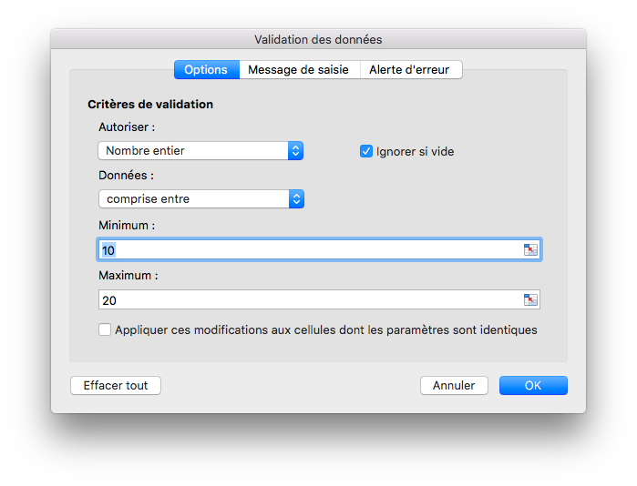
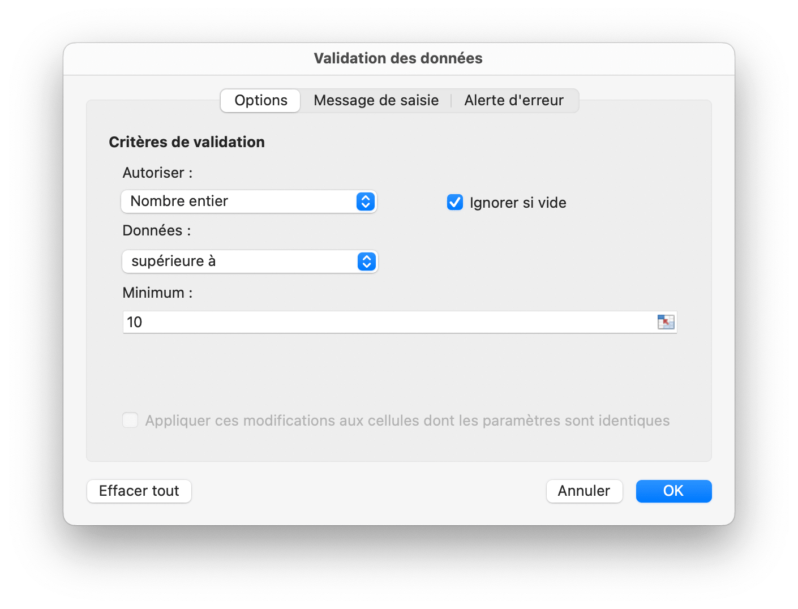
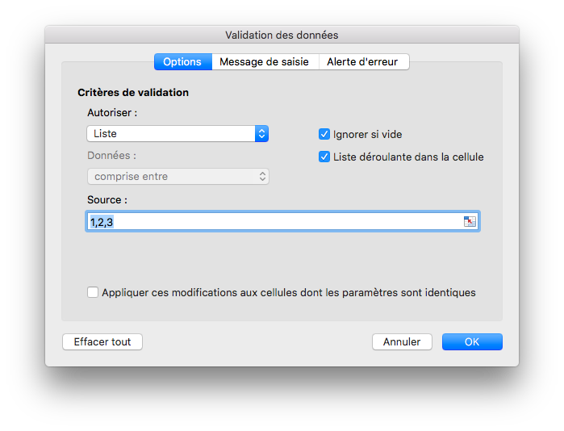
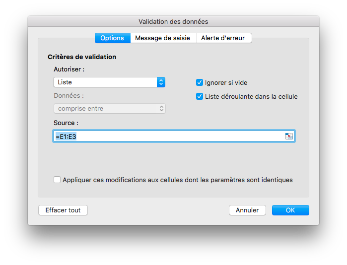

# Données

## Ajouter la validation des données {#AddDataValidation}

```go
func (f *File) AddDataValidation(sheet string, dv *DataValidation)
```

AddDataValidation fournit la validation des données définies sur une plage de la feuille de calcul par objet de validation de données et nom de feuille de calcul donnés. L'objet de validation de données peut être créé par la fonction `NewDataValidation`. Le type de validation des données et les opérateurs peuvent être trouvés dans la section [Constants](constants.md).

Exemple 1, validation de données situé sur `Feuil1!A1:B2` avec les paramètres de critères de validation, d'alerte d'erreur de série après des données non valides sont entrées avec "Stop" style et titre personnalisé "error body":

<p align="center"></p>

```go
dv := excelize.NewDataValidation(true)
dv.SetSqref("A1:B2")
dv.SetRange(10, 20, excelize.DataValidationTypeWhole, excelize.DataValidationOperatorBetween)
dv.SetError(excelize.DataValidationErrorStyleStop, "error title", "error body")
f.AddDataValidation("Feuil1", dv)
```

Exemple 2, définissez la validation des données sur `Feuil1!A3:B4` avec les paramètres de validation et affichez le message lorsque la cellule est sélectionnée:

<p align="center"></p>

```go
dv = excelize.NewDataValidation(true)
dv.SetSqref("A3:B4")
dv.SetRange(10, 20, excelize.DataValidationTypeWhole, excelize.DataValidationOperatorGreaterThan)
dv.SetInput("input title", "input body")
f.AddDataValidation("Feuil1", dv)
```

Exemple 3, définissez la validation des données sur `Feuil1!A5:B6` avec les paramètres de validation, créez un menu déroulant dans la cellule en autorisant la source de liste:

<p align="center"></p>

```go
dv = excelize.NewDataValidation(true)
dv.SetSqref("A5:B6")
dv.SetDropList([]string{"1", "2", "3"})
f.AddDataValidation("Feuil1", dv)
```

Si vous saisissez les éléments dans la boîte de dialogue de validation des données (une liste délimitée), la limite est de 255 caractères, séparateurs compris. Si la formule source de votre liste de validation de données dépasse la limite de longueur maximale, veuillez définir les valeurs autorisées dans les cellules de la feuille de calcul et utilisez la fonction `SetSqrefDropList` pour définir la référence de leurs cellules.

Example 4，définir la validation des données sur `Feuil1!A7:B8` avec la source des critères de validation `Feuil1!E1:E3`, créer un menu déroulant dans la cellule en autorisant la source de liste:

<p align="center"></p>

```go
dv := excelize.NewDataValidation(true)
dv.SetSqref("A7:B8")
dv.SetSqrefDropList("E1:E3")
f.AddDataValidation("Feuil1", dv)
```

Il existe des limites au nombre d'éléments qui s'afficheront dans une liste déroulante de validation des données: la liste peut afficher 32768 éléments d'une liste sur la feuille de calcul. Si vous avez besoin de plus d'éléments que cela, vous pouvez créer une liste déroulante dépendante, divisée par catégorie.

## Obtenir la validation des données{#GetDataValidations}

```go
func (f *File) GetDataValidations(sheet string) ([]*DataValidation, error)
```

GetDataValidations renvoie la liste des validations de données par nom de feuille de calcul donné.

## Supprimer la validation des données {#DeleteDataValidation}

```go
func (f *File) DeleteDataValidation(sheet string, sqref ...string) error
```

DeleteDataValidation supprimer la validation des données par le nom de feuille de calcul et la séquence de référence donnés. Toutes les validations de données dans la feuille de calcul seront supprimées si vous ne spécifiez pas le paramètre de séquence de référence.

## Ajouter une trancheuse {#AddSlicer}

`SlicerOptions` représente les paramètres du slicer.

```go
type SlicerOptions struct {
    Name          string
    Table         string
    Cell          string
    Caption       string
    Macro         string
    Width         uint
    Height        uint
    DisplayHeader *bool
    ItemDesc      bool
    Format        GraphicOptions
}
```

`Name` spécifie le nom du slicer, doit être un nom de champ existant de la table ou du tableau croisé dynamique donné, ce paramètre est obligatoire.

`Table` spécifie le nom du tableau ou du tableau croisé dynamique, ce paramètre est obligatoire.

`Cell` spécifie la cellule supérieure gauche coordonne la position d'insertion du slicer, ce paramètre est obligatoire.

`Caption` spécifie la légende du slicer, ce paramètre est facultatif.

`Macro` utilisé pour définir la macro du slicer, l'extension du classeur doit être XLSM ou XLTM.

`Width` spécifie la largeur du slicer, ce paramètre est facultatif.

`Height` spécifie la hauteur du slicer, ce paramètre est facultatif.

`DisplayHeader` spécifie si l'en-tête d'affichage du slicer, ce paramètre est facultatif, le paramètre par défaut est l'affichage.

`ItemDesc` spécifie le tri des éléments décroissant (Z-A), ce paramètre est facultatif et le paramètre par défaut est `false` (représente un ordre croissant).

`Format` spécifie le format du slicer, ce paramètre est facultatif.

```go
func (f *File) AddSlicer(sheet string, opts *SlicerOptions) error
```

La fonction AddSlicer insère un slicer en donnant le nom de la feuille de calcul et les paramètres du slicer. Par exemple, insérez un slicer sur `Feuil1!E1` avec le champ `Column1` pour la table nommée `Table1`:

```go
err := f.AddSlicer("Feuil1", &excelize.SlicerOptions{
    Name:       "Column1",
    Cell:       "E1",
    TableSheet: "Feuil1",
    TableName:  "Table1",
    Caption:    "Column1",
    Width:      200,
    Height:     200,
})
```

## Obtenez des trancheuses {#GetSlicers}

```go
func (f *File) GetSlicers(sheet string) ([]SlicerOptions, error)
```

GetSlicers fournit la méthode permettant d'obtenir tous les slicers d'une feuille de calcul en fonction d'un nom de feuille de calcul donné. Notez que cette fonction ne prend actuellement pas en charge l'obtention des options de hauteur, de largeur et de graphique de la forme du slicer.

## Supprimer le slicer {#DeleteSlicer}

```go
func (f *File) DeleteSlicer(name string) error
```

DeleteSlicer fournit la méthode pour supprimer un slicer par un nom de slicer donné.
