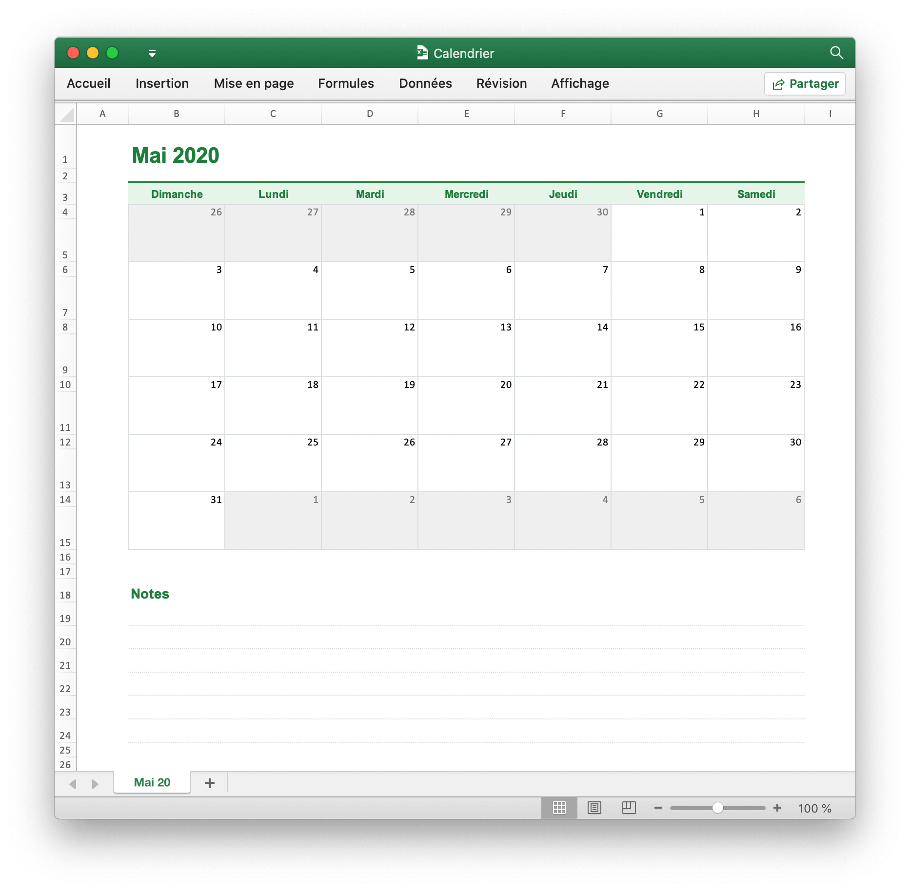

# Calendrier

Créer un calendrier avec Excelize à l'aide de Go:

<p align="center"></p>

```go
package main

import (
    "fmt"
    "strconv"

    "github.com/xuri/excelize/v2"
)

func main() {
    // créer une nouvelle feuille de calcul
    f := excelize.NewFile()
    var (
        monthStyle, titleStyle, dataStyle, blankStyle,
        grayBlankStyle, grayDataStyle, noteStyle, noteLineStyle int
        err   error
        addr  string
        sheet = "Sheet1"
        // valeurs de cellule
        data = map[int][]interface{}{
            1: {"Mai 2020"},
            3: {"Dimanche", "Lundi", "Mardi", "Mercredi",
                "Jeudi", "Vendredi", "Samedi"},
            4:  {26, 27, 28, 29, 30, 1, 2},
            6:  {3, 4, 5, 6, 7, 8, 9},
            8:  {10, 11, 12, 13, 14, 15, 16},
            10: {17, 18, 19, 20, 21, 22, 23},
            12: {24, 25, 26, 27, 28, 29, 30},
            14: {31, 1, 2, 3, 4, 5, 6},
            18: {"Notes"},
        }
        // hauteur des lignes personnalisées
        height = map[int]float64{
            1: 45, 3: 22, 5: 44, 7: 44, 9: 44, 11: 44, 13: 44, 15: 44,
            18: 24, 19: 24, 20: 24, 21: 24, 22: 24, 23: 24, 24: 24,
        }
        top    = excelize.Border{Type: "top", Style: 1, Color: "DADEE0"}
        left   = excelize.Border{Type: "left", Style: 1, Color: "DADEE0"}
        right  = excelize.Border{Type: "right", Style: 1, Color: "DADEE0"}
        bottom = excelize.Border{Type: "bottom", Style: 1, Color: "DADEE0"}
        fill   = excelize.Fill{Type: "pattern", Color: []string{"EFEFEF"}, Pattern: 1}
    )
    // définir chaque valeur de cellule
    for r, row := range data {
        if addr, err = excelize.JoinCellName("B", r); err != nil {
            fmt.Println(err)
            return
        }
        if err = f.SetSheetRow(sheet, addr, &row); err != nil {
            fmt.Println(err)
            return
        }
    }
    // définir la hauteur de ligne personnalisée
    for r, ht := range height {
        if err = f.SetRowHeight(sheet, r, ht); err != nil {
            fmt.Println(err)
            return
        }
    }
    // définir la largeur de colonne personnalisée
    if err = f.SetColWidth(sheet, "B", "H", 16.5); err != nil {
        fmt.Println(err)
        return
    }
    // fusionner la cellule pour le 'MOIS'
    if err = f.MergeCell(sheet, "B1", "D1"); err != nil {
        fmt.Println(err)
        return
    }
    // définir le style de police pour le "MOIS"
    if monthStyle, err = f.NewStyle(&excelize.Style{
        Font: &excelize.Font{Color: "1F7F3B", Bold: true, Size: 22, Family: "Arial"},
    }); err != nil {
        fmt.Println(err)
        return
    }
    // définir le style de police pour le "MOIS"
    if err = f.SetCellStyle(sheet, "B1", "D1", monthStyle); err != nil {
        fmt.Println(err)
        return
    }
    // définir le style du 'DIMANCHE' au 'SAMEDI'
    if titleStyle, err = f.NewStyle(&excelize.Style{
        Font:      &excelize.Font{Color: "1F7F3B", Bold: true, Family: "Arial"},
        Fill:      excelize.Fill{Type: "pattern", Color: []string{"E6F4EA"}, Pattern: 1},
        Alignment: &excelize.Alignment{Vertical: "center", Horizontal: "center"},
        Border:    []excelize.Border{{Type: "top", Style: 2, Color: "1F7F3B"}},
    }); err != nil {
        fmt.Println(err)
        return
    }
    // définir le style du "DIMANCHE" au "SAMEDI"
    if err = f.SetCellStyle(sheet, "B3", "H3", titleStyle); err != nil {
        fmt.Println(err)
        return
    }
    // définir la bordure de cellule pour la cellule de date dans la plage de dates
    if dataStyle, err = f.NewStyle(&excelize.Style{
        Border: []excelize.Border{top, left, right},
    }); err != nil {
        fmt.Println(err)
        return
    }
    // définir la bordure de cellule pour la cellule de date dans la plage de dates
    for _, r := range []int{4, 6, 8, 10, 12, 14} {
        if err = f.SetCellStyle(sheet, "B"+strconv.Itoa(r),
            "H"+strconv.Itoa(r), dataStyle); err != nil {
            fmt.Println(err)
            return
        }
    }
    // définir la bordure de cellule pour la cellule vide dans la plage de dates
    if blankStyle, err = f.NewStyle(&excelize.Style{
        Border: []excelize.Border{left, right, bottom},
    }); err != nil {
        fmt.Println(err)
        return
    }
    // définir la bordure de cellule pour la cellule vide dans la plage de dates
    for _, r := range []int{5, 7, 9, 11, 13, 15} {
        if err = f.SetCellStyle(sheet, "B"+strconv.Itoa(r),
            "H"+strconv.Itoa(r), blankStyle); err != nil {
            fmt.Println(err)
            return
        }
    }
    // définir le style de bordure et de remplissage de la cellule vide le mois précédent et le mois suivant
    if grayBlankStyle, err = f.NewStyle(&excelize.Style{
        Border: []excelize.Border{left, right, bottom},
        Fill:   fill}); err != nil {
        fmt.Println(err)
        return
    }
    // définir le style de bordure et de remplissage pour la cellule vide le mois précédent et le mois suivant
    if err = f.SetCellStyle(sheet, "B5", "F5", grayBlankStyle); err != nil {
        fmt.Println(err)
        return
    }
    if err = f.SetCellStyle(sheet, "C15", "H15", grayBlankStyle); err != nil {
        fmt.Println(err)
        return
    }
    // définir la bordure et le style de remplissage de la cellule de date du mois précédent et du mois suivant
    if grayDataStyle, err = f.NewStyle(&excelize.Style{
        Border: []excelize.Border{left, right, top},
        Font:   &excelize.Font{Color: "777777"}, Fill: fill}); err != nil {
        fmt.Println(err)
        return
    }
    // définir le style de bordure et de remplissage pour la cellule de date du mois précédent et du mois suivant
    if err = f.SetCellStyle(sheet, "B4", "F4", grayDataStyle); err != nil {
        fmt.Println(err)
        return
    }
    if err = f.SetCellStyle(sheet, "C14", "H14", grayDataStyle); err != nil {
        fmt.Println(err)
        return
    }
    // définir le style de police pour les "Notes"
    if noteStyle, err = f.NewStyle(&excelize.Style{
        Font: &excelize.Font{Color: "1F7F3B", Bold: true, Size: 14, Family: "Arial"},
    }); err != nil {
        fmt.Println(err)
        return
    }
    // définir le style de police pour les "Notes"
    if err = f.SetCellStyle(sheet, "B18", "B18", noteStyle); err != nil {
        fmt.Println(err)
        return
    }
    // define cell style for the note range
    if noteLineStyle, err = f.NewStyle(&excelize.Style{
        Border: []excelize.Border{{Type: "bottom", Style: 4, Color: "DDDDDD"}},
    }); err != nil {
        fmt.Println(err)
        return
    }
    // définir le style de cellule pour la plage de notes
    for r := 19; r < 25; r++ {
        if err = f.SetCellStyle(sheet, "B"+strconv.Itoa(r),
            "H"+strconv.Itoa(r), noteLineStyle); err != nil {
            fmt.Println(err)
            return
        }
    }
    // masquer le quadrillage de la feuille de calcul
    disable := false
    if err := f.SetSheetView("Sheet1", 0, &excelize.ViewOptions{
        ShowGridLines: &disable,
    }); err != nil {
        fmt.Println(err)
    }
    // renommer la feuille de calcul
    f.SetSheetName(sheet, "Mai 20")
    // enregistrer le fichier de feuille de calcul
    if err = f.SaveAs("Calendrier.xlsx"); err != nil {
        fmt.Println(err)
    }
}
```
