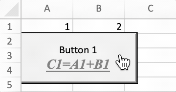

# Contrôles de formulaire

FormControl mappe directement les informations des contrôles de formulaire.

```go
type FormControl struct {
    Cell         string
    Macro        string
    Width        uint
    Height       uint
    Checked      bool
    CurrentVal   uint
    MinVal       uint
    MaxVal       uint
    IncChange    uint
    PageChange   uint
    Horizontally bool
    CellLink     string
    Text         string
    Paragraph    []RichTextRun
    Type         FormControlType
    Format       GraphicOptions
}
```

## Ajouter un contrôle de formulaire {#AddFormControl}

```go
func (f *File) AddFormControl(sheet string, opts FormControl) error
```

AddFormControl fournit la méthode permettant d'ajouter un bouton de contrôle de formulaire dans une feuille de calcul en fonction du nom de feuille de calcul et des options de contrôle de formulaire donnés. Type de contrôle de formulaire pris en charge : bouton, case à cocher, zone de groupe, étiquette, bouton d'option, barre de défilement et spinner. Si la macro définie pour le contrôle de formulaire, l'extension du classeur doit être `.xlsm` ou `.xltm`. La valeur de défilement doit être comprise entre 0 et 30000.

Exemple 1, ajout d'un contrôle de formulaire de bouton avec macro, texte enrichi, taille de bouton personnalisée, propriété print sur `Feuil1!A2`, et laissez le bouton ne pas bouger ou dimensionner avec des cellules:

<p align="center"></p>

```go
err := f.AddFormControl("Feuil1", excelize.FormControl{
    Cell:   "A2",
    Type:   excelize.FormControlButton,
    Macro:  "Button1_Click",
    Width:  140,
    Height: 60,
    Text:   "Button 1\r\n",
    Paragraph: []excelize.RichTextRun{
        {
            Font: &excelize.Font{
                Bold:      true,
                Italic:    true,
                Underline: "single",
                Family:    "Times New Roman",
                Size:      14,
                Color:     "777777",
            },
            Text: "C1=A1+B1",
        },
    },
    Format: excelize.GraphicOptions{
        PrintObject: &enable,
        Positioning: "absolute",
    },
})
```

Exemple 2, ajouter des contrôles de formulaire à bouton d'option avec l'état coché et le texte sur `Feuil1!A1` et `Feuil1!A2`:

<p align="center"></p>

```go
if err := f.AddFormControl("Feuil1", excelize.FormControl{
    Cell:    "A1",
    Type:    excelize.FormControlOptionButton,
    Text:    "Option Button 1",
    Checked: true,
}); err != nil {
    fmt.Println(err)
}
if err := f.AddFormControl("Feuil1", excelize.FormControl{
    Cell:    "A2",
    Type:    excelize.FormControlOptionButton,
    Text:    "Option Button 2",
}); err != nil {
    fmt.Println(err)
}
```

Exemple 3, ajouter un contrôle de formulaire de bouton de rotation sur `Feuil1!B1` pour augmenter ou diminuer la valeur de `Feuil1!A1`:

<p align="center"></p>

```go
err := f.AddFormControl("Feuil1", excelize.FormControl{
    Cell:       "B1",
    Type:       excelize.FormControlSpinButton,
    Width:      15,
    Height:     40,
    CurrentVal: 7,
    MinVal:     5,
    MaxVal:     10,
    IncChange:  1,
    CellLink:   "A1",
})
```

Exemple 4, ajouter un contrôle de formulaire à barre de défilement horizontale sur `Feuil1!A2` pour modifier la valeur de `Feuil1!A1` en cliquant sur les flèches de défilement ou en faisant glisser la boîte de défilement:

<p align="center"></p>

```go
err := f.AddFormControl("Feuil1", excelize.FormControl{
    Cell:         "A2",
    Type:         excelize.FormControlScrollBar,
    Width:        140,
    Height:       20,
    CurrentVal:   50,
    MinVal:       10,
    MaxVal:       100,
    IncChange:    1,
    PageChange:   1,
    CellLink:     "A1",
    Horizontally: true,
})
```

## Obtenir des contrôles de formulaire {#GetFormControls}

```go
func (f *File) GetFormControls(sheet string) ([]FormControl, error)
```

GetFormControls récupère tous les contrôles de formulaire dans une feuille de calcul par un nom de feuille de calcul donné. Notez que cette fonction ne prend pas actuellement en charge l'obtention de la largeur et de la hauteur des contrôles de formulaire.

## Supprimer le contrôle de formulaire {#DeleteFormControl}

```go
func (f *File) DeleteFormControl(sheet, cell string) error
```

DeleteFormControl fournit la méthode pour supprimer le contrôle de formulaire dans une feuille de calcul en fonction du nom de la feuille de calcul et de la référence de cellule. Par exemple, supprimez le contrôle de formulaire dans `Feuil1!$A$1`:

```go
err := f.DeleteFormControl("Feuil1", "A1")
```
