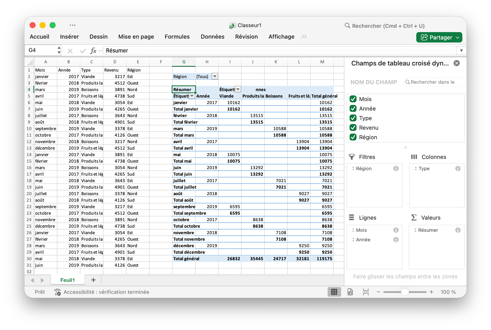

# Tableau croisé dynamique {#PivotTable}

Un tableau croisé dynamique est un tableau de statistiques qui résume les données d'un tableau plus détaillé (tel qu'une base de données, un tableur ou un programme d'aide à la décision). Ce résumé peut inclure des sommes, des moyennes ou d’autres statistiques que le tableau croisé dynamique regroupe de manière significative.

PivotTableOption mappe directement les paramètres de format du tableau croisé dynamique.

```go
type PivotTableOption struct {
    DataRange       string
    PivotTableRange string
    Rows            []PivotTableField
    Columns         []PivotTableField
    Data            []PivotTableField
    Filter          []PivotTableField
}
```

PivotTableField mappe directement les paramètres de champ du tableau croisé dynamique.

```go
type PivotTableField struct {
    Data     string
    Name     string
    Subtotal string
}
```

Subtotal spécifie la fonction d'agrégation qui s'applique à ce champ de données. La valeur par défaut est `Sum`. Les valeurs possibles pour cet attribut sont:

|Valeur facultative|
|---|
|Average|
|Count|
|CountNums|
|Max|
|Min|
|Product|
|StdDev|
|StdDevp|
|Sum|
|Var|
|Varp|

Name spécifie le nom du champ de données. Un maximum de `255` caractères est autorisé dans le nom du champ de données, les caractères en excès seront tronqués.

## Créer un tableau croisé dynamique {#AddPivotTable}

```go
func (f *File) AddPivotTable(opt *PivotTableOption) error
```

AddPivotTable fournit la méthode pour ajouter un tableau croisé dynamique en fonction des options de tableau croisé dynamique données.

Par exemple, créez un tableau croisé dynamique dans la zone `Sheet1!$G$2:$M$34` avec la région `Sheet1!$A$1:$E$31` comme source de données, récapitulez par somme pour les ventes:

<p align="center"></p>

```go
package main

import (
    "fmt"
    "math/rand"

    "github.com/360EntSecGroup-Skylar/excelize"
)

func main() {
    f := excelize.NewFile()
    // Créer des données dans une feuille
    month := []string{"Jan", "Feb", "Mar", "Apr", "May", "Jun", "Jul", "Aug", "Sep", "Oct", "Nov", "Dec"}
    year := []int{2017, 2018, 2019}
    types := []string{"Meat", "Dairy", "Beverages", "Produce"}
    region := []string{"East", "West", "North", "South"}
    f.SetSheetRow("Sheet1", "A1", &[]string{"Month", "Year", "Type", "Sales", "Region"})
    for i := 0; i < 30; i++ {
        f.SetCellValue("Sheet1", fmt.Sprintf("A%d", i+2), month[rand.Intn(12)])
        f.SetCellValue("Sheet1", fmt.Sprintf("B%d", i+2), year[rand.Intn(3)])
        f.SetCellValue("Sheet1", fmt.Sprintf("C%d", i+2), types[rand.Intn(4)])
        f.SetCellValue("Sheet1", fmt.Sprintf("D%d", i+2), rand.Intn(5000))
        f.SetCellValue("Sheet1", fmt.Sprintf("E%d", i+2), region[rand.Intn(4)])
    }
    if err := f.AddPivotTable(&excelize.PivotTableOption{
        DataRange:       "Sheet1!$A$1:$E$31",
        PivotTableRange: "Sheet1!$G$2:$M$34",
        Rows:            []excelize.PivotTableField{{Data: "Month"}, {Data: "Year"}},
        Filter:          []excelize.PivotTableField{{Data: "Region"}},
        Columns:         []excelize.PivotTableField{{Data: "Type"}},
        Data:            []excelize.PivotTableField{{Data: "Sales", Name: "Summarize", Subtotal: "Sum"}},
    }); err != nil {
        fmt.Println(err)
    }
    if err := f.SaveAs("Book1.xlsx"); err != nil {
        fmt.Println(err)
    }
}
```
