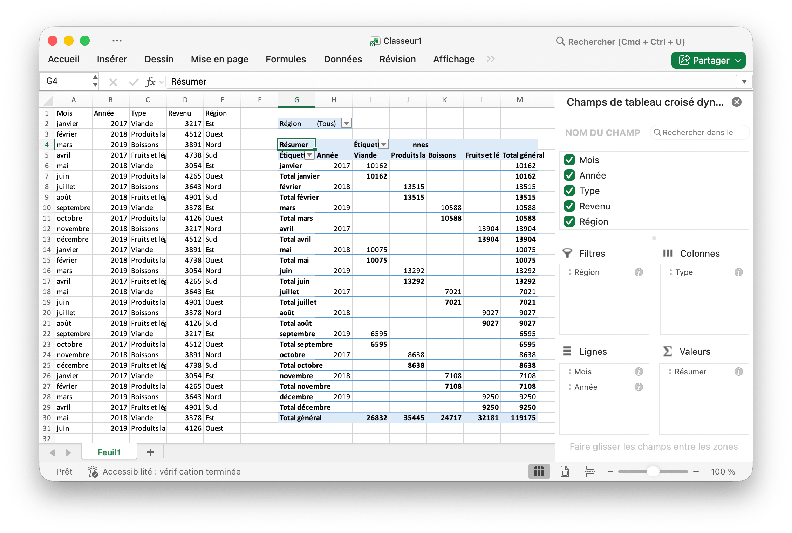

# Tableau croisé dynamique {#PivotTable}

Un tableau croisé dynamique est un tableau de statistiques qui résume les données d'un tableau plus détaillé (tel qu'une base de données, un tableur ou un programme d'aide à la décision). Ce résumé peut inclure des sommes, des moyennes ou d'autres statistiques que le tableau croisé dynamique regroupe de manière significative.

`PivotTableOptions` mappe directement les paramètres de format du tableau croisé dynamique.

```go
type PivotTableOptions struct {
    DataRange           string
    PivotTableRange     string
    Name                string
    Rows                []PivotTableField
    Columns             []PivotTableField
    Data                []PivotTableField
    Filter              []PivotTableField
    RowGrandTotals      bool
    ColGrandTotals      bool
    ShowDrill           bool
    UseAutoFormatting   bool
    PageOverThenDown    bool
    MergeItem           bool
    ClassicLayout       bool
    CompactData         bool
    ShowError           bool
    ShowRowHeaders      bool
    ShowColHeaders      bool
    ShowRowStripes      bool
    ShowColStripes      bool
    ShowLastColumn      bool
    FieldPrintTitles    bool
    ItemPrintTitles     bool
    PivotTableStyleName string
    // contient des champs filtrés ou non exportés
}
```

`PivotTableStyleName`: Les noms de style de tableau croisé dynamique intégrés:

```text
PivotStyleLight1 - PivotStyleLight28
PivotStyleMedium1 - PivotStyleMedium28
PivotStyleDark1 - PivotStyleDark28
```

`PivotTableField` mappe directement les paramètres de champ du tableau croisé dynamique.

```go
type PivotTableField struct {
    Compact         bool
    Data            string
    Name            string
    Outline         bool
    ShowAll         bool
    InsertBlankRow  bool
    Subtotal        string
    DefaultSubtotal bool
    NumFmt          int
    SelectedItems   []string
}
```

`Subtotal` spécifie la fonction d'agrégation qui s'applique à ce champ de données. La valeur par défaut est `Sum`. Les valeurs possibles pour cet attribut sont:

|Valeur facultative|
|---|
|Average|
|Count|
|CountNums|
|Max|
|Min|
|Product|
|StdDev|
|StdDevp|
|Sum|
|Var|
|Varp|

`Name` spécifie le nom du champ de données. Un maximum de `255` caractères est autorisé dans le nom du champ de données, les caractères en excès seront tronqués.

`SelectedItems` spécifie les éléments sélectionnés par défaut dans un champ de tableau croisé dynamique. Les éléments sélectionnés doivent être des valeurs comprises dans la plage de cellules référencée par ce champ.

## Créer un tableau croisé dynamique {#AddPivotTable}

```go
func (f *File) AddPivotTable(opts *PivotTableOptions) error
```

AddPivotTable fournit la méthode pour ajouter un tableau croisé dynamique en fonction des options de tableau croisé dynamique données.

Par exemple, créez un tableau croisé dynamique dans la zone `Feuil1!G4:M30` avec la région `Feuil1!A1:E31` comme source de données, récapitulez par somme pour les ventes:

<p align="center"></p>

```go
package main

import (
    "fmt"

    "github.com/xuri/excelize/v2"
)

func main() {
    f := excelize.NewFile()
    defer func() {
        if err := f.Close(); err != nil {
            fmt.Println(err)
        }
    }()
    if err := f.SetSheetName("Sheet1", "Feuil1"); err != nil {
        fmt.Println(err)
        return
    }
    // Créer des données dans une feuille
    month := []string{"janvier", "février", "mars", "avril", "mai", "juin",
        "juillet", "août", "septembre", "octobre", "novembre", "décembre"}
    year := []int{2017, 2018, 2019}
    types := []string{"Viande", "Produits laitiers", "Boissons", "Fruits et légumes"}
    revenue := []int{3217, 4512, 3891, 4738, 3054, 4265, 3643, 4901, 3378, 4126}
    region := []string{"Est", "Ouest", "Nord", "Sud"}
    if err := f.SetSheetRow(
        "Feuil1", "A1", &[]string{"Mois", "Année", "Type", "Revenu", "Région"},
    ); err != nil {
        fmt.Println(err)
        return
    }
    for row := 2; row < 32; row++ {
        f.SetCellValue("Feuil1", fmt.Sprintf("A%d", row), month[(row-2)%len(month)])
        f.SetCellValue("Feuil1", fmt.Sprintf("B%d", row), year[(row-2)%len(year)])
        f.SetCellValue("Feuil1", fmt.Sprintf("C%d", row), types[(row-2)%len(types)])
        f.SetCellValue("Feuil1", fmt.Sprintf("D%d", row), revenue[(row-2)%len(revenue)])
        f.SetCellValue("Feuil1", fmt.Sprintf("E%d", row), region[(row-2)%len(region)])
    }
    if err := f.AddPivotTable(&excelize.PivotTableOptions{
        DataRange:       "Feuil1!A1:E31",
        PivotTableRange: "Feuil1!G4:M30",
        Rows: []excelize.PivotTableField{
            {Data: "Mois", DefaultSubtotal: true}, {Data: "Année"},
        },
        Filter: []excelize.PivotTableField{
            {Data: "Région"},
        },
        Columns: []excelize.PivotTableField{
            {Data: "Type", DefaultSubtotal: true},
        },
        Data: []excelize.PivotTableField{
            {Data: "Revenu", Name: "Résumer", Subtotal: "Sum"},
        },
        RowGrandTotals: true,
        ColGrandTotals: true,
        ShowDrill:      true,
        ShowRowHeaders: true,
        ShowColHeaders: true,
        ShowLastColumn: true,
    }); err != nil {
        fmt.Println(err)
        return
    }
    if err := f.SaveAs("Classeur1.xlsx"); err != nil {
        fmt.Println(err)
    }
}
```

## Obtenir des tableaux pivotants {#GetPivotTables}

```go
func (f *File) GetPivotTables(sheet string) ([]PivotTableOptions, error)
```

GetPivotTables renvoie toutes les définitions de tableau croisé dynamique dans une feuille de calcul par nom de feuille de calcul donné.

## Supprimer le tableau croisé dynamique {#DeletePivotTable}

```go
func (f *File) DeletePivotTable(sheet, name string) error
```

DeletePivotTable supprime un tableau croisé dynamique en donnant le nom de la feuille de calcul et le nom du tableau croisé dynamique. Notez que cette fonction ne nettoie pas les valeurs des cellules dans la plage du tableau croisé dynamique.
