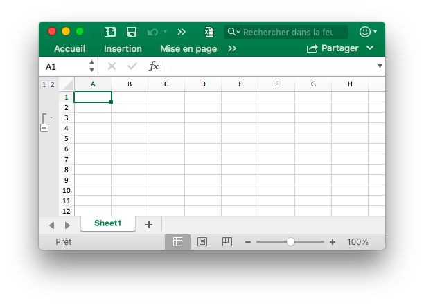
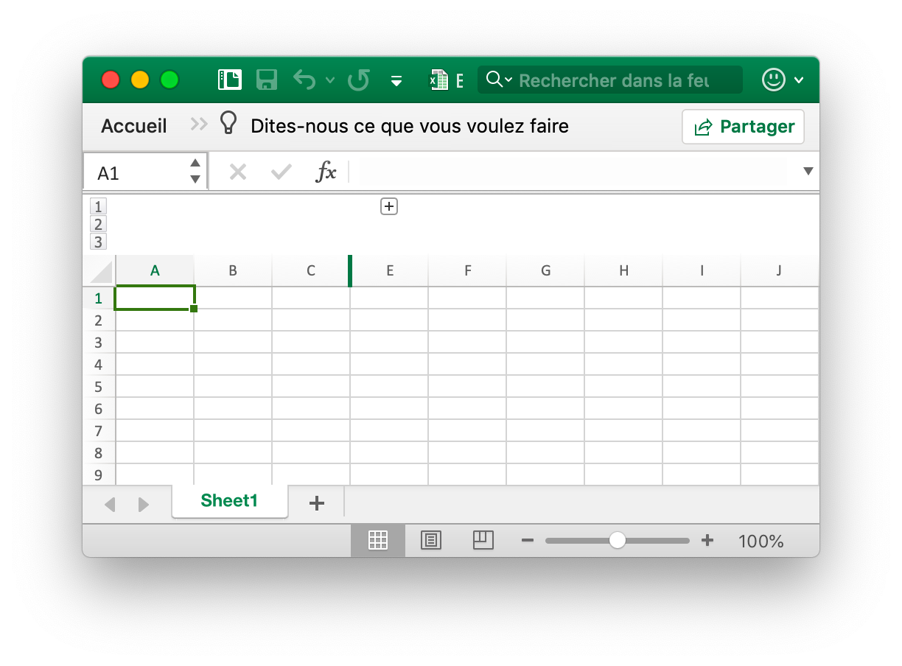
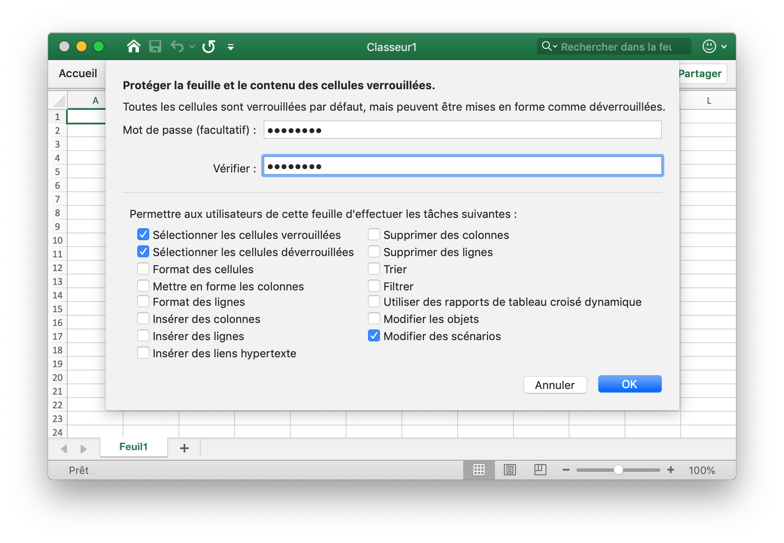

# Feuille de travail

## Définir la visibilité de la colonne {#SetColVisible}

```go
func (f *File) SetColVisible(sheet, col string, visible bool) error
```

SetColVisible fournit une fonction pour définir visible d'une seule colonne par nom de feuille de calcul et nom de colonne donné. Par exemple, cachez la colonne `D` dans `Sheet1`:

```go
err := f.SetColVisible("Sheet1", "D", false)
```

Masquez les colonnes de `D` à `F` (incluses):

```go
err := f.SetColVisible("Sheet1", "D:F", false)
```

## Définir la largeur de la colonne {#SetColWidth}

```go
func (f *File) SetColWidth(sheet, startCol, endCol string, width float64) error
```

SetColWidth fournit la fonction permettant de définir la largeur d'une ou de plusieurs colonnes. Par exemple:

```go
f := excelize.NewFile()
err := f.SetColWidth("Sheet1", "A", "H", 20)
```

## Définir la hauteur de ligne {#SetRowHeight}

```go
func (f *File) SetRowHeight(sheet string, row int, height float64) error
```

SetRowHeight fournit une fonction pour définir la hauteur d'une seule ligne. Par exemple, définissez la hauteur de la première ligne dans `Sheet1`:

```go
err := f.SetRowHeight("Sheet1", 1, 50)
```

## Définir la visibilité de la ligne {#SetRowVisible}

```go
func (f *File) SetRowVisible(sheet string, row int, visible bool) error
```

SetRowVisible fournit une fonction pour définir visible d'une seule ligne par nom de feuille de calcul donné et index de ligne. Par exemple, masquez la ligne `2` dans `Sheet1`:

```go
err := f.SetRowVisible("Sheet1", 2, false)
```

## Obtenir le nom de la feuille de calcul {#GetSheetName}

```go
func (f *File) GetSheetName(index int) string
```

GetSheetName fournit une fonction pour obtenir le nom de feuille de calcul de XLSX par index de feuille de calcul donné. Si l'index de feuille donné est invalide, retournera une chaîne vide.

## Obtenir la visibilité de la colonne {#GetColVisible}

```go
func (f *File) GetColVisible(sheet, column string) (bool, error)
```

GetColVisible fournit une fonction permettant d'afficher une seule colonne par nom de feuille de calcul et nom de colonne donnés. Par exemple, obtenez l'état visible de la colonne `D` dans `Sheet1`:

```go
visible, err := f.GetColVisible("Sheet1", "D")
```

## Obtenir la largeur de la colonne {#GetColWidth}

```go
func (f *File) GetColWidth(sheet, col string) (float64, error)
```

GetColWidth fournit une fonction permettant d'obtenir la largeur de colonne par nom de feuille de calcul et index de colonne donnés.

## Obtenir la hauteur de la rangée {#GetRowHeight}

```go
func (f *File) GetRowHeight(sheet string, row int) (float64, error)
```

GetRowHeight fournit une fonction pour obtenir la hauteur de ligne par nom de feuille de calcul donné et index de ligne. Par exemple, obtenez la hauteur de la première ligne dans `Sheet1`:

```go
height, err := f.GetRowHeight("Sheet1", 1)
```

## Obtenir la visibilité des lignes {#GetRowVisible}

```go
func (f *File) GetRowVisible(sheet string, row int) (bool, error)
```

GetRowVisible fournit une fonction permettant d'afficher une seule ligne par nom de feuille de calcul et index de ligne donnés. Par exemple, obtenez l'état visible de la ligne `2` dans `Sheet1`:

```go
err := f.GetRowVisible("Sheet1", 2)
```

## Obtenir l'index de la feuille de calcul {#GetSheetIndex}

```go
func (f *File) GetSheetIndex(name string) int
```

GetSheetIndex fournit une fonction pour obtenir un index de feuille du classeur par le nom de feuille donné. Si le nom de feuille donné n'est pas valide, il renverra une valeur de type entier `-1`.

L'index obtenu peut être utilisé comme paramètre pour appeler la fonction [`SetActiveSheet()`](workbook.md#SetActiveSheet) lors de la définition de la feuille de calcul par défaut du classeur.

## Obtenir le plan des feuilles {#GetSheetMap}

```go
func (f *File) GetSheetMap() map[int]string
```

GetSheetMap fournit une fonction pour obtenir des feuilles de calcul, des feuilles de graphique, des ID de feuilles de dialogue et une carte de noms du classeur. Par exemple:

```go
f, err := excelize.OpenFile("Book1.xlsx")
if err != nil {
    return
}
for index, name := range f.GetSheetMap() {
    fmt.Println(index, name)
}
```

## Obtenir la liste des feuilles {#GetSheetList}

```go
func (f *File) GetSheetList() []string
```

GetSheetList fournit une fonction pour obtenir les feuilles de calcul, les feuilles de graphique et la liste de noms des feuilles de dialogue du classeur.

## Définir le nom de la feuille de calcul {#SetSheetName}

```go
func (f *File) SetSheetName(oldName, newName string)
```

SetSheetName fournit une fonction pour définir le nom de la feuille de calcul en fonction des anciens et nouveaux noms de feuille de calcul. Un maximum de 31 caractères sont autorisés dans le titre de la feuille et cette fonction ne modifie que le nom de la feuille et ne mettra pas à jour le nom de la feuille dans la formule ou la référence associée à la cellule. Il peut donc y avoir une erreur de formule ou une référence manquante.

## Définir les propriétés d'une feuille de calcul {#SetSheetPrOptions}

```go
func (f *File) GetSheetPrOptions(name string, opts ...SheetPrOptionPtr) error
```

SetSheetPrOptions fournit une fonction pour définir les propriétés de feuille de calcul.

Options disponibles:

|Attribut facultatif|Type|
|---|---|
|CodeName|string|
|EnableFormatConditionsCalculation|bool|
|Published|bool|
|FitToPage|bool|
|TabColor|string|
|AutoPageBreaks|bool|
|OutlineSummaryBelow|bool|

Par exemple:

```go
f := excelize.NewFile()
const sheet = "Sheet1"

if err := f.SetSheetPrOptions(sheet,
    excelize.CodeName("code"),
    excelize.EnableFormatConditionsCalculation(false),
    excelize.Published(false),
    excelize.FitToPage(true),
    excelize.TabColor("#FFFF00"),
    excelize.AutoPageBreaks(true),
    excelize.OutlineSummaryBelow(false),
); err != nil {
    fmt.Println(err)
}
```

## Obtenir les propriétés de la feuille de calcul {#GetSheetPrOptions}

```go
func (f *File) GetSheetPrOptions(name string, opts ...SheetPrOptionPtr) error
```

GetSheetPrOptions fournit une fonction pour obtenir des propriétés de feuille de calcul.

|Attribut facultatif|Type|
|---|---|
|CodeName|string|
|EnableFormatConditionsCalculation|bool|
|Published|bool|
|FitToPage|bool|
|TabColor|string|
|AutoPageBreaks|bool|
|OutlineSummaryBelow|bool|

Par exemple:

```go
f := excelize.NewFile()
const sheet = "Sheet1"

var (
    codeName                          excelize.CodeName
    enableFormatConditionsCalculation excelize.EnableFormatConditionsCalculation
    published                         excelize.Published
    fitToPage                         excelize.FitToPage
    tabColor                          excelize.TabColor
    autoPageBreaks                    excelize.AutoPageBreaks
    outlineSummaryBelow               excelize.OutlineSummaryBelow
)

if err := f.GetSheetPrOptions(sheet,
    &codeName,
    &enableFormatConditionsCalculation,
    &published,
    &fitToPage,
    &tabColor,
    &autoPageBreaks,
    &outlineSummaryBelow,
); err != nil {
    fmt.Println(err)
}
fmt.Println("Defaults:")
fmt.Printf("- codeName: %q\n", codeName)
fmt.Println("- enableFormatConditionsCalculation:", enableFormatConditionsCalculation)
fmt.Println("- published:", published)
fmt.Println("- fitToPage:", fitToPage)
fmt.Printf("- tabColor: %q\n", tabColor)
fmt.Println("- autoPageBreaks:", autoPageBreaks)
fmt.Println("- outlineSummaryBelow:", outlineSummaryBelow)
```

Sortie:

```text
Defaults:
- codeName: ""
- enableFormatConditionsCalculation: true
- published: true
- fitToPage: false
- tabColor: ""
- autoPageBreaks: false
- outlineSummaryBelow: true
```

## Insérer une colonne {#InsertCol}

```go
func (f *File) InsertCol(sheet, column string) error
```

InsertCol fournit une fonction pour insérer une nouvelle colonne avant l'index de colonne donné. Par exemple, créez une nouvelle colonne avant la colonne `C` dans `Sheet1`:

```go
err := f.InsertCol("Sheet1", "C")
```

## Insérer une ligne {#InsertRow}

```go
func (f *File) InsertRow(sheet string, row int) error
```

InsertRow fournit une fonction pour insérer une nouvelle ligne avant l'index de ligne donné. Par exemple, créez une nouvelle ligne avant la ligne `3` dans `Sheet1`:

```go
err := f.InsertRow("Sheet1", 3)
```

## Ajouter une ligne en double {#DuplicateRow}

```go
func (f *File) DuplicateRow(sheet string, row int) error
```

DuplicateRow insère une copie de la ligne spécifiée ci-dessous, par exemple:

```go
err := f.DuplicateRow("Sheet1", 2)
```

Utilisez cette méthode avec prudence, car elle affectera les modifications de références telles que les formules, les graphiques, etc. S'il existe une valeur référencée de la feuille de calcul, cela provoquera une erreur de fichier lorsque vous l'ouvrirez. Excelize ne met à jour que partiellement ces références.

## Ligne en double {#DuplicateRowTo}

```go
func (f *File) DuplicateRowTo(sheet string, row, row2 int) error
```

DuplicateRowTo insère une copie de la ligne spécifiée à la position indiquée, en descendant les lignes existantes après la position cible, par exemple:

```go
err := f.DuplicateRowTo("Sheet1", 2, 7)
```

Utilisez cette méthode avec prudence, car elle affectera les modifications de références telles que les formules, les graphiques, etc. S'il existe une valeur référencée de la feuille de calcul, cela provoquera une erreur de fichier lorsque vous l'ouvrirez. Excelize ne met à jour que partiellement ces références.

## Créer un contour de ligne {#SetRowOutlineLevel}

```go
func (f *File) SetRowOutlineLevel(sheet string, row int, level uint8) error
```

SetRowOutlineLevel fournit une fonction pour définir le numéro de niveau hiérarchique d'une seule ligne par nom de feuille de calcul donné et index de ligne. Par exemple, définissez la ligne 2 dans `Sheet1` au niveau 1:

<p align="center"></p>

```go
err := f.SetRowOutlineLevel("Sheet1", 2, 1)
```

## Créer un plan de colonne {#SetColOutlineLevel}

```go
func (f *File) SetColOutlineLevel(sheet, col string, level uint8) error
```

SetColOutlineLevel fournit une fonction permettant de définir le niveau hiérarchique d'une seule colonne par nom de feuille de calcul et nom de colonne donnés. Par exemple, définissez le niveau hiérarchique de la colonne `D` dans `Sheet1` sur 2:

<p align="center"></p>

```go
err := f.SetColOutlineLevel("Sheet1", "D", 2)
```

## Obtenir le contour de la ligne {#GetRowOutlineLevel}

```go
func (f *File) GetRowOutlineLevel(sheet string, row int) (uint8, error)
```

GetRowOutlineLevel fournit une fonction pour obtenir le numéro de niveau hiérarchique d'une seule ligne par nom de feuille de calcul donné et index de ligne. Par exemple, obtenez le numéro de contour de la ligne 2 dans `Sheet1`:

```go
err := f.GetRowOutlineLevel("Sheet1", 2)
```

## Obtenir le plan de la colonne {#GetColOutlineLevel}

```go
func (f *File) GetColOutlineLevel(sheet, col string) (uint8, error)
```

GetColOutlineLevel fournit une fonction permettant d'obtenir le niveau hiérarchique d'une seule colonne par nom de feuille de calcul et nom de colonne donnés. Par exemple, obtenez le niveau hiérarchique de la colonne `D` dans `Sheet1`:

```go
level, err := f.GetColOutlineLevel("Sheet1", "D")
```

## Itérateur de colonne {#Cols}

```go
func (f *File) Cols(sheet string) (*Cols, error)
```

Cols renvoie un itérateur de colonnes, utilisé pour diffuser en continu les données de lecture d'une feuille de calcul contenant de grandes données. Par exemple:

```go
cols, err := f.Cols("Sheet1")
if err != nil {
    fmt.Println(err)
    return
}
for cols.Next() {
    col, err := cols.Rows()
    if err != nil {
        fmt.Println(err)
    }
    for _, rowCell := range col {
        fmt.Print(rowCell, "\t")
    }
    fmt.Println()
}
```

### Itérateur de colonne - Colonnes

```go
func (cols *Cols) Rows(opts ...Options) ([]string, error)
```

Rows renvoie les valeurs de ligne de la colonne actuelle.

### Itérateur de colonne - Traversing

```go
func (cols *Cols) Next() bool
```

Next retournera `true` si la colonne suivante est trouvée.

### Itérateur de colonne - Gestion des erreurs

```go
func (cols *Cols) Error() error
```

Error renverra le `error` lorsque l'erreur se produit.

## Row itérateur {#Rows}

```go
func (f *File) Rows(sheet string) (*Rows, error)
```

Rows renvoie un itérateur de lignes, utilisé pour diffuser en continu les données de lecture d'une feuille de calcul contenant de grandes données. Par exemple:

```go
rows, err := f.Rows("Sheet1")
if err != nil {
    fmt.Println(err)
    return
}
for rows.Next() {
    row, err := rows.Columns()
    if err != nil {
        fmt.Println(err)
    }
    for _, colCell := range row {
        fmt.Print(colCell, "\t")
    }
    fmt.Println()
}
if err = rows.Close(); err != nil {
    fmt.Println(err)
}
```

### Row itérateur - Colonnes

```go
func (rows *Rows) Columns(opts ...Options) ([]string, error)
```

Columns renvoie les valeurs de colonne de la ligne actuelle.

### Row itérateur - Traverser

```go
func (rows *Rows) Next() bool
```

Next retournera `true` si trouver l'élément de ligne suivant.

### Row itérateur - La gestion des erreurs

```go
func (rows *Rows) Error() error
```

Error renverra le `error` lorsque l'erreur se produit.

### Row itérateur - Fermer

```go
func (rows *Rows) Close() error
```

Close ferme le fichier XML de feuille de calcul ouvert dans le répertoire temporaire du système.

## Rechercher dans la fiche de calcul {#SearchSheet}

```go
func (f *File) SearchSheet(sheet, value string, reg ...bool) ([]string, error)
```

SearchSheet fournit une fonction permettant d'obtenir les coordonnées en fonction du nom de la feuille de calcul et de la valeur de la cellule. Cette fonction ne prend en charge que la correspondance exacte des chaînes et des nombres, mais ne prend pas en charge le résultat calculé, les nombres mis en forme et la recherche conditionnelle. S'il s'agit d'une cellule fusionnée, les coordonnées du coin supérieur gauche de la zone fusionnée seront renvoyées.

Par exemple, recherchez les coordonnées de la valeur `100` sur `Sheet1`:

```go
result, err := f.SearchSheet("Sheet1", "100")
```

Par exemple, recherchez les coordonnées d’une valeur comprise entre `0-9` dans une feuille de calcul nommée `Sheet1`:

```go
result, err := f.SearchSheet("Sheet1", "[0-9]", true)
```

## Protéger la feuille {#ProtectSheet}

```go
func (f *File) ProtectSheet(sheet string, settings *FormatSheetProtection) error
```

ProtectSheet fournit une fonction pour empêcher d'autres utilisateurs de modifier, déplacer ou supprimer accidentellement ou délibérément des données dans une feuille de calcul. Le champ facultatif `AlgorithmName` spécifié l'algorithme de hachage, prend en charge XOR, MD4, MD5, SHA1, SHA256, SHA384 et SHA512 actuellement, si aucun algorithme de hachage n'est spécifié, utilisera l'algorithme XOR par défaut. Par exemple, protégez `Sheet1` avec les paramètres de protection:

<p align="center"></p>

```go
err := f.ProtectSheet("Sheet1", &excelize.FormatSheetProtection{
    AlgorithmName: "SHA-512",
    Password:      "password",
    EditScenarios: false,
})
```

## Ôter la protection de la feuille {#UnprotectedSheet}

```go
func (f *File) UnprotectSheet(sheet string) error
```

UnprotectSheet fournit une fonction pour supprimer la protection d'une feuille, spécifié le deuxième paramètre de mot de passe facultatif pour supprimer la protection de la feuille avec vérification du mot de passe.

## Supprimer la colonne {#RemoveCol}

```go
func (f *File) RemoveCol(sheet, col string) error
```

RemoveCol fournit une fonction permettant de supprimer une colonne unique par un nom de feuille de calcul et un index de colonne donnés. Par exemple, supprimez la colonne `C` dans `Sheet1`:

```go
err := f.RemoveCol("Sheet1", "C")
```

Utilisez cette méthode avec prudence, car elle affectera les modifications de références telles que les formules, les graphiques, etc. S'il existe une valeur référencée de la feuille de calcul, une erreur de fichier se produira lorsque vous l'ouvrirez. Excelize ne met à jour que partiellement ces références.

## Supprimer la ligne {#RemoveRow}

```go
func (f *File) RemoveRow(sheet string, row int) error
```

RemoveRow fournit une fonction permettant de supprimer une seule ligne par un nom de feuille de calcul et un numéro de ligne Excel donnés. Par exemple, supprimez la ligne `3` dans `Sheet1`:

```go
err := f.RemoveRow("Sheet1", 3)
```

Utilisez cette méthode avec prudence, car elle affectera les modifications de références telles que les formules, les graphiques, etc. S'il existe une valeur référencée de la feuille de calcul, une erreur de fichier se produira lorsque vous l'ouvrirez. Excelize ne met à jour que partiellement ces références.

## Définir les valeurs de ligne {#SetSheetRow}

```go
func (f *File) SetSheetRow(sheet, axis string, slice interface{}) error
```

SetSheetRow écrit un tableau dans une rangée en lui attribuant un nom, une coordonnée de départ et un pointeur sur le type de tableau `slice` Par exemple, écrit un tableau dans la ligne `6` avec la cellule `B6` sur `Sheet1`:

```go
err := f.SetSheetRow("Sheet1", "B6", &[]interface{}{"1", nil, 2})
```

## Insérer un saut de page {#InsertPageBreak}

```go
func (f *File) InsertPageBreak(sheet, cell string) error
```

InsertPageBreak crée un saut de page pour déterminer où la page imprimée se termine et où commence la suivante par un nom de feuille de calcul et un axe donnés, de sorte que le contenu avant le saut de page sera imprimé sur une page et après le saut de page sur une autre.

## Supprimer le saut de page {#RemovePageBreak}

```go
func (f *File) RemovePageBreak(sheet, cell string) error
```

RemovePageBreak supprime un saut de page par un nom de feuille de calcul et un axe donnés.
