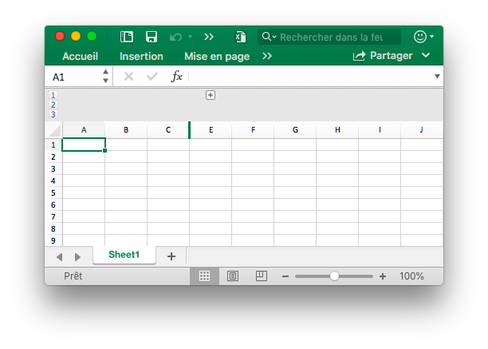
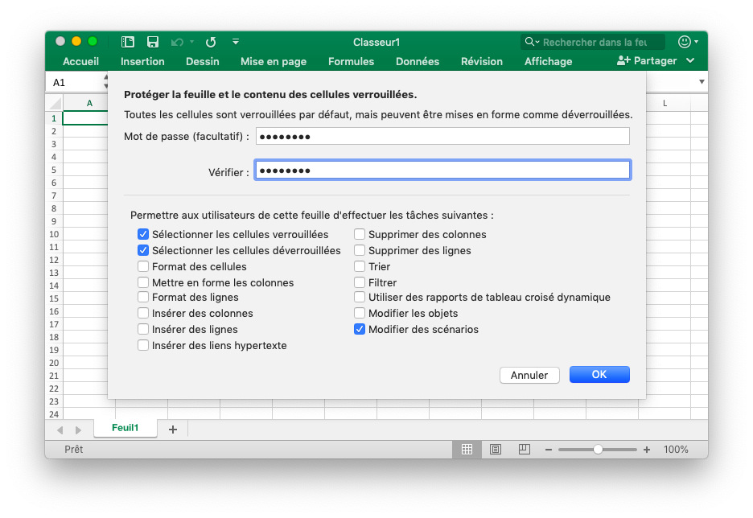

# Feuille de travail

## Définir la visibilité de la colonne {#SetColVisible}

```go
func (f *File) SetColVisible(sheet, col string, visible bool) error
```

SetColVisible fournit une fonction pour définir visible d'une seule colonne par nom de feuille de calcul et nom de colonne donné. Par exemple, cachez la colonne `D` dans `Sheet1`:

```go
err := f.SetColVisible("Sheet1", "D", false)
```

## Définir la largeur de la colonne {#SetColWidth}

```go
func (f *File) SetColWidth(sheet, startcol, endcol string, width float64) error
```

SetColWidth fournit la fonction permettant de définir la largeur d'une ou de plusieurs colonnes. Par exemple:

```go
f := excelize.NewFile()
err := f.SetColWidth("Sheet1", "A", "H", 20)
```

## Définir la hauteur de ligne {#SetRowHeight}

```go
func (f *File) SetRowHeight(sheet string, row int, height float64) error
```

SetRowHeight fournit une fonction pour définir la hauteur d'une seule ligne. Par exemple, définissez la hauteur de la première ligne dans `Sheet1`:

```go
err := f.SetRowHeight("Sheet1", 1, 50)
```

## Définir la visibilité de la ligne {#SetRowVisible}

```go
func (f *File) SetRowVisible(sheet string, row int, visible bool) error
```

SetRowVisible fournit une fonction pour définir visible d'une seule ligne par nom de feuille de calcul donné et index de ligne. Par exemple, masquez la ligne `2` dans `Sheet1`:

```go
err := f.SetRowVisible("Sheet1", 2, false)
```

## Obtenir le nom de la feuille de calcul {#GetSheetName}

```go
func (f *File) GetSheetName(index int) string
```

GetSheetName fournit une fonction pour obtenir le nom de feuille de calcul de XLSX par index de feuille de calcul donné. Si l'index de feuille donné est invalide, retournera une chaîne vide.

## Obtenir la visibilité de la colonne {#GetColVisible}

```go
func (f *File) GetColVisible(sheet, column string) (bool, error)
```

GetColVisible fournit une fonction permettant d'afficher une seule colonne par nom de feuille de calcul et nom de colonne donnés. Par exemple, obtenez l'état visible de la colonne `D` dans `Sheet1`:

```go
visible, err := f.GetColVisible("Sheet1", "D")
```

## Obtenir la largeur de la colonne {#GetColWidth}

```go
func (f *File) GetColWidth(sheet, col string) (float64, error)
```

GetColWidth fournit une fonction permettant d'obtenir la largeur de colonne par nom de feuille de calcul et index de colonne donnés.

## Obtenir la hauteur de la rangée {#GetRowHeight}

```go
func (f *File) GetRowHeight(sheet string, row int) (float64, error)
```

GetRowHeight fournit une fonction pour obtenir la hauteur de ligne par nom de feuille de calcul donné et index de ligne. Par exemple, obtenez la hauteur de la première ligne dans `Sheet1`:

```go
height, err := f.GetRowHeight("Sheet1", 1)
```

## Obtenir la visibilité des lignes {#GetRowVisible}

```go
func (f *File) GetRowVisible(sheet string, row int) (bool, error)
```

GetRowVisible fournit une fonction permettant d'afficher une seule ligne par nom de feuille de calcul et index de ligne donnés. Par exemple, obtenez l'état visible de la ligne `2` dans `Sheet1`:

```go
err := f.GetRowVisible("Sheet1", 2)
```

## Obtenir l'index de la feuille de calcul {#GetSheetIndex}

```go
func (f *File) GetSheetIndex(name string) int
```

GetSheetIndex fournit une fonction pour obtenir l'index de feuille de calcul de XLSX par nom de feuille donné. Si le nom de feuille de calcul donné est invalide, retournera une valeur de type entier `0`.

L'index obtenu peut être utilisé comme paramètre pour appeler la fonction [`SetActiveSheet()`](workbook.md#SetActiveSheet) lors de la définition de la feuille de calcul par défaut du classeur.

## Obtenir la liste des feuilles de calcul {#GetSheetMap}

```go
func (f *File) GetSheetMap() map[int]string
```

GetSheetMap fournit une fonction pour obtenir le nom de la feuille de calcul et la carte d'index de XLSX. Par exemple:

```go
f, err := excelize.OpenFile("./Book1.xlsx")
if err != nil {
    return
}
for index, name := range f.GetSheetMap() {
    fmt.Println(index, name)
}
```

## Obtenir les propriétés de la feuille de calcul {#GetSheetPrOptions}

```go
func (f *File) GetSheetPrOptions(name string, opts ...SheetPrOptionPtr) error
```

GetSheetPrOptions fournit une fonction pour obtenir des propriétés de feuille de calcul.

|Attribut facultatif|Type|
|---|---|
|CodeName|string|
|EnableFormatConditionsCalculation|bool|
|Published|bool|
|FitToPage|bool|
|AutoPageBreaks|bool|
|OutlineSummaryBelow|bool|

Par exemple:

```go
xl := excelize.NewFile()
const sheet = "Sheet1"

var (
    codeName                          excelize.CodeName
    enableFormatConditionsCalculation excelize.EnableFormatConditionsCalculation
    published                         excelize.Published
    fitToPage                         excelize.FitToPage
    autoPageBreaks                    excelize.AutoPageBreaks
    outlineSummaryBelow               excelize.OutlineSummaryBelow
)

if err := xl.GetSheetPrOptions(sheet,
    &codeName,
    &enableFormatConditionsCalculation,
    &published,
    &fitToPage,
    &autoPageBreaks,
    &outlineSummaryBelow,
); err != nil {
    panic(err)
}
fmt.Println("Defaults:")
fmt.Printf("- codeName: %q\n", codeName)
fmt.Println("- enableFormatConditionsCalculation:", enableFormatConditionsCalculation)
fmt.Println("- published:", published)
fmt.Println("- fitToPage:", fitToPage)
fmt.Println("- autoPageBreaks:", autoPageBreaks)
fmt.Println("- outlineSummaryBelow:", outlineSummaryBelow)
```

Sortie:

```text
Defaults:
- codeName: ""
- enableFormatConditionsCalculation: true
- published: true
- fitToPage: false
- autoPageBreaks: false
- outlineSummaryBelow: true
```

## Insérer une colonne {#InsertCol}

```go
func (f *File) InsertCol(sheet, column string) error
```

InsertCol fournit une fonction pour insérer une nouvelle colonne avant l'index de colonne donné. Par exemple, créez une nouvelle colonne avant la colonne `C` dans `Sheet1`:

```go
err := f.InsertCol("Sheet1", "C")
```

## Insérer une ligne {#InsertRow}

```go
func (f *File) InsertRow(sheet string, row int) error
```

InsertRow fournit une fonction pour insérer une nouvelle ligne avant l'index de ligne donné. Par exemple, créez une nouvelle ligne avant la ligne `3` dans `Sheet1`:

```go
err := f.InsertRow("Sheet1", 3)
```

## Ajouter une ligne en double {#DuplicateRow}

```go
func (f *File) DuplicateRow(sheet string, row int) error
```

DuplicateRow insère une copie de la ligne spécifiée ci-dessous, par exemple:

```go
err := f.DuplicateRow("Sheet1", 2)
```

Utilisez cette méthode avec prudence, car elle affectera les modifications de références telles que les formules, les graphiques, etc. S'il existe une valeur référencée de la feuille de calcul, cela provoquera une erreur de fichier lorsque vous l'ouvrirez. Excelize ne met à jour que partiellement ces références.

## Ligne en double {#DuplicateRowTo}

```go
func (f *File) DuplicateRowTo(sheet string, row, row2 int) error
```

DuplicateRowTo insère une copie de la ligne spécifiée à la position indiquée, en descendant les lignes existantes après la position cible, par exemple:

```go
err := f.DuplicateRowTo("Sheet1", 2, 7)
```

Utilisez cette méthode avec prudence, car elle affectera les modifications de références telles que les formules, les graphiques, etc. S'il existe une valeur référencée de la feuille de calcul, cela provoquera une erreur de fichier lorsque vous l'ouvrirez. Excelize ne met à jour que partiellement ces références.

## Créer un contour de ligne {#SetRowOutlineLevel}

```go
func (f *File) SetRowOutlineLevel(sheet string, row int, level uint8) error
```

SetRowOutlineLevel fournit une fonction pour définir le numéro de niveau hiérarchique d'une seule ligne par nom de feuille de calcul donné et index de ligne. Par exemple, définissez la ligne 2 dans `Sheet1` au niveau 1:


```go
err := f.SetRowOutlineLevel("Sheet1", 2, 1)
```

## Créer un plan de colonne {#SetColOutlineLevel}

```go
func (f *File) SetColOutlineLevel(sheet, col string, level uint8) error
```

SetColOutlineLevel fournit une fonction permettant de définir le niveau hiérarchique d'une seule colonne par nom de feuille de calcul et nom de colonne donnés. Par exemple, définissez le niveau hiérarchique de la colonne `D` dans `Sheet1` sur 2:

<p align="center"></p>

```go
err := f.SetColOutlineLevel("Sheet1", "D", 2)
```

## Obtenir le contour de la ligne {#GetRowOutlineLevel}

```go
func (f *File) GetRowOutlineLevel(sheet string, row int) (uint8, error)
```

GetRowOutlineLevel fournit une fonction pour obtenir le numéro de niveau hiérarchique d'une seule ligne par nom de feuille de calcul donné et index de ligne. Par exemple, obtenez le numéro de contour de la ligne 2 dans `Sheet1`:

```go
err := f.GetRowOutlineLevel("Sheet1", 2)
```

## Obtenir le plan de la colonne {#GetColOutlineLevel}

```go
func (f *File) GetColOutlineLevel(sheet, col string) (uint8, error)
```

GetColOutlineLevel fournit une fonction permettant d'obtenir le niveau hiérarchique d'une seule colonne par nom de feuille de calcul et nom de colonne donnés. Par exemple, obtenez le niveau hiérarchique de la colonne `D` dans `Sheet1`:

```go
level, err := f.GetColOutlineLevel("Sheet1", "D")
```

## Row itérateur {#Rows}

```go
func (f *File) Rows(sheet string) (*Rows, error)
```

Les lignes renvoient un itérateur de lignes. Par exemple:

```go
rows, err := f.Rows("Sheet1")
for rows.Next() {
   row, err := rows.Columns()
   for _, colCell := range row {
       fmt.Print(colCell, "\t")
   }
   fmt.Println()
}
```

### Row itérateur - Colonnes

```go
func (rows *Rows) Columns() ([]string, error)
```

Les colonnes renvoient les valeurs de colonne de la ligne en cours.

### Row itérateur - Traverser

```go
func (rows *Rows) Next() bool
```

Suivant retournera `true` si trouver l'élément de ligne suivant.

### Row itérateur - La gestion des erreurs

```go
func (rows *Rows) Error() error
```

L'erreur retournera le `error` lorsque l'élément de ligne suivant sera trouvé.

## Rechercher dans la fiche de calcul {#SearchSheet}

```go
func (f *File) SearchSheet(sheet, value string, reg ...bool) ([]string, error)
```

SearchSheet fournit une fonction permettant d'obtenir les coordonnées en fonction du nom de la feuille de calcul et de la valeur de la cellule. Cette fonction ne prend en charge que la correspondance exacte des chaînes et des nombres, mais ne prend pas en charge le résultat calculé, les nombres mis en forme et la recherche conditionnelle. S'il s'agit d'une cellule fusionnée, les coordonnées du coin supérieur gauche de la zone fusionnée seront renvoyées.

Par exemple, recherchez les coordonnées de la valeur `100` sur `Sheet1`:

```go
result, err := f.SearchSheet("Sheet1", "100")
```

Par exemple, recherchez les coordonnées d’une valeur comprise entre `0-9` dans une feuille de calcul nommée `Sheet1`:

```go
result, err := f.SearchSheet("Sheet1", "[0-9]", true)
```

## Protéger la feuille {#ProtectSheet}

```go
func (f *File) ProtectSheet(sheet string, settings *FormatSheetProtection) error
```

ProtectSheet fournit une fonction permettant d'empêcher d'autres utilisateurs de modifier, déplacer ou supprimer accidentellement ou délibérément des données dans une feuille de calcul. Par exemple, protégez `Sheet1` avec les paramètres de protection:



```go
err := f.ProtectSheet("Sheet1", &excelize.FormatSheetProtection{
    Password:      "password",
    EditScenarios: false,
})
```

## Ôter la protection de la feuille {#UnprotectedSheet}

```go
func (f *File) UnprotectSheet(sheet string) error
```

UnprotectSheet fournit une fonction permettant de ôter la protection de la feuille.
