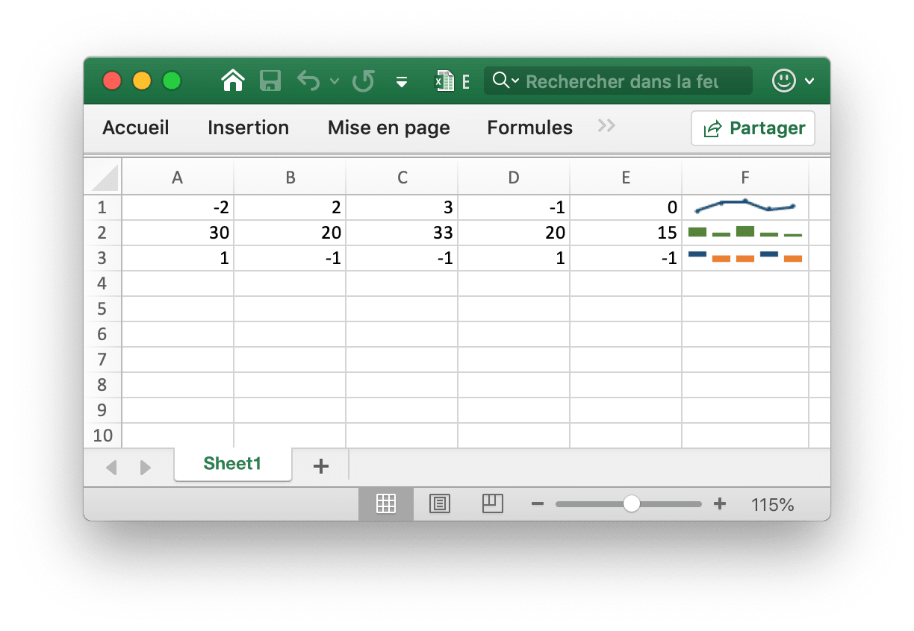
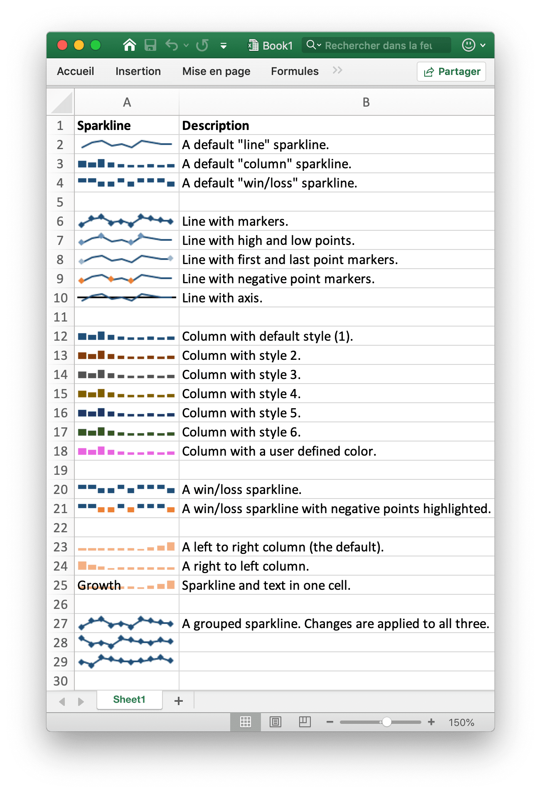

# Sparklines

Les graphiques sparkline sont une fonctionnalité d'Excel 2010+ qui vous permet d'ajouter de petits graphiques aux cellules de la feuille de calcul. Celles-ci sont utiles pour afficher les tendances visuelles des données dans un format compact.

<p align="center"></p>

Les [sparklines](https://en.wikipedia.org/wiki/Sparklines) ont été inventés par [Edward Tufte](https://en.wikipedia.org/wiki/Edward_Tufte).

## Add Sparkline

```go
func (f *File) AddSparkline(sheet string, opts *SparklineOption) error
```

AddSparkline fournit une fonction pour ajouter des graphiques sparkline à la feuille de calcul à l'aide d'options de formatage données. Les graphiques sparkline sont de petits graphiques qui s'inscrivent dans une seule cellule et sont utilisés pour afficher les tendances des données. Les graphiques sparkline sont une fonctionnalité d'Excel 2010 et versions ultérieures uniquement. Vous pouvez les écrire dans un fichier XLSX pouvant être lu par Excel 2007, mais ils ne seront pas affichés. Par exemple, ajoutez un graphique sparkline groupé. Les modifications sont appliquées aux trois:

```go
err := f.AddSparkline("Sheet1", &excelize.SparklineOption{
    Location: []string{"A1", "A2", "A3"},
    Range:    []string{"Sheet2!A1:J1", "Sheet2!A2:J2", "Sheet2!A3:J3"},
    Markers:  true,
})
```

<p align="center"></p>

Voici les options de formatage du graphique sparkline pris en charge par excelize:

Paramètre | La description
---|---
Location  | Obligatoire, doit avoir le même numéro avec le paramètre `Range`
Range     | Obligatoire, doit avoir le même numéro avec le paramètre `Location`
Type      | Valeur d'énumération: `line`, `column`, `win_loss`
Style     | Plage de valeurs: 0 - 35
Hight     | Basculer les points hauts sparkline
Low       | Basculer les points bas sparkline
First     | Basculer les premiers points sparkline
Last      | Basculer sparkline derniers points
Negative  | Basculer les points négatifs sparkline
Markers   | Basculer les marqueurs sparkline
ColorAxis | Une couleur RGB est spécifié comme `RRGGBB`
Axis      | Montrer l'axe sparkline
