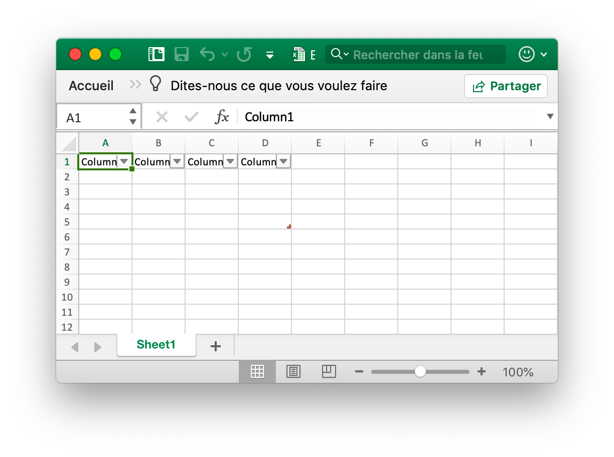
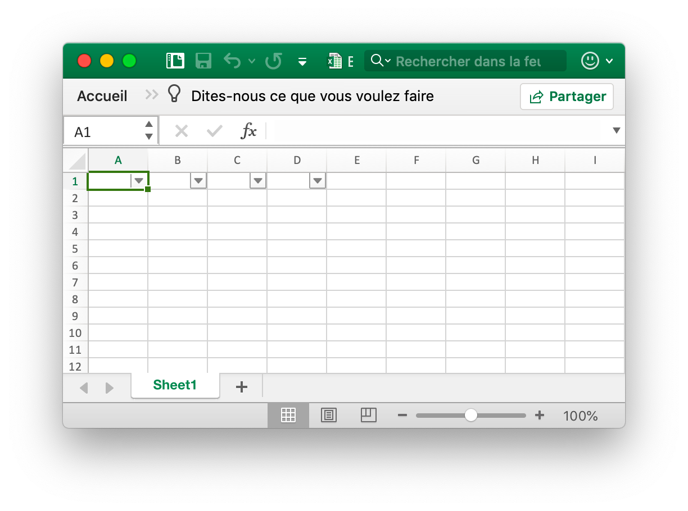
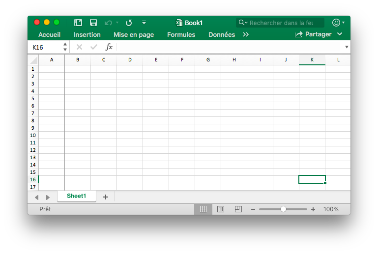
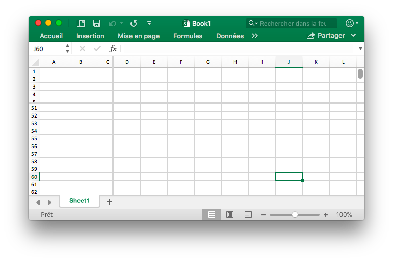

# Utilitaire

## Table {#AddTable}

```go
func (f *File) AddTable(sheet string, table *Table) error
```

AddTable fournit la méthode pour ajouter une table dans une feuille de calcul par nom de feuille de calcul donné, zone de coordonnées et jeu de formats.

- Exemple 1, créer une table de `A1:D5` sur `Sheet1`:

<p align="center"></p>

```go
err := f.AddTable("Sheet1", &excelize.Table{Range: "A1:D5"})
```

- Exemple 2, créer une table de `F2: H6` sur `Sheet2` avec le jeu de format:

<p align="center"></p>

```go
disable := false
err := f.AddTable("Sheet2", &excelize.Table{
    Range:             "F2:H6",
    Name:              "table",
    StyleName:         "TableStyleMedium2",
    ShowFirstColumn:   true,
    ShowLastColumn:    true,
    ShowRowStripes:    &disable,
    ShowColumnStripes: true,
})
```

Notez que le tableau doit comporter au moins deux lignes, y compris l'en-tête. Les cellules d'en-tête doivent contenir des chaînes et doivent être uniques et doivent définir les données de ligne d'en-tête de la table avant d'appeler la fonction AddTable. Plusieurs tables coordonnent des zones qui ne peuvent pas avoir d'intersection.

`Name`: Le nom de la table, dans le même nom de feuille de calcul de la table, doit être unique.

`StyleName`: Les noms de style de table intégrés:

```text
TableStyleLight1 - TableStyleLight21
TableStyleMedium1 - TableStyleMedium28
TableStyleDark1 - TableStyleDark11
```

Index|Style|Index|Style|Index|Style
---|---|---|---|---|---
||TableStyleLight1||TableStyleLight2|
TableStyleLight3||TableStyleLight4||TableStyleLight5|
TableStyleLight6||TableStyleLight7||TableStyleLight8|
TableStyleLight9||TableStyleLight10||TableStyleLight11|
TableStyleLight12||TableStyleLight13||TableStyleLight14|
TableStyleLight15||TableStyleLight16||TableStyleLight17|
TableStyleLight18||TableStyleLight19||TableStyleLight20|
TableStyleLight21||TableStyleMedium1||TableStyleMedium2|
TableStyleMedium3||TableStyleMedium4||TableStyleMedium5|
TableStyleMedium6||TableStyleMedium7||TableStyleMedium8|
TableStyleMedium9||TableStyleMedium10||TableStyleMedium11|
TableStyleMedium12||TableStyleMedium13||TableStyleMedium14|
TableStyleMedium15||TableStyleMedium16||TableStyleMedium17|
TableStyleMedium18||TableStyleMedium19||TableStyleMedium20|
TableStyleMedium21||TableStyleMedium22||TableStyleMedium23|
TableStyleMedium24||TableStyleMedium25||TableStyleMedium26|
TableStyleMedium27||TableStyleMedium28||TableStyleDark1|
TableStyleDark2||TableStyleDark3||TableStyleDark4|
TableStyleDark5||TableStyleDark6||TableStyleDark7|
TableStyleDark8||TableStyleDark9||TableStyleDark10|
TableStyleDark11|||||

## Filtre auto {#AutoFilter}

```go
func (f *File) AutoFilter(sheet, rangeRef string, opts []AutoFilterOptions) error
```

AutoFilter fournit la méthode pour ajouter un filtre automatique dans une feuille de calcul en fonction du nom de la feuille de calcul, de la zone de coordonnées et des paramètres. Un filtre automatique dans Excel est un moyen de filtrer une plage de données 2D en fonction de critères simples.

Exemple 1, application d'un autofiltre à une plage de cellules `A1:D4` dans `Sheet1`:

<p align="center"></p>

```go
err := f.AutoFilter("Sheet1", "A1:D4", []excelize.AutoFilterOptions{})
```

Exemple 2, filtrez les données dans un autofiltre:

```go
err := f.AutoFilter("Sheet1", "A1:D4", []excelize.AutoFilterOptions{
    {Column: "B", Expression: "x != blanks"},
})
```

`Column` définit les colonnes de filtre dans une gamme de filtre automatique basée sur des critères simples

Il ne suffit pas de spécifier simplement la condition de filtre. Vous devez également masquer les lignes qui ne correspondent pas à la condition de filtre. Les lignes sont masquées à l'aide de la méthode [`SetRowVisible()`](sheet.md#SetRowVisible). Excelize ne peut pas filtrer les lignes automatiquement car cela ne fait pas partie du format de fichier.

SDéfinition d'un critère de filtre pour une colonne:

`Expression` définit les conditions, les opérateurs suivants sont disponibles pour définir les critères de filtrage:

```text
==
!=
>
<
>=
<=
and
or
```

Une expression peut comprendre une seule instruction ou deux instructions séparées par les opérateurs `and` et `or`. Par exemple:

```text
x <  2000
x >  2000
x == 2000
x >  2000 and x <  5000
x == 2000 or  x == 5000
```

Le filtrage des données vierges ou non peut être réalisé en utilisant une valeur de Blanks ou NonBlanks dans l'expression:

```text
x == Blanks
x == NonBlanks
```

Office Excel permet également certaines opérations de correspondance de chaînes simples:

```text
x == b*      // begins with b
x != b*      // doesn't begin with b
x == *b      // ends with b
x != *b      // doesn't end with b
x == *b*     // contains b
x != *b*     // doesn't contains b
```

Vous pouvez également utiliser `*` pour faire correspondre un caractère ou un nombre et `?` Pour correspondre à un seul caractère ou chiffre. Aucun autre quantificateur d'expressions régulières n'est pris en charge par les filtres d'Excel. Les caractères d'expression régulière d'Excel peuvent être échappés en utilisant `~`.

La variable d'espace réservé `x` dans les exemples ci-dessus peut être remplacée par n'importe quelle chaîne simple. Le nom de l'espace réservé réel est ignoré en interne de sorte que les éléments suivants sont tous équivalents:

```text
x     < 2000
col   < 2000
Price < 2000
```

## Mettre à jour la valeur liée {#UpdateLinkedValue}

```go
func (f *File) UpdateLinkedValue() error
```

Les valeurs liées au correctif UpdateLinkedValue dans une feuille de calcul ne sont pas mises à jour dans Office Excel 2007 et 2010. Cette fonction supprime la balise de valeur lorsqu'une cellule est associée à une valeur liée. Référence[https://social.technet.microsoft.com/Forums/office/en-US/e16bae1f-6a2c-4325-8013-e989a3479066/excel-2010-linked-cells-not-updating](https://social.technet.microsoft.com/Forums/office/en-US/e16bae1f-6a2c-4325-8013-e989a3479066/excel-2010-linked-cells-not-updating) Avis: après ouverture du fichier XLSX, Excel mettra à jour la valeur liée et génèrera une nouvelle valeur et demandera l'enregistrement du fichier ou non.

L'effet de l'effacement du cache de cellules sur le classeur apparaît sous la forme d'une modification de la balise `<v>`, par exemple, le cache de la cellule avant l'effacement:

```xml
<row r="19" spans="2:2">
    <c r="B19">
        <f>SUM(Sheet2!D2,Sheet2!D11)</f>
        <v>100</v>
     </c>
</row>
```

Après avoir effacé le cache de la cellule:

```xml
<row r="19" spans="2:2">
    <c r="B19">
        <f>SUM(Sheet2!D2,Sheet2!D11)</f>
    </c>
</row>
```

## Nom de la cellule divisée {#SplitCellName}

```go
func SplitCellName(cell string) (string, int, error)
```

SplitCellName divise le nom de cellule en nom de colonne et numéro de ligne. Par exemple:

```go
excelize.SplitCellName("AK74") // return "AK", 74, nil
```

## Rejoindre le nom de la cellule {#JoinCellName}

```go
func JoinCellName(col string, row int) (string, error)
```

JoinCellName joint le nom de la cellule à partir du nom de la colonne et du numéro de ligne.

## Nom de la colonne au numéro {#ColumnNameToNumber}

```go
func ColumnNameToNumber(name string) (int, error)
```

ColumnNameToNumber fournit une fonction permettant de convertir le nom de colonne d'une feuille Excel en `int`. Le nom de la colonne est insensible à la casse. La fonction renvoie une erreur si le nom de la colonne est incorrect. Par exemple:

```go
excelize.ColumnNameToNumber("AK") // returns 37, nil
```

## Numéro de colonne au nom {#ColumnNumberToName}

```go
func ColumnNumberToName(num int) (string, error)
```

ColumnNumberToName fournit une fonction permettant de convertir un entier en titre de colonne de feuille Excel. Par exemple:

```go
excelize.ColumnNumberToName(37) // returns "AK", nil
```

## Nom de la cellule aux coordonnées {#CellNameToCoordinates}

```go
func CellNameToCoordinates(cell string) (int, int, error)
```

CellNameToCoordinates convertit le nom de cellule alphanumérique en coordonnées `[X, Y]` ou renvoie une erreur. Par exemple:

```go
excelize.CellNameToCoordinates("A1") // returns 1, 1, nil
excelize.CellNameToCoordinates("Z3") // returns 26, 3, nil
```

## Coordonnées au nom de la cellule {#CoordinatesToCellName}

```go
func CoordinatesToCellName(col, row int, abs ...bool) (string, error)
```

CoordinatesToCellName convertit les coordonnées `[X, Y]` en nom de cellule alphanumérique ou renvoie une erreur. Par exemple:

```go
excelize.CoordinatesToCellName(1, 1) // returns "A1", nil
excelize.CoordinatesToCellName(1, 1, true) // returns "$A$1", nil
```

## Style conditionnel {#NewConditionalStyle}

```go
func (f *File) NewConditionalStyle(style *Style) (int, error)
```

NewConditionalStyle fournit une fonction pour créer un style pour le format conditionnel par format de style donné. Les paramètres sont les mêmes que la fonction [`NewStyle`](style.md#NewStyle). Notez que le champ de couleur utilise le code de couleur RGB et uniquement le support pour définir la police, les remplissages, l'alignement et les bordures actuellement.

## Définir le format conditionnel {#SetConditionalFormat}

```go
func (f *File) SetConditionalFormat(sheet, rangeRef string, opts []ConditionalFormatOptions) error
```

SetConditionalFormat fournit une fonction pour créer une règle de mise en forme conditionnelle pour la valeur de la cellule. La mise en forme conditionnelle est une fonctionnalité d'Office Excel qui vous permet d'appliquer un format à une cellule ou à une plage de cellules en fonction de certains critères.

L'option `Type` est un paramètre obligatoire et n'a pas de valeur par défaut. Les valeurs de type autorisées et leurs paramètres associés sont:

<table>
    <thead>
        <tr>
            <th>Type</th>
            <th>Paramètres</th>
        </tr>
    </thead>
    <tbody>
        <tr>
            <td rowspan=4>cell</td>
            <td>Criteria</td>
        </tr>
        <tr>
            <td>Value</td>
        </tr>
        <tr>
            <td>Minimum</td>
        </tr>
        <tr>
            <td>Maximum</td>
        </tr>
        <tr>
            <td rowspan=4>date</td>
            <td>Criteria</td>
        </tr>
        <tr>
            <td>Value</td>
        </tr>
        <tr>
            <td>Minimum</td>
        </tr>
        <tr>
            <td>Maximum</td>
        </tr>
        <tr>
            <td>time_period</td>
            <td>Criteria</td>
        </tr>
        <tr>
            <td rowspan=2>text</td>
            <td>Criteria</td>
        </tr>
        <tr>
            <td>Value</td>
        </tr>
        <tr>
            <td>average</td>
            <td>Criteria</td>
        </tr>
        <tr>
            <td>duplicate</td>
            <td>(none)</td>
        </tr>
        <tr>
            <td>unique</td>
            <td>(none)</td>
        </tr>
        <tr>
            <td rowspan=2>top</td>
            <td>Criteria</td>
        </tr>
        <tr>
            <td>Value</td>
        </tr>
        <tr>
            <td rowspan=2>bottom</td>
            <td>Criteria</td>
        </tr>
        <tr>
            <td>Value</td>
        </tr>
        <tr>
            <td>blanks</td>
            <td>(none)</td>
        </tr>
        <tr>
            <td>no_blanks</td>
            <td>(none)</td>
        </tr>
        <tr>
            <td>errors</td>
            <td>(none)</td>
        </tr>
        <tr>
            <td>no_errors</td>
            <td>(none)</td>
        </tr>
        <tr>
            <td rowspan=6>2_color_scale</td>
            <td>MinType</td>
        </tr>
        <tr>
            <td>MaxType</td>
        </tr>
        <tr>
            <td>MinValue</td>
        </tr>
        <tr>
            <td>MaxValue</td>
        </tr>
        <tr>
            <td>MinColor</td>
        </tr>
        <tr>
            <td>MaxColor</td>
        </tr>
        <tr>
            <td rowspan=9>3_color_scale</td>
            <td>MinType</td>
        </tr>
        <tr>
            <td>MidType</td>
        </tr>
        <tr>
            <td>MaxType</td>
        </tr>
        <tr>
            <td>MinValue</td>
        </tr>
        <tr>
            <td>MidValue</td>
        </tr>
        <tr>
            <td>MaxValue</td>
        </tr>
        <tr>
            <td>MinColor</td>
        </tr>
        <tr>
            <td>MidColor</td>
        </tr>
        <tr>
            <td>MaxColor</td>
        </tr>
        <tr>
            <td rowspan=9>data_bar</td>
            <td>MinType</td>
        </tr>
        <tr>
            <td>MaxType</td>
        </tr>
        <tr>
            <td>MinValue</td>
        </tr>
        <tr>
            <td>MaxValue</td>
        </tr>
        <tr>
            <td>BarBorderColor</td>
        </tr>
        <tr>
            <td>BarColor</td>
        </tr>
        <tr>
            <td>BarDirection</td>
        </tr>
        <tr>
            <td>BarOnly</td>
        </tr>
        <tr>
            <td>BarSolid</td>
        </tr>
        <tr>
            <td rowspan=3>iconSet</td>
            <td>IconStyle</td>
        </tr>
        <tr>
            <td>ReverseIcons</td>
        </tr>
        <tr>
            <td>IconsOnly</td>
        </tr>
        <tr>
            <td>formula</td>
            <td>Criteria</td>
        </tr>
    </tbody>
</table>

Le paramètre `Criteria` est utilisé pour définir les critères selon lesquels les données de la cellule seront évaluées. Il n'a pas de valeur par défaut. Les critères les plus communs appliqués à `excelize.ConditionalFormatOptions{Type: "cell"}` sont:

Caractère de description de texte|Représentation symbolique
---|---
between|
not between|
equal to|==
not equal to|!=
greater than|>
less than|<
greater than or equal to|>=
less than or equal to|<=

Vous pouvez utiliser les chaînes de description textuelles d'Excel, dans la première colonne ci-dessus ou les alternatives symboliques les plus courantes.

Des critères supplémentaires spécifiques aux autres types de formats conditionnels sont présentés dans les sections pertinentes ci-dessous.

`Value`: La valeur est généralement utilisée avec le paramètre `Criteria` pour définir la règle selon laquelle les données de la cellule seront évaluées:

```go
err := f.SetConditionalFormat("Sheet1", "D1:D10",
    []excelize.ConditionalFormatOptions{
        {
            Type:     "cell",
            Criteria: ">",
            Format:   format,
            Value:    "6",
        },
    },
)
```

La propriété `Value` peut également être une référence de cellule:

```go
err := f.SetConditionalFormat("Sheet1", "D1:D10",
    []excelize.ConditionalFormatOptions{
        {
            Type:     "cell",
            Criteria: ">",
            Format:   format,
            Value:    "$C$1",
        },
    },
)
```

type: `Format` - Le paramètre `Format` est utilisé pour spécifier le format qui sera appliqué à la cellule lorsque le critère de mise en forme conditionnelle est satisfait. Le format est créé en utilisant [`NewConditionalStyle()`](utils.md#NewConditionalStyle) une méthode de la même manière que les formats de cellule:

```go
format, err := f.NewConditionalStyle(
    &excelize.Style{
        Font: &excelize.Font{Color: "9A0511"},
        Fill: excelize.Fill{
            Type: "pattern", Color: []string{"FEC7CE"}, Pattern: 1,
        },
    },
)
if err != nil {
    fmt.Println(err)
}
err = f.SetConditionalFormat("Sheet1", "D1:D10",
    []excelize.ConditionalFormatOptions{
        {Type: "cell", Criteria: ">", Format: format, Value: "6"},
    },
)
```

Remarque: Dans Excel, un format conditionnel est superposé au format de cellule existant et toutes les propriétés de format de cellule ne peuvent pas être modifiées. Les propriétés qui ne peuvent pas être modifiées dans un format conditionnel sont le nom de la police, la taille de la police, l'exposant et l'indice, les bordures diagonales, toutes les propriétés d'alignement et toutes les propriétés de protection.

Excel spécifie certains formats par défaut à utiliser avec la mise en forme conditionnelle. Ceux-ci peuvent être répliqués en utilisant les formats excelize suivants:

```go
// Format rose pour mauvais conditionnel.
format1, err := f.NewConditionalStyle(
    &excelize.Style{
        Font: &excelize.Font{Color: "9A0511"},
        Fill: excelize.Fill{
            Type: "pattern", Color: []string{"FEC7CE"}, Pattern: 1,
        },
    },
)

// Format jaune clair pour neutre conditionnel.
format2, err := f.NewConditionalStyle(
    &excelize.Style{
        Font: &excelize.Font{Color: "9B5713"},
        Fill: excelize.Fill{
            Type: "pattern", Color: []string{"FEEAA0"}, Pattern: 1,
        },
    },
)

// Le format vert clair pour le bon conditionnel.
format3, err := f.NewConditionalStyle(
    &excelize.Style{
        Font: &excelize.Font{Color: "09600B"},
        Fill: excelize.Fill{
            Type: "pattern", Color: []string{"C7EECF"}, Pattern: 1,
        },
    },
)
```

type: `Minimum` - Le paramètre `minimum` est utilisé pour définir la valeur limite inférieure lorsque le `critère` est entre `between` ou `not between`.

```go
// Highlight cells rules: between...
err := f.SetConditionalFormat("Sheet1", "A1:A10",
    []excelize.ConditionalFormatOptions{
        {
            Type:     "cell",
            Criteria: "between",
            Format:   format,
            Minimum:  "6",
            Maximum:  "8",
        },
    },
)
```

type: `Maximum` - Le paramètre `maximum` est utilisé pour définir la valeur limite supérieure lorsque les critères sont entre `between` ou `not between`. Voir l'exemple précédent.

type: `average` - Le type `average` est utilisé pour spécifier le format conditionnel de style "Moyenne" d'Office Excel:

```go
// Haut/Bas règles: Au-dessus de la moyenne ...
err := f.SetConditionalFormat("Sheet1", "A1:A10",
    []excelize.ConditionalFormatOptions{
        {
            Type:         "average",
            Criteria:     "=",
            Format:       format1,
            AboveAverage: true,
        },
    },
)

// THaut/Bas règles: Au-dessous de la moyenne ...
err := f.SetConditionalFormat("Sheet1", "B1:B10",
    []excelize.ConditionalFormatOptions{
        {
            Type:         "average",
            Criteria:     "=",
            Format:       format2,
            AboveAverage: false,
        },
    },
)
```

type: `duplicate` - The `duplicate` type is used to highlight duplicate cells in a range:

```go
// Mettez en surbrillance les règles relatives aux cellules: Valeurs en double ...
err := f.SetConditionalFormat("Sheet1", "A1:A10",
    []excelize.ConditionalFormatOptions{
        {Type: "duplicate", Criteria: "=", Format: format},
    },
)
```

type: `unique` - Le type `unique` est utilisé pour mettre en évidence des cellules individuelles dans une gamme:

```go
// Mettez en surbrillance les règles des cellules: pas égal à ...
err := f.SetConditionalFormat("Sheet1", "A1:A10",
    []excelize.ConditionalFormatOptions{
        {Type: "unique", Criteria: "=", Format: format},
    },
)
```

type: `top` - Le type `top` est utilisé pour spécifier les n premières valeurs en nombre ou en pourcentage dans une plage:

```go
// THaut/Bas règles: Top 10.
err := f.SetConditionalFormat("Sheet1", "H1:H10",
    []excelize.ConditionalFormatOptions{
        {
            Type:     "top",
            Criteria: "=",
            Format:   format,
            Value:    "6",
        },
    },
)
```

Les critères peuvent être utilisés pour indiquer qu'une condition de pourcentage est requise:

```go
err := f.SetConditionalFormat("Sheet1", "A1:A10",
    []excelize.ConditionalFormatOptions{
        {
            Type:     "top",
            Criteria: "=",
            Format:   format,
            Value:    "6",
            Percent:  true,
        },
    },
)
```

type: `2_color_scale` - Le type `2_color_scale` est utilisé pour spécifier le format conditionnel de style Excel "2 Color Scale":

```go
// Échelles de couleurs: 2 couleurs.
err := f.SetConditionalFormat("Sheet1", "A1:A10",
    []excelize.ConditionalFormatOptions{
        {
            Type:     "2_color_scale",
            Criteria: "=",
            MinType:  "min",
            MaxType:  "max",
            MinColor: "#F8696B",
            MaxColor: "#63BE7B",
        },
    },
)
```

Ce type conditionnel peut être modifié avec `MinType`, `MaxType`, `MinValue`, `MaxValue`, `MinColor` et `MaxColor`, voir ci-dessous.

type: `3_color_scale` - Le type `3_color_scale` est utilisé pour spécifier le format conditionnel de style "3 Color Scale" d'Excel:

```go
// Échelles de couleurs: 3 couleurs.
err := f.SetConditionalFormat("Sheet1", "A1:A10",
    []excelize.ConditionalFormatOptions{
        {
            Type:     "3_color_scale",
            Criteria: "=",
            MinType:  "min",
            MidType:  "percentile",
            MaxType:  "max",
            MinColor: "#F8696B",
            MidColor: "#FFEB84",
            MaxColor: "#63BE7B",
        },
    },
)
```

Ce type conditionnel peut être modifié avec `MinType`, `MidType`, `MaxType`, `MinValue`, `MidValue`, `MaxValue`, `MinColor`, `MidColor` et `MaxColor`, voir ci-dessous.

type: `data_bar` - Le type `data_bar` est utilisé pour spécifier le format conditionnel du style "Data Bar" d'Excel.

`MinType` - Les propriétés `MinType` et `MaxType` sont disponibles lorsque le type de formatage conditionnel est `2_color_scale`, `3_color_scale` ou `data_bar`. Le `MidType` est disponible pour `3_color_scale`. Les propriétés sont utilisées comme suit:

```go
// Barres de données: Remplissage dégradé.
err := f.SetConditionalFormat("Sheet1", "K1:K10",
    []excelize.ConditionalFormatOptions{
        {
            Type:     "data_bar",
            Criteria: "=",
            MinType:  "min",
            MaxType:  "max",
            BarColor: "#638EC6",
        },
    },
)
```

Les types `min/mid/max` disponibles sont:

Paramètre|Explication
---|---
min|Minimum value (for `MinType` only)
num|Numeric
percent|Percentage
percentile|Percentile
formula|Formula
max|Maximum (for `MaxType` only)

`MidType` - Utilisé pour `3_color_scale`. Pareil que `MinType`, voir au dessus.

`MaxType` - Pareil que `MinType`, voir au dessus.

`MinValue` - Les propriétés `MinValue` et `MaxValue` sont disponibles lorsque le type de formatage conditionnel est `2_color_scale`, `3_color_scale` ou `data_bar`. La valeur `MidValue` est disponible pour `3_color_scale`.

`MidValue` - Utilisé pour `3_color_scale`. Pareil que `MinValue`, voir au dessus.

`MaxValue` - Pareil que `MinValue`, voir au dessus.

`MinColor` - Les propriétés `MinColor` et `MaxColor` sont disponibles lorsque le type de formatage conditionnel est `2_color_scale`, `3_color_scale` ou `data_bar`. Le `MidColor` est disponible pour `3_color_scale`. Les propriétés sont utilisées comme suit:

```go
// Échelles de couleurs: 3 couleurs.
err := f.SetConditionalFormat("Sheet1", "B1:B10",
    []excelize.ConditionalFormatOptions{
        {
            Type:     "3_color_scale",
            Criteria: "=",
            MinType:  "min",
            MidType:  "percentile",
            MaxType:  "max",
            MinColor: "#F8696B",
            MidColor: "#FFEB84",
            MaxColor: "#63BE7B",
        },
    },
)
```

`MidColor` - Utilisé pour `3_color_scale`. Pareil que `MinColor`, voir au dessus.

`MaxColor` - Pareil que `MinColor`, voir au dessus.

`BarColor` - Utilisé pour `data_bar`. Pareil que `MinColor`, voir au dessus.

`BarBorderColor` - Utilisé pour définir la couleur de la ligne de bordure d'une barre de données, ceci n'est visible que dans Excel 2010 et versions ultérieures.

`BarDirection` - Utilisé pour définir la direction des barres de données. Les options disponibles sont:

Valeur|Explication
---|---
context     | La direction de la barre de données est définie par l'application de feuille de calcul en fonction du contexte des données affichées.
leftToRight | La direction de la barre de données est de droite à gauche.
rightToLeft | La direction de la barre de données est de gauche à droite.

`BarOnly` - Utilisé pour l'ensemble affiche une barre de données mais pas les données des cellules.

`BarSolid` - Utilisé pour activer un remplissage solide (sans dégradé) pour les barres de données, ceci n'est visible que dans Excel 2010 et versions ultérieures.

`IconStyle` - Les options disponibles sont:

|Valeur|
|---|
|3Arrows        |
|3ArrowsGray    |
|3Flags         |
|3Signs         |
|3Symbols       |
|3Symbols2      |
|3TrafficLights1|
|3TrafficLights2|
|4Arrows        |
|4ArrowsGray    |
|4Rating        |
|4RedToBlack    |
|4TrafficLights |
|5Arrows        |
|5ArrowsGray    |
|5Quarters      |
|5Rating        |

`ReverseIcons` - Utilisé pour définir des ensembles d'icônes inversées.

`IconsOnly` - Utilisé pour l'ensemble affiché sans la valeur de la cellule.

`StopIfTrue` - Utilisé pour définir la fonctionnalité "arrêter si vrai" d'une règle de mise en forme conditionnelle lorsque plusieurs règles sont appliquées à une cellule ou à une plage de cellules. Lorsque ce paramètre est défini, les règles suivantes ne sont pas évaluées si la règle actuelle est vraie.

Par exemple, mettez en surbrillance les valeurs les plus élevées et les plus faibles dans une plage de cellules `A1:D4` en définissant une mise en forme conditionnelle sur `Sheet1`:

<p align="center"></p>

```go
func main() {
    f := excelize.NewFile()
    defer func() {
        if err := f.Close(); err != nil {
            fmt.Println(err)
        }
    }()
    for r := 1; r <= 4; r++ {
        row := []int{
            rand.Intn(100), rand.Intn(100), rand.Intn(100), rand.Intn(100),
        }
        if err := f.SetSheetRow("Sheet1", fmt.Sprintf("A%d", r), &row); err != nil {
            fmt.Println(err)
            return
        }
    }
    red, err := f.NewConditionalStyle(
        &excelize.Style{
            Font: &excelize.Font{
                Color: "9A0511",
            },
            Fill: excelize.Fill{
                Type:    "pattern",
                Color:   []string{"FEC7CE"},
                Pattern: 1,
            },
        },
    )
    if err != nil {
        fmt.Println(err)
        return
    }
    if err := f.SetConditionalFormat("Sheet1", "A1:D4",
        []excelize.ConditionalFormatOptions{
            {
                Type:     "bottom",
                Criteria: "=",
                Value:    "1",
                Format:   red,
            },
        },
    ); err != nil {
        fmt.Println(err)
        return
    }
    green, err := f.NewConditionalStyle(
        &excelize.Style{
            Font: &excelize.Font{
                Color: "09600B",
            },
            Fill: excelize.Fill{
                Type:    "pattern",
                Color:   []string{"C7EECF"},
                Pattern: 1,
            },
        },
    )
    if err != nil {
        fmt.Println(err)
        return
    }
    if err := f.SetConditionalFormat("Sheet1", "A1:D4",
        []excelize.ConditionalFormatOptions{
            {
                Type:     "top",
                Criteria: "=",
                Value:    "1",
                Format:   green,
            },
        },
    ); err != nil {
        fmt.Println(err)
        return
    }
    if err := f.SaveAs("Book1.xlsx"); err != nil {
        fmt.Println(err)
        return
    }
}
```

## Obtenir le format conditionnel {#GetConditionalFormats}

```go
func (f *File) GetConditionalFormats(sheet string) (map[string][]ConditionalFormatOptions, error)
```

GetConditionalFormats renvoie les paramètres de format conditionnel par nom de feuille de calcul donné.

## Supprimer le format conditionnel {#UnsetConditionalFormat}

```go
func (f *File) UnsetConditionalFormat(sheet, rangeRef string) error
```

UnsetConditionalFormat fournit une fonction pour annuler le format conditionnel en fonction du nom et de la plage de la feuille de calcul.

## Définir les volets {#SetPanes}

```go
func (f *File) SetPanes(sheet string, panes *Panes) error
```

SetPanes fournit une fonction permettant de créer et de supprimer des fenêtres de gel et des panneaux de division en fonction d'un ensemble de formats de nom de feuille de calcul et de volets donnés.

`ActivePane` définit le volet actif. Les valeurs possibles pour cet attribut sont définies dans le tableau suivant:

Valeur d'énumération|Description
---|---
bottomLeft (Bottom Left Pane) |Panneau inférieur gauche, lorsque des divisions verticales et horizontales sont appliquées.<br><br>Cette valeur est également utilisée lorsque seule une division horizontale a été appliquée, divisant le volet en régions supérieure et inférieure. Dans ce cas, cette valeur spécifie le volet inférieur.
bottomRight (Bottom Right Pane) |Volet inférieur droit, lorsque des divisions verticales et horizontales sont appliquées.
topLeft (Top Left Pane)|Volet supérieur gauche, lorsque des divisions verticales et horizontales sont appliquées.<br><br>Cette valeur est également utilisée lorsque seule une division horizontale a été appliquée, divisant le volet en régions supérieure et inférieure. Dans ce cas, cette valeur spécifie le volet supérieur.<br><br>Cette valeur est également utilisée lorsque seule une division verticale a été appliquée, divisant le volet en régions droite et gauche. Dans ce cas, cette valeur spécifie le volet de gauche.
topRight (Top Right Pane)|Volet supérieur droit, lorsque des divisions verticales et horizontales sont appliquées.<br><br>Cette valeur est également utilisée lorsque seule une division verticale a été appliquée, divisant le volet en régions droite et gauche. Dans ce cas, cette valeur spécifie le volet droit.

Le type d'état du volet est limité aux valeurs prises en charge actuellement répertoriées dans le tableau suivant:

Valeur d'énumération|Description
---|---
frozen (Frozen)|Les panneaux sont gelés, mais n'ont pas été divisés. Dans cet état, lorsque les volets sont à nouveau décongelés, un seul volet est généré, sans division.<br><br>Dans cet état, les barres de fractionnement ne sont pas réglables.
split (Split)|Les volets sont divisés, mais pas gelés. Dans cet état, les barres de fractionnement sont réglables par l'utilisateur.

`XSplit` - Position horizontale de la fente, en 1/20ème de point; 0 (zéro) si aucun. Si le volet est figé, cette valeur indique le nombre de colonnes visibles dans le volet supérieur.

`YSplit` - Position verticale de la fente, en 1/20ème de pointe; 0 (zéro) si aucun. Si le volet est figé, cette valeur indique le nombre de lignes visibles dans le volet de gauche. Les valeurs possibles pour cet attribut sont définies par le double type de données W3C XML Schema.

`TopLeftCell` - L'emplacement du haut à gauche de la cellule visible dans le volet inférieur droit (en mode Gauche-Droite).

`SQRef` - La plage de la sélection Peut être un ensemble de plages non contiguës.

Example 1: freeze column `A` in the `Sheet1` and set the active cell on `Sheet1!K16`:

<p align="center"></p>

```go
err := f.SetPanes("Sheet1", &excelize.Panes{
    Freeze:      true,
    XSplit:      1,
    TopLeftCell: "B1",
    ActivePane:  "topRight",
    Selection: []excelize.Selection{
        {SQRef: "K16", ActiveCell: "K16", Pane: "topRight"},
    },
})
```

Exemple 2: geler les lignes 1 à 9 dans la feuille Sheet1 et définir les plages de cellules actives sur `Sheet1!A11:XFD11`:

<p align="center"></p>

```go
err := f.SetPanes("Sheet1", &excelize.Panes{
    Freeze:      true,
    YSplit:      9,
    TopLeftCell: "A34",
    ActivePane:  "bottomLeft",
    Selection: []excelize.Selection{
        {SQRef: "A11:XFD11", ActiveCell: "A11", Pane: "bottomLeft"},
    },
})
```

Exemple 3: créer des volets fractionnés dans `Sheet1` et définir la cellule active sur  `Sheet1!J60`:

<p align="center"></p>

```go
err := f.SetPanes("Sheet1", &excelize.Panes{
    Split:       true,
    XSplit:      3270,
    YSplit:      1800,
    TopLeftCell: "N57",
    ActivePane:  "bottomLeft",
    Selection: []excelize.Selection{
        {SQRef: "I36", ActiveCell: "I36"},
        {SQRef: "G33", ActiveCell: "G33", Pane: "topRight"},
        {SQRef: "J60", ActiveCell: "J60", Pane: "bottomLeft"},
        {SQRef: "O60", ActiveCell: "O60", Pane: "bottomRight"},
    },
})
```

Exemple 4, dégeler et supprimer tous les volets sur `Sheet1`:

```go
err := f.SetPanes("Sheet1", &excelize.Panes{Freeze: false, Split: false})
```

## Obtenir des volets {#GetPanes}

```go
func (f *File) GetPanes(sheet string) (Panes, error)
```

GetPanes fournit une fonction permettant d'obtenir des volets figés, des volets fractionnés et des vues de feuille de calcul par nom de feuille de calcul donné.

## Couleur {#ThemeColor}

```go
func ThemeColor(baseColor string, tint float64) string
```

ThemeColor a appliqué la couleur avec la valeur de teinte:

```go
package main

import (
    "fmt"
    "strings"

    "github.com/xuri/excelize/v2"
)

func main() {
    f, err := excelize.OpenFile("Book1.xlsx")
    if err != nil {
        fmt.Println(err)
        return
    }
    fmt.Println(getCellBgColor(f, "Sheet1", "A1"))
    if err = f.Close(); err != nil {
        fmt.Println(err)
    }
}

func getCellBgColor(f *excelize.File, sheet, cell string) string {
    styleID, err := f.GetCellStyle(sheet, cell)
    if err != nil {
        return err.Error()
    }
    fillID := *f.Styles.CellXfs.Xf[styleID].FillID
    fgColor := f.Styles.Fills.Fill[fillID].PatternFill.FgColor
    if fgColor != nil && f.Theme != nil {
        if clrScheme := f.Theme.ThemeElements.ClrScheme; fgColor.Theme != nil {
            if val, ok := map[int]*string{
                0: &clrScheme.Lt1.SysClr.LastClr,
                1: &clrScheme.Dk1.SysClr.LastClr,
                2: clrScheme.Lt2.SrgbClr.Val,
                3: clrScheme.Dk2.SrgbClr.Val,
                4: clrScheme.Accent1.SrgbClr.Val,
                5: clrScheme.Accent2.SrgbClr.Val,
                6: clrScheme.Accent3.SrgbClr.Val,
                7: clrScheme.Accent4.SrgbClr.Val,
                8: clrScheme.Accent5.SrgbClr.Val,
                9: clrScheme.Accent6.SrgbClr.Val,
            }[*fgColor.Theme]; ok && val != nil {
                return strings.TrimPrefix(excelize.ThemeColor(*val, fgColor.Tint), "FF")
            }
        }
        return strings.TrimPrefix(fgColor.RGB, "FF")
    }
    return "FFFFFF"
}
```

## Convertir RGB en HSL {#RGBToHSL}

```go
func RGBToHSL(r, g, b uint8) (h, s, l float64)
```

RGBToHSL convertit un triplet RGB en triplet HSL.

## Convertir HSL en RGB {#HSLToRGB}

```go
func HSLToRGB(h, s, l float64) (r, g, b uint8)
```

HSLToRGB convertit un triple HSL en un triple RGB.

## Writer Fichier {#FileWriter}

### Write {#Write}

```go
func (f *File) Write(w io.Writer, opts ...Options) error
```

Write fournit une fonction pour écrire dans un `io.Writer`.

### WriteTo {#WriteTo}

```go
func (f *File) WriteTo(w io.Writer, opts ...Options) (int64, error)
```

WriteTo implémente `io.WriterTo` pour écrire le fichier.

### WriteToBuffer {#WriteToBuffer}

```go
func (f *File) WriteToBuffer() (*bytes.Buffer, error)
```

WriteToBuffer fournit une fonction pour obtenir `*bytes.Buffer` à partir du fichier enregistré.

## Ajouter VBA Project {#AddVBAProject}

```go
func (f *File) AddVBAProject(file []byte) error
```

AddVBAProject fournit la méthode pour ajouter le fichier `vbaProject.bin` qui contient des fonctions et/ou des macros. L'extension de fichier doit être `.xlsm` ou `.xltm`. Par exemple:

```go
codeName := "Sheet1"
if err := f.SetSheetProps("Sheet1", &excelize.SheetPropsOptions{
    CodeName: &codeName,
}); err != nil {
    fmt.Println(err)
    return
}
file, err := os.ReadFile("vbaProject.bin")
if err != nil {
    fmt.Println(err)
    return
}
if err := f.AddVBAProject(file); err != nil {
    fmt.Println(err)
    return
}
if err := f.SaveAs("macros.xlsm"); err != nil {
    fmt.Println(err)
    return
}
```

## Convertir la date Excel en heure {#ExcelDateToTime}

```go
func ExcelDateToTime(excelDate float64, use1904Format bool) (time.Time, error)
```

ExcelDateToTime convertit une représentation de date Excel basée sur un flotteur en un `time.Time`.

## Transcodeur Charset {#CharsetTranscoder}

```go
func (f *File) CharsetTranscoder(fn charsetTranscoderFn) *File
```

CharsetTranscoder Définit la fonction de transcodeur de page de code définie par l'utilisateur pour XLSX ouvert à partir d'un encodage non UTF-8.
