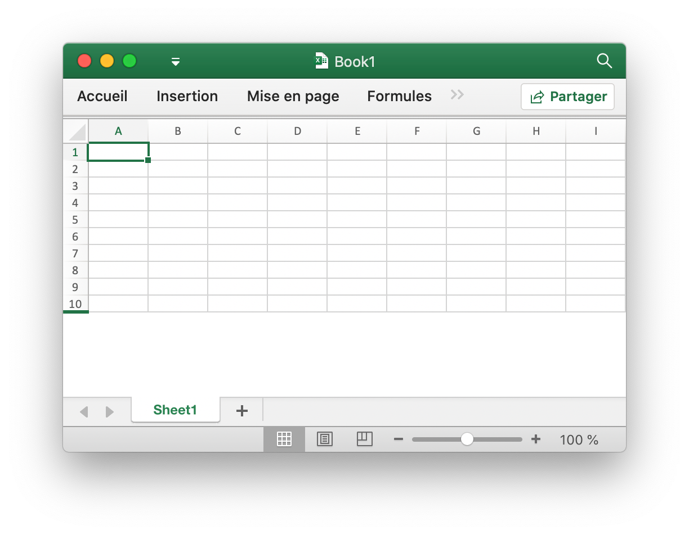

# Classeur

`Options` définit les options d'ouverture et de lecture des feuilles de calcul.

```go
type Options struct {
    Password          string
    RawCellValue      bool
    UnzipSizeLimit    int64
    UnzipXMLSizeLimit int64
}
```

`Password` spécifie le mot de passe de la feuille de calcul en texte brut.

`RawCellValue` spécifie si appliquer le format numérique pour la valeur de la cellule ou obtenir la valeur brute.

`UnzipSizeLimit` spécifie la taille limite de décompression en octets à l'ouverture de la feuille de calcul, cette valeur doit être supérieure ou égale à `UnzipXMLSizeLimit`, la taille limite par défaut est de 16Go.

`UnzipXMLSizeLimit` spécifie la limite de mémoire pour décompresser la feuille de calcul et la table de chaînes partagée en octets, la feuille de calcul XML sera extraite dans le répertoire temporaire du système lorsque la taille du fichier dépasse cette valeur, cette valeur doit être inférieure ou égale à `UnzipSizeLimit`, la valeur par défaut la valeur est de 16 Mo.

## Créer un document Excel {#NewFile}

```go
func NewFile() *File
```

NewFile fournit une fonction pour créer un nouveau fichier par le modèle par défaut. Le classeur nouvellement créé contiendra par défaut une feuille de calcul appelée `Sheet1`. Par exemple:

## Ouvrir {#OpenFile}

```go
func OpenFile(filename string, opt ...Options) (*File, error)
```

OpenFile prend le nom d'un fichier de feuille de calcul et renvoie une structure de fichier de feuille de calcul remplie pour celui-ci. Par exemple, ouvrez une feuille de calcul avec une protection par mot de passe:

```go
f, err := excelize.OpenFile("Book1.xlsx", excelize.Options{Password: "password"})
if err != nil {
    return
}
```

Notez que Excelize ne prend en charge que le déchiffrement et ne prend pas en charge le chiffrement actuellement, la feuille de calcul enregistrée par [`Save()`](workbook.md#Save) et [`SaveAs()`](workbook.md#SaveAs) sera sans mot de passe non protégée. Fermez le fichier par [`Close()`](workbook.md#Close) après avoir ouvert la feuille de calcul.

## Flux de données ouvert {#OpenReader}

```go
func OpenReader(r io.Reader, opt ...Options) (*File, error)
```

OpenReader lit le flux de données depuis `io.Reader` et renvoie un fichier de feuille de calcul rempli.

Par exemple, créez un serveur HTTP pour gérer le modèle de téléchargement, puis le fichier de téléchargement des réponses avec une nouvelle feuille de calcul ajoutée:

```go
package main

import (
    "fmt"
    "net/http"

    "github.com/xuri/excelize/v2"
)

func process(w http.ResponseWriter, req *http.Request) {
    file, _, err := req.FormFile("file")
    if err != nil {
        fmt.Fprintf(w, err.Error())
        return
    }
    defer file.Close()
    f, err := excelize.OpenReader(file)
    if err != nil {
        fmt.Fprintf(w, err.Error())
        return
    }
    f.NewSheet("NewSheet")
    w.Header().Set("Content-Disposition", "attachment; filename=Book1.xlsx")
    w.Header().Set("Content-Type", req.Header.Get("Content-Type"))
    if _, err := f.WriteTo(w); err != nil {
        fmt.Fprintf(w, err.Error())
    }
    return
}

func main() {
    http.HandleFunc("/process", process)
    http.ListenAndServe(":8090", nil)
}
```

Testez avec cURL:

```bash
curl --location --request GET 'http://127.0.0.1:8090/process' \
--form 'file=@/tmp/template.xlsx' -O -J
curl: Saved to filename 'Book1.xlsx'
```

## Enregistrer {#Save}

```go
func (f *File) Save() error
```

Save fournit une fonction pour remplacer le fichier xlsx avec le chemin d'origine.

## Enregistrer sous {#SaveAs}

```go
func (f *File) SaveAs(name string) error
```

SaveAs fournit une fonction pour créer ou mettre à jour un fichier xlsx sur le chemin fourni.

## Fermer le classeur {#Close}

```go
func (f *File) Close() error
```

Close ferme et nettoie le fichier temporaire ouvert pour la feuille de calcul.

## Créer une feuille de calcul {#NewSheet}

```go
func (f *File) NewSheet(name string) int
```

NewSheet fournit la fonction pour créer une nouvelle feuille en donnant un nom de feuille de calcul et renvoie l'index des feuilles dans le classeur (feuille de calcul) après l'ajout. Notez que lors de la création d'un nouveau fichier de feuille de calcul, la feuille de calcul par défaut nommée `Sheet1` sera créée.

## Supprimer la feuille de calcul {#DeleteSheet}

```go
func (f *File) DeleteSheet(name string)
```

DeleteSheet fournit une fonction pour supprimer une feuille de calcul dans un classeur par nom de feuille de calcul donné. Utilisez cette méthode avec précaution, ce qui affectera les modifications dans les références telles que les formules, les graphiques, etc. S'il y a une valeur référencée de la feuille de calcul supprimée, cela provoquera une erreur de fichier lorsque vous l'ouvrez. Cette fonction sera invalide quand seule la feuille de travail est laissée.

## Copier la feuille de calcul {#CopySheet}

```go
func (f *File) CopySheet(from, to int) error
```

CopySheet fournit une fonction pour dupliquer une feuille de calcul en donnant l'index de la feuille de calcul source et cible. Notez que les classeurs en double contenant des tableaux, des graphiques ou des images ne sont actuellement pas pris en charge. Par exemple:

```go
// Sheet1 existe déjà...
index := f.NewSheet("Sheet2")
err := f.CopySheet(1, index)
return err
```

## Feuilles de travail de groupe {#GroupSheets}

```go
func (f *File) GroupSheets(sheets []string) error
```

GroupSheets fournit une fonction pour regrouper les feuilles de calcul par noms de feuilles de calcul donnés. Les feuilles de travail de groupe doivent contenir une feuille de travail active.

## Dissocier les feuilles de calcul {#UngroupSheets}

```go
func (f *File) UngroupSheets() error
```

UngroupSheets fournit une fonction pour dissocier les feuilles de calcul.

## Arrière-plan de la feuille de travail {#SetSheetBackground}

```go
func (f *File) SetSheetBackground(sheet, picture string) error
```

SetSheetBackground fournit une fonction pour définir l'image d'arrière-plan par nom de feuille de calcul donné.

## Définir la feuille de calcul par défaut {#SetActiveSheet}

```go
func (f *File) SetActiveSheet(index int)
```

SetActiveSheet fournit une fonction pour définir la feuille active par défaut du classeur en fonction d'un index donné. Notez que l'index actif est différent de l'ID retourné par la fonction [`GetSheetMap`](sheet.md#GetSheetMap). Il doit être supérieur ou égal à `0` et inférieur au nombre total de feuilles de calcul.

## Obtenir l'index de feuille actif {#GetActiveSheetIndex}

```go
func (f *File) GetActiveSheetIndex() int
```

GetActiveSheetIndex fournit une fonction pour obtenir une feuille active de XLSX. S'il n'est pas trouvé, la feuille active retournera l'entier `0`.

## Définir la feuille de calcul visible {#SetSheetVisible}

```go
func (f *File) SetSheetVisible(name string, visible bool) error
```

SetSheetVisible fournit une fonction permettant de définir une feuille de calcul visible par son nom. Un classeur doit contenir au moins une feuille de calcul visible. Si la feuille de calcul donnée a été activée, ce paramètre sera invalidé. Valeurs d'état de la feuille telles que définies par [SheetStateValues Enum](https://docs.microsoft.com/fr-fr/dotnet/api/documentformat.openxml.spreadsheet.sheetstatevalues?view=openxml-2.8.1):

|Sheet State Values|
|---|
|visible|
|hidden|
|veryHidden|

Par exemple, masquer `Sheet1`:

```go
err := f.SetSheetVisible("Sheet1", false)
```

## Obtenir la feuille de calcul visible {#GetSheetVisible}

```go
func (f *File) GetSheetVisible(name string) bool
```

GetSheetVisible fournit une fonction permettant d’obtenir une feuille de calcul visible par son nom. Par exemple, obtenez l'état visible de `Sheet1`:

```go
f.GetSheetVisible("Sheet1")
```

## Définir les propriétés du format de feuille de calcul {#SetSheetFormatPr}

```go
func (f *File) SetSheetFormatPr(sheet string, opts ...SheetFormatPrOptions) error
```

SetSheetFormatPr fournit une fonction pour définir les propriétés de formatage des feuilles de calcul.

Options disponibles:

Paramètre de format facultatif | Type
---|---
BaseColWidth | uint8
DefaultColWidth | float64
DefaultRowHeight | float64
CustomHeight | bool
ZeroHeight | bool
ThickTop | bool
ThickBottom | bool

Par exemple, rendre les lignes de feuille de calcul par défaut masquées:

<p align="center"></p>

```go
f := excelize.NewFile()
const sheet = "Sheet1"
if err := f.SetSheetFormatPr("Sheet1", excelize.ZeroHeight(true)); err != nil {
    fmt.Println(err)
}
if err := f.SetRowVisible("Sheet1", 10, true); err != nil {
    fmt.Println(err)
}
f.SaveAs("Book1.xlsx")
```

## Obtenir les propriétés du format de feuille de calcul {#GetSheetFormatPr}

```go
func (f *File) GetSheetFormatPr(sheet string, opts ...SheetFormatPrOptionsPtr) error
```

GetSheetFormatPr fournit une fonction pour obtenir les propriétés de formatage des feuilles de calcul.

Options disponibles:

Paramètre de format facultatif | Type
---|---
BaseColWidth | uint8
DefaultColWidth | float64
DefaultRowHeight | float64
CustomHeight | bool
ZeroHeight | bool
ThickTop | bool
ThickBottom | bool

Par exemple:

```go
f := excelize.NewFile()
const sheet = "Sheet1"

var (
    baseColWidth     excelize.BaseColWidth
    defaultColWidth  excelize.DefaultColWidth
    defaultRowHeight excelize.DefaultRowHeight
    customHeight     excelize.CustomHeight
    zeroHeight       excelize.ZeroHeight
    thickTop         excelize.ThickTop
    thickBottom      excelize.ThickBottom
)

if err := f.GetSheetFormatPr(sheet,
    &baseColWidth,
    &defaultColWidth,
    &defaultRowHeight,
    &customHeight,
    &zeroHeight,
    &thickTop,
    &thickBottom,
); err != nil {
    fmt.Println(err)
}
fmt.Println("Defaults:")
fmt.Println("- baseColWidth:", baseColWidth)
fmt.Println("- defaultColWidth:", defaultColWidth)
fmt.Println("- defaultRowHeight:", defaultRowHeight)
fmt.Println("- customHeight:", customHeight)
fmt.Println("- zeroHeight:", zeroHeight)
fmt.Println("- thickTop:", thickTop)
fmt.Println("- thickBottom:", thickBottom)
```

Obtenir la sortie:

```text
Defaults:
- baseColWidth: 0
- defaultColWidth: 0
- defaultRowHeight: 15
- customHeight: false
- zeroHeight: false
- thickTop: false
- thickBottom: false
```

## Définir les propriétés de la vue de feuille de calcul {#SetSheetViewOptions}

```go
func (f *File) SetSheetViewOptions(name string, viewIndex int, opts ...SheetViewOption) error
```

SetSheetViewOptions définit les options d'affichage des feuilles. Le `viewIndex` peut être négatif et si c'est le cas, il est compté en arrière (`-1` est la dernière vue).

Paramètre de vue facultatif|Type
---|---
DefaultGridColor | bool
ShowFormulas | bool
ShowGridLines | bool
ShowRowColHeaders | bool
ShowZeros | bool
RightToLeft | bool
ShowRuler | bool
View | string
TopLeftCell | string
ZoomScale | float64

- Exemple 1:

```go
err = f.SetSheetViewOptions("Sheet1", -1, ShowGridLines(false))
```

- Exemple 2:

```go
f := excelize.NewFile()
const sheet = "Sheet1"

if err := f.SetSheetViewOptions(sheet, 0,
    excelize.DefaultGridColor(false),
    excelize.ShowFormulas(true),
    excelize.ShowGridLines(true),
    excelize.ShowRowColHeaders(true),
    excelize.RightToLeft(false),
    excelize.ShowRuler(false),
    excelize.View("pageLayout"),
    excelize.TopLeftCell("C3"),
    excelize.ZoomScale(80),
); err != nil {
    fmt.Println(err)
}

var zoomScale ZoomScale
fmt.Println("Default:")
fmt.Println("- zoomScale: 80")

if err := f.SetSheetViewOptions(sheet, 0, excelize.ZoomScale(500)); err != nil {
    fmt.Println(err)
}

if err := f.GetSheetViewOptions(sheet, 0, &zoomScale); err != nil {
    fmt.Println(err)
}

fmt.Println("Used out of range value:")
fmt.Println("- zoomScale:", zoomScale)

if err := f.SetSheetViewOptions(sheet, 0, excelize.ZoomScale(123)); err != nil {
    fmt.Println(err)
}

if err := f.GetSheetViewOptions(sheet, 0, &zoomScale); err != nil {
    fmt.Println(err)
}

fmt.Println("Used correct value:")
fmt.Println("- zoomScale:", zoomScale)
```

Obtenir la sortie:

```text
Default:
- zoomScale: 80
Used out of range value:
- zoomScale: 80
Used correct value:
- zoomScale: 123
```

## Obtenir les propriétés d'affichage de la feuille de calcul {#GetSheetViewOptions}

```go
func (f *File) GetSheetViewOptions(name string, viewIndex int, opts ...SheetViewOptionPtr) error
```

GetSheetViewOptions obtient la valeur des options d'affichage de feuille. Le `viewIndex` peut être négatif et si c'est le cas est compté en arrière (`-1` est la dernière vue). Options disponibles:

Paramètre de vue facultatif|Type
---|---
DefaultGridColor | bool
ShowFormulas | bool
ShowGridLines | bool
ShowRowColHeaders | bool
ShowZeros | bool
RightToLeft | bool
ShowRuler | bool
View | string
TopLeftCell | string
ZoomScale | float64

- Exemple 1, pour obtenir les paramètres de la propriété gridline pour la dernière vue de la feuille de calcul nommée `Sheet1`:

```go
var showGridLines excelize.ShowGridLines
err = f.GetSheetViewOptions("Sheet1", -1, &showGridLines)
```

- Exemple 2:

```go
f := NewFile()
const sheet = "Sheet1"

var (
    defaultGridColor  excelize.DefaultGridColor
    showFormulas      excelize.ShowFormulas
    showGridLines     excelize.ShowGridLines
    showRowColHeaders excelize.ShowRowColHeaders
    showZeros         excelize.ShowZeros
    rightToLeft       excelize.RightToLeft
    showRuler         excelize.ShowRuler
    view              excelize.View
    topLeftCell       excelize.TopLeftCell
    zoomScale         excelize.ZoomScale
)

if err := f.GetSheetViewOptions(sheet, 0,
    &defaultGridColor,
    &showFormulas,
    &showGridLines,
    &showRowColHeaders,
    &showZeros,
    &rightToLeft,
    &showRuler,
    &view,
    &topLeftCell,
    &zoomScale,
); err != nil {
    fmt.Println(err)
}

fmt.Println("Default:")
fmt.Println("- defaultGridColor:", defaultGridColor)
fmt.Println("- showFormulas:", showFormulas)
fmt.Println("- showGridLines:", showGridLines)
fmt.Println("- showRowColHeaders:", showRowColHeaders)
fmt.Println("- showZeros:", showZeros)
fmt.Println("- rightToLeft:", rightToLeft)
fmt.Println("- showRuler:", showRuler)
fmt.Println("- view:", view)
fmt.Println("- topLeftCell:", `"`+topLeftCell+`"`)
fmt.Println("- zoomScale:", zoomScale)

if err := f.SetSheetViewOptions(sheet, 0, excelize.ShowGridLines(false)); err != nil {
    fmt.Println(err)
}

if err := f.GetSheetViewOptions(sheet, 0, &showGridLines); err != nil {
    fmt.Println(err)
}

if err := f.SetSheetViewOptions(sheet, 0, excelize.ShowZeros(false)); err != nil {
    fmt.Println(err)
}

if err := f.GetSheetViewOptions(sheet, 0, &showZeros); err != nil {
    fmt.Println(err)
}

if err := f.SetSheetViewOptions(sheet, 0, excelize.View("pageLayout")); err != nil {
    fmt.Println(err)
}

if err := f.GetSheetViewOptions(sheet, 0, &view); err != nil {
    fmt.Println(err)
}

if err := f.SetSheetViewOptions(sheet, 0, excelize.TopLeftCell("B2")); err != nil {
    fmt.Println(err)
}

if err := f.GetSheetViewOptions(sheet, 0, &topLeftCell); err != nil {
    fmt.Println(err)
}

fmt.Println("After change:")
fmt.Println("- showGridLines:", showGridLines)
fmt.Println("- showZeros:", showZeros)
fmt.Println("- view:", view)
fmt.Println("- topLeftCell:", topLeftCell)
```

Obtenir la sortie:

```text
Default:
- defaultGridColor: true
- showFormulas: false
- showGridLines: true
- showRowColHeaders: true
- showZeros: true
- rightToLeft: false
- showRuler: true
- view: normal
- topLeftCell: ""
- zoomScale: 0
After change:
- showGridLines: false
- showZeros: false
- view: pageLayout
- topLeftCell: B2
```

## Définir la mise en page de feuille de calcul {#SetPageLayout}

```go
func (f *File) SetPageLayout(sheet string, opts ...PageLayoutOption) error
```

SetPageLayout fournit une fonction permettant de définir la mise en page de la feuille de calcul. Options disponibles:

- `BlackAndWhite` a spécifié l'impression en noir et blanc.

- `FirstPageNumber` a spécifié le premier numéro de page imprimée. Si aucune valeur n'est spécifiée, alors "automatique" est supposé.

- `PageLayoutOrientation` fournit une méthode pour définir l'orientation de la feuille de calcul, l'orientation par défaut est "portrait". Le tableau suivant présente les paramètres d'orientation pris en charge par le numéro d'indexation Excelize:

Paramètre | Orientation
---|---
OrientationPortrait  | portrait
OrientationLandscape | landscape

- `PageLayoutPaperSize` fournit une méthode pour définir le format de papier de la feuille de calcul. Le format de papier par défaut de la feuille de calcul est Letter US (8 1/2 × 11"). Le tableau ci-dessous présente le format de papier trié par numéro d'index Excelize:

Index | Taille de papier
---|---
1   | Letter paper (8.5 in. × 11 in.)
2   | Letter small paper (8.5 in. × 11 in.)
3   | Tabloid paper (11 in. × 17 in.)
4   | Ledger paper (17 in. × 11 in.)
5   | Legal paper (8.5 in. × 14 in.)
6   | Statement paper (5.5 in. × 8.5 in.)
7   | Executive paper (7.25 in. × 10.5 in.)
8   | A3 paper (297 mm × 420 mm)
9   | A4 paper (210 mm × 297 mm)
10  | A4 small paper (210 mm × 297 mm)
11  | A5 paper (148 mm × 210 mm)
12  | B4 paper (250 mm × 353 mm)
13  | B5 paper (176 mm × 250 mm)
14  | Folio paper (8.5 in. × 13 in.)
15  | Quarto paper (215 mm × 275 mm)
16  | Standard paper (10 in. × 14 in.)
17  | Standard paper (11 in. × 17 in.)
18  | Note paper (8.5 in. × 11 in.)
19  | #9 envelope (3.875 in. × 8.875 in.)
20  | #10 envelope (4.125 in. × 9.5 in.)
21  | #11 envelope (4.5 in. × 10.375 in.)
22  | #12 envelope (4.75 in. × 11 in.)
23  | #14 envelope (5 in. × 11.5 in.)
24  | C paper (17 in. × 22 in.)
25  | D paper (22 in. × 34 in.)
26  | E paper (34 in. × 44 in.)
27  | DL envelope (110 mm × 220 mm)
28  | C5 envelope (162 mm × 229 mm)
29  | C3 envelope (324 mm × 458 mm)
30  | C4 envelope (229 mm × 324 mm)
31  | C6 envelope (114 mm × 162 mm)
32  | C65 envelope (114 mm × 229 mm)
33  | B4 envelope (250 mm × 353 mm)
34  | B5 envelope (176 mm × 250 mm)
35  | B6 envelope (176 mm × 125 mm)
36  | Italy envelope (110 mm × 230 mm)
37  | Monarch envelope (3.875 in. × 7.5 in.).
38  | 6¾ envelope (3.625 in. × 6.5 in.)
39  | US standard fanfold (14.875 in. × 11 in.)
40  | German standard fanfold (8.5 in. × 12 in.)
41  | German legal fanfold (8.5 in. × 13 in.)
42  | ISO B4 (250 mm × 353 mm)
43  | Japanese postcard (100 mm × 148 mm)
44  | Standard paper (9 in. × 11 in.)
45  | Standard paper (10 in. × 11 in.)
46  | Standard paper (15 in. × 11 in.)
47  | Invite envelope (220 mm × 220 mm)
50  | Letter extra paper (9.275 in. × 12 in.)
51  | Legal extra paper (9.275 in. × 15 in.)
52  | Tabloid extra paper (11.69 in. × 18 in.)
53  | A4 extra paper (236 mm × 322 mm)
54  | Letter transverse paper (8.275 in. × 11 in.)
55  | A4 transverse paper (210 mm × 297 mm)
56  | Letter extra transverse paper (9.275 in. × 12 in.)
57  | SuperA/SuperA/A4 paper (227 mm × 356 mm)
58  | SuperB/SuperB/A3 paper (305 mm × 487 mm)
59  | Letter plus paper (8.5 in. × 12.69 in.)
60  | A4 plus paper (210 mm × 330 mm)
61  | A5 transverse paper (148 mm × 210 mm)
62  | JIS B5 transverse paper (182 mm × 257 mm)
63  | A3 extra paper (322 mm × 445 mm)
64  | A5 extra paper (174 mm × 235 mm)
65  | ISO B5 extra paper (201 mm × 276 mm)
66  | A2 paper (420 mm × 594 mm)
67  | A3 transverse paper (297 mm × 420 mm)
68  | A3 extra transverse paper (322 mm × 445 mm)
69  | Japanese Double Postcard (200 mm × 148 mm)
70  | A6 (105 mm × 148 mm)
71  | Japanese Envelope Kaku #2
72  | Japanese Envelope Kaku #3
73  | Japanese Envelope Chou #3
74  | Japanese Envelope Chou #4
75  | Letter Rotated (11 × 8½ in.)
76  | A3 Rotated (420 mm × 297 mm)
77  | A4 Rotated (297 mm × 210 mm)
78  | A5 Rotated (210 mm × 148 mm)
79  | B4 (JIS) Rotated (364 mm × 257 mm)
80  | B5 (JIS) Rotated (257 mm × 182 mm)
81  | Japanese Postcard Rotated (148 mm × 100 mm)
82  | Double Japanese Postcard Rotated (148 mm × 200 mm)
83  | A6 Rotated (148 mm × 105 mm)
84  | Japanese Envelope Kaku #2 Rotated
85  | Japanese Envelope Kaku #3 Rotated
86  | Japanese Envelope Chou #3 Rotated
87  | Japanese Envelope Chou #4 Rotated
88  | B6 (JIS) (128 mm × 182 mm)
89  | B6 (JIS) Rotated (182 mm × 128 mm)
90  | (12 in × 11 in)
91  | Japanese Envelope You #4
92  | Japanese Envelope You #4 Rotated
93  | PRC 16K (146 mm × 215 mm)
94  | PRC 32K (97 mm × 151 mm)
95  | PRC 32K(Big) (97 mm × 151 mm)
96  | PRC Envelope #1 (102 mm × 165 mm)
97  | PRC Envelope #2 (102 mm × 176 mm)
98  | PRC Envelope #3 (125 mm × 176 mm)
99  | PRC Envelope #4 (110 mm × 208 mm)
100 | PRC Envelope #5 (110 mm × 220 mm)
101 | PRC Envelope #6 (120 mm × 230 mm)
102 | PRC Envelope #7 (160 mm × 230 mm)
103 | PRC Envelope #8 (120 mm × 309 mm)
104 | PRC Envelope #9 (229 mm × 324 mm)
105 | PRC Envelope #10 (324 mm × 458 mm)
106 | PRC 16K Rotated
107 | PRC 32K Rotated
108 | PRC 32K(Big) Rotated
109 | PRC Envelope #1 Rotated (165 mm × 102 mm)
110 | PRC Envelope #2 Rotated (176 mm × 102 mm)
111 | PRC Envelope #3 Rotated (176 mm × 125 mm)
112 | PRC Envelope #4 Rotated (208 mm × 110 mm)
113 | PRC Envelope #5 Rotated (220 mm × 110 mm)
114 | PRC Envelope #6 Rotated (230 mm × 120 mm)
115 | PRC Envelope #7 Rotated (230 mm × 160 mm)
116 | PRC Envelope #8 Rotated (309 mm × 120 mm)
117 | PRC Envelope #9 Rotated (324 mm × 229 mm)
118 | PRC Envelope #10 Rotated (458 mm × 324 mm)

- `FitToHeight` spécifiait le nombre de pages verticales sur lesquelles tenir.

- `FitToWidth` spécifiait le nombre de pages horizontales sur lesquelles tenir.

- `PageLayoutScale` définit la mise à l'échelle de l'impression. Cet attribut est limité aux valeurs comprises entre 10 (10%) et 400 (400%). Ce paramètre est remplacé lorsque `FitToWidth` et / ou `FitToHeight` sont utilisés.

- Par exemple, définissez la mise en page pour `Sheet1` avec impression en noir et blanc, premier numéro de page imprimée à partir de `2`, petit papier A4 paysage (210 mm sur 297 mm), 2 pages verticales pour s'adapter, 2 pages horizontales pour s'adapter sur et mise à l'échelle d'impression à 50%:

```go
f := excelize.NewFile()
if err := f.SetPageLayout(
    "Sheet1",
    excelize.BlackAndWhite(true),
    excelize.FirstPageNumber(2),
    excelize.PageLayoutOrientation(excelize.OrientationLandscape),
    excelize.PageLayoutPaperSize(10),
    excelize.FitToHeight(2),
    excelize.FitToWidth(2),
    excelize.PageLayoutScale(50),
); err != nil {
    fmt.Println(err)
}
```

## Obtenir la mise en page de feuille de calcul {#GetPageLayout}

```go
func (f *File) GetPageLayout(sheet string, opts ...PageLayoutOptionPtr) error
```

GetPageLayout fournit une fonction pour obtenir la mise en page de la feuille de calcul. Options disponibles:

- `PageLayoutOrientation` fournit une méthode pour obtenir l'orientation de la feuille de travail
- `PageLayoutPaperSize` fournit une méthode pour obtenir le format de feuille de calcul

- Par exemple, obtenez la mise en page de `Sheet1`:

```go
f := excelize.NewFile()
const sheet = "Sheet1"
var (
    orientation excelize.PageLayoutOrientation
    paperSize   excelize.PageLayoutPaperSize
)
if err := f.GetPageLayout("Sheet1", &orientation); err != nil {
    fmt.Println(err)
}
if err := f.GetPageLayout("Sheet1", &paperSize); err != nil {
    fmt.Println(err)
}
fmt.Println("Defaults:")
fmt.Printf("- orientation: %q\n", orientation)
fmt.Printf("- paper size: %d\n", paperSize)
```

Résultat:

```text
Defaults:
- orientation: "portrait"
- paper size: 1
```

## Définissez les marges de page de feuille de calcul {#SetPageMargins}

```go
func (f *File) SetPageMargins(sheet string, opts ...PageMarginsOptions) error
```

SetPageMargins fournit une fonction permettant de définir les marges des pages de la feuille de calcul. Options disponibles:

Options|Tapez
---|---
PageMarginBotom|float64
PageMarginFooter|float64
PageMarginHeader|float64
PageMarginLeft|float64
PageMarginRight|float64
PageMarginTop|float64

- Par exemple, définissez les marges de page de `Sheet1`:

```go
f := excelize.NewFile()
const sheet = "Sheet1"

if err := f.SetPageMargins(sheet,
    excelize.PageMarginBottom(1.0),
    excelize.PageMarginFooter(1.0),
    excelize.PageMarginHeader(1.0),
    excelize.PageMarginLeft(1.0),
    excelize.PageMarginRight(1.0),
    excelize.PageMarginTop(1.0),
); err != nil {
    fmt.Println(err)
}
```

## Obtenir les marges des pages de la feuille de calcul {#GetPageMargins}

```go
func (f *File) GetPageMargins(sheet string, opts ...PageMarginsOptionsPtr) error
```

GetPageMargins fournit une fonction pour obtenir les marges des pages de la feuille de calcul. Options disponibles:

Options|Tapez
---|---
PageMarginBotom|float64
PageMarginFooter|float64
PageMarginHeader|float64
PageMarginLeft|float64
PageMarginRight|float64
PageMarginTop|float64

- Par exemple, obtenez les marges de page de `Sheet1`:

```go
f := excelize.NewFile()
const sheet = "Sheet1"

var (
    marginBottom excelize.PageMarginBottom
    marginFooter excelize.PageMarginFooter
    marginHeader excelize.PageMarginHeader
    marginLeft   excelize.PageMarginLeft
    marginRight  excelize.PageMarginRight
    marginTop    excelize.PageMarginTop
)

if err := f.GetPageMargins(sheet,
    &marginBottom,
    &marginFooter,
    &marginHeader,
    &marginLeft,
    &marginRight,
    &marginTop,
); err != nil {
    fmt.Println(err)
}
fmt.Println("Defaults:")
fmt.Println("- marginBottom:", marginBottom)
fmt.Println("- marginFooter:", marginFooter)
fmt.Println("- marginHeader:", marginHeader)
fmt.Println("- marginLeft:", marginLeft)
fmt.Println("- marginRight:", marginRight)
fmt.Println("- marginTop:", marginTop)
```

Résultat:

```text
Defaults:
- marginBottom: 0.75
- marginFooter: 0.3
- marginHeader: 0.3
- marginLeft: 0.7
- marginRight: 0.7
- marginTop: 0.75
```

## Définir les propriétés du classeur {#SetWorkbookPrOptions}

```go
func (f *File) SetWorkbookPrOptions(opts ...WorkbookPrOption) error
```

SetWorkbookPrOptions fournit une fonction pour définir les propriétés du classeur. Options disponibles:

Options|Tapez
---|---
CodeName|string

Par exemple, définissez les propriétés du classeur:

```go
f := excelize.NewFile()
if err := f.SetWorkbookPrOptions(
    excelize.CodeName("code"),
); err != nil {
    fmt.Println(err)
}
```

## Obtenir les propriétés du classeur {#GetWorkbookPrOptions}

```go
func (f *File) GetWorkbookPrOptions(opts ...WorkbookPrOptionPtr) error
```

GetWorkbookPrOptions fournit une fonction pour obtenir les propriétés du classeur. Options disponibles:

Options|Tapez
---|---
CodeName|string

Par exemple, obtenez les propriétés du classeur:

```go
f := excelize.NewFile()
var codeName excelize.CodeName
if err := f.GetWorkbookPrOptions(&codeName); err != nil {
    fmt.Println(err)
}
fmt.Println("Defaults:")
fmt.Printf("- codeName: %q\n", codeName)
```

Résultat:

```text
Defaults:
- codeName: ""
```

## Définir l'en-tête et le pied de page {#SetHeaderFooter}

```go
func (f *File) SetHeaderFooter(sheet string, settings *FormatHeaderFooter) error
```

SetHeaderFooter fournit une fonction permettant de définir les en-têtes et les pieds de page en fonction du nom de la feuille de calcul et des caractères de contrôle.

Les en-têtes et les pieds de page sont spécifiés à l'aide des champs de paramètres suivants:

Champs｜La description
---|---
AlignWithMargins | Aligner les marges de l'en-tête et du pied de page avec les marges de la page
DifferentFirst   | Indicateur d'en-tête et de pied de page de première page différent
DifferentOddEven | Différents en-têtes et pieds de page pairs et impairs
ScaleWithDoc     | Mettre à l'échelle l'en-tête et le pied de page avec la mise à l'échelle du document
OddFooter        | Pied de page impair
OddHeader        | En-tête impair
EvenFooter       | Pied de page pair
EvenHeader       | En-tête de page pair
FirstFooter      | Pied de page de la première page
FirstHeader      | En-tête de la première page

Les codes de formatage suivants peuvent être utilisés dans 6 champs de type chaîne: `OddHeader`, `OddFooter`, `EvenHeader`, `EvenFooter`, `FirstFooter`, `FirstHeader`

<table>
    <thead>
        <tr>
            <th>Code de formatage</th>
            <th>La description</th>
        </tr>
    </thead>
    <tbody>
        <tr>
            <td><code>&amp;&amp;</code></td>
            <td>Le caractère &quot;&amp;&quot;</td>
        </tr>
        <tr>
            <td><code>&amp;font-size</code></td>
            <td>Taille de la police du texte, où font-size est une taille de police décimale en points</td>
        </tr>
        <tr>
            <td><code>&amp;&quot;font name,font type&quot;</code></td>
            <td>Une chaîne de texte de nom de police, nom de police et une chaîne de texte de type de police, type de police</td>
        </tr>
        <tr>
            <td><code>&amp;&quot;-,Regular&quot;</code></td>
            <td>Format de texte normal. Désactive les modes gras et italique</td>
        </tr>
        <tr>
            <td><code>&amp;A</code></td>
            <td>Nom de l&#39;onglet de la feuille de calcul en cours</td>
        </tr>
        <tr>
            <td><code>&amp;B</code> or <code>&amp;&quot;-,Bold&quot;</code></td>
            <td>Format de texte en gras, de désactivé à activé, ou vice versa. Le mode par défaut est désactivé</td>
        </tr>
        <tr>
            <td><code>&amp;D</code></td>
            <td>Date actuelle</td>
        </tr>
        <tr>
            <td><code>&amp;C</code></td>
            <td>Partie centrale</td>
        </tr>
        <tr>
            <td><code>&amp;E</code></td>
            <td>Format de texte à double soulignement</td>
        </tr>
        <tr>
            <td><code>&amp;F</code></td>
            <td>Nom de fichier du classeur actuel</td>
        </tr>
        <tr>
            <td><code>&amp;G</code></td>
            <td>Objet de dessin en arrière-plan</td>
        </tr>
        <tr>
            <td><code>&amp;H</code></td>
            <td>Format de texte ombré</td>
        </tr>
        <tr>
            <td><code>&amp;I</code> or <code>&amp;&quot;-,Italic&quot;</code></td>
            <td>Format de texte en italique</td>
        </tr>
        <tr>
            <td><code>&amp;K</code></td>
            <td>Couleur de la police du texte<br>Une couleur RGB est spécifiée comme RRGGBB<br>Une couleur de thème est spécifiée comme TTSNNN où TT est l&#39;ID de couleur de thème, S est soit &quot;+&quot; ou &quot;-&quot; de la valeur de teinte/nuance, et NNN est la valeur de teinte/nuance</td>
        </tr>
        <tr>
            <td><code>&amp;L</code></td>
            <td>Partie gauche</td>
        </tr>
        <tr>
            <td><code>&amp;N</code></td>
            <td>Nombre total de pages</td>
        </tr>
        <tr>
            <td><code>&amp;O</code></td>
            <td>Format de texte de contour</td>
        </tr>
        <tr>
            <td><code>&amp;P[[+\|-]n]</code></td>
            <td>Sans le suffixe facultatif, le numéro de la page actuelle en décimal</td>
        </tr>
        <tr>
            <td><code>&amp;R</code></td>
            <td>Partie droite</td>
        </tr>
        <tr>
            <td><code>&amp;S</code></td>
            <td>Format de texte barré</td>
        </tr>
        <tr>
            <td><code>&amp;T</code></td>
            <td>Heure actuelle</td>
        </tr>
        <tr>
            <td><code>&amp;U</code></td>
            <td>Format de texte à simple soulignement. Si le mode double souligné est activé, l&#39;occurrence suivante dans un spécificateur de section désactive le mode double souligné; sinon, il bascule le mode de soulignement simple, de désactivé à activé, ou vice versa. Le mode par défaut est désactivé</td>
        </tr>
        <tr>
            <td><code>&amp;X</code></td>
            <td>Format de texte en exposant</td>
        </tr>
        <tr>
            <td><code>&amp;Y</code></td>
            <td>Format de texte en indice</td>
        </tr>
        <tr>
            <td><code>&amp;Z</code></td>
            <td>Chemin d&#39;accès au fichier du classeur actuel</td>
        </tr>
    </tbody>
</table>

Par exemple:

```go
err := f.SetHeaderFooter("Sheet1", &excelize.FormatHeaderFooter{
    DifferentFirst:   true,
    DifferentOddEven: true,
    OddHeader:        "&R&P",
    OddFooter:        "&C&F",
    EvenHeader:       "&L&P",
    EvenFooter:       "&L&D&R&T",
    FirstHeader:      `&CCenter &"-,Bold"Bold&"-,Regular"HeaderU+000A&D`,
})
```

Cet exemple montre:

- La première page a son propre en-tête et pied de page
- Les pages impaires et paires ont des en-têtes et des pieds de page différents
- Numéro de page actuel dans la partie droite des en-têtes de pages impaires
- Nom du fichier du classeur actuel dans la section centrale des pieds de page impairs
- Numéro de page actuel dans la partie gauche des en-têtes de pages paires
- La date actuelle dans la partie gauche et l'heure actuelle dans la partie droite du pied de page pair
- Le texte "Center Bold Header" sur la première ligne de la section centrale de la première page et la date sur la deuxième ligne de la section centrale de cette page
- Pas de pied de page sur la première page

## Définir le nom défini {#SetDefinedName}

```go
func (f *File) SetDefinedName(definedName *DefinedName) error
```

SetDefinedName fournit une fonction permettant de définir les noms définis du classeur ou de la feuille de calcul. S'il n'est pas spécifié scopr, l'étendue par défaut est classeur. Par exemple:

```go
f.SetDefinedName(&excelize.DefinedName{
    Name:     "Amount",
    RefersTo: "Sheet1!$A$2:$D$5",
    Comment:  "defined name comment",
    Scope:    "Sheet2",
})
```

## Obtenir le nom défini {#GetDefinedName}

```go
func (f *File) GetDefinedName() []DefinedName
```

GetDefinedName fournit une fonction pour obtenir les noms définis du classeur ou de la feuille de calcul.

## Supprimer le nom défini {#DeleteDefinedName}

```go
func (f *File) DeleteDefinedName(definedName *DefinedName) error
```

DeleteDefinedName fournit une fonction pour supprimer les noms définis du classeur ou de la feuille de calcul. Si la portée n'est pas spécifiée, la portée par défaut est classeur. Par exemple:

```go
f.DeleteDefinedName(&excelize.DefinedName{
    Name:     "Amount",
    Scope:    "Sheet2",
})
```

## Définir les propriétés de l'application {#SetAppProps}

```go
func (f *File) SetAppProps(appProperties *AppProperties) error
```

SetAppProps fournit une fonction pour définir les propriétés de l'application de document. Les propriétés qui peuvent être définies sont :

Propriété | La description
---|---
Application       | Le nom de l'application qui a créé ce document.
ScaleCrop         | Indique le mode d'affichage de la vignette du document. Définissez cet élément sur `true` pour permettre la mise à l'échelle de la vignette du document à l'affichage. Définissez cet élément sur `false` pour permettre le recadrage de la vignette du document afin d'afficher uniquement les sections qui correspondent à l'affichage.
DocSecurity       | Niveau de sécurité d'un document sous forme de valeur numérique. La sécurité du document est définie comme suit:<br>1 - Le document est protégé par mot de passe.<br>2 - Il est recommandé d'ouvrir le document en lecture seule.<br>3 - Le document doit obligatoirement être ouvert en lecture seule.<br>4 - Le document est verrouillé pour annotation.
Company           | Le nom d'une société associée au document.
LinksUpToDate     | Indique si les liens hypertexte d'un document sont à jour. Définissez cet élément sur `true` pour indiquer que les liens hypertexte sont mis à jour. Définissez cet élément sur `false` pour indiquer que les liens hypertexte sont obsolètes.
HyperlinksChanged | Spécifie qu'un ou plusieurs hyperliens dans cette partie ont été mis à jour exclusivement dans cette partie par un producteur. Le prochain producteur à ouvrir ce document doit mettre à jour les relations des hyperliens avec les nouveaux hyperliens spécifiés dans cette partie.
AppVersion        | Spécifie la version de l'application qui a produit ce document. Le contenu de cet élément doit être de la forme XX.YYYY où X et Y représentent des valeurs numériques, ou le document doit être considéré comme non conforme.

Par exemple:

```go
err := f.SetAppProps(&excelize.AppProperties{
    Application:       "Microsoft Excel",
    ScaleCrop:         true,
    DocSecurity:       3,
    Company:           "Company Name",
    LinksUpToDate:     true,
    HyperlinksChanged: true,
    AppVersion:        "16.0000",
})
```

## Obtenir les propriétés de l'application {#GetAppProps}

```go
func (f *File) GetAppProps() (ret *AppProperties, err error)
```

GetAppProps fournit une fonction pour obtenir les propriétés d'application de document.

## Définir les propriétés du document {#SetDocProps}

```go
func (f *File) SetDocProps(docProperties *DocProperties) error
```

SetDocProps fournit une fonction permettant de définir les propriétés principales du document. Les propriétés pouvant être définies sont:

Propriété | La description
---|---
Title          | Le nom donné à la ressource.
Subject        | Le sujet du contenu de la ressource.
Creator        | Une entité principalement responsable de la création du contenu de la ressource.
Keywords       | Un ensemble de mots-clés délimités pour prendre en charge la recherche et l'indexation. Il s'agit généralement d'une liste de termes qui ne sont pas disponibles ailleurs dans les propriétés.
Description    | Une explication du contenu de la ressource.
LastModifiedBy | L'utilisateur qui a effectué la dernière modification. L'identification est spécifique à l'environnement.
Language       | La langue du contenu intellectuel de la ressource.
Identifier     | Une référence non ambiguë à la ressource dans un contexte donné.
Revision       | Le sujet du contenu de la ressource.
ContentStatus  | Le statut du contenu. Par exemple: les valeurs peuvent inclure "Draft", "Reviewed" et "Final"
Category       | Une catégorisation du contenu de ce paquet.
Version        | Le numéro de version. Cette valeur est définie par l'utilisateur ou par l'application.

Par exemple:

```go
err := f.SetDocProps(&excelize.DocProperties{
    Category:       "category",
    ContentStatus:  "Draft",
    Created:        "2019-06-04T22:00:10Z",
    Creator:        "Go Excelize",
    Description:    "This file created by Go Excelize",
    Identifier:     "xlsx",
    Keywords:       "Spreadsheet",
    LastModifiedBy: "Go Author",
    Modified:       "2019-06-04T22:00:10Z",
    Revision:       "0",
    Subject:        "Test Subject",
    Title:          "Test Title",
    Language:       "en-US",
    Version:        "1.0.0",
})
```

## Obtenir les propriétés du document {#GetDocProps}

```go
func (f *File) GetDocProps() (*DocProperties, error)
```

GetDocProps fournit une fonction pour obtenir les propriétés de base du document.
