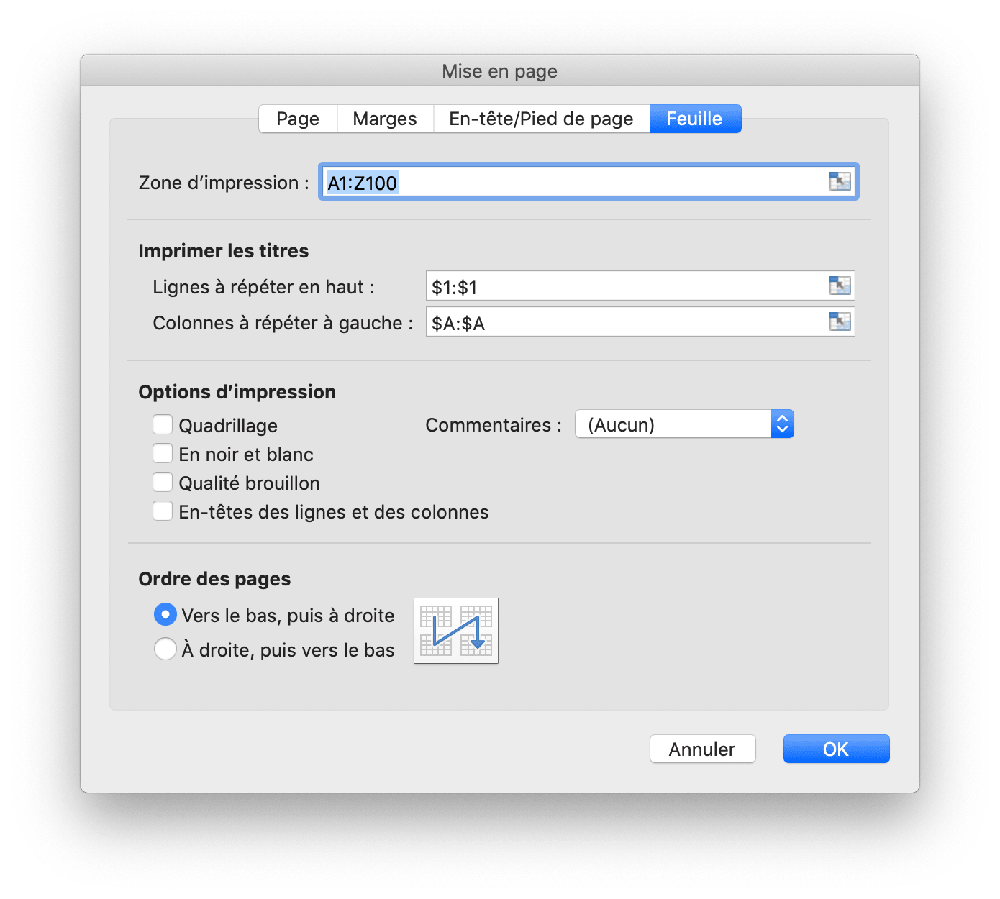

# Classeur

`Options` définit les options de lecture et d'écriture de feuilles de calcul.

```go
type Options struct {
    MaxCalcIterations uint
    Password          string
    RawCellValue      bool
    UnzipSizeLimit    int64
    UnzipXMLSizeLimit int64
    ShortDatePattern  string
    LongDatePattern   string
    LongTimePattern   string
    CultureInfo       CultureName
}
```

`MaxCalcIterations` spécifie le nombre maximum d'itérations pour le calcul itératif, la valeur par défaut est 0.

`Password` spécifie le mot de passe de la feuille de calcul en texte brut.

`RawCellValue` spécifie si appliquer le format numérique pour la valeur de la cellule ou obtenir la valeur brute.

`UnzipSizeLimit` spécifie la taille limite de décompression en octets à l'ouverture de la feuille de calcul, cette valeur doit être supérieure ou égale à `UnzipXMLSizeLimit`, la taille limite par défaut est de 16Go.

`UnzipXMLSizeLimit` spécifie la limite de mémoire pour décompresser la feuille de calcul et la table de chaînes partagée en octets, la feuille de calcul XML sera extraite dans le répertoire temporaire du système lorsque la taille du fichier dépasse cette valeur, cette valeur doit être inférieure ou égale à `UnzipSizeLimit`, la valeur par défaut la valeur est de 16 Mo.

`ShortDatePattern` spécifie le code de format de numéro de date court. Dans les applications de feuille de calcul, les formats de date affichent les numéros de série de date et d'heure sous forme de valeurs de date. Les formats de date commençant par un astérisque (\*) répondent aux modifications des paramètres de date et d'heure régionaux spécifiés pour le système d'exploitation. Les formats sans astérisque ne sont pas affectés par les paramètres du système d'exploitation. Le `ShortDatePattern` utilisé pour spécifie les formats de date à appliquer qui commencent par un astérisque.

`LongDatePattern` spécifie le code de format de numéro de date long.

`LongTimePattern` spécifie le code de format de nombre de temps long.

`CultureInfo` spécifie le code du pays pour l'application du code de format de numéro de langue intégré, qui s'effectue en fonction des paramètres de langue locale du système.

`HeaderFooterImagePositionType` est le type de position de l'image d'en-tête et de pied de page.

```go
type HeaderFooterImagePositionType byte
```

Cette section définit l'énumération des types de position d'image d'en-tête et de pied de page de la feuille de calcul.

```go
const (
    HeaderFooterImagePositionLeft HeaderFooterImagePositionType = iota
    HeaderFooterImagePositionCenter
    HeaderFooterImagePositionRight
)
```

`CustomProperty` mappe directement la propriété personnalisée du classeur. Le type de date de valeur peut être: `int32`, `float64`, `string`, `bool`, `time.Time` ou `nil`.

```go
type CustomProperty struct {
    Name  string
    Value interface{}
}
```

`CalcPropsOptions` définit la collection de propriétés que l'application utilise pour enregistrer l'état et les détails du calcul.

```go
type CalcPropsOptions struct {
    CalcID                *uint
    CalcMode              *string
    FullCalcOnLoad        *bool
    RefMode               *string
    Iterate               *bool
    IterateCount          *uint
    IterateDelta          *float64
    FullPrecision         *bool
    CalcCompleted         *bool
    CalcOnSave            *bool
    ConcurrentCalc        *bool
    ConcurrentManualCount *uint
    ForceFullCalc         *bool
}
```

## Créer un document Excel {#NewFile}

```go
func NewFile(opts ...Options) *File
```

NewFile fournit une fonction pour créer un nouveau fichier par le modèle par défaut. Le classeur nouvellement créé contiendra par défaut une feuille de calcul appelée `Sheet1`. Par exemple:

## Ouvrir {#OpenFile}

```go
func OpenFile(filename string, opts ...Options) (*File, error)
```

OpenFile prend le nom d'un fichier de feuille de calcul et renvoie une structure de fichier de feuille de calcul remplie pour celui-ci. Par exemple, ouvrez une feuille de calcul avec une protection par mot de passe:

```go
f, err := excelize.OpenFile("Book1.xlsx", excelize.Options{Password: "password"})
if err != nil {
    return
}
```

Fermez le fichier par [`Close()`](workbook.md#Close) après avoir ouvert la feuille de calcul.

## Flux de données ouvert {#OpenReader}

```go
func OpenReader(r io.Reader, opts ...Options) (*File, error)
```

OpenReader lit le flux de données depuis `io.Reader` et renvoie un fichier de feuille de calcul rempli.

Par exemple, créez un serveur HTTP pour gérer le modèle de téléchargement, puis le fichier de téléchargement des réponses avec une nouvelle feuille de calcul ajoutée:

```go
package main

import (
    "fmt"
    "net/http"

    "github.com/xuri/excelize/v2"
)

func process(w http.ResponseWriter, req *http.Request) {
    file, _, err := req.FormFile("file")
    if err != nil {
        fmt.Fprint(w, err.Error())
        return
    }
    defer file.Close()
    f, err := excelize.OpenReader(file)
    if err != nil {
        fmt.Fprint(w, err.Error())
        return
    }
    f.Path = "Book1.xlsx"
    f.NewSheet("NewSheet")
    w.Header().Set("Content-Disposition", fmt.Sprintf("attachment; filename=%s", f.Path))
    w.Header().Set("Content-Type", req.Header.Get("Content-Type"))
    if err := f.Write(w); err != nil {
        fmt.Fprint(w, err.Error())
    }
}

func main() {
    http.HandleFunc("/process", process)
    http.ListenAndServe(":8090", nil)
}
```

Testez avec cURL:

```bash
curl --location --request GET 'http://127.0.0.1:8090/process' \
--form 'file=@/tmp/template.xltx' -O -J
```

## Enregistrer {#Save}

```go
func (f *File) Save(opts ...Options) error
```

Save fournit une fonction pour remplacer le fichier xlsx avec le chemin d'origine.

## Enregistrer sous {#SaveAs}

```go
func (f *File) SaveAs(name string, opts ...Options) error
```

SaveAs fournit une fonction pour créer ou mettre à jour un fichier xlsx sur le chemin fourni.

## Fermer le classeur {#Close}

```go
func (f *File) Close() error
```

Close ferme et nettoie le fichier temporaire ouvert pour la feuille de calcul.

## Créer une feuille de calcul {#NewSheet}

```go
func (f *File) NewSheet(sheet string) (int, error)
```

NewSheet fournit la fonction pour créer une nouvelle feuille en donnant un nom de feuille de calcul et renvoie l'index des feuilles dans le classeur (feuille de calcul) après l'ajout. Notez que lors de la création d'un nouveau fichier de feuille de calcul, la feuille de calcul par défaut nommée `Sheet1` sera créée.

## Supprimer la feuille de calcul {#DeleteSheet}

```go
func (f *File) DeleteSheet(sheet string) error
```

DeleteSheet fournit une fonction pour supprimer une feuille de calcul dans un classeur par nom de feuille de calcul donné, les noms de feuille ne sont pas sensibles à la casse. Utilisez cette méthode avec prudence, car cela affectera les modifications apportées aux références telles que les formules, les graphiques, etc. S'il existe une valeur référencée de la feuille de calcul supprimée, cela provoquera une erreur de fichier lorsque vous l'ouvrirez. Cette fonction sera invalide lorsqu'il ne reste qu'une seule feuille de calcul.

## Déplacer la feuille de travail {#MoveSheet}

```go
func (f *File) MoveSheet(source, target string) error
```

MoveSheet déplace une feuille vers une position spécifiée dans le classeur. La fonction déplace la feuille source avant la feuille cible. Après le déplacement, les autres feuilles seront décalées vers la gauche ou la droite. Si la feuille est déjà à la position cible, la fonction n'effectuera aucune action. Cette fonction ne dégroupera pas toutes les feuilles après le déplacement. Par exemple, déplacez `Sheet2` avant `Sheet1`:

```go
err := f.MoveSheet("Sheet2", "Sheet1")
```

## Copier la feuille de calcul {#CopySheet}

```go
func (f *File) CopySheet(from, to int) error
```

CopySheet fournit une fonction pour dupliquer une feuille de calcul en donnant l'index de la feuille de calcul source et cible. Notez que les classeurs en double contenant des tableaux, des graphiques ou des images ne sont actuellement pas pris en charge. Par exemple:

```go
// Sheet1 existe déjà...
index, err := f.NewSheet("Sheet2")
if err != nil {
    fmt.Println(err)
    return
}
err := f.CopySheet(1, index)
```

## Feuilles de travail de groupe {#GroupSheets}

```go
func (f *File) GroupSheets(sheets []string) error
```

GroupSheets fournit une fonction pour regrouper les feuilles de calcul par noms de feuilles de calcul donnés. Les feuilles de travail de groupe doivent contenir une feuille de travail active.

## Dissocier les feuilles de calcul {#UngroupSheets}

```go
func (f *File) UngroupSheets() error
```

UngroupSheets fournit une fonction pour dissocier les feuilles de calcul.

## Arrière-plan de la feuille de travail {#SetSheetBackground}

```go
func (f *File) SetSheetBackground(sheet, picture string) error
```

SetSheetBackground fournit une fonction pour définir l'image d'arrière-plan en fonction du nom de la feuille de calcul et du chemin d'accès au fichier. Types d'images pris en charge: BMP, EMF, EMZ, GIF, JPEG, JPG, PNG, SVG, TIF, TIFF, WMF et WMZ.

```go
func (f *File) SetSheetBackgroundFromBytes(sheet, extension string, picture []byte) error
```

SetSheetBackgroundFromBytes fournit une fonction pour définir l'image d'arrière-plan en fonction du nom de la feuille de calcul, du nom de l'extension et des données d'image. Types d'images pris en charge: BMP, EMF, EMZ, GIF, JPEG, JPG, PNG, SVG, TIF, TIFF, WMF et WMZ.

## Définir la feuille de calcul par défaut {#SetActiveSheet}

```go
func (f *File) SetActiveSheet(index int)
```

SetActiveSheet fournit une fonction pour définir la feuille active par défaut du classeur en fonction d'un index donné. Notez que l'index actif est différent de l'ID retourné par la fonction [`GetSheetMap`](sheet.md#GetSheetMap). Il doit être supérieur ou égal à `0` et inférieur au nombre total de feuilles de calcul.

## Obtenir l'index de feuille actif {#GetActiveSheetIndex}

```go
func (f *File) GetActiveSheetIndex() int
```

GetActiveSheetIndex fournit une fonction pour obtenir une feuille active de XLSX. S'il n'est pas trouvé, la feuille active retournera l'entier `0`.

## Définir la feuille de calcul visible {#SetSheetVisible}

```go
func (f *File) SetSheetVisible(sheet string, visible bool, veryHidden ...bool) error
```

SetSheetVisible fournit une fonction permettant de définir une feuille de calcul visible par son nom. Un classeur doit contenir au moins une feuille de calcul visible. Si la feuille de calcul donnée a été activée, ce paramètre sera invalidé. Le troisième paramètre optionnel `veryHidden` ne fonctionne que lorsque `visible` était `false`.

Par exemple, masquer `Sheet1`:

```go
err := f.SetSheetVisible("Sheet1", false)
```

## Obtenir la feuille de calcul visible {#GetSheetVisible}

```go
func (f *File) GetSheetVisible(sheet string) (bool, error)
```

GetSheetVisible fournit une fonction permettant d'obtenir une feuille de calcul visible par son nom. Par exemple, obtenez l'état visible de `Sheet1`:

```go
visible, err := f.GetSheetVisible("Sheet1")
```

## Définir les propriétés d'une feuille de calcul {#SetSheetProps}

```go
func (f *File) SetSheetProps(sheet string, opts *SheetPropsOptions) error
```

SetSheetProps fournit une fonction permettant de définir les propriétés de la feuille de calcul. Les propriétés qui peuvent être définies sont les suivantes:

Options|Tapez|La description
---|---|---
CodeName                          | `*string`  | Spécifie un nom stable de la feuille, qui ne doit pas changer au fil du temps et ne change pas à partir de l'entrée utilisateur. Ce nom doit être utilisé par code pour référencer une feuille particulière
EnableFormatConditionsCalculation | `*bool`    | Indiquer si les calculs de mise en forme conditionnelle doivent être évalués. Si la valeur est false, les valeurs min/max des échelles de couleurs, des barres de données ou des valeurs seuils dans les règles Top N ne doivent pas être mises à jour. Essentiellement, la mise en forme conditionnelle "calc" est désactivée
Published                         | `*bool`    | Indiquant si la feuille de calcul est publiée, la valeur par défaut est `true`
AutoPageBreaks                    | `*bool`    | Indiquant si la feuille affiche Sauts de page automatiques, la valeur par défaut est `true`
FitToPage                         | `*bool`    | Indiquant si l'option d'impression Ajuster à la page est activée, la valeur par défaut est `false`
TabColorIndexed                   | `*int`     | Représente la valeur de couleur indexée
TabColorRGB                       | `*string`  | Représente la valeur de couleur ARGB (Alpha Red Green Blue) standard
TabColorTheme                     | `*int`     | Représente l'index de base zéro dans la collection, en référençant une valeur particulière exprimée dans la partie Thème
TabColorTint                      | `*float64` | Spécifie la valeur de teinte appliquée à la couleur, la valeur par défaut est `0.0`
OutlineSummaryBelow               | `*bool`    | Indiquant si les lignes récapitulatives apparaissent sous les détails dans un plan, lors de l'application d'un plan, la valeur par défaut est `true`
OutlineSummaryRight               | `*bool`    | Indiquant si les colonnes récapitulatives apparaissent à droite du détail dans un plan, lors de l'application d'un contour, la valeur par défaut est `true`
BaseColWidth                      | `*uint8`   | Spécifie le nombre de caractères de la largeur de chiffre maximale de la police du style normal. Cette valeur n'inclut pas le remplissage de marge ou le rembourrage supplémentaire pour les lignes de grille. Il s'agit uniquement du nombre de caractères, la valeur par défaut est `8`
DefaultColWidth                   | `*float64` | Spécifie la largeur de colonne par défaut mesurée comme le nombre de caractères de la largeur de chiffre maximale de la police du style normal
DefaultRowHeight                  | `*float64` | Spécifie la hauteur de ligne par défaut mesurée en taille de point. Optimisation pour que nous n'ayons pas à écrire la hauteur sur toutes les lignes. Cela peut être écrit si la plupart des lignes ont une hauteur personnalisée, pour atteindre l'optimisation
CustomHeight                      | `*bool`    | Spécifie la hauteur personnalisée, la valeur par défaut est `false`
ZeroHeight                        | `*bool`    | Spécifie si les lignes sont masquées, la valeur par défaut est `false`
ThickTop                          | `*bool`    | Spécifie si les lignes ont une bordure supérieure épaisse par défaut, la valeur par défaut est `false`
ThickBottom                       | `*bool`    | Spécifie si les lignes ont une bordure inférieure épaisse par défaut, la valeur par défaut est `false`

Par exemple, rendre les lignes de feuille de calcul par défaut masquées:

<p align="center"></p>

```go
f, enable := excelize.NewFile(), true
if err := f.SetSheetProps("Sheet1", &excelize.SheetPropsOptions{
    ZeroHeight: &enable,
}); err != nil {
    fmt.Println(err)
}
if err := f.SetRowVisible("Sheet1", 10, true); err != nil {
    fmt.Println(err)
}
f.SaveAs("Book1.xlsx")
```

Il existe 4 types de préréglages "Options de mise à l'échelle personnalisées" dans les applications de tableur, si vous avez besoin de définir ce type d'options de mise à l'échelle, veuillez utiliser les fonctions [`SetSheetProps`](workbook.md#SetSheetProps) et [`SetPageLayout`](workbook.md#SetPageLayout) pour approcher ces 4 options de mise à l'échelle:

1. Pas de mise à l'échelle (impression des feuilles à leur taille réelle):

    ```go
    disable := false
    if err := f.SetSheetProps("Feuil1", &excelize.SheetPropsOptions{
        FitToPage: &disable,
    }); err != nil {
        fmt.Println(err)
    }
    ```

2. Ajuster la feuille sur une page (Réduire la taille de l'impression pour qu'elle tienne sur une seule page):

    ```go
    enable := true
    if err := f.SetSheetProps("Feuil1", &excelize.SheetPropsOptions{
        FitToPage: &enable,
    }); err != nil {
        fmt.Println(err)
    }
    ```

3. Ajustez toutes les colonnes sur une seule page (réduisez l'impression pour qu'elle fasse une page de large):

    ```go
    enable, zero := true, 0
    if err := f.SetSheetProps("Feuil1", &excelize.SheetPropsOptions{
        FitToPage: &enable,
    }); err != nil {
        fmt.Println(err)
    }
    if err := f.SetPageLayout("Feuil1", &excelize.PageLayoutOptions{
        FitToHeight: &zero,
    }); err != nil {
        fmt.Println(err)
    }
    ```

4. Ajustez toutes les rangées sur une seule page (réduisez la taille de l'impression pour qu'elle fasse une page de haut):

    ```go
    enable, zero := true, 0
    if err := f.SetSheetProps("Feuil1", &excelize.SheetPropsOptions{
        FitToPage: &enable,
    }); err != nil {
        fmt.Println(err)
    }
    if err := f.SetPageLayout("Feuil1", &excelize.PageLayoutOptions{
        FitToWidth: &zero,
    }); err != nil {
        fmt.Println(err)
    }
    ```

## Obtenir les propriétés de la feuille de calcul {#GetSheetProps}

```go
func (f *File) GetSheetProps(sheet string) (SheetPropsOptions, error)
```

GetSheetProps fournit une fonction pour obtenir des propriétés de feuille de calcul.

## Définir les propriétés de la vue de feuille de calcul {#SetSheetView}

```go
func (f *File) SetSheetView(sheet string, viewIndex int, opts *ViewOptions) error
```

SetSheetView définit les propriétés de l'affichage de feuille. Le `viewIndex` peut être négatif et, le cas échéant, est compté à rebours (`-1` est la dernière vue). Les propriétés qui peuvent être définies sont les suivantes :

Options|Tapez|La description
---|---|---
DefaultGridColor  | `*bool`    | Indiquant que l'application consommatrice doit utiliser la couleur des lignes de grille par défaut (dépendante du système). Remplace toute couleur spécifiée dans colorId, la valeur par défaut est `true`
RightToLeft       | `*bool`    | Indiquer si la feuille est en mode d'affichage "de droite à gauche". Dans ce mode, la colonne A se trouve à l'extrême droite, la colonne B; est une colonne à gauche de la colonne A, et ainsi de suite. En outre, les informations dans les cellules sont affichées au format de droite à gauche, la valeur par défaut est `false`
ShowFormulas      | `*bool`    | Indiquant si cette feuille doit afficher des formules, la valeur par défaut est `false`
ShowGridLines     | `*bool`    | Indiquant si cette feuille doit afficher des lignes de grille, la valeur par défaut est `true`
ShowRowColHeaders | `*bool`    | Indiquant si la feuille doit afficher des en-têtes de ligne et de colonne, la valeur par défaut est `true`
ShowRuler         | `*bool`    | Indiquant que cette feuille doit afficher la règle, la valeur par défaut est `true`
ShowZeros         | `*bool`    | Indiquer s'il faut "afficher un zéro dans les cellules qui ont une valeur nulle". Lorsque vous utilisez une formule pour référencer une autre cellule vide, la valeur référencée devient `0` lorsque l'indicateur est `true`, la valeur par défaut est `true`
TopLeftCell       | `*string`  | Spécifie un emplacement de la cellule visible en haut à gauche Emplacement de la cellule visible en haut à gauche dans le volet inférieur droit (en mode de gauche à droite)
View              | `*string`  | Indiquant comment la feuille est affichée, par défaut, elle utilise une chaîne vide, les options disponibles: `normal`, `pageBreakPreview` et `pageLayout`
ZoomScale         | `*float64` | Spécifie un grossissement de zoom de fenêtre pour la vue actuelle représentant des valeurs en pourcentage. Cet attribut est limité aux valeurs allant de `10` à `400`. Échelle horizontale et verticale ensemble, la valeur par défaut est `100`

## Obtenir les propriétés d'affichage de la feuille de calcul {#GetSheetView}

```go
func (f *File) GetSheetView(sheet string, viewIndex int) (ViewOptions, error)
```

GetSheetView obtient la valeur des propriétés d'affichage de feuille. Le `viewIndex` peut être négatif et, le cas échéant, est compté à rebours (`-1` est la dernière vue).

## Définir la mise en page de feuille de calcul {#SetPageLayout}

```go
func (f *File) SetPageLayout(sheet string, opts *PageLayoutOptions) error
```

SetPageLayout fournit une fonction permettant de définir la mise en page de la feuille de calcul. Options disponibles:

`Size` fournit une méthode pour définir le format de papier de la feuille de calcul. Le format de papier par défaut de la feuille de calcul est Papier à lettre (8.5 pouces × 11 pouces). Le tableau ci-dessous présente le format de papier trié par numéro d'index Excelize:

Index | Taille de papier
---|---
1   | Papier à lettre (8.5 pouces × 11 pouces)
2   | Lettre petit papier (8.5 pouces × 11 pouces)
3   | Journal tabloïd (11 pouces × 17 pouces)
4   | Papier de grand livre (17 pouces × 11 pouces)
5   | Document juridique (8.5 pouces × 14 pouces)
6   | Document de déclaration (5.5 pouces × 8.5 pouces)
7   | Document exécutif (7.25 pouces × 10.5 pouces)
8   | Papier A3 (297 mm × 420 mm)
9   | Papier A4 (210 mm × 297 mm)
10  | Petit papier A4 (210 mm × 297 mm)
11  | Papier A5 (148 mm × 210 mm)
12  | Papier B4 (250 mm × 353 mm)
13  | Papier B5 (176 mm × 250 mm)
14  | Papier folio (8.5 pouces × 13 pouces)
15  | Papier in-quarto (215 mm × 275 mm)
16  | Papier standard (10 pouces × 14 pouces)
17  | Papier standard (11 pouces × 17 pouces)
18  | Papier à notes (8.5 pouces × 11 pouces)
19  | Enveloppe n°9 (3.875 pouces × 8.875 pouces)
20  | Enveloppe n°10 (4.125 pouces × 9.5 pouces)
21  | Enveloppe n°11 (4.5 pouces × 10.375 pouces)
22  | Enveloppe n°12 (4.75 pouces × 11 pouces)
23  | Enveloppe n°14 (5 pouces × 11.5 pouces)
24  | Papier C (17 pouces × 22 pouces)
25  | Papier D (22 pouces × 34 pouces)
26  | Et des papiers (34 pouces × 44 pouces)
27  | Enveloppe DL (110 mm × 220 mm)
28  | Enveloppe C5 (162 mm × 229 mm)
29  | Enveloppe C3 (324 mm × 458 mm)
30  | Enveloppe C4 (229 mm × 324 mm)
31  | Enveloppe C6 (114 mm × 162 mm)
32  | Enveloppe C65 (114 mm × 229 mm)
33  | Enveloppe B4 (250 mm × 353 mm)
34  | Enveloppe B5 (176 mm × 250 mm)
35  | Enveloppe B6 (176 mm × 125 mm)
36  | Enveloppe Italie (110 mm × 230 mm)
37  | Enveloppe monarque (3.875 pouces × 7.5 pouces)
38  | Enveloppe 6¾ (3.625 pouces × 6.5 pouces)
39  | Paravent standard américain (14.875 pouces × 11 pouces)
40  | Paravent standard allemand (8.5 pouces × 12 pouces)
41  | Fanfold juridique allemand (8.5 pouces × 13 pouces)
42  | ISO B4 (250 mm × 353 mm)
43  | Carte postale japonaise (100 mm × 148 mm)
44  | Papier standard (9 pouces × 11 pouces)
45  | Papier standard (10 pouces × 11 pouces)
46  | Papier standard (15 pouces × 11 pouces)
47  | Enveloppe d'invitation (220 mm × 220 mm)
50  | Papier supplémentaire pour lettre (9.275 pouces × 12 pouces)
51  | Papier supplémentaire légal (9.275 pouces × 15 pouces)
52  | Papier supplémentaire tabloïd (11.69 pouces × 18 pouces)
53  | Papier supplémentaire A4 (236 mm × 322 mm)
54  | Papier lettre transversal (8.275 pouces × 11 pouces)
55  | Papier transversal A4 (210 mm × 297 mm)
56  | Lettre papier extra transversal (9.275 pouces × 12 pouces)
57  | Papier SuperA/SuperA/A4 (227 mm × 356 mm)
58  | Papier SuperB/SuperB/A3 (305 mm × 487 mm)
59  | Lettre et papier (8.5 pouces × 12.69 pouces)
60  | A4 plus paper (210 mm × 330 mm)
61  | Papier transversal A5 (148 mm × 210 mm)
62  | Papier transversal JIS B5 (182 mm × 257 mm)
63  | Papier supplémentaire A3 (322 mm × 445 mm)
64  | Papier supplémentaire A5 (174 mm × 235 mm)
65  | Papier supplémentaire ISO B5 (201 mm × 276 mm)
66  | Papier A2 (420 mm × 594 mm)
67  | Papier transversal A3 (297 mm × 420 mm)
68  | Papier A3 extra transversal (322 mm × 445 mm)
69  | Carte postale double japonaise (200 mm × 148 mm)
70  | A6 (105 mm × 148 mm)
71  | Enveloppe japonaise Kaku n°2
72  | Enveloppe japonaise Kaku n°3
73  | Chou Enveloppe Japonaise n°3
74  | Chou Enveloppe Japonaise n°4
75  | Lettre pivotée (11 pouces × 8½ pouces)
76  | A3 pivoté (420 mm × 297 mm)
77  | A4 pivoté (297 mm × 210 mm)
78  | A5 pivoté (210 mm × 148 mm)
79  | B4 (JIS) pivoté (364 mm × 257 mm)
80  | B5 (JIS) pivoté (257 mm × 182 mm)
81  | Carte postale japonaise tournée (148 mm × 100 mm)
82  | Double carte postale japonaise tournée (148 mm × 200 mm)
83  | A6 pivoté (148 mm × 105 mm)
84  | Enveloppe japonaise Kaku n°2 tournée
85  | Enveloppe japonaise Kaku n°3 tournée
86  | Enveloppe japonaise Chou n°3 tournée
87  | Enveloppe japonaise Chou n°4 tournée
88  | B6 (JIS) (128 mm × 182 mm)
89  | B6 (JIS) pivoté (182 mm × 128 mm)
90  | 12 pouces × 11 pouces
91  | Enveloppe japonaise You n°4
92  | Enveloppe japonaise que vous avez tournée n°4
93  | PRC 16K (146 mm × 215 mm)
94  | PRC 32K (97 mm × 151 mm)
95  | PRC 32K(Big) (97 mm × 151 mm)
96  | Enveloppe PRC n°1 (102 mm × 165 mm)
97  | Enveloppe PRC n°2 (102 mm × 176 mm)
98  | Enveloppe PRC n°3 (125 mm × 176 mm)
99  | Enveloppe PRC n°4 (110 mm × 208 mm)
100 | Enveloppe PRC n°5 (110 mm × 220 mm)
101 | Enveloppe PRC n°6 (120 mm × 230 mm)
102 | Enveloppe PRC n°7 (160 mm × 230 mm)
103 | Enveloppe PRC n°8 (120 mm × 309 mm)
104 | Enveloppe PRC n°9 (229 mm × 324 mm)
105 | Enveloppe PRC n°10 (324 mm × 458 mm)
106 | PRC 16K tourné
107 | PRC 32K tourné
108 | PRC 32K (grand) tourné
109 | Enveloppe PRC n°1 pivotée (165 mm × 102 mm)
110 | Enveloppe PRC n°2 pivotée (176 mm × 102 mm)
111 | Enveloppe PRC n°3 pivotée (176 mm × 125 mm)
112 | Enveloppe PRC n°4 pivotée (208 mm × 110 mm)
113 | Enveloppe PRC n°5 pivotée (220 mm × 110 mm)
114 | Enveloppe PRC n°6 pivotée (230 mm × 120 mm)
115 | Enveloppe PRC n°7 pivotée (230 mm × 160 mm)
116 | Enveloppe PRC n°8 pivotée (309 mm × 120 mm)
117 | Enveloppe PRC n°9 pivotée (324 mm × 229 mm)
118 | Enveloppe PRC n°10 pivotée (458 mm × 324 mm)

`Orientation` a spécifié l'orientation de la feuille de calcul, l'orientation par défaut est `portrait`. Les valeurs possibles pour ce champ sont `portrait` et `landscape`.

`FirstPageNumber` a spécifié le numéro de la première page imprimée. Si aucune valeur n'est spécifiée, "automatique" est supposé.

`AdjustTo` a spécifié la mise à l'échelle de l'impression. Cet attribut est limité à des valeurs comprises entre 10 (10%) et 400 (400%). Ce paramètre est remplacé lorsque `FitToWidth` et/ou `FitToHeight` sont utilisés.

`FitToHeight` a spécifié le nombre de pages verticales sur lesquelles tenir.

`FitToWidth` spécifiait le nombre de pages horizontales sur lesquelles tenir.

`BlackAndWhite` a spécifié l'impression en noir et blanc.

`PageOrder` spécifie l'ordre de plusieurs pages. Valeurs acceptées: `overThenDown` et `downThenOver`.

Par exemple, définissez la mise en page pour `Sheet1` avec impression en noir et blanc, premier numéro de page imprimée à partir de `2`, petit papier A4 paysage (210 mm sur 297 mm), 2 pages verticales pour s'adapter et 2 pages horizontales pour s'adapter:

```go
f := excelize.NewFile()
var (
    size                 = 10
    orientation          = "landscape"
    firstPageNumber uint = 2
    adjustTo        uint = 100
    fitToHeight          = 2
    fitToWidth           = 2
    blackAndWhite        = true
)
if err := f.SetPageLayout("Sheet1", &excelize.PageLayoutOptions{
    Size:            &size,
    Orientation:     &orientation,
    FirstPageNumber: &firstPageNumber,
    AdjustTo:        &adjustTo,
    FitToHeight:     &fitToHeight,
    FitToWidth:      &fitToWidth,
    BlackAndWhite:   &blackAndWhite,
}); err != nil {
    fmt.Println(err)
}
```

## Obtenir la mise en page de feuille de calcul {#GetPageLayout}

```go
func (f *File) GetPageLayout(sheet string) (PageLayoutOptions, error)
```

GetPageLayout fournit une fonction pour obtenir la mise en page de la feuille de calcul.

## Définissez les marges de page de feuille de calcul {#SetPageMargins}

```go
func (f *File) SetPageMargins(sheet string, opts *PageLayoutMarginsOptions) error
```

SetPageMargins fournit une fonction permettant de définir les marges des pages de la feuille de calcul. Options disponibles:

Options|Tapez|La description
---|---|---
Bottom       | `*float64` | Bas
Footer       | `*float64` | Bas de page
Header       | `*float64` | Entête
Left         | `*float64` | Gauche
Right        | `*float64` | Droite
Top          | `*float64` | Haut
Horizontally | `*bool`    | Centrer sur la page: horizontalement
Vertically   | `*bool`    | Centrer sur la page: verticalement

## Obtenir les marges des pages de la feuille de calcul {#GetPageMargins}

```go
func (f *File) GetPageMargins(sheet string) (PageLayoutMarginsOptions, error)
```

GetPageMargins fournit une fonction pour obtenir les marges des pages de la feuille de calcul.

## Définir les propriétés du classeur {#SetWorkbookProps}

```go
func (f *File) SetWorkbookProps(opts *WorkbookPropsOptions) error
```

SetWorkbookProps fournit une fonction pour définir les propriétés du classeur. Options disponibles:

Options|Tapez|La description
---|---|---
Date1904      | `*bool`   | Indique s'il faut utiliser un système de date 1900 ou 1904 lors de la conversion des dates-heures en série dans le classeur en dates.
FilterPrivacy | `*bool`   | Spécifie une valeur booléenne qui indique si l'application a inspecté le classeur à la recherche d'informations d'identification personnelle (PII). Si cet indicateur est défini, l'application avertit l'utilisateur chaque fois qu'il effectue une action qui insère des PII dans le document.
CodeName      | `*string` | Spécifie le nom de code de l'application qui a créé ce classeur. Utilisez cet attribut pour suivre le contenu des fichiers dans les versions incrémentielles de l'application.

## Obtenir les propriétés du classeur {#GetWorkbookProps}

```go
func (f *File) GetWorkbookProps() (WorkbookPropsOptions, error)
```

GetWorkbookProps fournit une fonction pour obtenir les propriétés du classeur.

## Définir l'en-tête et le pied de page {#SetHeaderFooter}

```go
func (f *File) SetHeaderFooter(sheet string, opts *HeaderFooterOptions) error
```

SetHeaderFooter fournit une fonction permettant de définir les en-têtes et les pieds de page en fonction du nom de la feuille de calcul et des caractères de contrôle.

Les en-têtes et les pieds de page sont spécifiés à l'aide des champs de paramètres suivants:

Champs｜La description
---|---
AlignWithMargins | Aligner les marges de l'en-tête et du pied de page avec les marges de la page
DifferentFirst   | Indicateur d'en-tête et de pied de page de première page différent
DifferentOddEven | Différents en-têtes et pieds de page pairs et impairs
ScaleWithDoc     | Mettre à l'échelle l'en-tête et le pied de page avec la mise à l'échelle du document
OddFooter        | Pied de page impair ou pied de page principal si `DifferentOddEven` est `false`
OddHeader        | En-tête impair ou en-tête de page principal si `DifferentOddEven` est `false`
EvenFooter       | Pied de page pair
EvenHeader       | En-tête de page pair
FirstFooter      | Pied de page de la première page
FirstHeader      | En-tête de la première page

Les codes de formatage suivants peuvent être utilisés dans 6 champs de type chaîne: `OddHeader`, `OddFooter`, `EvenHeader`, `EvenFooter`, `FirstFooter`, `FirstHeader`

<table>
    <thead>
        <tr>
            <th>Code de formatage</th>
            <th>La description</th>
        </tr>
    </thead>
    <tbody>
        <tr>
            <td><code>&amp;&amp;</code></td>
            <td>Le caractère &quot;&amp;&quot;</td>
        </tr>
        <tr>
            <td><code>&amp;font-size</code></td>
            <td>Taille de la police du texte, où font-size est une taille de police décimale en points</td>
        </tr>
        <tr>
            <td><code>&amp;&quot;font name,font type&quot;</code></td>
            <td>Une chaîne de texte de nom de police, nom de police et une chaîne de texte de type de police, type de police</td>
        </tr>
        <tr>
            <td><code>&amp;&quot;-,Regular&quot;</code></td>
            <td>Format de texte normal. Désactive les modes gras et italique</td>
        </tr>
        <tr>
            <td><code>&amp;A</code></td>
            <td>Nom de l&#39;onglet de la feuille de calcul en cours</td>
        </tr>
        <tr>
            <td><code>&amp;B</code> or <code>&amp;&quot;-,Bold&quot;</code></td>
            <td>Format de texte en gras, de désactivé à activé, ou vice versa. Le mode par défaut est désactivé</td>
        </tr>
        <tr>
            <td><code>&amp;D</code></td>
            <td>Date actuelle</td>
        </tr>
        <tr>
            <td><code>&amp;C</code></td>
            <td>Partie centrale</td>
        </tr>
        <tr>
            <td><code>&amp;E</code></td>
            <td>Format de texte à double soulignement</td>
        </tr>
        <tr>
            <td><code>&amp;F</code></td>
            <td>Nom de fichier du classeur actuel</td>
        </tr>
        <tr>
            <td><code>&amp;G</code></td>
            <td>Objet de dessin en arrière-plan (Utilisez AddHeaderFooterImage)</td>
        </tr>
        <tr>
            <td><code>&amp;H</code></td>
            <td>Format de texte ombré</td>
        </tr>
        <tr>
            <td><code>&amp;I</code> or <code>&amp;&quot;-,Italic&quot;</code></td>
            <td>Format de texte en italique</td>
        </tr>
        <tr>
            <td><code>&amp;K</code></td>
            <td>Couleur de la police du texte<br>Une couleur RGB est spécifiée comme RRGGBB<br>Une couleur de thème est spécifiée comme TTSNNN où TT est l&#39;ID de couleur de thème, S est soit &quot;+&quot; ou &quot;-&quot; de la valeur de teinte/nuance, et NNN est la valeur de teinte/nuance</td>
        </tr>
        <tr>
            <td><code>&amp;L</code></td>
            <td>Partie gauche</td>
        </tr>
        <tr>
            <td><code>&amp;N</code></td>
            <td>Nombre total de pages</td>
        </tr>
        <tr>
            <td><code>&amp;O</code></td>
            <td>Format de texte de contour</td>
        </tr>
        <tr>
            <td><code>&amp;P[[+\|-]n]</code></td>
            <td>Sans le suffixe facultatif, le numéro de la page actuelle en décimal</td>
        </tr>
        <tr>
            <td><code>&amp;R</code></td>
            <td>Partie droite</td>
        </tr>
        <tr>
            <td><code>&amp;S</code></td>
            <td>Format de texte barré</td>
        </tr>
        <tr>
            <td><code>&amp;T</code></td>
            <td>Heure actuelle</td>
        </tr>
        <tr>
            <td><code>&amp;U</code></td>
            <td>Format de texte à simple soulignement. Si le mode double souligné est activé, l&#39;occurrence suivante dans un spécificateur de section désactive le mode double souligné; sinon, il bascule le mode de soulignement simple, de désactivé à activé, ou vice versa. Le mode par défaut est désactivé</td>
        </tr>
        <tr>
            <td><code>&amp;X</code></td>
            <td>Format de texte en exposant</td>
        </tr>
        <tr>
            <td><code>&amp;Y</code></td>
            <td>Format de texte en indice</td>
        </tr>
        <tr>
            <td><code>&amp;Z</code></td>
            <td>Chemin d&#39;accès au fichier du classeur actuel</td>
        </tr>
    </tbody>
</table>

Par exemple:

```go
err := f.SetHeaderFooter("Sheet1", &excelize.HeaderFooterOptions{
    DifferentFirst:   true,
    DifferentOddEven: true,
    OddHeader:        "&R&P",
    OddFooter:        "&C&F",
    EvenHeader:       "&L&P",
    EvenFooter:       "&L&D&R&T",
    FirstHeader:      `&CCenter &"-,Bold"Bold&"-,Regular"HeaderU+000A&D`,
})
```

Cet exemple montre:

- La première page a son propre en-tête et pied de page
- Les pages impaires et paires ont des en-têtes et des pieds de page différents
- Numéro de page actuel dans la partie droite des en-têtes de pages impaires
- Nom du fichier du classeur actuel dans la section centrale des pieds de page impairs
- Numéro de page actuel dans la partie gauche des en-têtes de pages paires
- La date actuelle dans la partie gauche et l'heure actuelle dans la partie droite du pied de page pair
- Le texte "Center Bold Header" sur la première ligne de la section centrale de la première page et la date sur la deuxième ligne de la section centrale de cette page
- Pas de pied de page sur la première page

## Ajouter une image d'en-tête et de pied de page {#AddHeaderFooterImage}

```go
func (f *File) AddHeaderFooterImage(sheet string, opts *HeaderFooterImageOptions) error
```

AddHeaderFooterImage fournit un mécanisme pour définir les graphiques qui peuvent être référencés dans les définitions d'en-tête et de pied de page via `&G`, types d'images pris en charge: EMF, EMZ, GIF, JPEG, JPG, PNG, SVG, TIF, TIFF, WMF et WMZ.

## Définir le nom défini {#SetDefinedName}

```go
func (f *File) SetDefinedName(definedName *DefinedName) error
```

SetDefinedName fournit une fonction permettant de définir les noms définis du classeur ou de la feuille de calcul. S'il n'est pas spécifié scopr, l'étendue par défaut est classeur. Par exemple:

```go
err := f.SetDefinedName(&excelize.DefinedName{
    Name:     "Amount",
    RefersTo: "Sheet1!$A$2:$D$5",
    Comment:  "defined name comment",
    Scope:    "Sheet2",
})
```

Paramètres de la zone d'impression et des titres d'impression pour la feuille de calcul:

<p align="center"></p>

```go
if err := f.SetDefinedName(&excelize.DefinedName{
    Name:     "_xlnm.Print_Area",
    RefersTo: "Sheet1!$A$1:$Z$100",
    Scope:    "Sheet1",
}); err != nil {
    fmt.Println(err)
}
if err := f.SetDefinedName(&excelize.DefinedName{
    Name:     "_xlnm.Print_Titles",
    RefersTo: "Sheet1!$A:$A,Sheet1!$1:$1",
    Scope:    "Sheet1",
}); err != nil {
    fmt.Println(err)
}
```

Si vous remplissez la propriété `RefersTo` avec une seule plage de colonnes sans virgule, elle fonctionnera uniquement comme "Colonnes à répéter à gauche". Par exemple:

```go
if err := f.SetDefinedName(&excelize.DefinedName{
    Name:     "_xlnm.Print_Titles",
    RefersTo: "Sheet1!$A:$A",
    Scope:    "Sheet1",
}); err != nil {
    fmt.Println(err)
}
```

Si vous remplissez la propriété `RefersTo` avec une seule plage de lignes sans virgule, elle fonctionnera uniquement comme "Lignes à répéter en haut". Par exemple:

```go
if err := f.SetDefinedName(&excelize.DefinedName{
    Name:     "_xlnm.Print_Titles",
    RefersTo: "Sheet1!$1:$1",
    Scope:    "Sheet1",
}); err != nil {
    fmt.Println(err)
}
```

## Obtenir le nom défini {#GetDefinedName}

```go
func (f *File) GetDefinedName() []DefinedName
```

GetDefinedName fournit une fonction pour obtenir les noms définis du classeur ou de la feuille de calcul.

## Supprimer le nom défini {#DeleteDefinedName}

```go
func (f *File) DeleteDefinedName(definedName *DefinedName) error
```

DeleteDefinedName fournit une fonction pour supprimer les noms définis du classeur ou de la feuille de calcul. Si la portée n'est pas spécifiée, la portée par défaut est classeur. Par exemple:

```go
err := f.DeleteDefinedName(&excelize.DefinedName{
    Name:     "Amount",
    Scope:    "Sheet2",
})
```

## Définir les propriétés de l'application {#SetAppProps}

```go
func (f *File) SetAppProps(appProperties *AppProperties) error
```

SetAppProps fournit une fonction pour définir les propriétés de l'application de document. Les propriétés qui peuvent être définies sont :

Propriété | La description
---|---
Application       | Le nom de l'application qui a créé ce document.
ScaleCrop         | Indique le mode d'affichage de la vignette du document. Définissez cet élément sur `true` pour permettre la mise à l'échelle de la vignette du document à l'affichage. Définissez cet élément sur `false` pour permettre le recadrage de la vignette du document afin d'afficher uniquement les sections qui correspondent à l'affichage.
DocSecurity       | Niveau de sécurité d'un document sous forme de valeur numérique. La sécurité du document est définie comme suit:<br>1 - Le document est protégé par mot de passe.<br>2 - Il est recommandé d'ouvrir le document en lecture seule.<br>3 - Le document doit obligatoirement être ouvert en lecture seule.<br>4 - Le document est verrouillé pour annotation.
Company           | Le nom d'une société associée au document.
LinksUpToDate     | Indique si les liens hypertexte d'un document sont à jour. Définissez cet élément sur `true` pour indiquer que les liens hypertexte sont mis à jour. Définissez cet élément sur `false` pour indiquer que les liens hypertexte sont obsolètes.
HyperlinksChanged | Spécifie qu'un ou plusieurs hyperliens dans cette partie ont été mis à jour exclusivement dans cette partie par un producteur. Le prochain producteur à ouvrir ce document doit mettre à jour les relations des hyperliens avec les nouveaux hyperliens spécifiés dans cette partie.
AppVersion        | Spécifie la version de l'application qui a produit ce document. Le contenu de cet élément doit être de la forme XX.YYYY où X et Y représentent des valeurs numériques, ou le document doit être considéré comme non conforme.

Par exemple:

```go
err := f.SetAppProps(&excelize.AppProperties{
    Application:       "Microsoft Excel",
    ScaleCrop:         true,
    DocSecurity:       3,
    Company:           "Company Name",
    LinksUpToDate:     true,
    HyperlinksChanged: true,
    AppVersion:        "16.0000",
})
```

## Obtenir les propriétés de l'application {#GetAppProps}

```go
func (f *File) GetAppProps() (*AppProperties, error)
```

GetAppProps fournit une fonction pour obtenir les propriétés d'application de document.

## Définir les propriétés du document {#SetDocProps}

```go
func (f *File) SetDocProps(docProperties *DocProperties) error
```

SetDocProps fournit une fonction permettant de définir les propriétés principales du document. Les propriétés pouvant être définies sont:

Propriété | La description
---|---
Category       | Une catégorisation du contenu de ce paquet.
ContentStatus  | Le statut du contenu. Par exemple: les valeurs peuvent inclure "Draft", "Reviewed" et "Final"
Created        | Heure de création du contenu de la ressource.
Creator        | Une entité principalement responsable de la création du contenu de la ressource.
Description    | Une explication du contenu de la ressource.
Identifier     | Une référence non ambiguë à la ressource dans un contexte donné.
Keywords       | Un ensemble de mots-clés délimités pour prendre en charge la recherche et l'indexation. Il s'agit généralement d'une liste de termes qui ne sont pas disponibles ailleurs dans les propriétés.
Language       | La langue du contenu intellectuel de la ressource.
LastModifiedBy | L'utilisateur qui a effectué la dernière modification. L'identification est spécifique à l'environnement.
Modified       | L'heure modifiée du contenu de la ressource.
Revision       | Le numéro de révision du contenu de la ressource.
Subject        | Le sujet du contenu de la ressource.
Title          | Le nom donné à la ressource.
Version        | Le numéro de version. Cette valeur est définie par l'utilisateur ou par l'application.

Par exemple:

```go
err := f.SetDocProps(&excelize.DocProperties{
    Category:       "category",
    ContentStatus:  "Draft",
    Created:        "2019-06-04T22:00:10Z",
    Creator:        "Go Excelize",
    Description:    "This file created by Go Excelize",
    Identifier:     "xlsx",
    Keywords:       "Spreadsheet",
    LastModifiedBy: "Go Author",
    Modified:       "2019-06-04T22:00:10Z",
    Revision:       "0",
    Subject:        "Test Subject",
    Title:          "Test Title",
    Language:       "en-US",
    Version:        "1.0.0",
})
```

## Obtenir les propriétés du document {#GetDocProps}

```go
func (f *File) GetDocProps() (*DocProperties, error)
```

GetDocProps fournit une fonction pour obtenir les propriétés de base du document.

## Définir des propriétés personnalisées {#SetCustomProps}

```go
func (f *File) SetCustomProps(prop CustomProperty) error
```

SetCustomProps fournit une fonction permettant de définir des propriétés de fichier personnalisées selon un nom et une valeur donnés. Si le nom de la propriété existe déjà, il sera mis à jour; sinon, une nouvelle propriété sera ajoutée. La valeur peut être de type `int32`, `float64`, `bool`, `string`, `time.Time` ou `nil`. La propriété sera supprimée si elle est égale à `nil`. La fonction renvoie une erreur si la valeur de la propriété n'est pas du type correct.

## Obtenir des propriétés personnalisées {#GetCustomProps}

```go
func (f *File) GetCustomProps() ([]CustomProperty, error)
```

GetCustomProps fournit une fonction pour obtenir des propriétés de fichier personnalisées.

## Définir les propriétés de calcul {#SetCalcProps}

```go
func (f *File) SetCalcProps(opts *CalcPropsOptions) error
```

SetCalcProps fournit une fonction permettant de définir les propriétés de calcul.

La valeur facultative de la propriété `CalcMode` est: `manual`, `auto` ou `autoNoTable`.

La valeur facultative de la propriété `RefMode` est: `A1` ou `R1C1`.

## Obtenir les propriétés de calcul {#GetCalcProps}

```go
func (f *File) GetCalcProps() (CalcPropsOptions, error)
```

GetCalcProps fournit une fonction pour obtenir les propriétés de calcul.

## Protéger le classeur {#ProtectWorkbook}

```go
func (f *File) ProtectWorkbook(opts *WorkbookProtectionOptions) error
```

ProtectWorkbook fournit une fonction pour empêcher d'autres utilisateurs de modifier, déplacer ou supprimer accidentellement ou délibérément des données dans un classeur. Le champ facultatif `AlgorithmName` a spécifié l'algorithme de hachage, prend en charge XOR, MD4, MD5, SHA-1, SHA2-56, SHA-384 et SHA-512 actuellement, si aucun algorithme de hachage n'est spécifié, utilisera l'algorithme XOR par défaut. Par exemple, protégez le classeur avec les paramètres de protection:

```go
err := f.ProtectWorkbook(&excelize.WorkbookProtectionOptions{
    Password:      "password",
    LockStructure: true,
})
```

WorkbookProtectionOptions mappe directement les paramètres de protection du classeur.

```go
type WorkbookProtectionOptions struct {
    AlgorithmName string
    Password      string
    LockStructure bool
    LockWindows   bool
}
```

## Déprotéger le classeur {#UnprotectWorkbook}

```go
func (f *File) UnprotectWorkbook(password ...string) error
```

UnprotectWorkbook fournit une fonction pour supprimer la protection du classeur, a spécifié le paramètre de mot de passe facultatif pour supprimer la protection du classeur avec vérification du mot de passe.
