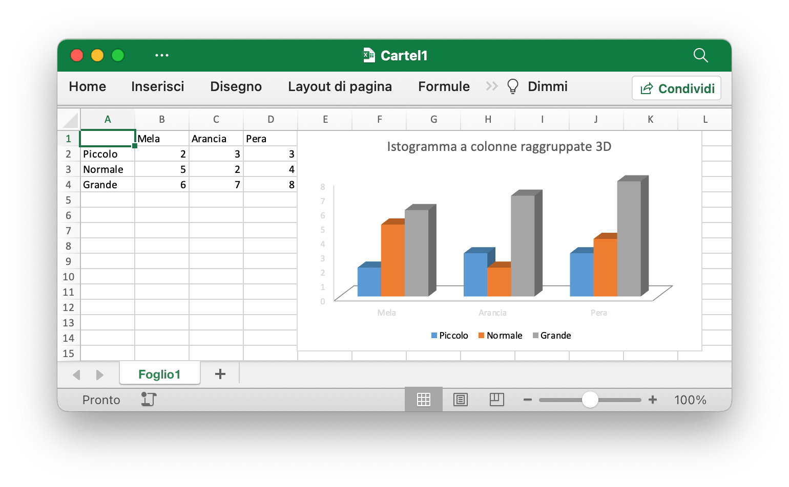

# Utilizzo di base

## Installazione {#install}

La tabella seguente mostra i requisiti minimi del linguaggio Go con ciascuna versione rilasciata di Excelize:

Versione Excel | Requisiti minimi della versione in lingua Go
---|---
master | 1.23
v2.8.1 ~ v2.9.0 | 1.18
v2.7.0 ~ v2.8.0 | 1.16
v2.4.0 ~ v2.6.1 | 1.15
v2.0.2 ~ v2.3.2 | 1.10
v1.0.0 ~ v2.0.1 | 1.6

Per utilizzare la versione più recente della libreria Excelize è necessario Go versione 1.20 o successiva. Tieni presente che ci sono alcune [modifiche incompatibili](https://github.com/golang/go/issues/61881) in Go 1.21.0, la libreria Excelize non può funzionare normalmente con quella versione, se stai utilizzando Go 1.21.x, esegui l'aggiornamento a Go 1.21.1 e versione successiva.

- Installazione

```bash
go get github.com/xuri/excelize
```

- Se la gestione dei tuoi pacchetti con [Go Modules](https://go.dev/blog/using-go-modules), installarlo con il seguente comando.

```bash
go get github.com/xuri/excelize/v2
```

## Aggiornamento {#update}

- Aggiornamento

```bash
go get -u github.com/xuri/excelize/v2
```

## Crea un documento Excel {#NewFile}

Ecco un esempio minimo di utilizzo che creerà un file di foglio di calcolo:

```go
package main

import (
    "fmt"

    "github.com/xuri/excelize/v2"
)

func main() {
    f := excelize.NewFile()
    defer func() {
        if err := f.Close(); err != nil {
            fmt.Println(err)
        }
    }()
    // Crea un nuovo foglio.
    index, err := f.NewSheet("Foglio2")
    if err != nil {
        fmt.Println(err)
        return
    }
    // Imposta il valore di una cella.
    f.SetCellValue("Foglio2", "A2", "Hello world.")
    if err := f.SetSheetName("Sheet1", "Foglio1"); err != nil {
        fmt.Println(err)
        return
    }
    f.SetCellValue("Foglio1", "B2", 100)
    // Imposta il foglio attivo della cartella di lavoro.
    f.SetActiveSheet(index)
    // Salva il foglio di calcolo seguendo il percorso indicato.
    if err := f.SaveAs("Cartel1.xlsx"); err != nil {
        fmt.Println(err)
    }
}
```

## Lettura di documenti Excel {#read}

Quanto segue costituisce il documento semplice da leggere in un foglio di calcolo:

```go
package main

import (
    "fmt"

    "github.com/xuri/excelize/v2"
)

func main() {
    f, err := excelize.OpenFile("Cartel1.xlsx")
    if err != nil {
        fmt.Println(err)
        return
    }
    defer func() {
        // Chiudi il foglio di calcolo.
        if err := f.Close(); err != nil {
            fmt.Println(err)
        }
    }()
    // Ottieni valore dalla cella in base al nome del foglio di lavoro e al riferimento della cella.
    cell, err := f.GetCellValue("Foglio1", "B2")
    if err != nil {
        fmt.Println(err)
        return
    }
    fmt.Println(cell)
    // Ottieni tutte le righe nel Foglio1.
    rows, err := f.GetRows("Foglio1")
    if err != nil {
        fmt.Println(err)
        return
    }
    for _, row := range rows {
        for _, colCell := range row {
            fmt.Print(colCell, "\t")
        }
        fmt.Println()
    }
}
```

## Aggiungi grafico al documento Excel {#chart}

Con Excelize la generazione e la gestione dei grafici è facile come poche righe di codice. Puoi creare grafici basati sui dati nel tuo foglio di lavoro o generare grafici senza alcun dato nel tuo foglio di lavoro.

<p align="center"></p>

```go
package main

import (
    "fmt"

    "github.com/xuri/excelize/v2"
)

func main() {
    f := excelize.NewFile()
    defer func() {
        if err := f.Close(); err != nil {
            fmt.Println(err)
        }
    }()
    if err := f.SetSheetName("Sheet1", "Foglio1"); err != nil {
        fmt.Println(err)
        return
    }
    for idx, row := range [][]interface{}{
        {nil, "Mela", "Arancia", "Pera"}, {"Piccolo", 2, 3, 3},
        {"Normale", 5, 2, 4}, {"Grande", 6, 7, 8},
    } {
        cell, err := excelize.CoordinatesToCellName(1, idx+1)
        if err != nil {
            fmt.Println(err)
            return
        }
        f.SetSheetRow("Foglio1", cell, &row)
    }
    if err := f.AddChart("Foglio1", "E1", &excelize.Chart{
        Type: excelize.Col3DClustered,
        Series: []excelize.ChartSeries{
            {
                Name:       "Foglio1!$A$2",
                Categories: "Foglio1!$B$1:$D$1",
                Values:     "Foglio1!$B$2:$D$2",
            },
            {
                Name:       "Foglio1!$A$3",
                Categories: "Foglio1!$B$1:$D$1",
                Values:     "Foglio1!$B$3:$D$3",
            },
            {
                Name:       "Foglio1!$A$4",
                Categories: "Foglio1!$B$1:$D$1",
                Values:     "Foglio1!$B$4:$D$4",
            }},
        Title: []excelize.RichTextRun{
            {
                Text: "Istogramma a colonne raggruppate 3D",
            },
        },
    }); err != nil {
        fmt.Println(err)
        return
    }
    // Salva il foglio di calcolo seguendo il percorso indicato.
    if err := f.SaveAs("Cartel1.xlsx"); err != nil {
        fmt.Println(err)
    }
}
```

## Aggiungi un'immagine al documento Excel {#image}

```go
package main

import (
    "fmt"
    _ "image/gif"
    _ "image/jpeg"
    _ "image/png"

    "github.com/xuri/excelize/v2"
)

func main() {
    f, err := excelize.OpenFile("Cartel1.xlsx")
    if err != nil {
        fmt.Println(err)
        return
    }
    defer func() {
        // Chiudi il foglio di calcolo.
        if err := f.Close(); err != nil {
            fmt.Println(err)
        }
    }()
    // Inserisci un'immagine.
    if err := f.AddPicture("Foglio1", "A2", "image.png", nil); err != nil {
        fmt.Println(err)
    }
    // Inserisci un'immagine nel foglio di lavoro con ridimensionamento.
    if err := f.AddPicture("Foglio1", "D2", "image.jpg",
        &excelize.GraphicOptions{ScaleX: 0.5, ScaleY: 0.5}); err != nil {
        fmt.Println(err)
    }
    // Inserire un offset dell'immagine nella cella con supporto per la stampa.
    enable, disable := true, false
    if err := f.AddPicture("Foglio1", "H2", "image.gif",
        &excelize.GraphicOptions{
            PrintObject:     &enable,
            LockAspectRatio: false,
            OffsetX:         15,
            OffsetY:         10,
            Locked:          &disable,
        }); err != nil {
        fmt.Println(err)
    }
    // Salva il foglio di calcolo con il percorso di origine.
    if err = f.Save(); err != nil {
        fmt.Println(err)
    }
}
```
