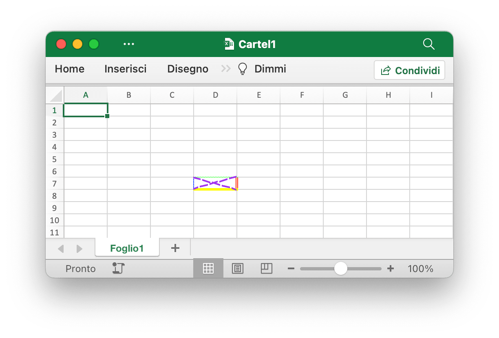
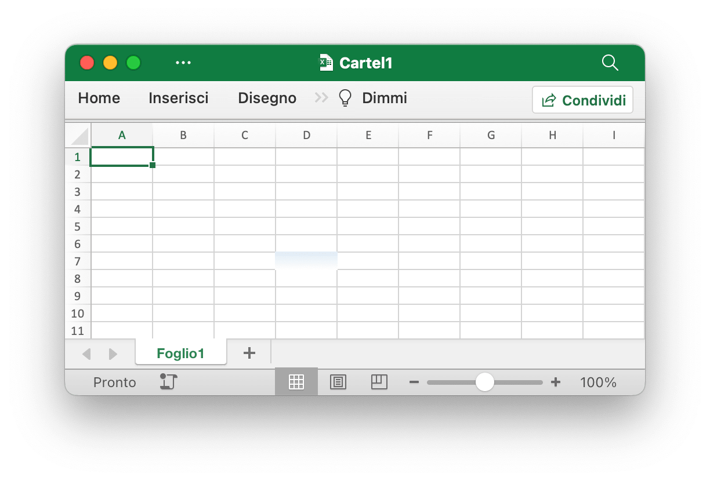
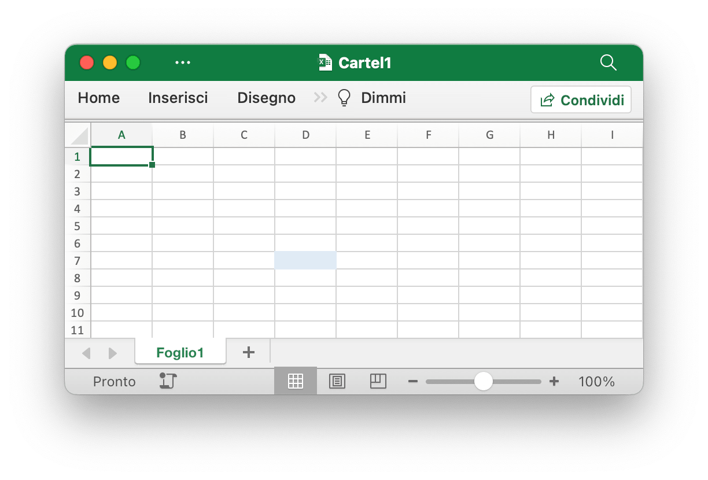
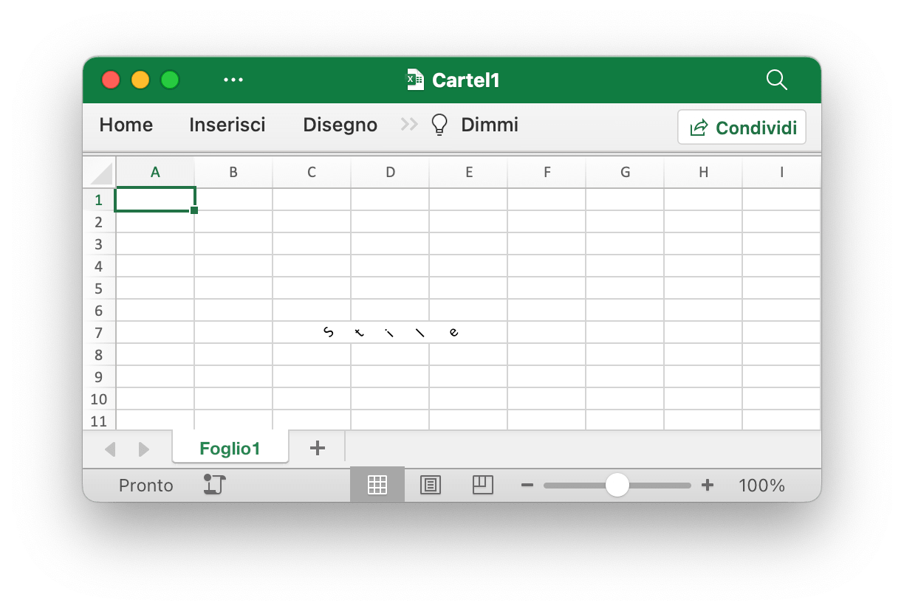
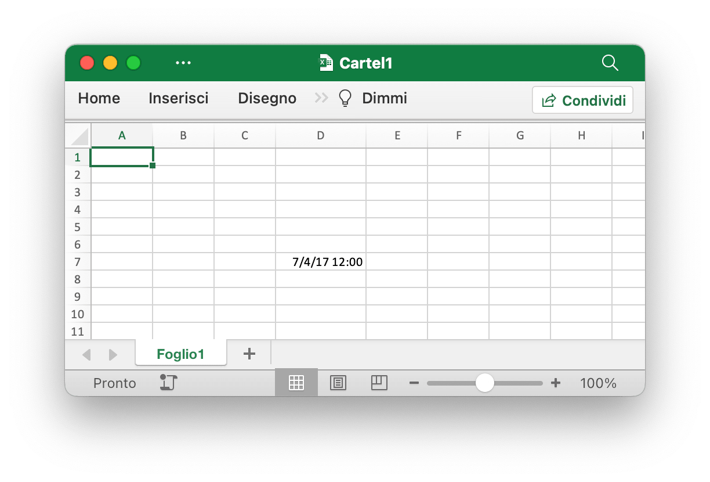
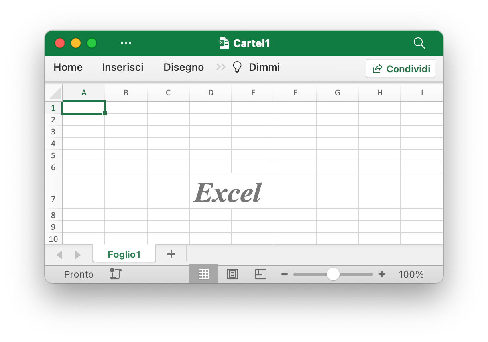
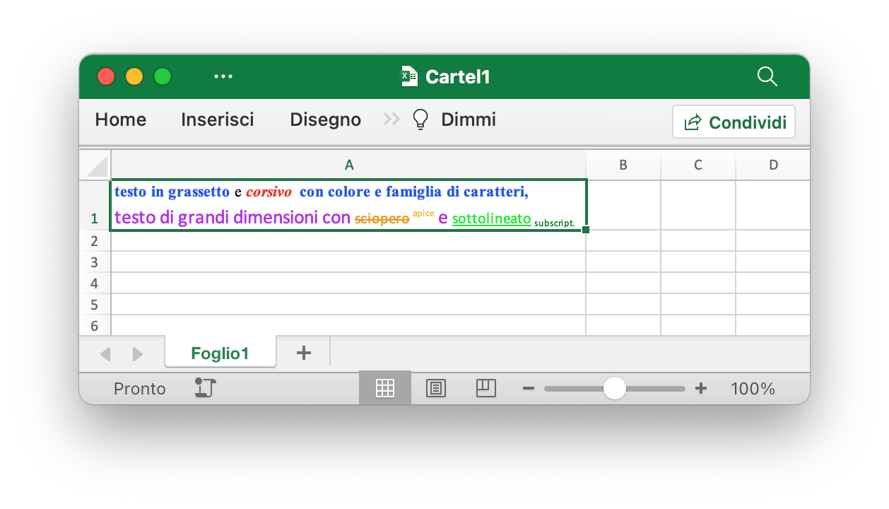
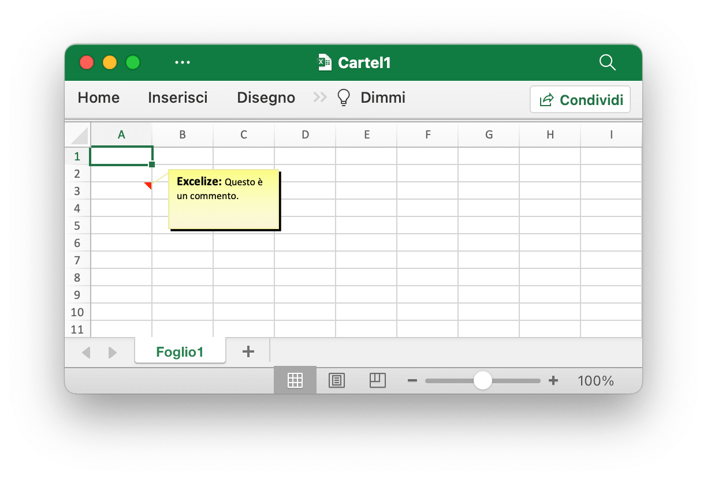

# Cellula

`RichTextRun` mappa direttamente le impostazioni dell'esecuzione rich text.

```go
type RichTextRun struct {
    Font *Font
    Text string
}
```

È possibile passare `HyperlinkOpts` a [`SetCellHyperlink`](cell.md#SetCellHyperlink) per impostare attributi facoltativi del collegamento ipertestuale (ad esempio testo da visualizzare e testo del suggerimento sullo schermo).

```go
type HyperlinkOpts struct {
    Display *string
    Tooltip *string
}
```

È possibile passare `FormulaOpts` a [`SetCellFormula`](cell.md#SetCellFormula) per utilizzare altri tipi di formula.

```go
type FormulaOpts struct {
    Type *string // Tipo di formula
    Ref  *string // Riferimento alla formula condivisa
}
```

## Imposta il valore della cella {#SetCellValue}

```go
func (f *File) SetCellValue(sheet, cell string, value interface{}) error
```

SetCellValue fornisce una funzione per impostare il valore di una cella. Questa funzione è sicura per la concorrenza. Le coordinate specificate non devono trovarsi nella prima riga della tabella, è possibile impostare un numero complesso con una stringa di testo. Di seguito vengono mostrati i tipi di dati supportati:

|Tipi di dati supportati|
|---|
|int|
|int8|
|int16|
|int32|
|int64|
|uint|
|uint8|
|uint16|
|uint32|
|uint64|
|float32|
|float64|
|string|
|[]byte|
|time.Duration|
|time.Time|
|bool|
|nil|

Tieni presente che il formato della data predefinito è `m/d/yy h:mm` del valore di tipo `time.Time`. È possibile impostare il formato dei numeri tramite la funzione [`SetCellStyle`](cell.md#SetCellStyle). Se è necessario impostare una data specializzata in Excel come il 0 gennaio 1900 o il 29 febbraio 1900, questi orari non possono essere rappresentati nel tipo di dati "time.Time" della lingua Go. Imposta il valore della cella come numero 0 o 60, quindi crea e associa lo stile del formato numero data-ora per la cella.

## Imposta il valore booleano {#SetCellBool}

```go
func (f *File) SetCellBool(sheet, cell string, value bool) error
```

SetCellBool fornisce una funzione per impostare il valore del tipo bool di una cella in base al nome del foglio di lavoro, al riferimento di cella e al valore della cella.

## Imposta il valore RAW {#SetCellDefault}

```go
func (f *File) SetCellDefault(sheet, cell, value string) error
```

SetCellDefault fornisce una funzione per impostare il valore del tipo di stringa di una cella come formato predefinito senza eseguire l'escape della cella.

## Imposta il valore intero {#SetCellInt}

```go
func (f *File) SetCellInt(sheet, cell string, value int64) error
```

SetCellInt fornisce una funzione per impostare il valore del tipo `int64` di una cella in base al nome del foglio di lavoro, al riferimento di cella e al valore della cella specificati.

## Imposta il valore intero senza segno {#SetCellUint}

```go
func (f *File) SetCellUint(sheet, cell string, value uint64) error
```

SetCellUint fornisce una funzione per impostare il valore del tipo di dati intero senza segno di una cella in base al nome del foglio di lavoro, al riferimento di cella e al valore della cella specificati.

## Imposta il valore in virgola mobile {#SetCellFloat}

```go
func (f *File) SetCellFloat(sheet, cell string, value float64, precision, bitSize int) error
```

SetCellFloat imposta un valore in virgola mobile in una cella. Il parametro `precision` specifica quante cifre decimali verranno visualizzate mentre `-1` è un valore speciale che utilizzerà tutte le cifre decimali necessarie per rappresentare il numero. `bitSize` è `32` o `64` a seconda che per il valore sia stato originariamente utilizzato `float32` o `float64`.

## Imposta il valore della stringa {#SetCellStr}

```go
func (f *File) SetCellStr(sheet, cell, value string) error
```

SetCellStr fornisce una funzione per impostare il valore del tipo di stringa di una cella. Il numero totale di caratteri che una cella può contenere `32767` caratteri.

## Imposta lo stile della cella {#SetCellStyle}

```go
func (f *File) SetCellStyle(sheet, topLeftCell, bottomRightCell string, styleID int) error
```

SetCellStyle fornisce una funzione per aggiungere attributi di stile per le celle in base al nome del foglio di lavoro, al riferimento all'intervallo e all'ID di stile. Questa funzione è sicura per la concorrenza. Gli indici di stile possono essere ottenuti con la funzione [`NewStyle`](style.md#NewStyle). Tieni presente che i bordi di tipo `diagonalDown` e `diagonalUp` devono utilizzare lo stesso colore nello stesso intervallo. SetCellStyle sovrascriverà gli stili esistenti per la cella, non aggiungerà o unirà lo stile con gli stili esistenti.

- Esempio 1, crea i bordi della cella `D7` su `Foglio1`:

```go
style, err := f.NewStyle(&excelize.Style{
    Border: []excelize.Border{
        {Type: "left", Color: "0000FF", Style: 3},
        {Type: "top", Color: "00FF00", Style: 4},
        {Type: "bottom", Color: "FFFF00", Style: 5},
        {Type: "right", Color: "FF0000", Style: 6},
        {Type: "diagonalDown", Color: "A020F0", Style: 8},
        {Type: "diagonalUp", Color: "A020F0", Style: 8},
    },
})
if err != nil {
    fmt.Println(err)
}
err = f.SetCellStyle("Foglio1", "D7", "D7", style)
```

<p align="center"></p>

I quattro bordi della cella `D7` sono impostati con stili e colori diversi. Questo è legato ai parametri quando si chiama la funzione [`NewStyle`](style.md#NewStyle). È necessario impostare stili diversi per fare riferimento alla documentazione di quel capitolo.

- Esempio 2, impostazione dello stile del gradiente per la cella del foglio di lavoro `D7` denominata `Foglio1`:

```go
style, err := f.NewStyle(&excelize.Style{
    Fill: excelize.Fill{Type: "gradient", Color: []string{"FFFFFF", "E0EBF5"}, Shading: 1},
})
if err != nil {
    fmt.Println(err)
}
err = f.SetCellStyle("Foglio1", "D7", "D7", style)
```

<p align="center"></p>

La cella `D7` è impostata con il colore di riempimento dell'effetto sfumato. L'effetto di riempimento sfumato è correlato al parametro quando viene chiamata la funzione [`NewStyle`](style.md#NewStyle). È necessario impostare stili diversi per fare riferimento alla documentazione di questo capitolo.

- Esempio 3, imposta un riempimento solido per la cella `D7` denominata `Foglio1`:

```go
style, err := f.NewStyle(&excelize.Style{
    Fill: excelize.Fill{Type: "pattern", Color: []string{"E0EBF5"}, Pattern: 1},
})
if err != nil {
    fmt.Println(err)
}
err = f.SetCellStyle("Foglio1", "D7", "D7", style)
```

<p align="center"></p>

La cella `D7` è impostata con un riempimento solido.

- Esempio 4, imposta la spaziatura dei caratteri e l'angolo di rotazione per la cella `D7` denominata `Foglio1`:

```go
f.SetCellValue("Foglio1", "D7", "Stile")
style, err := f.NewStyle(&excelize.Style{
    Alignment: &excelize.Alignment{
        Horizontal:      "center",
        Indent:          1,
        JustifyLastLine: true,
        ReadingOrder:    0,
        RelativeIndent:  1,
        ShrinkToFit:     true,
        TextRotation:    45,
        Vertical:        "",
        WrapText:        true,
    },
})
if err != nil {
    fmt.Println(err)
}
err = f.SetCellStyle("Foglio1", "D7", "D7", style)
```

<p align="center"></p>

- Esempio 5, la data e l'ora in Excel sono rappresentate da numeri reali, ad esempio `2017/7/4 12:00:00 PM` può essere rappresentato dal numero `42920.5`. Imposta il formato dell'ora per la cella del foglio di lavoro `D7` denominata `Foglio1`:

```go
f.SetCellValue("Foglio1", "D7", 42920.5)
f.SetColWidth("Foglio1", "D", "D", 13)
style, err := f.NewStyle(&excelize.Style{NumFmt: 22})
if err != nil {
    fmt.Println(err)
}
err = f.SetCellStyle("Foglio1", "D7", "D7", style)
```

<p align="center"></p>

La cella `D7` è impostata sul formato ora. Tieni presente che quando la larghezza della cella con il formato dell'ora applicato è troppo stretta per essere visualizzata completamente, verrà visualizzata come `####`, puoi trascinare e rilasciare la larghezza della colonna o impostare la colonna sulla dimensione appropriata chiamando il comando Funzione `SetColWidth` per renderla visualizzazione normale.

- Esempio 6, impostazione del carattere, della dimensione del carattere, del colore e dello stile di inclinazione per la cella del foglio di lavoro `D7` denominata `Foglio1`:

```go
f.SetCellValue("Foglio1", "D7", "Excel")
style, err := f.NewStyle(&excelize.Style{
    Font: &excelize.Font{
        Bold:   true,
        Italic: true,
        Family: "Times New Roman",
        Size:   36,
        Color:  "777777",
    },
})
if err != nil {
    fmt.Println(err)
}
err = f.SetCellStyle("Foglio1", "D7", "D7", style)
```

<p align="center"></p>

- Esempio 7, bloccare e nascondere la cella del foglio di lavoro `D7` denominata `Foglio1`:

```go
style, err := f.NewStyle(&excelize.Style{
    Protection: &excelize.Protection{
        Hidden: true,
        Locked: true,
    },
})
if err != nil {
    fmt.Println(err)
}
err = f.SetCellStyle("Foglio1", "D7", "D7", style)
```

Per bloccare una cella o nascondere una formula, proteggere il foglio di lavoro. Nella scheda "Revisione", fai clic su "Proteggi foglio di lavoro".

## Imposta collegamento ipertestuale {#SetCellHyperLink}

```go
func (f *File) SetCellHyperLink(sheet, cell, link, linkType string, opts ...HyperlinkOpts) error
```

SetCellHyperLink fornisce una funzione per impostare i collegamenti ipertestuali delle celle in base al nome del foglio di lavoro e all'indirizzo URL del collegamento. LinkType definisce due tipi di collegamenti ipertestuali `External` per il sito Web o `Location` per spostarsi in una delle celle di questa cartella di lavoro. Il limite massimo di collegamenti ipertestuali in un foglio di lavoro è `65530`. Questa funzione viene utilizzata solo per impostare il collegamento ipertestuale della cella e non influisce sul valore della cella. Se è necessario impostare il valore della cella, utilizzare le altre funzioni come [`SetCellStyle`](cell.md#SetCellStyle) o [`SetSheetRow`](sheet.md#SetSheetRow). Di seguito è riportato un esempio di collegamento esterno.

- Esempio 1, aggiunta di un collegamento esterno alla cella `A3` del foglio di lavoro denominato `Foglio1`:

```go
display, tooltip := "https://github.com/xuri/excelize", "Excelize su GitHub"
if err := f.SetCellHyperLink("Foglio1", "A3",
    "https://github.com/xuri/excelize", "External", excelize.HyperlinkOpts{
        Display: &display,
        Tooltip: &tooltip,
    }); err != nil {
    fmt.Println(err)
}
// Imposta il carattere e lo stile di sottolineatura per la cella
style, err := f.NewStyle(&excelize.Style{
    Font: &excelize.Font{Color: "1265BE", Underline: "single"},
})
if err != nil {
    fmt.Println(err)
}
err = f.SetCellStyle("Foglio1", "A3", "A3", style)
```

- Esempio 2, aggiunta di un collegamento di posizione interno alla cella `A3` denominata `Foglio1`:

```go
err := f.SetCellHyperLink("Foglio1", "A3", "Sheet1!A40", "Location")
```

## Imposta il testo ricco di celle {#SetCellRichText}

```go
func (f *File) SetCellRichText(sheet, cell string, runs []RichTextRun) error
```

SetCellRichText fornisce una funzione per impostare una cella con testo RTF in un determinato foglio di lavoro.

Ad esempio, imposta il testo RTF sulla cella `A1` del foglio di lavoro denominato `Foglio1`:

<p align="center"></p>

```go
package main

import (
    "fmt"

    "github.com/xuri/excelize/v2"
)

func main() {
    f := excelize.NewFile()
    defer func() {
        if err := f.Close(); err != nil {
            fmt.Println(err)
        }
    }()
    if err := f.SetSheetName("Sheet1", "Foglio1"); err != nil {
        fmt.Println(err)
        return
    }
    if err := f.SetRowHeight("Foglio1", 1, 35); err != nil {
        fmt.Println(err)
        return
    }
    if err := f.SetColWidth("Foglio1", "A", "A", 56); err != nil {
        fmt.Println(err)
        return
    }
    if err := f.SetCellRichText("Foglio1", "A1", []excelize.RichTextRun{
        {
            Text: "testo in grassetto",
            Font: &excelize.Font{
                Bold:   true,
                Color:  "2354E8",
                Family: "Times New Roman",
            },
        },
        {
            Text: " e ",
            Font: &excelize.Font{
                Family: "Times New Roman",
            },
        },
        {
            Text: "corsivo ",
            Font: &excelize.Font{
                Bold:   true,
                Color:  "E83723",
                Italic: true,
                Family: "Times New Roman",
            },
        },
        {
            Text: "con colore e famiglia di caratteri,",
            Font: &excelize.Font{
                Bold:   true,
                Color:  "2354E8",
                Family: "Times New Roman",
            },
        },
        {
            Text: "\r\ntesto di grandi dimensioni con ",
            Font: &excelize.Font{
                Size:  14,
                Color: "AD23E8",
            },
        },
        {
            Text: "sciopero",
            Font: &excelize.Font{
                Color:  "E89923",
                Strike: true,
            },
        },
        {
            Text: " apice",
            Font: &excelize.Font{
                Color:     "DBC21F",
                VertAlign: "superscript",
            },
        },
        {
            Text: " e ",
            Font: &excelize.Font{
                Size:      14,
                Color:     "AD23E8",
                VertAlign: "baseline",
            },
        },
        {
            Text: "sottolineato",
            Font: &excelize.Font{
                Color:     "23E833",
                Underline: "single",
            },
        },
        {
            Text: " subscript.",
            Font: &excelize.Font{
                Color:     "017505",
                VertAlign: "subscript",
            },
        },
    }); err != nil {
        fmt.Println(err)
        return
    }
    style, err := f.NewStyle(&excelize.Style{
        Alignment: &excelize.Alignment{
            WrapText: true,
        },
    })
    if err != nil {
        fmt.Println(err)
        return
    }
    if err := f.SetCellStyle("Foglio1", "A1", "A1", style); err != nil {
        fmt.Println(err)
        return
    }
    if err := f.SaveAs("Cartel1.xlsx"); err != nil {
        fmt.Println(err)
    }
}
```

## Ottieni testo ricco di celle {#GetCellRichText}

```go
func (f *File) GetCellRichText(sheet, cell string) ([]RichTextRun, error)
```

GetCellRichText fornisce una funzione per ottenere il rich text delle celle da un determinato foglio di lavoro.

## Ottieni il valore della cella {#GetCellValue}

```go
func (f *File) GetCellValue(sheet, cell string, opts ...Options) (string, error)
```

GetCellValue fornisce una funzione per ottenere un valore formattato dalla cella in base al nome del foglio di lavoro e al riferimento alla cella nel foglio di calcolo. Il valore restituito viene convertito nel tipo `string`. Questa funzione è sicura per la concorrenza. Se il formato cella può essere applicato al valore di una cella, verrà restituito il valore applicato, altrimenti verrà restituito il valore originale. I valori di tutte le celle saranno gli stessi in un intervallo unito.

## Ottieni il tipo di cella {#GetCellType}

```go
func (f *File) GetCellType(sheet, cell string) (CellType, error)
```

GetCellType fornisce una funzione per ottenere il tipo di dati della cella in base al nome del foglio di lavoro e al riferimento alla cella nel file del foglio di calcolo.

## Ottieni tutto il valore della cella in base alle colonne {#GetCols}

```go
func (f *File) GetCols(sheet string, opts ...Options) ([][]string, error)
```

GetCols ottiene il valore di tutte le celle per colonne nel foglio di lavoro in base al nome del foglio di lavoro specificato, restituito come array bidimensionale, dove il valore della cella viene convertito nel tipo `string`. Se il formato della cella può essere applicato al valore della cella, verrà utilizzato il valore applicato, altrimenti verrà utilizzato il valore originale.

Ad esempio, ottieni e attraversa il valore di tutte le celle per colonne su un foglio di lavoro denominato `Foglio1`:

```go
cols, err := f.GetCols("Foglio1")
if err != nil {
    fmt.Println(err)
    return
}
for _, col := range cols {
    for _, rowCell := range col {
        fmt.Print(rowCell, "\t")
    }
    fmt.Println()
}
```

## Ottieni tutto il valore della cella per righe {#GetRows}

```go
func (f *File) GetRows(sheet string, opts ...Options) ([][]string, error)
```

GetRows restituisce tutte le righe in un foglio in base al nome del foglio di lavoro specificato, restituito come array bidimensionale, in cui il valore della cella viene convertito nel tipo `string`. Se il formato della cella può essere applicato al valore della cella, verrà utilizzato il valore applicato, altrimenti verrà utilizzato il valore originale. GetRows ha recuperato le righe con celle di valore o formula, le celle continuamente vuote nella coda di ciascuna riga verranno ignorate, quindi la lunghezza di ciascuna riga potrebbe essere incoerente.

Ad esempio, ottieni e attraversa il valore di tutte le celle per righe su un foglio di lavoro denominato `Foglio1`:

```go
rows, err := f.GetRows("Foglio1")
if err != nil {
    fmt.Println(err)
    return
}
for _, row := range rows {
    for _, colCell := range row {
        fmt.Print(colCell, "\t")
    }
    fmt.Println()
}
```

## Ottieni il collegamento ipertestuale {#GetCellHyperLink}

```go
func (f *File) GetCellHyperLink(sheet, cell string) (bool, string, error)
```

GetCellHyperLink ottiene un collegamento ipertestuale di cella in base al nome del foglio di lavoro e al riferimento di cella specificati. Se la cella ha un collegamento ipertestuale, restituirà `true` e l'indirizzo del collegamento, altrimenti restituirà `false` e un indirizzo del collegamento vuoto.

Ad esempio, ottieni un collegamento ipertestuale a una cella `H6` su un foglio di lavoro denominato `Foglio1`:

```go
link, target, err := f.GetCellHyperLink("Foglio1", "H6")
```

## Ottieni l'indice di stile {#GetCellStyle}

```go
func (f *File) GetCellStyle(sheet, cell string) (int, error)
```

L'indice dello stile della cella si ottiene dal nome del foglio di lavoro e dal riferimento della cella specificati e l'indice ottenuto può essere utilizzato come parametro per chiamare la funzione `SetCellStyle` durante la copia dello stile della cella.

## Unire le celle {#MergeCell}

```go
func (f *File) MergeCell(sheet, topLeftCell, bottomRightCell string) error
```

MergeCell fornisce una funzione per unire le celle in base al riferimento all'intervallo e al nome del foglio specificati. L'unione delle celle mantiene solo il valore della cella in alto a sinistra e scarta gli altri valori. Ad esempio, unisci le celle nell'area `D3:E9` su un foglio di lavoro denominato `Foglio1`:

```go
err := f.MergeCell("Foglio1", "D3", "E9")
```

Se crei una cella unita che si sovrappone a un'altra cella unita esistente, le celle unite già esistenti verranno rimosse.

## Separa le celle {#UnmergeCell}

```go
func (f *File) UnmergeCell(sheet, topLeftCell, bottomRightCell string) error
```

UnmergeCell fornisce una funzione per separare un dato intervallo di riferimento. Ad esempio, separa l'area `D3:E9` dal `Foglio1`:

```go
err := f.UnmergeCell("Sheet1", "D3", "E9")
```

Attenzione: anche le aree sovrapposte verranno separate.

## Ottieni unisci celle {#GetMergeCells}

GetMergeCells fornisce una funzione per ottenere tutte le celle unite da un foglio di lavoro specifico.

```go
func (f *File) GetMergeCells(sheet string) ([]MergeCell, error)
```

### Ottieni il valore della cella unita

```go
func (m *MergeCell) GetCellValue() string
```

GetCellValue restituisce il valore della cella unita.

### Ottieni il riferimento della cella in alto a sinistra dell'intervallo unito

```go
func (m *MergeCell) GetStartAxis() string
```

GetStartAxis restituisce il riferimento di cella in alto a sinistra dell'intervallo unito, ad esempio: `C2`.

### Ottieni il riferimento della cella in basso a destra dell'intervallo unito

```go
func (m *MergeCell) GetEndAxis() string
```

GetEndAxis restituisce il riferimento di cella in basso a destra dell'intervallo unito, ad esempio: `D4`.

## Ottieni celle di immagini {#GetPictureCells}

```go
func (f *File) GetPictureCells(sheet string) ([]string, error)
```

GetPictureCells restituisce tutti i riferimenti alle celle dell'immagine in un foglio di lavoro con un nome di foglio di lavoro specifico.

## Aggiungi un commento {#AddComment}

```go
func (f *File) AddComment(sheet string, comment Comment) error
```

AddComment fornisce il metodo per aggiungere commenti in un foglio in base all'indice del foglio di lavoro, alla cella e al formato impostato (come autore e testo). Tieni presente che la lunghezza massima dell'autore è 255 e la lunghezza massima del testo è 32512. Ad esempio, aggiungi un commento in `Foglio1!$A$3`:

<p align="center"></p>

```go
err := f.AddComment("Foglio1", excelize.Comment{
    Cell:   "A3",
    Author: "Excelize",
    Paragraph: []excelize.RichTextRun{
        {Text: "Excelize: ", Font: &excelize.Font{Bold: true}},
        {Text: "Questo è un commento."},
    },
})
```

## Ottieni commento {#GetComments}

```go
func (f *File) GetComments(sheet string) ([]Comment, error)
```

GetComments recupera tutti i commenti in un foglio di lavoro in base al nome del foglio di lavoro specificato.

## Elimina commento {#DeleteComment}

```go
func (f *File) DeleteComment(sheet, cell string) error
```

EliminaComment fornisce il metodo per eliminare il commento in un foglio in base al nome del foglio di lavoro specificato. Ad esempio, elimina il commento in `Foglio1!$A$30`:

```go
err := f.DeleteComment("Foglio1", "A30")
```

## Aggiungi errori ignorati {#AddIgnoredErrors}

```go
func (f *File) AddIgnoredErrors(sheet, rangeRef string, ignoredErrorsType IgnoredErrorsType) error
```

AddIgnoredErrors fornisce il metodo per ignorare l'errore per un intervallo di celle. Ad esempio: ignora l'errore "numero memorizzato come testo" su `Foglio1` per l'intervallo di celle `D15 C18:D19`:

```go
err := f.AddIgnoredErrors("Foglio1", "D15 C18:D19", excelize.IgnoredErrorsNumberStoredAsText)
```

## Imposta la formula della cella {#SetCellFormula}

```go
func (f *File) SetCellFormula(sheet, cell, formula string, opts ...FormulaOpts) error
```

SetCellFormula fornisce una funzione per impostare la formula sulla cella in base al nome del foglio di lavoro specificato e alle impostazioni della formula della cella. Il risultato della cella della formula può essere calcolato quando il foglio di lavoro viene aperto dall'applicazione Office Excel oppure è possibile utilizzare la funzione [CalcCellValue](cell.md#CalcCellValue) per ottenere anche il valore della cella calcolata. Se l'applicazione Excel non calcola automaticamente la formula quando la cartella di lavoro è stata aperta, chiamare [UpdateLinkedValue](utils.md#UpdateLinkedValue) dopo aver impostato le funzioni della formula della cella.

- Esempio 1, imposta la formula normale `=SUM(A1,B1)` per la cella `A3` su `Foglio1`:

```go
err := f.SetCellFormula("Foglio1", "A3", "SUM(A1,B1)")
```

- Esempio 2, imposta la formula `1;2;3` per un array costante verticale unidimensionale (array di colonne) per la cella `A3` su `Foglio1`:

```go
err := f.SetCellFormula("Foglio1", "A3", "{1;2;3}")
```

- Esempio 3, imposta la formula `"a","b","c"` di un array costante orizzontale unidimensionale (array di righe) per la cella `A3` su `Foglio1`:

```go
err := f.SetCellFormula("Foglio1", "A3", "{\"a\",\"b\",\"c\"}")
```

- Esempio 4, imposta la formula di matrice costante bidimensionale `{1,2;"a","b"}` per la cella `A3` su `Foglio1`:

```go
formulaType, ref := excelize.STCellFormulaTypeArray, "A3:A3"
err := f.SetCellFormula("Foglio1", "A3", "{1,2;\"a\",\"b\"}",
    excelize.FormulaOpts{Ref: &ref, Type: &formulaType})
```

- Esempio 5, imposta la formula matriciale dell'intervallo `A1:A2` per la cella `A3` su `Foglio1`:

```go
formulaType, ref := excelize.STCellFormulaTypeArray, "A3:A3"
err := f.SetCellFormula("Foglio1", "A3", "A1:A2",
    excelize.FormulaOpts{Ref: &ref, Type: &formulaType})
```

- Esempio 6, imposta la formula condivisa `=A1+B1` per le celle `C1:C5` su `Foglio1`, `C1` è la cella principale:

```go
formulaType, ref := excelize.STCellFormulaTypeShared, "C1:C5"
err := f.SetCellFormula("Foglio1", "C1", "A1+B1",
    excelize.FormulaOpts{Ref: &ref, Type: &formulaType})
```

- Esempio 7, imposta la formula della tabella `=SUM(Table1[[A]:[B]])` per la cella `C2` su `Foglio1`:

```go
package main

import (
    "fmt"

    "github.com/xuri/excelize/v2"
)

func main() {
    f := excelize.NewFile()
    defer func() {
        if err := f.Close(); err != nil {
            fmt.Println(err)
        }
    }()
    if err := f.SetSheetName("Sheet1", "Foglio1"); err != nil {
        fmt.Println(err)
        return
    }
    for idx, row := range [][]interface{}{{"A", "B", "C"}, {1, 2}} {
        if err := f.SetSheetRow("Foglio1", fmt.Sprintf("A%d", idx+1), &row); err != nil {
            fmt.Println(err)
            return
        }
    }
    if err := f.AddTable("Foglio1",
        &excelize.Table{
            Range:     "A1:C2",
            Name:      "Table1",
            StyleName: "TableStyleMedium2",
        }); err != nil {
        fmt.Println(err)
        return
    }
    formulaType := excelize.STCellFormulaTypeDataTable
    if err := f.SetCellFormula("Foglio1", "C2", "SUM(Table1[[A]:[B]])",
        excelize.FormulaOpts{Type: &formulaType}); err != nil {
        fmt.Println(err)
        return
    }
    if err := f.SaveAs("Cartel1.xlsx"); err != nil {
        fmt.Println(err)
    }
}
```

## Ottieni la formula cellulare {#GetCellFormula}

```go
func (f *File) GetCellFormula(sheet, cell string) (string, error)
```

GetCellFormula fornisce una funzione per ottenere la formula dalla cella in base al nome del foglio di lavoro e al riferimento alla cella nel foglio di calcolo.

## Calcola il valore della cella {#CalcCellValue}

```go
func (f *File) CalcCellValue(sheet, cell string, opts ...Options) (string, error)
```

CalcCellValue fornisce una funzione per ottenere il valore della cella calcolato. Questa funzionalità è attualmente in fase di elaborazione. Il calcolo iterativo, l'intersezione implicita, l'intersezione esplicita, la formula di matrice, la formula di tabella e alcune altre formule non sono attualmente supportate.

Formule supportate:

Nome della funzione | Descrizione
---|---
ASS                         | Restituisce il valore assoluto di un numero
INT.MATURATO.PER            | Restituisce l'interesse maturato di un titolo che paga interessi periodici
INT.MATURATO.SCAD           | Restituisce l'interesse maturato di un titolo che paga interessi alla scadenza
ARCCOS                      | Restituisce l'arcocoseno di un numero
ARCCOSH                     | Restituisce l'inversa del coseno iperbolico di un numero
ARCCOT                      | Restituisce il valore principale dell'arcotangente, o cotangente inversa, di un numero
ARCCOTH                     | Restituisce l'inversa della cotangente iperbolica di un numero
AGGREGA                     | Restituisce un aggregato in un elenco o database
INDIRIZZO                   | Restituisce un riferimento come testo in una singola cella di un foglio di lavoro
AMMORT.DEGR                 | Restituisce l'ammortamento per ogni periodo contabile utilizzando un coefficiente di ammortamento
AMMORT.PER                  | Restituisce l'ammortamento per ogni periodo contabile
E                           | Restituisce VERO se tutti gli argomenti hanno valore VERO
ARABO                       | Converte un numero romano in numero arabo
MATRICE.A.TESTO             | Restituisce una matrice di valori di testo da qualsiasi intervallo specificato
ARCSEN                      | Restituisce l'arcoseno di un numero
ARCSENH                     | Restituisce l'inversa del seno iperbolico di un numero
ARCTAN                      | Restituisce l'arcotangente di un numero
ARCTAN.2                    | Restituisce l'arcotangente delle coordinate x e y
ARCTANH                     | Restituisce l'inversa della tangente iperbolica di un numero
MEDIA.DEV                   | Restituisce la media delle deviazioni assolute dei valori rispetto alla loro media
MEDIA                       | Restituisce la media degli argomenti
MEDIA.VALORI                | Restituisce la media degli argomenti, inclusi i numeri, il testo e i valori logici
MEDIA.SE                    | Restituisce la media aritmetica di tutte le celle di un intervallo che soddisfano un criterio specificato
MEDIA.PIÙ.SE                | Restituisce la media aritmetica di tutte le celle che soddisfano più criteri
BASE                        | Converte un numero in una rappresentazione in formato testo con la radice data (base)
BESSEL.I                    | Restituisce la funzione di Bessel modificata In(x)
BESSEL.J                    | Restituisce la funzione di Bessel Jn(x)
BESSEL.K                    | Restituisce la funzione di Bessel modificata Kn(x)
BESSEL.Y                    | Restituisce la funzione di Bessel Yn(x)
DISTRIB.BETA                | Restituisce la funzione di distribuzione cumulativa beta
DISTRIB.BETA.N              | Restituisce la funzione di distribuzione cumulativa beta
INV.BETA                    | Restituisce l'inversa della funzione distribuzione cumulativa per una distribuzione beta specificata
INV.BETA.N                  | Restituisce l'inversa della funzione distribuzione cumulativa per una distribuzione beta specificata
BINARIO.DECIMALE            | Converte un numero binario in decimale
BINARIO.HEX                 | Converte un numero binario in esadecimale
BINARIO.OCT                 | Converte un numero binario in ottale
DISTRIB.BINOM               | Restituisce la distribuzione binomiale per il termine individuale
DISTRIB.BINOM.N             | Restituisce la distribuzione binomiale per il termine individuale
INTERVALLO.DISTRIB.BINOM.N. | Restituisce la probabilità del risultato di una prova usando la distribuzione binomiale
INV.BINOM                   | Restituisce il valore più piccolo per il quale la distribuzione cumulativa binomiale risulta maggiore o uguale ad un valore di criterio
BITAND                      | Restituisce un confronto "AND" bit per bit di due numeri
BIT.SPOSTA.SX               | Restituisce un numero spostato a sinistra del numero di bit specificato
BITOR                       | Restituisce un confronto "OR" bit per bit di due numeri.
BIT.SPOSTA.DX               | Restituisce un numero spostato a destra del numero di bit specificato
BITXOR                      | Restituisce uno 'XOR' bit per bit di due numeri
ARROTONDA.ECCESSO           | Arrotonda un numero per eccesso all'intero più vicino o al multiplo più vicino a peso
ARROTONDA.ECCESSO.MAT       | Arrotonda un numero per eccesso all'intero più vicino o al multiplo più vicino a peso
ARROTONDA.ECCESSO.PRECISA   | Restituisce un numero arrotondato per eccesso all'intero più vicino o al multiplo più vicino a peso
CODICE.CARATT               | Restituisce il carattere specificato dal numero di codice
DISTRIB.CHI                 | Restituisce la probabilità a una coda per la distribuzione del chi quadrato
INV.CHI                     | Restituisce l'inversa della distribuzione a una coda del chi quadrato
TEST.CHI                    | Restituisce il test per l'indipendenza
DISTCHIQUAD                 | Restituisce la distribuzione del chi quadrato
DISTRIB.CHIQUAD.DS          | Restituisce la probabilità a una coda per la distribuzione del chi quadrato
INV.CHI.QUAD                | Restituisce l'inversa della distribuzione a una coda sinistra del chi quadrato
INV.CHIQUAD.DS              | Restituisce l'inversa della distribuzione a una coda destra del chi quadrato
TEST.CHIQUAD                | Restituisce il test per l'indipendenza
SCEGLI                      | Sceglie un valore da un elenco di valori
LIBERA                      | Rimuove dal testo tutti i caratteri che non possono essere stampati
CODICE                      | Restituisce un codice numerico per il primo carattere di una stringa di testo
RIF.COLONNA                 | Restituisce il numero di colonna di un riferimento
COLONNE                     | Restituisce il numero di colonna di un riferimento
COMBINAZIONE                | Restituisce il numero delle combinazioni per un numero assegnato di oggetti
COMBINAZIONE.VALORI         | Restituisce il numero delle combinazioni (con ripetizioni) per un numero assegnato di elementi
COMPLESSO                   | Converte i coefficienti reali e immaginari in numeri complessi
CONCAT                      | Combina il testo di più intervalli e/o stringhe, ma non fornisce delimitatore o argomenti IgnoraEmpty
CONCATENA                   | Unisce diversi elementi di testo in uno solo
CONFIDENZA                  | Restituisce l'intervallo di confidenza per la popolazione
CONFIDENZA.NORM             | Restituisce l'intervallo di confidenza per la popolazione
T.CONFIDENZA                | Restituisce l'intervallo di confidenza per una media di popolazione utilizzando una distribuzione t di Student
CONVERTI                    | Converte un numero da un sistema di misura in un altro
CORRELAZIONE                | Restituisce il coefficiente di correlazione tra due serie di dati
COS                         | Restituisce il coseno di un numero
COSH                        | Restituisce il coseno iperbolico di un numero
COT                         | Restituisce la COTgente di un angolo espresso in radianti
COTH                        | Restituisce la cotangente iperbolica di un angolo iperbolico
CONTA.NUMERI                | Conta la quantità di numeri nell'elenco di argomenti
CONTA.VALORI                | Conta il numero di valori nell'elenco di argomenti
CONTA.VUOTE                 | Conta il numero di celle vuote all'interno di un intervallo
CONTA.SE                    | Conta il numero di celle in un intervallo che soddisfano i criteri specificati
CONTA.PIÙ.SE                | La funzione CONTA.PIÙ.SE applica criteri alle celle su più intervalli e conta quante volte vengono soddisfatti tutti i criteri
GIORNI.CED.INIZ.LIQ         | Restituisce il numero dei giorni che vanno dall'inizio del periodo di durata della cedola alla data di liquidazione
GIORNI.CED                  | Restituisce il numero dei giorni relativi al periodo della cedola che contiene la data di liquidazione
GIORNI.CED.NUOVA            | Restituisce il numero di giorni che vanno dalla data di liquidazione alla data della cedola successiva
DATA.CED.SUCC               | Restituisce un numero che rappresenta la data della cedola successiva alla data di liquidazione
NUM.CED                     | Restituisce il numero di cedole pagabili fra la data di liquidazione e la data di scadenza
DATA.CED.PREC               | Restituisce un numero che rappresenta la data della cedola precedente alla data di liquidazione
COVARIANZA                  | Calcola la covarianza, la media dei prodotti delle deviazioni accoppiate
COVARIANZA.P                | Calcola la covarianza, la media dei prodotti delle deviazioni accoppiate
COVARIANZA.C                | Restituisce la covarianza del campione, ovvero la media dei prodotti delle deviazioni di ogni coppia di coordinate in due set di dati
CRIT.BINOM                  | Restituisce il valore più piccolo per il quale la distribuzione cumulativa binomiale risulta maggiore o uguale ad un valore di criterio
CSC                         | Restituisce la cosecante di un angolo espresso in radianti
CSCH                        | Restituisce la cosecante iperbolica di un angolo espresso in radianti
INT.CUMUL                   | Restituisce l'interesse cumulativo pagato fra due periodi
CAP.CUM                     | Restituisce il capitale cumulativo pagato per estinguere un debito fra due periodi
DATA                        | Restituisce il numero seriale di una determinata data
DATA.DIFF                   | Calcola il numero di giorni, mesi o anni tra due date
DATA.VALORE                 | Converte una data sotto forma di testo in un numero seriale
DB.MEDIA                    | Restituisce la media di voci del database selezionate
GIORNO                      | Converte un numero seriale in un giorno del mese
GIORNI                      | Restituisce il numero di giorni compresi tra due date
GIORNO360                   | Calcola il numero di giorni compreso tra due date basandosi su un anno di 360 giorni
AMMORT.FISSO                | Restituisce l'ammortamento di un bene per un periodo specificato utilizzando il metodo di ammortamento a quote fisse decrescenti
DB.CONTA.NUMERI             | Conta le celle di un database contenenti numeri
DB.CONTA.VALORI             | Conta le celle non vuote in un database
AMMORT                      | Restituisce l'ammortamento di un bene per un periodo specificato utilizzando il metodo di ammortamento a doppie quote decrescenti o altri metodi specificati
DECIMALE.BINARIO            | Converte un numero decimale in binario
DECIMALE.HEX                | Converte un numero decimale in esadecimale
DECIMALE.OCT                | Converte un numero decimale in ottale
DECIMALE                    | Converte la rappresentazione di un numero in formato testo di una determinata base in un numero decimale
GRADI                       | Converte i radianti in gradi
DELTA                       | Verifica se due valori sono uguali
DEV.Q                       | Restituisce la somma dei quadrati delle deviazioni
DB.VALORI                   | Estrae da un database un singolo record che soddisfa i criteri specificati
TASSO.SCONTO                | Restituisce il tasso di sconto per un titolo
DB.MAX                      | Restituisce il valore massimo dalle voci selezionate in un database
DB.MIN                      | Restituisce il valore minimo dalle voci selezionate in un database
VALUTA                      | Converte un numero in testo usando il formato valuta, con i decimali arrotondati al numero di posizioni specificato
VALUTA.DEC                  | Converte un prezzo valuta, espresso come frazione, in prezzo valuta, espresso come numero decimale
VALUTA.FRAZ                 | Converte un prezzo valuta, espresso come numero decimale, in prezzo valuta, espresso come frazione
DB.PRODOTTO                 | Moltiplica i valori in un determinato campo di record che soddisfano i criteri nel database
DB.DEV.ST                   | Restituisce una stima della deviazione standard sulla base di un campione di voci di un database selezionate
DB.DEV.ST.POP               | Calcola la deviazione standard sulla base dell'intera popolazione delle voci di un database selezionate
DB.SOMMA                    | Aggiunge i numeri nel campo colonna di record del database che soddisfano determinati criteri
DURATA                      | Restituisce la durata annuale di un titolo con i pagamenti di interesse periodico
DB.VAR                      | Restituisce una stima della varianza sulla base di un campione di voci di un database selezionate
DB.VAR.POP                  | Calcola la varianza sulla base di tutte le voci di un database selezionate
DATA.MESE                   | Restituisce il numero seriale della data che rappresenta il numero di mesi indicato prima o dopo la data di inizio
EFFETTIVO                   | Restituisce l'effettivo tasso di interesse annuo
CODIFICA.URL                | Restituisce una stringa con codifica URL, sostituendo alcuni caratteri non alfanumerici con il simbolo percentuale (%) e un numero esadecimale
FINE.MESE                   | Restituisce il numero seriale dell'ultimo giorno del mese, prima o dopo un determinato numero di mesi
FUNZ.ERRORE                 | Restituisce la funzione di errore
FUNZ.ERRORE.PRECISA         | Restituisce la funzione di errore
FUNZ.ERRORE.COMP            | Restituisce la funzione di errore complementare
FUNZ.ERRORE.COMP.PRECISA    | Restituisce la funzione FUNZ.ERRORE complementare integrata tra x e infinito
ERRORE.TIPO                 | Restituisce un numero che corrisponde a un tipo di errore
EUROCONVERT                 | Converte un numero in euro, un valore dal formato euro a un formato in una valuta dei paesi membri dell'Unione Europea, oppure un valore da una delle valute dei paesi dell'Unione Europea in quella di un altro stato utilizzando l'euro come intermediario (triangolazione)
PARI                        | Arrotonda il valore assoluto di un numero per eccesso al più vicino intero pari
IDENTICO                    | Confronta due stringhe di testo e restituisce VERO se le stringhe sono identiche e FALSO in caso contrario
EXP                         | Restituisce il numero e elevato alla potenza di un numero assegnato
DISTRIB.EXP.N               | Restituisce la distribuzione esponenziale
DISTRIB.EXP                 | Restituisce la distribuzione esponenziale
FATTORIALE                  | Restituisce il fattoriale di un numero
FATT.DOPPIO                 | Restituisce il fattoriale doppio di un numero
FALSO                       | Restituisce il valore logico FALSO
DIST.F                      | Restituisce la distribuzione di probabilità F
FDIST                       | Restituisce la distribuzione di probabilità F
DISTRIB.F.DS                | Restituisce la distribuzione di probabilità F
TROVA                       | Rileva un valore di testo all'interno di un altro (con distinzione tra maiuscole e minuscole)
TROVA.B                     | Rileva un valore di testo all'interno di un altro (con distinzione tra maiuscole e minuscole)
F.INV                       | Restituisce l'inversa della distribuzione di probabilità F
INV.F.DS                    | Restituisce l'inversa della distribuzione di probabilità F
INV.F                       | Restituisce l'inversa della distribuzione di probabilità F
FISHER                      | Restituisce la trasformazione di Fisher
INV.FISHER                  | Restituisce l'inversa della trasformazione di Fisher
FISSO                       | Formatta un numero come testo con un numero fisso di decimali
ARROTONDA.DIFETTO           | Arrotonda il valore assoluto di un numero per difetto
ARROTONDA.DIFETTO.MAT       | Arrotonda un numero per difetto all'intero più vicino o al multiplo più vicino a peso
ARROTONDA.DIFETTO.PRECISA   | Restituisce un numero arrotondato per difetto all'intero più vicino o al multiplo più vicino al peso
PREVISIONE                  | Restituisce i valori lungo una tendenza lineare
PREVISIONE.LINEARE          | Restituisce i valori lungo una tendenza lineare
TESTO.FORMULA               | Restituisce una formula sotto forma di stringa
FREQUENZA                   | Restituisce la distribuzione di frequenza come matrice verticale
TESTF                       | Restituisce il risultato di un test F
TEST.F                      | Restituisce il risultato di un test F
VAL.FUT                     | Restituisce il valore futuro di un investimento
VAL.FUT.CAPITALE            | Restituisce il valore futuro di un capitale iniziale dopo aver applicato una serie di tassi di interesse composti
GAMMA                       | Restituisce il valore di funzione GAMMA.
DISTRIB.GAMMA.N             | Restituisce la distribuzione gamma
DISTRIB.GAMMA               | Restituisce la distribuzione gamma
INV.GAMMA.N                 | Restituisce l'inversa della distribuzione cumulativa gamma
INV.GAMMA                   | Restituisce l'inversa della distribuzione cumulativa gamma
LN.GAMMA                    | Restituisce il logaritmo naturale di una funzione gamma, Γ(x)
LN.GAMMA.PRECISA            | Restituisce il logaritmo naturale di una funzione gamma, Γ(x)
GAUSS                       | Calcola la probabilità che un membro di una popolazione normale standard sia compreso tra la deviazione media e la deviazione standard z rispetto alla media
MCD                         | Restituisce il massimo comune divisore
MEDIA.GEOMETRICA            | Restituisce la media geometrica
SOGLIA                      | Verifica se un numero è maggiore del valore di soglia
CRESCITA                    | Restituisce i valori lungo una linea di tendenza esponenziale
MEDIA.ARMONICA              | Restituisce la media armonica
HEX.BINARIO                 | Converte un numero esadecimale in binario
HEX.DECIMALE                | converte un numero esadecimale in decimale
HEX.OCT                     | Converte un numero esadecimale in ottale
CERCA.ORIZZ                 | Effettua una ricerca nella riga superiore di una matrice e restituisce il valore della cella specificata
ORA                         | Converte un numero seriale in un'ora
COLLEG.IPERTESTUALE         | Crea un collegamento a un documento memorizzato su un server di rete, un'Intranet o Internet
DISTRIB.IPERGEOM.N          | Restituisce la distribuzione ipergeometrica
DISTRIB.IPERGEOM            | Restituisce la distribuzione ipergeometrica
SE                          | Specifica un test logico da eseguire
SE.ERRORE                   | Restituisce un valore specificato dall'utente se la formula restituisce un errore. In caso contrario, restituisce il risultato della formula
SE.NON.DISP.                | Restituisce il valore specificato se una formula restituisce il valore di errore #N/D; in caso contrario, restituisce il risultato della formula
PIÙ.SE                      | Controlla se vengono soddisfatte una o più condizioni e restituisce un valore che corrisponde alla prima condizione VERA
COMP.MODULO                 | Restituisce il valore assoluto (modulo) di un numero complesso
COMP.IMMAGINARIO            | Restituisce il coefficiente immaginario di un numero complesso
COMP.ARGOMENTO              | Restituisce l'argomento theta, un angolo espresso in radianti
COMP.CONIUGATO              | Restituisce il complesso coniugato di un numero complesso
COMP.COS                    | Restituisce il coseno di un numero complesso
COMP.COSH                   | Restituisce il coseno iperbolico di un numero complesso in formato testo x+yi o x+yj
COMP.COT                    | Restituisce la cotangente di un numero complesso in formato testo x+yi o x+yj
COMP.CSC                    | Restituisce la cosecante di un numero complesso in formato testo x+yi o x+yj
COMP.CSCH                   | Restituisce la cosecante iperbolica di un numero complesso in formato testo x+yi o x+yj
COMP.DIV                    | Restituisce il quoziente di due numeri complessi
COMP.EXP                    | Restituisce il valore esponenziale di un numero complesso
COMP.LN                     | Restituisce il logaritmo naturale di un numero complesso
COMP.LOG10                  | Restituisce il logaritmo in base 10 di un numero complesso
COMP.LOG2                   | Restituisce il logaritmo in base 2 di un numero complesso
COMP.POTENZA                | Restituisce un numero complesso elevato a una potenza intera
COMP.PRODOTTO               | Restituisce il prodotto di numeri complessi
COMP.PARTE.REALE            | Restituisce il coefficiente reale di un numero complesso
COMP.SEC                    | Restituisce la secante di un numero complesso in formato testo x+yi o x+yj
COMP.SECH                   | Restituisce la secante iperbolica di un numero complesso in formato testo x+yi o x+yj
COMP.SEN                    | Restituisce il seno di un numero complesso
COMP.SENH                   | Restituisce il seno iperbolico di un numero complesso in formato testo x+yi o x+yj
COMP.RADQ                   | Restituisce la radice quadrata di un numero complesso
COMP.DIFF                   | Restituisce la differenza fra due numeri complessi
COMP.SOMMA                  | Restituisce la somma di numeri complessi
COMP.TAN                    | Restituisce la tangente di un numero complesso in formato testo x+yi o x+yj
INDICE                      | Utilizza un indice per scegliere un valore da un riferimento o da una matrice
INDIRETTO                   | Restituisce un riferimento specificato da un valore di testo
INT                         | Arrotonda un numero per difetto all'intero più vicino
INTERCETTA                  | Restituisce l'intercetta della retta di regressione lineare
TASSO.INT                   | Restituisce il tasso di interesse per un titolo interamente investito
INTERESSI                   | Restituisce il valore degli interessi per un investimento relativo a un periodo specifico
TIR.COST                    | Restituisce il tasso di rendimento interno per una serie di flussi di cassa
VAL.VUOTO                   | Val si riferisce a una cella vuota
VAL.ERR                     | Val si riferisce a un qualsiasi valore di errore eccetto #N/D
VAL.ERRORE                  | Val si riferisce a un qualsiasi valore di errore
VAL.PARI                    | Restituisce VERO se num è pari oppure FALSO se num è dispari
VAL.FORMULA                 | Controlla se esiste un riferimento a una cella che contiene una formula e restituisce VERO o FALSO
VAL.LOGICO                  | Val si riferisce a un valore logico
VAL.NON.DISP                | Val si riferisce al valore di errore #N/D (valore non disponibile)
VAL.NON.TESTO               | Val si riferisce a un qualsiasi elemento diverso da testo. Si noti che questa funzione restituirà VERO se val si riferisce a una cella vuota
VAL.NUMERO                  | Val si riferisce a un numero
VAL.DISPARI                 | Restituisce VERO se il numero è dispari
VAL.RIF                     | Val si riferisce a un riferimento
VAL.TESTO                   | Val si riferisce a del testo
ISO.ARROTONDA.ECCESSO       | Restituisce un numero arrotondato per eccesso all'intero più vicino o al multiplo più vicino a peso
NUM.SETTIMANA.ISO           | Restituisce il numero della settimana ISO dell'anno per una data specificata
INTERESSE.RATA              | Calcola l'interesse di un investimento pagato durante un periodo specifico
CURTOSI                     | Restituisce la curtosi di un set di dati
GRANDE                      | Restituisce il k-esimo valore più grande di un set di dati
MCM                         | Restituisce il minimo comune multiplo
SINISTRA                    | Restituisce il carattere più a sinistra di un valore di testo
SINISTRAB                   | Restituisce il carattere più a sinistra di un valore di testo
LUNGHEZZA                   | Restituisce il numero di caratteri di una stringa di testo
LUNGB                       | Restituisce il numero di caratteri di una stringa di testo
LN                          | Restituisce il logaritmo naturale di un numero
LOG                         | Restituisce il logaritmo di un numero in una base specificata
LOG10                       | Restituisce il logaritmo in base 10 di un numero
INV.LOGNORM                 | Restituisce l'inversa di una distribuzione cumulativa lognormale
DISTRIB.LOGNORM.N           | Restituisce la distribuzione lognormale cumulativa
DISTRIB.LOGNORM             | Restituisce la distribuzione lognormale cumulativa
INV.LOGNORM.N               | Restituisce l'inversa di una distribuzione cumulativa lognormale
CERCA                       | Ricerca i valori in un vettore o in una matrice
MINUSC                      | Converte in minuscolo il testo
CONFRONTA                   | Ricerca i valori in un riferimento o in una matrice
MAX                         | Restituisce il valore più grande di un elenco di argomenti
MAX.VALORI                  | Restituisce il valore massimo in un elenco di argomenti, inclusi i numeri, il testo e i valori logici
MAX.PIÙ.SE                  | Restituisce il valore massimo tra le celle specificate da un dato set di condizioni o criteri
MATR.DETERM                 | Restituisce il determinante di una matrice
DURATA.M                    | Restituisce la durata Macauley modificata per un titolo con un valore presunto di €100
MEDIANA                     | Restituisce la mediana dei numeri specificati
STRINGA.ESTRAI              | Restituisce un numero specifico di caratteri di una stringa di testo a partire dalla posizione specificata
MEDIA.B                     | Restituisce un numero specifico di caratteri di una stringa di testo a partire dalla posizione specificata
MIN                         | Restituisce il valore più piccolo di un elenco di argomenti
MIN.PIÙ.SE                  | Restituisce il valore minimo tra le celle specificate da un dato set di condizioni o criteri
MIN.VALORI                  | Restituisce il valore più piccolo in un elenco di argomenti, inclusi i numeri, il testo e i valori logici
MINUTO                      | Restituisce i minuti di un valore ora. I minuti vengono espressi con un numero intero compreso tra 0 e 59
MATR.INVERSA                | Restituisce l'inversa di una matrice
TIR.VAR                     | Restituisce il tasso di rendimento interno in cui i flussi di cassa positivi e negativi sono finanziati a tassi diversi
MATR.PRODOTTO               | Restituisce il prodotto di due matrici
RESTO                       | Restituisce il resto della divisione
MODA                        | Restituisce il valore più comune in un set di dati
MODA.MULT                   | Restituisce una matrice verticale dei valori più ricorrenti in una matrice o intervallo di dati
MODA.SNGL                   | Restituisce il valore più comune in un set di dati
MESE                        | Converte un numero seriale in un mese
ARROTONDA.MULTIPLO          | Restituisce un numero arrotondato al multiplo desiderato
MULTINOMIALE                | Restituisce il polinomio di un insieme di numeri
MATR.UNIT                   | Restituisce la matrice unitaria per la dimensione specificata
NUM                         | Restituisce un valore convertito in numero
NON.DISP                    | Restituisce il valore errore #N/D
DISTRIB.BINOM.NEG.N         | Restituisce la distribuzione binomiale negativa
DISTRIB.BINOM.NEG           | Restituisce la distribuzione binomiale negativa
GIORNI.LAVORATIVI.TOT       | Restituisce il numero di tutti i giorni lavorativi compresi fra due date
GIORNI.LAVORATIVI.TOT.INTL  | Restituisce il numero di tutti i giorni lavorativi compresi fra due date utilizzando parametri per indicare quali e quanti giorni sono giorni festivi
NOMINALE                    | Restituisce il tasso di interesse nominale annuale
DISTRIB.NORM.N              | Restituisce la distribuzione cumulativa normale
DISTRIB.NORM                | Restituisce la distribuzione cumulativa normale
INV.NORM                    | Restituisce l'inversa della distribuzione cumulativa normale
NORM.INV                    | Restituisce l'inversa della distribuzione cumulativa normale
DISTRIB.NORM.ST.N           | Restituisce la distribuzione cumulativa normale standard
DISTRIB.NORM.ST             | Restituisce la distribuzione cumulativa normale standard
INV.NORM.S                  | Restituisce l'inversa della distribuzione normale standard cumulativa
INV.NORM.ST                 | Restituisce l'inversa della distribuzione normale standard cumulativa
NON                         | Inverte la logica dell'argomento
ADESSO                      | Restituisce il numero seriale della data e dell'ora correnti
NUM.RATE                    | Restituisce il numero di periodi relativi a un investimento
VAN                         | Restituisce il valore attuale netto di un investimento basato su una serie di flussi di cassa periodici e sul tasso di sconto
OCT.BINARIO                 | Converte un numero ottale in binario
OCT.DECIMALE                | Converte un numero ottale in decimale
OCT.HEX                     | Converte un numero ottale in esadecimale
DISPARI                     | Arrotonda un numero per eccesso al più vicino intero dispari
PREZZO.PRIMO.IRR            | Restituisce il prezzo di un titolo dal valore nominale di € 100 avente il primo periodo di durata irregolare
REND.PRIMO.IRR              | Restituisce il rendimento di un titolo avente il primo periodo di durata irregolare
PREZZO.ULTIMO.IRR           | Restituisce il prezzo di un titolo dal valore nominale di € 100 avente l'ultimo periodo di durata irregolare
REND.ULTIMO.IRR             | Restituisce il rendimento di un titolo avente l'ultimo periodo di durata irregolare
O                           | Restituisce VERO se un argomento qualsiasi è VERO
DURATA.P                    | Restituisce il numero di periodi necessari affinché un investimento raggiunga un valore specificato
PEARSON                     | Restituisce il coefficiente di correlazione del momento prodotto di Pearson
ESC.PERCENTILE              | Restituisce il k-esimo dato percentile dei valori in un intervallo, dove k si trova nell'intervallo 0..1, valore esclusivo
INC.PERCENTILE              | Restituisce il k-esimo dato percentile di valori in un intervallo
PERCENTILE                  | Restituisce il k-esimo dato percentile di valori in un intervallo
ESC.PERCENT.RANGO           | Restituisce il rango di un valore in un set di dati come percentuale (0..1, estremi esclusi) del set di dati
INC.PERCENT.RANGO           | Restituisce il rango di un valore in un set di dati come percentuale
PERCENT.RANGO               | Restituisce il rango di un valore in un set di dati come percentuale
PERMUTAZIONE                | Restituisce il numero delle permutazioni per un determinato numero di oggetti
PERMUTAZIONE.VALORI         | Restituisce il numero delle permutazioni per un dato numero di oggetti (con ripetizioni) che possono essere selezionati dagli oggetti totali
PHI                         | Restituisce il valore della funzione densità per una distribuzione normale standard
PI.GRECO                    | Restituisce il valore di pi greco
RATA                        | Restituisce il pagamento periodico per una rendita
DISTRIB.POISSON             | Restituisce la distribuzione di probabilità di Poisson
POISSON                     | Restituisce la distribuzione di probabilità di Poisson
POTENZA                     | Restituisce il risultato di un numero elevato a potenza
P.RATA                      | Restituisce il pagamento sul capitale di un investimento per un dato periodo
PREZZO                      | Restituisce il prezzo di un titolo dal valore nominale di €100 che paga interessi periodici
PREZZO.SCONT                | Restituisce il prezzo di un titolo scontato dal valore nominale di €100
PREZZO.SCAD                 | Restituisce il prezzo di un titolo dal valore nominale di €100 che paga gli interessi alla scadenza
PROBABILITÀ                 | Restituisce la probabilità che dei valori in un intervallo siano compresi tra due limiti
PRODOTTO                    | Moltiplica gli argomenti
MAIUSC.INIZ                 | Converte in maiuscolo la prima lettera di ogni parola di un valore di testo
VA                          | Restituisce il valore attuale di un investimento
QUARTILE                    | Restituisce il quartile di un set di dati
ESC.QUARTILE                | Restituisce il quartile del set di dati, in base ai valori del percentile da 0..1, estremi esclusi
INC.QUARTILE                | Restituisce il quartile di un set di dati
QUOZIENTE                   | Restituisce il quoziente di una divisione
RADIANTI                    | Converte i gradi in radianti
CASUALE                     | Restituisce un numero casuale compreso tra 0 e 1
CASUALE.TRA                 | Restituisce un numero casuale compreso tra i numeri specificati
RANGO.UG                    | Restituisce il rango di un numero in un elenco di numeri
RANGO                       | Restituisce il rango di un numero in un elenco di numeri
TASSO                       | Restituisce il tasso di interesse per un periodo di un'annualità
RICEV.SCAD                  | Restituisce l'ammontare ricevuto alla scadenza di un titolo interamente investito
RIMPIAZZA                   | Sostituisce i caratteri all'interno di un testo
SOSTITUISCI.B               | Sostituisce i caratteri all'interno di un testo
RIPETI                      | Ripete un testo per il numero di volte specificato
DESTRA                      | Restituisce il carattere più a destra di un valore di testo
DESTRA.B                    | Restituisce il carattere più a destra di un valore di testo
ROMANO                      | Restituisce il numero come numero romano sotto forma di testo
ARROTONDA                   | Arrotonda un numero a un numero specificato di cifre
ARROTONDA.PER.DIF           | Arrotonda il valore assoluto di un numero per difetto
ARROTONDA.PER.ECC           | Arrotonda il valore assoluto di un numero per eccesso
RIF.RIGA                    | Restituisce il numero di riga di un riferimento
RIGHE                       | Restituisce il numero di righe in un riferimento
RIT.INVEST.EFFETT           | Restituisce un tasso di interesse equivalente per la crescita di un investimento
RQ                          | Restituisce la radice quadrata del coefficiente di momento di correlazione di Pearson
RICERCA                     | Rileva un valore di testo all'interno di un altro (senza distinzione tra maiuscole e minuscole)
CERCA.B                     | Rileva un valore di testo all'interno di un altro (senza distinzione tra maiuscole e minuscole)
SEC                         | Restituisce la secante di un angolo
SECH                        | Restituisce la secante iperbolica di un angolo
SECONDI                     | Restituisce i secondi di un valore ora. I secondi vengono espressi con un numero intero compreso tra 0 e 59
SOMMA.SERIE                 | Restituisce la somma di una serie di potenze data dalla formula
FOGLIO                      | Restituisce il numero del foglio del riferimento
FOGLI                       | Restituisce il numero di fogli in un riferimento
SEGNO                       | Returns the sign of a number
SIN                         | Restituisce il segno di un numero
SENH                        | Restituisce il seno iperbolico di un numero
ASIMMETRIA                  | Restituisce il grado di asimmetria di una distribuzione
ASIMMETRIA.P                | Restituisce il grado di asimmetria di una distribuzione in base a una popolazione, ovvero una caratterizzazione del grado di asimmetria di una distribuzione attorno alla media
AMMORT.COST                 | Restituisce l'ammortamento a quote costanti di un bene per un singolo periodo
PENDENZA                    | Restituisce la pendenza della retta di regressione lineare
PICCOLO                     | Restituisce il k-esimo valore più piccolo di un set di dati
RADQ                        | Restituisce una radice quadrata positiva
RADQ.PI.GRECO               | Restituisce la radice quadrata di (num * pi)
NORMALIZZA                  | Restituisce un valore normalizzato
DEV.ST                      | Stima la deviazione standard sulla base di un campione
DEV.ST.P                    | Calcola la deviazione standard sulla base di un'intera popolazione
DEV.ST.C                    | Stima la deviazione standard sulla base di un campione
DEV.ST.VALORI               | Restituisce una stima della deviazione standard sulla base di un campione, inclusi i numeri, il testo e i valori logici
DEV.ST.POP                  | Calcola la deviazione standard sulla base di un'intera popolazione
DEV.ST.POP.VALORI           | Calcola la deviazione standard sulla base dell'intera popolazione, inclusi i numeri, il testo e i valori logici
ERR.STD.YX                  | Restituisce l'errore standard del valore previsto per y per ogni valore di x nella regressione
SOSTITUISCI                 | Sostituisce il nuovo testo al testo contenuto in una stringa
SUBTOTALE                   | Restituisce un subtotale in un elenco o in un database
SOMMA                       | Somma gli argomenti
SOMMA.SE                    | Somma le celle specificate secondo un criterio assegnato
SOMMA.PIÙ.SE                | Sommare il numero di rivenditori del paese che (1) risiedono in un singolo codice postale e (2) i cui profitti superano un determinato valore in dollari
MATR.SOMMA.PRODOTTO         | Restituisce la somma dei prodotti dei componenti corrispondenti della matrice
SOMMA.Q                     | Restituisce la somma dei quadrati degli argomenti
SOMMA.DIFF.Q                | Restituisce la somma della differenza dei quadrati dei valori corrispondenti di due matrici
SOMMA.SOMMA.Q               | Restituisce la somma della somma dei quadrati dei valori corrispondenti di due matrici
SOMMA.Q.DIFF                | Restituisce la somma dei quadrati delle differenze dei valori corrispondenti di due matrici
SWITCH                      | Rispetto a un elenco di valori e restituisce il risultato che equivale al primo valore corrispondente. Se non ci sono valori corrispondenti, verrà restituito un valore predefinito facoltativo
AMMORT.ANNUO                | Restituisce l'ammortamento a somma degli anni di un bene per un periodo specificato
T                           | Converte gli argomenti in testo
TAN                         | Restituisce la tangente di un numero
TANH                        | Restituisce la tangente iperbolica di un numero
BOT.EQUIV                   | Restituisce il rendimento equivalente a un'obbligazione per un Buono del Tesoro
BOT.PREZZO                  | Restituisce il prezzo di un Buono del Tesoro dal valore nominale di €100
BOT.REND                    | Restituisce il rendimento di un Buono del Tesoro
DISTRIB.T.N                 | Restituisce la distribuzione t a una coda sinistra di Student. La distribuzione t viene utilizzata nelle verifiche di ipotesi su piccoli set di dati presi come campione
DISTRIB.T.2T                | Restituisce la distribuzione t a una coda sinistra di Student. La distribuzione t viene utilizzata nelle verifiche di ipotesi su piccoli set di dati presi come campione
DISTRIB.T.DS                | Restituisce la distribuzione t di Student
DISTRIB.T                   | Restituisce la distribuzione t di Student
TESTO                       | Formatta un numero e lo converte in testo
TESTO.DOPO                  | Restituisce il testo che si verifica dopo il carattere o la stringa specificata
TESTO.PRIMA                 | Restituisce il testo che si verifica prima di un carattere o di una stringa specificata
TEXTJOIN                    | Combines the text from multiple ranges and/or strings
ORARIO                      | Restituisce il numero seriale di un determinato orario
ORARIO.VALORE               | Converte un orario in forma di testo in un numero seriale
INVT                        | Restituisce l'inversa a una coda sinistra della distribuzione t di Student
INV.T.2T                    | Restituisce l'inversa della distribuzione t di Student
INV.T                       | Restituisce l'inversa della distribuzione t di Student
OGGI                        | Restituisce il numero seriale relativo alla data odierna
MATR.TRASPOSTA              | Restituisce la trasposizione di una matrice
TENDENZA                    | Restituisce i valori lungo una linea di tendenza lineare
ANNULLA.SPAZI               | Elimina gli spazi dal testo
MEDIA.TRONCATA              | Restituisce la media della parte interna di un set di dati
VERO                        | Restituisce il valore logico VERO
TRONCA                      | Tronca la parte decimale di un numero
T.TEST                      | Restituisce la probabilità associata a un test t di Student
TEST.T                      | Restituisce la probabilità associata a un test t di Student
TIPO                        | Restituisce un numero che indica il tipo di dati relativo a un valore
CARATT.UNI                  | Restituisce il carattere Unicode a cui fa riferimento il valore numerico assegnato
UNICODE                     | Restituisce il numero (punto di codice) corrispondente al primo carattere del testo
MAIUSC                      | Converte in maiuscolo il testo
VALORE                      | Converte un argomento di testo in numero
VALORE.A.TESTO              | Restituisce del testo da qualsiasi valore specificato
VAR                         | Stima la varianza sulla base di un campione
VAR.P                       | Restituisce la varianza sulla base dell'intera popolazione
VAR.C                       | Stima la varianza sulla base di un campione
VAR.VALORI                  | Restituisce una stima della varianza sulla base di un campione, inclusi i numeri, il testo e i valori logici
VAR.POP                     | Restituisce la varianza sulla base dell'intera popolazione
VAR.POP.VALORI              | Calcola la varianza sulla base dell'intera popolazione, inclusi i numeri, il testo e i valori logici
AMMORT.VAR                  | Restituisce l'ammortamento di un bene per un periodo specificato o parziale utilizzando il metodo a doppie quote proporzionali ai valori residui
CERCA.VERT                  | Effettua una ricerca nella prima colonna di una matrice e si sposta attraverso la riga per restituire il valore di una cella
GIORNO.SETTIMANA            | Converte un numero seriale in un giorno della settimana
NUM.SETTIMANA               | Converte un numero seriale in un numero che rappresenta la posizione numerica di una settimana nell'anno
WEIBULL                     | Calcola la varianza sulla base dell'intera popolazione, inclusi i numeri, il testo e i valori logici
DISTRIB.WEIBULL             | Restituisce la distribuzione di Weibull
GIORNO.LAVORATIVO           | Restituisce il numero seriale della data prima o dopo un determinato numero di giorni lavorativi
GIORNO.LAVORATIVO.INTL      | Restituisce la data, espressa come numero seriale, del giorno precedente o successivo a un numero specificato di giorni lavorativi con parametri dei giorni festivi personalizzati
TIR.X                       | Restituisce il tasso di rendimento interno di un impiego di flussi di cassa non necessariamente periodico
CERCA.X                     | Trovare elementi in una tabella o in un intervallo per riga
VAN.X                       | Restituisce il valore attuale netto di un impiego di flussi di cassa non necessariamente periodico
XOR                         | Restituisce un or esclusivo logico di tutti gli argomenti
ANNO                        | Converte un numero seriale in un anno
FRAZIONE.ANNO               | Restituisce la frazione dell'anno che rappresenta il numero dei giorni compresi tra una data\_iniziale e una data\_finale
REND                        | Restituisce il rendimento di un titolo che frutta interessi periodici
REND.TITOLI.SCONT           | Restituisce il rendimento annuale di un titolo scontato, ad esempio un Buono del Tesoro
REND.SCAD                   | Restituisce il rendimento annuo di un titolo che paga interessi alla scadenza
TESTZ                       | Restituisce il valore di probabilità a una coda di un test z
TEST.Z                      | Restituisce il valore di probabilità a una coda di un test z
