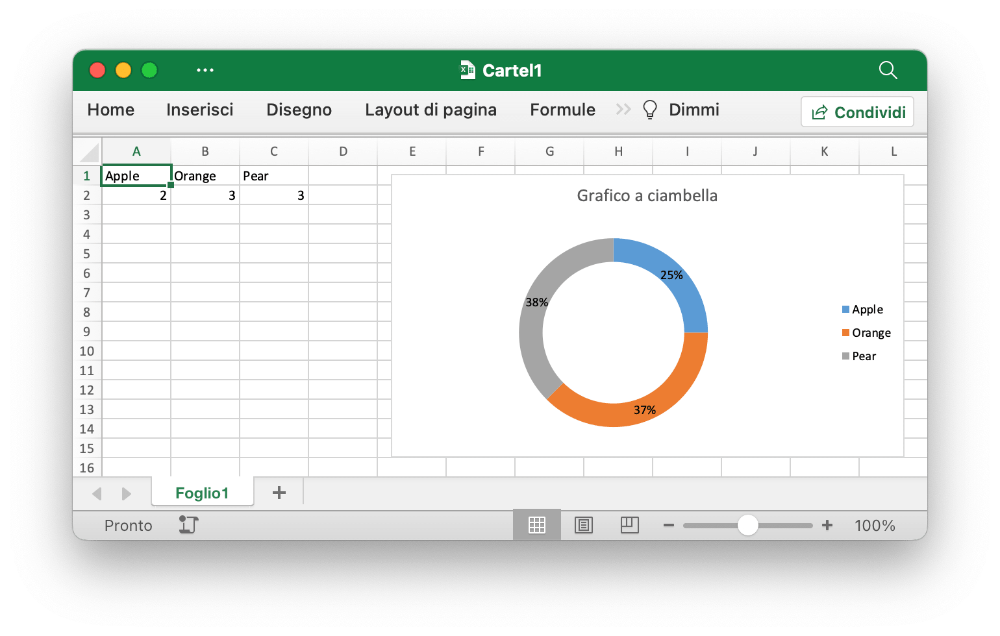

# Grafico a ciambella {#doughnut}

Ad esempio, aggiungi un grafico a ciambella come questo:

<p align="center"></p>

```go
package main

import (
    "fmt"

    "github.com/xuri/excelize/v2"
)

func main() {
    f := excelize.NewFile()
    defer func() {
        if err := f.Close(); err != nil {
            fmt.Println(err)
        }
    }()
    if err := f.SetSheetName("Sheet1", "Foglio1"); err != nil {
        fmt.Println(err)
        return
    }
    for idx, row := range [][]interface{}{
        {"Apple", "Orange", "Pear"},
        {2, 3, 3},
    } {
        cell, err := excelize.CoordinatesToCellName(1, idx+1)
        if err != nil {
            fmt.Println(err)
            return
        }
        if err := f.SetSheetRow("Foglio1", cell, &row); err != nil {
            fmt.Println(err)
            return
        }
    }
    if err := f.AddChart("Foglio1", "E1", &excelize.Chart{
        Type: excelize.Doughnut,
        Series: []excelize.ChartSeries{
            {
                Name:       "Amount",
                Categories: "Foglio1!$A$1:$C$1",
                Values:     "Foglio1!$A$2:$C$2",
            },
        },
        Format: excelize.GraphicOptions{
            OffsetX: 15,
            OffsetY: 10,
        },
        Legend: excelize.ChartLegend{
            Position: "right",
        },
        Title: []excelize.RichTextRun{
            {
                Text: "Grafico a ciambella",
            },
        },
        PlotArea: excelize.ChartPlotArea{
            ShowCatName:     false,
            ShowLeaderLines: false,
            ShowPercent:     true,
            ShowSerName:     false,
            ShowVal:         false,
        },
        ShowBlanksAs: "zero",
    }); err != nil {
        fmt.Println(err)
        return
    }
    // Salva cartella di lavoro
    if err := f.SaveAs("Cartel1.xlsx"); err != nil {
        fmt.Println(err)
    }
}
```
