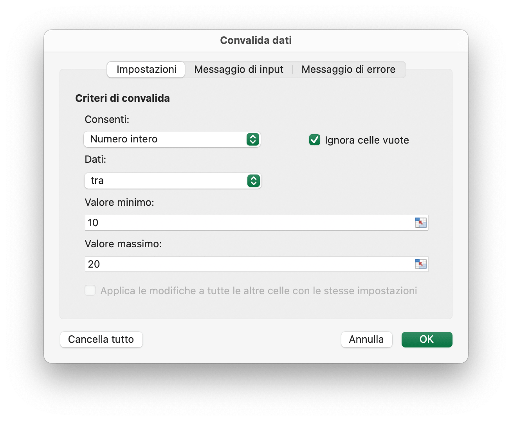
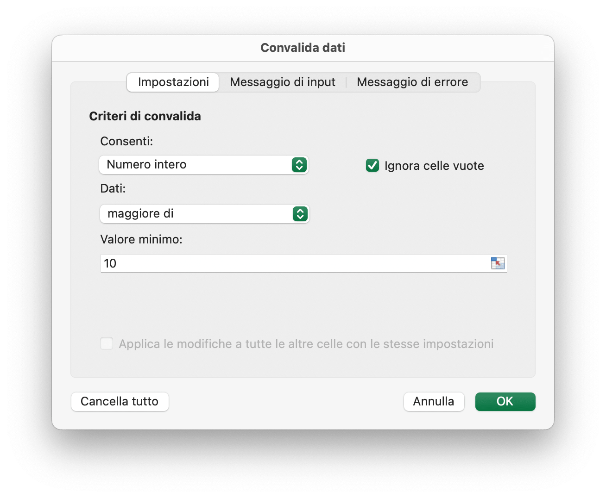
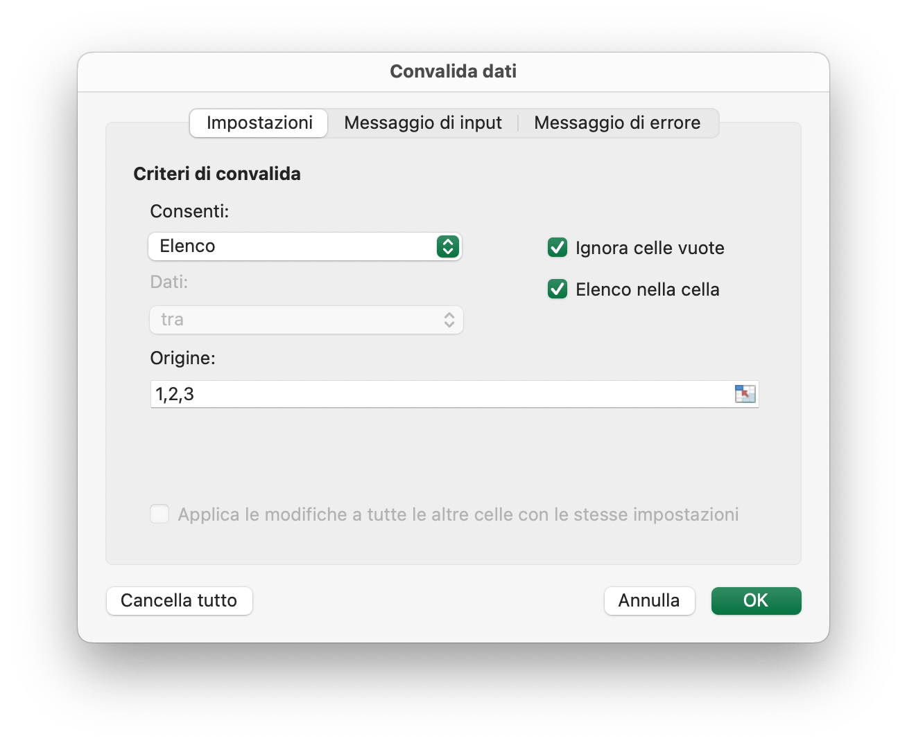
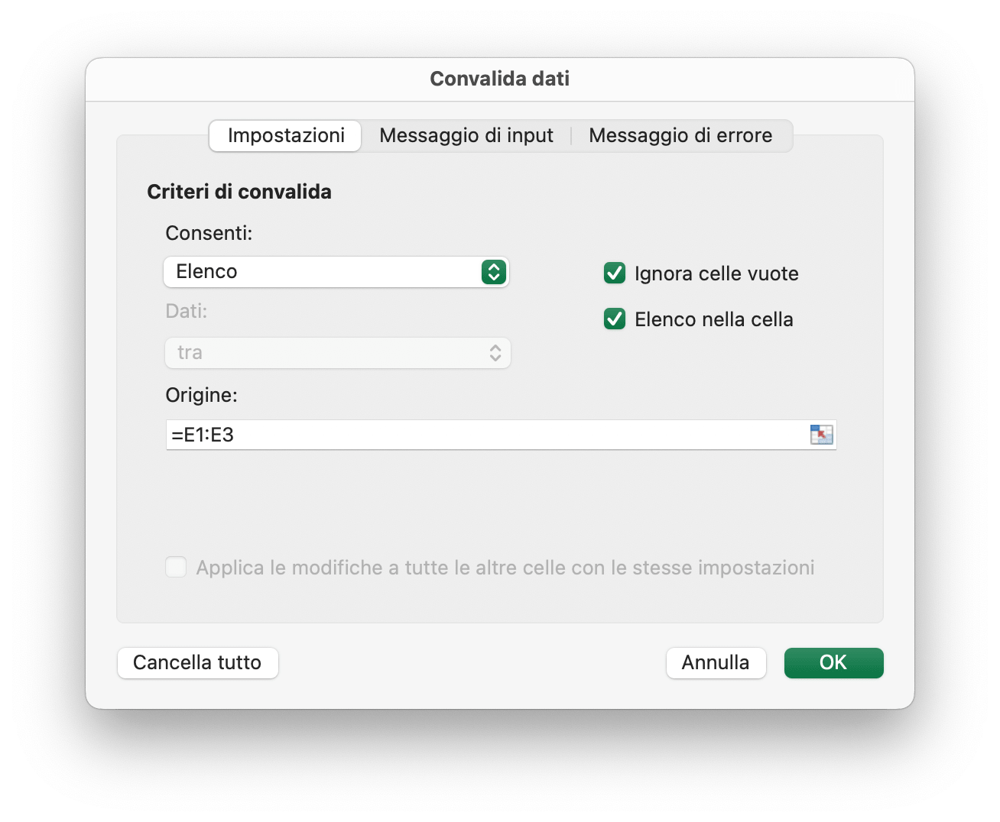

# Dati

## Aggiungi la convalida dei dati {#AddDataValidation}

```go
func (f *File) AddDataValidation(sheet string, dv *DataValidation)
```

AddDataValidation fornisce la convalida dei dati impostati su un intervallo del foglio di lavoro in base all'oggetto di convalida dei dati e al nome del foglio di lavoro. L'oggetto di convalida dei dati può essere creato dalla funzione `NewDataValidation`. Il tipo e gli operatori di convalida dei dati sono disponibili nella sezione [Costanti](constants.md).

Esempio 1, imposta la convalida dei dati su `Foglio1!A1:B2` con le impostazioni dei criteri di convalida, mostra un avviso di errore dopo che vengono immessi dati non validi con lo stile "Stop" e il titolo personalizzato "corpo dell'errore":

<p align="center"></p>

```go
dv := excelize.NewDataValidation(true)
dv.SetSqref("A1:B2")
dv.SetRange(10, 20, excelize.DataValidationTypeWhole, excelize.DataValidationOperatorBetween)
dv.SetError(excelize.DataValidationErrorStyleStop, "titolo dell'errore", "corpo dell'errore")
f.AddDataValidation("Foglio1", dv)
```

Esempio 2, imposta la convalida dei dati su `Foglio1!A3:B4` con le impostazioni dei criteri di convalida e mostra il messaggio di input quando viene selezionata la cella:

<p align="center"></p>

```go
dv = excelize.NewDataValidation(true)
dv.SetSqref("A3:B4")
dv.SetRange(10, 20, excelize.DataValidationTypeWhole, excelize.DataValidationOperatorGreaterThan)
dv.SetInput("titolo inserito", "corpo di ingresso")
f.AddDataValidation("Foglio1", dv)
```

Esempio 3, imposta la convalida dei dati su `Foglio1!A5:B6` con le impostazioni dei criteri di convalida, crea un menu a discesa nella cella consentendo l'origine dell'elenco:

<p align="center"></p>

```go
dv = excelize.NewDataValidation(true)
dv.SetSqref("A5:B6")
dv.SetDropList([]string{"1", "2", "3"})
f.AddDataValidation("Foglio1", dv)
```

Se si digitano gli elementi nella finestra di dialogo di convalida dei dati (un elenco delimitato), il limite è di 255 caratteri, inclusi i separatori. Se la formula di origine dell'elenco di convalida dei dati supera il limite di lunghezza massima, imposta i valori consentiti nelle celle del foglio di lavoro e utilizza la funzione "SetSqrefDropList" per impostare il riferimento per le relative celle.

Esempio 4, imposta la convalida dei dati su `Foglio1!A7:B8` con le impostazioni della fonte dei criteri di convalida `Foglio1!E1:E3`, crea un menu a discesa nella cella consentendo la fonte dell'elenco:

<p align="center"></p>

```go
dv := excelize.NewDataValidation(true)
dv.SetSqref("A7:B8")
dv.SetSqrefDropList("E1:E3")
f.AddDataValidation("Foglio1", dv)
```

Esistono limiti al numero di elementi che verranno visualizzati in un elenco a discesa di convalida dei dati: L'elenco può essere visualizzato per mostrare 32768 elementi da un elenco nel foglio di lavoro. Se hai bisogno di più articoli, puoi creare un elenco a discesa dipendente, suddiviso per categoria.

## Ottieni convalide dei dati {#GetDataValidations}

```go
func (f *File) GetDataValidations(sheet string) ([]*DataValidation, error)
```

GetDataValidations restituisce l'elenco di convalide dei dati in base al nome del foglio di lavoro specificato.

## Elimina la convalida dei dati {#DeleteDataValidation}

```go
func (f *File) DeleteDataValidation(sheet string, sqref ...string) error
```

DeleteDataValidation elimina la convalida dei dati in base al nome del foglio di lavoro e alla sequenza di riferimento specificati. Tutte le convalide dei dati nel foglio di lavoro verranno eliminate se non si specifica il parametro della sequenza di riferimento.

## Aggiungi affettatrice {#AddSlicer}

`SlicerOptions` rappresenta le impostazioni dell'affettatrice.

```go
type SlicerOptions struct {
    Name          string
    Table         string
    Cell          string
    Caption       string
    Macro         string
    Width         uint
    Height        uint
    DisplayHeader *bool
    ItemDesc      bool
    Format        GraphicOptions
}
```

`Name` specifica il nome dell'affettatrice, dovrebbe essere un nome di campo esistente della tabella o tabella pivot specificata, questa impostazione è obbligatoria.

`Table` specifica il nome della tabella o della tabella pivot, questa impostazione è obbligatoria.

`Cell` specifica le coordinate della cella in alto a sinistra la posizione per l'inserimento dell'affettatrice, questa impostazione è obbligatoria.

`Caption` specifica la didascalia dell'affettatrice, questa impostazione è facoltativa.

`Macro` utilizzato per impostare la macro per l'affettatrice, l'estensione della cartella di lavoro deve essere XLSM o XLTM.

`Width` specifica la larghezza dell'affettatrice, questa impostazione è facoltativa.

`Height` specifica l'altezza dell'affettatrice, questa impostazione è facoltativa.

`DisplayHeader` specifica se visualizzare l'intestazione dell'affettatrice, questa impostazione è facoltativa, l'impostazione predefinita è display.

`ItemDesc` specifica l'ordinamento degli elementi discendente (Z-A), questa impostazione è facoltativa e l'impostazione predefinita è "false" (rappresenta ascendente).

`Format` specifica il formato dell'affettatrice, questa impostazione è facoltativa.

```go
func (f *File) AddSlicer(sheet string, opts *SlicerOptions) error
```

La funzione AddSlicer inserisce un'affettatrice fornendo il nome del foglio di lavoro e le impostazioni dell'affettatrice. Ad esempio, inserisci un'affettatrice su "Foglio1!E1" con il campo "Column1" per la tabella denominata "Tabella1":

```go
err := f.AddSlicer("Foglio1", &excelize.SlicerOptions{
    Name:       "Column1",
    Cell:       "E1",
    TableSheet: "Foglio1",
    TableName:  "Tabella1",
    Caption:    "Colonna1",
    Width:      200,
    Height:     200,
})
```
