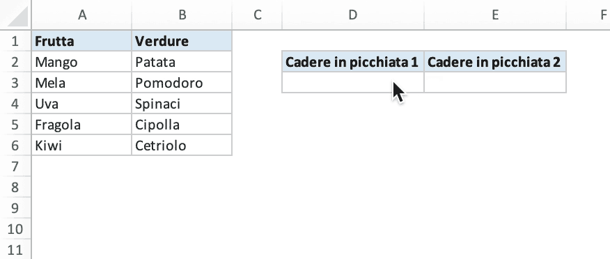

# Elenco a discesa dipendente

Crea un elenco a discesa dipendente nel foglio di calcolo con Excelize utilizzando Go:

<p align="center"></p>

```go
package main

import (
    "fmt"

    "github.com/xuri/excelize/v2"
)

func main() {
    // creare un nuovo foglio di calcolo
    f := excelize.NewFile()
    var (
        // valori delle celle
        data = [][]interface{}{
            {"Frutta", "Verdure"},
            {"Mango", "Patata", nil, "Cadere in picchiata 1", "Cadere in picchiata 2"},
            {"Mela", "Pomodoro"},
            {"Uva", "Spinaci"},
            {"Fragola", "Cipolla"},
            {"Kiwi", "Cetriolo"},
        }
        addr                    string
        err                     error
        cellsStyle, headerStyle int
    )
    if err := f.SetSheetName("Sheet1", "Foglio1"); err != nil {
        fmt.Println(err)
        return
    }
    // impostare il valore di ogni cella
    for r, row := range data {
        if addr, err = excelize.JoinCellName("A", r+1); err != nil {
            fmt.Println(err)
            return
        }
        if err = f.SetSheetRow("Foglio1", addr, &row); err != nil {
            fmt.Println(err)
            return
        }
    }
    // impostare la convalida dei dati
    dvRange1 := excelize.NewDataValidation(true)
    dvRange1.Sqref = "D3:D3"
    dvRange1.SetSqrefDropList("$A$1:$B$1")
    if err = f.AddDataValidation("Foglio1", dvRange1); err != nil {
        fmt.Println(err)
        return
    }
    dvRange2 := excelize.NewDataValidation(true)
    dvRange2.Sqref = "E3:E3"
    dvRange2.SetSqrefDropList("INDIRECT(D3)")
    if err = f.AddDataValidation("Foglio1", dvRange2); err != nil {
        fmt.Println(err)
        return
    }
    // impostare il nome definito
    if err = f.SetDefinedName(&excelize.DefinedName{
        Name:     "Frutta",
        RefersTo: "Foglio1!$A$2:$A$6",
        Scope:    "Foglio1",
    }); err != nil {
        fmt.Println(err)
        return
    }
    if err = f.SetDefinedName(&excelize.DefinedName{
        Name:     "Verdure",
        RefersTo: "Foglio1!$B$2:$B$6",
        Scope:    "Foglio1",
    }); err != nil {
        fmt.Println(err)
        return
    }
    // imposta la larghezza della colonna personalizzata
    for col, width := range map[string]float64{
        "A": 12, "B": 12, "C": 6, "D": 17, "E": 17} {
        if err = f.SetColWidth("Foglio1", col, col, width); err != nil {
            fmt.Println(err)
            return
        }
    }
    // nascondere le linee della griglia per il foglio di lavoro
    disable := false
    if err := f.SetSheetView("Foglio1", -1, &excelize.ViewOptions{
        ShowGridLines: &disable,
    }); err != nil {
        fmt.Println(err)
    }
    // definire lo stile del bordo
    border := []excelize.Border{
        {Type: "top", Style: 1, Color: "cccccc"},
        {Type: "left", Style: 1, Color: "cccccc"},
        {Type: "right", Style: 1, Color: "cccccc"},
        {Type: "bottom", Style: 1, Color: "cccccc"},
    }
    // definire lo stile delle celle
    if cellsStyle, err = f.NewStyle(&excelize.Style{
        Font:   &excelize.Font{Color: "333333"},
        Border: border}); err != nil {
        fmt.Println(err)
        return
    }
    // definire lo stile della riga di intestazione
    if headerStyle, err = f.NewStyle(&excelize.Style{
        Font: &excelize.Font{Bold: true},
        Fill: excelize.Fill{
            Type: "pattern", Color: []string{"dae9f3"}, Pattern: 1},
        Border: border},
    ); err != nil {
        fmt.Println(err)
        return
    }
    // impostare lo stile della cella
    if err = f.SetCellStyle("Foglio1", "A2", "B6", cellsStyle); err != nil {
        fmt.Println(err)
        return
    }
    if err = f.SetCellStyle("Foglio1", "D3", "E3", cellsStyle); err != nil {
        fmt.Println(err)
        return
    }
    // imposta lo stile della cella per la riga di intestazione
    if err = f.SetCellStyle("Foglio1", "A1", "B1", headerStyle); err != nil {
        fmt.Println(err)
        return
    }
    if err = f.SetCellStyle("Foglio1", "D2", "E2", headerStyle); err != nil {
        fmt.Println(err)
        return
    }
    // salvare il file del foglio di calcolo
    if err := f.SaveAs("Cartel1.xlsx"); err != nil {
        fmt.Println(err)
    }
}
```
