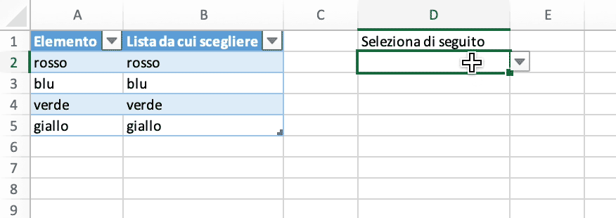

# Elenco a discesa a selezione multipla

Crea un elenco a discesa a selezione multipla senza VBA nel foglio di calcolo con Excelize utilizzando Go:

<p align="center"></p>

```go
package main

import (
    "fmt"

    "github.com/xuri/excelize/v2"
)

func main() {
    // creare un nuovo foglio di calcolo
    f := excelize.NewFile()
    var (
        sheetName = "Foglio1"
        selection = []string{"rosso", "blu", "verde", "giallo"}
        // valori delle celle
        data = [][]interface{}{
            {"Elemento", "Lista da cui scegliere", nil, "Seleziona di seguito"},
            {selection[0] + " "},
            {selection[1] + " "},
            {selection[2] + " "},
            {selection[3] + " "},
        }
        cell string
        err  error
    )
    if err := f.SetSheetName("Sheet1", sheetName); err != nil {
        fmt.Println(err)
        return
    }
    // impostare il valore di ogni cella
    for r, row := range data {
        if cell, err = excelize.JoinCellName("A", r+1); err != nil {
            fmt.Println(err)
            return
        }
        if err = f.SetSheetRow(sheetName, cell, &row); err != nil {
            fmt.Println(err)
            return
        }
    }
    // impostare il nome definito
    for index, value := range selection {
        if cell, err = excelize.CoordinatesToCellName(1, index+2, true); err != nil {
            fmt.Println(err)
            return
        }
        if err = f.SetDefinedName(&excelize.DefinedName{
            Name:     value,
            RefersTo: fmt.Sprintf("%s!%s", sheetName, cell),
            Scope:    sheetName,
        }); err != nil {
            fmt.Println(err)
            return
        }
        if cell, err = excelize.CoordinatesToCellName(2, index+2); err != nil {
            fmt.Println(err)
            return
        }
        formula := fmt.Sprintf("=IF(ISNUMBER(FIND(%s,D2)),\"\",D2&%s)", value, value)
        if err := f.SetCellFormula(sheetName, cell, formula); err != nil {
            fmt.Println(err)
            return
        }
    }
    // impostare la convalida dei dati
    dv := excelize.NewDataValidation(true)
    dv.SetSqref("D2:D2")
    dv.SetSqrefDropList("$B$2:$B$5")
    if err = f.AddDataValidation(sheetName, dv); err != nil {
        fmt.Println(err)
        return
    }
    // imposta la larghezza della colonna personalizzata
    for col, width := range map[string]float64{"A": 11, "B": 19, "D": 18} {
        if err = f.SetColWidth(sheetName, col, col, width); err != nil {
            fmt.Println(err)
            return
        }
    }
    // creare una tabella
    if err = f.AddTable(sheetName,
        &excelize.Table{
            Range:     "A1:B5",
            Name:      "table",
            StyleName: "TableStyleMedium2",
        },
    ); err != nil {
        fmt.Println(err)
        return
    }
    // salvare il file del foglio di calcolo
    if err := f.SaveAs("Cartel1.xlsx"); err != nil {
        fmt.Println(err)
    }
}
```
