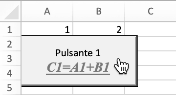
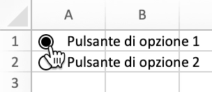

# Controlli del modulo

FormControl mappa direttamente le informazioni sui controlli del modulo.

```go
type FormControl struct {
    Cell         string
    Macro        string
    Width        uint
    Height       uint
    Checked      bool
    CurrentVal   uint
    MinVal       uint
    MaxVal       uint
    IncChange    uint
    PageChange   uint
    Horizontally bool
    CellLink     string
    Text         string
    Paragraph    []RichTextRun
    Type         FormControlType
    Format       GraphicOptions
}
```

## Aggiungi il controllo del modulo {#AddFormControl}

```go
func (f *File) AddFormControl(sheet string, opts FormControl) error
```

AddFormControl fornisce il metodo per aggiungere il pulsante di controllo del modulo in un foglio di lavoro in base al nome del foglio di lavoro e alle opzioni di controllo del modulo. Tipo di controllo modulo supportato: pulsante, casella di controllo, casella di gruppo, etichetta, pulsante di opzione, barra di scorrimento e casella di selezione. Se viene impostata una macro per il controllo del modulo, l'estensione della cartella di lavoro dovrebbe essere `.xlsm` o `.xltm`. Il valore di scorrimento deve essere compreso tra 0 e 30000. Si noti che se è impostato un collegamento di cella per un controllo modulo casella di controllo, Excelize non assegnerà un valore alla cella collegata quando la casella di controllo è selezionata. Per riflettere lo stato della casella di controllo, utilizzare la funzione [`SetCellValue`](cell.md#SetCellValue) per impostare manualmente il valore della cella collegata su `true`.

Esempio 1, aggiungi il controllo del modulo del pulsante con macro, rich-text, dimensione del pulsante personalizzata, proprietà di stampa su `Foglio1!A2` e lascia che il pulsante non si sposti o non si ridimensioni con le celle:

<p align="center"></p>

```go
enable := true
err := f.AddFormControl("Foglio1", excelize.FormControl{
    Cell:   "A2",
    Type:   excelize.FormControlButton,
    Macro:  "Button1_Click",
    Width:  140,
    Height: 60,
    Text:   "Pulsante 1\r\n",
    Paragraph: []excelize.RichTextRun{
        {
            Font: &excelize.Font{
                Bold:      true,
                Italic:    true,
                Underline: "single",
                Family:    "Times New Roman",
                Size:      14,
                Color:     "777777",
            },
            Text: "C1=A1+B1",
        },
    },
    Format: excelize.GraphicOptions{
        PrintObject: &enable,
        Positioning: "absolute",
    },
})
```

Esempio 2, aggiungi i controlli del modulo del pulsante di opzione con stato selezionato e testo su `Foglio1!A1` e `Foglio1!A2`:

<p align="center"></p>

```go
if err := f.AddFormControl("Foglio1", excelize.FormControl{
    Cell:    "A1",
    Type:    excelize.FormControlOptionButton,
    Text:    "Pulsante di opzione 1",
    Checked: true,
    Height:  20,
}); err != nil {
    fmt.Println(err)
}
if err := f.AddFormControl("Foglio1", excelize.FormControl{
    Cell:    "A2",
    Type:    excelize.FormControlOptionButton,
    Text:    "Pulsante di opzione 2",
    Height:  20,
}); err != nil {
    fmt.Println(err)
}
```

Esempio 3, aggiungi il controllo del modulo del pulsante di selezione su `Foglio1!B1` per aumentare o diminuire il valore di `Foglio1!A1`:

<p align="center"></p>

```go
err := f.AddFormControl("Foglio1", excelize.FormControl{
    Cell:       "B1",
    Type:       excelize.FormControlSpinButton,
    Width:      15,
    Height:     40,
    CurrentVal: 7,
    MinVal:     5,
    MaxVal:     10,
    IncChange:  1,
    CellLink:   "A1",
})
```

Esempio 4, aggiungi il controllo del modulo con barra di scorrimento orizzontale su `Foglio1!A2` per modificare il valore di `Foglio1!A1` facendo clic sulle frecce di scorrimento o trascinando la casella di scorrimento:

<p align="center"></p>

```go
err := f.AddFormControl("Foglio1", excelize.FormControl{
    Cell:         "A2",
    Type:         excelize.FormControlScrollBar,
    Width:        140,
    Height:       20,
    CurrentVal:   50,
    MinVal:       10,
    MaxVal:       100,
    IncChange:    1,
    PageChange:   1,
    CellLink:     "A1",
    Horizontally: true,
})
```

## Ottieni i controlli del modulo {#GetFormControls}

```go
func (f *File) GetFormControls(sheet string) ([]FormControl, error)
```

GetFormControls recupera tutti i controlli del modulo in un foglio di lavoro in base a un determinato nome del foglio di lavoro. Tieni presente che questa funzione al momento non supporta l'ottenimento della larghezza e dell'altezza dei controlli del modulo.

## Elimina il controllo del modulo {#DeleteFormControl}

```go
func (f *File) DeleteFormControl(sheet, cell string) error
```

DeleteFormControl fornisce il metodo per eliminare il controllo del modulo in un foglio di lavoro in base al nome del foglio di lavoro e al riferimento alla cella. Ad esempio, elimina il controllo del modulo in `Foglio1!$A$1`:

```go
err := f.DeleteFormControl("Foglio1", "A1")
```
