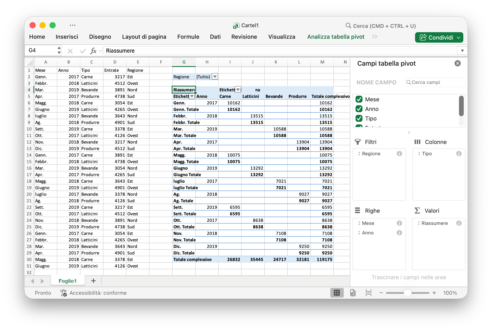

# Tabella pivot {#PivotTable}

Una tabella pivot è una tabella di statistiche che riepiloga i dati di una tabella più ampia (ad esempio da un database, un foglio di calcolo o un programma di business intelligence). Questo riepilogo potrebbe includere somme, medie o altre statistiche, che la tabella pivot raggruppa in modo significativo.

`PivotTableOptions` mappa direttamente le impostazioni di formato della tabella pivot.

```go
type PivotTableOptions struct {
    DataRange           string
    PivotTableRange     string
    Rows                []PivotTableField
    Columns             []PivotTableField
    Data                []PivotTableField
    Filter              []PivotTableField
    RowGrandTotals      bool
    ColGrandTotals      bool
    ShowDrill           bool
    UseAutoFormatting   bool
    PageOverThenDown    bool
    MergeItem           bool
    CompactData         bool
    ShowError           bool
    ShowRowHeaders      bool
    ShowColHeaders      bool
    ShowRowStripes      bool
    ShowColStripes      bool
    ShowLastColumn      bool
    PivotTableStyleName string
    // contiene campi filtrati o non esportati
}
```

`PivotTableStyleName`: i nomi degli stili di tabella pivot integrati:

```text
PivotStyleLight1 - PivotStyleLight28
PivotStyleMedium1 - PivotStyleMedium28
PivotStyleDark1 - PivotStyleDark28
```

`PivotTableField` mappa direttamente le impostazioni del campo della tabella pivot.

```go
type PivotTableField struct {
    Compact         bool
    Data            string
    Name            string
    Outline         bool
    Subtotal        string
    DefaultSubtotal bool
}
```

`Subtotal` specifica la funzione di aggregazione che si applica a questo campo dati. Il valore predefinito è `Sum`. I possibili valori per questo attributo sono:

|Valore facoltativo|
|---|
|Average|
|Count|
|CountNums|
|Max|
|Min|
|Product|
|StdDev|
|StdDevp|
|Sum|
|Var|
|Varp|

`Name` specifica il nome del campo dati. Nel nome del campo dati sono consentiti al massimo `255` caratteri, i caratteri in eccesso verranno troncati.

## Crea tabella pivot {#AddPivotTable}

```go
func (f *File) AddPivotTable(opts *PivotTableOptions) error
```

AddPivotTable fornisce il metodo per aggiungere una tabella pivot in base alle opzioni della tabella pivot.

Ad esempio, crea una tabella pivot nell'area `Foglio1!$G$2:$M$34` con la regione `Foglio1!$A$1:$E$31` come origine dati, riepiloga per somma per le vendite:

<p align="center"></p>

```go
package main

import (
    "fmt"
    "math/rand"

    "github.com/xuri/excelize/v2"
)

func main() {
    f := excelize.NewFile()
    defer func() {
        if err := f.Close(); err != nil {
            fmt.Println(err)
        }
    }()
    if err := f.SetSheetName("Sheet1", "Foglio1"); err != nil {
        fmt.Println(err)
        return
    }
    // Creare alcuni dati in un foglio
    month := []string{"Genn.", "Febbr.", "Mar.", "Apr.", "Magg.",
        "Giugno", "luglio", "Ag.", "Sett.", "Ott.", "Nov.", "Dic."}
    year := []int{2017, 2018, 2019}
    types := []string{"Carne", "Latticini", "Bevande", "Produrre"}
    region := []string{"Est", "Ovest", "Nord", "Sud"}
    f.SetSheetRow("Foglio1", "A1", &[]string{"Mese", "Anno", "Tipo", "Saldi", "Regione"})
    for row := 2; row < 32; row++ {
        f.SetCellValue("Foglio1", fmt.Sprintf("A%d", row), month[rand.Intn(12)])
        f.SetCellValue("Foglio1", fmt.Sprintf("B%d", row), year[rand.Intn(3)])
        f.SetCellValue("Foglio1", fmt.Sprintf("C%d", row), types[rand.Intn(4)])
        f.SetCellValue("Foglio1", fmt.Sprintf("D%d", row), rand.Intn(5000))
        f.SetCellValue("Foglio1", fmt.Sprintf("E%d", row), region[rand.Intn(4)])
    }
    if err := f.AddPivotTable(&excelize.PivotTableOptions{
        DataRange:       "Foglio1!A1:E31",
        PivotTableRange: "Foglio1!G2:M34",
        Rows: []excelize.PivotTableField{
            {Data: "Mese", DefaultSubtotal: true}, {Data: "Anno"}},
        Filter: []excelize.PivotTableField{
            {Data: "Regione"}},
        Columns: []excelize.PivotTableField{
            {Data: "Tipo", DefaultSubtotal: true}},
        Data: []excelize.PivotTableField{
            {Data: "Saldi", Name: "Riassumere", Subtotal: "Sum"}},
        RowGrandTotals: true,
        ColGrandTotals: true,
        ShowDrill:      true,
        ShowRowHeaders: true,
        ShowColHeaders: true,
        ShowLastColumn: true,
    }); err != nil {
        fmt.Println(err)
        return
    }
    if err := f.SaveAs("Cartel1.xlsx"); err != nil {
        fmt.Println(err)
    }
}
```

## Ottieni tabelle pivot {#GetPivotTables}

```go
func (f *File) GetPivotTables(sheet string) ([]PivotTableOptions, error)
```

GetPivotTables restituisce tutte le definizioni di tabella pivot in un foglio di lavoro in base al nome del foglio di lavoro specificato.

## Elimina la tabella pivot {#DeletePivotTable}

```go
func (f *File) DeletePivotTable(sheet, name string) error
```

DeletePivotTable elimina una tabella pivot fornendo il nome del foglio di lavoro e il nome della tabella pivot. Tieni presente che questa funzione non pulisce i valori delle celle nell'intervallo della tabella pivot.
