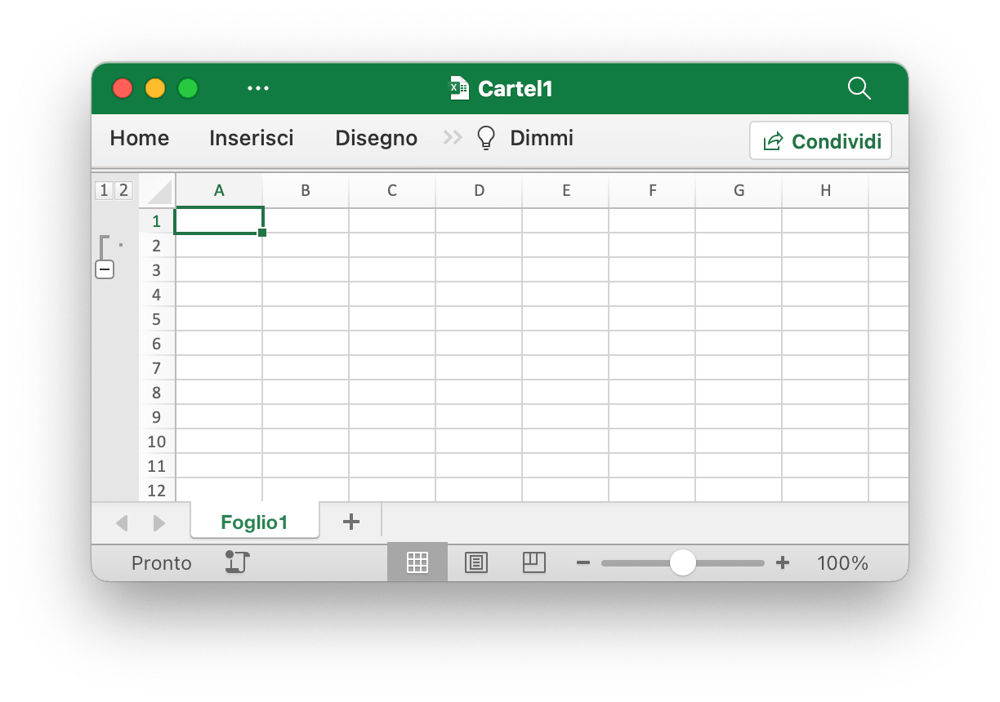

# Foglio di lavoro

## Imposta la visibilità della colonna {#SetColVisible}

```go
func (f *File) SetColVisible(sheet, col string, visible bool) error
```

SetColVisible fornisce una funzione per rendere visibile una singola colonna in base al nome del foglio di lavoro e alla colonna specificati. Questa funzione è sicura per la concorrenza. Ad esempio, nascondi la colonna `D` in `Foglio1`:

```go
err := f.SetColVisible("Foglio1", "D", false)
```

Nascondi le colonne da `D` a `F` (incluse):

```go
err := f.SetColVisible("Foglio1", "D:F", false)
```

## Imposta la larghezza della colonna {#SetColWidth}

```go
func (f *File) SetColWidth(sheet, startCol, endCol string, width float64) error
```

SetColWidth fornisce una funzione per impostare la larghezza di una singola colonna o di più colonne. Questa funzione è sicura per la concorrenza. Per esempio:

```go
err := f.SetColWidth("Foglio1", "A", "H", 20)
```

## Imposta l'altezza della riga {#SetRowHeight}

```go
func (f *File) SetRowHeight(sheet string, row int, height float64) error
```

SetRowHeight fornisce una funzione per impostare l'altezza di una singola riga. Se il valore dell'altezza è `0`, nasconderà la riga specificata, se il valore dell'altezza è `-1`, annullerà l'altezza della riga personalizzata. Ad esempio, imposta l'altezza della prima riga in `Foglio1`:

```go
err := f.SetRowHeight("Foglio1", 1, 50)
```

## Imposta la visibilità della riga {#SetRowVisible}

```go
func (f *File) SetRowVisible(sheet string, row int, visible bool) error
```

SetRowVisible fornisce una funzione per rendere visibile una singola riga in base al nome del foglio di lavoro e al numero di riga specificati. Ad esempio, nascondi la riga `2` in `Foglio1`:

```go
err := f.SetRowVisible("Foglio1", 2, false)
```

## Ottieni il nome del foglio {#GetSheetName}

```go
func (f *File) GetSheetName(index int) string
```

GetSheetName fornisce una funzione per ottenere il nome del foglio della cartella di lavoro dall'indice del foglio specificato. Se l'indice del foglio specificato non è valido, restituirà una stringa vuota.

## Ottieni visibilità sulle colonne {#GetColVisible}

```go
func (f *File) GetColVisible(sheet, column string) (bool, error)
```

GetColVisible fornisce una funzione per rendere visibile una singola colonna in base al nome del foglio di lavoro e alla colonna specificati. Questa funzione è sicura per la concorrenza. Ad esempio, ottieni lo stato visibile della colonna `D` in `Foglio1`:

```go
visible, err := f.GetColVisible("Foglio1", "D")
```

## Ottieni la larghezza della colonna {#GetColWidth}

```go
func (f *File) GetColWidth(sheet, col string) (float64, error)
```

GetColWidth fornisce una funzione per ottenere la larghezza della colonna fornendo il nome del foglio di lavoro e il nome della colonna. Questa funzione è sicura per la concorrenza.

## Ottieni l'altezza della riga {#GetRowHeight}

```go
func (f *File) GetRowHeight(sheet string, row int) (float64, error)
```

GetRowHeight fornisce una funzione per ottenere l'altezza della riga in base al nome del foglio di lavoro e al numero di riga. Ad esempio, ottieni l'altezza della prima riga in `Foglio1`:

```go
height, err := f.GetRowHeight("Foglio1", 1)
```

## Ottieni visibilità delle righe {#GetRowVisible}

```go
func (f *File) GetRowVisible(sheet string, row int) (bool, error)
```

GetRowVisible fornisce una funzione per rendere visibile una singola riga in base al nome del foglio di lavoro e al numero di riga specificati. Ad esempio, ottieni lo stato visibile della riga `2` in `Foglio1`:

```go
visible, err := f.GetRowVisible("Foglio1", 2)
```

## Ottieni l'indice del foglio {#GetSheetIndex}

```go
func (f *File) GetSheetIndex(sheet string) (int, error)
```

GetSheetIndex fornisce una funzione per ottenere un indice del foglio della cartella di lavoro in base al nome del foglio specificato. Se il nome del foglio specificato non è valido o il foglio non esiste, restituirà un valore di tipo intero -1.

L'indice ottenuto può essere utilizzato come parametro per chiamare la funzione [`SetActiveSheet()`](workbook.md#SetActiveSheet) quando si imposta il foglio di lavoro predefinito della cartella di lavoro.

## Ottieni una mappa in fogli {#GetSheetMap}

```go
func (f *File) GetSheetMap() map[int]string
```

GetSheetMap fornisce una funzione per ottenere fogli di lavoro, fogli grafici, ID fogli di dialogo e mappe dei nomi della cartella di lavoro. Per esempio:

```go
f, err := excelize.OpenFile("Cartel1.xlsx")
if err != nil {
    return
}
defer func() {
    if err := f.Close(); err != nil {
        fmt.Println(err)
    }
}()
for index, name := range f.GetSheetMap() {
    fmt.Println(index, name)
}
```

## Ottieni l'elenco dei fogli {#GetSheetList}

```go
func (f *File) GetSheetList() []string
```

GetSheetList fornisce una funzione per ottenere l'elenco dei nomi di fogli di lavoro, fogli grafici e fogli di dialogo della cartella di lavoro.

## Imposta il nome del foglio {#SetSheetName}

```go
func (f *File) SetSheetName(source, target string) error
```

SetSheetName fornisce una funzione per impostare il nome del foglio di lavoro fornendo i nomi del foglio di lavoro di origine e di destinazione. Sono consentiti un massimo di 31 caratteri nel titolo del foglio e questa funzione modifica solo il nome del foglio e non aggiorna il nome del foglio nella formula o nel riferimento associato alla cella. Potrebbe quindi esserci un errore nella formula del problema o un riferimento mancante.

## Inserisci colonne {#InsertCols}

```go
func (f *File) InsertCols(sheet, col string, n int) error
```

InsertCols fornisce una funzione per inserire nuove colonne prima del nome della colonna e del numero di colonne specificati. Ad esempio, crea due colonne prima della colonna `C` in `Foglio1`:

```go
err := f.InsertCols("Foglio1", "C", 2)
```

## Inserisci righe {#InsertRows}

```go
func (f *File) InsertRows(sheet string, row, n int) error
```

InsertRows fornisce una funzione per inserire nuove righe dopo il numero di riga di Excel specificato a partire da `1` e il numero di righe. Ad esempio, crea due righe prima della riga `3` in `Foglio1`:

```go
err := f.InsertRows("Foglio1", 3, 2)
```

## Aggiungi riga duplicata {#DuplicateRow}

```go
func (f *File) DuplicateRow(sheet string, row int) error
```

DuplicateRow inserisce una copia della riga specifica di seguito specificata, ad esempio:

```go
err := f.DuplicateRow("Sheet1", 2)
```

Utilizzare questo metodo con cautela poiché influirà sulle modifiche ai riferimenti quali formule, grafici e così via. Se è presente un valore di riferimento nel foglio di lavoro, ciò causerà un errore di file quando lo apri. Excelize aggiorna attualmente solo parzialmente questi riferimenti.

## Riga duplicata {#DuplicateRowTo}

```go
func (f *File) DuplicateRowTo(sheet string, row, row2 int) error
```

DuplicateRowTo inserisce una copia della riga specificata in base al numero Excel nella posizione della riga specificata, spostandosi verso il basso nelle righe esistenti dopo la posizione di destinazione, ad esempio:

```go
err := f.DuplicateRowTo("Sheet1", 2, 7)
```

Utilizzare questo metodo con cautela poiché influirà sulle modifiche ai riferimenti quali formule, grafici e così via. Se è presente un valore di riferimento nel foglio di lavoro, ciò causerà un errore di file quando lo apri. Excelize aggiorna attualmente solo parzialmente questi riferimenti.

## Crea il contorno della riga {#SetRowOutlineLevel}

```go
func (f *File) SetRowOutlineLevel(sheet string, row int, level uint8) error
```

SetRowOutlineLevel fornisce una funzione per impostare il numero del livello di struttura di una singola riga in base al nome del foglio di lavoro e al numero di riga di Excel. Ad esempio, delinea la riga 2 in `Foglio1` al livello 1:

<p align="center"></p>

```go
err := f.SetRowOutlineLevel("Foglio1", 2, 1)
```

## Crea il contorno della colonna {#SetColOutlineLevel}

```go
func (f *File) SetColOutlineLevel(sheet, col string, level uint8) error
```

SetColOutlineLevel fornisce una funzione per impostare il livello di struttura di una singola colonna in base al nome del foglio di lavoro e al nome della colonna. Ad esempio, imposta il livello di struttura della colonna `D` in `Foglio1` su 2:

<p align="center"></p>

```go
err := f.SetColOutlineLevel("Foglio1", "D", 2)
```

## Ottieni il contorno della riga {#GetRowOutlineLevel}

```go
func (f *File) GetRowOutlineLevel(sheet string, row int) (uint8, error)
```

GetRowOutlineLevel fornisce una funzione per ottenere il numero del livello di struttura di una singola riga in base al nome del foglio di lavoro e al numero di riga di Excel. Ad esempio, ottieni il numero della struttura della riga 2 in `Foglio1`:

```go
err := f.GetRowOutlineLevel("Foglio1", 2)
```

## Ottieni il contorno della colonna {#GetColOutlineLevel}

```go
func (f *File) GetColOutlineLevel(sheet, col string) (uint8, error)
```

GetColOutlineLevel fornisce una funzione per ottenere il livello di struttura di una singola colonna in base al nome del foglio di lavoro e alla colonna specificati. Ad esempio, ottieni il livello di struttura della colonna `D` in `Foglio1`:

```go
level, err := f.GetColOutlineLevel("Foglio1", "D")
```

## Iteratore di colonna {#Cols}

```go
func (f *File) Cols(sheet string) (*Cols, error)
```

Cols restituisce un iteratore di colonna, utilizzato per lo streaming dei dati di lettura per un foglio di lavoro con dati di grandi dimensioni. Questa funzione è sicura per la concorrenza. Per esempio:

```go
cols, err := f.Cols("Foglio1")
if err != nil {
    fmt.Println(err)
    return
}
for cols.Next() {
    col, err := cols.Rows()
    if err != nil {
        fmt.Println(err)
    }
    for _, rowCell := range col {
        fmt.Print(rowCell, "\t")
    }
    fmt.Println()
}
```

### Iteratore di colonna - Colonne

```go
func (cols *Cols) Rows(opts ...Options) ([]string, error)
```

Le righe restituiscono i valori di riga della colonna corrente.

### Iteratore di colonna - Attraversamento

```go
func (cols *Cols) Next() bool
```

Next restituirà `true` se viene trovata la colonna successiva.

### Iteratore di colonna - Gestione degli errori

```go
func (cols *Cols) Error() error
```

Error restituirà l'`error` quando si verifica l'errore.

## Iteratore di riga {#Rows}

```go
func (f *File) Rows(sheet string) (*Rows, error)
```

Rows restituisce un iteratore di righe, utilizzato per lo streaming dei dati di lettura per un foglio di lavoro con dati di grandi dimensioni. Questa funzione è sicura per la concorrenza. Per esempio:

```go
rows, err := f.Rows("Foglio1")
if err != nil {
    fmt.Println(err)
    return
}
for rows.Next() {
    row, err := rows.Columns()
    if err != nil {
        fmt.Println(err)
    }
    for _, colCell := range row {
        fmt.Print(colCell, "\t")
    }
    fmt.Println()
}
if err = rows.Close(); err != nil {
    fmt.Println(err)
}
```

### Iteratore di riga - Colonne

```go
func (rows *Rows) Columns(opts ...Options) ([]string, error)
```

Le colonne restituiscono i valori della colonna della riga corrente. Ciò recupera i dati del foglio di lavoro come flusso, restituisce ogni cella di una riga così com'è e non salterà le righe vuote nella coda del foglio di lavoro.

### Iteratore di riga - Attraversamento

```go
func (rows *Rows) Next() bool
```

Next restituirà `true` se trova l'elemento della riga successiva.

### Iteratore di riga - Gestione degli errori

```go
func (rows *Rows) Error() error
```

Error restituirà l'`error` quando si verifica l'errore.

### Iteratore di riga - Ottieni le opzioni di riga

```go
func (rows *Rows) GetRowOpts() RowOpts
```

GetRowOpts restituirà i `RowOpts` della riga corrente.

### Iteratore di riga - Chiudi

```go
func (rows *Rows) Close() error
```

Close chiude il file XML del foglio di lavoro aperto nella directory temporanea del sistema.

## Foglio di ricerca {#SearchSheet}

```go
func (f *File) SearchSheet(sheet, value string, reg ...bool) ([]string, error)
```

SearchSheet fornisce una funzione per ottenere il riferimento alla cella in base al nome del foglio di lavoro, al valore della cella e all'espressione regolare specificati. La funzione attualmente non supporta la ricerca in base al risultato calcolato, ai numeri formattati e alla ricerca condizionale. Se si tratta di una cella unita, restituirà il riferimento di cella della cella in alto a sinistra del riferimento dell'intervallo unito.

Ad esempio, cerca il riferimento di cella del valore `100` su `Foglio1`:

```go
result, err := f.SearchSheet("Foglio1", "100")
```

Ad esempio, cerca il riferimento della cella in cui è descritto il valore numerico nell'intervallo `0-9` di `Foglio1`:

```go
result, err := f.SearchSheet("Foglio1", "[0-9]", true)
```

## Proteggi foglio {#ProtectSheet}

```go
func (f *File) ProtectSheet(sheet string, opts *SheetProtectionOptions) error
```

ProtectSheet fornisce una funzione per impedire ad altri utenti di modificare, spostare o eliminare accidentalmente o deliberatamente i dati in un foglio di lavoro. Il campo facoltativo `AlgorithmName` ha specificato l'algoritmo hash, supporta attualmente XOR, MD4, MD5, SHA-1, SHA-256, SHA-384 e SHA-512, se non è specificato alcun algoritmo hash, utilizzerà l'algoritmo XOR come predefinito. Ad esempio, proteggi `Foglio1` con le impostazioni di protezione:

<p align="center"></p>

```go
err := f.ProtectSheet("Foglio1", &excelize.SheetProtectionOptions{
    AlgorithmName:       "SHA-512",
    Password:            "password",
    SelectLockedCells:   true,
    SelectUnlockedCells: true,
    EditScenarios:       true,
})
```

SheetProtectionOptions mappa direttamente le impostazioni di protezione del foglio di lavoro.

```go
type SheetProtectionOptions struct {
    AlgorithmName       string
    AutoFilter          bool
    DeleteColumns       bool
    DeleteRows          bool
    EditObjects         bool
    EditScenarios       bool
    FormatCells         bool
    FormatColumns       bool
    FormatRows          bool
    InsertColumns       bool
    InsertHyperlinks    bool
    InsertRows          bool
    Password            string
    PivotTables         bool
    SelectLockedCells   bool
    SelectUnlockedCells bool
    Sort                bool
}
```

## Rimuovi protezione foglio {#UnprotectSheet}

```go
func (f *File) UnprotectSheet(sheet string, password ...string) error
```

UnprotectSheet fornisce una funzione per rimuovere la protezione per un foglio, specificando il secondo parametro password opzionale per rimuovere la protezione del foglio con la verifica della password.

## Rimuovi colonna {#RemoveCol}

```go
func (f *File) RemoveCol(sheet, col string) error
```

RemoveCol fornisce una funzione per rimuovere una singola colonna in base al nome del foglio di lavoro e all'indice della colonna. Ad esempio, rimuovi la colonna `C` in `Foglio1`:

```go
err := f.RemoveCol("Foglio1", "C")
```

Utilizzare questo metodo con cautela poiché influirà sulle modifiche ai riferimenti quali formule, grafici e così via. Se è presente un valore di riferimento nel foglio di lavoro, ciò causerà un errore di file quando lo apri. Excelize aggiorna attualmente solo parzialmente questi riferimenti.

## Rimuovi riga {#RemoveRow}

```go
func (f *File) RemoveRow(sheet string, row int) error
```

RemoveRow fornisce una funzione per rimuovere una singola riga in base al nome del foglio di lavoro e al numero di riga di Excel. Ad esempio, rimuovi la riga `3` in `Foglio1`:

```go
err := f.RemoveRow("Foglio1", 3)
```

Utilizzare questo metodo con cautela poiché influirà sulle modifiche ai riferimenti quali formule, grafici e così via. Se è presente un valore di riferimento nel foglio di lavoro, ciò causerà un errore di file quando lo apri. Excelize aggiorna attualmente solo parzialmente questi riferimenti.

## Imposta i valori delle colonne {#SetSheetCol}

```go
func (f *File) SetSheetCol(sheet, cell string, slice interface{}) error
```

SetSheetCol scrive un array in una colonna in base al nome del foglio di lavoro, al riferimento di cella iniziale e a un puntatore al tipo di array "slice". Ad esempio, scrive un array nella colonna `B` iniziando con la cella `B6` su `Foglio1`:

```go
err := f.SetSheetCol("Foglio1", "B6", &[]interface{}{"1", nil, 2})
```

## Imposta i valori delle righe {#SetSheetRow}

```go
func (f *File) SetSheetRow(sheet, cell string, slice interface{}) error
```

SetSheetRow scrive un array su una riga in base al nome del foglio di lavoro, al riferimento alla cella iniziale e a un puntatore al tipo di array `slice`. Questa funzione è sicura per la concorrenza. Ad esempio, scrive un array nella riga `6` iniziando con la cella `B6` su `Foglio1`:

```go
err := f.SetSheetRow("Foglio1", "B6", &[]interface{}{"1", nil, 2})
```

## Inserisci interruzione di pagina {#InsertPageBreak}

```go
func (f *File) InsertPageBreak(sheet, cell string) error
```

InsertPageBreak crea un'interruzione di pagina per determinare dove finisce la pagina stampata e dove inizia quella successiva in base al nome del foglio di lavoro e al riferimento alla cella, in modo che il contenuto prima dell'interruzione di pagina venga stampato su una pagina e dopo l'interruzione di pagina su un'altra.

## Rimuovi l'interruzione di pagina {#RemovePageBreak}

```go
func (f *File) RemovePageBreak(sheet, cell string) error
```

RemovePageBreak rimuove un'interruzione di pagina in base al nome del foglio di lavoro e al riferimento alla cella.

## Imposta la dimensione del foglio {#SetSheetDimension}

```go
func (f *File) SetSheetDimension(sheet string, rangeRef string) error
```

SetSheetDimension fornisce il metodo per impostare o rimuovere l'intervallo utilizzato del foglio di lavoro in base a un determinato riferimento di intervallo. Specifica i limiti di riga e colonna delle celle utilizzate nel foglio di lavoro. Il riferimento dell'intervallo viene impostato utilizzando lo stile di riferimento A1 (ad esempio, `A1:D5`). Il passaggio di un riferimento a un intervallo vuoto rimuoverà l'intervallo utilizzato del foglio di lavoro.

## Ottieni la dimensione del foglio {#GetSheetDimension}

```go
func (f *File) GetSheetDimension(sheet string) (string, error)
```

GetSheetDimension fornisce il metodo per ottenere l'intervallo utilizzato del foglio di lavoro.
