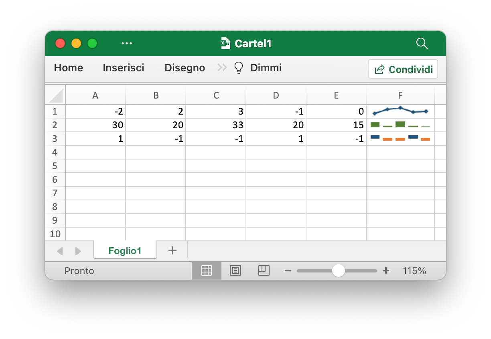
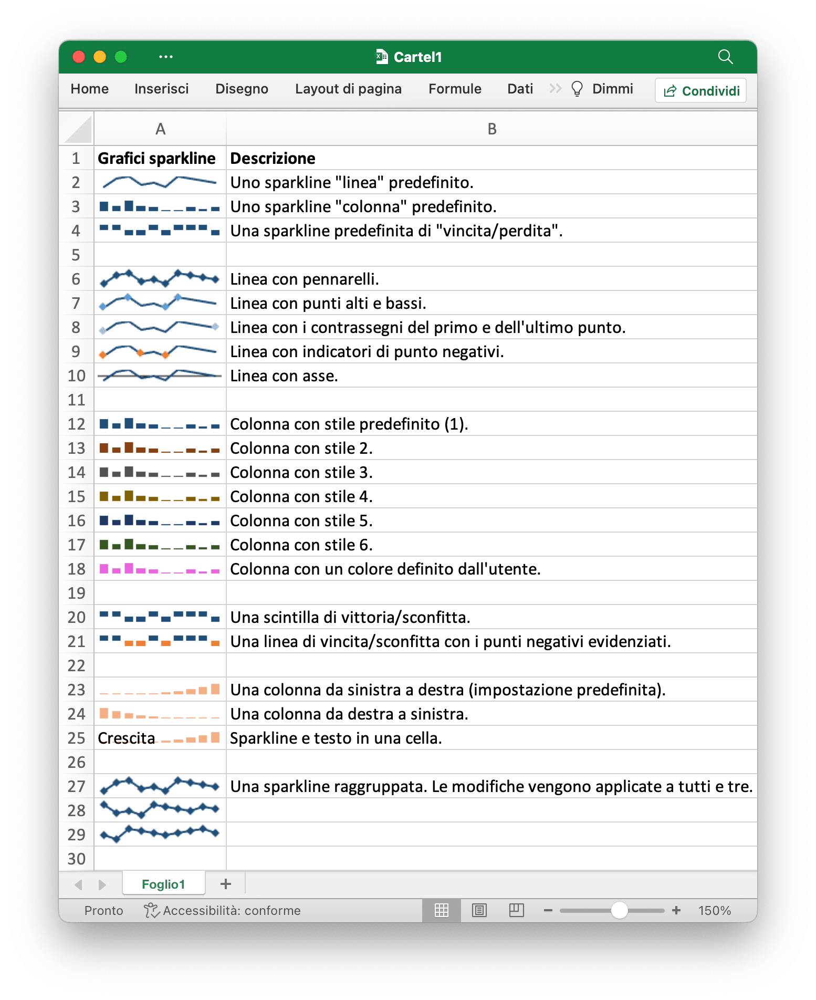

# Grafici sparkline

Grafici sparkline sono una funzionalità di Excel 2010+ che consente di aggiungere piccoli grafici alle celle del foglio di lavoro. Questi sono utili per mostrare le tendenze visive nei dati in un formato compatto.

<p align="center"></p>

[Grafici sparkline](https://en.wikipedia.org/wiki/Sparklines) è stato inventato da [Edward Tufte](https://en.wikipedia.org/wiki/Edward_Tufte).

## Inserire grafici sparkline

```go
func (f *File) AddSparkline(sheet string, opts *SparklineOptions) error
```

AddSparkline fornisce una funzione per inserire grafici sparkline nel foglio di lavoro mediante determinate opzioni di formattazione. Gli grafici sparkline sono piccoli grafici che si adattano a una singola cella e vengono utilizzati per mostrare le tendenze nei dati. I grafici sparkline sono una funzionalità solo di Excel 2010 e versioni successive. Puoi scriverli in un foglio di calcolo che può essere letto da Excel 2007 ma non verranno visualizzati. Ad esempio, aggiungi uno grafici sparkline raggruppato. Le modifiche vengono applicate a tutti e tre:

```go
err := f.AddSparkline("Foglio1", &excelize.SparklineOptions{
    Location: []string{"A1", "A2", "A3"},
    Range:    []string{"Foglio2!A1:J1", "Foglio2!A2:J2", "Foglio2!A3:J3"},
    Markers:  true,
})
```

<p align="center"></p>

Di seguito vengono mostrate le opzioni di formattazione dei grafici sparkline supportati da Excelize:

Parametro | Descrizione
---|---
Location    | Obbligatorio, deve avere lo stesso numero del parametro `Range`
Range       | Obbligatorio, deve avere lo stesso numero del parametro `Location`
Type        | Valore di enumerazione: `line`, `column`, `win_loss`
Style       | Intervallo di valori: 0 - 35
Hight       | Attiva/disattiva i punti alti della sparkline
Low         | Attiva/disattiva i punti bassi della sparkline
First       | Attiva/disattiva i primi punti della sparkline
Last        | Attiva/disattiva gli ultimi punti della sparkline
Negative    | Attiva/disattiva i punti negativi della sparkline
Markers     | Attiva/disattiva gli indicatori sparkline
Axis        | Utilizzato per specificare se mostrare l'asse orizzontale
Reverse     | Utilizzato per specificare se abilitare i dati di tracciamento da destra a sinistra
SeriesColor | Un colore RGB è specificato come `RRGGBB`
