

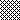

# Stile

L'allineamento mappa direttamente le impostazioni di allineamento delle celle.

```go
type Alignment struct {
    Horizontal      string
    Indent          int
    JustifyLastLine bool
    ReadingOrder    uint64
    RelativeIndent  int
    ShrinkToFit     bool
    TextRotation    int
    Vertical        string
    WrapText        bool
}
```

Border mappa direttamente le impostazioni del bordo delle celle.

```go
type Border struct {
    Type  string
    Color string
    Style int
}
```

Il carattere mappa direttamente le impostazioni dei caratteri.

```go
type Font struct {
    Bold         bool
    Italic       bool
    Underline    string
    Family       string
    Size         float64
    Strike       bool
    Color        string
    ColorIndexed int
    ColorTheme   *int
    ColorTint    float64
    VertAlign    string
}
```

Riempi direttamente mappa le impostazioni di riempimento delle celle.

```go
type Fill struct {
    Type         string
    Pattern      int
    Color        []string
    Shading      int
    Transparency int
}
```

La protezione mappa direttamente le impostazioni di protezione delle celle.

```go
type Protection struct {
    Hidden bool
    Locked bool
}
```

Stile mappa direttamente le impostazioni di stile delle celle.

```go
type Style struct {
    Border        []Border
    Fill          Fill
    Font          *Font
    Alignment     *Alignment
    Protection    *Protection
    NumFmt        int
    DecimalPlaces int
    CustomNumFmt  *string
    NegRed        bool
}
```

## Crea stile {#NewStyle}

```go
func (f *File) NewStyle(style *Style) (int, error)
```

NewStyle fornisce una funzione per creare lo stile per le celle in base a determinate opzioni di stile e restituisce l'indice di stile. Lo stesso indice di stile non può essere utilizzato in cartelle di lavoro diverse. Questa funzione è sicura per la concorrenza. Tieni presente che il campo `Font.Color` utilizza un colore RGB rappresentato nella notazione esadecimale `RRGGBB`.

### Confine {#border}

La tabella seguente mostra i tipi di bordo utilizzati in `Border.Type` supportati da Excelize:

Tipo|Descrizione|Tipo|Descrizione
---|---|---|---
left|Bordo sinistro|top|Bordo superiore
right|Confine destro|bottom|Bordo inferiore
diagonalDown|Bordo diagonale verso il basso|diagonalUp|Bordo diagonale verso l'alto

La tabella seguente mostra gli stili del bordo utilizzati in `Border.Style` supportati dal numero di indice Excelize:

Indice|Stile|Linea|Anteprima
---|---|---|---
0|Nessuno|0|
1|Continuo|1|
2|Continuo|2|
3|Trattino|1|
4|Punto|1|
5|Continuo|3|
6|Doppio|3|
7|Continuo|0|
8|Trattino|2|
9|Trattino Punto|1|
10|Trattino Punto|2|
11|Trattino Punto Punto|1|
12|Trattino Punto Punto|2|
13|SlantDash Punto|2|

La tabella seguente mostra gli stili del bordo utilizzati in `Border.Style` nell'ordine mostrato nella finestra di dialogo di Excel:

Indice|Anteprima|Indice|Anteprima
---|---|---|---
0||12|
7||13|
4||10|
11||8|
9||2|
3||5|
1||6|

### Tipo di riempimento {#fill}

`Fill.Type` serve a impostare il tipo di riempimento; i tipi supportati sono `gradient` o `pattern`. Quando si configura un riempimento di tipo `gradient`, è necessario fornire un valore valido per `Fill.Shading` e `Fill.Color` deve essere un array contenente esattamente due valori di colore validi. Quando si configura un riempimento di tipo `pattern`, è necessario fornire un valore valido per `Fill.Pattern` e `Fill.Color` deve essere un array contenente esattamente un valore di colore valido. Fare riferimento anche agli esempi in [`SetCellStyle`](cell.md#SetCellStyle).

### Riempimento di colore {#shading}

La tabella seguente mostra gli stili di ombreggiatura utilizzati in `Fill.Shading` supportati dal numero di indice Excelize:

Indice|Stile|Indice|Stile
---|---|---|---
0|Orizzontale|3|Diagonale verso il basso
1|Verticale|4|Dall'angolo
2|Diagonale in alto|5|Dal centro

### Riempimento a motivo {#pattern}

La tabella seguente mostra gli stili di modello utilizzati in `Fill.Pattern` supportati dal numero di indice Excelize:

Indice|Stile|Indice|Stile
---|---|---|---
0|Nessuno|10|
1||11|
2||12|
3||13|
4||14|
5||15|
6||16|
7||17|
8||18|
9|||

### Trasparenza {#transparency}

`Fill.Transparency` serve solo per impostare la trasparenza per grafici e forme, non per le celle. Il valore deve essere un numero compreso tra 0 e 100, che rappresenta lo 0% e il 100%. Il valore predefinito è 0, che rappresenta l'opacità completa (non la trasparenza).

### Allineare {#align}

#### Rientro

Il `Indent` è un valore intero, dove un incremento di 1 rappresenta 3 spazi. Indica il numero di spazi (del carattere di stile normale) di rientro per il testo in una cella. Il numero di spazi da rientrare viene calcolato come segue:

Numero di spazi da rientrare = valore del rientro * 3

Ad esempio, un valore di rientro pari a 1 significa che il testo inizia a 3 spazi di larghezza (del carattere di stile normale) dal bordo della cella. Nota: la larghezza di uno spazio è definita dal carattere. Sono supportati solo gli allineamenti orizzontali sinistro, destro e distribuito.

#### Allineamento orizzontale

La tabella seguente mostra il tipo di allineamento orizzontale delle celle utilizzato in `Alignment.Horizontal`:

Tipo|Stile
---|---
left|Sinistra (rientrato)
center|Centrato
right|Destra (rientrata)
fill|Riempimento
justify|Giustificato
centerContinuous|Colonna trasversale centrata
distributed|Allineamento decentralizzato (rientrato)

#### Allineamento verticale

La tabella seguente mostra il tipo di allineamento verticale delle celle utilizzato in `Alignment.Vertical`:

Tipo|Stile
---|---
top|Allineamento superiore
center|Centrato
justify|Giustificato
distributed|Allineamento decentralizzato

#### Ordine di lettura

`ReadingOrder` è un valore uint64 che indica se l'ordine di lettura della cella è da sinistra a destra, da destra a sinistra o dipendente dal contesto. il valore valido di questo campo era:

Valore|Descrizione
---|---
0 | Dipendente dal contesto: l'ordine di lettura è determinato scansionando il testo per il primo carattere diverso da uno spazio bianco: se è un carattere forte da destra a sinistra, l'ordine di lettura è da destra a sinistra; in caso contrario, l'ordine di lettura da sinistra a destra.
1 | Da sinistra a destra: l'ordine di lettura nella cella è da sinistra a destra, come in inglese.
2 | Da destra a sinistra: l'ordine di lettura è da destra a sinistra nella cella, come in ebraico.

#### Rientro relativo

`RelativeIndent` è un valore intero che indica il numero aggiuntivo di spazi di rientro da regolare per il testo in una cella.

### Sottolineatura del carattere {#underline}

La tabella seguente mostra il tipo di stile di sottolineatura del carattere utilizzato in `Font.Underline`:

Tipo|Stile
---|---
single|Single line
double|Double line

### Formato numero {#number_format}

I formati incorporati in tutte le lingue di Excel (il campo `Style.NumFmt`) sono mostrati nella tabella seguente:

Indice|Tipo
---|---
0|`General`
1|`0`
2|`0.00`
3|`#,##0`
4|`#,##0.00`
5|`($#,##0_);($#,##0)`
6|`($#,##0_);[Red]($#,##0)`
7|`($#,##0.00_);($#,##0.00)`
8|`($#,##0.00_);[Red]($#,##0.00)`
9|`0%`
10|`0.00%`
11|`0.00E+00`
12|`# ?/?`
13|`# ??/??`
14|`mm-dd-yy`
15|`d-mmm-yy`
16|`d-mmm`
17|`mmm-yy`
18|`h:mm AM/PM`
19|`h:mm:ss AM/PM`
20|`h:mm`
21|`h:mm:ss`
22|`m/d/yy h:mm`
...|`...`
37|`(#,##0_);(#,##0)`
38|`(#,##0_);[Red](#,##0)`
39|`(#,##0.00_);(#,##0.00)`
40|`(#,##0.00_);[Red](#,##0.00)`
41|`_(* #,##0_);_(* (#,##0);_(* "-"_);_(@_)`
42|`_($* #,##0_);_($* (#,##0);_($* "-"_);_(@_)`
43|`_(* #,##0.00_);_(* (#,##0.00);_(* "-"??_);_(@_)`
44|`_($* #,##0.00_);_($* (#,##0.00);_($* "-"??_);_(@_)`
45|`mm:ss`
46|`[h]:mm:ss`
47|`mm:ss.0`
48|`##0.0E+0`
49|`@`

#### Formato numerico cinese tradizionale

Codice del formato numerico nella lingua `zh-tw`:

Indice|Tipo
---|---
27|`[$-404]e/m/d`
28|`[$-404]e"年"m"月"d"日"`
29|`[$-404]e"年"m"月"d"日"`
30|`m/d/yy`
31|`yyyy"年"m"月"d"日"`
32|`hh"時"mm"分"`
33|`hh"時"mm"分"ss"秒"`
34|`上午/下午 hh"時"mm"分"`
35|`上午/下午 hh"時"mm"分"ss"秒"`
36|`[$-404]e/m/d`
50|`[$-404]e/m/d`
51|`[$-404]e"年"m"月"d"日"`
52|`上午/下午 hh"時"mm"分"`
53|`上午/下午 hh"時"mm"分"ss"秒"`
54|`[$-404]e"年"m"月"d"日"`
55|`上午/下午 hh"時"mm"分"`
56|`上午/下午 hh"時"mm"分"ss"秒"`
57|`[$-404]e/m/d`
58|`[$-404]e"年"m"月"d"日"`

#### Formato numerico cinese semplificato

Codice del formato numerico nella lingua `zh-cn`:

Indice|Tipo
---|---
27|`yyyy"年"m"月"`
28|`m"月"d"日"`
29|`m"月"d"日"`
30|`m-d-yy`
31|`yyyy"年"m"月"d"日"`
32|`h"时"mm"分"`
33|`h"时"mm"分"ss"秒"`
34|`上午/下午 h"时"mm"分"`
35|`上午/下午 h"时"mm"分"ss"秒`
36|`yyyy"年"m"月`
50|`yyyy"年"m"月`
51|`m"月"d"日`
52|`yyyy"年"m"月`
53|`m"月"d"日`
54|`m"月"d"日`
55|`上午/下午 h"时"mm"分`
56|`上午/下午 h"时"mm"分"ss"秒`
57|`yyyy"年"m"月`
58|`m"月"d"日"`

#### Formato numerico giapponese

Codice del formato numerico nella lingua `ja-jp`:

Indice|Tipo
---|---
27|`[$-411]ge.m.d`
28|`[$-411]ggge"年"m"月"d"日`
29|`[$-411]ggge"年"m"月"d"日`
30|`m/d/y`
31|`yyyy"年"m"月"d"日`
32|`h"時"mm"分`
33|`h"時"mm"分"ss"秒`
34|`yyyy"年"m"月`
35|`m"月"d"日`
36|`[$-411]ge.m.d`
50|`[$-411]ge.m.d`
51|`[$-411]ggge"年"m"月"d"日`
52|`yyyy"年"m"月`
53|`m"月"d"日`
54|`[$-411]ggge"年"m"月"d"日`
55|`yyyy"年"m"月`
56|`m"月"d"日`
57|`[$-411]ge.m.d`
58|`[$-411]ggge"年"m"月"d"日"`

#### Formato numerico coreano

Codice del formato numerico nella lingua `ko-kr`:

Indice|Tipo
---|---
27|`yyyy"年" mm"月" dd"日`
28|`mm-d`
29|`mm-d`
30|`mm-dd-y`
31|`yyyy"년" mm"월" dd"일`
32|`h"시" mm"분`
33|`h"시" mm"분" ss"초`
34|`yyyy-mm-d`
35|`yyyy-mm-d`
36|`yyyy"年" mm"月" dd"日`
50|`yyyy"年" mm"月" dd"日`
51|`mm-d`
52|`yyyy-mm-d`
53|`yyyy-mm-d`
54|`mm-d`
55|`yyyy-mm-d`
56|`yyyy-mm-d`
57|`yyyy"年" mm"月" dd"日`
58|`mm-dd`

#### Formato numerico in lingua tailandese

Codice del formato numerico nella lingua `th-th`:

Indice|Tipo
---|---
59|`t`
60|`t0.0`
61|`t#,##`
62|`t#,##0.0`
67|`t0`
68|`t0.00`
69|`t# ?/`
70|`t# ??/?`
71|`ว/ด/ปปป`
72|`ว-ดดด-ป`
73|`ว-ดด`
74|`ดดด-ป`
75|`ช:น`
76|`ช:นน:ท`
77|`ว/ด/ปปปป ช:น`
78|`นน:ท`
79|`[ช]:นน:ท`
80|`นน:ทท.`
81|`d/m/bb`

### Formato valuta

I formati di valuta incorporati di Excelize sono mostrati nella tabella seguente, supportano solo questi tipi nella tabella seguente (il numero di indice viene utilizzato solo per il markup e non viene utilizzato all'interno di un file Excel e non è possibile ottenere un valore formattato dalla funzione [`GetCellValue`](cell.md#GetCellValue)) attualmente:

Indice|Formato valuta
---|---
164|$
165|$ Inglese (Stati Uniti)
166|$ Cherokee (Stati Uniti)
167|$ Cinese (Singapore)
168|$ cinese (Taiwan)
169|$ Inglese (Australia)
170|$ Inglese (Belize)
171|$ Inglese (Canada)
172|$ Inglese (Giamaica)
173|$ Inglese (Nuova Zelanda)
174|$ Inglese (Singapore)
175|$ Inglese (Trinidad e Tobago)
176|$ inglese (Isole Vergini americane)
177|$ Inglese (Stati Uniti)
178|$ francese (Canada)
179|$ hawaiano (Stati Uniti)
180|$ Malese (Brunei)
181|$ Quechua (Ecuador)
182|$ Spagna (Cile)
183|$ Spagnoli (Colombia)
184|$ spagnolo (Ecuador)
185|$ Spagna (El Salvador)
186|$ Spagna (Messico)
187|$ spagnolo (Porto Rico)
188|$ spagnolo (Stati Uniti)
189|$ spagnolo (Uruguay)
190|£ inglese (Regno Unito)
191|£ Gaelico scozzese (Regno Unito)
192|£ Gallese (Regno Unito)
193|¥ Cinese (Cina)
194|¥ giapponese (Giappone)
195|¥ Sichuan Yi (Cina)
196|¥ Tibetano (Cina)
197|¥ Uigura (Cina)
198|֏ Armeno (Armenia)
199|؋ Pashtu (Afghanistan)
200|؋ Persiano (Afghanistan)
201|৳ Bengalese (Bangladesh)
202|៛ Khmer (Cambogia)
203|₡ Spagnolo (Costa Rica)
204|₦ Hausa (Nigeria)
205|₦ Igbo (Nigeria)
206|₩ Coreano (Corea del Sud)
207|₪ Ebraico (Israele)
208|₫ Vietnamita (Vietnam)
209|€ Basco (Spagna)
210|€ Bretone (Francia)
211|€ Catalano (Spagna)
212|€ Corso (Francia)
213|€ olandese (Belgio)
214|€ Olandese (Paesi Bassi)
215|€ Inglese (Irlanda)
216|€ Estone (Estonia)
217|€ Euro (€ 123)
218|€ Euro (123 €)
219|€ Finlandese (Finlandia)
220|€ francese (Belgio)
221|€ francese (Francia)
222|€ francese (Lussemburgo)
223|€ Francese (Monaco)
224|€ francese (Riunione)
225|€ Galiziano (Spagna)
226|€ Tedesco (Austria)
227|€ tedesco (tedesco)
228|€ Tedesco (Lussemburgo)
229|€ Greco (Grecia)
230|€ Inari Sami (Finlandia)
231|€ Irlandese (Irlanda)
232|€ italiano (Italia)
233|€ Latino (Italia)
234|€ Latino, serbo (Montenegro)
235|€ Larviano (Lettonia)
236|€ Lituano (Lituania)
237|€ Basso Sorabo (Germania)
238|€ Lussemburghese (Lussemburgo)
239|€ Maltese (Malta)
240|€ Sami del Nord (Finlandia)
241|€ Occitano (Francia)
242|€ Portoghese (Portogallo)
243|€ Serbo (Montenegro)
244|€ Skolt Sami (Finlandia)
245|€ slovacco (Slovacchia)
246|€ sloveno (Slovenia)
247|€ Spagnolo (Spagna)
248|€ svedese (Finlandia)
249|€ svizzero tedesco (Francia)
250|€ Alto Sorabo (Germania)
251|€ Frisone Occidentali (Paesi Bassi)
252|₭ Laotiano (Laos)
253|₮ Mongolo (Mongolia)
254|₮ Mongolo, Mongolo (Mongolia)
255|₱ Inglese (Filippine)
256|₱ Filippino (Filippine)
257|₴ Ucraino (Ucraina)
258|₸ kazako (Kazakistan)
259|₹ Arabo, Kashmir (India)
260|₹ Inglese (India)
261|₹ Gujarati (India)
262|₹ Hindi (India)
263|₹ Kannada (India)
264|₹ Kashmir (India)
265|₹ Konkani (India)
266|₹ Manipuri (India)
267|₹ Marathi (India)
268|₹ nepalese (India)
269|₹ Oriya (India)
270|₹ Punjabi (India)
271|₹ Sanscrito (India)
272|₹ Sindhi (India)
273|₹ Tamil (India)
274|₹ Urdu (India)
275|₺ Turco (Turchia)
276|₼ Azero (Azerbaigian)
277|₼ Cirillico, Azero (Azerbaigian)
278|₽ Russo (Russia)
279|₽ Sakha (Russia)
280|₾ Georgiano (Georgia)
281|B/. Spagnolo (Panama)
282|Br Oromo (Etiopia)
283|Br Somalia (Etiopia)
284|Br Tigrino (Etiopia)
285|Bs Quechua (Bolivia)
286|Bs Spagnolo (Bolivia)
287|BS. Spagnolo (Venezuela)
288|BWP Inglese (Botswana)
289|C$ Spagnolo (Nicaragua)
290|CA$ Latino, Inuktitut (Canada)
291|CA$ Mohawk (Canada)
292|CA$ Sillabici aborigeni canadesi unificati, Inuktitut (Canada)
293|CFA Francese (Mali)
294|CFA Francese (Senegal)
295|CFA Fulah (Senegal)
296|CFA Wolof (Senegal)
297|CHF Francese (Svizzera)
298|CHF Tedesco (Liechtenstein)
299|CHF Tedesco (Svizzera)
300|CHF Italiano (Svizzera)
301|CHF Romancio (Svizzera)
302|CLP Mapuche (Cile)
303|CN¥ Mongolo, Mongolo (Cina)
304|DZD Atlante Centrale Tamazight (Algeria)
305|FCFA Francese (Camerun)
306|Ft Ungherese (Ungheria)
307|G Francese (Haiti)
308|Gs. Spagnolo (Paraguay)
309|GTQ K'iche' (Guatemala)
310|HK$ Cinese (Hong Kong (Cina))
311|HK$ Inglese (Hong Kong (Cina))
312|HRK Croato (Croazia)
313|IDR Inglese (Indonesia)
314|IQD Arbico, curdo centrale (Iraq)
315|ISK Islandese (Islanda)
316|K Birmano (Myanmar (Birmania))
317|Kč Ceco (Repubblica Ceca)
318|KM Bosniaco (Bosnia ed Erzegovina)
319|KM Croato (Bosnia ed Erzegovina)
320|KM Latino, serbo (Bosnia ed Erzegovina)
321|kr Faroese (Isole Faroe)
322|kr Sami del Nord (Norvegia)
323|kr Sami del Nord (Svezia)
324|kr Bokmål norvegese (Norvegia)
325|kr Nynorsk norvegese (Norvegia)
326|kr Svedese (Svezia)
327|kr. Danese (Danimarca)
328|kr. Kalaallisut (Groenlandia)
329|Ksh Swahili (Kenia)
330|L Rumeno (Moldavia)
331|L Russo (Moldavia)
332|L Spagnolo (Honduras)
333|Lekë Albanese (Albania)
334|MAD Arabo, Atlante Centrale Tamazight (Marocco)
335|MAD Francese (Marocco)
336|MAD Tifinagh, Atlante Centrale Tamazight (Marocco)
337|MOP$ Cinese (Macao (Cina))
338|MVR Maldive
339|Nfk Tigrino (Eritrea)
340|NGN Bini (Nigeria)
341|NGN Fulah (Nigeria)
342|NGN Ibibio (Nigeria)
343|NGN Kanuri (Nigeria)
344|NOK Lule Sami (Norvegia)
345|NOK Sami del Sud (Norvegia)
346|NZ$ Maori (Nuova Zelanda)
347|PKR Sindhi (Pakistan)
348|PYG Guarani (Paraguay)
349|Q Spagnolo (Guatemala)
350|R Inglese (sudafricano)
351|R Inglese (sudafricano)
352|R Zulu (sudafricano)
353|R$ Portoghese (Brasile)
354|RD$ Spagnolo (Repubblica Dominicana)
355|RF Kinyarwanda (Ruanda)
356|RM Inglese (malese)
357|RM Malese (Malesia)
358|RON Rumeno (Romania)
359|Rp Indonesiano (indonesiano)
360|Rs Urdu (pakistano)
361|Rs. Tamil (Sri Lanka)
362|RSD Latino, serbo (Serbia)
363|RSD Serbo (Serbia)
364|RUB Baschiro (Russia)
365|RUB Tartaro (Russia)
366|S/. Quechua (Perù)
367|S/. Spagnolo (Perù)
368|SEK Lule Sami (Svezia)
369|SEK Sami del Sud (Svezia)
370|soʻm Latino, uzbeko (Uzbekistan)
371|soʻm Uzbeco (Uzbekistan)
372|SYP Siriaco (Siria)
373|THB Tailandese (Thailandia)
374|TMT Turkmeno (Turkmenistan)
375|US$ Inglese (Zimbabwe)
376|ZAR Sotho settentrionale (Sudafrica)
377|ZAR Sotho meridionale (Sudafrica)
378|ZAR Tsonga (Sudafrica)
379|ZAR Tswana (Sudafrica)
380|ZAR Venda (Sudafrica)
381|ZAR Xhosa (Sudafrica)
382|zł Polacco (Polonia)
383|ден Macedone (Macedonia)
384|KM Cirillico, bosniaco (Bosnia ed Erzegovina)
385|KM Serbo (Bosnia ed Erzegovina)
386|лв. Bulgaro (Bulgaria)
387|p. Bielorusso (Bielorussia)
388|сом Kirghizistan (Kirghizistan)
389|сом Tagico (Tagikistan)
390|ج.م. Arabo (Egitto)
391|د.أ. Arabo (Giordania)
392|د.أ. Arabo (Emirati Arabi Uniti)
393|د.ب. Arabo (Bahrein)
394|د.ت. Arabo (Tunisia)
395|د.ج. Arabo (Algeria)
396|د.ع. Arabo (Iraq)
397|د.ك. Arabo (Kuwait)
398|د.ل. Arabo (Libia)
399|د.م. Arabo (Marocco)
400|ر Punjabi (Pakistan)
401|ر.س. Arabo (Arabia Saudita)
402|ر.ع. Arabo (Oman)
403|ر.ق. Arabo (Qatar)
404|ر.ي. Arabo (Yemen)
405|ریال Persiano (Iran)
406|ل.س. Arabo (Siria)
407|ل.ل. Arabo (Libano)
408|ብር Amarico (Etiopia)
409|रू Nepal (Nepal)
410|රු. Singalese (Sri Lanka)
411|ADP
412|AED
413|AFA
414|AFN
415|ALL
416|AMD
417|ANG
418|AOA
419|ARS
420|ATS
421|AUD
422|AWG
423|AZM
424|AZN
425|BAM
426|BBD
427|BDT
428|BEF
429|BGL
430|BGN
431|BHD
432|BIF
433|BMD
434|BND
435|BOB
436|BOV
437|BRL
438|BSD
439|BTN
440|BWP
441|BYR
442|BZD
443|CAD
444|CDF
445|CHE
446|CHF
447|CHW
448|CLF
449|CLP
450|CNY
451|COP
452|COU
453|CRC
454|CSD
455|CUC
456|CVE
457|CYP
458|CZK
459|DEM
460|DJF
461|DKK
462|DOP
463|DZD
464|ECS
465|ECV
466|EEK
467|EGP
468|ERN
469|ESP
470|ETB
471|EUR
472|FIM
473|FJD
474|FKP
475|FRF
476|GBP
477|GEL
478|GHC
479|GHS
480|GIP
481|GMD
482|GNF
483|GRD
484|GTQ
485|GYD
486|HKD
487|HNL
488|HRK
489|HTG
490|HUF
491|IDR
492|IEP
493|ILS
494|INR
495|IQD
496|IRR
497|ISK
498|ITL
499|JMD
500|JOD
501|JPY
502|KAF
503|KES
504|KGS
505|KHR
506|KMF
507|KPW
508|KRW
509|KWD
510|KYD
511|KZT
512|LAK
513|LBP
514|LKR
515|LRD
516|LSL
517|LTL
518|LUF
519|LVL
520|LYD
521|MAD
522|MDL
523|MGA
524|MGF
525|MKD
526|MMK
527|MNT
528|MOP
529|MRO
530|MTL
531|MUR
532|MVR
533|MWK
534|MXN
535|MXV
536|MYR
537|MZM
538|MZN
539|NAD
540|NGN
541|NIO
542|NLG
543|NOK
544|NPR
545|NTD
546|NZD
547|OMR
548|PAB
549|PEN
550|PGK
551|PHP
552|PKR
553|PLN
554|PTE
555|PYG
556|QAR
557|ROL
558|RON
559|RSD
560|RUB
561|RUR
562|RWF
563|SAR
564|SBD
565|SCR
566|SDD
567|SDG
568|SDP
569|SEK
570|SGD
571|SHP
572|SIT
573|SKK
574|SLL
575|SOS
576|SPL
577|SRD
578|SRG
579|STD
580|SVC
581|SYP
582|SZL
583|THB
584|TJR
585|TJS
586|TMM
587|TMT
588|TND
589|TOP
590|TRL
591|TRY
592|TTD
593|TWD
594|TZS
595|UAH
596|UGX
597|USD
598|USN
599|USS
600|UYI
601|UYU
602|UZS
603|VEB
604|VEF
605|VND
606|VUV
607|WST
608|XAF
609|XAG
610|XAU
611|XB5
612|XBA
613|XBB
614|XBC
615|XBD
616|XCD
617|XDR
618|XFO
619|XFU
620|XOF
621|XPD
622|XPF
623|XPT
624|XTS
625|XXX
626|YER
627|YUM
628|ZAR
629|ZMK
630|ZMW
631|ZWD
632|ZWL
633|ZWN
634|ZWR

Il supporto Excelize imposta il formato numerico personalizzato per la cella. Ad esempio, imposta il numero come tipo di data nel formato Uruguay (spagnolo) per `Foglio1!A6`:

<p align="center"></p>

```go
f := excelize.NewFile()
defer func() {
    if err := f.Close(); err != nil {
        fmt.Println(err)
    }
}()
if err := f.SetSheetName("Sheet1", "Foglio1"); err != nil {
    fmt.Println(err)
    return
}
if err := f.SetCellValue("Foglio1", "A6", 42920.5); err != nil {
    fmt.Println(err)
    return
}
exp := "[$-380A]dddd\\,\\ dd\" de \"mmmm\" de \"yyyy;@"
style, err := f.NewStyle(&excelize.Style{CustomNumFmt: &exp})
if err != nil {
    fmt.Println(err)
    return
}
err = f.SetCellStyle("Foglio1", "A6", "A6", style)
```

Cella `Foglio1!A6` nell'applicazione Excel: `martes, 04 de Julio de 2017`

## Ottieni stile {#GetStyle}

```go
func (f *File) GetStyle(idx int) (*Style, error)
```

GetStyle fornisce una funzione per ottenere la definizione dello stile in base all'indice di stile specificato.

## Imposta lo stile della colonna {#SetColStyle}

```go
func (f *File) SetColStyle(sheet, columns string, styleID int) error
```

SetColStyle fornisce una funzione per impostare lo stile delle colonne in base al nome del foglio di lavoro, all'intervallo di colonne e all'ID di stile. Questa funzione è sicura per la concorrenza. Tieni presente che questo sovrascriverà gli stili esistenti per le colonne, non aggiungerà o unirà lo stile con gli stili esistenti.

Ad esempio, imposta lo stile della colonna `H` su `Foglio1`:

```go
err = f.SetColStyle("Foglio1", "H", style)
```

Imposta lo stile delle colonne `C:F` su `Foglio1`:

```go
err = f.SetColStyle("Foglio1", "C:F", style)
```

## Ottieni lo stile della colonna {#GetColStyle}

```go
func (f *File) GetColStyle(sheet, col string) (int, error)
```

GetColStyle fornisce una funzione per ottenere l'ID dello stile della colonna in base al nome del foglio di lavoro e al nome della colonna. Questa funzione è sicura per la concorrenza.

## Imposta lo stile della riga {#SetRowStyle}

```go
func (f *File) SetRowStyle(sheet string, start, end, styleID int) error
```

SetRowStyle fornisce una funzione per impostare lo stile delle righe in base al nome del foglio di lavoro, all'intervallo di righe e all'ID di stile. Tieni presente che questo sovrascriverà gli stili esistenti per le righe, non aggiungerà o unirà lo stile con gli stili esistenti.

Ad esempio imposta lo stile della riga 1 su `Foglio1`:

```go
err := f.SetRowStyle("Foglio1", 1, 1, styleID)
```

Imposta lo stile delle righe da 1 a 10 su `Foglio1`:

```go
err := f.SetRowStyle("Foglio1", 1, 10, styleID)
```

## Imposta il carattere predefinito {#SetDefaultFont}

```go
func (f *File) SetDefaultFont(fontName string)
```

SetDefaultFont modifica il carattere predefinito nella cartella di lavoro.

## Ottieni il carattere predefinito {#GetDefaultFont}

```go
func (f *File) GetDefaultFont() string
```

GetDefaultFont fornisce il nome del carattere predefinito attualmente impostato nella cartella di lavoro. Il foglio di calcolo generato dal carattere predefinito di Excelize è Calibri.
