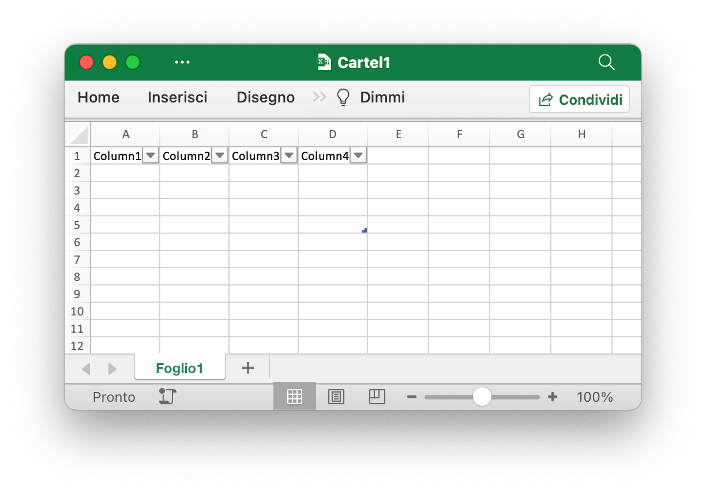
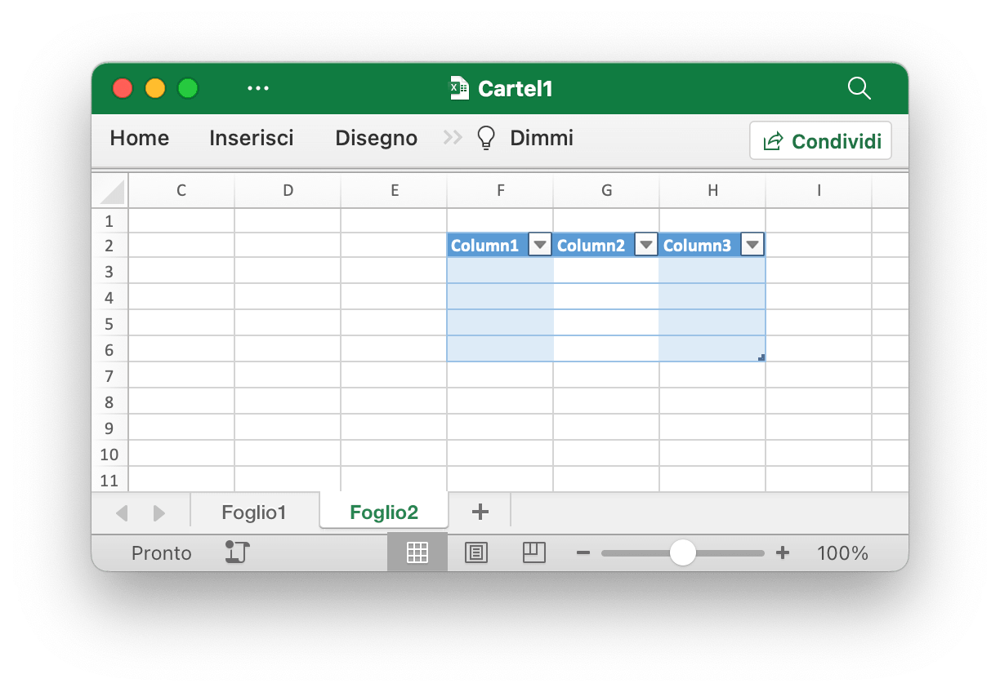
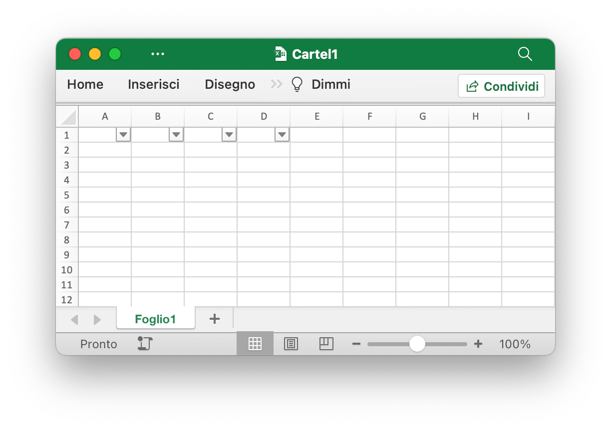
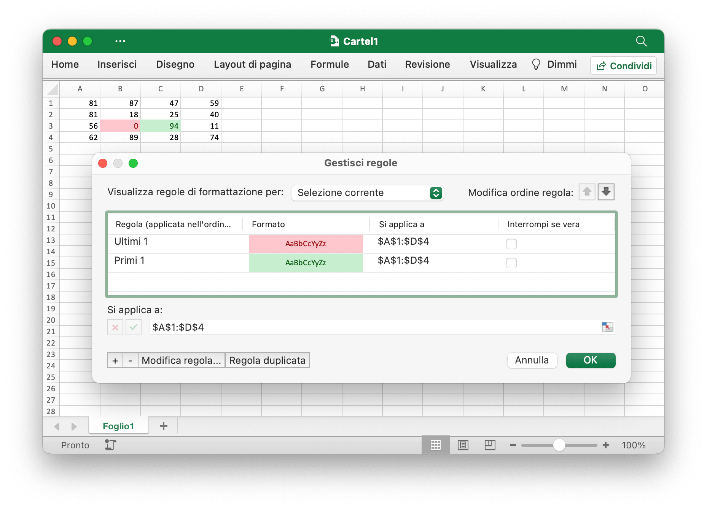
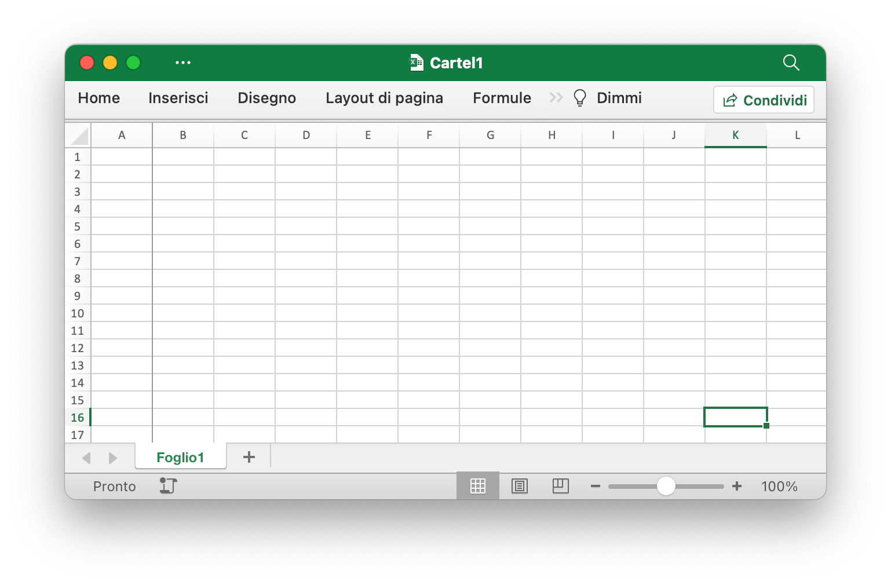
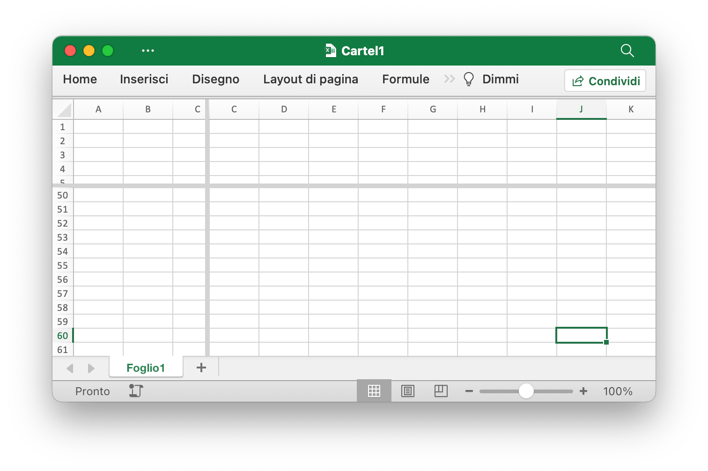

# Utilità

ZipWriter definisce un'interfaccia per la scrittura di file in un archivio ZIP. Fornisce metodi per creare nuovi file all'interno dell'archivio, aggiungere file da un file system e chiudere l'archivio al termine della scrittura.

```go
type ZipWriter interface {
    Create(name string) (io.Writer, error)
    AddFS(fsys fs.FS) error
    Close() error
}
```

## Aggiungi tabella {#AddTable}

```go
func (f *File) AddTable(sheet string, table *Table) error
```

AddTable fornisce il metodo per aggiungere una tabella in un foglio di lavoro in base al nome del foglio di lavoro, al riferimento all'intervallo e al set di formati specificati.

- Esempio 1, crea una tabella di `A1:D5` su `Foglio1`:

<p align="center"></p>

```go
err := f.AddTable("Foglio1", &excelize.Table{Range: "A1:D5"})
```

- Esempio 2, crea una tabella di `F2:H6` su `Foglio2` con il formato impostato:

<p align="center"></p>

```go
disable := false
err := f.AddTable("Foglio2", &excelize.Table{
    Range:             "F2:H6",
    Name:              "tavolo",
    StyleName:         "TableStyleMedium2",
    ShowFirstColumn:   true,
    ShowLastColumn:    true,
    ShowRowStripes:    &disable,
    ShowColumnStripes: true,
})
```

Tieni presente che la tabella deve contenere almeno due righe inclusa l'intestazione. Le celle di intestazione devono contenere stringhe e devono essere univoche e devono impostare i dati della riga di intestazione della tabella prima di chiamare la funzione AddTable. Riferimento a più intervalli di tabelle che non possono avere un'intersezione.

`Name`: il nome della tabella, nello stesso nome del foglio di lavoro della tabella, deve essere univoco.

`StyleName`: I nomi degli stili di tabella incorporati:

```text
TableStyleLight1 - TableStyleLight21
TableStyleMedium1 - TableStyleMedium28
TableStyleDark1 - TableStyleDark11
```

Indice|Stile|Indice|Stile|Indice|Stile
---|---|---|---|---|---
||TableStyleLight1||TableStyleLight2|
TableStyleLight3||TableStyleLight4||TableStyleLight5|
TableStyleLight6||TableStyleLight7||TableStyleLight8|
TableStyleLight9||TableStyleLight10||TableStyleLight11|
TableStyleLight12||TableStyleLight13||TableStyleLight14|
TableStyleLight15||TableStyleLight16||TableStyleLight17|
TableStyleLight18||TableStyleLight19||TableStyleLight20|
TableStyleLight21||TableStyleMedium1||TableStyleMedium2|
TableStyleMedium3||TableStyleMedium4||TableStyleMedium5|
TableStyleMedium6||TableStyleMedium7||TableStyleMedium8|
TableStyleMedium9||TableStyleMedium10||TableStyleMedium11|
TableStyleMedium12||TableStyleMedium13||TableStyleMedium14|
TableStyleMedium15||TableStyleMedium16||TableStyleMedium17|
TableStyleMedium18||TableStyleMedium19||TableStyleMedium20|
TableStyleMedium21||TableStyleMedium22||TableStyleMedium23|
TableStyleMedium24||TableStyleMedium25||TableStyleMedium26|
TableStyleMedium27||TableStyleMedium28||TableStyleDark1|
TableStyleDark2||TableStyleDark3||TableStyleDark4|
TableStyleDark5||TableStyleDark6||TableStyleDark7|
TableStyleDark8||TableStyleDark9||TableStyleDark10|
TableStyleDark11|||||

## Ottieni tavoli {#GetTables}

```go
func (f *File) GetTables(sheet string) ([]Table, error)
```

GetTables fornisce il metodo per ottenere tutte le tabelle in un foglio di lavoro in base al nome del foglio di lavoro specificato.

## Elimina tabella {#DeleteTable}

```go
func (f *File) DeleteTable(name string) error
```

DeleteTable fornisce il metodo per eliminare la tabella in base al nome della tabella specificata.

## Filtro automatico {#AutoFilter}

```go
func (f *File) AutoFilter(sheet, rangeRef string, opts []AutoFilterOptions) error
```

`AutoFilter` fornisce il metodo per aggiungere un filtro automatico in un foglio di lavoro in base al nome del foglio di lavoro, al riferimento all'intervallo e alle impostazioni. Un filtro automatico in Excel è un modo per filtrare un intervallo di dati 2D in base ad alcuni semplici criteri.

Esempio 1, applicazione di un filtro automatico a un intervallo di celle `A1:D4` nel `Foglio1`:

<p align="center"></p>

```go
err := f.AutoFilter("Foglio1", "A1:D4", []excelize.AutoFilterOptions{})
```

Esempio 2, filtrare i dati in un filtro automatico:

```go
err := f.AutoFilter("Foglio1", "A1:D4", []excelize.AutoFilterOptions{
    {Column: "B", Expression: "x != blanks"},
})
```

`Column` definisce le colonne di filtro in un intervallo di filtro automatico basato su criteri semplici.

Non è sufficiente specificare semplicemente la condizione del filtro. È inoltre necessario nascondere tutte le righe che non corrispondono alla condizione del filtro. Le righe vengono nascoste utilizzando il metodo [`SetRowVisible()`](sheet.md#SetRowVisible). Excelize non può filtrare automaticamente le righe poiché questo non fa parte del formato del file.

Impostazione dei criteri di filtro per una colonna:

`Expression` definisce le condizioni, per impostare i criteri di filtro sono disponibili i seguenti operatori:

```text
==
!=
>
<
>=
<=
and
or
```

Un'espressione può comprendere una singola istruzione o due istruzioni separate dagli operatori `and` e `or`. Per esempio:

```text
x <  2000
x >  2000
x == 2000
x >  2000 and x <  5000
x == 2000 or  x == 5000
```

È possibile filtrare i dati vuoti o non vuoti utilizzando un valore Blanks o NonBlanks nell'espressione:

```text
x == Blanks
x == NonBlanks
```

Office Excel consente anche alcune semplici operazioni di corrispondenza delle stringhe:

```text
x == b*      // inizia con b
x != b*      // non inizia con b
x == *b      // termina con b
x != *b      // non finisce con b
x == *b*     // contiene b
x != *b*     // non contiene b
```

Puoi anche utilizzare `*` per corrispondere a qualsiasi carattere o numero e `?` per corrispondere a qualsiasi singolo carattere o numero. Nessun altro quantificatore di espressioni regolari è supportato dai filtri di Excel. È possibile eseguire l'escape dei caratteri delle espressioni regolari di Excel utilizzando `~`.

La variabile segnaposto `x` negli esempi precedenti può essere sostituita da qualsiasi stringa semplice. Il nome effettivo del segnaposto viene ignorato internamente, quindi i seguenti sono tutti equivalenti:

```text
x     < 2000
col   < 2000
Price < 2000
```

## Aggiorna il valore collegato {#UpdateLinkedValue}

```go
func (f *File) UpdateLinkedValue() error
```

UpdateLinkedValue corregge i valori collegati all'interno di un foglio di calcolo che non vengono aggiornati in Office Excel 2007 e 2010. Questa funzione rimuoverà il tag del valore quando una cella ha un valore collegato. Riferimento [https://learn.microsoft.com/en-us/archive/msdn-technet-forums/e16bae1f-6a2c-4325-8013-e989a3479066](https://learn.microsoft.com/en-us/archive/msdn-technet-forums/e16bae1f-6a2c-4325-8013-e989a3479066). Avviso: dopo aver aperto il file del foglio di calcolo, Excel aggiornerà il valore collegato e genererà un nuovo valore e richiederà o meno il salvataggio del file.

L'effetto di svuotare la cache delle celle sulla cartella di lavoro appare come una modifica al tag `<v>`, ad esempio, la cache delle celle prima di svuotare:

```xml
<row r="19">
    <c r="B19">
        <f>SUM(Sheet2!D2,Sheet2!D11)</f>
        <v>100</v>
     </c>
</row>
```

Dopo aver svuotato la cache della cella:

```xml
<row r="19">
    <c r="B19">
        <f>SUM(Sheet2!D2,Sheet2!D11)</f>
    </c>
</row>
```

## Nome cella divisa {#SplitCellName}

```go
func SplitCellName(cell string) (string, int, error)
```

SplitCellName divide il nome della cella in nome di colonna e numero di riga. Per esempio:

```go
excelize.SplitCellName("AK74") // ritorno "AK", 74, nil
```

## Unisciti al nome della cella {#JoinCellName}

```go
func JoinCellName(col string, row int) (string, error)
```

JoinCellName unisce il nome della cella dal nome della colonna e dal numero della riga.

## Dal nome della colonna al numero {#ColumnNameToNumber}

```go
func ColumnNameToNumber(name string) (int, error)
```

ColumnNameToNumber fornisce una funzione per convertire il nome della colonna del foglio Excel in `int`. Il nome della colonna non fa distinzione tra maiuscole e minuscole. La funzione restituisce un errore se il nome della colonna non è corretto. Per esempio:

```go
excelize.ColumnNameToNumber("AK") // ritorno 37, nil
```

## Numero di colonna da nominare {#ColumnNumberToName}

```go
func ColumnNumberToName(num int) (string, error)
```

ColumnNumberToName fornisce una funzione per convertire il numero intero nel titolo della colonna del foglio Excel. Per esempio:

```go
excelize.ColumnNumberToName(37) // ritorno "AK", nil
```

## Nome della cella in coordinate {#CellNameToCoordinates}

```go
func CellNameToCoordinates(cell string) (int, int, error)
```

CellNameToCoordinates converte il nome alfanumerico della cella nelle coordinate `[X, Y]` o restituisce un errore. Per esempio:

```go
excelize.CellNameToCoordinates("A1") // ritorno 1, 1, nil
excelize.CellNameToCoordinates("Z3") // ritorno 26, 3, nil
```

## Coordinate al nome della cella {#CoordinatesToCellName}

```go
func CoordinatesToCellName(col, row int, abs ...bool) (string, error)
```

CoordinatesToCellName converte le coordinate `[X, Y]` in un nome di cella alfanumerico o restituisce un errore. Per esempio:

```go
excelize.CoordinatesToCellName(1, 1) // ritorno "A1", nil
excelize.CoordinatesToCellName(1, 1, true) // ritorno "$A$1", nil
```

## Crea uno stile condizionale {#NewConditionalStyle}

```go
func (f *File) NewConditionalStyle(style *Style) (int, error)
```

NewConditionalStyle fornisce una funzione per creare uno stile per il formato condizionale in base al formato di stile specificato. I parametri sono gli stessi della funzione [`NewStyle`](style.md#NewStyle). Tieni presente che il campo colore utilizza il codice colore RGB e attualmente supporta solo l'impostazione del carattere, dei riempimenti, dell'allineamento e dei bordi.

## Ottieni uno stile condizionale {#GetConditionalStyle}

```go
func (f *File) GetConditionalStyle(idx int) (*Style, error)
```

GetConditionalStyle restituisce la definizione di stile di formato condizionale in base all'indice di stile specificato.

## Imposta il formato condizionale {#SetConditionalFormat}

```go
func (f *File) SetConditionalFormat(sheet, rangeRef string, opts []ConditionalFormatOptions) error
```

SetConditionalFormat fornisce una funzione per creare una regola di formattazione condizionale per il valore della cella. La formattazione condizionale è una funzionalità di Office Excel che consente di applicare un formato a una cella o a un intervallo di celle in base a determinati criteri.

L'opzione `Type` è un parametro obbligatorio e non ha un valore predefinito. I valori di tipo consentiti e i parametri associati sono:

<table>
    <thead>
        <tr>
            <th>Tipo</th>
            <th>Parametri</th>
        </tr>
    </thead>
    <tbody>
        <tr>
            <td rowspan=4>cell</td>
            <td>Criteria</td>
        </tr>
        <tr>
            <td>Value</td>
        </tr>
        <tr>
            <td>MinValue</td>
        </tr>
        <tr>
            <td>MaxValue</td>
        </tr>
        <tr>
            <td>time_period</td>
            <td>Criteria</td>
        </tr>
        <tr>
            <td rowspan=2>text</td>
            <td>Criteria</td>
        </tr>
        <tr>
            <td>Value</td>
        </tr>
        <tr>
            <td>average</td>
            <td>Criteria</td>
        </tr>
        <tr>
            <td>duplicate</td>
            <td>(nessuno)</td>
        </tr>
        <tr>
            <td>unique</td>
            <td>(nessuno)</td>
        </tr>
        <tr>
            <td rowspan=2>top</td>
            <td>Criteria</td>
        </tr>
        <tr>
            <td>Value</td>
        </tr>
        <tr>
            <td rowspan=2>bottom</td>
            <td>Criteria</td>
        </tr>
        <tr>
            <td>Value</td>
        </tr>
        <tr>
            <td>blanks</td>
            <td>(nessuno)</td>
        </tr>
        <tr>
            <td>no_blanks</td>
            <td>(nessuno)</td>
        </tr>
        <tr>
            <td>errors</td>
            <td>(nessuno)</td>
        </tr>
        <tr>
            <td>no_errors</td>
            <td>(nessuno)</td>
        </tr>
        <tr>
            <td rowspan=6>2_color_scale</td>
            <td>MinType</td>
        </tr>
        <tr>
            <td>MaxType</td>
        </tr>
        <tr>
            <td>MinValue</td>
        </tr>
        <tr>
            <td>MaxValue</td>
        </tr>
        <tr>
            <td>MinColor</td>
        </tr>
        <tr>
            <td>MaxColor</td>
        </tr>
        <tr>
            <td rowspan=9>3_color_scale</td>
            <td>MinType</td>
        </tr>
        <tr>
            <td>MidType</td>
        </tr>
        <tr>
            <td>MaxType</td>
        </tr>
        <tr>
            <td>MinValue</td>
        </tr>
        <tr>
            <td>MidValue</td>
        </tr>
        <tr>
            <td>MaxValue</td>
        </tr>
        <tr>
            <td>MinColor</td>
        </tr>
        <tr>
            <td>MidColor</td>
        </tr>
        <tr>
            <td>MaxColor</td>
        </tr>
        <tr>
            <td rowspan=9>data_bar</td>
            <td>MinType</td>
        </tr>
        <tr>
            <td>MaxType</td>
        </tr>
        <tr>
            <td>MinValue</td>
        </tr>
        <tr>
            <td>MaxValue</td>
        </tr>
        <tr>
            <td>BarBorderColor</td>
        </tr>
        <tr>
            <td>BarColor</td>
        </tr>
        <tr>
            <td>BarDirection</td>
        </tr>
        <tr>
            <td>BarOnly</td>
        </tr>
        <tr>
            <td>BarSolid</td>
        </tr>
        <tr>
            <td rowspan=3>iconSet</td>
            <td>IconStyle</td>
        </tr>
        <tr>
            <td>ReverseIcons</td>
        </tr>
        <tr>
            <td>IconsOnly</td>
        </tr>
        <tr>
            <td>formula</td>
            <td>Criteria</td>
        </tr>
    </tbody>
</table>

Il parametro `Criteria` viene utilizzato per impostare i criteri in base ai quali verranno valutati i dati della cella. Non ha un valore predefinito. I criteri più comuni applicati a `excelize.ConditionalFormatOptions{Type: "cell"}` sono:

Carattere di descrizione del testo|Rappresentazione simbolica
---|---
between|
not between|
equal to|==
not equal to|!=
greater than|>
less than|<
greater than or equal to|>=
less than or equal to|<=

Puoi utilizzare le stringhe di descrizione testuale di Excel, nella prima colonna in alto, o le alternative simboliche più comuni.

Ulteriori criteri specifici per altri tipi di formato condizionale sono mostrati nelle sezioni pertinenti di seguito.

`Value`: Il valore viene generalmente utilizzato insieme al parametro `Criteria` per impostare la regola in base alla quale verranno valutati i dati della cella:

```go
err := f.SetConditionalFormat("Foglio1", "D1:D10",
    []excelize.ConditionalFormatOptions{
        {
            Type:     "cell",
            Criteria: ">",
            Format:   &format,
            Value:    "6",
        },
    },
)
```

La proprietà `Value` può anche essere un riferimento di cella:

```go
err := f.SetConditionalFormat("Foglio1", "D1:D10",
    []excelize.ConditionalFormatOptions{
        {
            Type:     "cell",
            Criteria: ">",
            Format:   &format,
            Value:    "$C$1",
        },
    },
)
```

type: `Format` - Il parametro `Format` viene utilizzato per specificare il formato che verrà applicato alla cella quando viene soddisfatto il criterio di formattazione condizionale. Il formato viene creato utilizzando il metodo [`NewConditionalStyle()`](utils.md#NewConditionalStyle) allo stesso modo dei formati di cella:

```go
format, err := f.NewConditionalStyle(
    &excelize.Style{
        Font: &excelize.Font{Color: "9A0511"},
        Fill: excelize.Fill{
            Type: "pattern", Color: []string{"FEC7CE"}, Pattern: 1,
        },
    },
)
if err != nil {
    fmt.Println(err)
}
err = f.SetConditionalFormat("Foglio1", "D1:D10",
    []excelize.ConditionalFormatOptions{
        {Type: "cell", Criteria: ">", Format: &format, Value: "6"},
    },
)
```

Nota: in Excel, un formato condizionale viene sovrapposto al formato cella esistente e non tutte le proprietà del formato cella possono essere modificate. Le proprietà che non possono essere modificate in un formato condizionale sono il nome del carattere, la dimensione del carattere, l'apice e il pedice, i bordi diagonali, tutte le proprietà di allineamento e tutte le proprietà di protezione.

Excel specifica alcuni formati predefiniti da utilizzare con la formattazione condizionale. Questi possono essere replicati utilizzando i seguenti formati Excelize:

```go
// Formato rosa per condizionale cattivo.
format1, err := f.NewConditionalStyle(
    &excelize.Style{
        Font: &excelize.Font{Color: "9A0511"},
        Fill: excelize.Fill{
            Type: "pattern", Color: []string{"FEC7CE"}, Pattern: 1,
        },
    },
)

// Formato giallo chiaro per condizionale neutro.
format2, err := f.NewConditionalStyle(
    &excelize.Style{
        Font: &excelize.Font{Color: "9B5713"},
        Fill: excelize.Fill{
            Type: "pattern", Color: []string{"FEEAA0"}, Pattern: 1,
        },
    },
)

// Formato verde chiaro per un buon condizionale.
format3, err := f.NewConditionalStyle(
    &excelize.Style{
        Font: &excelize.Font{Color: "09600B"},
        Fill: excelize.Fill{
            Type: "pattern", Color: []string{"C7EECF"}, Pattern: 1,
        },
    },
)
```

type: `MinValue` - Il parametro `MinValue` viene utilizzato per impostare il valore limite inferiore quando il `Criteria` è `between` o `not between`.

```go
// Regola delle celle evidenziate: tra...
err := f.SetConditionalFormat("Foglio1", "A1:A10",
    []excelize.ConditionalFormatOptions{
        {
            Type:     "cell",
            Criteria: "between",
            Format:   &format,
            MinValue: "6",
            MaxValue: "8",
        },
    },
)
```

type: `MaxValue` - Il parametro `maximum` viene utilizzato per impostare il valore limite superiore quando i criteri sono `between` o `not between`. Vedi l'esempio precedente.

type: `average` - Il tipo `average` viene utilizzato per specificare il formato condizionale dello stile "Media" di Office Excel:

```go
// Regole alto/basso: sopra la media...
err := f.SetConditionalFormat("Foglio1", "A1:A10",
    []excelize.ConditionalFormatOptions{
        {
            Type:         "average",
            Criteria:     "=",
            Format:       &format1,
            AboveAverage: true,
        },
    },
)

// Regole alto/basso: sotto la media...
err := f.SetConditionalFormat("Foglio1", "B1:B10",
    []excelize.ConditionalFormatOptions{
        {
            Type:         "average",
            Criteria:     "=",
            Format:       &format2,
            AboveAverage: false,
        },
    },
)
```

type: `duplicate` - Il tipo `duplicate` viene utilizzato per evidenziare le celle duplicate in un intervallo:

```go
// Regole di evidenziazione delle celle: Valori duplicati...
err := f.SetConditionalFormat("Foglio1", "A1:A10",
    []excelize.ConditionalFormatOptions{
        {Type: "duplicate", Criteria: "=", Format: &format},
    },
)
```

type: `unique` - Il tipo `unique` viene utilizzato per evidenziare celle univoche in un intervallo:

```go
// Regole di evidenziazione delle celle: Diverso da...
err := f.SetConditionalFormat("Foglio1", "A1:A10",
    []excelize.ConditionalFormatOptions{
        {Type: "unique", Criteria: "=", Format: &format},
    },
)
```

type: `top` - The `top` type is used to specify the top n values by number or percentage in a range:

```go
// Regole Alto/Basso: Primi 10.
err := f.SetConditionalFormat("Foglio1", "H1:H10",
    []excelize.ConditionalFormatOptions{
        {
            Type:     "top",
            Criteria: "=",
            Format:   &format,
            Value:    "6",
        },
    },
)
```

I criteri possono essere utilizzati per indicare che è richiesta una condizione percentuale:

```go
err := f.SetConditionalFormat("Foglio1", "A1:A10",
    []excelize.ConditionalFormatOptions{
        {
            Type:     "top",
            Criteria: "=",
            Format:   &format,
            Value:    "6",
            Percent:  true,
        },
    },
)
```

type: `2_color_scale` - Il tipo `2_color_scale` viene utilizzato per specificare il formato condizionale dello stile "2 Color Scale" di Excel:

```go
// Scale di colore: 2 colori.
err := f.SetConditionalFormat("Foglio1", "A1:A10",
    []excelize.ConditionalFormatOptions{
        {
            Type:     "2_color_scale",
            Criteria: "=",
            MinType:  "min",
            MaxType:  "max",
            MinColor: "#F8696B",
            MaxColor: "#63BE7B",
        },
    },
)
```

Questo tipo condizionale può essere modificato con `MinType`, `MaxType`, `MinValue`, `MaxValue`, `MinColor` e `MaxColor`, vedi sotto.

type: `3_color_scale` - Il tipo `3_color_scale` viene utilizzato per specificare il formato condizionale dello stile "Scala a 3 colori" di Excel:

```go
// Scale di colore: 3 colori.
err := f.SetConditionalFormat("Foglio1", "A1:A10",
    []excelize.ConditionalFormatOptions{
        {
            Type:     "3_color_scale",
            Criteria: "=",
            MinType:  "min",
            MidType:  "percentile",
            MaxType:  "max",
            MinColor: "#F8696B",
            MidColor: "#FFEB84",
            MaxColor: "#63BE7B",
        },
    },
)
```

Questo tipo condizionale può essere modificato con `MinType`, `MidType`, `MaxType`, `MinValue`, `MidValue`, `MaxValue`, `MinColor`, `MidColor` e `MaxColor`, vedi sotto.

type: `data_bar` - Il tipo `data_bar` viene utilizzato per specificare il formato condizionale in stile "Barra dati" di Excel.

`MinType` -Le proprietà `MinType` e `MaxType` sono disponibili quando il tipo di formattazione condizionale è `2_color_scale`, `3_color_scale` o `data_bar`. Il `MidType` è disponibile per `3_color_scale`. Le proprietà vengono utilizzate come segue:

```go
// Barre dati: riempimento sfumato.
err := f.SetConditionalFormat("Foglio1", "K1:K10",
    []excelize.ConditionalFormatOptions{
        {
            Type:     "data_bar",
            Criteria: "=",
            MinType:  "min",
            MaxType:  "max",
            BarColor: "#638EC6",
        },
    },
)
```

I tipi `min/mid/max` disponibili sono:

Parametro|Spiegazione
---|---
min|Valore MinValue (solo per `MinType`)
num|Numerico
percent|Percentuale
percentile|percentile
formula|Formula
max|Valore massimo (solo per "MaxType")

`MidType` - Utilizzato per `3_color_scale`. Uguale a `MinType`, vedi sopra.

`MaxType` - Uguale a `MinType`, vedi sopra.

`MinValue` - Le proprietà `MinValue` e `MaxValue` sono disponibili quando il tipo di formattazione condizionale è `2_color_scale`, `3_color_scale` o `data_bar`. Il `MidValue` è disponibile per `3_color_scale`.

`MidValue` - Utilizzato per `3_color_scale`. Uguale a `MinValue`, vedere sopra.

`MaxValue` - Uguale a `MinValue`, vedere sopra.

`MinColor` - Le proprietà `MinColor` e `MaxValue` sono disponibili quando il tipo di formattazione condizionale è `2_color_scale`, `3_color_scale` o `data_bar`. Il `MidColor` è disponibile per `3_color_scale`. Le proprietà vengono utilizzate come segue:

```go
// Scale di colore: 3 colori.
err := f.SetConditionalFormat("Foglio1", "B1:B10",
    []excelize.ConditionalFormatOptions{
        {
            Type:     "3_color_scale",
            Criteria: "=",
            MinType:  "min",
            MidType:  "percentile",
            MaxType:  "max",
            MinColor: "#F8696B",
            MidColor: "#FFEB84",
            MaxColor: "#63BE7B",
        },
    },
)
```

`MidColor` - Utilizzato per `3_color_scale`. Uguale a `MinColor`, vedi sopra.

`MaxColor` - Uguale a `MinColor`, vedi sopra.

`BarColor` - Utilizzato per `data_bar`. Uguale a `MinColor`, vedi sopra.

`BarBorderColor` - Utilizzato per imposta il colore della linea del bordo di una barra dati, è visibile solo in Excel 2010 e versioni successive.

`BarDirection` - Utilizzato per impostare la direzione delle barre dati. Le opzioni disponibili sono:

Valore|Spiegazione
---|---
context     | La direzione della barra dati viene impostata dall'applicazione foglio di calcolo in base al contesto dei dati visualizzati.
leftToRight | La direzione della barra dati è da destra a sinistra.
rightToLeft | La direzione della barra dati è da sinistra a destra.

`BarOnly` - Utilizzato per impostare visualizza i dati della barra ma non i dati nelle celle.

`BarSolid` - Utilizzato per attivare un riempimento continuo (non sfumato) per le barre dei dati, è visibile solo in Excel 2010 e versioni successive.

`IconStyle` - Le opzioni disponibili sono:

|Valore|
|---|
|3Arrows        |
|3ArrowsGray    |
|3Flags         |
|3Signs         |
|3Stars         |
|3Symbols       |
|3Symbols2      |
|3TrafficLights1|
|3TrafficLights2|
|3Triangles     |
|4Arrows        |
|4ArrowsGray    |
|4Rating        |
|4RedToBlack    |
|4TrafficLights |
|5Arrows        |
|5ArrowsGray    |
|5Boxes         |
|5Quarters      |
|5Rating        |

`ReverseIcons` - Utilizzato per impostare set di icone invertite.

`IconsOnly` - Utilizzato per il set visualizzato senza il valore della cella.

`StopIfTrue` - Utilizzato per impostare la funzionalità "Interrompi se vero" di una regola di formattazione condizionale quando più di una regola viene applicata a una cella o a un intervallo di celle. Quando questo parametro è impostato, le regole successive non vengono valutate se la regola corrente è vera.

Ad esempio, evidenzia i valori più alti e più bassi in un intervallo di celle `A1:D4` impostando la formattazione condizionale su `Foglio1`:

<p align="center"></p>

```go
func main() {
    f := excelize.NewFile()
    defer func() {
        if err := f.Close(); err != nil {
            fmt.Println(err)
        }
    }()
    if err := f.SetSheetName("Sheet1", "Foglio1"); err != nil {
        fmt.Println(err)
        return
    }
    for r := 1; r <= 4; r++ {
        row := []int{
            rand.Intn(100), rand.Intn(100), rand.Intn(100), rand.Intn(100),
        }
        if err := f.SetSheetRow("Foglio1", fmt.Sprintf("A%d", r), &row); err != nil {
            fmt.Println(err)
            return
        }
    }
    red, err := f.NewConditionalStyle(
        &excelize.Style{
            Font: &excelize.Font{
                Color: "9A0511",
            },
            Fill: excelize.Fill{
                Type:    "pattern",
                Color:   []string{"FEC7CE"},
                Pattern: 1,
            },
        },
    )
    if err != nil {
        fmt.Println(err)
        return
    }
    if err := f.SetConditionalFormat("Foglio1", "A1:D4",
        []excelize.ConditionalFormatOptions{
            {
                Type:     "bottom",
                Criteria: "=",
                Value:    "1",
                Format:   &red,
            },
        },
    ); err != nil {
        fmt.Println(err)
        return
    }
    green, err := f.NewConditionalStyle(
        &excelize.Style{
            Font: &excelize.Font{
                Color: "09600B",
            },
            Fill: excelize.Fill{
                Type:    "pattern",
                Color:   []string{"C7EECF"},
                Pattern: 1,
            },
        },
    )
    if err != nil {
        fmt.Println(err)
        return
    }
    if err := f.SetConditionalFormat("Foglio1", "A1:D4",
        []excelize.ConditionalFormatOptions{
            {
                Type:     "top",
                Criteria: "=",
                Value:    "1",
                Format:   &green,
            },
        },
    ); err != nil {
        fmt.Println(err)
        return
    }
    if err := f.SaveAs("Cartel1.xlsx"); err != nil {
        fmt.Println(err)
        return
    }
}
```

## Ottieni il formato condizionale {#GetConditionalFormats}

```go
func (f *File) GetConditionalFormats(sheet string) (map[string][]ConditionalFormatOptions, error)
```

GetConditionalFormats restituisce le impostazioni del formato condizionale in base al nome del foglio di lavoro specificato.

## Rimuovi il formato condizionale {#UnsetConditionalFormat}

```go
func (f *File) UnsetConditionalFormat(sheet, rangeRef string) error
```

UnsetConditionalFormat fornisce una funzione per annullare l'impostazione del formato condizionale in base al nome del foglio di lavoro e al riferimento all'intervallo.

## Imposta riquadri {#SetPanes}

```go
func (f *File) SetPanes(sheet string, panes *Panes) error
```

SetPanes fornisce una funzione per creare e rimuovere riquadri bloccati e riquadri divisi in base al nome del foglio di lavoro e al set di formati dei riquadri.

`ActivePane` definisce il riquadro attivo. I possibili valori per questo attributo sono definiti nella tabella seguente:

Valore di enumerazione|Descrizione
---|---
bottomLeft (Riquadro in basso a sinistra) |Riquadro in basso a sinistra, quando vengono applicate sia la divisione verticale che quella orizzontale.<br><br>Questo valore viene utilizzato anche quando è stata applicata solo una divisione orizzontale, dividendo il riquadro nelle regioni superiore e inferiore. In tal caso, questo valore specifica il riquadro inferiore.
bottomRight (Riquadro in basso a destra) | Riquadro in basso a destra, quando vengono applicate sia le divisioni verticali che quelle orizzontali.
topLeft (Riquadro in alto a sinistra)|Riquadro in alto a sinistra, quando vengono applicate sia la divisione verticale che quella orizzontale.<br><br>Questo valore viene utilizzato anche quando è stata applicata solo una divisione orizzontale, dividendo il riquadro nelle regioni superiore e inferiore. In tal caso, questo valore specifica il riquadro superiore.<br><br>Questo valore viene utilizzato anche quando è stata applicata solo una divisione verticale, dividendo il riquadro nelle regioni destra e sinistra. In tal caso, questo valore specifica il riquadro sinistro.
topRight (Riquadro in alto a destra)|Riquadro in alto a destra, quando vengono applicate sia la divisione verticale che quella orizzontale.<br><br> Questo valore viene utilizzato anche quando è stata applicata solo una divisione verticale, dividendo il riquadro nelle regioni destra e sinistra. In tal caso, questo valore specifica il riquadro destro.

Il tipo di stato del riquadro è limitato ai valori supportati attualmente elencati nella tabella seguente:

Valore di enumerazione|Descrizione
---|---
frozen (Congelato)|I riquadri sono congelati, ma non sono stati divisi durante il congelamento. In questo stato, quando i riquadri vengono nuovamente sbloccati, viene visualizzato un riquadro singolo, senza divisione.<br><br>In questo stato, le barre di divisione non sono regolabili.
split (Dividi)|I riquadri vengono divisi, ma non congelati. In questo stato, le barre divise sono regolabili dall'utente.

`XSplit` - Posizione orizzontale dello split, in 1/20 di punto; 0 (zero) se nessuno. Se il riquadro è bloccato, questo valore indica il numero di colonne visibili nel riquadro superiore.

`YSplit` - Posizione verticale dello split, in 1/20 di punto; 0 (zero) se nessuno. Se il riquadro è bloccato, questo valore indica il numero di righe visibili nel riquadro sinistro. I possibili valori per questo attributo sono definiti dal tipo di dati double dello schema XML W3C.

`TopLeftCell` - Posizione della cella visibile in alto a sinistra nel riquadro in basso a destra (in modalità da sinistra a destra).

`SQRef` - Gamma della selezione. Può essere un insieme di intervalli non contigui.

Esempio 1: blocca la colonna `A` nel `Foglio1` e imposta la cella attiva su `Foglio1!K16`:

<p align="center"></p>

```go
err := f.SetPanes("Foglio1", &excelize.Panes{
    Freeze:      true,
    XSplit:      1,
    TopLeftCell: "B1",
    ActivePane:  "topRight",
    Selection: []excelize.Selection{
        {SQRef: "K16", ActiveCell: "K16", Pane: "topRight"},
    },
})
```

Esempio 2: blocca le righe da 1 a 9 nel `Foglio1` e imposta gli intervalli di celle attive su `Foglio1!A11:XFD11`:

<p align="center"></p>

```go
err := f.SetPanes("Foglio1", &excelize.Panes{
    Freeze:      true,
    YSplit:      9,
    TopLeftCell: "A34",
    ActivePane:  "bottomLeft",
    Selection: []excelize.Selection{
        {SQRef: "A11:XFD11", ActiveCell: "A11", Pane: "bottomLeft"},
    },
})
```

Esempio 3: crea riquadri divisi nel `Foglio1` e imposta la cella attiva su `Foglio1!J60`:

<p align="center"></p>

```go
err := f.SetPanes("Foglio1", &excelize.Panes{
    Split:       true,
    XSplit:      3270,
    YSplit:      1800,
    TopLeftCell: "N57",
    ActivePane:  "bottomLeft",
    Selection: []excelize.Selection{
        {SQRef: "I36", ActiveCell: "I36"},
        {SQRef: "G33", ActiveCell: "G33", Pane: "topRight"},
        {SQRef: "J60", ActiveCell: "J60", Pane: "bottomLeft"},
        {SQRef: "O60", ActiveCell: "O60", Pane: "bottomRight"},
    },
})
```

Esempio 4, sblocca e rimuovi tutti i riquadri su `Foglio1`:

```go
err := f.SetPanes("Foglio1", &excelize.Panes{Freeze: false, Split: false})
```

## Ottieni riquadri {#GetPanes}

```go
func (f *File) GetPanes(sheet string) (Panes, error)
```

GetPanes fornisce una funzione per ottenere riquadri bloccati, riquadri divisi e visualizzazioni di fogli di lavoro in base al nome del foglio di lavoro specificato.

## Colore {#ThemeColor}

```go
func (f *File) GetBaseColor(hexColor string, indexedColor int, themeColor *int) string
```

GetBaseColor restituisce il codice colore esadecimale preferito fornendo il codice colore esadecimale, il colore indicizzato e il colore del tema.

```go
func ThemeColor(baseColor string, tint float64) string
```

ThemeColor ha applicato il colore con il valore della tinta.

Esistono 3 tipi di colori per il testo nel foglio di calcolo: colore esadecimale, colore indicizzato e colore del tema. La priorità di questi colori è che il colore esadecimale ha la precedenza sul colore del tema e il colore del tema ha la precedenza sul colore indicizzato. Inoltre, il colore supporta anche l'applicazione del valore della tinta in base al colore esadecimale, quindi dobbiamo utilizzare la funzione ThemeColor per applicare la tinta per il colore base per ottenere il valore del colore esadecimale calcolato. Per esempio:

```go
package main

import (
    "fmt"

    "github.com/xuri/excelize/v2"
)

func main() {
    f, err := excelize.OpenFile("Cartel1.xlsx")
    if err != nil {
        fmt.Println(err)
        return
    }
    defer func() {
        if err := f.Close(); err != nil {
            fmt.Println(err)
        }
    }()
    runs, err := f.GetCellRichText("Foglio1", "A1")
    if err != nil {
        fmt.Println(err)
        return
    }
    for _, run := range runs {
        var hexColor string
        if run.Font != nil {
            baseColor := f.GetBaseColor(run.Font.Color, run.Font.ColorIndexed, run.Font.ColorTheme)
            hexColor = strings.TrimPrefix(excelize.ThemeColor(baseColor, run.Font.ColorTint), "FF")
        }
        fmt.Printf("testo: %s, colore: %s\r\n", run.Text, hexColor)
    }
}
```

## Converti RGB in HSL {#RGBToHSL}

```go
func RGBToHSL(r, g, b uint8) (h, s, l float64)
```

RGBToHSL converte una tripla RGB in una tripla HSL.

## Converti HSL in RGB {#HSLToRGB}

```go
func HSLToRGB(h, s, l float64) (r, g, b uint8)
```

HSLToRGB converte una tripla HSL in una tripla RGB.

## Scrittore di file {#FileWriter}

### Write {#Write}

```go
func (f *File) Write(w io.Writer, opts ...Options) error
```

Write fornisce una funzione per scrivere su un `io.Writer`.

### WriteTo {#WriteTo}

```go
func (f *File) WriteTo(w io.Writer, opts ...Options) (int64, error)
```

WriteTo implementa `io.WriterTo` per scrivere il file.

### WriteToBuffer {#WriteToBuffer}

```go
func (f *File) WriteToBuffer() (*bytes.Buffer, error)
```

WriteToBuffer fornisce una funzione per ottenere `*bytes.Buffer` dal file salvato.

## Aggiungi progetto VBA {#AddVBAProject}

```go
func (f *File) AddVBAProject(file []byte) error
```

AddVBAProject fornisce il metodo per aggiungere il file `vbaProject.bin` che contiene funzioni e/o macro. L'estensione del file dovrebbe essere `.xlsm` o `.xltm`. Per esempio:

```go
codeName := "Foglio1"
if err := f.SetSheetProps("Foglio1", &excelize.SheetPropsOptions{
    CodeName: &codeName,
}); err != nil {
    fmt.Println(err)
    return
}
file, err := os.ReadFile("vbaProject.bin")
if err != nil {
    fmt.Println(err)
    return
}
if err := f.AddVBAProject(file); err != nil {
    fmt.Println(err)
    return
}
if err := f.SaveAs("macros.xlsm"); err != nil {
    fmt.Println(err)
    return
}
```

## Excel aggiornato di volta in volta {#ExcelDateToTime}

```go
func ExcelDateToTime(excelDate float64, use1904Format bool) (time.Time, error)
```

ExcelDateToTime converte una rappresentazione di data Excel basata su float in un "time.Time".

## Transcodificatore del set di caratteri {#CharsetTranscoder}

```go
func (f *File) CharsetTranscoder(fn func(charset string, input io.Reader) (rdr io.Reader, err error)) *File
```

CharsetTranscoder imposta la funzione di transcoder della tabella codici definita dall'utente per aprire il foglio di calcolo dalla codifica non UTF-8.

## Imposta ZIP Writer {#SetZipWriter}

```go
func (f *File) SetZipWriter(fn func(io.Writer) ZipWriter) *File
```

SetZipWriter imposta la funzione di scrittura ZIP definita dall'utente per salvare la cartella di lavoro.
