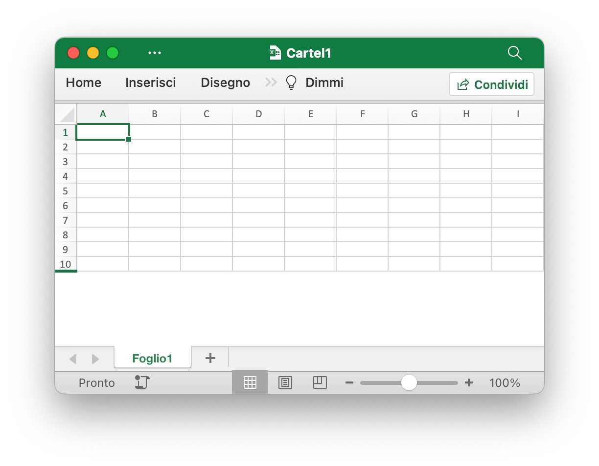
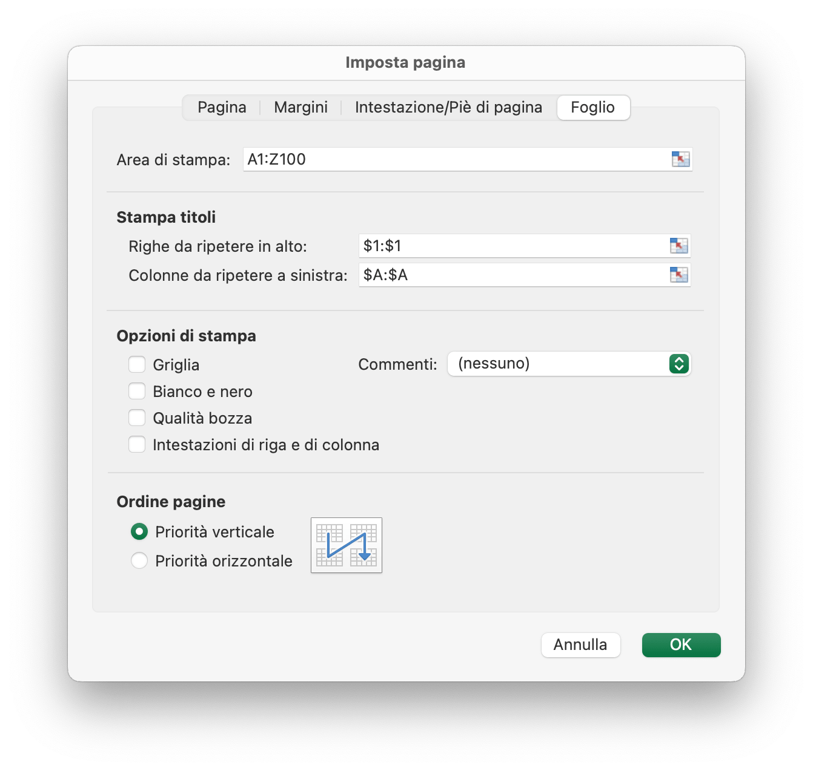

# Cartella di lavoro

`Options` definisce le opzioni per leggere e scrivere fogli di calcolo.

```go
type Options struct {
    MaxCalcIterations uint
    Password          string
    RawCellValue      bool
    UnzipSizeLimit    int64
    UnzipXMLSizeLimit int64
    TmpDir            string
    ShortDatePattern  string
    LongDatePattern   string
    LongTimePattern   string
    CultureInfo       CultureName
}
```

`MaxCalcIterations` specifica le iterazioni massime per il calcolo iterativo, il valore predefinito è 0.

`Password` specifica la password del foglio di calcolo in testo semplice.

`RawCellValue` specifica se applicare il formato numerico per il valore della cella o ottenere il valore non elaborato.

`UnzipSizeLimit` specifica il limite di dimensione di decompressione in byte all'apertura del foglio di calcolo, questo valore deve essere maggiore o uguale a `UnzipXMLSizeLimit`, il limite di dimensione predefinito è 16GB.

`UnzipXMLSizeLimit` specifica il limite di memoria per la decompressione del foglio di lavoro e della tabella di stringhe condivise in byte, il foglio di lavoro XML verrà estratto nella directory temporanea del sistema quando la dimensione del file supera questo valore, questo valore dovrebbe essere inferiore o uguale a `UnzipSizeLimit`, il valore predefinito il valore è 16MB.

`TmpDir` specifica la directory temporanea per la creazione di file temporanei; se il valore è vuoto, verrà utilizzata la directory temporanea predefinita del sistema.

`ShortDatePattern` specifica il codice del formato del numero della data breve. Nelle applicazioni per fogli di calcolo, i formati di data visualizzano i numeri di serie della data e dell'ora come valori di data. I formati di data che iniziano con un asterisco (\*) rispondono alle modifiche nelle impostazioni internazionali di data e ora specificate per il sistema operativo. I formati senza asterisco non sono influenzati dalle impostazioni del sistema operativo. Lo `ShortDatePattern` utilizzato per specifica i formati di data applicati che iniziano con un asterisco.

`LongDatePattern` specifica il codice del formato numerico della data lunga.

`LongTimePattern` specifica il codice del formato numerico dell'orario lungo.

`CultureInfo` specifica il codice del paese per l'applicazione del codice del formato numerico della lingua incorporato che viene influenzato dalle impostazioni della lingua locale del sistema.

`HeaderFooterImagePositionType` è il tipo di posizione dell'immagine di intestazione e piè di pagina.

```go
type HeaderFooterImagePositionType byte
```

Questa sezione definisce l'enumerazione dei tipi di posizione delle immagini dell'intestazione e del piè di pagina del foglio di lavoro.

```go
const (
    HeaderFooterImagePositionLeft HeaderFooterImagePositionType = iota
    HeaderFooterImagePositionCenter
    HeaderFooterImagePositionRight
)
```

`CustomProperty` mappa direttamente la proprietà personalizzata della cartella di lavoro. Il tipo di data del valore può essere uno dei seguenti: `int32`, `float64`, `string`, `bool`, `time.Time` o `nil`.

```go
type CustomProperty struct {
    Name  string
    Value interface{}
}
```

`CalcPropsOptions` definisce la raccolta di proprietà che l'applicazione utilizza per registrare lo stato e i dettagli del calcolo.

```go
type CalcPropsOptions struct {
    CalcID                *uint
    CalcMode              *string
    FullCalcOnLoad        *bool
    RefMode               *string
    Iterate               *bool
    IterateCount          *uint
    IterateDelta          *float64
    FullPrecision         *bool
    CalcCompleted         *bool
    CalcOnSave            *bool
    ConcurrentCalc        *bool
    ConcurrentManualCount *uint
    ForceFullCalc         *bool
}
```

## Crea un documento Excel {#NewFile}

```go
func NewFile(opts ...Options) *File
```

NewFile fornisce una funzione per creare un nuovo file tramite il modello predefinito. La cartella di lavoro appena creata conterrà per impostazione predefinita un foglio di lavoro denominato `Sheet1`. Per esempio:

## Aprire {#OpenFile}

```go
func OpenFile(filename string, opts ...Options) (*File, error)
```

OpenFile prende il nome di un file di foglio di calcolo e restituisce una struttura di file di foglio di calcolo popolata per esso. Ad esempio, apri un foglio di calcolo protetto da password:

```go
f, err := excelize.OpenFile("Cartel1.xlsx", excelize.Options{Password: "password"})
if err != nil {
    return
}
```

Chiudere il file con [`Close()`](workbook.md#Close) dopo aver aperto il foglio di calcolo.

## Apri il flusso di dati {#OpenReader}

```go
func OpenReader(r io.Reader, opts ...Options) (*File, error)
```

OpenReader legge il flusso di dati da `io.Reader` e restituisce un file di foglio di calcolo popolato.

Ad esempio, crea un server HTTP per gestire il modello di caricamento, quindi scarica il file di risposta con il nuovo foglio di lavoro aggiunto:

```go
package main

import (
    "fmt"
    "net/http"

    "github.com/xuri/excelize/v2"
)

func process(w http.ResponseWriter, req *http.Request) {
    file, _, err := req.FormFile("file")
    if err != nil {
        fmt.Fprint(w, err.Error())
        return
    }
    defer file.Close()
    f, err := excelize.OpenReader(file)
    if err != nil {
        fmt.Fprint(w, err.Error())
        return
    }
    f.Path = "Cartel1.xlsx"
    f.NewSheet("Nuovo foglio")
    w.Header().Set("Content-Disposition", fmt.Sprintf("attachment; filename=%s", f.Path))
    w.Header().Set("Content-Type", req.Header.Get("Content-Type"))
    if err := f.Write(w); err != nil {
        fmt.Fprint(w, err.Error())
    }
}

func main() {
    http.HandleFunc("/processi", process)
    http.ListenAndServe(":8090", nil)
}
```

Test with cURL:

```bash
curl --location --request GET 'http://127.0.0.1:8090/processi' \
--form 'file=@/tmp/modello.xltx' -O -J
```

## Salva {#Save}

```go
func (f *File) Save(opts ...Options) error
```

Salva fornisce una funzione per sovrascrivere il file del foglio di calcolo con il percorso di origine.

## Salva come {#SaveAs}

```go
func (f *File) SaveAs(name string, opts ...Options) error
```

SaveAs fornisce una funzione per creare o aggiornare il file del foglio di calcolo nel percorso fornito.

## Chiudi la cartella di lavoro {#Close}

```go
func (f *File) Close() error
```

Chiudi chiude e pulisce il file temporaneo aperto per il foglio di calcolo.

## Crea foglio di lavoro {#NewSheet}

```go
func (f *File) NewSheet(sheet string) (int, error)
```

NewSheet fornisce la funzione per creare un nuovo foglio assegnandogli un nome di foglio di lavoro e restituisce l'indice dei fogli nella cartella di lavoro (foglio di calcolo) dopo averlo aggiunto. Tieni presente che quando crei un nuovo file di foglio di calcolo, verrà creato il foglio di lavoro predefinito denominato `Sheet1`.

## Elimina il foglio di lavoro {#DeleteSheet}

```go
func (f *File) DeleteSheet(sheet string) error
```

DeleteSheet fornisce una funzione per eliminare un foglio di lavoro in una cartella di lavoro in base al nome del foglio di lavoro specificato. Utilizzare questo metodo con cautela poiché influirà sulle modifiche ai riferimenti quali formule, grafici e così via. Se è presente un valore di riferimento del foglio di lavoro eliminato, causerà un errore di file quando lo apri. Questa funzione non sarà valida quando rimane un solo foglio di lavoro.

## Sposta il foglio di lavoro {#MoveSheet}

```go
func (f *File) MoveSheet(source, target string) error
```

MoveSheet sposta un foglio in una posizione specificata nella cartella di lavoro. La funzione sposta il foglio di origine prima del foglio di destinazione. Dopo lo spostamento, gli altri fogli verranno spostati a sinistra o a destra. Se il foglio è già nella posizione di destinazione, la funzione non eseguirà alcuna azione. Non che questa funzione separerà tutti i fogli dopo lo spostamento. Ad esempio, sposta `Foglio2` prima di `Foglio1`:

```go
err := f.MoveSheet("Foglio2", "Foglio1")
```

## Copia foglio di lavoro {#CopySheet}

```go
func (f *File) CopySheet(from, to int) error
```

CopySheet fornisce una funzione per duplicare un foglio di lavoro in base all'indice del foglio di lavoro di origine e di destinazione. Tieni presente che attualmente non supporta cartelle di lavoro duplicate che contengono tabelle, grafici o immagini. Per esempio:

```go
// Il Sheet1 esiste già...
index, err := f.NewSheet("Foglio2")
if err != nil {
    fmt.Println(err)
    return
}
err = f.CopySheet(0, index)
```

## Fogli di lavoro di gruppo {#GroupSheets}

```go
func (f *File) GroupSheets(sheets []string) error
```

GroupSheets fornisce una funzione per raggruppare i fogli di lavoro in base ai nomi dei fogli di lavoro. I fogli di lavoro di gruppo devono contenere un foglio di lavoro attivo.

## Separare i fogli di lavoro {#UngroupSheets}

```go
func (f *File) UngroupSheets() error
```

UngroupSheets fornisce una funzione per separare i fogli di lavoro.

## Imposta lo sfondo del foglio di lavoro {#SetSheetBackground}

```go
func (f *File) SetSheetBackground(sheet, picture string) error
```

SetSheetBackground fornisce una funzione per impostare l'immagine di sfondo in base al nome del foglio di lavoro e al percorso del file. Tipi di immagini supportati: BMP, EMF, EMZ, GIF, JPEG, JPG, PNG, SVG, TIF, TIFF, WMF e WMZ.

```go
func (f *File) SetSheetBackgroundFromBytes(sheet, extension string, picture []byte) error
```

SetSheetBackgroundFromBytes fornisce una funzione per impostare l'immagine di sfondo in base al nome del foglio di lavoro, al nome dell'estensione e ai dati dell'immagine. Tipi di immagini supportati: BMP, EMF, EMZ, GIF, JPEG, JPG, PNG, SVG, TIF, TIFF, WMF e WMZ.

## Imposta il foglio di lavoro predefinito {#SetActiveSheet}

```go
func (f *File) SetActiveSheet(index int)
```

SetActiveSheet fornisce una funzione per impostare il foglio attivo predefinito della cartella di lavoro in base a un determinato indice. Tieni presente che l'indice attivo è diverso dall'ID restituito dalla funzione [`GetSheetMap`](sheet.md#GetSheetMap). Dovrebbe essere maggiore o uguale a 0 e inferiore al numero totale del foglio di lavoro.

## Ottieni l'indice del foglio attivo {#GetActiveSheetIndex}

```go
func (f *File) GetActiveSheetIndex() int
```

GetActiveSheetIndex fornisce una funzione per ottenere un foglio di lavoro attivo della cartella di lavoro. Se non viene trovato, il foglio attivo restituirà il numero intero `0`.

## Imposta il foglio di lavoro visibile {#SetSheetVisible}

```go
func (f *File) SetSheetVisible(sheet string, visible bool, veryHidden ...bool) error
```

SetSheetVisible fornisce una funzione per impostare il foglio di lavoro visibile in base al nome del foglio di lavoro specificato. Una cartella di lavoro deve contenere almeno un foglio di lavoro visibile. Se il foglio di lavoro specificato è stato attivato, questa impostazione verrà invalidata. Il terzo parametro facoltativo `veryHidden` funziona solo quando `visible` è `false`.

Ad esempio, nascondi `Foglio1`:

```go
err := f.SetSheetVisible("Foglio1", false)
```

## Ottieni il foglio di lavoro visibile {#GetSheetVisible}

```go
func (f *File) GetSheetVisible(sheet string) (bool, error)
```

GetSheetVisible fornisce una funzione per rendere visibile il foglio di lavoro in base al nome del foglio di lavoro specificato. Ad esempio, ottieni lo stato visibile di `Foglio1`:

```go
visible, err := f.GetSheetVisible("Foglio1")
```

## Imposta le proprietà del foglio di lavoro {#SetSheetProps}

```go
func (f *File) SetSheetProps(sheet string, opts *SheetPropsOptions) error
```

SetSheetProps fornisce una funzione per impostare le proprietà del foglio di lavoro. Le proprietà che è possibile impostare sono:

Opzioni|Tipo|Descrizione
---|---|---
CodeName                          | `*string`  | Specifica un nome stabile del foglio, che non dovrebbe cambiare nel tempo e non cambia in base all'input dell'utente. Questo nome dovrebbe essere utilizzato dal codice per fare riferimento a un particolare foglio
EnableFormatConditionsCalculation | `*bool`    | Indicare se i calcoli di formattazione condizionale devono essere valutati. Se impostato su false, i valori minimo/massimo delle scale di colore o delle barre dati o i valori soglia nelle regole Top N non verranno aggiornati. Essenzialmente la formattazione condizionale "calc" è disattivata
Published                         | `*bool`    | Indicando se il foglio di lavoro è pubblicato, il valore predefinito è `true`
AutoPageBreaks                    | `*bool`    | Indicando se il foglio visualizza le interruzioni di pagina automatiche, il valore predefinito è `true`
FitToPage                         | `*bool`    | Indicando se l'opzione di stampa Adatta alla pagina è abilitata, il valore predefinito è `false`
TabColorIndexed                   | `*int`     | Rappresenta il valore del colore indicizzato
TabColorRGB                       | `*string`  | Rappresenta il valore di colore ARGB standard (Alpha Red Green Blue)
TabColorTheme                     | `*int`     | Rappresenta l'indice in base zero nella raccolta, facendo riferimento a un valore particolare espresso nella parte Tema
TabColorTint                      | `*float64` | Specifica il valore della tinta applicato al colore, il valore predefinito è `0.0`
OutlineSummaryBelow               | `*bool`    | Indica se le righe di riepilogo vengono visualizzate sotto i dettagli in una struttura, quando si applica una struttura, il valore predefinito è `true`
OutlineSummaryRight               | `*bool`    | Indica se le colonne di riepilogo vengono visualizzate a destra dei dettagli in una struttura. Quando si applica una struttura, il valore predefinito è `true`
BaseColWidth                      | `*uint8`   | Specifica il numero di caratteri della larghezza massima delle cifre del carattere dello stile normale. Questo valore non include il riempimento del margine o il riempimento aggiuntivo per le linee della griglia. È solo il numero di caratteri, il valore predefinito è `8`
DefaultColWidth                   | `*float64` | Specifica la larghezza predefinita della colonna misurata come numero di caratteri della larghezza massima delle cifre del carattere dello stile normale
DefaultRowHeight                  | `*float64` | Specifica l'altezza della riga predefinita misurata in dimensioni in punti. Ottimizzazione in modo da non dover scrivere l'altezza su tutte le righe. Questo può essere scritto se la maggior parte delle righe ha un'altezza personalizzata, per ottenere l'ottimizzazione
CustomHeight                      | `*bool`    | Specifica l'altezza personalizzata, il valore predefinito è `false`
ZeroHeight                        | `*bool`    | Specifica se le righe sono nascoste, il valore predefinito è `false`
ThickTop                          | `*bool`    | Specifica se le righe hanno un bordo superiore spesso per impostazione predefinita, il valore predefinito è `false`
ThickBottom                       | `*bool`    | Specifica se le righe hanno un bordo inferiore spesso per impostazione predefinita, il valore predefinito è `false`

Ad esempio, imposta le righe del foglio di lavoro come nascoste per impostazione predefinita:

<p align="center"></p>

```go
f, enable := excelize.NewFile(), true
if err := f.SetSheetName("Sheet1", "Foglio1"); err != nil {
    fmt.Println(err)
    return
}
if err := f.SetSheetProps("Foglio1", &excelize.SheetPropsOptions{
    ZeroHeight: &enable,
}); err != nil {
    fmt.Println(err)
}
if err := f.SetRowVisible("Foglio1", 10, true); err != nil {
    fmt.Println(err)
}
f.SaveAs("Cartel1.xlsx")
```

Ci sono 4 tipi di preset "Opzioni di Scala Personalizzata" nelle applicazioni di fogli di calcolo. Se è necessario impostare tali opzioni di scala, si prega di utilizzare le funzioni [`SetSheetProps`](workbook.md#SetSheetProps) e [`SetPageLayout`](workbook.md#SetPageLayout) per accedere a queste 4 opzioni di scala:

1. Nessuna scala (Stampare le schede alle loro dimensioni reali):

    ```go
    disable := false
    if err := f.SetSheetProps("Foglio1", &excelize.SheetPropsOptions{
        FitToPage: &disable,
    }); err != nil {
        fmt.Println(err)
    }
    ```

2. Scheda di adattamento su un'unica pagina (ridurre l'uscita stampata in modo che si adatti su un'unica pagina):

    ```go
    enable := true
    if err := f.SetSheetProps("Foglio1", &excelize.SheetPropsOptions{
        FitToPage: &enable,
    }); err != nil {
        fmt.Println(err)
    }
    ```

3. Adattare tutte le colonne su una sola pagina (ridurre la stampa in modo che sia larga una sola pagina):

    ```go
    enable, zero := true, 0
    if err := f.SetSheetProps("Foglio1", &excelize.SheetPropsOptions{
        FitToPage: &enable,
    }); err != nil {
        fmt.Println(err)
    }
    if err := f.SetPageLayout("Foglio1", &excelize.PageLayoutOptions{
        FitToHeight: &zero,
    }); err != nil {
        fmt.Println(err)
    }
    ```

4. Adattare tutte le righe su un'unica pagina (ridurre la stampa in modo che sia alta un'unica pagina):

    ```go
    enable, zero := true, 0
    if err := f.SetSheetProps("Foglio1", &excelize.SheetPropsOptions{
        FitToPage: &enable,
    }); err != nil {
        fmt.Println(err)
    }
    if err := f.SetPageLayout("Foglio1", &excelize.PageLayoutOptions{
        FitToWidth: &zero,
    }); err != nil {
        fmt.Println(err)
    }
    ```

## Ottieni le proprietà del foglio di lavoro {#GetSheetProps}

```go
func (f *File) GetSheetProps(sheet string) (SheetPropsOptions, error)
```

GetSheetProps fornisce una funzione per ottenere le proprietà del foglio di lavoro.

## Imposta le proprietà di visualizzazione del foglio di lavoro {#SetSheetView}

```go
func (f *File) SetSheetView(sheet string, viewIndex int, opts *ViewOptions) error
```

SetSheetView imposta le proprietà della vista foglio. Il `viewIndex` può essere negativo e in tal caso viene conteggiato all'indietro (`-1` è l'ultima visualizzazione). Le proprietà che è possibile impostare sono:

Opzioni|Tipo|Descrizione
---|---|---
DefaultGridColor  | `*bool`    | Indica che l'applicazione che lo utilizza deve utilizzare il colore predefinito delle linee della griglia (a seconda del sistema). Sostituisce qualsiasi colore specificato in colorId, il valore predefinito è `true`
RightToLeft       | `*bool`    | Indica se il foglio è in modalità di visualizzazione "da destra a sinistra". In questa modalità, la Colonna A è all'estrema destra, Colonna B; è una colonna a sinistra della Colonna A e così via. Inoltre, le informazioni nelle celle vengono visualizzate nel formato da destra a sinistra, il valore predefinito è `false`
ShowFormulas      | `*bool`    | Indicando se questo foglio deve visualizzare formule, il valore predefinito è `false`
ShowGridLines     | `*bool`    | Indicando se questo foglio deve visualizzare le linee della griglia, il valore predefinito è `true`
ShowRowColHeaders | `*bool`    | Indicando se il foglio deve visualizzare intestazioni di righe e colonne, il valore predefinito è `true`
ShowRuler         | `*bool`    | Indicando che questo foglio dovrebbe visualizzare il righello, il valore predefinito è `true`
ShowZeros         | `*bool`    | Indica se "mostrare uno zero nelle celle che hanno valore zero". Quando utilizzi una formula per fare riferimento a un'altra cella vuota, il valore di riferimento diventa `0` quando il flag è `true`, il valore predefinito è `true`
TopLeftCell       | `*string`  | Specifica una posizione della cella visibile in alto a sinistra Posizione della cella visibile in alto a sinistra nel riquadro in basso a destra (in modalità da sinistra a destra)
View              | `*string`  | Indica come viene visualizzato il foglio, per impostazione predefinita utilizza una stringa vuota, opzioni disponibili: `normal`,`pageBreakPreview` e `pageLayout`
ZoomScale         | `*float64` | Specifica un ingrandimento dello zoom della finestra per la vista corrente che rappresenta i valori percentuali. Questo attributo è limitato a valori compresi tra `10` e `400`. Scala orizzontale e verticale insieme, il valore predefinito è `100`

## Ottieni le proprietà della visualizzazione del foglio di lavoro {#GetSheetView}

```go
func (f *File) GetSheetView(sheet string, viewIndex int) (ViewOptions, error)
```

GetSheetView ottiene il valore delle proprietà della visualizzazione foglio. Il `viewIndex` può essere negativo e in tal caso viene conteggiato all'indietro (`-1` è l'ultima visualizzazione).

## Imposta il layout della pagina del foglio di lavoro {#SetPageLayout}

```go
func (f *File) SetPageLayout(sheet string, opts *PageLayoutOptions) error
```

SetPageLayout fornisce una funzione per impostare il layout della pagina del foglio di lavoro. Opzioni disponibili:

`Size` ha specificato il formato carta del foglio di lavoro, il formato carta predefinito del foglio di lavoro è "Carta da lettera (8,5 pollici x 11 pollici)". Di seguito viene mostrato il formato carta ordinato in base al numero di indice Excelize:

Indice|Dimensioni del foglio
---|---
1   | Carta da lettere (8,5 pollici × 11 pollici)
2   | Carta Letter piccola (8,5 pollici × 11 pollici)
3   | Carta tabloid (11 pollici × 17 pollici)
4   | Carta registro (17 pollici × 11 pollici)
5   | Carta legale (8,5 pollici × 14 pollici)
6   | Documento di dichiarazione (5,5 pollici × 8,5 pollici)
7   | Documento esecutivo (7,25 pollici × 10,5 pollici)
8   | Carta A3 (297 mm × 420 mm)
9   | Carta A4 (210 mm × 297 mm)
10  | Carta piccola A4 (210 mm × 297 mm)
11  | Carta A5 (148 mm × 210 mm)
12  | Carta B4 (250 mm × 353 mm)
13  | Carta B5 (176 mm × 250 mm)
14  | Carta Folio (8,5 pollici × 13 pollici)
15  | Carta quarto (215 mm × 275 mm)
16  | Carta standard (10 pollici × 14 pollici)
17  | Carta standard (11 pollici × 17 pollici)
18  | Carta per appunti (8,5 pollici × 11 pollici)
19  | Busta n. 9 (3,875 pollici × 8,875 pollici)
20  | Busta n. 10 (4,125 pollici × 9,5 pollici)
21  | Busta n. 11 (4,5 pollici × 10,375 pollici)
22  | Busta n. 12 (4,75 pollici × 11 pollici)
23  | Busta n. 14 (5 pollici × 11,5 pollici)
24  | Carta C (17 pollici × 22 pollici)
25  | Carta D (22 pollici × 34 pollici)
26  | Carta E (34 pollici × 44 pollici)
27  | Busta DL (110 mm × 220 mm)
28  | Busta C5 (162 mm × 229 mm)
29  | Busta C3 (324 mm × 458 mm)
30  | Busta C4 (229 mm × 324 mm)
31  | Busta C6 (114 mm × 162 mm)
32  | Busta C65 (114 mm × 229 mm)
33  | Busta B4 (250 mm × 353 mm)
34  | Busta B5 (176 mm × 250 mm)
35  | Busta B6 (176 mm × 125 mm)
36  | Busta Italia (110 mm × 230 mm)
37  | Busta Monarch (3,875 pollici × 7,5 pollici)
38  | Busta da 6¾ (3,625 pollici × 6,5 pollici)
39  | Fanfold standard statunitense (14,875 pollici × 11 pollici)
40  | Fanfold standard tedesco (8,5 pollici × 12 pollici)
41  | Fanfold legale tedesco (8,5 pollici × 13 pollici)
42  | ISO B4 (250×353 mm)
43  | Cartolina giapponese (100 mm × 148 mm)
44  | Carta standard (9 pollici × 11 pollici)
45  | Carta standard (10 pollici × 11 pollici)
46  | Carta standard (15 pollici × 11 pollici)
47  | Busta di invito (220 mm × 220 mm)
50  | Carta extra da lettera (9,275 pollici × 12 pollici)
51  | Carta legale extra (9,275 pollici × 15 pollici)
52  | Carta extra tabloid (11,69 pollici × 18 pollici)
53  | Carta extra A4 (236 mm × 322 mm)
54  | Carta trasversale da lettera (8,275 pollici × 11 pollici)
55  | Carta trasversale A4 (210 mm × 297 mm)
56  | Carta trasversale extra Letter (9,275 pollici × 12 pollici)
57  | Carta SuperA/SuperA/A4 (227 mm × 356 mm)
58  | Carta SuperB/SuperB/A3 (305 mm × 487 mm)
59  | Lettera più carta (8,5 pollici × 12,69 pollici)
60  | A4 più carta (210 mm × 330 mm)
61  | Carta trasversale A5 (148 mm × 210 mm)
62  | Carta trasversale JIS B5 (182 mm × 257 mm)
63  | Carta extra A3 (322 mm × 445 mm)
64  | Carta extra A5 (174 mm × 235 mm)
65  | Carta extra ISO B5 (201 mm × 276 mm)
66  | Carta A2 (420 mm × 594 mm)
67  | Carta trasversale A3 (297 mm × 420 mm)
68  | Carta trasversale extra A3 (322 mm × 445 mm)
69  | Cartolina doppia giapponese (200 mm × 148 mm)
70  | A6 (105×148 mm)
71  | Busta giapponese Kaku n. 2
72  | Busta giapponese Kaku n. 3
73  | Busta giapponese Chou #3
74  | Busta giapponese Chou #4
75  | Lettera ruotata (11 pollici × 8½ pollici)
76  | A3 ruotato (420 mm × 297 mm)
77  | A4 ruotato (297 mm × 210 mm)
78  | A5 ruotato (210 mm × 148 mm)
79  | B4 (JIS) ruotato (364 mm × 257 mm)
80  | B5 (JIS) ruotato (257 mm × 182 mm)
81  | Cartolina giapponese ruotata (148 mm × 100 mm)
82  | Cartolina giapponese doppia ruotata (148 mm × 200 mm)
83  | A6 ruotato (148 mm × 105 mm)
84  | Busta giapponese Kaku n. 2 ruotata
85  | Busta giapponese Kaku n. 3 ruotata
86  | Busta giapponese Chou n. 3 ruotata
87  | Busta giapponese Chou n. 4 ruotata
88  | B6 (JIS) (128 mm × 182 mm)
89  | B6 (JIS) ruotato (182 mm × 128 mm)
90  | 12 pollici × 11 pollici
91  | Busta giapponese You #4
92  | Busta giapponese n. 4 ruotata
93  | RPC 16K (146 mm × 215 mm)
94  | PRC 32K (97 mm × 151 mm)
95  | PRC 32K (grande) (97 mm × 151 mm)
96  | Busta PRC n. 1 (102 mm × 165 mm)
97  | Busta PRC n. 2 (102 mm × 176 mm)
98  | Busta PRC n. 3 (125 mm × 176 mm)
99  | Busta PRC n. 4 (110 mm × 208 mm)
100 | Busta PRC n. 5 (110 mm × 220 mm)
101 | Busta PRC n. 6 (120 mm × 230 mm)
102 | Busta PRC n. 7 (160 mm × 230 mm)
103 | Busta PRC n. 8 (120 mm × 309 mm)
104 | Busta PRC n. 9 (229 mm × 324 mm)
105 | Busta PRC n. 10 (324 mm × 458 mm)
106 | PRC 16K ruotato
107 | PRC 32K ruotato
108 | PRC 32K (grande) ruotato
109 | Busta PRC n. 1 ruotata (165 mm × 102 mm)
110 | Busta PRC n. 2 ruotata (176 mm × 102 mm)
111 | Busta PRC n. 3 ruotata (176 mm × 125 mm)
112 | Busta PRC n. 4 ruotata (208 mm × 110 mm)
113 | Busta PRC n. 5 ruotata (220 mm × 110 mm)
114 | Busta PRC n. 6 ruotata (230 mm × 120 mm)
115 | Busta PRC n. 7 ruotata (230 mm × 160 mm)
116 | Busta PRC n. 8 ruotata (309 mm × 120 mm)
117 | Busta PRC n. 9 ruotata (324 mm × 229 mm)
118 | Busta PRC n. 10 ruotata (458 mm × 324 mm)

Orientamento del foglio di lavoro specificato da `Orientation`, l'orientamento predefinito è `portrait`. I valori possibili per questo campo sono `portrait` e `landscape`.

`FirstPageNumber` ha specificato il numero della prima pagina stampata. Se non viene specificato alcun valore, si presuppone "automatico".

`AdjustTo` ha specificato il ridimensionamento della stampa. Questo attributo è limitato a valori compresi tra 10 (10%) e 400 (400%). Questa impostazione viene sovrascritta quando sono in uso `FitToWidth` e/o `FitToHeight`.

`FitToHeight` ha specificato il numero di pagine verticali in cui adattarsi.

`FitToWidth` ha specificato il numero di pagine orizzontali in cui adattarsi.

`BlackAndWhite` ha specificato la stampa in bianco e nero.

`PageOrder` specifica l'ordinamento di più pagine. Valori accettati: `overThenDown` e `downThenOver`.

Ad esempio, imposta il layout di pagina per `Foglio1` con stampa in bianco e nero, primo numero di pagina stampato da `2`, carta A4 orizzontale di piccole dimensioni (210 mm x 297 mm), 2 pagine verticali da adattare e 2 pagine orizzontali da adattare:

```go
f := excelize.NewFile()
var (
    size                 = 10
    orientation          = "landscape"
    firstPageNumber uint = 2
    adjustTo        uint = 100
    fitToHeight          = 2
    fitToWidth           = 2
    blackAndWhite        = true
)
if err := f.SetSheetName("Sheet1", "Foglio1"); err != nil {
    fmt.Println(err)
    return
}
if err := f.SetPageLayout("Foglio1", &excelize.PageLayoutOptions{
    Size:            &size,
    Orientation:     &orientation,
    FirstPageNumber: &firstPageNumber,
    AdjustTo:        &adjustTo,
    FitToHeight:     &fitToHeight,
    FitToWidth:      &fitToWidth,
    BlackAndWhite:   &blackAndWhite,
}); err != nil {
    fmt.Println(err)
}
```

## Ottieni il layout della pagina del foglio di lavoro {#GetPageLayout}

```go
func (f *File) GetPageLayout(sheet string) (PageLayoutOptions, error)
```

GetPageLayout fornisce una funzione per ottenere il layout della pagina del foglio di lavoro.

## Imposta i margini della pagina del foglio di lavoro {#SetPageMargins}

```go
func (f *File) SetPageMargins(sheet string, opts *PageLayoutMarginsOptions) error
```

SetPageMargins fornisce una funzione per impostare i margini della pagina del foglio di lavoro. Opzioni disponibili:

Opzioni|Tipo|Descrizione
---|---|---
Bottom       | `*float64` | Metter il fondo a
Footer       | `*float64` | Piè di pagina
Header       | `*float64` | Intestazione
Left         | `*float64` | Sinistra
Right        | `*float64` | Giusto
Top          | `*float64` | Superiore
Horizontally | `*bool`    | Centro nella pagina: in orizzontale
Vertically   | `*bool`    | Centro nella pagina: verticalmente

## Ottieni i margini della pagina del foglio di lavoro {#GetPageMargins}

```go
func (f *File) GetPageMargins(sheet string) (PageLayoutMarginsOptions, error)
```

GetPageMargins fornisce una funzione per ottenere i margini della pagina del foglio di lavoro.

## Imposta le proprietà della cartella di lavoro {#SetWorkbookProps}

```go
func (f *File) SetWorkbookProps(opts *WorkbookPropsOptions) error
```

SetWorkbookProps fornisce una funzione per impostare le proprietà della cartella di lavoro. Opzioni disponibili:

Opzioni|Tipo|Descrizione
---|---|---
Date1904      | `*bool`   | Indica se utilizzare un sistema di data 1900 o 1904 durante la conversione di data e ora seriali nella cartella di lavoro in date.
FilterPrivacy | `*bool`   | Specifica un valore booleano che indica se l'applicazione ha esaminato la cartella di lavoro per individuare informazioni di identificazione personale (PII). Se questo flag è impostato, l'applicazione avvisa l'utente ogni volta che esegue un'azione che inserirà le PII nel documento.
CodeName      | `*string` | Specifica il nome in codice dell'applicazione che ha creato questa cartella di lavoro. Utilizza questo attributo per tenere traccia del contenuto del file nelle versioni incrementali dell'applicazione.

## Ottieni le proprietà della cartella di lavoro {#GetWorkbookProps}

```go
func (f *File) GetWorkbookProps() (WorkbookPropsOptions, error)
```

GetWorkbookProps fornisce una funzione per ottenere le proprietà della cartella di lavoro.

## Imposta intestazione e piè di pagina {#SetHeaderFooter}

```go
func (f *File) SetHeaderFooter(sheet string, opts *HeaderFooterOptions) error
```

SetHeaderFooter fornisce una funzione per impostare intestazioni e piè di pagina in base al nome del foglio di lavoro e ai caratteri di controllo.

Intestazioni e piè di pagina vengono specificati utilizzando i seguenti campi di impostazione:

Campi | Descrizione
---|---
AlignWithMargins | Allinea i margini del piè di pagina dell'intestazione ai margini della pagina
DifferentFirst   | Indicatore diverso di intestazione e piè di pagina della prima pagina
DifferentOddEven | Indicatore di intestazioni e piè di pagina diversi e pari e dispari
ScaleWithDoc     | Ridimensiona intestazione e piè di pagina con il ridimensionamento del documento
OddFooter        | Piè di pagina dispari o piè di pagina primario se `DifferentOddEven` è `false`
OddHeader        | Intestazione dispari o intestazione di pagina primaria se `DifferentOddEven` è `false`
EvenFooter       | Anche piè di pagina
EvenHeader       | Anche l'intestazione della pagina
FirstFooter      | Piè di pagina della prima pagina
FirstHeader      | Intestazione della prima pagina

I seguenti codici di formattazione possono essere utilizzati in 6 campi di tipo stringa: `OddHeader`, `OddFooter`, `EvenHeader`, `EvenFooter`, `FirstFooter`, `FirstHeader`

<table>
    <thead>
        <tr>
            <th>Codice di formattazione</th>
            <th>Descrizione</th>
        </tr>
    </thead>
    <tbody>
        <tr>
            <td><code>&amp;&amp;</code></td>
            <td>Il personaggio &quot;&amp;&quot;</td>
        </tr>
        <tr>
            <td><code>&amp;font-size</code></td>
            <td>Dimensione del carattere del testo, dove dimensione-carattere è una dimensione del carattere decimale in punti</td>
        </tr>
        <tr>
            <td><code>&amp;&quot;font name,font type&quot;</code></td>
            <td>Una stringa del nome del carattere di testo, il nome del carattere e una stringa del tipo di carattere del testo, il tipo di carattere</td>
        </tr>
        <tr>
            <td><code>&amp;&quot;-,Regular&quot;</code></td>
            <td>Formato testo normale. Disattiva le modalità grassetto e corsivo</td>
        </tr>
        <tr>
            <td><code>&amp;A</code></td>
            <td>Nome della scheda del foglio di lavoro corrente</td>
        </tr>
        <tr>
            <td><code>&amp;B</code> or <code>&amp;&quot;-,Bold&quot;</code></td>
            <td>Formato testo in grassetto, da disattivato ad attivato o viceversa. La modalità predefinita è disattivata</td>
        </tr>
        <tr>
            <td><code>&amp;D</code></td>
            <td>Data odierna</td>
        </tr>
        <tr>
            <td><code>&amp;C</code></td>
            <td>Sezione centrale</td>
        </tr>
        <tr>
            <td><code>&amp;E</code></td>
            <td>Formato testo con doppia sottolineatura</td>
        </tr>
        <tr>
            <td><code>&amp;F</code></td>
            <td>Nome del file della cartella di lavoro corrente</td>
        </tr>
        <tr>
            <td><code>&amp;G</code></td>
            <td>Oggetto di disegno come sfondo (Utilizzare AddHeaderFooterImage)</td>
        </tr>
        <tr>
            <td><code>&amp;H</code></td>
            <td>Formato testo ombra</td>
        </tr>
        <tr>
            <td><code>&amp;I</code> or <code>&amp;&quot;-,Italic&quot;</code></td>
            <td>Formato testo corsivo</td>
        </tr>
        <tr>
            <td><code>&amp;K</code></td>
            <td>Colore del carattere del testo<br>Un colore RGB è specificato come RRGGBB<br>Un colore del tema è specificato come TTSNNN dove TT è l'ID del colore del tema, S è &quot;+&quot; o &quot;-&quot; del valore di tinta/ombreggiatura e NNN è il valore di tinta/ombra</td>
        </tr>
        <tr>
            <td><code>&amp;L</code></td>
            <td>Sezione sinistra</td>
        </tr>
        <tr>
            <td><code>&amp;N</code></td>
            <td>Numero totale di pagine</td>
        </tr>
        <tr>
            <td><code>&amp;O</code></td>
            <td>Formato del testo del contorno</td>
        </tr>
        <tr>
            <td><code>&amp;P[[+\|-]n]</code></td>
            <td>Senza il suffisso opzionale, il numero di pagina corrente in decimale</td>
        </tr>
        <tr>
            <td><code>&amp;R</code></td>
            <td>Sezione destra</td>
        </tr>
        <tr>
            <td><code>&amp;S</code></td>
            <td>Formato testo barrato</td>
        </tr>
        <tr>
            <td><code>&amp;T</code></td>
            <td>Ora attuale</td>
        </tr>
        <tr>
            <td><code>&amp;U</code></td>
            <td>Formato testo con sottolineatura singola. Se la modalità di doppia sottolineatura è attiva, la successiva occorrenza in uno specificatore di sezione disattiva la modalità di doppia sottolineatura; in caso contrario, attiva/disattiva la modalità di sottolineatura singola da disattivata a attiva o viceversa. La modalità predefinita è disattivata</td>
        </tr>
        <tr>
            <td><code>&amp;X</code></td>
            <td>Formato testo in apice</td>
        </tr>
        <tr>
            <td><code>&amp;Y</code></td>
            <td>Formato testo in pedice</td>
        </tr>
        <tr>
            <td><code>&amp;Z</code></td>
            <td>Percorso del file della cartella di lavoro corrente</td>
        </tr>
    </tbody>
</table>

Per esempio:

```go
err := f.SetHeaderFooter("Foglio1", &excelize.HeaderFooterOptions{
    DifferentFirst:   true,
    DifferentOddEven: true,
    OddHeader:        "&R&P",
    OddFooter:        "&C&F",
    EvenHeader:       "&L&P",
    EvenFooter:       "&L&D&R&T",
    FirstHeader:      `&CCenter &"-,Bold"Bold&"-,Regular"HeaderU+000A&D`,
})
```

Questo esempio mostra:

- La prima pagina ha la propria intestazione e piè di pagina
- Le pagine con numeri pari e dispari hanno intestazioni e piè di pagina diversi
- Numero di pagina corrente nella sezione destra delle intestazioni delle pagine dispari
- Il nome del file della cartella di lavoro corrente nella sezione centrale dei piè di pagina delle pagine dispari
- Numero di pagina corrente nella sezione sinistra delle intestazioni delle pagine pari
- Data corrente nella sezione sinistra e ora corrente nella sezione destra dei piè di pagina delle pagine pari
- Il testo "Center Bold Header" sulla prima riga della sezione centrale della prima pagina e la data sulla seconda riga della sezione centrale della stessa pagina
- Nessun piè di pagina nella prima pagina

## Aggiungi immagine intestazione e piè di pagina {#AddHeaderFooterImage}

```go
func (f *File) AddHeaderFooterImage(sheet string, opts *HeaderFooterImageOptions) error
```

AddHeaderFooterImage fornisce un meccanismo per impostare la grafica a cui è possibile fare riferimento nelle definizioni di intestazione e piè di pagina tramite `&G`, tipi di immagine supportati: EMF, EMZ, GIF, JPEG, JPG, PNG, SVG, TIF, TIFF, WMF e WMZ.

## Imposta il nome definito {#SetDefinedName}

```go
func (f *File) SetDefinedName(definedName *DefinedName) error
```

SetDefinedName fornisce una funzione per impostare i nomi definiti della cartella di lavoro o del foglio di lavoro. Se l'ambito non è specificato, l'ambito predefinito è la cartella di lavoro. Per esempio:

```go
err := f.SetDefinedName(&excelize.DefinedName{
    Name:     "Quantità",
    RefersTo: "Foglio1!$A$2:$D$5",
    Comment:  "commento nome definito",
})
```

Impostazioni dell'area di stampa e dei titoli di stampa per il foglio di lavoro:

<p align="center"></p>

```go
if err := f.SetDefinedName(&excelize.DefinedName{
    Name:     "_xlnm.Print_Area",
    RefersTo: "Foglio1!$A$1:$Z$100",
    Scope:    "Foglio1",
}); err != nil {
    fmt.Println(err)
}
if err := f.SetDefinedName(&excelize.DefinedName{
    Name:     "_xlnm.Print_Titles",
    RefersTo: "Foglio1!$A:$A,Foglio1!$1:$1",
    Scope:    "Foglio1",
}); err != nil {
    fmt.Println(err)
}
```

Se riempi la proprietà `RefersTo` con un solo intervallo di colonne senza virgole, funzionerà solo come "Colonne da ripetere a sinistra". Ad esempio:

```go
if err := f.SetDefinedName(&excelize.DefinedName{
    Name:     "_xlnm.Print_Titles",
    RefersTo: "Foglio1!$A:$A",
    Scope:    "Foglio1",
}); err != nil {
    fmt.Println(err)
}
```

Se riempi la proprietà `RefersTo` con un solo intervallo di righe senza virgole, funzionerà solo come "Righe da ripetere in alto". Ad esempio:

```go
if err := f.SetDefinedName(&excelize.DefinedName{
    Name:     "_xlnm.Print_Titles",
    RefersTo: "Foglio1!$1:$1",
    Scope:    "Foglio1",
}); err != nil {
    fmt.Println(err)
}
```

È possibile utilizzare la funzione anche in `RefersTo`. Ad esempio:

```go
err := f.SetDefinedName(&excelize.DefinedName{
    Name:     "IntervalloPersonalizzato",
    RefersTo: "Foglio1!$A$2+Foglio1!$D$5",
    Scope:    "Foglio1",
})
```

## Ottieni un nome definito {#GetDefinedName}

```go
func (f *File) GetDefinedName() []DefinedName
```

GetDefinedName fornisce una funzione per ottenere i nomi definiti della cartella di lavoro o del foglio di lavoro.

## Elimina il nome definito {#DeleteDefinedName}

```go
func (f *File) DeleteDefinedName(definedName *DefinedName) error
```

DeleteDefinedName fornisce una funzione per eliminare i nomi definiti della cartella di lavoro o del foglio di lavoro. Se l'ambito non è specificato, l'ambito predefinito è la cartella di lavoro. Per esempio:

```go
err := f.DeleteDefinedName(&excelize.DefinedName{
    Name:     "Quantità",
    Scope:    "Foglio2",
})
```

## Imposta le proprietà dell'applicazione {#SetAppProps}

```go
func (f *File) SetAppProps(appProperties *AppProperties) error
```

SetAppProps fornisce una funzione per impostare le proprietà dell'applicazione del documento. Le proprietà che è possibile impostare sono:

Proprietà       | Descrizione
---|---
Application       | Il nome dell'applicazione che ha creato questo documento.
ScaleCrop         | Indica la modalità di visualizzazione della miniatura del documento. Imposta questo elemento su `true` per abilitare il ridimensionamento della miniatura del documento sul display. Imposta questo elemento su `false` per abilitare il ritaglio della miniatura del documento per mostrare solo le sezioni che si adattano al display.
DocSecurity       | Livello di sicurezza di un documento come valore numerico. La sicurezza del documento è definita come:<br>1 - Il documento è protetto da password.<br>2 - Si consiglia di aprire il documento in sola lettura.<br>3 - Si impone che il documento venga aperto in sola lettura.<br >4 - Il documento è bloccato per l'annotazione.
Company           | Il nome di un'azienda associata al documento.
LinksUpToDate     | Indica se i collegamenti ipertestuali in un documento sono aggiornati. Imposta questo elemento su `true` per indicare che i collegamenti ipertestuali vengono aggiornati. Imposta questo elemento su `false` per indicare che i collegamenti ipertestuali non sono aggiornati.
HyperlinksChanged | Specifica che uno o più collegamenti ipertestuali in questa parte sono stati aggiornati esclusivamente in questa parte da un produttore. Il prossimo produttore che aprirà questo documento dovrà aggiornare le relazioni dei collegamenti ipertestuali con i nuovi collegamenti ipertestuali specificati in questa parte.
AppVersion        | Specifica la versione dell'applicazione che ha prodotto questo documento. Il contenuto di questo elemento dovrà essere nella forma XX.YYYY dove X e Y rappresentano valori numerici, altrimenti il documento sarà considerato non conforme.

Per esempio:

```go
err := f.SetAppProps(&excelize.AppProperties{
    Application:       "Microsoft Excel",
    ScaleCrop:         true,
    DocSecurity:       3,
    Company:           "Nome della ditta",
    LinksUpToDate:     true,
    HyperlinksChanged: true,
    AppVersion:        "16.0000",
})
```

## Ottieni le proprietà dell'applicazione {#GetAppProps}

```go
func (f *File) GetAppProps() (*AppProperties, error)
```

GetAppProps fornisce una funzione per ottenere le proprietà dell'applicazione del documento.

## Imposta le proprietà del documento {#SetDocProps}

```go
func (f *File) SetDocProps(docProperties *DocProperties) error
```

SetDocProps fornisce una funzione per impostare le proprietà principali del documento. Le proprietà che è possibile impostare sono:

Proprietà | Descrizione
---|---
Category       | Una categorizzazione del contenuto di questo pacchetto.
ContentStatus  | Lo stato del contenuto. Ad esempio: i valori potrebbero includere `Bozza`, `Revisionato` e `Finale`
Created        | L'ora di creazione del contenuto della risorsa che rappresenta nel formato ISO 8601 UTC, ad esempio `2019-06-04T22:00:10Z`.
Creator        | Un'entità principalmente responsabile della creazione del contenuto della risorsa.
Description    | Una spiegazione del contenuto della risorsa.
Identifier     | Un riferimento inequivocabile alla risorsa all'interno di un dato contesto.
Keywords       | Un insieme delimitato di parole chiave per supportare la ricerca e l'indicizzazione. Si tratta in genere di un elenco di termini che non sono disponibili altrove nelle proprietà.
Language       | La lingua del contenuto intellettuale della risorsa.
LastModifiedBy | L'utente che ha eseguito l'ultima modifica. L'identificazione è specifica dell'ambiente.
Modified       | L'ora modificata del contenuto della risorsa rappresentata nel formato ISO 8601 UTC, ad esempio `2019-06-04T22:00:10Z`.
Revision       | Il numero di revisione del contenuto della risorsa.
Subject        | L'argomento del contenuto della risorsa.
Title          | Il nome assegnato alla risorsa.
Version        | Il numero di versione. Questo valore viene impostato dall'utente o dall'applicazione.

Per esempio:

```go
err := f.SetDocProps(&excelize.DocProperties{
    Category:       "categoria",
    ContentStatus:  "Bozza",
    Created:        "2019-06-04T22:00:10Z",
    Creator:        "Go Excelize",
    Description:    "Questo file creato da Go Excelize",
    Identifier:     "xlsx",
    Keywords:       "Foglio di calcolo",
    LastModifiedBy: "Autore",
    Modified:       "2019-06-04T22:00:10Z",
    Revision:       "0",
    Subject:        "Cavia",
    Title:          "Titolo della prova",
    Language:       "it-IT",
    Version:        "1.0.0",
})
```

## Ottieni le proprietà del documento {#GetDocProps}

```go
func (f *File) GetDocProps() (*DocProperties, error)
```

GetDocProps fornisce una funzione per ottenere le proprietà principali del documento.

## Imposta proprietà personalizzate {#SetCustomProps}

```go
func (f *File) SetCustomProps(prop CustomProperty) error
```

SetCustomProps fornisce una funzione per impostare proprietà di file personalizzate in base al nome e al valore della proprietà specificati. Se il nome della proprietà esiste già, verrà aggiornato, altrimenti verrà aggiunta una nuova proprietà. Il valore può essere di tipo `int32`, `float64`, `bool`, `string`, `time.Time` o `nil`. La proprietà verrà eliminata se il valore è `nil`. La funzione restituisce un errore se il valore della proprietà non è del tipo corretto.

## Ottieni proprietà personalizzate {#GetCustomProps}

```go
func (f *File) GetCustomProps() ([]CustomProperty, error)
```

GetCustomProps fornisce una funzione per ottenere proprietà di file personalizzate.

## Imposta le proprietà di calcolo {#SetCalcProps}

```go
func (f *File) SetCalcProps(opts *CalcPropsOptions) error
```

SetCalcProps fornisce una funzione per impostare le proprietà di calcolo.

Il valore facoltativo della proprietà `CalcMode` è: `manual`, `auto` o `autoNoTable`.

Il valore facoltativo della proprietà `RefMode` è: `A1` o `R1C1`.

## Ottieni le proprietà di calcolo {#GetCalcProps}

```go
func (f *File) GetCalcProps() (CalcPropsOptions, error)
```

GetCalcProps fornisce una funzione per ottenere le proprietà di calcolo.

## Proteggi la cartella di lavoro {#ProtectWorkbook}

```go
func (f *File) ProtectWorkbook(opts *WorkbookProtectionOptions) error
```

ProtectWorkbook fornisce una funzione per impedire ad altri utenti di modificare, spostare o eliminare accidentalmente o deliberatamente i dati in una cartella di lavoro. Il campo facoltativo `AlgorithmName` ha specificato l'algoritmo hash, supporta attualmente XOR, MD4, MD5, SHA-1, SHA2-56, SHA-384 e SHA-512, se non è specificato alcun algoritmo hash, utilizzerà l'algoritmo XOR come predefinito. Ad esempio, proteggi la cartella di lavoro con le impostazioni di protezione:

```go
err := f.ProtectWorkbook(&excelize.WorkbookProtectionOptions{
    Password:      "password",
    LockStructure: true,
})
```

WorkbookProtectionOptions mappa direttamente le impostazioni di protezione della cartella di lavoro.

```go
type WorkbookProtectionOptions struct {
    AlgorithmName string
    Password      string
    LockStructure bool
    LockWindows   bool
}
```

## Rimuovere la protezione della cartella di lavoro {#UnprotectWorkbook}

```go
func (f *File) UnprotectWorkbook(password ...string) error
```

UnprotectWorkbook fornisce una funzione per rimuovere la protezione per la cartella di lavoro, specificando il parametro password facoltativo per rimuovere la protezione della cartella di lavoro con la verifica della password.
