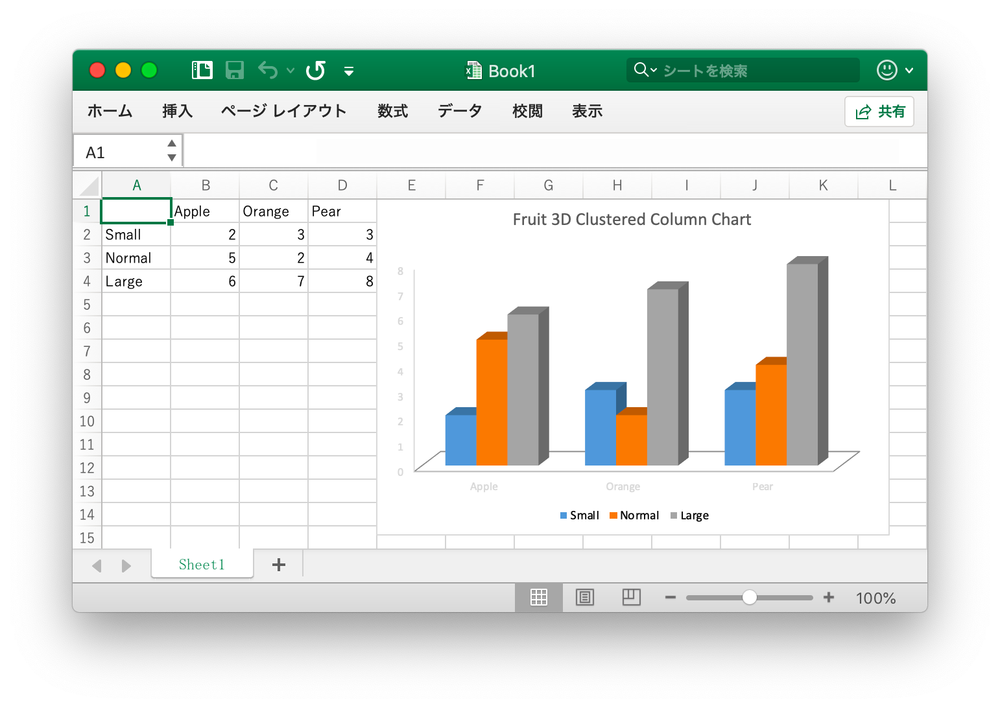

# 基本的な使い方

## インストール {#install}

最新バージョンの Excelize ライブラリを使用するには、Go 1.15 以降が必要です。

- インストールコマンド

```bash
go get github.com/xuri/excelize
```

- [Go Modules](https://blog.golang.org/using-go-modules) でパッケージを管理している場合は、次のコマンドでインストールしてください。

```bash
go get github.com/xuri/excelize/v2
```

## アップグレード {#update}

- 更新コマンド

```bash
go get -u github.com/xuri/excelize/v2
```

## Excel 文書を作成する {#NewFile}

これは、Excel ドキュメントを作成する簡単な例です。

```go
package main

import (
    "fmt"

    "github.com/xuri/excelize/v2"
)

func main() {
    f := excelize.NewFile()
    // ワークシートを作成する
    index := f.NewSheet("Sheet2")
    // セルの値を設定
    f.SetCellValue("Sheet2", "A2", "Hello world.")
    f.SetCellValue("Sheet1", "B2", 100)
    // ワークブックのデフォルトワークシートを設定します
    f.SetActiveSheet(index)
    // 指定されたパスに従ってファイルを保存します
    if err := f.SaveAs("Book1.xlsx"); err != nil {
        fmt.Println(err)
    }
}
```

## Excel 文書を読む {#read}

これは Excel 文書を読む例です：

```go
package main

import (
    "fmt"

    "github.com/xuri/excelize/v2"
)

func main() {
    f, err := excelize.OpenFile("Book1.xlsx")
    if err != nil {
        fmt.Println(err)
        return
    }
    // ワークシート内の指定されたセルの値を取得します
    cell, err := f.GetCellValue("Sheet1", "B2")
    if err != nil {
        fmt.Println(err)
        return
    }
    fmt.Println(cell)
    // Sheet1 のすべてのセルを取得
    rows, err := f.GetRows("Sheet1")
    for _, row := range rows {
        for _, colCell := range row {
            fmt.Print(colCell, "\t")
        }
        fmt.Println()
    }
}
```

## Excel 文書にチャートを追加する {#chart}

Excel でグラフを生成するのは簡単で、1 行のコードで済みます。 ワークシート内の既存のデータに基づいてチャートを作成することも、ワークシートにデータを追加してチャートを作成することもできます。

<p align="center"></p>

```go
package main

import (
    "fmt"

    "github.com/xuri/excelize/v2"
)

func main() {
    categories := map[string]string{
        "A2": "Small", "A3": "Normal", "A4": "Large", "B1": "Apple", "C1": "Orange", "D1": "Pear"}
    values := map[string]int{
        "B2": 2, "C2": 3, "D2": 3, "B3": 5, "C3": 2, "D3": 4, "B4": 6, "C4": 7, "D4": 8}
    f := excelize.NewFile()
    for k, v := range categories {
        f.SetCellValue("Sheet1", k, v)
    }
    for k, v := range values {
        f.SetCellValue("Sheet1", k, v)
    }
    if err := f.AddChart("Sheet1", "E1", `{
        "type": "col3DClustered",
        "series": [
        {
            "name": "Sheet1!$A$2",
            "categories": "Sheet1!$B$1:$D$1",
            "values": "Sheet1!$B$2:$D$2"
        },
        {
            "name": "Sheet1!$A$3",
            "categories": "Sheet1!$B$1:$D$1",
            "values": "Sheet1!$B$3:$D$3"
        },
        {
            "name": "Sheet1!$A$4",
            "categories": "Sheet1!$B$1:$D$1",
            "values": "Sheet1!$B$4:$D$4"
        }],
        "title":
        {
            "name": "Fruit 3D Clustered Column Chart"
        }
    }`); err != nil {
        fmt.Println(err)
        return
    }
    // 指定されたパスに従ってファイルを保存します
    if err := f.SaveAs("Book1.xlsx"); err != nil {
        fmt.Println(err)
    }
}
```

## Excel 文書に画像を追加する {#image}

```go
package main

import (
    "fmt"
    _ "image/gif"
    _ "image/jpeg"
    _ "image/png"

    "github.com/xuri/excelize/v2"
)

func main() {
    f, err := excelize.OpenFile("Book1.xlsx")
    if err != nil {
        fmt.Println(err)
        return
    }
    // 写真を挿入
    if err := f.AddPicture("Sheet1", "A2", "image.png", ""); err != nil {
        fmt.Println(err)
    }
    // ワークシートに画像を挿入して画像の縮尺を設定する
    if err := f.AddPicture("Sheet1", "D2", "image.jpg", `{
        "x_scale": 0.5,
        "y_scale": 0.5
    }`); err != nil {
        fmt.Println(err)
    }
    // ワークシートに画像を挿入して画像の印刷プロパティを設定する
    if err := f.AddPicture("Sheet1", "H2", "image.gif", `{
        "x_offset": 15,
        "y_offset": 10,
        "print_obj": true,
        "lock_aspect_ratio": false,
        "locked": false
    }`); err != nil {
        fmt.Println(err)
    }
    // ファイルを保存
    if err = f.Save(); err != nil {
        fmt.Println(err)
    }
}
```
