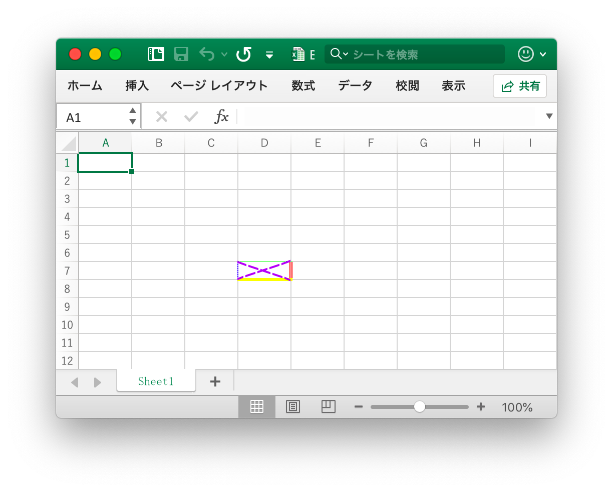
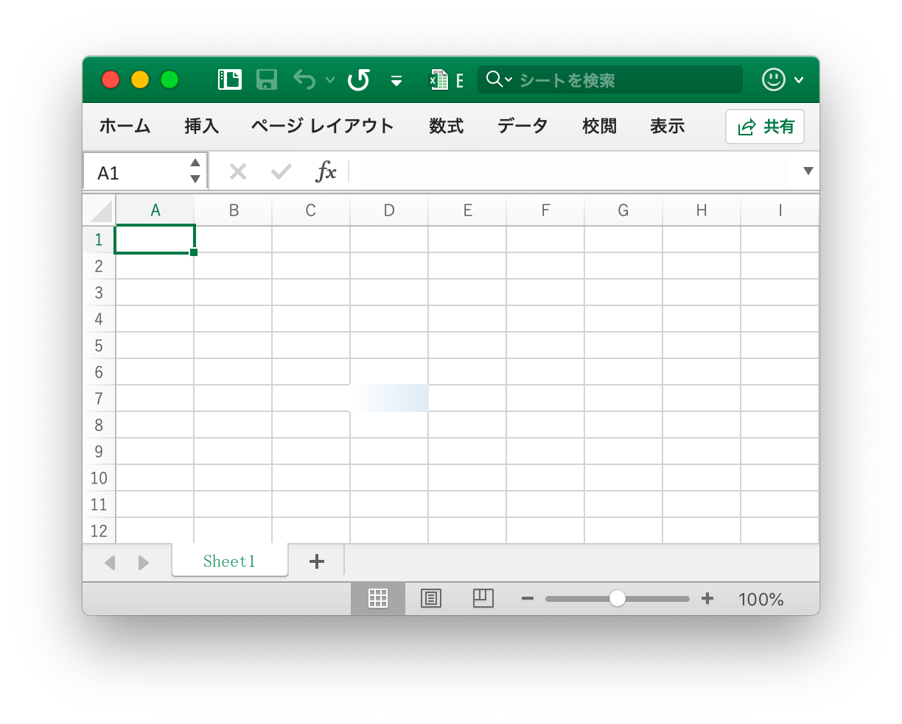
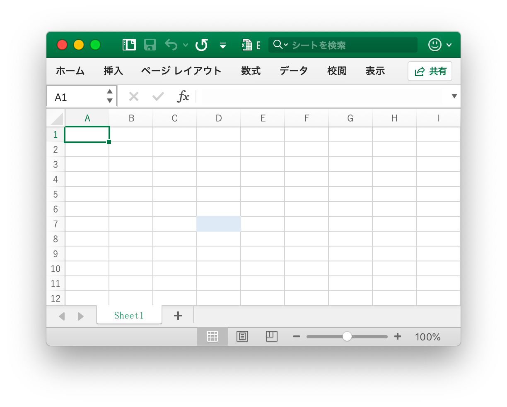
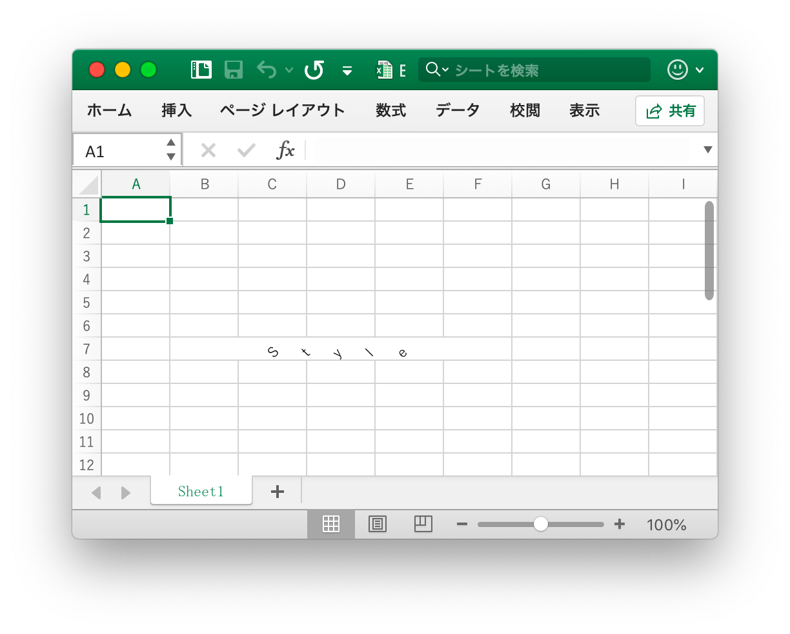
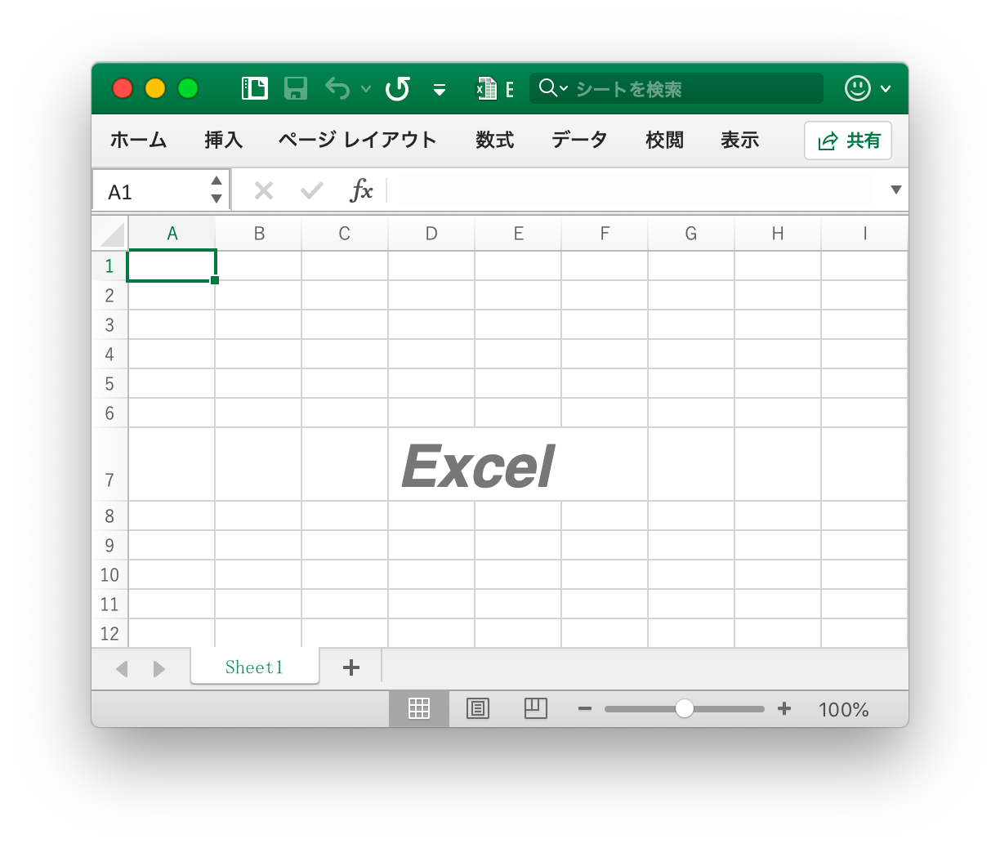
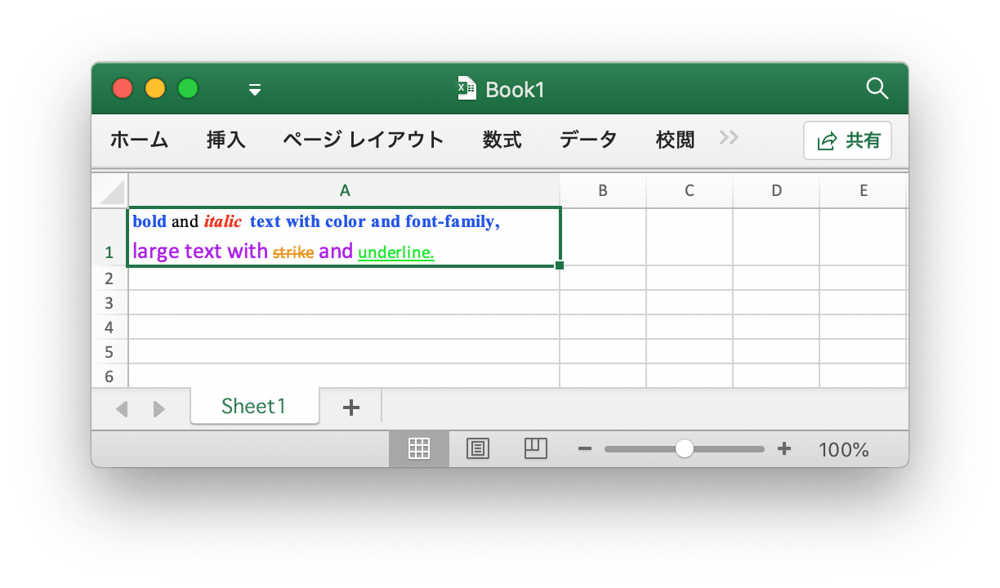
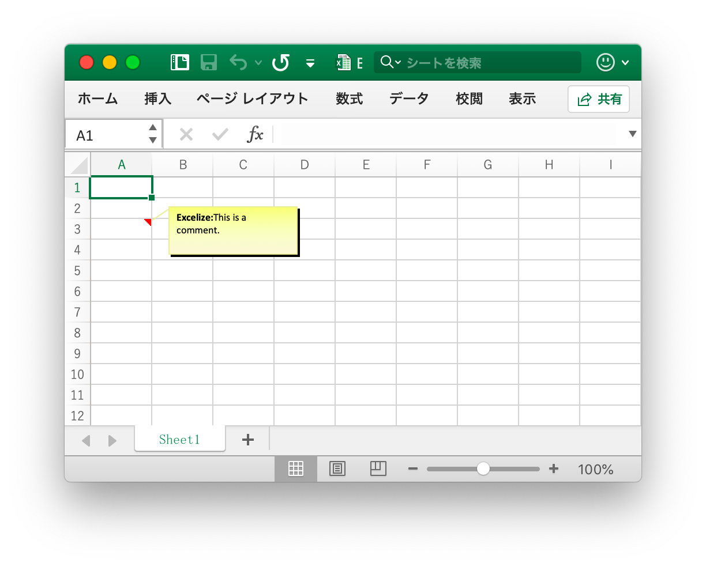

# セル

RichTextRun は、リッチテキストランの設定を直接マップします。

```go
type RichTextRun struct {
    Font *Font
    Text string
}
```

## セル値設定 {#SetCellValue}

```go
func (f *File) SetCellValue(sheet, axis string, value interface{}) error
```

指定されたワークシート名とセル座標に基づいて、セルの値を設定します。指定された座標は、テーブルの最初の行にあるべきではありません。

|サポートされているデータ型|
|---|
|int|
|int8|
|int16|
|int32|
|int64|
|uint|
|uint8|
|uint16|
|uint32|
|uint64|
|float32|
|float64|
|string|
|[]byte|
|time.Duration|
|time.Time|
|bool|
|nil|

## ブール値設定 {#SetCellBool}

```go
func (f *File) SetCellBool(sheet, axis string, value bool) error
```

指定されたワークシート名とセル座標に基づいて、ブール型 (Boolean) のセルの値を設定します。

## 既定の文字の種類の値を設定する {#SetCellDefault}

```go
func (f *File) SetCellDefault(sheet, axis, value string) error
```

指定されたワークシート名とセル座標に基づいて、文字セルの値を設定し、特殊文字に対してはフィルタされません。

## 実数を設定する {#SetCellInt}

```go
func (f *File) SetCellInt(sheet, axis string, value int) error
```

指定されたワークシート名とセル座標に基づいて、実際のセルの値を設定します。

## 文字列値の設定 {#SetCellStr}

```go
func (f *File) SetCellStr(sheet, axis, value string) error
```

指定したワークシート名とセル座標に基づいて文字セルの値を設定すると、文字は特殊文字でフィルタリングされ、文字列の累積長は `32767` を超えてはならず、余分な文字は無視されます。

## セルスタイルの設定 {#SetCellStyle}

```go
func (f *File) SetCellStyle(sheet, hcell, vcell string, styleID int) error
```

指定されたワークシート名、セル座標領域、およびスタイルインデックスに基づいて、セルの値を設定します。スタイルインデックスは [`NewStyle`](style.md#NewStyle) 関数を使用して取得できます。同じ座標領域内の `diagonaldown` と `diagonalup` は同じ色で保持する必要があることに注意してください。

- 例1、ワークシート `D7` セル `Sheet1` の境界線のスタイルを設定します:

```go
style, err := f.NewStyle(`{
    "border": [
    {
        "type": "left",
        "color": "0000FF",
        "style": 3
    },
    {
        "type": "top",
        "color": "00FF00",
        "style": 4
    },
    {
        "type": "bottom",
        "color": "FFFF00",
        "style": 5
    },
    {
        "type": "right",
        "color": "FF0000",
        "style": 6
    },
    {
        "type": "diagonalDown",
        "color": "A020F0",
        "style": 7
    },
    {
        "type": "diagonalUp",
        "color": "A020F0",
        "style": 8
    }]
}`)
if err != nil {
    fmt.Println(err)
}
err = f.SetCellStyle("Sheet1", "D7", "D7", style)
```

<p align="center"></p>

セル `D7` の4つの境界は、[`NewStyle`](style.md#NewStyle) 関数を呼び出すときにパラメータに関連する異なるスタイルと色に設定されており、その章のドキュメントを参照するために異なるスタイルを設定する必要があります。

- 例2では、ワークシート `D7` セル `Sheet1` という名前のグラデーションスタイルを設定します:

```go
style, err := f.NewStyle(`{"fill":{"type":"gradient","color":["#FFFFFF","#E0EBF5"],"shading":1}}`)
if err != nil {
    fmt.Println(err)
}
err = f.SetCellStyle("Sheet1", "D7", "D7", style)
```

<p align="center"></p>

セル `D7` はグラデーション効果の塗りつぶしに設定され、グラデーションの塗りつぶし効果は [`NewStyle`](style.md#NewStyle) 関数を呼び出すときのパラメーターに関連しており、その章のドキュメントを参照するために異なるスタイルを設定する必要があります。

- 例3では、ワークシート `D7` セル `Sheet1` という名前の単色の塗りつぶしを設定します:

```go
style, err := f.NewStyle(`{"fill":{"type":"pattern","color":["#E0EBF5"],"pattern":1}}`)
if err != nil {
    fmt.Println(err)
}
err = f.SetCellStyle("Sheet1", "D7", "D7", style)
```

<p align="center"></p>

セル `D7` は単色の塗りつぶしに設定されています。

- 例4では、ワークシート `D7` セルの文字間隔と回転角度を `Sheet1` という名前で設定します:

```go
f.SetCellValue("Sheet1", "D7", "Style")
style, err := f.NewStyle(`{
    "alignment":
    {
        "horizontal": "center",
        "ident": 1,
        "justify_last_line": true,
        "reading_order": 0,
        "relative_indent": 1,
        "shrink_to_fit": true,
        "text_rotation": 45,
        "vertical": "",
        "wrap_text": true
    }
}`)
if err != nil {
    fmt.Println(err)
}
err = f.SetCellStyle("Sheet1", "D7", "D7", style)
```

<p align="center"></p>

- 例5の日付と時刻は、Excel が実数で表され、たとえば `2017/7/4  12:00:00 PM` が番号 `42920.5` で表すことができる。`Sheet1` という名前のワークシート `D7` セルの時刻形式を設定します:

```go
f.SetCellValue("Sheet1", "D7", 42920.5)
f.SetColWidth("Sheet1", "D", "D", 13)
style, err := f.NewStyle(`{"number_format": 22}`)
if err != nil {
    fmt.Println(err)
}
err = f.SetCellStyle("Sheet1", "D7", "D7", style)
```

<p align="center"></p>

セル `D7` は時刻形式で設定されています。 時刻形式のセルの幅が狭すぎて完全に表示できない場合は、`####` と表示され、調整列の幅をドラッグアンドドロップするか、適切なサイズに設定するために `SetColWidth` 関数を呼び出すことによって、列の大きさが適切であることを確認します。

- 例6、ワークシート `D7` という名前のセルのフォント、フォントサイズ、色、および傾きのスタイルを設定します：

```go
f.SetCellValue("Sheet1", "D7", "Excel")
style, err := f.NewStyle(`{
    "font":
    {
        "bold": true,
        "italic": true,
        "family": "Times New Roman",
        "size": 36,
        "color": "#777777"
    }
}`)
if err != nil {
    fmt.Println(err)
}
err = f.SetCellStyle("Sheet1", "D7", "D7", style)
```

<p align="center"></p>

- 例7、ワークシート `D7` セル `Sheet1` という名前をロックして非表示にします:

```go
style, err := f.NewStyle(`{"protection":{"hidden":true, "locked":true}}`)
if err != nil {
    fmt.Println(err)
}
err = f.SetCellStyle("Sheet1", "D7", "D7", style)
```

セルをロックしたり数式を非表示にしたりするには、ワークシートを保護します。「校閲」タブで、「ワークシートの保護」をクリックします。

## ハイパーリンクの設定 {#SetCellHyperLink}

```go
func (f *File) SetCellHyperLink(sheet, axis, link, linkType string) error
```

指定したワークシート、セル座標、リンクされたリソース、およびリソースの種類に基づいて、セルのハイパーリンクを設定します。 リソースの種類は、外部リンクアドレス `External` とブック内部の場所のリンク `Location` 2 種類に分割されます。ワークシート内の最大ハイパーリンク数は `65530` です。

- 例1、ワークシート `A3` セル `Sheet1` という名前の外部リンクを追加します:

```go
err := f.SetCellHyperLink("Sheet1", "A3",
    "https://github.com/360EntSecGroup-Skylar/excelize", "External")
// セルのフォントとアンダースコアのスタイルを設定する
style, err := f.NewStyle(`{"font":{"color":"#1265BE","underline":"single"}}`)
err = f.SetCellStyle("Sheet1", "A3", "A3", style)
```

- 例2では、ワークシート `A3` セル `Sheet1` という名前の内部の場所のリンクを追加します:

```go
err := f.SetCellHyperLink("Sheet1", "A3", "Sheet1!A40", "Location")
```

## セルのリッチテキストを設定する {#SetCellRichText}

```go
func (f *File) SetCellRichText(sheet, cell string, runs []RichTextRun) error
```

SetCellRichText は、特定のワークシートによってリッチテキストを含むセルを設定する関数を提供します。

たとえば、`Sheet1`という名前のワークシートの `A1` セルにリッチテキストを設定します：

<p align="center"></p>

```go
package main

import (
    "fmt"

    "github.com/360EntSecGroup-Skylar/excelize/v2"
)

func main() {
    f := excelize.NewFile()
    if err := f.SetRowHeight("Sheet1", 1, 35); err != nil {
        fmt.Println(err)
        return
    }
    if err := f.SetColWidth("Sheet1", "A", "A", 44); err != nil {
        fmt.Println(err)
        return
    }
    if err := f.SetCellRichText("Sheet1", "A1", []excelize.RichTextRun{
        {
            Text: "bold",
            Font: &excelize.Font{
                Bold:   true,
                Color:  "2354e8",
                Family: "Times New Roman",
            },
        },
        {
            Text: " and ",
            Font: &excelize.Font{
                Family: "Times New Roman",
            },
        },
        {
            Text: "italic",
            Font: &excelize.Font{
                Bold:   true,
                Color:  "e83723",
                Italic: true,
                Family: "Times New Roman",
            },
        },
        {
            Text: "text with color and font-family,",
            Font: &excelize.Font{
                Bold:   true,
                Color:  "2354e8",
                Family: "Times New Roman",
            },
        },
        {
            Text: "\r\nlarge text with ",
            Font: &excelize.Font{
                Size:  14,
                Color: "ad23e8",
            },
        },
        {
            Text: "strike",
            Font: &excelize.Font{
                Color:  "e89923",
                Strike: true,
            },
        },
        {
            Text: " and ",
            Font: &excelize.Font{
                Size:  14,
                Color: "ad23e8",
            },
        },
        {
            Text: "underline.",
            Font: &excelize.Font{
                Color:     "23e833",
                Underline: "single",
            },
        },
    }); err != nil {
        fmt.Println(err)
        return
    }
    style, err := f.NewStyle(&excelize.Style{
        Alignment: &excelize.Alignment{
            WrapText: true,
        },
    })
    if err != nil {
        fmt.Println(err)
        return
    }
    if err := f.SetCellStyle("Sheet1", "A1", "A1", style); err != nil {
        fmt.Println(err)
        return
    }
    if err := f.SaveAs("Book1.xlsx"); err != nil {
        fmt.Println(err)
    }
}
```

## リッチテキスト形式を取得する {#GetCellRichText}

```go
func (f *File) GetCellRichText(sheet, cell string) (runs []RichTextRun, err error)
```

指定されたワークシートとセル座標に従って、指定されたセルのリッチテキスト形式を取得します。

## セル値取得 {#GetCellValue}

```go
func (f *File) GetCellValue(sheet, axis string) (string, error)
```

指定されたワークシートとセルの座標に基づいてセルの値を取得し、戻り値を `string` 型に変換します。 セルの書式をセルの値に適用できる場合は、アプリの後の値が返され、それ以外の場合は元の値が返されます。

## 列ごとにすべてのセル値を取得する {#GetCols}

```go
func (f *File) GetCols(sheet string) ([][]string, error)
```

指定されたワークシート名（大文字と小文字を区別）に基づいて、ワークシートの列ごとにすべてのセルの値を取得し、2次元配列として返されます。セルの値は `string` タイプに変換されます。 セルのフォーマットをセルの値に適用できる場合は、適用された値が使用されます。それ以外の場合は、元の値が使用されます。

たとえば、`Sheet1` という名前のワークシートの列ごとにすべてのセルの値を取得してトラバースします。

```go
cols, err := f.GetCols("Sheet1")
if err != nil {
    fmt.Println(err)
    return
}
for _, col := range cols {
    for _, rowCell := range col {
        fmt.Print(rowCell, "\t")
    }
    fmt.Println()
}
```

## 行ごとにすべてのセル値を取得する {#GetRows}

```go
func (f *File) GetRows(sheet string) ([][]string, error)
```

指定されたワークシート名（大文字と小文字を区別）に基づいて、ワークシートの行ごとにすべてのセルの値を取得し、2次元配列として返されます。セルの値は `string` タイプに変換されます。 セルのフォーマットをセルの値に適用できる場合は、適用された値が使用されます。それ以外の場合は、元の値が使用されます。

たとえば、`Sheet1` という名前のワークシートの行ごとにすべてのセルの値を取得してトラバースします。

```go
rows, err := f.GetRows("Sheet1")
if err != nil {
    fmt.Println(err)
    return
}
for _, row := range rows {
    for _, colCell := range row {
        fmt.Print(colCell, "\t")
    }
    fmt.Println()
}
```

## ハイパーリンクを取得 {#GetCellHyperLink}

```go
func (f *File) GetCellHyperLink(sheet, axis string) (bool, string, error)
```

指定されたワークシート名 (大文字小文字を区別する) とセル座標に基づいてセルのハイパーリンクを取得し、セルにハイパーリンクがある場合は `true` とリンクアドレスが返され、それ以外の場合は `false` と空のリンクアドレスが返されます。

たとえば、`Sheet1` という名前のワークシートのハイパーリンクを `H6` セルの座標で取得します:

```go
link, target, err := f.GetCellHyperLink("Sheet1", "H6")
```

## スタイルインデックスの取得 {#GetCellStyle}

```go
func (f *File) GetCellStyle(sheet, axis string) (int, error)
```

指定されたワークシート名 (大文字小文字の区別) とセルの座標に基づいてセルスタイルのインデックスを取得し、セルのスタイルをコピーするときに `setcellvalue` 関数を呼び出すパラメーターとして使用できるインデックスを取得します。

## セルを結合 {#MergeCell}

```go
func (f *File) MergeCell(sheet, hcell, vcell string) error
```

指定されたワークシート名 (大文字小文字を区別する) とセルの座標領域に従ってセルを結合します。 たとえば、`Sheet1` という名前のワークシートの `D3:E9` 領域のセルを結合します。

```go
err := f.MergeCell("Sheet1", "D3", "E9")
```

指定したセルの座標領域が既に存在する他の結合セルと重なっている場合、既存の結合セルは削除されます。

## セルの結合を解除 {#UnmergeCell}

```go
func (f *File) UnmergeCell(sheet string, hcell, vcell string) error
```

UnmergeCell は、指定された座標領域の結合を解除する機能を提供します。たとえば、`Sheet1` の領域 `D3E9` のマージを解除します:

```go
err := f.UnmergeCell("Sheet1", "D3", "E9")
```

重要：重複した領域もマージされません。

## セルを結合する {#GetMergeCells}

指定されたワークシート名 (大文字小文字の区別) に基づいて、すべての結合セルの座標領域と値を取得します。

```go
func (f *File) GetMergeCells(sheet string) ([]MergeCell, error)
```

## コメント追加 {#AddComment}

```go
func (f *File) AddComment(sheet, cell, format string) error
```

指定されたワークシート名、セル座標、およびスタイルパラメータ (作成者とテキスト情報) に基づいて注釈を追加します。 作成者情報の最大長は 255 文字で、テキストの最大内容は 32512 文字で、その範囲を超える文字は無視されます。 たとえば、`Sheet1!$A$3` セルに注釈を追加します。

<p align="center"></p>

```go
err := f.AddComment("Sheet1", "A3", `{"author":"Excelize: ","text":"This is a comment."}`)
```

## コメントを得る {#GetComments}

```go
func (f *File) GetComments() (comments map[string][]Comment)
```

このメソッドを使用すると、すべてのワークシートからコメントを取得できます。

## セル式の設定 {#SetCellFormula}

```go
func (f *File) SetCellFormula(sheet, axis, formula string, opts ...FormulaOpts) error
```

指定されたワークシート名 (大文字小文字の区別) とセルの設定に基づいて、セルの数式を設定します。 数式の結果は、ワークシートが Office Excel アプリケーションによって開かれたときに計算され、Excelize は現在、数式計算エンジンを提供していないため、数式の結果を計算できません。

## セル式を取得する {#GetCellFormula}

```go
func (f *File) GetCellFormula(sheet, axis string) (string, error)
```

指定されたワークシート名 (大文字小文字の区別) とセルの座標に基づいて、セルの数式を取得します。

## Calculate cell value {#CalcCellValue}

```go
func (f *File) CalcCellValue(sheet, cell string) (result string, err error)
```

CalcCellValue は、計算されたセル値を取得する関数を提供します。この機能は現在処理中です。配列数式、テーブル数式、その他の数式は現在サポートされていません。

サポートされている式：

```text
ABS
ACOS
ACOSH
ACOT
ACOTH
AND
ARABIC
ASIN
ASINH
ATAN
ATAN2
ATANH
AVERAGE
AVERAGEA
BASE
BIN2DEC
BIN2HEX
BIN2OCT
BITAND
BITLSHIFT
BITOR
BITRSHIFT
BITXOR
CEILING
CEILING.MATH
CEILING.PRECISE
CHAR
CHOOSE
CLEAN
CODE
COLUMN
COLUMNS
COMBIN
COMBINA
CONCAT
CONCATENATE
COS
COSH
COT
COTH
COUNT
COUNTA
COUNTBLANK
CSC
CSCH
DATE
DEC2BIN
DEC2HEX
DEC2OCT
DECIMAL
DEGREES
ENCODEURL
EVEN
EXACT
EXP
FACT
FACTDOUBLE
FALSE
FIND
FINDB
FISHER
FISHERINV
FLOOR
FLOOR.MATH
FLOOR.PRECISE
GAMMA
GAMMALN
GCD
HEX2BIN
HEX2DEC
HEX2OCT
HLOOKUP
IF
IFERROR
INT
ISBLANK
ISERR
ISERROR
ISEVEN
ISNA
ISNONTEXT
ISNUMBER
ISODD
ISTEXT
ISO.CEILING
KURT
LARGE
LCM
LEFT
LEFTB
LEN
LENB
LN
LOG
LOG10
LOOKUP
LOWER
MAX
MDETERM
MEDIAN
MID
MIDB
MIN
MINA
MOD
MROUND
MULTINOMIAL
MUNIT
NA
NOT
OCT2BIN
OCT2DEC
OCT2HEX
ODD
OR
PERMUT
PI
POWER
PRODUCT
PROPER
QUOTIENT
RADIANS
RAND
RANDBETWEEN
REPLACE
REPLACEB
REPT
RIGHT
RIGHTB
ROMAN
ROUND
ROUNDDOWN
ROUNDUP
ROW
ROWS
SEC
SECH
SHEET
SIGN
SIN
SINH
SMALL
SQRT
SQRTPI
STDEV
STDEVA
SUBSTITUTE
SUM
SUMIF
SUMSQ
TAN
TANH
TRIM
TRUE
TRUNC
UNICHAR
UNICODE
UPPER
VLOOKUP
```
