# グラフ

## グラフを追加する

```go
func (f *File) AddChart(sheet, cell, format string) error
```

指定したワークシート名、セル座標、およびグラフスタイルのプロパティに基づいてグラフを挿入します。

次に示すのは、Excelize が作成をサポートするグラフの種類 `type` です:


名前 | グラフの種類
---|---
area                 | 2D エリアチャート
areaStacked          | 2D 積層型エリアチャート
areaPercentStacked   | 2D 100% 積み上げ面グラフ
area3D               | 3D エリアチャート
area3DStacked        | 3D 積み上げ面グラフ
area3DPercentStacked | 3D 100% 積み上げ面グラフ
bar                  | 2D クラスタ棒グラフ
barStacked           | 2D 積み上げ棒グラフ
barPercentStacked    | 2D 100% 積み上げ棒グラフ
bar3DClustered       | 3D クラスター棒グラフ
bar3DStacked         | 3D 積み上げ棒グラフ
bar3DPercentStacked  | 3D 100% 積み上げ棒グラフ
col                  | 2D クラスター縦棒グラフ
colStacked           | 2D 積み上げ縦棒グラフ
colPercentStacked    | 2D 100% 積み上げ縦棒グラフ
col3DClustered       | 3D クラスター縦棒グラフ
col3D                | 3D 縦棒グラフ
col3DStacked         | 3D 積み上げ縦棒グラフ
col3DPercentStacked  | 3D 100％ 積み上げ縦棒グラフ
doughnut             | ドーナツチャート
line                 | 折れ線グラフ
pie                  | 円グラフ
pie3D                | 3D 円グラフ
radar                | レーダーチャート
scatter              | 散布図

Office Excel では、グラフデータ領域 `series` は、データが描画される情報のセット、凡例項目 (系列)、および水平 (分類) 軸ラベルを指定します。

Excelize の `series` のオプションパラメータは次のとおりです。

パラメータ | 意味
---|---
name|凡例項目 (系列)、グラフの凡例と数式バーに表示されます。`name` パラメータはオプションであり、`Series 1 .. n` によって表されます。`name` は、次のような式表現の使用をサポートしています: `Sheet1!$A$1`。
categories|水平 (カテゴリ) 軸ラベル。 ほとんどの種類のグラフで，`categories` プロパティはオプションであり、デフォルトでは `1..n` などの連続した図形のシーケンスになります。
values|グラフのデータ領域は、`series` で最も重要なパラメーターであり、グラフを作成するときに必要な唯一のパラメーターです。 このオプションは、グラフが表示されるワークシートのデータにリンクします。

パラメータ `legend` は凡例項目のプロパティ設定メソッドを提供し、Excelize の `legend` の省略可能なパラメータは次のとおりです:

パラメータ | タイプ | 意味
---|---|---
position|string|凡例の場所
show_legend_key|bool|凡例を表示しますが、グラフと重複しません

パラメータ `position` のデフォルト値が `right` の場合、以下はオプション値です:

オプション値 | 意味
---|---
top|上
bottom|底
left|左
right|右
top_right|右上

ここで、パラメータ `show_legend_key` のデフォルト値は `false` です。

オプションの `title` オブジェクトの `name` パラメータを使用してチャートタイトルを設定すると、タイトルがチャートの上に表示されます。 パラメータ `name` は、アイコンヘッダーの既定値が空であると指定されていない場合に、`Sheet1!$A$1` などの数式表現の使用をサポートします。

パラメータ `show_blanks_as` は、デフォルト値 `gap`、つまり「空のセルが空」として表示されている、非表示と空のセル設定を提供します。このパラメーターのオプション値は次のとおりです:

値 | 意味
---|---
gap|空距
span|データポイントを直線で接続する
zero|0 値

パラメータ `format` は、[`AddPicture()`](image.md#AddPicture) 関数で使用されるものと同じパラメータを使用して、チャートオフセット、ズーム、高さ幅比設定、印刷プロパティなどのパラメータの設定を提供します。

次のオプションパラメータを使用して、オプションの `plotarea` オブジェクトを使用してデータラベルの形式を設定します:

パラメータ | タイプ | デフォルト値 | 意味
---|---|---|---
show_bubble_size|bool|`false`|バブルサイズ
show_cat_name|bool|`true`|カテゴリ名
show_leader_lines|bool|`false`|ブートラインの表示
show_percent|bool|`false`|割合
show_series_name|bool|`false`|系列名
show_val|bool|`false`|値

パラメータ `x_axis` と `y_axis` パラメータで軸オプションを設定します。 このパラメーターの省略可能な値を次に示します：

パラメータ | タイプ | デフォルト値 | 意味
---|---|---|---
reverse_order|bool|`false`|逆シーケンススケール値
maximum|int|`0`|最大値、`0` は自動
minimum|int|`0`|最小値、`0` は自動

次のオプションパラメーターを使用して、オプションの `dimension` オブジェクトを使用してグラフのサイズを設定します:

パラメータ | タイプ | デフォルト値 | 意味
---|---|---|---
height|int|290|高さ
width|int|480|幅

### 2D エリアチャート {#area}

例えば、次のような効果を持つ 2D エリアチャート 作成します:

<p align="center">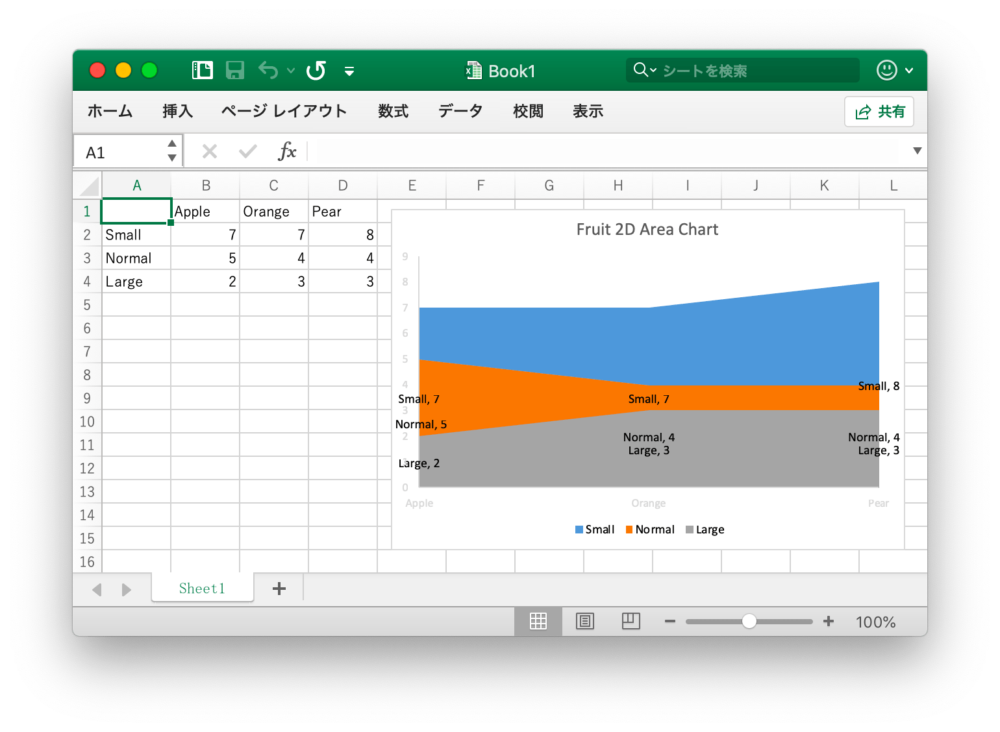</p>

```go
package main

import (
    "fmt"

    "github.com/360EntSecGroup-Skylar/excelize"
)

func main() {
    categories := map[string]string{"A2": "Small", "A3": "Normal", "A4": "Large", "B1": "Apple", "C1": "Orange", "D1": "Pear"}
    values := map[string]int{"B2": 7, "C2": 7, "D2": 8, "B3": 5, "C3": 4, "D3": 4, "B4": 2, "C4": 3, "D4": 3}
    xlsx := excelize.NewFile()
    for k, v := range categories {
        xlsx.SetCellValue("Sheet1", k, v)
    }
    for k, v := range values {
        xlsx.SetCellValue("Sheet1", k, v)
    }
    err := xlsx.AddChart("Sheet1", "E1", `{"type":"area","series":[{"name":"Sheet1!$A$2","categories":"","values":"Sheet1!$B$2:$D$2"},{"name":"Sheet1!$A$3","categories":"Sheet1!$B$1:$D$1","values":"Sheet1!$B$3:$D$3"},{"name":"Sheet1!$A$4","categories":"Sheet1!$B$1:$D$1","values":"Sheet1!$B$4:$D$4"}],"format":{"x_scale":1.0,"y_scale":1.0,"x_offset":15,"y_offset":10,"print_obj":true,"lock_aspect_ratio":false,"locked":false},"legend":{"position":"bottom","show_legend_key":false},"title":{"name":"Fruit 2D Area Chart"},"plotarea":{"show_bubble_size":true,"show_cat_name":false,"show_leader_lines":false,"show_percent":true,"show_series_name":true,"show_val":true},"show_blanks_as":"zero"}`)
    if err != nil {
        fmt.Println(err)
    }
    // ブックを保存する
    err = xlsx.SaveAs("./Book1.xlsx")
    if err != nil {
        fmt.Println(err)
    }
}
```

### 2D 積層型エリアチャート {#areaStacked}

例えば、次のような効果を持つ 2D 積層型エリアチャート 作成します:

<p align="center">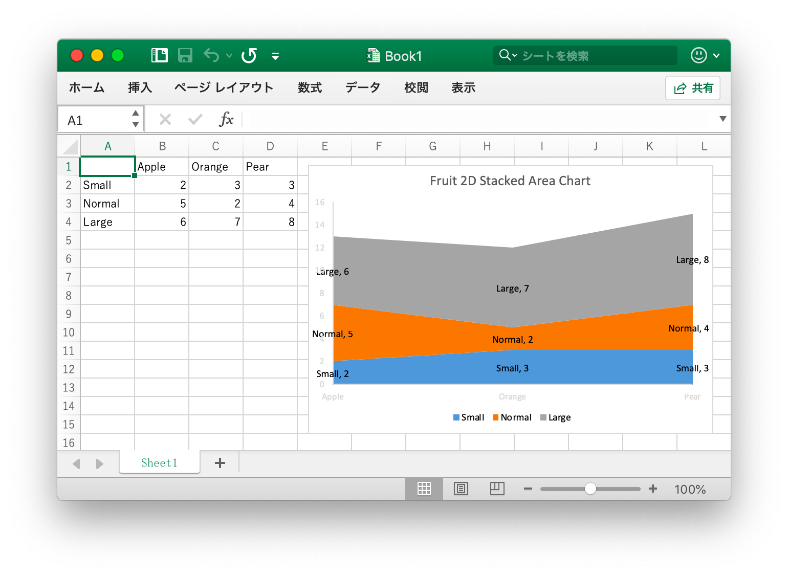</p>

```go
package main

import (
    "fmt"

    "github.com/360EntSecGroup-Skylar/excelize"
)

func main() {
    categories := map[string]string{"A2": "Small", "A3": "Normal", "A4": "Large", "B1": "Apple", "C1": "Orange", "D1": "Pear"}
    values := map[string]int{"B2": 2, "C2": 3, "D2": 3, "B3": 5, "C3": 2, "D3": 4, "B4": 6, "C4": 7, "D4": 8}
    xlsx := excelize.NewFile()
    for k, v := range categories {
        xlsx.SetCellValue("Sheet1", k, v)
    }
    for k, v := range values {
        xlsx.SetCellValue("Sheet1", k, v)
    }
    err := xlsx.AddChart("Sheet1", "E1", `{"type":"areaStacked","series":[{"name":"Sheet1!$A$2","categories":"","values":"Sheet1!$B$2:$D$2"},{"name":"Sheet1!$A$3","categories":"Sheet1!$B$1:$D$1","values":"Sheet1!$B$3:$D$3"},{"name":"Sheet1!$A$4","categories":"Sheet1!$B$1:$D$1","values":"Sheet1!$B$4:$D$4"}],"format":{"x_scale":1.0,"y_scale":1.0,"x_offset":15,"y_offset":10,"print_obj":true,"lock_aspect_ratio":false,"locked":false},"legend":{"position":"bottom","show_legend_key":false},"title":{"name":"Fruit 2D Stacked Area Chart"},"plotarea":{"show_bubble_size":true,"show_cat_name":false,"show_leader_lines":false,"show_percent":true,"show_series_name":true,"show_val":true},"show_blanks_as":"zero"}`)
    if err != nil {
        fmt.Println(err)
    }
    // ブックを保存する
    err = xlsx.SaveAs("./Book1.xlsx")
    if err != nil {
        fmt.Println(err)
    }
}
```

### 2D 100% 積み上げ面グラフ {#areaPercentStacked}

### 3D エリアチャート {#area3D}

例えば、次のような効果を持つ 3D エリアチャート 作成します:

<p align="center">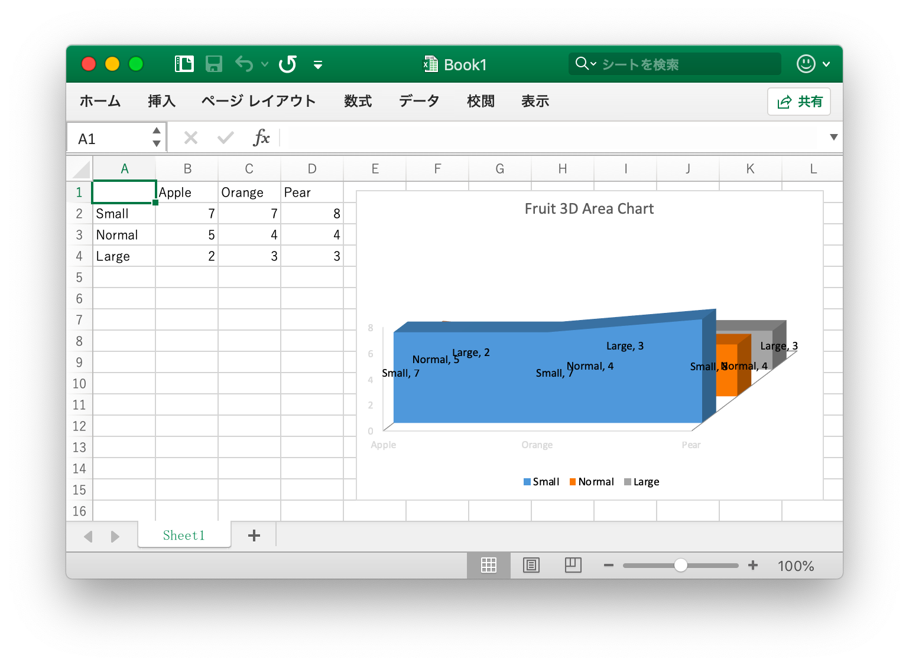</p>

```go
package main

import (
    "fmt"

    "github.com/360EntSecGroup-Skylar/excelize"
)

func main() {
    categories := map[string]string{"A2": "Small", "A3": "Normal", "A4": "Large", "B1": "Apple", "C1": "Orange", "D1": "Pear"}
    values := map[string]int{"B2": 7, "C2": 7, "D2": 8, "B3": 5, "C3": 4, "D3": 4, "B4": 2, "C4": 3, "D4": 3}
    xlsx := excelize.NewFile()
    for k, v := range categories {
        xlsx.SetCellValue("Sheet1", k, v)
    }
    for k, v := range values {
        xlsx.SetCellValue("Sheet1", k, v)
    }
    err := xlsx.AddChart("Sheet1", "E1", `{"type":"area3D","series":[{"name":"Sheet1!$A$2","categories":"","values":"Sheet1!$B$2:$D$2"},{"name":"Sheet1!$A$3","categories":"Sheet1!$B$1:$D$1","values":"Sheet1!$B$3:$D$3"},{"name":"Sheet1!$A$4","categories":"Sheet1!$B$1:$D$1","values":"Sheet1!$B$4:$D$4"}],"format":{"x_scale":1.0,"y_scale":1.0,"x_offset":15,"y_offset":10,"print_obj":true,"lock_aspect_ratio":false,"locked":false},"legend":{"position":"bottom","show_legend_key":false},"title":{"name":"Fruit 3D Area Chart"},"plotarea":{"show_bubble_size":true,"show_cat_name":false,"show_leader_lines":false,"show_percent":true,"show_series_name":true,"show_val":true},"show_blanks_as":"zero"}`)
    if err != nil {
        fmt.Println(err)
    }
    // ブックを保存する
    err = xlsx.SaveAs("./Book1.xlsx")
    if err != nil {
        fmt.Println(err)
    }
}
```

### 3D 積み上げ面グラフ {#area3DStacked}

例えば、次のような効果を持つ 3D 積み上げ面グラフ 作成します:

<p align="center">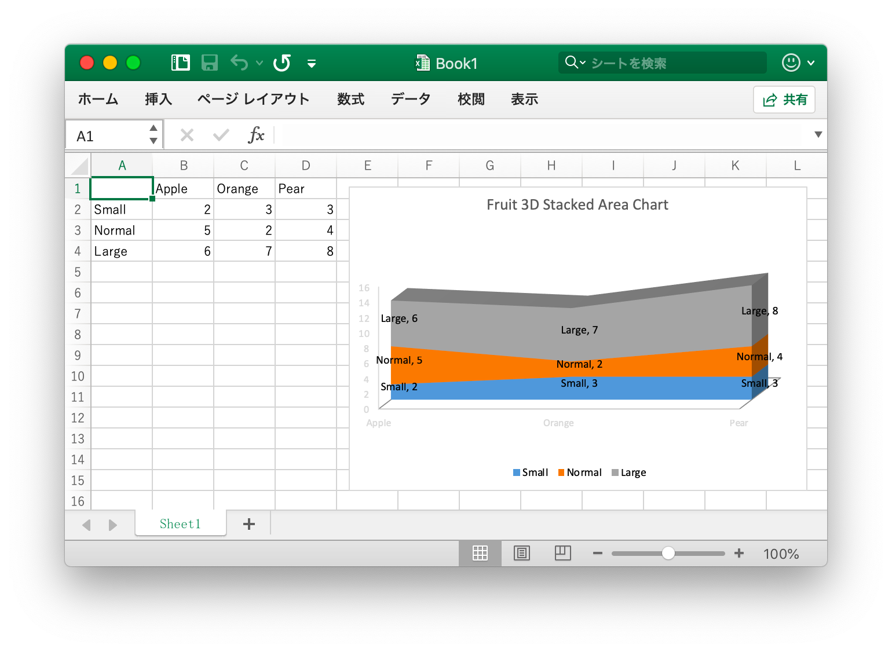</p>

```go
package main

import (
    "fmt"

    "github.com/360EntSecGroup-Skylar/excelize"
)

func main() {
    categories := map[string]string{"A2": "Small", "A3": "Normal", "A4": "Large", "B1": "Apple", "C1": "Orange", "D1": "Pear"}
    values := map[string]int{"B2": 2, "C2": 3, "D2": 3, "B3": 5, "C3": 2, "D3": 4, "B4": 6, "C4": 7, "D4": 8}
    xlsx := excelize.NewFile()
    for k, v := range categories {
        xlsx.SetCellValue("Sheet1", k, v)
    }
    for k, v := range values {
        xlsx.SetCellValue("Sheet1", k, v)
    }
    err := xlsx.AddChart("Sheet1", "E1", `{"type":"area3DStacked","series":[{"name":"Sheet1!$A$2","categories":"","values":"Sheet1!$B$2:$D$2"},{"name":"Sheet1!$A$3","categories":"Sheet1!$B$1:$D$1","values":"Sheet1!$B$3:$D$3"},{"name":"Sheet1!$A$4","categories":"Sheet1!$B$1:$D$1","values":"Sheet1!$B$4:$D$4"}],"format":{"x_scale":1.0,"y_scale":1.0,"x_offset":15,"y_offset":10,"print_obj":true,"lock_aspect_ratio":false,"locked":false},"legend":{"position":"bottom","show_legend_key":false},"title":{"name":"Fruit 3D Stacked Area Chart"},"plotarea":{"show_bubble_size":true,"show_cat_name":false,"show_leader_lines":false,"show_percent":true,"show_series_name":true,"show_val":true},"show_blanks_as":"zero"}`)
    if err != nil {
        fmt.Println(err)
    }
    // ブックを保存する
    err = xlsx.SaveAs("./Book1.xlsx")
    if err != nil {
        fmt.Println(err)
    }
}
```

### 3D 100％ 積み上げ面グラフ {#area3DPercentStacked}

例えば、次のような効果を持つ 3D 100％ 積み上げ面グラフ 作成します:

<p align="center">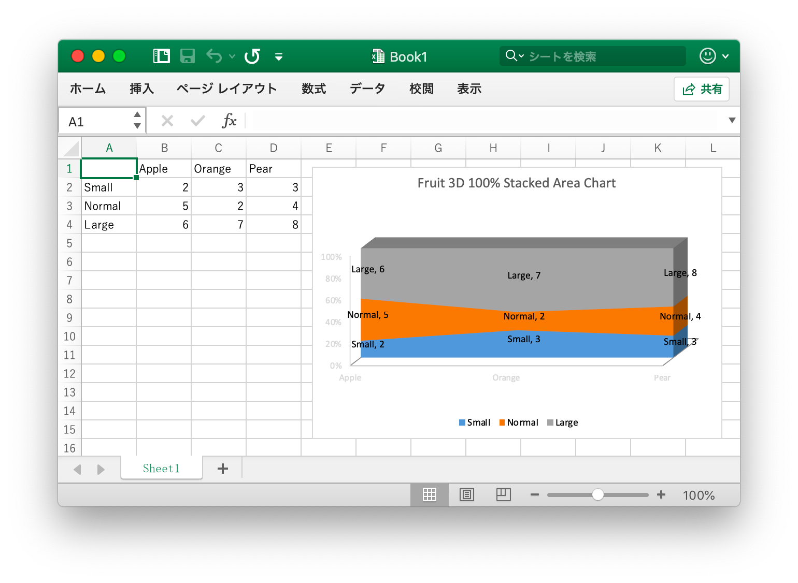</p>

```go
package main

import (
    "fmt"

    "github.com/360EntSecGroup-Skylar/excelize"
)

func main() {
    categories := map[string]string{"A2": "Small", "A3": "Normal", "A4": "Large", "B1": "Apple", "C1": "Orange", "D1": "Pear"}
    values := map[string]int{"B2": 2, "C2": 3, "D2": 3, "B3": 5, "C3": 2, "D3": 4, "B4": 6, "C4": 7, "D4": 8}
    xlsx := excelize.NewFile()
    for k, v := range categories {
        xlsx.SetCellValue("Sheet1", k, v)
    }
    for k, v := range values {
        xlsx.SetCellValue("Sheet1", k, v)
    }
    err := xlsx.AddChart("Sheet1", "E1", `{"type":"area3DPercentStacked","series":[{"name":"Sheet1!$A$2","categories":"","values":"Sheet1!$B$2:$D$2"},{"name":"Sheet1!$A$3","categories":"Sheet1!$B$1:$D$1","values":"Sheet1!$B$3:$D$3"},{"name":"Sheet1!$A$4","categories":"Sheet1!$B$1:$D$1","values":"Sheet1!$B$4:$D$4"}],"format":{"x_scale":1.0,"y_scale":1.0,"x_offset":15,"y_offset":10,"print_obj":true,"lock_aspect_ratio":false,"locked":false},"legend":{"position":"bottom","show_legend_key":false},"title":{"name":"Fruit 3D 100% Stacked Area Chart"},"plotarea":{"show_bubble_size":true,"show_cat_name":false,"show_leader_lines":false,"show_percent":true,"show_series_name":true,"show_val":true},"show_blanks_as":"zero"}`)
    if err != nil {
        fmt.Println(err)
    }
    // ブックを保存する
    err = xlsx.SaveAs("./Book1.xlsx")
    if err != nil {
        fmt.Println(err)
    }
}
```

### 2D クラスタ棒グラフ {#bar}

例えば、次のような効果を持つ 2D クラスタ棒グラフ 作成します:

<p align="center">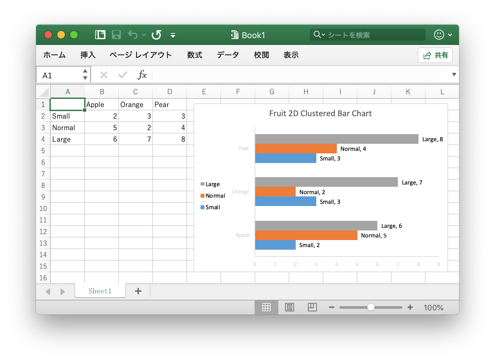</p>

```go
package main

import (
    "fmt"

    "github.com/360EntSecGroup-Skylar/excelize"
)

func main() {
    categories := map[string]string{"A2": "Small", "A3": "Normal", "A4": "Large", "B1": "Apple", "C1": "Orange", "D1": "Pear"}
    values := map[string]int{"B2": 2, "C2": 3, "D2": 3, "B3": 5, "C3": 2, "D3": 4, "B4": 6, "C4": 7, "D4": 8}
    xlsx := excelize.NewFile()
    for k, v := range categories {
        xlsx.SetCellValue("Sheet1", k, v)
    }
    for k, v := range values {
        xlsx.SetCellValue("Sheet1", k, v)
    }
    err := xlsx.AddChart("Sheet1", "E1", `{"type":"bar","series":[{"name":"Sheet1!$A$2","categories":"","values":"Sheet1!$B$2:$D$2"},{"name":"Sheet1!$A$3","categories":"Sheet1!$B$1:$D$1","values":"Sheet1!$B$3:$D$3"},{"name":"Sheet1!$A$4","categories":"Sheet1!$B$1:$D$1","values":"Sheet1!$B$4:$D$4"}],"format":{"x_scale":1.0,"y_scale":1.0,"x_offset":15,"y_offset":10,"print_obj":true,"lock_aspect_ratio":false,"locked":false},"legend":{"position":"left","show_legend_key":false},"title":{"name":"Fruit 2D Clustered Bar Chart"},"plotarea":{"show_bubble_size":true,"show_cat_name":false,"show_leader_lines":false,"show_percent":true,"show_series_name":true,"show_val":true},"show_blanks_as":"zero"}`)
    if err != nil {
        fmt.Println(err)
    }
    // ブックを保存する
    err = xlsx.SaveAs("./Book1.xlsx")
    if err != nil {
        fmt.Println(err)
    }
}
```

### 2D 積み上げ棒グラフ {#barStacked}

例えば、次のような効果を持つ 2D 積み上げ棒グラフ 作成します:

<p align="center">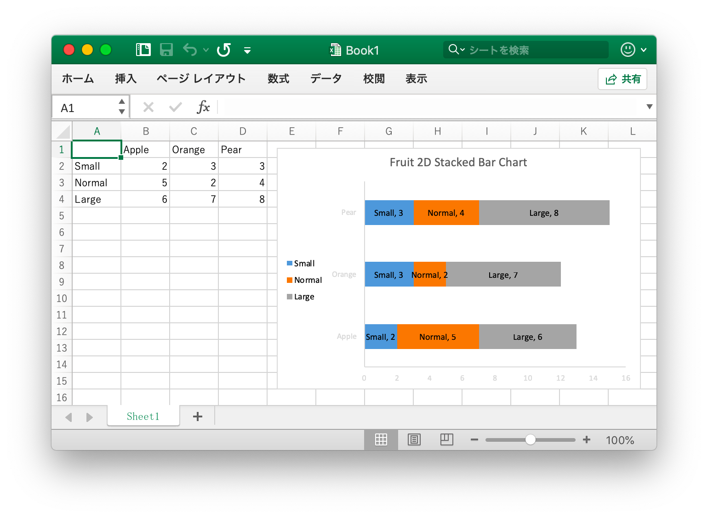</p>

```go
package main

import (
    "fmt"

    "github.com/360EntSecGroup-Skylar/excelize"
)

func main() {
    categories := map[string]string{"A2": "Small", "A3": "Normal", "A4": "Large", "B1": "Apple", "C1": "Orange", "D1": "Pear"}
    values := map[string]int{"B2": 2, "C2": 3, "D2": 3, "B3": 5, "C3": 2, "D3": 4, "B4": 6, "C4": 7, "D4": 8}
    xlsx := excelize.NewFile()
    for k, v := range categories {
        xlsx.SetCellValue("Sheet1", k, v)
    }
    for k, v := range values {
        xlsx.SetCellValue("Sheet1", k, v)
    }
    err := xlsx.AddChart("Sheet1", "E1", `{"type":"barStacked","series":[{"name":"Sheet1!$A$2","categories":"","values":"Sheet1!$B$2:$D$2"},{"name":"Sheet1!$A$3","categories":"Sheet1!$B$1:$D$1","values":"Sheet1!$B$3:$D$3"},{"name":"Sheet1!$A$4","categories":"Sheet1!$B$1:$D$1","values":"Sheet1!$B$4:$D$4"}],"format":{"x_scale":1.0,"y_scale":1.0,"x_offset":15,"y_offset":10,"print_obj":true,"lock_aspect_ratio":false,"locked":false},"legend":{"position":"left","show_legend_key":false},"title":{"name":"Fruit 2D Stacked Bar Chart"},"plotarea":{"show_bubble_size":true,"show_cat_name":false,"show_leader_lines":false,"show_percent":true,"show_series_name":true,"show_val":true},"show_blanks_as":"zero"}`)
    if err != nil {
        fmt.Println(err)
    }
    // ブックを保存する
    err = xlsx.SaveAs("./Book1.xlsx")
    if err != nil {
        fmt.Println(err)
    }
}
```

### 2D 100% 積み上げ棒グラフ {#barPercentStacked}

例えば、次のような効果を持つ 2D 100% 積み上げ棒グラフ 作成します:

<p align="center">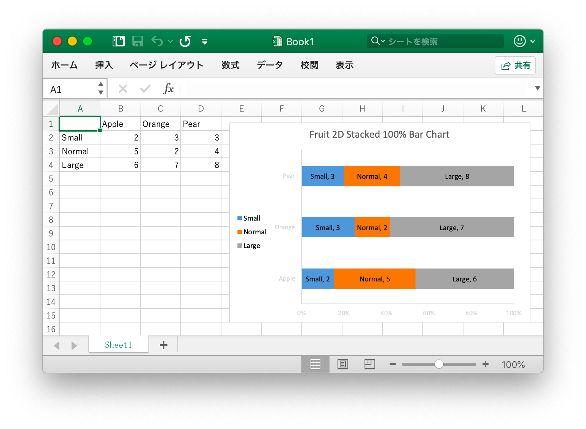</p>

```go
package main

import (
    "fmt"

    "github.com/360EntSecGroup-Skylar/excelize"
)

func main() {
    categories := map[string]string{"A2": "Small", "A3": "Normal", "A4": "Large", "B1": "Apple", "C1": "Orange", "D1": "Pear"}
    values := map[string]int{"B2": 2, "C2": 3, "D2": 3, "B3": 5, "C3": 2, "D3": 4, "B4": 6, "C4": 7, "D4": 8}
    xlsx := excelize.NewFile()
    for k, v := range categories {
        xlsx.SetCellValue("Sheet1", k, v)
    }
    for k, v := range values {
        xlsx.SetCellValue("Sheet1", k, v)
    }
    err := xlsx.AddChart("Sheet1", "E1", `{"type":"barPercentStacked","series":[{"name":"Sheet1!$A$2","categories":"","values":"Sheet1!$B$2:$D$2"},{"name":"Sheet1!$A$3","categories":"Sheet1!$B$1:$D$1","values":"Sheet1!$B$3:$D$3"},{"name":"Sheet1!$A$4","categories":"Sheet1!$B$1:$D$1","values":"Sheet1!$B$4:$D$4"}],"format":{"x_scale":1.0,"y_scale":1.0,"x_offset":15,"y_offset":10,"print_obj":true,"lock_aspect_ratio":false,"locked":false},"legend":{"position":"left","show_legend_key":false},"title":{"name":"Fruit 2D Stacked 100% Bar Chart"},"plotarea":{"show_bubble_size":true,"show_cat_name":false,"show_leader_lines":false,"show_percent":true,"show_series_name":true,"show_val":true},"show_blanks_as":"zero"}`)
    if err != nil {
        fmt.Println(err)
    }
    // ブックを保存する
    err = xlsx.SaveAs("./Book1.xlsx")
    if err != nil {
        fmt.Println(err)
    }
}
```

### 3D クラスター棒グラフ {#bar3DClustered}

例えば、次のような効果を持つ 3D クラスター棒グラフ 作成します:

<p align="center">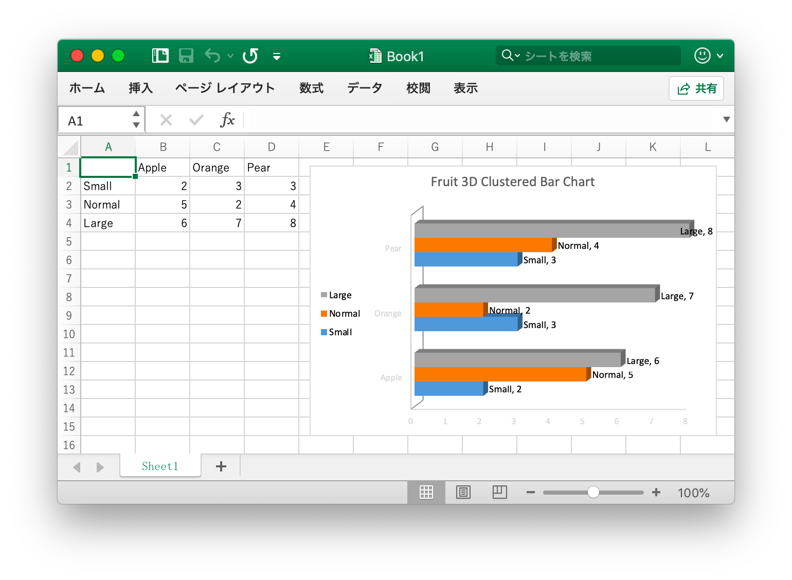</p>

```go
package main

import (
    "fmt"

    "github.com/360EntSecGroup-Skylar/excelize"
)

func main() {
    categories := map[string]string{"A2": "Small", "A3": "Normal", "A4": "Large", "B1": "Apple", "C1": "Orange", "D1": "Pear"}
    values := map[string]int{"B2": 2, "C2": 3, "D2": 3, "B3": 5, "C3": 2, "D3": 4, "B4": 6, "C4": 7, "D4": 8}
    xlsx := excelize.NewFile()
    for k, v := range categories {
        xlsx.SetCellValue("Sheet1", k, v)
    }
    for k, v := range values {
        xlsx.SetCellValue("Sheet1", k, v)
    }
    err := xlsx.AddChart("Sheet1", "E1", `{"type":"bar3DClustered","series":[{"name":"Sheet1!$A$2","categories":"","values":"Sheet1!$B$2:$D$2"},{"name":"Sheet1!$A$3","categories":"Sheet1!$B$1:$D$1","values":"Sheet1!$B$3:$D$3"},{"name":"Sheet1!$A$4","categories":"Sheet1!$B$1:$D$1","values":"Sheet1!$B$4:$D$4"}],"format":{"x_scale":1.0,"y_scale":1.0,"x_offset":15,"y_offset":10,"print_obj":true,"lock_aspect_ratio":false,"locked":false},"legend":{"position":"left","show_legend_key":false},"title":{"name":"Fruit 3D Clustered Bar Chart"},"plotarea":{"show_bubble_size":true,"show_cat_name":false,"show_leader_lines":false,"show_percent":true,"show_series_name":true,"show_val":true},"show_blanks_as":"zero"}`)
    if err != nil {
        fmt.Println(err)
    }
    // ブックを保存する
    err = xlsx.SaveAs("./Book1.xlsx")
    if err != nil {
        fmt.Println(err)
    }
}
```

### 3D 積み上げ棒グラフ {#bar3DStacked}

例えば、次のような効果を持つ 3D 積み上げ棒グラフ 作成します:

<p align="center">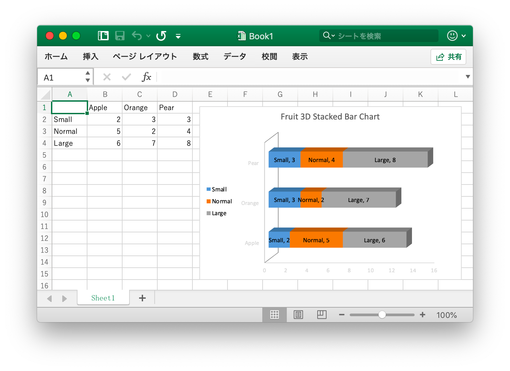</p>

```go
package main

import (
    "fmt"

    "github.com/360EntSecGroup-Skylar/excelize"
)

func main() {
    categories := map[string]string{"A2": "Small", "A3": "Normal", "A4": "Large", "B1": "Apple", "C1": "Orange", "D1": "Pear"}
    values := map[string]int{"B2": 2, "C2": 3, "D2": 3, "B3": 5, "C3": 2, "D3": 4, "B4": 6, "C4": 7, "D4": 8}
    xlsx := excelize.NewFile()
    for k, v := range categories {
        xlsx.SetCellValue("Sheet1", k, v)
    }
    for k, v := range values {
        xlsx.SetCellValue("Sheet1", k, v)
    }
    err := xlsx.AddChart("Sheet1", "E1", `{"type":"bar3DStacked","series":[{"name":"Sheet1!$A$2","categories":"","values":"Sheet1!$B$2:$D$2"},{"name":"Sheet1!$A$3","categories":"Sheet1!$B$1:$D$1","values":"Sheet1!$B$3:$D$3"},{"name":"Sheet1!$A$4","categories":"Sheet1!$B$1:$D$1","values":"Sheet1!$B$4:$D$4"}],"format":{"x_scale":1.0,"y_scale":1.0,"x_offset":15,"y_offset":10,"print_obj":true,"lock_aspect_ratio":false,"locked":false},"legend":{"position":"left","show_legend_key":false},"title":{"name":"Fruit 3D Stacked Bar Chart"},"plotarea":{"show_bubble_size":true,"show_cat_name":false,"show_leader_lines":false,"show_percent":true,"show_series_name":true,"show_val":true},"show_blanks_as":"zero"}`)
    if err != nil {
        fmt.Println(err)
    }
    // ブックを保存する
    err = xlsx.SaveAs("./Book1.xlsx")
    if err != nil {
        fmt.Println(err)
    }
}
```

### 3D 100% 積み上げ棒グラフ {#bar3DPercentStacked}

例えば、次のような効果を持つ 3D 100% 積み上げ棒グラフ 作成します:

<p align="center">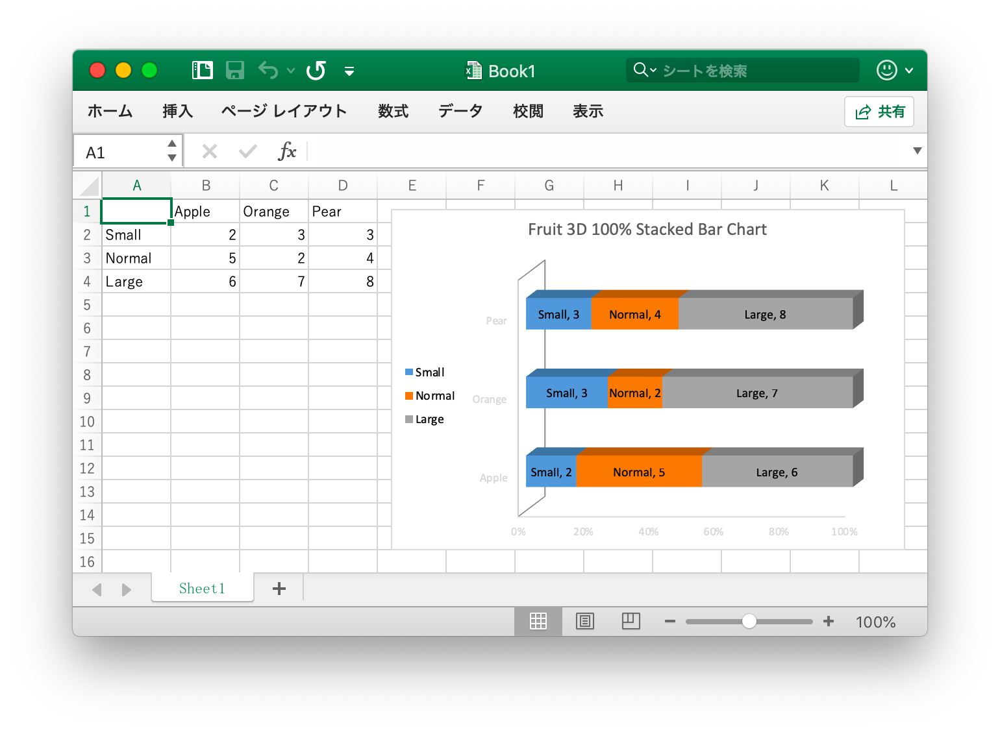</p>

```go
package main

import (
    "fmt"

    "github.com/360EntSecGroup-Skylar/excelize"
)

func main() {
    categories := map[string]string{"A2": "Small", "A3": "Normal", "A4": "Large", "B1": "Apple", "C1": "Orange", "D1": "Pear"}
    values := map[string]int{"B2": 2, "C2": 3, "D2": 3, "B3": 5, "C3": 2, "D3": 4, "B4": 6, "C4": 7, "D4": 8}
    xlsx := excelize.NewFile()
    for k, v := range categories {
        xlsx.SetCellValue("Sheet1", k, v)
    }
    for k, v := range values {
        xlsx.SetCellValue("Sheet1", k, v)
    }
    err := xlsx.AddChart("Sheet1", "E1", `{"type":"bar3DPercentStacked","series":[{"name":"Sheet1!$A$2","categories":"","values":"Sheet1!$B$2:$D$2"},{"name":"Sheet1!$A$3","categories":"Sheet1!$B$1:$D$1","values":"Sheet1!$B$3:$D$3"},{"name":"Sheet1!$A$4","categories":"Sheet1!$B$1:$D$1","values":"Sheet1!$B$4:$D$4"}],"format":{"x_scale":1.0,"y_scale":1.0,"x_offset":15,"y_offset":10,"print_obj":true,"lock_aspect_ratio":false,"locked":false},"legend":{"position":"left","show_legend_key":false},"title":{"name":"Fruit 3D 100% Stacked Bar Chart"},"plotarea":{"show_bubble_size":true,"show_cat_name":false,"show_leader_lines":false,"show_percent":true,"show_series_name":true,"show_val":true},"show_blanks_as":"zero"}`)
    if err != nil {
        fmt.Println(err)
    }
    // ブックを保存する
    err = xlsx.SaveAs("./Book1.xlsx")
    if err != nil {
        fmt.Println(err)
    }
}
```

### 2D クラスター縦棒グラフ {#col}

例えば、次のような効果を持つ 2D クラスター縦棒グラフ 作成します:

<p align="center">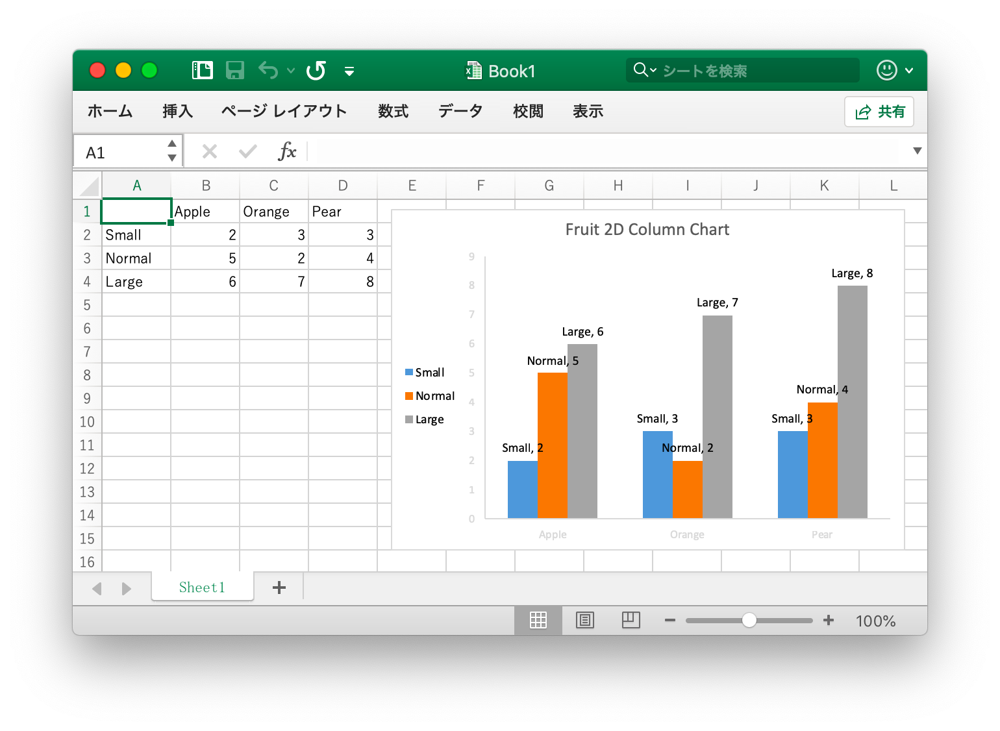</p>

```go
package main

import (
    "fmt"

    "github.com/360EntSecGroup-Skylar/excelize"
)

func main() {
    categories := map[string]string{"A2": "Small", "A3": "Normal", "A4": "Large", "B1": "Apple", "C1": "Orange", "D1": "Pear"}
    values := map[string]int{"B2": 2, "C2": 3, "D2": 3, "B3": 5, "C3": 2, "D3": 4, "B4": 6, "C4": 7, "D4": 8}
    xlsx := excelize.NewFile()
    for k, v := range categories {
        xlsx.SetCellValue("Sheet1", k, v)
    }
    for k, v := range values {
        xlsx.SetCellValue("Sheet1", k, v)
    }
    err := xlsx.AddChart("Sheet1", "E1", `{"type":"col","series":[{"name":"Sheet1!$A$2","categories":"","values":"Sheet1!$B$2:$D$2"},{"name":"Sheet1!$A$3","categories":"Sheet1!$B$1:$D$1","values":"Sheet1!$B$3:$D$3"},{"name":"Sheet1!$A$4","categories":"Sheet1!$B$1:$D$1","values":"Sheet1!$B$4:$D$4"}],"format":{"x_scale":1.0,"y_scale":1.0,"x_offset":15,"y_offset":10,"print_obj":true,"lock_aspect_ratio":false,"locked":false},"legend":{"position":"left","show_legend_key":false},"title":{"name":"Fruit 2D Column Chart"},"plotarea":{"show_bubble_size":true,"show_cat_name":false,"show_leader_lines":false,"show_percent":true,"show_series_name":true,"show_val":true},"show_blanks_as":"zero"}`)
    if err != nil {
        fmt.Println(err)
    }
    // ブックを保存する
    err = xlsx.SaveAs("./Book1.xlsx")
    if err != nil {
        fmt.Println(err)
    }
}
```

### 2D 積み上げ縦棒グラフ {#colStacked}

### 2D 100% 積み上げ縦棒グラフ {#colPercentStacked}

### 3D クラスター縦棒グラフ {#col3DClustered}

例えば、次のような効果を持つ 3D クラスター縦棒グラフ 作成します:

<p align="center">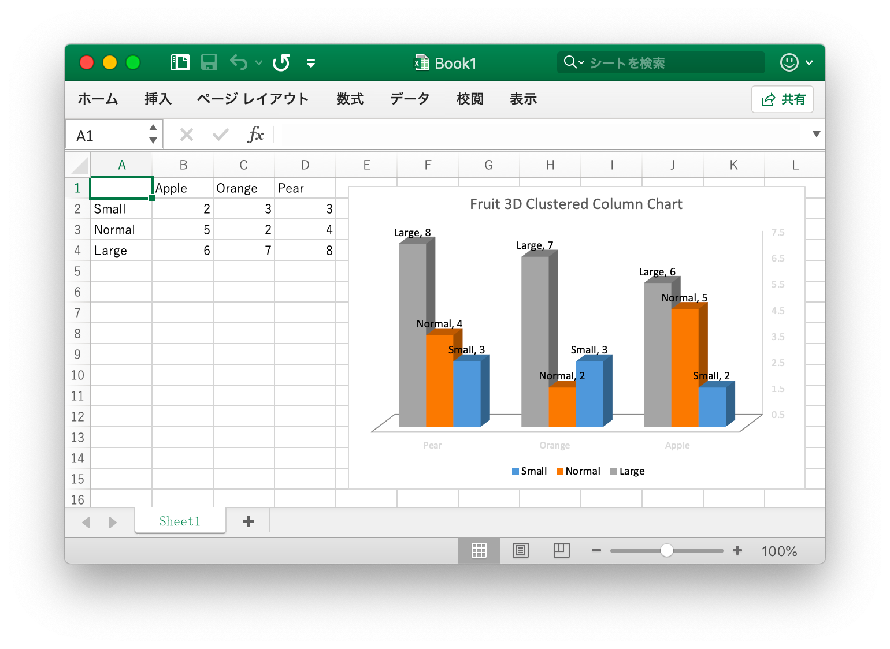</p>

```go
package main

import (
    "fmt"

    "github.com/360EntSecGroup-Skylar/excelize"
)

func main() {
    categories := map[string]string{"A2": "Small", "A3": "Normal", "A4": "Large", "B1": "Apple", "C1": "Orange", "D1": "Pear"}
    values := map[string]int{"B2": 2, "C2": 3, "D2": 3, "B3": 5, "C3": 2, "D3": 4, "B4": 6, "C4": 7, "D4": 8}
    xlsx := excelize.NewFile()
    for k, v := range categories {
        xlsx.SetCellValue("Sheet1", k, v)
    }
    for k, v := range values {
        xlsx.SetCellValue("Sheet1", k, v)
    }
    err := xlsx.AddChart("Sheet1", "E1", `{"type":"col3DClustered","series":[{"name":"Sheet1!$A$2","categories":"Sheet1!$B$1:$D$1","values":"Sheet1!$B$2:$D$2"},{"name":"Sheet1!$A$3","categories":"Sheet1!$B$1:$D$1","values":"Sheet1!$B$3:$D$3"},{"name":"Sheet1!$A$4","categories":"Sheet1!$B$1:$D$1","values":"Sheet1!$B$4:$D$4"}],"format":{"x_scale":1.0,"y_scale":1.0,"x_offset":15,"y_offset":10,"print_obj":true,"lock_aspect_ratio":false,"locked":false},"legend":{"position":"bottom","show_legend_key":false},"title":{"name":"Fruit 3D Clustered Column Chart"},"plotarea":{"show_bubble_size":true,"show_cat_name":false,"show_leader_lines":false,"show_percent":true,"show_series_name":true,"show_val":true},"show_blanks_as":"zero","x_axis":{"reverse_order":true},"y_axis":{"maximum":7.5,"minimum":0.5}}`)
    if err != nil {
        fmt.Println(err)
    }
    // ブックを保存する
    err = xlsx.SaveAs("./Book1.xlsx")
    if err != nil {
        fmt.Println(err)
    }
}
```

### 3D 縦棒グラフ {#col3D}

### 3D 積み上げ縦棒グラフ {#col3DStacked}

### 3D 100% 積み上げ縦棒グラフ {#col3DPercentStacked}

### ドーナツチャート {#doughnut}

例えば、次のような効果を持つ ドーナツチャート 作成します:

<p align="center">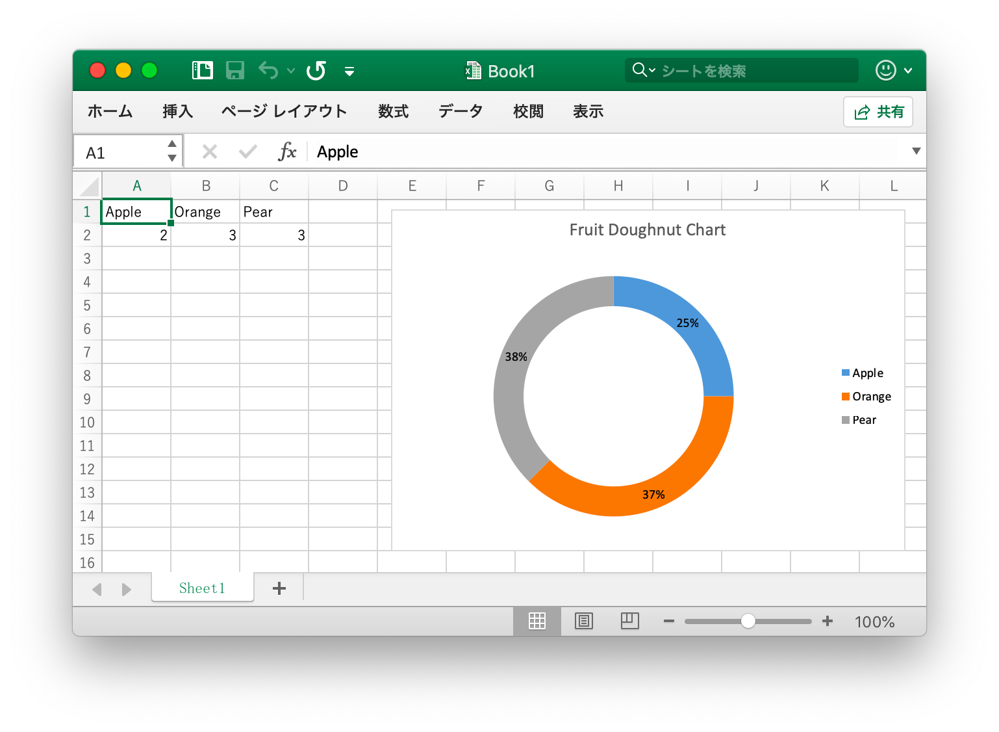</p>

```go
package main

import (
    "fmt"

    "github.com/360EntSecGroup-Skylar/excelize"
)

func main() {
    categories := map[string]string{"A1": "Apple", "B1": "Orange", "C1": "Pear"}
    values := map[string]int{"A2": 2, "B2": 3, "C2": 3}
    xlsx := excelize.NewFile()
    for k, v := range categories {
        xlsx.SetCellValue("Sheet1", k, v)
    }
    for k, v := range values {
        xlsx.SetCellValue("Sheet1", k, v)
    }
    err := xlsx.AddChart("Sheet1", "E1", `{"type":"doughnut","series":[{"name":"Sheet1!$A$2","categories":"Sheet1!$A$1:$C$1","values":"Sheet1!$A$2:$C$2"}],"format":{"x_scale":1.0,"y_scale":1.0,"x_offset":15,"y_offset":10,"print_obj":true,"lock_aspect_ratio":false,"locked":false},"legend":{"position":"right","show_legend_key":false},"title":{"name":"Fruit Doughnut Chart"},"plotarea":{"show_bubble_size":false,"show_cat_name":false,"show_leader_lines":false,"show_percent":true,"show_series_name":false,"show_val":false},"show_blanks_as":"zero"}`)
    if err != nil {
        fmt.Println(err)
    }
    // ブックを保存する
    err = xlsx.SaveAs("./Book1.xlsx")
    if err != nil {
        fmt.Println(err)
    }
}
```

### 折れ線グラフ {#line}

例えば、次のような効果を持つ 折れ線グラフ 作成します:

<p align="center"></p>

```go
package main

import (
    "fmt"

    "github.com/360EntSecGroup-Skylar/excelize"
)

func main() {
    categories := map[string]string{"A2": "Small", "A3": "Normal", "A4": "Large", "B1": "Apple", "C1": "Orange", "D1": "Pear"}
    values := map[string]int{"B2": 2, "C2": 3, "D2": 3, "B3": 5, "C3": 2, "D3": 4, "B4": 6, "C4": 7, "D4": 8}
    xlsx := excelize.NewFile()
    for k, v := range categories {
        xlsx.SetCellValue("Sheet1", k, v)
    }
    for k, v := range values {
        xlsx.SetCellValue("Sheet1", k, v)
    }

    xlsx.AddChart("Sheet1", "E1", `{"type":"line","series":[{"name":"Sheet1!$A$2","categories":"","values":"Sheet1!$B$2:$D$2"},{"name":"Sheet1!$A$3","categories":"Sheet1!$B$1:$D$1","values":"Sheet1!$B$3:$D$3"},{"name":"Sheet1!$A$4","categories":"Sheet1!$B$1:$D$1","values":"Sheet1!$B$4:$D$4"}],"format":{"x_scale":1.0,"y_scale":1.0,"x_offset":15,"y_offset":10,"print_obj":true,"lock_aspect_ratio":false,"locked":false},"legend":{"position":"top","show_legend_key":false},"title":{"name":"Fruit Line Chart"},"plotarea":{"show_bubble_size":true,"show_cat_name":false,"show_leader_lines":false,"show_percent":true,"show_series_name":true,"show_val":true},"show_blanks_as":"zero"}`)
    // ブックを保存する
    err := xlsx.SaveAs("./Book1.xlsx")
    if err != nil {
        fmt.Println(err)
    }
}
```

### 円グラフ {#pie}

例えば、次のような効果を持つ 円グラフ 作成します:

<p align="center">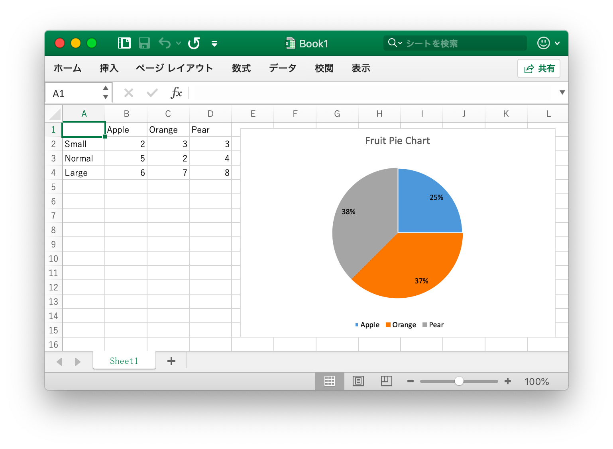</p>

```go
package main

import (
    "fmt"

    "github.com/360EntSecGroup-Skylar/excelize"
)

func main() {
    categories := map[string]string{"A2": "Small", "A3": "Normal", "A4": "Large", "B1": "Apple", "C1": "Orange", "D1": "Pear"}
    values := map[string]int{"B2": 2, "C2": 3, "D2": 3, "B3": 5, "C3": 2, "D3": 4, "B4": 6, "C4": 7, "D4": 8}
    xlsx := excelize.NewFile()
    for k, v := range categories {
        xlsx.SetCellValue("Sheet1", k, v)
    }
    for k, v := range values {
        xlsx.SetCellValue("Sheet1", k, v)
    }

    xlsx.AddChart("Sheet1", "E1", `{"type":"pie","series":[{"name":"Sheet1!$A$2","categories":"Sheet1!$B$1:$D$1","values":"Sheet1!$B$2:$D$2"}],"format":{"x_scale":1.0,"y_scale":1.0,"x_offset":15,"y_offset":10,"print_obj":true,"lock_aspect_ratio":false,"locked":false},"legend":{"position":"bottom","show_legend_key":false},"title":{"name":"Fruit Pie Chart"},"plotarea":{"show_bubble_size":true,"show_cat_name":false,"show_leader_lines":false,"show_percent":true,"show_series_name":false,"show_val":false},"show_blanks_as":"gap"}`)
    // ブックを保存する
    err := xlsx.SaveAs("./Book1.xlsx")
    if err != nil {
        fmt.Println(err)
    }
}
```

### 3D 円グラフ {#pie3D}

例えば、次のような効果を持つ 3D 円グラフ 作成します:

<p align="center"></p>

```go
package main

import (
    "fmt"

    "github.com/360EntSecGroup-Skylar/excelize"
)

func main() {
    categories := map[string]string{"A2": "Small", "A3": "Normal", "A4": "Large", "B1": "Apple", "C1": "Orange", "D1": "Pear"}
    values := map[string]int{"B2": 2, "C2": 3, "D2": 3, "B3": 5, "C3": 2, "D3": 4, "B4": 6, "C4": 7, "D4": 8}
    xlsx := excelize.NewFile()
    for k, v := range categories {
        xlsx.SetCellValue("Sheet1", k, v)
    }
    for k, v := range values {
        xlsx.SetCellValue("Sheet1", k, v)
    }

    xlsx.AddChart("Sheet1", "E1", `{"type":"pie3D","series":[{"name":"Sheet1!$A$2","categories":"Sheet1!$B$1:$D$1","values":"Sheet1!$B$2:$D$2"}],"format":{"x_scale":1.0,"y_scale":1.0,"x_offset":15,"y_offset":10,"print_obj":true,"lock_aspect_ratio":false,"locked":false},"legend":{"position":"bottom","show_legend_key":false},"title":{"name":"Fruit 3D Pie Chart"},"plotarea":{"show_bubble_size":true,"show_cat_name":false,"show_leader_lines":false,"show_percent":true,"show_series_name":false,"show_val":false},"show_blanks_as":"zero"}`)
    // ブックを保存する
    err := xlsx.SaveAs("./Book1.xlsx")
    if err != nil {
        fmt.Println(err)
    }
}
```

### レーダーチャート {#radar}

例えば、次のような効果を持つ レーダーチャート 作成します:

<p align="center">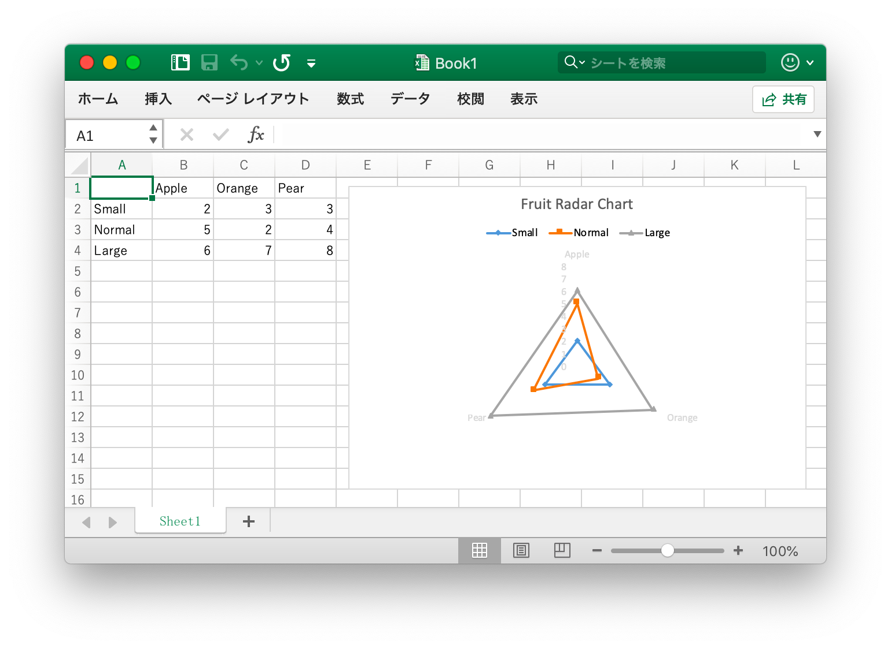</p>

```go
package main

import (
    "fmt"

    "github.com/360EntSecGroup-Skylar/excelize"
)

func main() {
    categories := map[string]string{"A2": "Small", "A3": "Normal", "A4": "Large", "B1": "Apple", "C1": "Orange", "D1": "Pear"}
    values := map[string]int{"B2": 2, "C2": 3, "D2": 3, "B3": 5, "C3": 2, "D3": 4, "B4": 6, "C4": 7, "D4": 8}
    xlsx := excelize.NewFile()
    for k, v := range categories {
        xlsx.SetCellValue("Sheet1", k, v)
    }
    for k, v := range values {
        xlsx.SetCellValue("Sheet1", k, v)
    }
    err := xlsx.AddChart("Sheet1", "E1", `{"type":"radar","series":[{"name":"Sheet1!$A$2","categories":"","values":"Sheet1!$B$2:$D$2"},{"name":"Sheet1!$A$3","categories":"Sheet1!$B$1:$D$1","values":"Sheet1!$B$3:$D$3"},{"name":"Sheet1!$A$4","categories":"Sheet1!$B$1:$D$1","values":"Sheet1!$B$4:$D$4"}],"format":{"x_scale":1.0,"y_scale":1.0,"x_offset":15,"y_offset":10,"print_obj":true,"lock_aspect_ratio":false,"locked":false},"legend":{"position":"top","show_legend_key":false},"title":{"name":"Fruit Radar Chart"},"plotarea":{"show_bubble_size":true,"show_cat_name":false,"show_leader_lines":false,"show_percent":true,"show_series_name":false,"show_val":false},"show_blanks_as":"span"}`)
    if err != nil {
        fmt.Println(err)
    }
    // ブックを保存する
    err = xlsx.SaveAs("./Book1.xlsx")
    if err != nil {
        fmt.Println(err)
    }
}
```

### 散布図 {#scatter}

例えば、次のような効果を持つ 散布図 作成します:

<p align="center">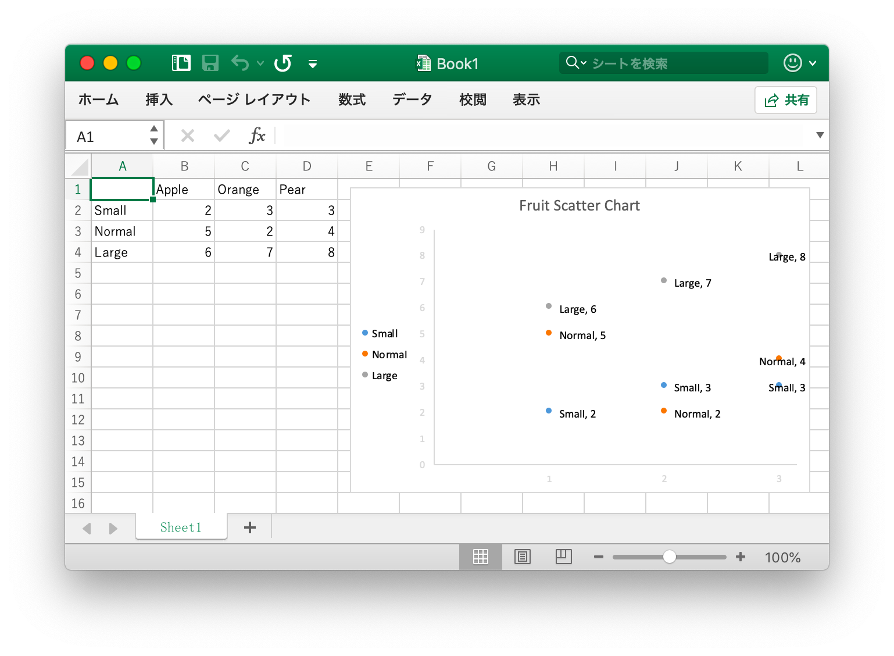</p>

```go
package main

import (
    "fmt"

    "github.com/360EntSecGroup-Skylar/excelize"
)

func main() {
    categories := map[string]string{"A2": "Small", "A3": "Normal", "A4": "Large", "B1": "Apple", "C1": "Orange", "D1": "Pear"}
    values := map[string]int{"B2": 2, "C2": 3, "D2": 3, "B3": 5, "C3": 2, "D3": 4, "B4": 6, "C4": 7, "D4": 8}
    xlsx := excelize.NewFile()
    for k, v := range categories {
        xlsx.SetCellValue("Sheet1", k, v)
    }
    for k, v := range values {
        xlsx.SetCellValue("Sheet1", k, v)
    }
    err := xlsx.AddChart("Sheet1", "E1", `{"type":"scatter","series":[{"name":"Sheet1!$A$2","categories":"","values":"Sheet1!$B$2:$D$2"},{"name":"Sheet1!$A$3","categories":"Sheet1!$B$1:$D$1","values":"Sheet1!$B$3:$D$3"},{"name":"Sheet1!$A$4","categories":"Sheet1!$B$1:$D$1","values":"Sheet1!$B$4:$D$4"}],"format":{"x_scale":1.0,"y_scale":1.0,"x_offset":15,"y_offset":10,"print_obj":true,"lock_aspect_ratio":false,"locked":false},"legend":{"position":"left","show_legend_key":false},"title":{"name":"Fruit Scatter Chart"},"plotarea":{"show_bubble_size":true,"show_cat_name":false,"show_leader_lines":false,"show_percent":true,"show_series_name":true,"show_val":true},"show_blanks_as":"zero"}`)
    if err != nil {
        fmt.Println(err)
    }
    // ブックを保存する
    err = xlsx.SaveAs("./Book1.xlsx")
    if err != nil {
        fmt.Println(err)
    }
}
```
