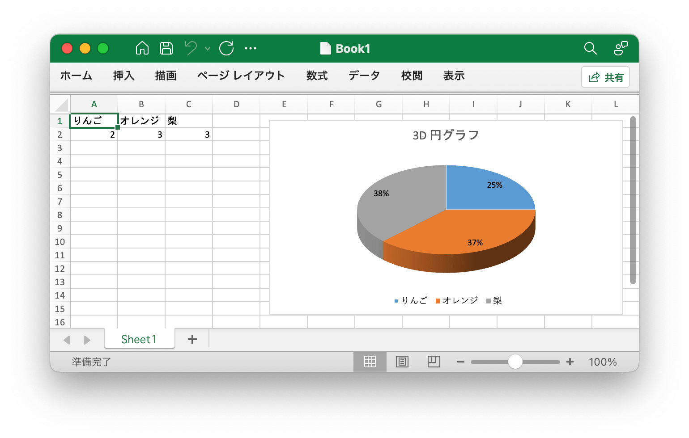

# 3D 円グラフ {#pie3D}

例えば、次のような効果を持つ 3D 円グラフ 作成します:

<p align="center"></p>

```go
package main

import (
    "fmt"

    "github.com/xuri/excelize/v2"
)

func main() {
    f := excelize.NewFile()
    defer func() {
        if err := f.Close(); err != nil {
            fmt.Println(err)
        }
    }()
    for idx, row := range [][]interface{}{
        {"りんご", "オレンジ", "梨"},
        {2, 3, 3},
    } {
        cell, err := excelize.CoordinatesToCellName(1, idx+1)
        if err != nil {
            fmt.Println(err)
            return
        }
        if err := f.SetSheetRow("Sheet1", cell, &row); err != nil {
            fmt.Println(err)
            return
        }
    }
    if err := f.AddChart("Sheet1", "E1", &excelize.Chart{
        Type: "pie3D",
        Series: []excelize.ChartSeries{
            {
                Name:       "個数",
                Categories: "Sheet1!$A$1:$C$1",
                Values:     "Sheet1!$A$2:$C$2",
            },
        },
        Format: excelize.GraphicOptions{
            OffsetX: 15,
            OffsetY: 10,
        },
        Title: excelize.ChartTitle{
            Name: "3D 円グラフ",
        },
        PlotArea: excelize.ChartPlotArea{
            ShowPercent: true,
        },
    }); err != nil {
        fmt.Println(err)
        return
    }
    // ブックを保存する
    if err := f.SaveAs("Book1.xlsx"); err != nil {
        fmt.Println(err)
    }
}
```
