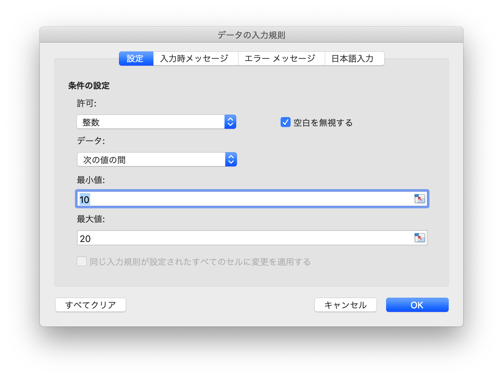
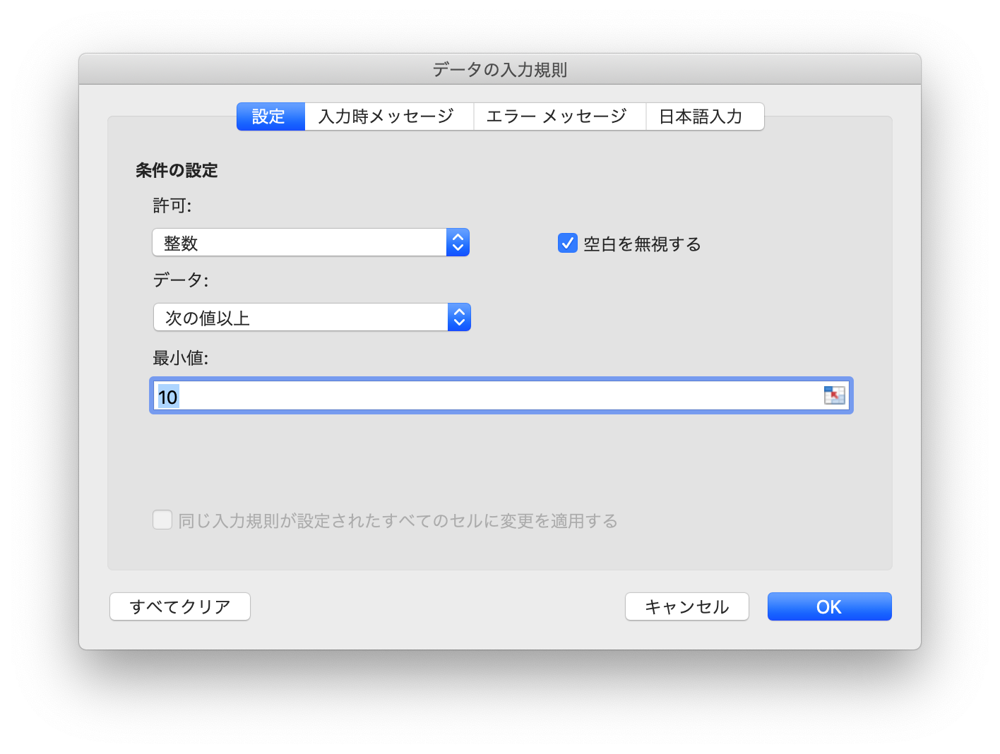
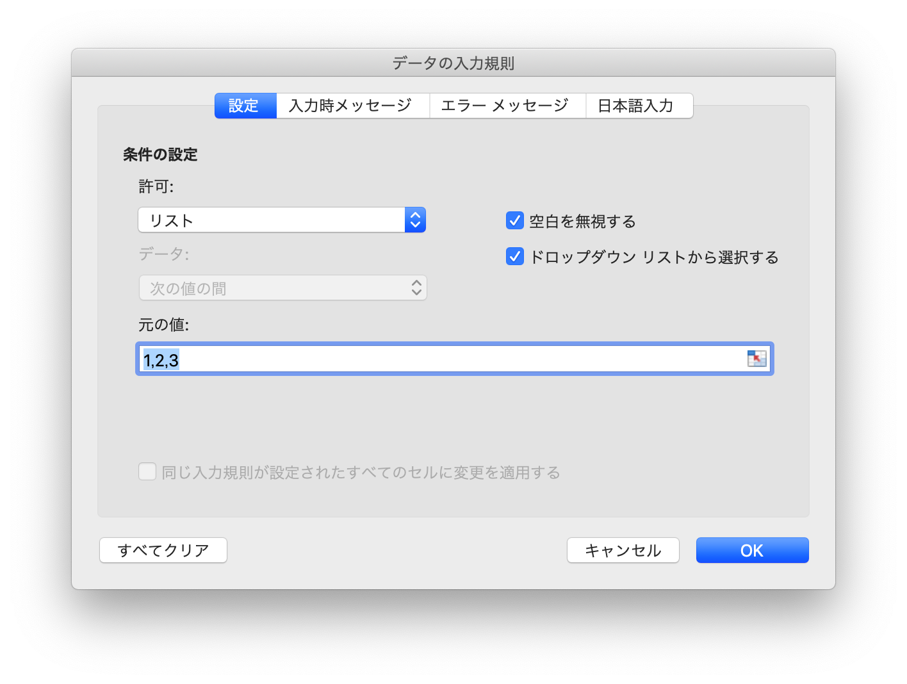
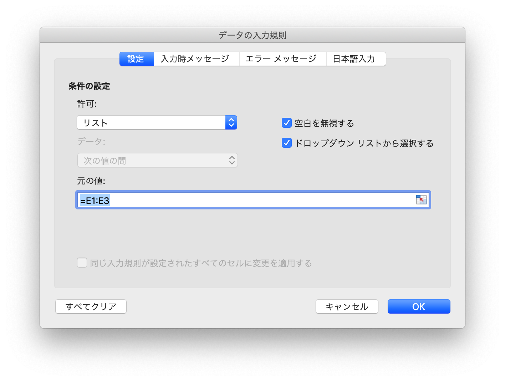

# データ

## データ検証を追加する {#AddDataValidation}

```go
func (f *File) AddDataValidation(sheet string, dv *DataValidation)
```

指定されたワークシート名とデータ検証オブジェクトに基づいてデータ入力規則を設定すると、データ検証オブジェクトは、`NewDataValidation`  関数、データ検証タイプ、および条件参照[定数](constants.md) の定義を通じて作成できます。

例1、`Sheet1!A1:B2` 設定には、整数 10 ~ 20 の間のデータ入力規則を許可するための検証条件が含まれています: "error title"、エラーメッセージ "error body" というタイトルの無効なデータを入力すると、エラー警告が表示されます：

<p align="center"></p>

```go
dv := excelize.NewDataValidation(true)
dv.SetSqref("A1:B2")
dv.SetRange(10, 20, excelize.DataValidationTypeWhole, excelize.DataValidationOperatorBetween)
dv.SetError(excelize.DataValidationErrorStyleStop, "error title", "error body")
f.AddDataValidation("Sheet1", dv)
```

例2、`Sheet1!A3:B4` の設定には、整数 10 より大きくすることができるデータ検証の検証規則が含まれており、セルが選択されたときに入力情報を表示し、入力情報は次のとおりです: "input body":

<p align="center"></p>

```go
dv = excelize.NewDataValidation(true)
dv.SetSqref("A3:B4")
dv.SetRange(10, 20, excelize.DataValidationTypeWhole, excelize.DataValidationOperatorGreaterThan)
dv.SetInput("input title", "input body")
f.AddDataValidation("Sheet1", dv)
```

例3、`Sheet1!A5:B6` 検証条件のデータ入力規則をシーケンスとして設定し、空の値を無視してドロップダウン矢印を表示します:

<p align="center"></p>

```go
dv = excelize.NewDataValidation(true)
dv.SetSqref("A5:B6")
dv.SetDropList([]string{"1", "2", "3"})
f.AddDataValidation("Sheet1", dv)
```

例4、`Sheet1!A7:B8` に設定されています。`Sheet1!E1:E3` はソースの検証条件であり、空の値を無視してドロップダウン矢印を表示します:

<p align="center"></p>

```go
dv := excelize.NewDataValidation(true)
dv.SetSqref("A7:B8")
dv.SetSqrefDropList("$E$1:$E$3")
f.AddDataValidation("Sheet1", dv)
```

## データ検証を取得する {#GetDataValidations}

```go
func (f *File) GetDataValidations(sheet string) ([]*DataValidation, error)
```

GetDataValidations は、指定されたワークシート名でデータ検証リストを返します。

## データ検証の削除 {#DeleteDataValidation}

```go
func (f *File) DeleteDataValidation(sheet string, sqref ...string) error
```

DeleteDataValidation 指定されたワークシート名と参照シーケンスによるデータ検証を削除します。参照シーケンスパラメータを指定しない場合、ワークシート内のすべてのデータ検証が削除されます。
