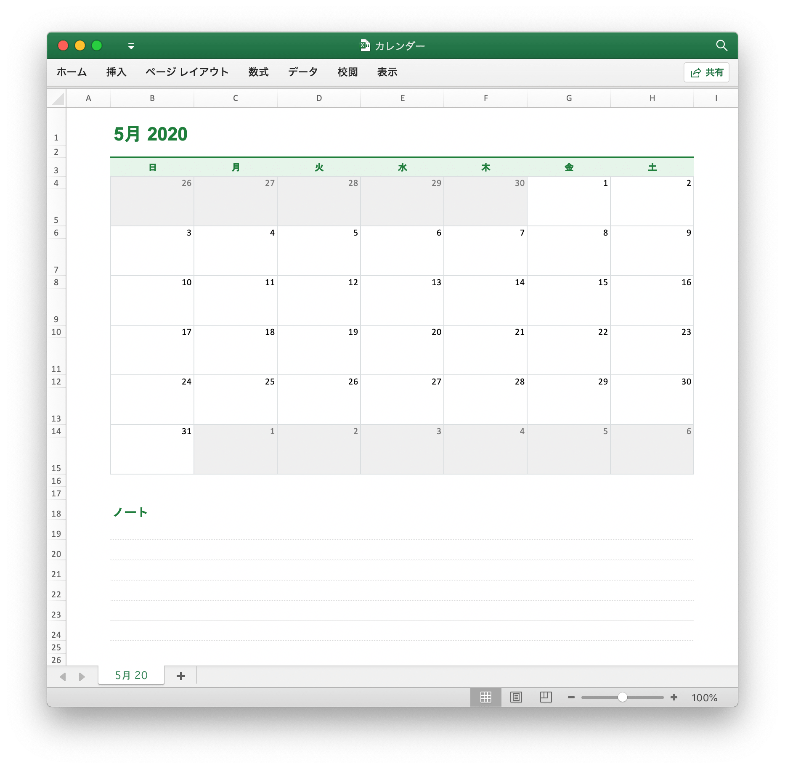

# カレンダー

Go を使用して Excel でカレンダーを作成する：

<p align="center"></p>

```go
package main

import (
    "fmt"
    "strconv"

    "github.com/xuri/excelize/v2"
)

func main() {
    // 新しいスプレッドシートを作成する
    f := excelize.NewFile()
    var (
        monthStyle, titleStyle, dataStyle, blankStyle,
        grayBlankStyle, grayDataStyle, noteStyle, noteLineStyle int
        err   error
        addr  string
        sheet = "Sheet1"
        // セル値
        data = map[int][]interface{}{
            1: {"5月 2020"},
            3: {"日", "月", "火", "水",
                "木", "金", "土"},
            4:  {26, 27, 28, 29, 30, 1, 2},
            6:  {3, 4, 5, 6, 7, 8, 9},
            8:  {10, 11, 12, 13, 14, 15, 16},
            10: {17, 18, 19, 20, 21, 22, 23},
            12: {24, 25, 26, 27, 28, 29, 30},
            14: {31, 1, 2, 3, 4, 5, 6},
            18: {"ノート"},
        }
        // カスタム行の高さ
        height = map[int]float64{
            1: 45, 3: 22, 5: 44, 7: 44, 9: 44, 11: 44, 13: 44, 15: 44,
            18: 24, 19: 24, 20: 24, 21: 24, 22: 24, 23: 24, 24: 24,
        }
        top    = excelize.Border{Type: "top", Style: 1, Color: "DADEE0"}
        left   = excelize.Border{Type: "left", Style: 1, Color: "DADEE0"}
        right  = excelize.Border{Type: "right", Style: 1, Color: "DADEE0"}
        bottom = excelize.Border{Type: "bottom", Style: 1, Color: "DADEE0"}
        fill   = excelize.Fill{Type: "pattern", Color: []string{"EFEFEF"}, Pattern: 1}
    )
    // 各セルの値を設定する
    for r, row := range data {
        if addr, err = excelize.JoinCellName("B", r); err != nil {
            fmt.Println(err)
            return
        }
        if err = f.SetSheetRow(sheet, addr, &row); err != nil {
            fmt.Println(err)
            return
        }
    }
    // カスタム行の高さを設定する
    for r, ht := range height {
        if err = f.SetRowHeight(sheet, r, ht); err != nil {
            fmt.Println(err)
            return
        }
    }
    // カスタム列幅を設定する
    if err = f.SetColWidth(sheet, "B", "H", 16.5); err != nil {
        fmt.Println(err)
        return
    }
    // 「月」のセルを結合
    if err = f.MergeCell(sheet, "B1", "D1"); err != nil {
        fmt.Println(err)
        return
    }
    // 「月」のフォントスタイルを定義する
    if monthStyle, err = f.NewStyle(&excelize.Style{
        Font: &excelize.Font{Color: "1f7f3b", Bold: true, Size: 22, Family: "Microsoft YaHei"},
    }); err != nil {
        fmt.Println(err)
        return
    }
    // 「月」のフォントスタイルを設定する
    if err = f.SetCellStyle(sheet, "B1", "D1", monthStyle); err != nil {
        fmt.Println(err)
        return
    }
    // 「土曜日」から「日曜日」のスタイルを定義する
    if titleStyle, err = f.NewStyle(&excelize.Style{
        Font:      &excelize.Font{Color: "1f7f3b", Bold: true, Family: "Microsoft YaHei"},
        Fill:      excelize.Fill{Type: "pattern", Color: []string{"E6F4EA"}, Pattern: 1},
        Alignment: &excelize.Alignment{Vertical: "center", Horizontal: "center"},
        Border:    []excelize.Border{{Type: "top", Style: 2, Color: "1f7f3b"}},
    }); err != nil {
        fmt.Println(err)
        return
    }
    // 「土曜日」から「日曜日」のセットスタイル
    if err = f.SetCellStyle(sheet, "B3", "H3", titleStyle); err != nil {
        fmt.Println(err)
        return
    }
    // 日付範囲の日付セルのセル境界線を定義します
    if dataStyle, err = f.NewStyle(&excelize.Style{
        Border: []excelize.Border{top, left, right},
    }); err != nil {
        fmt.Println(err)
        return
    }
    // 日付範囲の日付セルのセル境界線を設定します
    for _, r := range []int{4, 6, 8, 10, 12, 14} {
        if err = f.SetCellStyle(sheet, "B"+strconv.Itoa(r),
            "H"+strconv.Itoa(r), dataStyle); err != nil {
            fmt.Println(err)
            return
        }
    }
    // 日付範囲の空白セルのセル境界線を定義する
    if blankStyle, err = f.NewStyle(&excelize.Style{
        Border: []excelize.Border{left, right, bottom},
    }); err != nil {
        fmt.Println(err)
        return
    }
    // 日付範囲の空白セルにセルの枠線を設定する
    for _, r := range []int{5, 7, 9, 11, 13, 15} {
        if err = f.SetCellStyle(sheet, "B"+strconv.Itoa(r),
            "H"+strconv.Itoa(r), blankStyle); err != nil {
            fmt.Println(err)
            return
        }
    }
    // 前月と翌月の空白セルの境界線と塗りつぶしスタイルを定義します
    if grayBlankStyle, err = f.NewStyle(&excelize.Style{
        Border: []excelize.Border{left, right, bottom},
        Fill:   fill}); err != nil {
        fmt.Println(err)
        return
    }
    // 前月と翌月の空白セルの境界線と塗りつぶしスタイルを設定する
    if err = f.SetCellStyle(sheet, "B5", "F5", grayBlankStyle); err != nil {
        fmt.Println(err)
        return
    }
    if err = f.SetCellStyle(sheet, "C15", "H15", grayBlankStyle); err != nil {
        fmt.Println(err)
        return
    }
    // 前月と翌月の日付セルの境界線と塗りつぶしスタイルを定義します
    if grayDataStyle, err = f.NewStyle(&excelize.Style{
        Border: []excelize.Border{left, right, top},
        Font:   &excelize.Font{Color: "777777"}, Fill: fill}); err != nil {
        fmt.Println(err)
        return
    }
    // 前月と翌月の日付セルの境界線と塗りつぶしスタイルを設定する
    if err = f.SetCellStyle(sheet, "B4", "F4", grayDataStyle); err != nil {
        fmt.Println(err)
        return
    }
    if err = f.SetCellStyle(sheet, "C14", "H14", grayDataStyle); err != nil {
        fmt.Println(err)
        return
    }
    // 「ノート」のためのフォントスタイルを定義
    if noteStyle, err = f.NewStyle(&excelize.Style{
        Font: &excelize.Font{Color: "1f7f3b", Bold: true, Size: 14, Family: "Microsoft YaHei"},
    }); err != nil {
        fmt.Println(err)
        return
    }
    // 「ノート」のフォントスタイルを設定する
    if err = f.SetCellStyle(sheet, "B18", "B18", noteStyle); err != nil {
        fmt.Println(err)
        return
    }
    // ノート範囲のセルスタイルを定義する
    if noteLineStyle, err = f.NewStyle(&excelize.Style{
        Border: []excelize.Border{{Type: "bottom", Style: 4, Color: "DDDDDD"}},
    }); err != nil {
        fmt.Println(err)
        return
    }
    // ノート範囲のセルスタイルを設定する
    for r := 19; r < 25; r++ {
        if err = f.SetCellStyle(sheet, "B"+strconv.Itoa(r),
            "H"+strconv.Itoa(r), noteLineStyle); err != nil {
            fmt.Println(err)
            return
        }
    }
    // ワークシートのグリッド線を非表示にする
    if err = f.SetSheetViewOptions(sheet, 0,
        excelize.ShowGridLines(false)); err != nil {
        fmt.Println(err)
        return
    }
    // ワークシートの名前を変更する
    f.SetSheetName(sheet, "5月 20")
    // スプレッドシートファイルを保存
    if err = f.SaveAs("カレンダー.xlsx"); err != nil {
        fmt.Println(err)
    }
}
```
