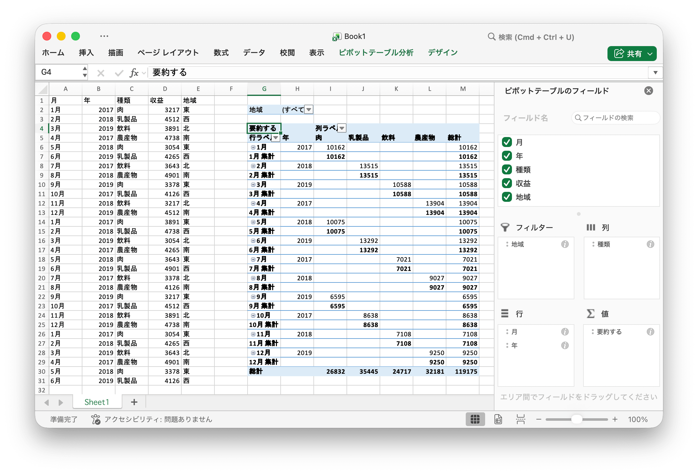

# ピボットテーブル {#PivotTable}

ピボットテーブルは、より広範なテーブル（データベース、スプレッドシート、ビジネスインテリジェンスプログラムなど）のデータを要約した統計のテーブルです。このサマリーには、合計、平均、またはその他の統計が含まれる場合があります。これらの統計は、ピボットテーブルによって意味のある方法でグループ化されます。

`PivotTableOptions` は、ピボットテーブルの形式設定を直接マップします。

```go
type PivotTableOptions struct {
    DataRange           string
    PivotTableRange     string
    Rows                []PivotTableField
    Columns             []PivotTableField
    Data                []PivotTableField
    Filter              []PivotTableField
    RowGrandTotals      bool
    ColGrandTotals      bool
    ShowDrill           bool
    UseAutoFormatting   bool
    PageOverThenDown    bool
    MergeItem           bool
    CompactData         bool
    ShowError           bool
    ShowRowHeaders      bool
    ShowColHeaders      bool
    ShowRowStripes      bool
    ShowColStripes      bool
    ShowLastColumn      bool
    PivotTableStyleName string
    // フィルタされたフィールドまたはエクスポートされていないフィールドが含まれています
}
```

`PivotTableStyleName`: 組み込みのピボットテーブルスタイル名:

```text
PivotStyleLight1 - PivotStyleLight28
PivotStyleMedium1 - PivotStyleMedium28
PivotStyleDark1 - PivotStyleDark28
```

`PivotTableField` は、ピボットテーブルのフィールド設定を直接マップします。

```go
type PivotTableField struct {
    Compact         bool
    Data            string
    Name            string
    Outline         bool
    Subtotal        string
    DefaultSubtotal bool
}
```

Subtotal は、このデータフィールドに適用される集計関数を指定します。デフォルト値は `Sum` です。この属性に指定できる値は次のとおりです。

|オプション値|
|---|
|Average|
|Count|
|CountNums|
|Max|
|Min|
|Product|
|StdDev|
|StdDevp|
|Sum|
|Var|
|Varp|

Name は、データフィールドの名前を指定します。データフィールド名には最大 `255` 文字を使用できますが、余分な文字は切り捨てられます。

## ピボットテーブルを作成する {#AddPivotTable}

```go
func (f *File) AddPivotTable(opts *PivotTableOptions) error
```

AddPivotTable は、指定されたピボットテーブルオプションによってピボットテーブルを追加するメソッドを提供します。

たとえば、`Sheet1!$G$2:$M$34` 領域にピボットテーブルを作成し、データソースとして地域 `Sheet1!$A$1:$E$31` を使用し、売上の合計で集計します。

<p align="center"></p>

```go
package main

import (
    "fmt"
    "math/rand"

    "github.com/xuri/excelize/v2"
)

func main() {
    f := excelize.NewFile()
    defer func() {
        if err := f.Close(); err != nil {
            fmt.Println(err)
        }
    }()
    // シートにデータを作成する
    month := []string{"Jan", "Feb", "Mar", "Apr", "May",
        "Jun", "Jul", "Aug", "Sep", "Oct", "Nov", "Dec"}
    year := []int{2017, 2018, 2019}
    types := []string{"Meat", "Dairy", "Beverages", "Produce"}
    region := []string{"East", "West", "North", "South"}
    f.SetSheetRow("Sheet1", "A1", &[]string{"Month", "Year", "Type", "Sales", "Region"})
    for row := 2; row < 32; row++ {
        f.SetCellValue("Sheet1", fmt.Sprintf("A%d", row), month[rand.Intn(12)])
        f.SetCellValue("Sheet1", fmt.Sprintf("B%d", row), year[rand.Intn(3)])
        f.SetCellValue("Sheet1", fmt.Sprintf("C%d", row), types[rand.Intn(4)])
        f.SetCellValue("Sheet1", fmt.Sprintf("D%d", row), rand.Intn(5000))
        f.SetCellValue("Sheet1", fmt.Sprintf("E%d", row), region[rand.Intn(4)])
    }
    if err := f.AddPivotTable(&excelize.PivotTableOptions{
        DataRange:       "Sheet1!$A$1:$E$31",
        PivotTableRange: "Sheet1!$G$2:$M$34",
        Rows: []excelize.PivotTableField{
            {Data: "Month", DefaultSubtotal: true}, {Data: "Year"}},
        Filter: []excelize.PivotTableField{
            {Data: "Region"}},
        Columns: []excelize.PivotTableField{
            {Data: "Type", DefaultSubtotal: true}},
        Data: []excelize.PivotTableField{
            {Data: "Sales", Name: "Summarize", Subtotal: "Sum"}},
        RowGrandTotals: true,
        ColGrandTotals: true,
        ShowDrill:      true,
        ShowRowHeaders: true,
        ShowColHeaders: true,
        ShowLastColumn: true,
    }); err != nil {
        fmt.Println(err)
        return
    }
    if err := f.SaveAs("Book1.xlsx"); err != nil {
        fmt.Println(err)
    }
}
```
