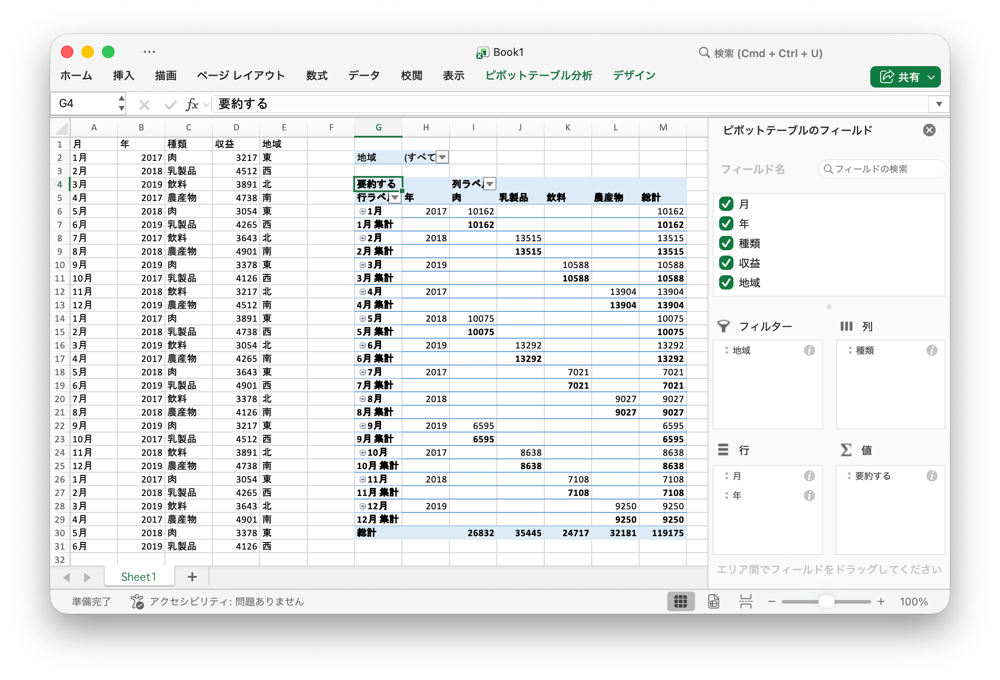

# ピボットテーブル {#PivotTable}

ピボットテーブルは、より広範なテーブル（データベース、スプレッドシート、ビジネスインテリジェンスプログラムなど）のデータを要約した統計のテーブルです。このサマリーには、合計、平均、またはその他の統計が含まれる場合があります。これらの統計は、ピボットテーブルによって意味のある方法でグループ化されます。

`PivotTableOptions` は、ピボットテーブルの形式設定を直接マップします。

```go
type PivotTableOptions struct {
    DataRange           string
    PivotTableRange     string
    Name                string
    Rows                []PivotTableField
    Columns             []PivotTableField
    Data                []PivotTableField
    Filter              []PivotTableField
    RowGrandTotals      bool
    ColGrandTotals      bool
    ShowDrill           bool
    UseAutoFormatting   bool
    PageOverThenDown    bool
    MergeItem           bool
    ClassicLayout       bool
    CompactData         bool
    ShowError           bool
    ShowRowHeaders      bool
    ShowColHeaders      bool
    ShowRowStripes      bool
    ShowColStripes      bool
    ShowLastColumn      bool
    FieldPrintTitles    bool
    ItemPrintTitles     bool
    PivotTableStyleName string
    // フィルタされたフィールドまたはエクスポートされていないフィールドが含まれています
}
```

`PivotTableStyleName`: 組み込みのピボットテーブルスタイル名:

```text
PivotStyleLight1 - PivotStyleLight28
PivotStyleMedium1 - PivotStyleMedium28
PivotStyleDark1 - PivotStyleDark28
```

`PivotTableField` は、ピボットテーブルのフィールド設定を直接マップします。

```go
type PivotTableField struct {
    Compact         bool
    Data            string
    Name            string
    Outline         bool
    ShowAll         bool
    InsertBlankRow  bool
    Subtotal        string
    DefaultSubtotal bool
    NumFmt          int
    SelectedItems   []string
}
```

`Subtotal` は、このデータフィールドに適用される集計関数を指定します。デフォルト値は `Sum` です。この属性に指定できる値は次のとおりです。

|オプション値|
|---|
|Average|
|Count|
|CountNums|
|Max|
|Min|
|Product|
|StdDev|
|StdDevp|
|Sum|
|Var|
|Varp|

`Name` は、データフィールドの名前を指定します。データフィールド名には最大 `255` 文字を使用できますが、余分な文字は切り捨てられます。

`SelectedItems` は、ピボットテーブルフィールドでデフォルトで選択される項目を指定します。選択される項目は、そのフィールドが参照するセル範囲内の値である必要があります。

## ピボットテーブルを作成する {#AddPivotTable}

```go
func (f *File) AddPivotTable(opts *PivotTableOptions) error
```

AddPivotTable は、指定されたピボットテーブルオプションによってピボットテーブルを追加するメソッドを提供します。

たとえば、`Sheet1!G4:M30` 領域にピボットテーブルを作成し、データソースとして地域 `Sheet1!A1:E31` を使用し、売上の合計で集計します。

<p align="center"></p>

```go
package main

import (
    "fmt"

    "github.com/xuri/excelize/v2"
)

func main() {
    f := excelize.NewFile()
    defer func() {
        if err := f.Close(); err != nil {
            fmt.Println(err)
        }
    }()
    // シートにデータを作成する
    month := []string{"1月", "2月", "3月", "4月", "5月", "6月",
        "7月", "8月", "9月", "10月", "11月", "12月"}
    year := []int{2017, 2018, 2019}
    types := []string{"肉", "乳製品", "飲料", "農産物"}
    revenue := []int{3217, 4512, 3891, 4738, 3054, 4265, 3643, 4901, 3378, 4126}
    region := []string{"東", "西", "北", "南"}
    if err := f.SetSheetRow(
        "Sheet1", "A1", &[]string{"月", "年", "種類", "収益", "地域"},
    ); err != nil {
        fmt.Println(err)
        return
    }
    for row := 2; row < 32; row++ {
        f.SetCellValue("Sheet1", fmt.Sprintf("A%d", row), month[(row-2)%len(month)])
        f.SetCellValue("Sheet1", fmt.Sprintf("B%d", row), year[(row-2)%len(year)])
        f.SetCellValue("Sheet1", fmt.Sprintf("C%d", row), types[(row-2)%len(types)])
        f.SetCellValue("Sheet1", fmt.Sprintf("D%d", row), revenue[(row-2)%len(revenue)])
        f.SetCellValue("Sheet1", fmt.Sprintf("E%d", row), region[(row-2)%len(region)])
    }
    if err := f.AddPivotTable(&excelize.PivotTableOptions{
        DataRange:       "Sheet1!A1:E31",
        PivotTableRange: "Sheet1!G4:M30",
        Rows: []excelize.PivotTableField{
            {Data: "月", DefaultSubtotal: true}, {Data: "年"},
        },
        Filter: []excelize.PivotTableField{
            {Data: "地域"},
        },
        Columns: []excelize.PivotTableField{
            {Data: "種類", DefaultSubtotal: true},
        },
        Data: []excelize.PivotTableField{
            {Data: "収益", Name: "要約する", Subtotal: "Sum"},
        },
        RowGrandTotals: true,
        ColGrandTotals: true,
        ShowDrill:      true,
        ShowRowHeaders: true,
        ShowColHeaders: true,
        ShowLastColumn: true,
    }); err != nil {
        fmt.Println(err)
        return
    }
    if err := f.SaveAs("Book1.xlsx"); err != nil {
        fmt.Println(err)
    }
}
```

## ピボットテーブルを取得する {#GetPivotTables}

```go
func (f *File) GetPivotTables(sheet string) ([]PivotTableOptions, error)
```

GetPivotTables は、指定されたワークシート名によりワークシート内のすべてのピボット テーブル定義を返します。

## ピボットテーブルの削除 {#DeletePivotTable}

```go
func (f *File) DeletePivotTable(sheet, name string) error
```

DeletePivotTable は、ワークシート名とピボット テーブル名を指定してピボット テーブルを削除します。この関数はピボット テーブル範囲内のセル値を消去しないことに注意してください。
