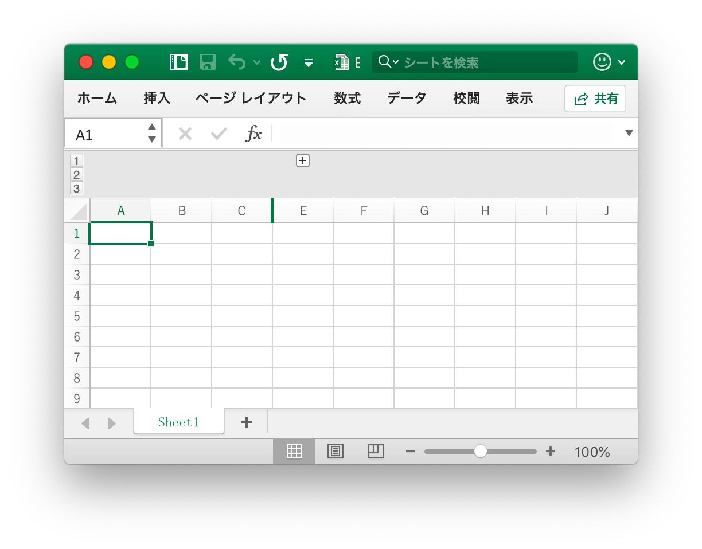
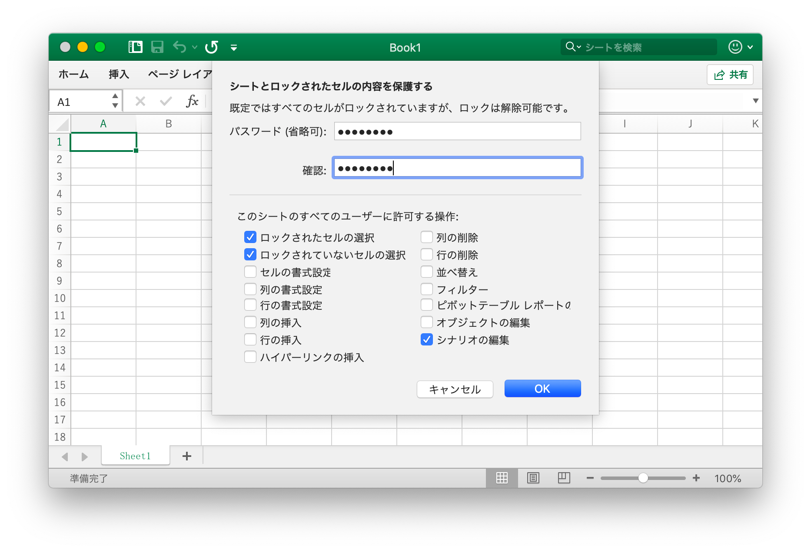

# ワークシート

## 列の可視性設定 {#SetColVisible}

```go
func (f *File) SetColVisible(sheet, col string, visible bool) error
```

与えられたワークシート名（大文字と小文字を区別）と列名に基づいて列の表示/非表示を設定します。例えば、`Sheet1` ワークシートの `D` 列を隠す：

```go
err := f.SetColVisible("Sheet1", "D", false)
```

`D` から `F`（含まれる）の列を非表示にします：

```go
err := f.SetColVisible("Sheet1", "D:F", false)
```

## 列幅の設定 {#SetColWidth}

```go
func (f *File) SetColWidth(sheet, startcol, endcol string, width float64) error
```

指定されたシート名（大文字と小文字を区別）、列範囲、および幅の値に基づいて、単一または複数の列の幅を設定します。たとえば、`Sheet1` という名前の `A` から `H` の列の幅を `20` に設定します。

```go
f := excelize.NewFile()
err := f.SetColWidth("Sheet1", "A", "H", 20)
```

## 行の高さを設定 {#SetRowHeight}

```go
func (f *File) SetRowHeight(sheet string, row int, height float64) error
```

指定されたシート名（大文字と小文字を区別）、行番号、および高さの値に基づいて単一行の高さを設定します。たとえば、`Sheet1` という名前の最初の行の高さを `50` に設定します。

```go
err := f.SetRowHeight("Sheet1", 1, 50)
```

## 行の表示設定 {#SetRowVisible}

```go
func (f *File) SetRowVisible(sheet string, row int, visible bool) error
```

指定されたワークシート名（大文字と小文字を区別）と行番号に基づいて行の表示/非表示を設定します。たとえば、`Sheet1` という名前のワークシートの 2 行目を隠します。

```go
err := f.SetRowVisible("Sheet1", 2, false)
```

## ワークシート名を取得する {#GetSheetName}

```go
func (f *File) GetSheetName(index int) string
```

指定されたワークシートインデックスに基づいてワークシート名を取得し、ワークシートが存在しない場合は空の文字を返します。

## 列の可視性を取得する {#GetColVisible}

```go
func (f *File) GetColVisible(sheet, column string) (bool, error)
```

指定されたワークシート名（大文字と小文字を区別）と列名に基づいて、ワークシート内の指定された列の可視性を取得します可視の戻り値は `true`、そうでない場合は `false` です。たとえば、`Sheet1` という名前のワークシートの `D` 列の可視性を取得します。

```go
visible, err := f.GetColVisible("Sheet1", "D")
```

## 列幅を取得 {#GetColWidth}

```go
func (f *File) GetColWidth(sheet, col string) (float64, error)
```

指定されたワークシートと列名に基づいて、ワークシート内の指定された列の幅を取得します。

## 行の高さを取得する {#GetRowHeight}

```go
func (f *File) GetRowHeight(sheet string, row int) (float64, error)
```

指定されたワークシート名（大文字と小文字を区別）と行番号に基づいて、ワークシート内の指定された行の高さを取得します。たとえば、`Sheet1` という名前のワークシートの最初の行の高さを取得します。

```go
height, err := f.GetRowHeight("Sheet1", 1)
```

## 行の可視性を取得する {#GetRowVisible}

```go
func (f *File) GetRowVisible(sheet string, row int) (bool, error)
```

指定されたワークシート名（大文字と小文字を区別）と行番号に基づいて、ワークシート内の指定された行の可視性を取得します。たとえば、`Sheet1`という名前のワークシートの 2 行目の可視性を取得します。

```go
err := f.GetRowVisible("Sheet1", 2)
```

## ワークシートインデックスを取得 {#GetSheetIndex}

```go
func (f *File) GetSheetIndex(name string) int
```

GetSheetIndex は、指定されたシート名でブックのシートインデックスを取得する関数を提供します。指定されたシート名が無効な場合、整数型の値 `-1` を返します。

取得したインデックスは、ワークブックのデフォルトワークシートを設定するときに [`SetActiveSheet()`](workbook.md#SetActiveSheet) 関数を呼び出すためのパラメータとして使用できます。

## ワークシートマップを取得する {#GetSheetMap}

```go
func (f *File) GetSheetMap() map[int]string
```

GetSheetMap は、ワークシート、チャートシート、ダイアログシート ID、およびワークブックの名前マップを取得する関数を提供します。例えば：

```go
f, err := excelize.OpenFile("./Book1.xlsx")
if err != nil {
    return
}
for index, name := range f.GetSheetMap() {
    fmt.Println(index, name)
}
```

## ワークシートリストを取得する {#GetSheetList}

```go
func (f *File) GetSheetList() []string
```

GetSheetList は、ワークシート、チャートシート、およびワークブックのダイアログシート名リストを取得する関数を提供します。

## ワークシート名を設定 {#SetSheetName}

```go
func (f *File) SetSheetName(oldName, newName string)
```

SetSheetName は、指定された古いワークシート名と新しいワークシート名でワークシート名を設定する関数を提供します。 シートのタイトルには最大 31 文字を使用できます。この関数はシートの名前を変更するだけで、セルに関連付けられた数式または参照のシート名は更新しません。 そのため、問題の数式エラーまたは参照が欠落している可能性があります。

## ワークシートのプロパティを設定する {#SetSheetPrOptions}

```go
func (f *File) SetSheetPrOptions(name string, opts ...SheetPrOption) error
```

SetSheetPrOptions は、ワークシートのプロパティを設定する関数を提供します。

利用可能なオプション:

|オプション属性|タイプ|
|---|---|
|CodeName|string|
|EnableFormatConditionsCalculation|bool|
|Published|bool|
|FitToPage|bool|
|AutoPageBreaks|bool|
|OutlineSummaryBelow|bool|

例えば、

```go
f := excelize.NewFile()
const sheet = "Sheet1"

if err := f.SetSheetPrOptions(sheet,
    excelize.CodeName("code"),
    excelize.EnableFormatConditionsCalculation(false),
    excelize.Published(false),
    excelize.FitToPage(true),
    excelize.AutoPageBreaks(true),
    excelize.OutlineSummaryBelow(false),
); err != nil {
    panic(err)
}
```

## ワークシートのプロパティを取得する {#GetSheetPrOptions}

```go
func (f *File) GetSheetPrOptions(name string, opts ...SheetPrOptionPtr) error
```

与えられたワークシート名（大文字と小文字を区別）とフィルタリングに基づいてワークシートのプロパティを取得します。

|オプション属性|タイプ|
|---|---|
|CodeName|string|
|EnableFormatConditionsCalculation|bool|
|Published|bool|
|FitToPage|bool|
|AutoPageBreaks|bool|
|OutlineSummaryBelow|bool|

例えば、

```go
f := excelize.NewFile()
const sheet = "Sheet1"

var (
    codeName                          excelize.CodeName
    enableFormatConditionsCalculation excelize.EnableFormatConditionsCalculation
    published                         excelize.Published
    fitToPage                         excelize.FitToPage
    autoPageBreaks                    excelize.AutoPageBreaks
    outlineSummaryBelow               excelize.OutlineSummaryBelow
)

if err := f.GetSheetPrOptions(sheet,
    &codeName,
    &enableFormatConditionsCalculation,
    &published,
    &fitToPage,
    &autoPageBreaks,
    &outlineSummaryBelow,
); err != nil {
    panic(err)
}
fmt.Println("Defaults:")
fmt.Printf("- codeName: %q\n", codeName)
fmt.Println("- enableFormatConditionsCalculation:", enableFormatConditionsCalculation)
fmt.Println("- published:", published)
fmt.Println("- fitToPage:", fitToPage)
fmt.Println("- autoPageBreaks:", autoPageBreaks)
fmt.Println("- outlineSummaryBelow:", outlineSummaryBelow)
```

出力：

```text
Defaults:
- codeName: ""
- enableFormatConditionsCalculation: true
- published: true
- fitToPage: false
- autoPageBreaks: false
- outlineSummaryBelow: true
```

## 列を挿入 {#InsertCol}

```go
func (f *File) InsertCol(sheet, column string) error
```

指定されたシート名（大文字と小文字を区別）と列名に基づいて、指定された列の前に空白の列を挿入します。例えば、`Sheet1` という名前のワークシートの `C` 列の前に空白の列を挿入します。

```go
err := f.InsertCol("Sheet1", "C")
```

## 行挿入 {#InsertRow}

```go
func (f *File) InsertRow(sheet string, row int) error
```

指定されたシート名（大文字と小文字を区別）と行インデックスに基づいて、指定された行の前に空白行を挿入します。例えば、`Sheet1` という名前のワークシートの `3` 行目の前に空白行を挿入します。

```go
err := f.InsertRow("Sheet1", 3)
```

## 重複行を追加 {#DuplicateRow}

```go
func (f *File) DuplicateRow(sheet string, row int) error
```

指定されたワークシート名（大文字と小文字を区別）と行番号に基づいて、行の後に複製を追加します。たとえば、`Sheet1` という名前のワークシートの 2 行目を 3 行目にコピーします。

```go
err := f.DuplicateRow("Sheet1", 2)
```

このメソッドは注意して使用してください。式やグラフなどの参照の変更に影響します。 ワークシートの参照値がある場合、それを開くとファイルエラーが発生します。現在、Excelize はこれらの参照を部分的にのみ更新します。

## 行を複製 {#DuplicateRowTo}

```go
func (f *File) DuplicateRowTo(sheet string, row, row2 int) error
```

指定したシート名（大文字と小文字を区別）と行番号に基づいて、指定した行の後に行がコピーされます。たとえば、`Sheet1` という名前のワークシートの 2 行目を 7 行目にコピーします。

```go
err := f.DuplicateRowTo("Sheet1", 2, 7)
```

このメソッドは注意して使用してください。式やグラフなどの参照の変更に影響します。 ワークシートの参照値がある場合、それを開くとファイルエラーが発生します。現在、Excelize はこれらの参照を部分的にのみ更新します。

## 行のアウトラインを作成する {#SetRowOutlineLevel}

```go
func (f *File) SetRowOutlineLevel(sheet string, row int, level uint8) error
```

指定されたワークシート名（大文字と小文字を区別）、行インデックス、および評価パラメータに基づいてグループを作成します。たとえば、`Sheet1` という名前のワークシートの 2 行目にレベル 1 のグループを作成します。

<p align="center"></p>

```go
err := f.SetRowOutlineLevel("Sheet1", 2, 1)
```

## 列のアウトラインを作成する {#SetColOutlineLevel}

```go
func (f *File) SetColOutlineLevel(sheet, col string, level uint8) error
```

指定されたワークシート名（大文字と小文字を区別）、列名、および評価パラメータに基づいてグループを作成します。たとえば、`Sheet` という名前のワークシートの `D` 列にレベル 2 のグループを作成します。

<p align="center"></p>

```go
err := f.SetColOutlineLevel("Sheet1", "D", 2)
```

## 行のアウトラインを取得する {#GetRowOutlineLevel}

```go
func (f *File) GetRowOutlineLevel(sheet string, row int) (uint8, error)
```

指定されたシート名（大文字と小文字を区別）と行インデックスに基づいてグループ化レベルを取得します。たとえば、`Sheet1` という名前のワークシートの行 2 のグループ化レベルを取得します。

```go
err := f.GetRowOutlineLevel("Sheet1", 2)
```

## 列のアウトラインを取得 {#GetColOutlineLevel}

```go
func (f *File) GetColOutlineLevel(sheet, col string) (uint8, error)
```

指定されたシート名（大文字と小文字を区別）と列名に基づいてグループ化評価を取得します。たとえば、`Sheet1` という名前のワークシートの `D` 列のグループ化レベルを取得します。

```go
level, err := f.GetColOutlineLevel("Sheet1", "D")
```

## 列イテレータ {#Cols}

```go
func (f *File) Cols(sheet string) (*Cols, error)
```

Cols は列イテレータを返します。これは、大きなデータを含むワークシートのデータをストリーミングして読み取るために使用されます。例えば：

```go
cols, err := f.Cols("Sheet1")
if err != nil {
    fmt.Println(err)
    return
}
for cols.Next() {
    col, err := cols.Rows()
    if err != nil {
        fmt.Println(err)
    }
    for _, rowCell := range col {
        fmt.Print(rowCell, "\t")
    }
    fmt.Println()
}
```

### 列イテレータ - 列

```go
func (cols *Cols) Rows() ([]string, error)
```

Rows は、現在の列の行の値を返します。

### 列イテレータ - トラバース

```go
func (cols *Cols) Next() bool
```

Next は、次の列が見つかった場合に `true` を返します。

### 列イテレータ - エラー処理

```go
func (cols *Cols) Error() error
```

エラーが発生すると、Error は `error` を返します。

## 行イテレータ {#Rows}

```go
func (f *File) Rows(sheet string) (*Rows, error)
```

Rows は行イテレータを返します。これは、大きなデータを含むワークシートのデータのストリーミングストリーミングに使用されます。例えば:

```go
rows, err := f.Rows("Sheet1")
if err != nil {
    fmt.Println(err)
    return
}
for rows.Next() {
    row, err := rows.Columns()
    if err != nil {
        fmt.Println(err)
    }
    for _, colCell := range row {
        fmt.Println(colCell, "\t")
    }
    fmt.Println()
}
```

### 行イテレーター - 単一行操作

```go
func (rows *Rows) Columns() ([]string, error)
```

現在行のすべての列の値を返します。

### 行イテレーター - トラバーサル操作

```go
func (rows *Rows) Next() bool
```

次の行に値があれば、それは `true` を返します。

### 行イテレーター - 错误处理

```go
func (rows *Rows) Error() error
```

エラーが発生すると、Error は `error` を返します。

## 検索シート {#SearchSheet}

```go
func (f *File) SearchSheet(sheet, value string, reg ...bool) ([]string, error)
```

指定されたワークシート名（大文字と小文字を区別）、セル値、または正規表現に基づいて座標を取得します。この関数は、文字列と数値の完全一致のみをサポートし、数式計算結果、書式設定された数値、および条件付き検索はサポートしません。 検索結果が結合セルの場合は、結合領域の左上隅の座標が返されます。

たとえば、`Sheet1` という名前のワークシートで値 `100` の座標を検索します。

```go
result, err := f.SearchSheet("Sheet1", "100")
```

たとえば、`Sheet1` という名前のワークシートで `0-9` の範囲の座標を検索します。

```go
result, err := f.SearchSheet("Sheet1", "[0-9]", true)
```

## シートを保護する {#ProtectSheet}

```go
func (f *File) ProtectSheet(sheet string, settings *FormatSheetProtection) error
```

他のユーザーが誤ってまたは故意にワークシートのデータを変更、移動、または削除することを防止します。たとえば、`Sheet1` という名前のワークシートにパスワード保護を設定しますが、ロックされたセルの選択を許可し、ロックされていないセルを選択し、スキームを編集します。

<p align="center"></p>

```go
err := f.ProtectSheet("Sheet1", &excelize.FormatSheetProtection{
    Password:      "password",
    EditScenarios: false,
})
```

## 無防備シート {#UnprotectSheet}

```go
func (f *File) UnprotectSheet(sheet string) error
```

指定されたワークシート名に基づいてワークシートの保護を解除します（大文字と小文字を区別）。

## 列を削除 {#RemoveCol}

```go
func (f *File) RemoveCol(sheet, col string) error
```

RemoveColは、与えられたワークシート名と列インデックスによって単一の列を削除する機能を提供します。 たとえば、`Sheet1`の `C` 列を削除します。

```go
err := f.RemoveCol("Sheet1", "C")
```

このメソッドは注意して使用してください。式やグラフなどの参照の変更に影響します。 ワークシートの参照値がある場合、それを開くとファイルエラーが発生します。現在、Excelize はこれらの参照を部分的にのみ更新します。

## 行を削除 {#RemoveRow}

```go
func (f *File) RemoveRow(sheet string, row int) error
```

RemoveRow は、与えられたワークシート名とExcelの行番号で単一行を削除する機能を提供します。 例えば、`Sheet1` の `3`行を削除する：

```go
err := f.RemoveRow("Sheet1", 3)
```

この方法は慎重に使用してください。式、グラフなどの参照の変更に影響します。 ワークシートの参照値がある場合は、開くとファイルエラーが発生します。 excelize は現在これらの参照を部分的にしか更新しません。

## 行の値を設定 {#SetSheetRow}

```go
func (f *File) SetSheetRow(sheet, axis string, slice interface{}) error
```

SetSheetRow は与えられたワークシート名、開始座標、配列型 `slice` へのポインタで配列を行に書き込みます。例えば、 `Sheet1` の `B6`のセルから始まる行 `6` の配列を書き込みます。

```go
err := f.SetSheetRow("Sheet1", "B6", &[]interface{}{"1", nil, 2})
```

## 改ページを挿入 {#InsertPageBreak}

```go
func (f *File) InsertPageBreak(sheet, cell string) (err error)
```

InsertPageBreak は、改ページを作成して、印刷されたページの終了位置と特定のワークシート名と軸による次のページの開始位置を決定します。

## 改ページを削除 {#RemovePageBreak}

```go
func (f *File) RemovePageBreak(sheet, cell string) (err error)
```

RemovePageBreak は、指定されたワークシート名と軸による改ページを削除します。
