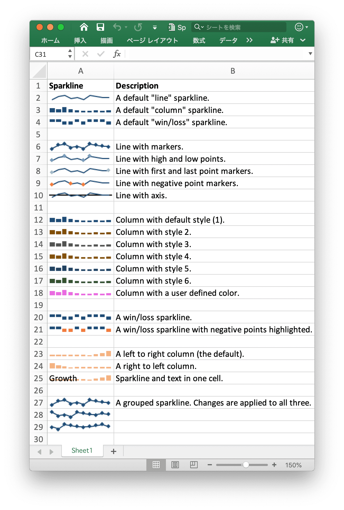

# スパークライン

スパークラインは Excel 2010+ の機能で、ワークシート セルに小さなグラフを追加できます。これらは、データの視覚的な傾向をコンパクトな形式で表示する場合に便利です。

<p align="center"></p>

[スパークライン](https://en.wikipedia.org/wiki/Sparklines)は [Edward Tufte](https://en.wikipedia.org/wiki/Edward_Tufte) によって発明された

## スパークラインの追加

```go
func (f *File) AddSparkline(sheet string, opts *SparklineOptions) error
```

AddSparkline には、指定された書式設定オプションによってワークシートにスパークラインを追加する機能が提供されます。スパークラインは、単一のセルに収まる小さなグラフで、データの傾向を示すために使用されます。スパークラインは Excel 2010 以降の機能です。Excel 2007 で読み取ることができるが、それらは表示されない XLSX ファイルに書き込むことができます。たとえば、グループ化されたスパークラインを追加します。変更は、次の 3 つすべてに適用されます:

```go
err := f.AddSparkline("Sheet1", &excelize.SparklineOptions{
    Location: []string{"A1", "A2", "A3"},
    Range:    []string{"Sheet2!A1:J1", "Sheet2!A2:J2", "Sheet2!A3:J3"},
    Markers:  true,
})
```

<p align="center"></p>

excelize でサポートされているスパークラインの書式設定オプションを次に示します:

パラメータ | 説明
---|---
Location    | 必須、`Range` パラメーターと同じ番号を持つ必要があります
Range       | 必須、`Location` パラメーターと同じ番号を持つ必要があります
Type        | 列挙値: `line`, `column`, `win_loss`
Style       | 値の範囲: 0 - 35
Hight       | スパークラインの高い点を切り替える
Low         | スパークラインの低点を切り替える
First       | スパークラインの最初のポイントを切り替える
Last        | スパークラインの最後のポイントを切り替える
Negative    | スパークラインの負の点を切り替える
Markers     | スパークライン マーカーの切り替え
Axis        | 横軸を表示するかどうかを指定するために使用されます
Reverse     | データの右から左へのプロットを有効にするかどうかを指定するために使用されます
SeriesColor | RGB カラーが `RRGGBB` として指定されます
