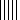
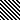

# スタイル

Alignment はセルの配置設定を直接マップします。

```go
type Alignment struct {
    Horizontal      string
    Indent          int
    JustifyLastLine bool
    ReadingOrder    uint64
    RelativeIndent  int
    ShrinkToFit     bool
    TextRotation    int
    Vertical        string
    WrapText        bool
}
```

Border はセルの境界線設定を直接マップします。

```go
type Border struct {
    Type  string
    Color string
    Style int
}
```

Font は直接フォントのフォント設定をマッピングします。

```go
type Font struct {
    Bold         bool
    Italic       bool
    Underline    string
    Family       string
    Size         float64
    Strike       bool
    Color        string
    ColorIndexed int
    ColorTheme   *int
    ColorTint    float64
    VertAlign    string
}
```

Fill はセルの塗りつぶし設定を直接マップします。

```go
type Fill struct {
    Type    string
    Pattern int
    Color   []string
    Shading int
}
```

Protection は、セルの保護設定を直接マップします。

```go
type Protection struct {
    Hidden bool
    Locked bool
}
```

Style は、セルのスタイル設定を直接マップします。

```go
type Style struct {
    Border        []Border
    Fill          Fill
    Font          *Font
    Alignment     *Alignment
    Protection    *Protection
    NumFmt        int
    DecimalPlaces int
    CustomNumFmt  *string
    NegRed        bool
}
```

## スタイルの作成 {#NewStyle}

```go
func (f *File) NewStyle(style *Style) (int, error)
```

NewStyle は、指定されたスタイル オプションによってセルのスタイルを作成する関数を提供し、スタイル インデックスを返します。同じスタイル インデックスを異なるワークブック間で使用することはできません。この関数は同時実行性が安全です。`Font.Color` フィールドでは、`RRGGBB` 16 進表記で表される RGB カラーが使用されることに注意してください。

### 枠 {#border}

次の表は、excelize でサポートされている `Border.Type` で使用される境界線の種類を示しています:

タイプ|説明|タイプ|説明
---|---|---|---
left|左枠|top|上枠
right|右枠|bottom|下枠
linearDown|斜め下の境界線|diagonalUp|斜め上の境界線

次の表は、excelize インデックス番号でサポートされている `Border.Style` で使用される境界線スタイルを示しています:

インデックス|スタイル|ライン|プレビュー
---|---|---|---
0|なし|0|
1|継続的|1|
2|継続的|2|
3|ダッシュ|1|
4|ドット|1|
5|継続的|3|
6|ダブル|3|
7|継続的|0|
8|ダッシュ|2|
9|ダッシュ ドット|1|
10|ダッシュ ドット|2|
11|ダッシュ ドット ドット|1|
12|ダッシュ ドット ドット|2|
13|スラントダッシュドット|2|

次の表は、`Border.Style` で使用されるボーダー線スタイルを Excel ダイアログに表示される順序で示しています:

インデックス|プレビュー|インデックス|プレビュー
---|---|---|---
0||12|
7||13|
4||10|
11||8|
9||2|
3||5|
1||6|

### 色塗り {#shading}

次の表は、excelize インデックス番号でサポートされている `Fill.Shading` で使用されるシェーディング スタイルを示しています:

インデックス|スタイル|インデックス|スタイル
---|---|---|---
0|水平|3|斜め下
1|垂直|4|隅から
2|対角線 Up|5|中心から

### パターン塗りつぶし {#pattern}

次の表は、excelize インデックス番号でサポートされている `Fill.Pattern` で使用されるパターン スタイルを示しています:

インデックス|スタイル|インデックス|スタイル
---|---|---|---
0|なし|10|
1||11|
2||12|
3||13|
4||14|
5||15|
6||16|
7||17|
8||18|
9|||

### アライメント {#align}

#### インデント

`Indent` は整数値で、1 ずつ増分すると 3 つのスペースを表します。セル内のテキストのインデントの (通常のスタイル フォントの) スペースの数を示します。インデントするスペースの数は次のように計算されます。

インデントするスペースの数 = インデント値 * 3

たとえば、インデント値 1 は、テキストがセルの端から (通常のスタイルのフォントの) 3 スペース幅で始まることを意味します。注: 1 つのスペース文字の幅はフォントによって定義されます。左揃え、右揃え、および分散水平揃えのみがサポートされています。

#### 水平方向の位置合わせ

次の表は、`Alignment.Horizontal` で使用されるセルの水平方向の配置の種類を示しています:

タイプ|スタイル
---|---
left             | 左 (インデント)
center           | 中央揃え
right            | 右（インデント）
fill             | 充填
justify          | 正当化された
centerContinuous | 列をまたいで中央揃え
distributed      | 分散型アライメント (インデント)

#### 垂直方向の位置合わせ

次の表は、`Alignment.Vertical` で使用されるセルの垂直方向の配置の種類を示しています:

タイプ|スタイル
---|---
top         | 上揃え
center      | 中央揃え
justify     | 正当化された
distributed | 分散型調整

#### 読む順番

`ReadingOrder` は、セルの読み取り順序が左から右、右から左、またはコンテキスト依存のいずれであるかを示す uint64 値です。 このフィールドの有効な値は次のとおりです。

値|説明
---|---
0 | コンテキスト依存 - 読み取り順序は、テキストをスキャンして空白以外の最初の文字を見つけることによって決定されます。右から左への強い文字の場合、読み取り順序は右から左になります。それ以外の場合は、左から右の読み取り順序になります。
1 | 左から右: 英語と同様に、セル内の読み取り順序は左から右です。
2 | 右から左: ヘブライ語と同様に、セル内の読み取り順序は右から左です。

#### 相対インデント

`RelativeIndent` は、セル内のテキストを調整するためのインデントの追加スペース数を示す整数値です。

### フォントの下線 {#underline}

次の表は、`Font.Underline` で使用されるフォントの下線スタイルのタイプを示しています:

タイプ|スタイル
---|---
single | 単線
double | 二重線

### デジタルカスタムフォーマット {#number_format}

Excel の組み込みのすべての言語形式 (`Style.NumFmt` フィールド) を次の表に示します:

インデックス|型
---|---
0|`General`
1|`0`
2|`0.00`
3|`#,##0`
4|`#,##0.00`
5|`($#,##0_);($#,##0)`
6|`($#,##0_);[Red]($#,##0)`
7|`($#,##0.00_);($#,##0.00)`
8|`($#,##0.00_);[Red]($#,##0.00)`
9|`0%`
10|`0.00%`
11|`0.00E+00`
12|`# ?/?`
13|`# ??/??`
14|`m/d/yy`
15|`d-mmm-yy`
16|`d-mmm`
17|`mmm-yy`
18|`h:mm AM/PM`
19|`h:mm:ss AM/PM`
20|`h:mm`
21|`h:mm:ss`
22|`m/d/yy h:mm`
...|`...`
37|`(#,##0_);(#,##0)`
38|`(#,##0_);[Red](#,##0)`
39|`(#,##0.00_);(#,##0.00)`
40|`(#,##0.00_);[Red](#,##0.00)`
41|`_(* #,##0_);_(* (#,##0);_(* "-"_);_(@_)`
42|`_($* #,##0_);_($* (#,##0);_($* "-"_);_(@_)`
43|`_(* #,##0.00_);_(* (#,##0.00);_(* "-"??_);_(@_)`
44|`_($* #,##0.00_);_($* (#,##0.00);_($* "-"??_);_(@_)`
45|`mm:ss`
46|`[h]:mm:ss`
47|`mm:ss.0`
48|`##0.0E+0`
49|`@`

#### 繁体字中国語の数値形式

`zh-tw` 言語の数値形式コード:

インデックス|型
---|---
27|`[$-404]e/m/d`
28|`[$-404]e"年"m"月"d"日"`
29|`[$-404]e"年"m"月"d"日"`
30|`m/d/yy`
31|`yyyy"年"m"月"d"日"`
32|`hh"時"mm"分"`
33|`hh"時"mm"分"ss"秒"`
34|`上午/下午 hh"時"mm"分"`
35|`上午/下午 hh"時"mm"分"ss"秒"`
36|`[$-404]e/m/d`
50|`[$-404]e/m/d`
51|`[$-404]e"年"m"月"d"日"`
52|`上午/下午 hh"時"mm"分"`
53|`上午/下午 hh"時"mm"分"ss"秒"`
54|`[$-404]e"年"m"月"d"日"`
55|`上午/下午 hh"時"mm"分"`
56|`上午/下午 hh"時"mm"分"ss"秒"`
57|`[$-404]e/m/d`
58|`[$-404]e"年"m"月"d"日"`

#### 簡体字中国語の数値形式

`zh-cn` 言語の数値形式コード:

インデックス|型
---|---
27|`yyyy"年"m"月"`
28|`m"月"d"日"`
29|`m"月"d"日"`
30|`m-d-yy`
31|`yyyy"年"m"月"d"日"`
32|`h"时"mm"分"`
33|`h"时"mm"分"ss"秒"`
34|`上午/下午 h"时"mm"分"`
35|`上午/下午 h"时"mm"分"ss"秒`
36|`yyyy"年"m"月`
50|`yyyy"年"m"月`
51|`m"月"d"日`
52|`yyyy"年"m"月`
53|`m"月"d"日`
54|`m"月"d"日`
55|`上午/下午 h"时"mm"分`
56|`上午/下午 h"时"mm"分"ss"秒`
57|`yyyy"年"m"月`
58|`m"月"d"日"`

#### 日本語の番号形式

`ja-jp` 言語の数字形式コード:

インデックス|型
---|---
27|`[$-411]ge.m.d`
28|`[$-411]ggge"年"m"月"d"日`
29|`[$-411]ggge"年"m"月"d"日`
30|`m/d/y`
31|`yyyy"年"m"月"d"日`
32|`h"時"mm"分`
33|`h"時"mm"分"ss"秒`
34|`yyyy"年"m"月`
35|`m"月"d"日`
36|`[$-411]ge.m.d`
50|`[$-411]ge.m.d`
51|`[$-411]ggge"年"m"月"d"日`
52|`yyyy"年"m"月`
53|`m"月"d"日`
54|`[$-411]ggge"年"m"月"d"日`
55|`yyyy"年"m"月`
56|`m"月"d"日`
57|`[$-411]ge.m.d`
58|`[$-411]ggge"年"m"月"d"日"`

#### 韓国語番号形式

`ko-kr` 言語の数値形式コード:

インデックス|型
---|---
27|`yyyy"年" mm"月" dd"日`
28|`mm-d`
29|`mm-d`
30|`mm-dd-y`
31|`yyyy"년" mm"월" dd"일`
32|`h"시" mm"분`
33|`h"시" mm"분" ss"초`
34|`yyyy-mm-d`
35|`yyyy-mm-d`
36|`yyyy"年" mm"月" dd"日`
50|`yyyy"年" mm"月" dd"日`
51|`mm-d`
52|`yyyy-mm-d`
53|`yyyy-mm-d`
54|`mm-d`
55|`yyyy-mm-d`
56|`yyyy-mm-d`
57|`yyyy"年" mm"月" dd"日`
58|`mm-dd`

#### タイ語の言語番号形式

`th-th` 言語のコードの数値形式:

インデックス|型
---|---
59|`t`
60|`t0.0`
61|`t#,##`
62|`t#,##0.0`
67|`t0`
68|`t0.00`
69|`t# ?/`
70|`t# ??/?`
71|`ว/ด/ปปป`
72|`ว-ดดด-ป`
73|`ว-ดด`
74|`ดดด-ป`
75|`ช:น`
76|`ช:นน:ท`
77|`ว/ด/ปปปป ช:น`
78|`นน:ท`
79|`[ช]:นน:ท`
80|`นน:ทท.`
81|`d/m/bb`

### 通貨形式

組み込みの通貨形式を Excelize は次の表に示し、次の表でこれらの型のみをサポートします (インデックス番号はマークアップにのみ使用され、Excel ファイル内では使用されず、[`GetCellValue`](cell.md#GetCellValue) 現在の関数では書式設定された値を取得できません):

インデックス|通貨形式
---|---
164|¥
165|$ English (United States)
166|$ Cherokee (United States)
167|$ Chinese (Singapore)
168|$ Chinese (Taiwan)
169|$ English (Australia)
170|$ English (Belize)
171|$ English (Canada)
172|$ English (Jamaica)
173|$ English (New Zealand)
174|$ English (Singapore)
175|$ English (Trinidad & Tobago)
176|$ English (U.S. Virgin Islands)
177|$ English (United States)
178|$ French (Canada)
179|$ Hawaiian (United States)
180|$ Malay (Brunei)
181|$ Quechua (Ecuador)
182|$ Spanish (Chile)
183|$ Spanish (Colombia)
184|$ Spanish (Ecuador)
185|$ Spanish (El Salvador)
186|$ Spanish (Mexico)
187|$ Spanish (Puerto Rico)
188|$ Spanish (United States)
189|$ Spanish (Uruguay)
190|£ English (United Kingdom)
191|£ Scottish Gaelic (United Kingdom)
192|£ Welsh (United Kindom)
193|¥ Chinese (China)
194|¥ Japanese (Japan)
195|¥ Sichuan Yi (China)
196|¥ Tibetan (China)
197|¥ Uyghur (China)
198|֏ Armenian (Armenia)
199|؋ Pashto (Afghanistan)
200|؋ Persian (Afghanistan)
201|৳ Bengali (Bangladesh)
202|៛ Khmer (Cambodia)
203|₡ Spanish (Costa Rica)
204|₦ Hausa (Nigeria)
205|₦ Igbo (Nigeria)
206|₩ Korean (South Korea)
207|₪ Hebrew (Israel)
208|₫ Vietnamese (Vietnam)
209|€ Basque (Spain)
210|€ Breton (France)
211|€ Catalan (Spain)
212|€ Corsican (France)
213|€ Dutch (Belgium)
214|€ Dutch (Netherlands)
215|€ English (Ireland)
216|€ Estonian (Estonia)
217|€ Euro (€ 123)
218|€ Euro (123 €)
219|€ Finnish (Finland)
220|€ French (Belgium)
221|€ French (France)
222|€ French (Luxembourg)
223|€ French (Monaco)
224|€ French (Réunion)
225|€ Galician (Spain)
226|€ German (Austria)
227|€ German (German)
228|€ German (Luxembourg)
229|€ Greek (Greece)
230|€ Inari Sami (Finland)
231|€ Irish (Ireland)
232|€ Italian (Italy)
233|€ Latin (Italy)
234|€ Latin, Serbian (Montenegro)
235|€ Larvian (Latvia)
236|€ Lithuanian (Lithuania)
237|€ Lower Sorbian (Germany)
238|€ Luxembourgish (Luxembourg)
239|€ Maltese (Malta)
240|€ Northern Sami (Finland)
241|€ Occitan (France)
242|€ Portuguese (Portugal)
243|€ Serbian (Montenegro)
244|€ Skolt Sami (Finland)
245|€ Slovak (Slovakia)
246|€ Slovenian (Slovenia)
247|€ Spanish (Spain)
248|€ Swedish (Finland)
249|€ Swiss German (France)
250|€ Upper Sorbian (Germany)
251|€ Western Frisian (Netherlands)
252|₭ Lao (Laos)
253|₮ Mongolian (Mongolia)
254|₮ Mongolian, Mongolian (Mongolia)
255|₱ English (Philippines)
256|₱ Filipino (Philippines)
257|₴ Ukrainian (Ukraine)
258|₸ Kazakh (Kazakhstan)
259|₹ Arabic, Kashmiri (India)
260|₹ English (India)
261|₹ Gujarati (India)
262|₹ Hindi (India)
263|₹ Kannada (India)
264|₹ Kashmiri (India)
265|₹ Konkani (India)
266|₹ Manipuri (India)
267|₹ Marathi (India)
268|₹ Nepali (India)
269|₹ Oriya (India)
270|₹ Punjabi (India)
271|₹ Sanskrit (India)
272|₹ Sindhi (India)
273|₹ Tamil (India)
274|₹ Urdu (India)
275|₺ Turkish (Turkey)
276|₼ Azerbaijani (Azerbaijan)
277|₼ Cyrillic, Azerbaijani (Azerbaijan)
278|₽ Russian (Russia)
279|₽ Sakha (Russia)
280|₾ Georgian (Georgia)
281|B/. Spanish (Panama)
282|Br Oromo (Ethiopia)
283|Br Somali (Ethiopia)
284|Br Tigrinya (Ethiopia)
285|Bs Quechua (Bolivia)
286|Bs Spanish (Bolivia)
287|BS. Spanish (Venezuela)
288|BWP Tswana (Botswana)
289|C$ Spanish (Nicaragua)
290|CA$ Latin, Inuktitut (Canada)
291|CA$ Mohawk (Canada)
292|CA$ Unified Canadian Aboriginal Syllabics, Inuktitut (Canada)
293|CFA French (Mali)
294|CFA French (Senegal)
295|CFA Fulah (Senegal)
296|CFA Wolof (Senegal)
297|CHF French (Switzerland)
298|CHF German (Liechtenstein)
299|CHF German (Switzerland)
300|CHF Italian (Switzerland)
301|CHF Romansh (Switzerland)
302|CLP Mapuche (Chile)
303|CN¥ Mongolian, Mongolian (China)
304|DZD Central Atlas Tamazight (Algeria)
305|FCFA French (Cameroon)
306|Ft Hungarian (Hungary)
307|G French (Haiti)
308|Gs. Spanish (Paraguay)
309|GTQ K'iche' (Guatemala)
310|HK$ Chinese (Hong Kong (China))
311|HK$ English (Hong Kong (China))
312|HRK Croatian (Croatia)
313|IDR English (Indonesia)
314|IQD Arbic, Central Kurdish (Iraq)
315|ISK Icelandic (Iceland)
316|K Burmese (Myanmar (Burma))
317|Kč Czech (Czech Republic)
318|KM Bosnian (Bosnia & Herzegovina)
319|KM Croatian (Bosnia & Herzegovina)
320|KM Latin, Serbian (Bosnia & Herzegovina)
321|kr Faroese (Faroe Islands)
322|kr Northern Sami (Norway)
323|kr Northern Sami (Sweden)
324|kr Norwegian Bokmål (Norway)
325|kr Norwegian Nynorsk (Norway)
326|kr Swedish (Sweden)
327|kr. Danish (Denmark)
328|kr. Kalaallisut (Greenland)
329|Ksh Swahili (kenya)
330|L Romanian (Moldova)
331|L Russian (Moldova)
332|L Spanish (Honduras)
333|Lekë Albanian (Albania)
334|MAD Arabic, Central Atlas Tamazight (Morocco)
335|MAD French (Morocco)
336|MAD Tifinagh, Central Atlas Tamazight (Morocco)
337|MOP$ Chinese (Macau (China))
338|MVR Divehi (Maldives)
339|Nfk Tigrinya (Eritrea)
340|NGN Bini (Nigeria)
341|NGN Fulah (Nigeria)
342|NGN Ibibio (Nigeria)
343|NGN Kanuri (Nigeria)
344|NOK Lule Sami (Norway)
345|NOK Southern Sami (Norway)
346|NZ$ Maori (New Zealand)
347|PKR Sindhi (Pakistan)
348|PYG Guarani (Paraguay)
349|Q Spanish (Guatemala)
350|R Afrikaans (South Africa)
351|R English (South Africa)
352|R Zulu (South Africa)
353|R$ Portuguese (Brazil)
354|RD$ Spanish (Dominican Republic)
355|RF Kinyarwanda (Rwanda)
356|RM English (Malaysia)
357|RM Malay (Malaysia)
358|RON Romanian (Romania)
359|Rp Indonesoan (Indonesia)
360|Rs Urdu (Pakistan)
361|Rs. Tamil (Sri Lanka)
362|RSD Latin, Serbian (Serbia)
363|RSD Serbian (Serbia)
364|RUB Bashkir (Russia)
365|RUB Tatar (Russia)
366|S/. Quechua (Peru)
367|S/. Spanish (Peru)
368|SEK Lule Sami (Sweden)
369|SEK Southern Sami (Sweden)
370|soʻm Latin, Uzbek (Uzbekistan)
371|soʻm Uzbek (Uzbekistan)
372|SYP Syriac (Syria)
373|THB Thai (Thailand)
374|TMT Turkmen (Turkmenistan)
375|US$ English (Zimbabwe)
376|ZAR Northern Sotho (South Africa)
377|ZAR Southern Sotho (South Africa)
378|ZAR Tsonga (South Africa)
379|ZAR Tswana (south Africa)
380|ZAR Venda (South Africa)
381|ZAR Xhosa (South Africa)
382|zł Polish (Poland)
383|ден Macedonian (Macedonia)
384|KM Cyrillic, Bosnian (Bosnia & Herzegovina)
385|KM Serbian (Bosnia & Herzegovina)
386|лв. Bulgarian (Bulgaria)
387|p. Belarusian (Belarus)
388|сом Kyrgyz (Kyrgyzstan)
389|сом Tajik (Tajikistan)
390|ج.م. Arabic (Egypt)
391|د.أ. Arabic (Jordan)
392|د.أ. Arabic (United Arab Emirates)
393|د.ب. Arabic (Bahrain)
394|د.ت. Arabic (Tunisia)
395|د.ج. Arabic (Algeria)
396|د.ع. Arabic (Iraq)
397|د.ك. Arabic (Kuwait)
398|د.ل. Arabic (Libya)
399|د.م. Arabic (Morocco)
400|ر Punjabi (Pakistan)
401|ر.س. Arabic (Saudi Arabia)
402|ر.ع. Arabic (Oman)
403|ر.ق. Arabic (Qatar)
404|ر.ي. Arabic (Yemen)
405|ریال Persian (Iran)
406|ل.س. Arabic (Syria)
407|ل.ل. Arabic (Lebanon)
408|ብር Amharic (Ethiopia)
409|रू Nepaol (Nepal)
410|රු. Sinhala (Sri Lanka)
411|ADP
412|AED
413|AFA
414|AFN
415|ALL
416|AMD
417|ANG
418|AOA
419|ARS
420|ATS
421|AUD
422|AWG
423|AZM
424|AZN
425|BAM
426|BBD
427|BDT
428|BEF
429|BGL
430|BGN
431|BHD
432|BIF
433|BMD
434|BND
435|BOB
436|BOV
437|BRL
438|BSD
439|BTN
440|BWP
441|BYR
442|BZD
443|CAD
444|CDF
445|CHE
446|CHF
447|CHW
448|CLF
449|CLP
450|CNY
451|COP
452|COU
453|CRC
454|CSD
455|CUC
456|CVE
457|CYP
458|CZK
459|DEM
460|DJF
461|DKK
462|DOP
463|DZD
464|ECS
465|ECV
466|EEK
467|EGP
468|ERN
469|ESP
470|ETB
471|EUR
472|FIM
473|FJD
474|FKP
475|FRF
476|GBP
477|GEL
478|GHC
479|GHS
480|GIP
481|GMD
482|GNF
483|GRD
484|GTQ
485|GYD
486|HKD
487|HNL
488|HRK
489|HTG
490|HUF
491|IDR
492|IEP
493|ILS
494|INR
495|IQD
496|IRR
497|ISK
498|ITL
499|JMD
500|JOD
501|JPY
502|KAF
503|KES
504|KGS
505|KHR
506|KMF
507|KPW
508|KRW
509|KWD
510|KYD
511|KZT
512|LAK
513|LBP
514|LKR
515|LRD
516|LSL
517|LTL
518|LUF
519|LVL
520|LYD
521|MAD
522|MDL
523|MGA
524|MGF
525|MKD
526|MMK
527|MNT
528|MOP
529|MRO
530|MTL
531|MUR
532|MVR
533|MWK
534|MXN
535|MXV
536|MYR
537|MZM
538|MZN
539|NAD
540|NGN
541|NIO
542|NLG
543|NOK
544|NPR
545|NTD
546|NZD
547|OMR
548|PAB
549|PEN
550|PGK
551|PHP
552|PKR
553|PLN
554|PTE
555|PYG
556|QAR
557|ROL
558|RON
559|RSD
560|RUB
561|RUR
562|RWF
563|SAR
564|SBD
565|SCR
566|SDD
567|SDG
568|SDP
569|SEK
570|SGD
571|SHP
572|SIT
573|SKK
574|SLL
575|SOS
576|SPL
577|SRD
578|SRG
579|STD
580|SVC
581|SYP
582|SZL
583|THB
584|TJR
585|TJS
586|TMM
587|TMT
588|TND
589|TOP
590|TRL
591|TRY
592|TTD
593|TWD
594|TZS
595|UAH
596|UGX
597|USD
598|USN
599|USS
600|UYI
601|UYU
602|UZS
603|VEB
604|VEF
605|VND
606|VUV
607|WST
608|XAF
609|XAG
610|XAU
611|XB5
612|XBA
613|XBB
614|XBC
615|XBD
616|XCD
617|XDR
618|XFO
619|XFU
620|XOF
621|XPD
622|XPF
623|XPT
624|XTS
625|XXX
626|YER
627|YUM
628|ZAR
629|ZMK
630|ZMW
631|ZWD
632|ZWL
633|ZWN
634|ZWR

セルのサポート セットカスタム番号形式を Excel 化します。たとえば、`Sheet1!A6` のウルグアイ (スペイン語) 形式で日付タイプとして数値を設定します:

<p align="center"></p>

```go
f := excelize.NewFile()
defer func() {
    if err := f.Close(); err != nil {
        fmt.Println(err)
    }
}()
if err := f.SetCellValue("Sheet1", "A6", 42920.5); err != nil {
    fmt.Println(err)
    return
}
exp := "[$-380A]dddd\\,\\ dd\" de \"mmmm\" de \"yyyy;@"
style, err := f.NewStyle(&excelize.Style{CustomNumFmt: &exp})
if err != nil {
    fmt.Println(err)
    return
}
err = f.SetCellStyle("Sheet1", "A6", "A6", style)
```

Excel アプリケーションのセル `Sheet1!A6`: `martes, 04 de Julio de 2017`

## スタイルを取得 {#GetStyle}

```go
func (f *File) GetStyle(idx int) (*Style, error)
```

GetStyle は、指定されたスタイル インデックスによってスタイル定義を取得する関数を提供します。

## 列のスタイル設定 {#SetColStyle}

```go
func (f *File) SetColStyle(sheet, columns string, styleID int) error
```

SetColStyle は、指定されたワークシート名、列範囲、およびスタイル ID によって列のスタイルを設定する関数を提供します。これにより、列の既存のスタイルが上書きされ、スタイルが既存のスタイルに追加またはマージされないことに注意してください。この関数は、同時実行セーフをサポートします。

たとえば、`Sheet1` の列 `H` のスタイルを設定します。

```go
err = f.SetColStyle("Sheet1", "H", style)
```

`Sheet1` の列 `C:F` のスタイルを設定します:

```go
err = f.SetColStyle("Sheet1", "C:F", style)
```

## 列のスタイルを取得する {#GetColStyle}

```go
func (f *File) GetColStyle(sheet, col string) (int, error)
```

GetColStyle には、指定されたワークシート名と列名によって列スタイル ID を取得する関数が用意されています。この関数は、同時実行セーフをサポートします。

## 行スタイルを設定する {#SetRowStyle}

```go
func (f *File) SetRowStyle(sheet string, start, end, styleID int) error
```

SetRowStyle は、指定されたワークシート名、行範囲、およびスタイル ID によって行のスタイルを設定する関数を提供します。これにより、行の既存のスタイルが上書きされ、スタイルが既存のスタイルに追加またはマージされないことに注意してください。

たとえば、`Sheet1` の行1のスタイルを設定します:

```go
err := f.SetRowStyle("Sheet1", 1, 1, styleID)
```

`Sheet1` の行1から10のスタイルを設定します:

```go
err := f.SetRowStyle("Sheet1", 1, 10, styleID)
```

## 既定のフォントを設定する {#SetDefaultFont}

```go
func (f *File) SetDefaultFont(fontName string)
```

SetDefaultFont は、ブック内の既定のフォントを変更します。

## デフォルトのフォントを取得する {#GetDefaultFont}

```go
func (f *File) GetDefaultFont() string
```

GetDefaultFont は、ブックに現在設定されているデフォルトのフォント名を提供します。Excelize のデフォルトフォントによって生成されるスプレッドシートは Calibri です。
