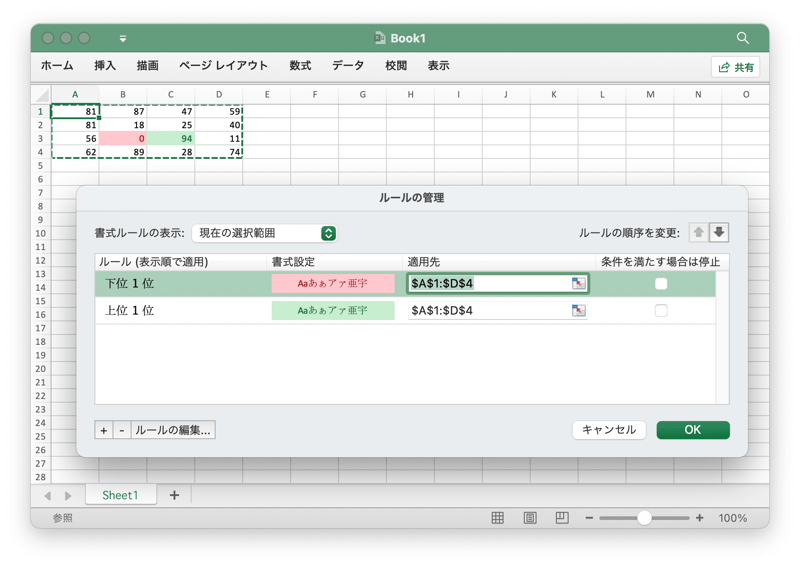

# ツール機能

## テーブル作成 {#AddTable}

```go
func (f *File) AddTable(sheet string, table *Table) error
```

AddTable は、ワークシート名、座標領域、および書式設定によってワークシートにテーブルを追加するメソッドを提供します。

- 例 1 では、`Sheet1` に `A1:D5` のテーブルを作成します:

<p align="center"></p>

```go
err := f.AddTable("Sheet1", &excelize.Table{Range: "A1:D5"})
```

- 例 2 では、書式設定を使用して `Sheet2` に `F2:H6` のテーブルを作成します:

<p align="center"></p>

```go
disable := false
err := f.AddTable("Sheet2", &excelize.Table{
    Range:             "F2:H6",
    Name:              "table",
    StyleName:         "TableStyleMedium2",
    ShowFirstColumn:   true,
    ShowLastColumn:    true,
    ShowRowStripes:    &disable,
    ShowColumnStripes: true,
})
```

テーブルは、ヘッダーを含む少なくとも2行でなければならないことに注意してください。ヘッダーセルには文字列が含まれ、一意である必要があり、AddTable 関数を呼び出す前にテーブルのヘッダー行データを設定する必要があります。複数のテーブルは、交差できないエリアを調整します。

`Name`: テーブルの同じワークシート名のテーブルの名前は一意である必要があります。

`StyleName`: 組み込みのテーブル スタイル名:

```text
TableStyleLight1 - TableStyleLight21
TableStyleMedium1 - TableStyleMedium28
TableStyleDark1 - TableStyleDark11
```

インデックス|スタイル|インデックス|スタイル|インデックス|スタイル
---|---|---|---|---|---
||TableStyleLight1||TableStyleLight2|
TableStyleLight3||TableStyleLight4||TableStyleLight5|
TableStyleLight6||TableStyleLight7||TableStyleLight8|
TableStyleLight9||TableStyleLight10||TableStyleLight11|
TableStyleLight12||TableStyleLight13||TableStyleLight14|
TableStyleLight15||TableStyleLight16||TableStyleLight17|
TableStyleLight18||TableStyleLight19||TableStyleLight20|
TableStyleLight21||TableStyleMedium1||TableStyleMedium2|
TableStyleMedium3||TableStyleMedium4||TableStyleMedium5|
TableStyleMedium6||TableStyleMedium7||TableStyleMedium8|
TableStyleMedium9||TableStyleMedium10||TableStyleMedium11|
TableStyleMedium12||TableStyleMedium13||TableStyleMedium14|
TableStyleMedium15||TableStyleMedium16||TableStyleMedium17|
TableStyleMedium18||TableStyleMedium19||TableStyleMedium20|
TableStyleMedium21||TableStyleMedium22||TableStyleMedium23|
TableStyleMedium24||TableStyleMedium25||TableStyleMedium26|
TableStyleMedium27||TableStyleMedium28||TableStyleDark1|
TableStyleDark2||TableStyleDark3||TableStyleDark4|
TableStyleDark5||TableStyleDark6||TableStyleDark7|
TableStyleDark8||TableStyleDark9||TableStyleDark10|
TableStyleDark11|||||

## 自動フィルタ {#AutoFilter}

```go
func (f *File) AutoFilter(sheet, rangeRef string, opts []AutoFilterOptions) error
```

AutoFilter は、ワークシートの名前、座標領域、および設定によってワークシートに自動フィルタを追加する方法を提供します。Excel の自動フィルタは、いくつかの単純な条件に基づいて 2D 範囲のデータをフィルター処理する方法です。

例 1, `Sheet1` のセル範囲 `A1:D4` にオートフィルタを適用します:

<p align="center"></p>

```go
err := f.AutoFilter("Sheet1", "A1:D4", []excelize.AutoFilterOptions{})
```

例 2，では、オートフィルターでデータをフィルター処理します:

```go
err := f.AutoFilter("Sheet1", "A1:D4", []excelize.AutoFilterOptions{
    {Column: "B", Expression: "x != blanks"},
})
```

`Column` は、単純な条件に基づいて、自動フィルタ範囲内のフィルタ列を定義します。

フィルタ条件を指定するだけでは不十分です。また、フィルタ条件に一致しない行も非表示にする必要があります。行は、[`SetRowVisible()`](sheet.md#SetRowVisible) メットを使用して非表示になります。Excelize ではファイル形式の一部ではないため、行を自動的にフィルター処理することはできません。

列のフィルター条件を設定する:

`Expression` は条件を定義し、フィルタ条件を設定するために次の演算子を使用できます:

```text
==
!=
>
<
>=
<=
and
or
```

式は、`and` 演算子と `or` 演算子で区切られた 1 つのステートメントまたは 2 つのステートメントで構成できます。例えば:

```text
x <  2000
x >  2000
x == 2000
x >  2000 and x <  5000
x == 2000 or  x == 5000
```

ブランクまたは非ブランクのデータのフィルタリングは、式でブランクまたは非ブランクの値を使用して実現できます:

```text
x == Blanks
x == NonBlanks
```

Office Excel では、いくつかの単純な文字列照合操作も可能です:

```text
x == b*      // begins with b
x != b*      // doesn't begin with b
x == *b      // ends with b
x != *b      // doesn't end with b
x == *b*     // contains b
x != *b*     // doesn't contains b
```

また、任意の文字または数字を一致させるために `*` を使用し、任意の単一の文字または数字を一致させるために `?` を使用することもできます。Excel のフィルターでは、他の正規表現量量はサポートされていません。Excel の正規表現文字は `~` を使用してエスケープできます。

The placeholder variable `x` in the above examples can be replaced by any simple string. The actual placeholder name is ignored internally so the following are all equivalent:

```text
x     < 2000
col   < 2000
Price < 2000
```

## セルキャッシュをクリア {#UpdateLinkedValue}

```go
func (f *File) UpdateLinkedValue() error
```

スプレッドシート内のリンクされた値を修正する UpdateLinkedValue は、Office Excel 2007 および 2010 では更新されません。この関数は、セルにリンクされた値を持つセルが満たされたときに値タグを削除します。リファレンス [https://social.technet.microsoft.com/Forums/office/en-US/e16bae1f-6a2c-4325-8013-e989a3479066/excel-2010-linked-cells-not-updating](https://social.technet.microsoft.com/Forums/office/en-US/e16bae1f-6a2c-4325-8013-e989a3479066/excel-2010-linked-cells-not-updating) 注意: XLSX ファイルを開くと、XlSXファイル Excel はリンクされた値を更新し、新しい値を生成し、保存ファイルをプロンプト表示されます。

ブック上のセル キャッシュをクリアすると、クリア前のセル キャッシュなど、`<v>` タグの変更として表示されます:

```xml
<row r="19" spans="2:2">
    <c r="B19">
        <f>SUM(Sheet2!D2,Sheet2!D11)</f>
        <v>100</v>
     </c>
</row>
```

セル キャッシュをクリアした後:

```xml
<row r="19" spans="2:2">
    <c r="B19">
        <f>SUM(Sheet2!D2,Sheet2!D11)</f>
    </c>
</row>
```

## セル名の分割 {#SplitCellName}

```go
func SplitCellName(cell string) (string, int, error)
```

SplitCellName は、セル名を列名と行番号に分割します。例えば:

```go
excelize.SplitCellName("AK74") // return "AK", 74, nil
```

## 結合セル名 {#JoinCellName}

```go
func JoinCellName(col string, row int) (string, error)
```

JoinCellName は、列名と行番号からセル名を結合します。

## 列名を番号に {#ColumnNameToNumber}

```go
func ColumnNameToNumber(name string) (int, error)
```

ColumnNameToNumber は、Excel シートの列名を `int` に変換する関数を提供します。列名の大文字と小文字を区別しません。列名が正しくない場合、関数はエラーを返します。例えば:

```go
excelize.ColumnNameToNumber("AK") // returns 37, nil
```

## 名前の列番号 {#ColumnNumberToName}

```go
func ColumnNumberToName(num int) (string, error)
```

ColumnNumberToName には、整数を Excel シート列タイトルに変換する関数が提供されます。例えば:

```go
excelize.ColumnNumberToName(37) // returns "AK", nil
```

## 座標に対するセル名 {#CellNameToCoordinates}

```go
func CellNameToCoordinates(cell string) (int, int, error)
```

CellNameToCoordinates は英数字のセル名を `[X, Y]` 座標に変換するか、エラーを返します。例えば:

```go
excelize.CellNameToCoordinates("A1") // returns 1, 1, nil
excelize.CellNameToCoordinates("Z3") // returns 26, 3, nil
```

## セル名に対する座標 {#CoordinatesToCellName}

```go
func CoordinatesToCellName(col, row int, abs ...bool) (string, error)
```

CoordinatesToCellName は `[X, Y]` 座標を英数字のセル名に変換するか、エラーを返します。例えば:

```go
excelize.CoordinatesToCellName(1, 1) // returns "A1", nil
excelize.CoordinatesToCellName(1, 1, true) // returns "$A$1", nil
```

## 条件付き書式スタイルの作成 {#NewConditionalStyle}

```go
func (f *File) NewConditionalStyle(style *Style) (int, error)
```

NewConditionalStyle には、指定されたスタイル形式で条件付き書式のスタイルを作成する関数が提供されます。パラメータは関数 [`NewStyle`](style.md#NewStyle) と同じです。カラー フィールドは RGB カラー コードを使用し、現在のフォント、塗りつぶし、位置合わせ、および罫線の設定のみをサポートすることに注意してください。

## 条件付き書式の設定 {#SetConditionalFormat}

```go
func (f *File) SetConditionalFormat(sheet, rangeRef string, opts []ConditionalFormatOptions) error
```

SetConditionalFormat には、セル値の条件付き書式設定規則を作成する関数が提供されます。条件付き書式設定は Office Excel の機能で、特定の条件に基づいてセルまたはセル範囲に書式を適用できます。

`Type` オプションは必須パラメーターであり、デフォルト値はありません。許容型値とその関連パラメーターは次のとおりです:

<table>
    <thead>
        <tr>
            <th>型</th>
            <th>パラメーター</th>
        </tr>
    </thead>
    <tbody>
        <tr>
            <td rowspan=4>cell</td>
            <td>Criteria</td>
        </tr>
        <tr>
            <td>Value</td>
        </tr>
        <tr>
            <td>MinValue</td>
        </tr>
        <tr>
            <td>MaxValue</td>
        </tr>
        <tr>
            <td rowspan=4>date</td>
            <td>Criteria</td>
        </tr>
        <tr>
            <td>Value</td>
        </tr>
        <tr>
            <td>MinValue</td>
        </tr>
        <tr>
            <td>MaxValue</td>
        </tr>
        <tr>
            <td>time_period</td>
            <td>Criteria</td>
        </tr>
        <tr>
            <td rowspan=2>text</td>
            <td>Criteria</td>
        </tr>
        <tr>
            <td>Value</td>
        </tr>
        <tr>
            <td>average</td>
            <td>Criteria</td>
        </tr>
        <tr>
            <td>duplicate</td>
            <td>(none)</td>
        </tr>
        <tr>
            <td>unique</td>
            <td>(none)</td>
        </tr>
        <tr>
            <td rowspan=2>top</td>
            <td>Criteria</td>
        </tr>
        <tr>
            <td>Value</td>
        </tr>
        <tr>
            <td rowspan=2>bottom</td>
            <td>Criteria</td>
        </tr>
        <tr>
            <td>Value</td>
        </tr>
        <tr>
            <td>blanks</td>
            <td>(none)</td>
        </tr>
        <tr>
            <td>no_blanks</td>
            <td>(none)</td>
        </tr>
        <tr>
            <td>errors</td>
            <td>(none)</td>
        </tr>
        <tr>
            <td>no_errors</td>
            <td>(none)</td>
        </tr>
        <tr>
            <td rowspan=6>2_color_scale</td>
            <td>MinType</td>
        </tr>
        <tr>
            <td>MaxType</td>
        </tr>
        <tr>
            <td>MinValue</td>
        </tr>
        <tr>
            <td>MaxValue</td>
        </tr>
        <tr>
            <td>MinColor</td>
        </tr>
        <tr>
            <td>MaxColor</td>
        </tr>
        <tr>
            <td rowspan=9>3_color_scale</td>
            <td>MinType</td>
        </tr>
        <tr>
            <td>MidType</td>
        </tr>
        <tr>
            <td>MaxType</td>
        </tr>
        <tr>
            <td>MinValue</td>
        </tr>
        <tr>
            <td>MidValue</td>
        </tr>
        <tr>
            <td>MaxValue</td>
        </tr>
        <tr>
            <td>MinColor</td>
        </tr>
        <tr>
            <td>MidColor</td>
        </tr>
        <tr>
            <td>MaxColor</td>
        </tr>
        <tr>
            <td rowspan=9>data_bar</td>
            <td>MinType</td>
        </tr>
        <tr>
            <td>MaxType</td>
        </tr>
        <tr>
            <td>MinValue</td>
        </tr>
        <tr>
            <td>MaxValue</td>
        </tr>
        <tr>
            <td>BarBorderColor</td>
        </tr>
        <tr>
            <td>BarColor</td>
        </tr>
        <tr>
            <td>BarDirection</td>
        </tr>
        <tr>
            <td>BarOnly</td>
        </tr>
        <tr>
            <td>BarSolid</td>
        </tr>
        <tr>
            <td rowspan=3>iconSet</td>
            <td>IconStyle</td>
        </tr>
        <tr>
            <td>ReverseIcons</td>
        </tr>
        <tr>
            <td>IconsOnly</td>
        </tr>
        <tr>
            <td>formula</td>
            <td>Criteria</td>
        </tr>
    </tbody>
</table>

`Criteria` パラメータは、セルデータを評価する基準を設定するために使用されます。既定値はありません。`excelize.ConditionalFormatOptions{Type: "cell"}` に適用される最も一般的な基準は次のとおりです:

テキスト記述文字|シンボリック表現
---|---
between|
not between|
equal to|==
not equal to|!=
greater than|>
less than|<
greater than or equal to|>=
less than or equal to|<=

Excel のテキスト記述文字列は、上記の最初の列で使用することも、より一般的なシンボリックな代替文字列を使用することもできます。

その他の条件付き書式タイプに固有の追加の条件は、以下の関連セクションに示されています。

`Value`: この値は、通常、セル データを評価するルールを設定する `Criteria` パラメーターと共に使用されます:

```go
err := f.SetConditionalFormat("Sheet1", "D1:D10",
    []excelize.ConditionalFormatOptions{
        {
            Type:     "cell",
            Criteria: ">",
            Format:   format,
            Value:    "6",
        },
    },
)
```

`Value` プロパティは、セル参照にすることもできます:

```go
err := f.SetConditionalFormat("Sheet1", "D1:D10",
    []excelize.ConditionalFormatOptions{
        {
            Type:     "cell",
            Criteria: ">",
            Format:   format,
            Value:    "$C$1",
        },
    },
)
```

type: `Format` - `Format` パラメーターは、条件付き書式基準が満たされたときにセルに適用される形式を指定するために使用されます。この形式は、セル形式と同じ方法で [`NewConditionalStyle()`](utils.md#NewConditionalStyle) メソッドを使用して作成されます:

```go
format, err := f.NewConditionalStyle(
    &excelize.Style{
        Font: &excelize.Font{Color: "9A0511"},
        Fill: excelize.Fill{
            Type: "pattern", Color: []string{"FEC7CE"}, Pattern: 1,
        },
    },
)
if err != nil {
    fmt.Println(err)
}
err = f.SetConditionalFormat("Sheet1", "D1:D10",
    []excelize.ConditionalFormatOptions{
        {Type: "cell", Criteria: ">", Format: format, Value: "6"},
    },
)
```

注: Excel では、条件付き形式が既存のセル形式に重ね合わされ、すべてのセル形式のプロパティを変更することはできません。条件付き形式で変更できないプロパティは、フォント名、フォント サイズ、上付き文字と下付き文字、対角線の境界線、すべての配置プロパティ、およびすべての保護プロパティです。

Excel では、条件付き書式設定で使用する既定の形式がいくつか指定されています。これらは、次の excel 形式を使用してレプリケートできます:

```go
// 不適切な条件付きのローズ形式。
format1, err := f.NewConditionalStyle(
    &excelize.Style{
        Font: &excelize.Font{Color: "9A0511"},
        Fill: excelize.Fill{
            Type: "pattern", Color: []string{"FEC7CE"}, Pattern: 1,
        },
    },
)

// ニュートラル条件のライトイエロー形式。
format2, err := f.NewConditionalStyle(
    &excelize.Style{
        Font: &excelize.Font{Color: "9B5713"},
        Fill: excelize.Fill{
            Type: "pattern", Color: []string{"FEEAA0"}, Pattern: 1,
        },
    },
)

// 良好な条件付きの薄緑色の形式。
format3, err := f.NewConditionalStyle(
    &excelize.Style{
        Font: &excelize.Font{Color: "09600B"},
        Fill: excelize.Fill{
            Type: "pattern", Color: []string{"C7EECF"}, Pattern: 1,
        },
    },
)
```

type: `MinValue` - `MinValue` パラメーターは、`Criteria` が `between` または `not between` でない場合に、より低い制限値を設定するために使用されます。

```go
// Highlight cells rules: between...
err := f.SetConditionalFormat("Sheet1", "A1:A10",
    []excelize.ConditionalFormatOptions{
        {
            Type:     "cell",
            Criteria: "between",
            Format:   format,
            MinValue: "6",
            MaxValue: "8",
        },
    },
)
```

type: `MaxValue` - `maximum` パラメータは、条件が `between` または `not between` の場合に、上限制限値を設定するために使用されます。前の例を参照してください。

type: `average` - `average` タイプは、Office Excel の "平均" スタイルの条件付き形式を指定するために使用されます:

```go
// Top/Bottom rules: Above Average...
err := f.SetConditionalFormat("Sheet1", "A1:A10",
    []excelize.ConditionalFormatOptions{
        {
            Type:         "average",
            Criteria:     "=",
            Format:       format1,
            AboveAverage: true,
        },
    },
)

// Top/Bottom rules: Below Average...
err := f.SetConditionalFormat("Sheet1", "B1:B10",
    []excelize.ConditionalFormatOptions{
        {
            Type:         "average",
            Criteria:     "=",
            Format:       format2,
            AboveAverage: false,
        },
    },
)
```

type: `duplicate` - `duplicate` タイプは、範囲内の重複セルを強調表示するために使用されます:

```go
// Highlight cells rules: Duplicate Values...
err := f.SetConditionalFormat("Sheet1", "A1:A10",
    []excelize.ConditionalFormatOptions{
        {Type: "duplicate", Criteria: "=", Format: format},
    },
)
```

type: `unique` - `unique` タイプは、範囲内の一意のセルを強調表示するために使用されます:

```go
// Highlight cells rules: Not Equal To...
err := f.SetConditionalFormat("Sheet1", "A1:A10",
    []excelize.ConditionalFormatOptions{
        {Type: "unique", Criteria: "=", Format: format},
    },
)
```

type: `top` - `top` 型は、範囲内の数値またはパーセンテージで上位 n 値を指定するために使用されます:

```go
// Top/Bottom rules: Top 10.
err := f.SetConditionalFormat("Sheet1", "H1:H10",
    []excelize.ConditionalFormatOptions{
        {
            Type:     "top",
            Criteria: "=",
            Format:   format,
            Value:    "6",
        },
    },
)
```

条件は、パーセント条件が必要であることを示すために使用できます:

```go
err := f.SetConditionalFormat("Sheet1", "A1:A10",
    []excelize.ConditionalFormatOptions{
        {
            Type:     "top",
            Criteria: "=",
            Format:   format,
            Value:    "6",
            Percent:  true,
        },
    },
)
```

type: `2_color_scale` - `2_color_scale` タイプは、Excel の "2 色スケール" スタイルの条件付き書式を指定するために使用されます:

```go
// Color scales: 2 color.
err := f.SetConditionalFormat("Sheet1", "A1:A10",
    []excelize.ConditionalFormatOptions{
        {
            Type:     "2_color_scale",
            Criteria: "=",
            MinType:  "min",
            MaxType:  "max",
            MinColor: "#F8696B",
            MaxColor: "#63BE7B",
        },
    },
)
```

この条件付き型は、`MinType`、`MaxType`、`MinValue`、`MaxValue`、`MinColor`、および `MaxColor` で変更できます，以下を参照してください。

type: `3_color_scale` - `3_color_scale` タイプは、Excel の "3 色スケール" スタイルの条件付き書式を指定するために使用されます:

```go
// Color scales: 3 color.
err := f.SetConditionalFormat("Sheet1", "A1:A10",
    []excelize.ConditionalFormatOptions{
        {
            Type:     "3_color_scale",
            Criteria: "=",
            MinType:  "min",
            MidType:  "percentile",
            MaxType:  "max",
            MinColor: "#F8696B",
            MidColor: "#FFEB84",
            MaxColor: "#63BE7B",
        },
    },
)
```

この条件付き型は、`MinType`、`MidType`、`MaxType`、`MinValue`、`MidValue`、`MaxValue`、`MinColor`、`MidColor` および `MaxColor` で変更できます，以下を参照してください。

type: `data_bar` - `data_bar` タイプは、Excel の "データ バー" スタイルの条件付き形式を指定するために使用されます:

`MinType` - 条件付き書式の種類が `2_color_scale`、`3_color_scale`、または `data_bar` の場合は、`MinType` および `MaxType` プロパティを使用できます。`MidType` は `3_color_scale` で使用できます。プロパティは次のように使用されます:

```go
// Data Bars: Gradient Fill.
err := f.SetConditionalFormat("Sheet1", "K1:K10",
    []excelize.ConditionalFormatOptions{
        {
            Type:     "data_bar",
            Criteria: "=",
            MinType:  "min",
            MaxType:  "max",
            BarColor: "#638EC6",
        },
    },
)
```

使用可能な `min/mid/max` タイプは次のとおりです:

パラメータ|説明
---|---
min|MinValue value (for `MinType` only)
num|Numeric
percent|Percentage
percentile|Percentile
formula|Formula
max|MaxValue (for `MaxType` only)

`MidType` - `3_color_scale` に使用されます。`MinType` と同じ, 上記を参照してください。

`MaxType` - `MinType` と同じ, 上記を参照してください。

`MinValue` - 条件付き書式の種類が `2_color_scale`、`3_color_scale` または `data_bar` の場合は、`MinValue` プロパティと `MaxValue` プロパティを使用できます。`MidValue` は `3_color_scale` で使用できます。

`MidValue` - `3_color_scale` に使用されます。`MinValue` と同じ, 上記を参照してください。

`MaxValue` - `MinValue` と同じ, 上記を参照してください。

`MinColor` - 条件付き書式の種類が `2_color_scale`、`3_color_scale`または `data_bar` の場合は、`MinColor` および `MaxColor` プロパティを使用できます。`MidColor` は `3_color_scale` で使用できます。プロパティは次のように使用されます:

```go
// Color scales: 3 color.
err := f.SetConditionalFormat("Sheet1", "B1:B10",
    []excelize.ConditionalFormatOptions{
        {
            Type:     "3_color_scale",
            Criteria: "=",
            MinType:  "min",
            MidType:  "percentile",
            MaxType:  "max",
            MinColor: "#F8696B",
            MidColor: "#FFEB84",
            MaxColor: "#63BE7B",
        },
    },
)
```

`MidColor` - `3_color_scale` に使用されます。`MinColor` と同じ, 上記を参照してください。

`MaxColor` - `MinColor` と同じ, 上記を参照してください。

`BarColor` - `data_bar` に使用されます。`MinColor` と同じ, 上記を参照してください。

`BarBorderColor` - データ バーの境界線の色を設定するために使用されます。これは Excel 2010 以降でのみ表示されます。

`BarDirection` - データ バーの方向を設定するために使用されます。利用可能なオプションは次のとおりです:

値|説明
---|---
context     | データ バーの方向は、表示されるデータのコンテキストに基づいて、スプレッドシート アプリケーションによって設定されます。
leftToRight | データ バーの方向は右から左です。
rightToLeft | データ バーの方向は左から右です。

`BarOnly` - セル内のデータではなく棒データを表示する設定に使用されます。

`BarSolid` - データ バーのソリッド (非グラデーション) 塗りつぶしのターンに使用されます。これは Excel 2010 以降でのみ表示されます。

`IconStyle` - 利用可能なオプションは次のとおりです:

|値|
|---|
|3Arrows        |
|3ArrowsGray    |
|3Flags         |
|3Signs         |
|3Symbols       |
|3Symbols2      |
|3TrafficLights1|
|3TrafficLights2|
|4Arrows        |
|4ArrowsGray    |
|4Rating        |
|4RedToBlack    |
|4TrafficLights |
|5Arrows        |
|5ArrowsGray    |
|5Quarters      |
|5Rating        |

`ReverseIcons` - セット反転アイコン セットに使用されます。

`IconsOnly` - セル値なしで表示されるセットに使用されます。

`StopIfTrue` - セルまたはセル範囲に複数のルールが適用されている場合に、条件付き書式ルールの「true の場合停止」機能を設定するために使用されます。このパラメーターが設定されている場合、現在のルールが true の場合、後続のルールは評価されません。

たとえば、`Sheet1` に条件付き書式を設定して、セル `A1:D4` の範囲の最高値と最低値を強調表示します:

<p align="center"></p>

```go
func main() {
    f := excelize.NewFile()
    defer func() {
        if err := f.Close(); err != nil {
            fmt.Println(err)
        }
    }()
    for r := 1; r <= 4; r++ {
        row := []int{
            rand.Intn(100), rand.Intn(100), rand.Intn(100), rand.Intn(100),
        }
        if err := f.SetSheetRow("Sheet1", fmt.Sprintf("A%d", r), &row); err != nil {
            fmt.Println(err)
            return
        }
    }
    red, err := f.NewConditionalStyle(
        &excelize.Style{
            Font: &excelize.Font{
                Color: "9A0511",
            },
            Fill: excelize.Fill{
                Type:    "pattern",
                Color:   []string{"FEC7CE"},
                Pattern: 1,
            },
        },
    )
    if err != nil {
        fmt.Println(err)
        return
    }
    if err := f.SetConditionalFormat("Sheet1", "A1:D4",
        []excelize.ConditionalFormatOptions{
            {
                Type:     "bottom",
                Criteria: "=",
                Value:    "1",
                Format:   red,
            },
        },
    ); err != nil {
        fmt.Println(err)
        return
    }
    green, err := f.NewConditionalStyle(
        &excelize.Style{
            Font: &excelize.Font{
                Color: "09600B",
            },
            Fill: excelize.Fill{
                Type:    "pattern",
                Color:   []string{"C7EECF"},
                Pattern: 1,
            },
        },
    )
    if err != nil {
        fmt.Println(err)
        return
    }
    if err := f.SetConditionalFormat("Sheet1", "A1:D4",
        []excelize.ConditionalFormatOptions{
            {
                Type:     "top",
                Criteria: "=",
                Value:    "1",
                Format:   green,
            },
        },
    ); err != nil {
        fmt.Println(err)
        return
    }
    if err := f.SaveAs("Book1.xlsx"); err != nil {
        fmt.Println(err)
        return
    }
}
```

## 条件付き書式を取得 {#GetConditionalFormats}

```go
func (f *File) GetConditionalFormats(sheet string) (map[string][]ConditionalFormatOptions, error)
```

GetConditionalFormats は、指定されたワークシート名によって条件付き書式設定を返します。

## 条件付きフォーマットを削除 {#UnsetConditionalFormat}

```go
func (f *File) UnsetConditionalFormat(sheet, rangeRef string) error
```

UnsetConditionalFormat は、指定されたワークシート名と範囲によって条件付き書式を設定解除する機能を提供します。

## 設定ペイン {#SetPanes}

```go
func (f *File) SetPanes(sheet string, panes *Panes) error
```

SetPanes には、指定されたワークシート名とペインの書式設定によって、フリーズ ペインと分割ペインを作成および削除する機能が用意されています。

`ActivePane` は、アクティブなペインを定義します。この属性の可能な値は、次の表で定義されます:

列挙値|説明
---|---
bottomLeft (Bottom Left Pane) |垂直分割と水平分割の両方が適用される場合の左下ペイン。<br><br>この値は、ペインを上下の領域に分割して、水平分割のみが適用された場合にも使用されます。その場合、この値は下部ペインを指定します。
bottomRight (Bottom Right Pane) |垂直分割と水平分割の両方が適用される場合、右下のペイン。
topLeft (Top Left Pane)|垂直分割と水平分割の両方が適用される場合の左上ペイン。<br><br>この値は、ペインを上下の領域に分割して、水平分割のみが適用された場合にも使用されます。その場合、この値は上部ペインを指定します。<br><br>この値は、垂直分割のみが適用され、ペインを左右の領域に分割する場合にも使用されます。その場合、この値は左側のペインを指定します。
トップライト (右上ペイン)|垂直分割と水平分割の両方が適用される場合の右上のペイン。<br><br> この値は、垂直分割のみが適用され、ペインを左右の領域に分割する場合にも使用されます。その場合、この値は右側のペインを指定します。

ペインの状態の種類は、次の表に現在サポートされている値に制限されます:

列挙値|説明
---|---
frozen (Frozen)|ペインは凍結されますが、凍結されて分割されていませんでした。この状態では、ペインが再びフリーズ解除されると、分割されずに 1 つのペインが表示されます。<br><br>この状態では、分割バーは調整できません。
split (Split)|ペインは分割されますが、固定されません。この状態では、分割バーはユーザーが調整できます。

`XSplit` - 分割の水平位置 (ポイントの1/20)。なしの場合は 0 (ゼロ) です。ペインがフリーズされている場合、この値は、上部ペインに表示される列の数を示します。

`YSplit` - 分割の垂直位置、ポイントの 1/20 分の 1。なしの場合は 0 (ゼロ) です。ペインが固定されている場合、この値は左側のペインに表示される行数を示します。この属性の可能な値は、W3C XML スキーマ ダブル データ型によって定義されます。

`TopLeftCell` - 右下ペインの左上の表示セルの位置 (左から右にモードの場合)。

`SQRef` - 選択範囲。連続しない範囲のセットを使用できます。

例 1, `Sheet1` の列 `A` をフリーズし、アクティブセルを `Sheet1!K16` に設定します:

<p align="center"></p>

```go
err := f.SetPanes("Sheet1", &excelize.Panes{
    Freeze:      true,
    XSplit:      1,
    TopLeftCell: "B1",
    ActivePane:  "topRight",
    Selection: []excelize.Selection{
        {SQRef: "K16", ActiveCell: "K16", Pane: "topRight"},
    },
})
```

例 2, `Sheet1` の行 1 - 9 をフリーズし、`Sheet1!A11:XFD11` でアクティブなセル範囲を設定します:

<p align="center"></p>

```go
err := f.SetPanes("Sheet1", &excelize.Panes{
    Freeze:      true,
    YSplit:      9,
    TopLeftCell: "A34",
    ActivePane:  "bottomLeft",
    Selection: []excelize.Selection{
        {SQRef: "A11:XFD11", ActiveCell: "A11", Pane: "bottomLeft"},
    },
})
```

例 3, `Sheet1` で分割ペインを作成し、アクティブセルを `Sheet1!J60` に設定します:

<p align="center"></p>

```go
err := f.SetPanes("Sheet1", &excelize.Panes{
    Split:       true,
    XSplit:      3270,
    YSplit:      1800,
    TopLeftCell: "N57",
    ActivePane:  "bottomLeft",
    Selection: []excelize.Selection{
        {SQRef: "I36", ActiveCell: "I36"},
        {SQRef: "G33", ActiveCell: "G33", Pane: "topRight"},
        {SQRef: "J60", ActiveCell: "J60", Pane: "bottomLeft"},
        {SQRef: "O60", ActiveCell: "O60", Pane: "bottomRight"},
    },
})
```

例 4, `Sheet1` 上のすべてのペインのフリーズ解除と削除:

```go
err := f.SetPanes("Sheet1", &excelize.Panes{Freeze: false, Split: false})
```

## ペインの取得 {#GetPanes}

```go
func (f *File) GetPanes(sheet string) (Panes, error)
```

GetPanes は、指定されたワークシート名でフリーズペイン、分割ペイン、およびワークシートビューを取得する機能を提供します。

## カラー値計算 {#ThemeColor}

```go
func ThemeColor(baseColor string, tint float64) string
```

ThemeColor は色の値を持つ色を適用しました:

```go
package main

import (
    "fmt"
    "strings"

    "github.com/xuri/excelize/v2"
)

func main() {
    f, err := excelize.OpenFile("Book1.xlsx")
    if err != nil {
        fmt.Println(err)
        return
    }
    fmt.Println(getCellBgColor(f, "Sheet1", "A1"))
    if err = f.Close(); err != nil {
        fmt.Println(err)
    }
}

func getCellBgColor(f *excelize.File, sheet, cell string) string {
    styleID, err := f.GetCellStyle(sheet, cell)
    if err != nil {
        return err.Error()
    }
    fillID := *f.Styles.CellXfs.Xf[styleID].FillID
    fgColor := f.Styles.Fills.Fill[fillID].PatternFill.FgColor
    if fgColor != nil && f.Theme != nil {
        if clrScheme := f.Theme.ThemeElements.ClrScheme; fgColor.Theme != nil {
            if val, ok := map[int]*string{
                0: &clrScheme.Lt1.SysClr.LastClr,
                1: &clrScheme.Dk1.SysClr.LastClr,
                2: clrScheme.Lt2.SrgbClr.Val,
                3: clrScheme.Dk2.SrgbClr.Val,
                4: clrScheme.Accent1.SrgbClr.Val,
                5: clrScheme.Accent2.SrgbClr.Val,
                6: clrScheme.Accent3.SrgbClr.Val,
                7: clrScheme.Accent4.SrgbClr.Val,
                8: clrScheme.Accent5.SrgbClr.Val,
                9: clrScheme.Accent6.SrgbClr.Val,
            }[*fgColor.Theme]; ok && val != nil {
                return strings.TrimPrefix(excelize.ThemeColor(*val, fgColor.Tint), "FF")
            }
        }
        return strings.TrimPrefix(fgColor.RGB, "FF")
    }
    return "FFFFFF"
}
```

## RGBおよびHSLカラースペースカラー値変換 {#RGBToHSL}

```go
func RGBToHSL(r, g, b uint8) (h, s, l float64)
```

RGBToHSL は、RGB トリプルを HSL トリプルに変換します。

## HSLとRGBカラースペースカラー値変換 {#HSLToRGB}

```go
func HSLToRGB(h, s, l float64) (r, g, b uint8)
```

HSLToRGB は HSL トリプルを RGB トリプルに変換します。

## ファイルライター {#FileWriter}

### Write {#Write}

```go
func (f *File) Write(w io.Writer, opts ...Options) error
```

書き込みは `io.Writer` に書き込む関数を提供します。

### WriteTo {#WriteTo}

```go
func (f *File) WriteTo(w io.Writer, opts ...Options) (int64, error)
```

WriteTo は、ファイルを書き込む `io.WriterTo` を実装します。

### WriteToBuffer {#WriteToBuffer}

```go
func (f *File) WriteToBuffer() (*bytes.Buffer, error)
```

WriteToBuffer は、保存されたファイルから `*bytes.Buffer` を取得する関数を提供します。

## VBA プロジェクトの追加 {#AddVBAProject}

```go
func (f *File) AddVBAProject(file []byte) error
```

AddVBAProject は、関数やマクロを含む `vbaProject.bin` ファイルを追加するメソッドを提供します。ファイル拡張子は `.xlsm` または `.xltm` である必要があります。例えば:

```go
codeName := "Sheet1"
if err := f.SetSheetProps("Sheet1", &excelize.SheetPropsOptions{
    CodeName: &codeName,
}); err != nil {
    fmt.Println(err)
    return
}
file, err := os.ReadFile("vbaProject.bin")
if err != nil {
    fmt.Println(err)
    return
}
if err := f.AddVBAProject(file); err != nil {
    fmt.Println(err)
    return
}
if err := f.SaveAs("macros.xlsm"); err != nil {
    fmt.Println(err)
    return
}
```

## Excel の日付を時刻に変換する {#ExcelDateToTime}

```go
func ExcelDateToTime(excelDate float64, use1904Format bool) (time.Time, error)
```

ExcelDateToTime は、`float` ベースの Excel 日付表現を `time.Time` に変換します。

## 文字トランスコーダー {#CharsetTranscoder}

```go
func (f *File) CharsetTranscoder(fn charsetTranscoderFn) *File
```

CharsetTranscoder 非 UTF-8 エンコーディングからオープン XLSX のユーザー定義コードページトランスコーダー関数を設定します。
