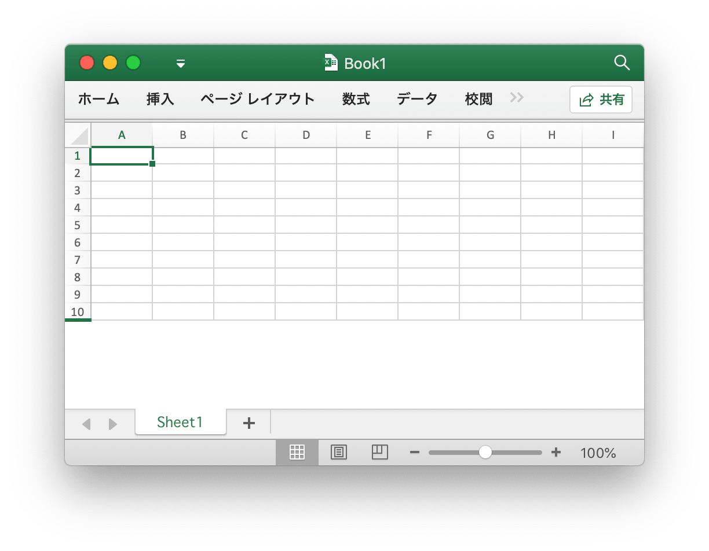
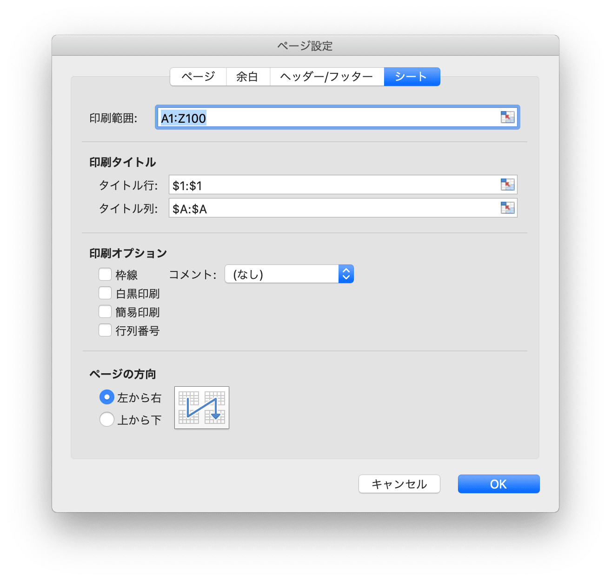

# ワークブック

`Options` は、スプレッドシートを読み書きするためのオプションを定義します。

```go
type Options struct {
    MaxCalcIterations uint
    Password          string
    RawCellValue      bool
    UnzipSizeLimit    int64
    UnzipXMLSizeLimit int64
    ShortDatePattern  string
    LongDatePattern   string
    LongTimePattern   string
    CultureInfo       CultureName
}
```

`MaxCalcIterations` は反復計算の最大反復回数を指定します。デフォルト値は 0 です。

`Password` は、スプレッドシートのパスワードをプレーンテキストで指定します。

`RawCellValue` は、セル値に数値形式を適用するか、生の値を取得するかを指定します。

`UnzipSizeLimit` は、スプレッドシートを開いたときの解凍サイズの制限をバイト単位で指定します。この値は `UnzipXMLSizeLimit` 以上である必要があり、デフォルトのサイズ制限は 16GB です。

`UnzipXMLSizeLimit` は、ワークシートと共有文字列テーブルを解凍する際のメモリ制限をバイト単位で指定します。ファイルサイズがこの値を超えると、ワークシートXMLがシステム一時ディレクトリに抽出されます。この値はデフォルトの `UnzipSizeLimit` 以下である必要があります。値は 16MB です。

`ShortDatePattern` は、短い日付数値形式コードを指定します。スプレッドシート アプリケーションでは、日付形式により日付と時刻のシリアル番号が日付値として表示されます。アスタリスク (\*) で始まる日付形式は、オペレーティング システムに指定されている地域の日付と時刻の設定の変更に対応します。アスタリスクのない形式は、オペレーティング システムの設定の影響を受けません。に使用される `ShortDatePattern` は、アスタリスクで始まる適用日付形式を指定します。

`LongDatePattern` は、長い日付数値形式コードを指定します。

`LongTimePattern` は、長い時間の数値形式コードを指定します。

`CultureInfo` は、システムのローカル言語設定によって影響を受ける組み込みの言語数値形式コードを適用するための国コードを指定します。

## Excel 文書を作成する {#NewFile}

```go
func NewFile(opts ...Options) *File
```

`NewFile` を使って新しい Excel ワークブックを作成します。新しく作成されたワークブックにはデフォルトで `Sheet1` という名前のワークシートが含まれます。

## 開く {#OpenFile}

```go
func OpenFile(filename string, opts ...Options) (*File, error)
```

既存の Excel 文書を `OpenFile` で開きます。たとえば、パスワード保護された開いているスプレッドシート:

```go
f, err := excelize.OpenFile("Book1.xlsx", excelize.Options{Password: "password"})
if err != nil {
    return
}
```

スプレッドシートを開いた後、[`Close()`](workbook.md#Close) でファイルを閉じます。

## データストリームを開く {#OpenReader}

```go
func OpenReader(r io.Reader, opts ...Options) (*File, error)
```

OpenReaderは `io.Reader` からデータストリームを読み取り、入力されたスプレッドシートファイルを返します。

たとえば、アップロードテンプレートを処理する HTTP サーバーを作成してから、新しいワークシートが追加された応答ダウンロードファイルを作成します:

```go
package main

import (
    "fmt"
    "net/http"

    "github.com/xuri/excelize/v2"
)

func process(w http.ResponseWriter, req *http.Request) {
    file, _, err := req.FormFile("file")
    if err != nil {
        fmt.Fprint(w, err.Error())
        return
    }
    defer file.Close()
    f, err := excelize.OpenReader(file)
    if err != nil {
        fmt.Fprint(w, err.Error())
        return
    }
    f.Path = "Book1.xlsx"
    f.NewSheet("NewSheet")
    w.Header().Set("Content-Disposition", fmt.Sprintf("attachment; filename=%s", f.Path))
    w.Header().Set("Content-Type", req.Header.Get("Content-Type"))
    if err := f.Write(w); err != nil {
        fmt.Fprint(w, err.Error())
    }
}

func main() {
    http.HandleFunc("/process", process)
    http.ListenAndServe(":8090", nil)
}
```

cURLを使用してテストします:

```bash
curl --location --request GET 'http://127.0.0.1:8090/process' \
--form 'file=@/tmp/template.xltx' -O -J
```

## 保存 {#Save}

```go
func (f *File) Save(opts ...Options) error
```

Excel 文書に編集内容を保存するには `Save` を使います。

## 名前を付けて保存 {#SaveAs}

```go
func (f *File) SaveAs(name string, opts ...Options) error
```

指定したファイルとして Excel 文書を保存するには `SaveAs` を使います。

## 閉じるワークブック {#Close}

```go
func (f *File) Close() error
```

Close は、スプレッドシート用に開いている一時ファイルを閉じてクリーンアップします。

## ワークシートを作成する {#NewSheet}

```go
func (f *File) NewSheet(sheet string) (int, error)
```

NewSheet は、ワークシート名を指定して新しいシートを作成する関数を提供し、ワークブック（スプレッドシート）に追加された後のシートのインデックスを返します。新しいスプレッドシートファイルを作成すると、`Sheet1`という名前のデフォルトのワークシートが作成されることに注意してください。

## ワークシートを削除する {#DeleteSheet}

```go
func (f *File) DeleteSheet(sheet string) error
```

DeleteSheet は、指定されたワークシート名でブック内のワークシートを削除する機能を提供します。この方法は注意して使用してください。数式やグラフなどの参照の変更に影響します。削除されたワークシートの参照値がある場合、それを開いたときにファイルエラーが発生します。ワークシートが1つしか残っていない場合、この関数は無効になります。

## ワークシートを移動する {#MoveSheet}

```go
func (f *File) MoveSheet(source, target string) error
```

MoveSheet は、シートをワークブック内の指定された位置に移動します。この関数は、ソース シートをターゲット シートの前に移動します。移動後、他のシートは左または右にシフトされます。シートがすでにターゲット位置にある場合、この関数は何も実行しません。この関数は、移動後にすべてのシートのグループを解除するわけではありません。たとえば、`Sheet2` を `Sheet1` の前に移動します:

```go
err := f.MoveSheet("Sheet2", "Sheet1")
```

## ワークシートをコピーする {#CopySheet}

```go
func (f *File) CopySheet(from, to int) error
```

与えられた複製ワークシートおよびターゲットワークシートインデックスコピーワークシートに従って、ターゲットワークシートインデックスはそれが既に存在するかどうかを確認するために開発者を必要とします。セル値と数式のみを含むワークシート間の複製は現在サポートされています。テーブル、イメージ、チャート、ピボットテーブルなどの要素を含むワークシート間の複製はサポートされていません。

```go
// Sheet1 という名前のワークシートは既に存在します ...
index, err := f.NewSheet("Sheet2")
if err != nil {
    fmt.Println(err)
    return
}
err := f.CopySheet(1, index)
```

## グループワークシート {#GroupSheets}

```go
func (f *File) GroupSheets(sheets []string) error
```

GroupSheets は、指定されたワークシート名でワークシートをグループ化する機能を提供します。 グループワークシートには、アクティブなワークシートが含まれている必要があります。

## ワークシートのグループ化を解除する {#UngroupSheets}

```go
func (f *File) UngroupSheets() error
```

UngroupSheets は、ワークシートのグループ化を解除する機能を提供します。

## ワークシートの背景 {#SetSheetBackground}

```go
func (f *File) SetSheetBackground(sheet, picture string) error
```

SetSheetBackground は、ワークシート名とファイル パスを指定して背景画像を設定する機能を提供します。サポートされている画像の種類: BPM、EMF、EMZ、GIF、JPEG、JPG、PNG、SVG、TIF、TIFF、WMF、および WMZ。

```go
func (f *File) SetSheetBackgroundFromBytes(sheet, extension string, picture []byte) error
```

SetSheetBackgroundFromBytes は、ワークシート名、拡張子名、画像データを指定して背景画像を設定する機能を提供します。サポートされている画像の種類: BPM、EMF、EMZ、GIF、JPEG、JPG、PNG、SVG、TIF、TIFF、WMF、および WMZ。

## デフォルトワークシートを設定する {#SetActiveSheet}

```go
func (f *File) SetActiveSheet(index int)
```

SetActiveSheet は、指定されたインデックスによってワークブックのデフォルトのアクティブシートを設定する関数を提供します。アクティブなインデックスは、[`GetSheetMap`](sheet.md#GetSheetMap) 関数によって返されるIDとは異なることに注意してください。`0` 以上で、ワークシートの総数よりも少ない必要があります。

## アクティブシートインデックスを取得する {#GetActiveSheetIndex}

```go
func (f *File) GetActiveSheetIndex() int
```

デフォルトのワークシートのインデックスを取得します。デフォルトのワークシートが見つからない場合は、`0` を返します。

## ワークシートの表示設定 {#SetSheetVisible}

```go
func (f *File) SetSheetVisible(sheet string, visible bool, veryHidden ...bool) error
```

SetSheetVisible は、与えられたワークシート名でワークシートを見えるように設定する機能を提供します。ワークブックには少なくとも1つの表示可能なワークシートが含まれている必要があります。指定したワークシートがアクティブになっている場合、この設定は無効になります。3 番目のオプションの `veryHidden` パラメーターは、`visible` が `false` の場合にのみ機能します。

例えば `Sheet1` を隠す:

```go
err := f.SetSheetVisible("Sheet1", false)
```

## ワークシートの表示設定を取得する {#GetSheetVisible}

```go
func (f *File) GetSheetVisible(sheet string) (bool, error)
```

GetSheetVisible は、与えられたワークシート名でワークシートを見えるようにする機能を提供します。たとえば、`Sheet1` の可視状態を取得します。

```go
visible, err := f.GetSheetVisible("Sheet1")
```

## ワークシートのプロパティを設定する {#SetSheetProps}

```go
func (f *File) SetSheetProps(sheet string, opts *SheetPropsOptions) error
```

SetSheetProps には、ワークシートのプロパティを設定する関数が用意されています。設定できるプロパティは次のとおりです:

オプション|タイプ|形容
---|---|---
CodeName                          | `*string`  | シートの安定した名前を指定します。シートは、時間の経過と共に変化せず、ユーザー入力からも変更されません。この名前は、特定のシートを参照するためにコードで使用する必要があります。
EnableFormatConditionsCalculation | `*bool`    | 条件付き書式の計算を評価するかどうかを示します。false に設定すると、トップ N ルールのカラー スケール、データ バー、またはしきい値の最小値/最大値は更新されません。基本的に条件付き書式 "calc" はオフです
Published                         | `*bool`    | ワークシートが発行されているかどうかを示す既定値は `true` です。
AutoPageBreaks                    | `*bool`    | シートに自動改ページを表示するかどうかを示すデフォルト値は `true` です。
FitToPage                         | `*bool`    | "ページに合わせる" 印刷オプションが有効になっているかどうかを示す。既定値は `false` です。
TabColorIndexed                   | `*int`     | インデックス付きのカラー値を表します。
TabColorRGB                       | `*string`  | 標準の ARGB (アルファ赤緑青) カラー値を表します。
TabColorTheme                     | `*int`     | コレクション内の `0` から始まるインデックスを表し、テーマ パーツで表現された特定の値を参照します。
TabColorTint                      | `*float64` | 色に適用される濃淡値を指定します。デフォルト値は `0.0` です。
OutlineSummaryBelow               | `*bool`    | 概要行がアウトラインの詳細の下に表示されるかどうかを示す。アウトラインを適用する場合、既定値は `true` です。
OutlineSummaryRight               | `*bool`    | 概要列がアウトラインの詳細の右側に表示されるかどうかを示す。アウトラインを適用する場合、既定値は `true` です。
BaseColWidth                      | `*uint8`   | 標準スタイルのフォントの最大桁幅の文字数を指定します。この値には、グリッド線の余白のパディングや余分なパディングは含まれません。これは文字数のみであり、デフォルト値は `8` です。
DefaultColWidth                   | `*float64` | 通常のスタイルのフォントの最大桁幅の文字数として測定される既定の列幅を指定します。
DefaultRowHeight                  | `*float64` | ポイント サイズで測定される既定の行の高さを指定します。最適化により、すべての行に高さを書き込む必要はありません。これは、ほとんどの行にカスタムの高さがある場合、最適化を達成するために書き出すことができます
CustomHeight                      | `*bool`    | カスタムの高さを指定します。デフォルト値は `false` です。
ZeroHeight                        | `*bool`    | 行を非表示にするかどうかを指定します。デフォルト値は `false` です。
ThickTop                          | `*bool`    | 既定で行の上罫線が太い場合に指定します。既定値は `false` です。
ThickBottom                       | `*bool`    | 既定で行の下罫線が太い場合に指定します。既定値は `false` です。

たとえば、ワークシートの行をデフォルトで非表示にします。

<p align="center"></p>

```go
f, enable := excelize.NewFile(), true
if err := f.SetSheetProps("Sheet1", &excelize.SheetPropsOptions{
    ZeroHeight: &enable,
}); err != nil {
    fmt.Println(err)
}
if err := f.SetRowVisible("Sheet1", 10, true); err != nil {
    fmt.Println(err)
}
f.SaveAs("Book1.xlsx")
```

## ワークシートのプロパティを取得する {#GetSheetProps}

```go
func (f *File) GetSheetProps(sheet string) (SheetPropsOptions, error)
```

GetSheetProps には、ワークシートのプロパティを取得する関数が用意されています。

## ワークシートビューのプロパティを設定する {#SetSheetView}

```go
func (f *File) SetSheetView(sheet string, viewIndex int, opts *ViewOptions) error
```

SetSheetView は、シート ビューのプロパティを設定します。`viewIndex` は負の値になる可能性があり、負の場合は逆方向にカウントされます (`-1` が最後のビューです)。設定できるプロパティは次のとおりです:

オプション|タイプ|形容
---|---|---
DefaultGridColor  | `*bool`    | 使用側アプリケーションがデフォルトのグリッド線の色 (システム依存) を使用する必要があることを示します。colorId で指定された色をオーバーライドします。デフォルト値は `true` です。
RightToLeft       | `*bool`    | シートが「右から左」の表示モードになっているかどうかを示します。このモードでは、列 A は右端の列 B にあります。は列 A の左 1 列で、以下同様です。また、セル内の情報は右から左の形式で表示され、デフォルト値は `false`です。
ShowFormulas      | `*bool`    | このシートに数式を表示するかどうかを示す既定値は `false` です。
ShowGridLines     | `*bool`    | このシートにグリッド線を表示するかどうかを示すデフォルト値は `true` です。
ShowRowColHeaders | `*bool`    | シートに行見出しと列見出しを表示するかどうかを示すデフォルト値は `true` です。
ShowRuler         | `*bool`    | このシートに定規を表示することを示すと、既定値は `true` です。
ShowZeros         | `*bool`    | 「値がゼロのセルにゼロを表示する」かどうかを示します。数式を使用して空の別のセルを参照する場合、フラグが `true` の場合、参照される値は `0` になり、既定値は `true` になります。
TopLeftCell       | `*string`  | 左上の可視セルの位置を指定します右下のペインの左上に表示されるセルの位置 (左から右モードの場合)
View              | `*string`  | シートの表示方法を示すと、デフォルトでは空の文字列、使用可能なオプション (`normal`、`pageBreakPreview`、`pageLayout`が使用されます)
ZoomScale         | `*float64` | パーセント値を表す現在のビューのウィンドウ ズーム倍率を指定します。この属性は、`10` から `400` の範囲の値に制限されます。水平スケールと垂直スケールを一緒に表示し、デフォルト値は `100` です。

## ワークシートビュープロパティを取得する {#GetSheetView}

```go
func (f *File) GetSheetView(sheet string, viewIndex int) (ViewOptions, error)
```

GetSheetView は、シート ビューのプロパティの値を取得します。`viewIndex` は負の値になる可能性があり、負の場合は逆方向にカウントされます (`-1` が最後のビューです)。

## ワークシートのページレイアウトを設定する {#SetPageLayout}

```go
func (f *File) SetPageLayout(sheet string, opts *PageLayoutOptions) error
```

指定されたワークシート名とページレイアウトパラメータに基づいて、ワークシートのページレイアウトプロパティを設定します。現在設定でサポートされているページレイアウトプロパティ:

`Size` メソッドでページの用紙サイズを設定するデフォルトのページレイアウトサイズは「レター用紙 8 1/2 × 11 インチ」です。次の表は Excelize のページレイアウトサイズとインデックスの `Size` パラメータの比較です。

インデックス|用紙サイズ
---|---
1   | レター 8 1/2 × 11 インチ
2   | Letter Small 8 1/2 × 11 インチ
3   | タブロイド 11 × 17 インチ
4   | Ledger 17 × 11 インチ
5   | リーガル紙 8 1/2 × 14 インチ
6   | 声明紙 5 1/2 × 8 1/2 インチ
7   | 行政書用紙 7 1/2 × 10 インチ
8   | A3 297 × 420 mm
9   | A4 210 × 297 mm
10  | A4 小さい紙 210 × 297 mm
11  | A5 148 × 210 mm
12  | B4 250 × 353 mm
13  | B5 176 × 250 mm
14  | フォリオ紙 8 1/2 × 13 インチ
15  | 四分紙 215 × 275 mm
16  | アメリカ標準紙 10 × 14 インチ
17  | アメリカ標準紙 11 × 17 インチ
18  | Note paper 8.5 × 11 インチ
19  | 封筒 #9 3.875 × 8.875 インチ
20  | 封筒 #10 4-1/8 × 9 1/2 インチ
21  | 封筒 #11 4.5 × 10.375 インチ
22  | 封筒 #12 4.75 × 11 インチ
23  | 封筒 #14 5 × 11.5 インチ
24  | C paper 17 × 22 インチ
25  | D paper 22 × 34 インチ
26  | E paper 34 × 44 インチ
27  | 封筒 DL 110 × 220 mm
28  | 封筒 C5 162 × 229 mm
29  | 封筒 C3 324 × 458 mm
30  | 封筒 C4 229 × 324 mm
31  | 封筒 C6 114 × 162 mm
32  | 封筒 C65 114 × 229 mm
33  | 封筒 B4 250 × 353 mm
34  | 封筒 B5 176 × 250 mm
35  | 封筒 B6 176 × 125 mm
36  | 封筒 Italy 110 × 230 mm
37  | 君主の封筒 3.88 × 7.5 インチ
38  | 6¾ 封筒 3.625 × 6.5 インチ
39  | US standard fanfold 14.875 × 11 インチ
40  | German standard fanfold 8.5 × 12 インチ
41  | German legal fanfold 8.5 × 13 インチ
42  | ISO B4 250 × 353 mm
43  | 官製はがき 100 × 148 mm
44  | Standard paper 9 × 11 インチ
45  | Standard paper 10 × 11 インチ
46  | Standard paper 15 × 11 インチ
47  | 招待状 220 × 220 mm
50  | Letter extra paper 9.275 × 12 インチ
51  | Legal extra paper 9.275 × 15 インチ
52  | Tabloid extra paper 11.69 × 18 インチ
53  | A4 extra paper 236 × 322 mm
54  | Letter transverse paper 8.275 × 11 インチ
55  | A4 transverse paper 210 × 297 mm
56  | Letter extra transverse paper 9.275 × 12 インチ
57  | SuperA/SuperA/A4 paper 227 × 356 mm
58  | SuperB/SuperB/A3 paper 305 × 487 mm
59  | Letter plus paper 8.5 × 12.69 インチ
60  | A4 plus paper 210 × 330 mm
61  | A5 transverse paper 148 × 210 mm
62  | JIS B5 transverse paper 182 × 257 mm
63  | A3 extra paper 322 × 445 mm
64  | A5 extra paper 174 × 235 mm
65  | ISO B5 extra paper 201 × 276 mm
66  | A2 420 × 594 mm
67  | A3 transverse paper 297 × 420 mm
68  | A3 extra transverse paper 322 × 445 mm
69  | 往復はがき 200 × 148 mm
70  | A6 105 × 148 mm
71  | 日本の封筒 Kaku #2
72  | 日本の封筒 Kaku #3
73  | 日本の封筒 Chou #3
74  | 日本の封筒 Chou #4
75  | Letter Rotated (11 × 8½ in)
76  | A3 横回転 420 × 297 mm
77  | A4 横回転 297 × 210 mm
78  | A5 横回転 210 × 148 mm
79  | B4 (JIS) 横回転 364 × 257 mm
80  | B5 (JIS) 横回転 257 × 182 mm
81  | 官製はがき 横回転 148 × 100 mm
82  | 往復はがき 横回転 148 × 200 mm
83  | A6 横回転 148 × 105 mm
84  | 日本の封筒 Kaku #2 横回転
85  | 日本の封筒 Kaku #3 横回転
86  | 日本の封筒 Chou #3 横回転
87  | 日本の封筒 Chou #4 横回転
88  | B6 (JIS) 128 × 182 mm
89  | B6 (JIS) 横回転 182 × 128 mm
90  | 12 × 11 インチ
91  | 日本の封筒 You #4
92  | 日本の封筒 You #4 横回転
93  | 中国の封筒 16K (146 mm × 215 mm)
94  | 中国の封筒 32K (97 mm × 151 mm)
95  | 中国の封筒 32K(Big) (97 mm × 151 mm)
96  | 中国の封筒 #1 102 × 165 mm
97  | 中国の封筒 #2 102 × 176 mm
98  | 中国の封筒 #3 125 × 176 mm
99  | 中国の封筒 #4 110 × 208 mm
100 | 中国の封筒 #5 110 × 220 mm
101 | 中国の封筒 #6 120 × 230 mm
102 | 中国の封筒 #7 160 × 230 mm
103 | 中国の封筒 #8 120 × 309 mm
104 | 中国の封筒 #9 229 × 324 mm
105 | 中国の封筒 #10 324 × 458 mm
106 | 中国の封筒 16K 横回転
107 | 中国の封筒 32K 横回転
108 | 中国の封筒 32K(Big) 横回転
109 | 中国の封筒 #1 横回転 165 × 102 mm
110 | 中国の封筒 #2 横回転 176 × 102 mm
111 | 中国の封筒 #3 横回転 176 × 125 mm
112 | 中国の封筒 #4 横回転 208 × 110 mm
113 | 中国の封筒 #5 横回転 220 × 110 mm
114 | 中国の封筒 #6 横回転 230 × 120 mm
115 | 中国の封筒 #7 横回転 230 × 160 mm
116 | 中国の封筒 #8 横回転 309 × 120 mm
117 | 中国の封筒 #9 横回転 324 × 229 mm
118 | 中国の封筒 #10 横回転 458 × 324 mm

`Orientation` はワークシートの向きを指定し、デフォルトの向きは `portrait` です。このフィールドに指定できる値は、`portrait` と `landscape` です。

`FirstPageNumber` は最初に印刷されたページ番号を指定しました。値を指定しない場合は、「自動」と見なされます。

`AdjustTo` は印刷の拡大 / 縮小を指定しました。この属性は、10 (10%) から 400 (400%) の範囲の値に制限されます。この設定は、`FitToWidth` や `FitToHeight` が使用されている場合に上書きされます。

`FitToHeight` は、収まる垂直方向のページ数を指定しました。

`FitToWidth` は、収まる水平方向のページ数を指定します。

`BlackAndWhite` は白黒印刷を指定しました。

たとえば、`Sheet1` という名前のシート ページ レイアウトをモノクロ印刷、開始ページ番号 `2`、横向き、A4 (小) 210 × 297 mm 用紙、縦に収まるように2ページ、収まるように横に2つのページ:

```go
f := excelize.NewFile()
var (
    size                 = 10
    orientation          = "landscape"
    firstPageNumber uint = 2
    adjustTo        uint = 100
    fitToHeight          = 2
    fitToWidth           = 2
    blackAndWhite        = true
)
if err := f.SetPageLayout("Sheet1", &excelize.PageLayoutOptions{
    Size:            &size,
    Orientation:     &orientation,
    FirstPageNumber: &firstPageNumber,
    AdjustTo:        &adjustTo,
    FitToHeight:     &fitToHeight,
    FitToWidth:      &fitToWidth,
    BlackAndWhite:   &blackAndWhite,
}); err != nil {
    fmt.Println(err)
}
```

## ワークシートのページレイアウトを取得する {#GetPageLayout}

```go
func (f *File) GetPageLayout(sheet string) (PageLayoutOptions, error)
```

GetPageLayout には、ワークシートのページ レイアウトを取得する関数が用意されています。

## ワークシートのページ余白を設定する {#SetPageMargins}

```go
func (f *File) SetPageMargins(sheet string, opts *PageLayoutMarginsOptions) error
```

SetPageMargins は、ワークシートのページ余白を設定する機能を提供します。利用可能なオプション：

オプション|タイプ|形容
---|---|---
Bottom       | `*float64` | 下
Footer       | `*float64` | フッター
Header       | `*float64` | ヘッダ
Left         | `*float64` | 左
Right        | `*float64` | 右
Top          | `*float64` | 上
Horizontally | `*bool`    | ページの中央: 水平方向
Vertically   | `*bool`    | ページの中央: 垂直方向

## ワークシートのページ余白を取得する {#GetPageMargins}

```go
func (f *File) GetPageMargins(sheet string) (PageLayoutMarginsOptions, error)
```

GetPageMargins は、ワークシートのページ余白を取得する関数を提供します。

## ブックのプロパティを設定する {#SetWorkbookProps}

```go
func (f *File) SetWorkbookProps(opts *WorkbookPropsOptions) error
```

SetWorkbookProps は、ブックのプロパティを設定する関数を提供します。利用可能なオプション:

オプション|タイプ|形容
---|---|---
Date1904      | `*bool`   | ブック内のシリアル日付時刻を日付に変換するときに、1900 年または 1904 年の日付システムを使用するかどうかを示します。
FilterPrivacy | `*bool`   | アプリケーションがブックで個人を特定できる情報 (PII) を検査したかどうかを示すブール値を指定します。このフラグが設定されている場合、アプリケーションは、ユーザーがドキュメントに PII を挿入するアクションを実行するたびにユーザーに警告します。
CodeName      | `*string` | このブックを作成したアプリケーションのコード名を指定します。この属性を使用して、アプリケーションの増分リリースでファイルの内容を追跡します。

## ブックのプロパティを取得する {#GetWorkbookProps}

```go
func (f *File) GetWorkbookProps() (WorkbookPropsOptions, error)
```

GetWorkbookProps は、ブックのプロパティを取得する関数を提供します。

## ヘッダとフッタを設定する {#SetHeaderFooter}

```go
func (f *File) SetHeaderFooter(sheet string, opts *HeaderFooterOptions) error
```

SetHeaderFooter は、与えられたワークシート名と制御文字によってヘッダーとフッターを設定する機能を提供します。

ヘッダーとフッターは、次の設定フィールドを使って指定します。

田畑           | 説明
---|---
AlignWithMargins | ヘッダーフッターの余白をページの余白に揃えます
DifferentFirst   | 別の最初のページのヘッダーとフッターのインジケーター
DifferentOddEven | 異なる奇数ページと偶数ページのヘッダーとフッターのインジケーター
ScaleWithDoc     | ドキュメントスケーリングを使用してヘッダーとフッターをスケーリングします
OddFooter        | 奇数ページ フッター、または `DifferentOddEven` が `false` の場合はプライマリ ページ フッター
OddHeader        | 奇数ヘッダー、または `DifferentOddEven` が `false` の場合はプライマリ ページ ヘッダー
EvenFooter       | ページフッターも
EvenHeader       | ページヘッダーも
FirstFooter      | 最初のページのフッター
FirstHeader      | 最初のページのヘッダー

以下のフォーマットコードは、6 つの文字列型フィールドで使用できます。`OddHeader`, `OddFooter`, `EvenHeader`, `EvenFooter`, `FirstFooter`, `FirstHeader`

<table>
    <thead>
        <tr>
            <th>書式設定コード</th>
            <th>説明</th>
        </tr>
    </thead>
    <tbody>
        <tr>
            <td><code>&amp;&amp;</code></td>
            <td>キャラクター &quot;&amp;&quot;</td>
        </tr>
        <tr>
            <td><code>&amp;font-size</code></td>
            <td>テキストフォントのサイズ。font-size はポイント単位の 10 進数のフォントサイズです</td>
        </tr>
        <tr>
            <td><code>&amp;&quot;font name,font type&quot;</code></td>
            <td>テキストフォント名文字列、フォント名、およびテキストフォントタイプ文字列、フォントタイプ</td>
        </tr>
        <tr>
            <td><code>&amp;&quot;-,Regular&quot;</code></td>
            <td>通常のテキスト形式。太字と斜体のモードをオフに切り替えます</td>
        </tr>
        <tr>
            <td><code>&amp;A</code></td>
            <td>現在のワークシートのタブ名</td>
        </tr>
        <tr>
            <td><code>&amp;B</code> or <code>&amp;&quot;-,Bold&quot;</code></td>
            <td>太字のテキスト形式、オフからオン、またはその逆。デフォルトモードはオフです</td>
        </tr>
        <tr>
            <td><code>&amp;D</code></td>
            <td>現在の日付</td>
        </tr>
        <tr>
            <td><code>&amp;C</code></td>
            <td>センターセクション</td>
        </tr>
        <tr>
            <td><code>&amp;E</code></td>
            <td>二重下線テキスト形式</td>
        </tr>
        <tr>
            <td><code>&amp;F</code></td>
            <td>現在のブックのファイル名</td>
        </tr>
        <tr>
            <td><code>&amp;G</code></td>
            <td>背景としてオブジェクトを描画します（現在サポートされていません）</td>
        </tr>
        <tr>
            <td><code>&amp;H</code></td>
            <td>シャドウテキスト形式</td>
        </tr>
        <tr>
            <td><code>&amp;I</code> or <code>&amp;&quot;-,Italic&quot;</code></td>
            <td>斜体のテキスト形式</td>
        </tr>
        <tr>
            <td><code>&amp;K</code></td>
            <td>テキストフォントの色<br>RGB カラーは RRGGBB として指定されます<br>テーマカラーは TTSNNN として指定されます。ここで、TT はテーマカラー ID、S は &quot;+&quot; のいずれかです。または &quot;-&quot; ティント/シェード値の、そして NNN はティント/シェード値です</td>
        </tr>
        <tr>
            <td><code>&amp;L</code></td>
            <td>左セクション</td>
        </tr>
        <tr>
            <td><code>&amp;N</code></td>
            <td>総ページ数</td>
        </tr>
        <tr>
            <td><code>&amp;O</code></td>
            <td>アウトラインテキスト形式</td>
        </tr>
        <tr>
            <td><code>&amp;P[[+\|-]n]</code></td>
            <td>オプションのサフィックスがない場合、現在のページ番号（10進数）</td>
        </tr>
        <tr>
            <td><code>&amp;R</code></td>
            <td>右セクション</td>
        </tr>
        <tr>
            <td><code>&amp;S</code></td>
            <td>取り消し線のテキスト形式</td>
        </tr>
        <tr>
            <td><code>&amp;T</code></td>
            <td>現在の時刻</td>
        </tr>
        <tr>
            <td><code>&amp;U</code></td>
            <td>一重下線のテキスト形式。二重下線モードがオンの場合、セクション指定子で次に発生すると、二重下線モードがオフに切り替わります。それ以外の場合は、単一下線モードをオフからオンに、またはその逆に切り替えます。デフォルトモードはオフです</td>
        </tr>
        <tr>
            <td><code>&amp;X</code></td>
            <td>上付きテキスト形式</td>
        </tr>
        <tr>
            <td><code>&amp;Y</code></td>
            <td>下付きテキスト形式</td>
        </tr>
        <tr>
            <td><code>&amp;Z</code></td>
            <td>現在のブックのファイルパス</td>
        </tr>
    </tbody>
</table>

例えば：

```go
err := f.SetHeaderFooter("Sheet1", &excelize.HeaderFooterOptions{
    DifferentFirst:   true,
    DifferentOddEven: true,
    OddHeader:        "&R&P",
    OddFooter:        "&C&F",
    EvenHeader:       "&L&P",
    EvenFooter:       "&L&D&R&T",
    FirstHeader:      `&CCenter &"-,Bold"Bold&"-,Regular"HeaderU+000A&D`,
})
```

この例は次のことを示しています:

- 最初のページには独自のヘッダーとフッターがあります
- 奇数ページと偶数ページでヘッダーとフッターが異なる
- 奇数ページヘッダの右側のセクションにある現在のページ番号
- 奇数ページのフッターの中央部分にある現在のワークブックのファイル名
- 偶数ページヘッダの左側のセクションにある現在のページ番号
- 偶数ページのフッターの左側のセクションに現在の日付と右側のセクションに現在の時刻
- 最初のページの中央セクションの1行目のテキスト "Center Bold Header"、および同じページの中央セクションの2行目の日付
- 最初のページにフッターなし

### 名前を設定する {#SetDefinedName}

```go
func (f *File) SetDefinedName(definedName *DefinedName) error
```

与えられた名前とスコープに基づいて名前を設定しますデフォルトのスコープはワークブックです。例えば、

```go
err := f.SetDefinedName(&excelize.DefinedName{
    Name:     "Amount",
    RefersTo: "Sheet1!$A$2:$D$5",
    Comment:  "defined name comment",
    Scope:    "Sheet2",
})
```

ワークシートの印刷領域と印刷タイトルの設定:

<p align="center"></p>

```go
if err := f.SetDefinedName(&excelize.DefinedName{
    Name:     "_xlnm.Print_Area",
    RefersTo: "Sheet1!$A$1:$Z$100",
    Scope:    "Sheet1",
}); err != nil {
    fmt.Println(err)
}
if err := f.SetDefinedName(&excelize.DefinedName{
    Name:     "_xlnm.Print_Titles",
    RefersTo: "Sheet1!$A:$A,Sheet1!$1:$1",
    Scope:    "Sheet1",
}); err != nil {
    fmt.Println(err)
}
```

`RefersTo` プロパティにカンマなしで 1 つの列範囲のみを入力すると、「左側で繰り返す列」としてのみ機能します。例:

```go
if err := f.SetDefinedName(&excelize.DefinedName{
    Name:     "_xlnm.Print_Titles",
    RefersTo: "Sheet1!$A:$A",
    Scope:    "Sheet1",
}); err != nil {
    fmt.Println(err)
}
```

`RefersTo` プロパティにコンマなしで 1 つの行範囲のみを入力すると、「上部で繰り返す行」としてのみ機能します。例:

```go
if err := f.SetDefinedName(&excelize.DefinedName{
    Name:     "_xlnm.Print_Titles",
    RefersTo: "Sheet1!$1:$1",
    Scope:    "Sheet1",
}); err != nil {
    fmt.Println(err)
}
```

## 名前を取得する {#GetDefinedName}

```go
func (f *File) GetDefinedName() []DefinedName
```

範囲内のワークブックとワークシートの名前のリストを取得します。

## 定義された名前を削除 {#DeleteDefinedName}

```go
func (f *File) DeleteDefinedName(definedName *DefinedName) error
```

DeleteDefinedName は、ワークブックまたはワークシートの定義名を削除する機能を提供します。スコープが指定されていない場合、デフォルトのスコープはワークブックです。例えば：

```go
err := f.DeleteDefinedName(&excelize.DefinedName{
    Name:     "Amount",
    Scope:    "Sheet2",
})
```

## アプリケーションのプロパティを設定する {#SetAppProps}

```go
func (f *File) SetAppProps(appProperties *AppProperties) error
```

SetAppProps は、ドキュメントアプリケーションのプロパティを設定する機能を提供します。設定できるプロパティは次のとおりです。

プロパティ      | 説明
---|---
Application       | このドキュメントを作成したアプリケーションの名前。
ScaleCrop         | ドキュメントサムネイルの表示モードを示します。この要素を `true` に設定すると、ドキュメントのサムネイルをディスプレイに合わせて拡大縮小できます。この要素を `false` に設定すると、ドキュメントのサムネイルをトリミングして、表示に合うセクションのみを表示できるようになります。
DocSecurity       | 数値としてのドキュメントのセキュリティレベル。ドキュメントのセキュリティは次のように定義されます<br>1 - ドキュメントはパスワードで保護されています<br>2 - ドキュメントは読み取り専用として開くことをお勧めします<br>3 - ドキュメントは読み取り専用として開くように強制されます<br>4 - ドキュメントは注釈のためにロックされています
Company           | ドキュメントに関連付けられている会社の名前。
LinksUpToDate     | ドキュメント内のハイパーリンクが最新であるかどうかを示します。この要素を `true` に設定して、ハイパーリンクが更新されることを示します。 この要素を `false` に設定して、ハイパーリンクが古くなっていることを示します。
HyperlinksChanged | この部分の1つ以上のハイパーリンクが、この部分でプロデューサーによって排他的に更新されたことを指定します。このドキュメントを開く次のプロデューサーは、このパートで指定された新しいハイパーリンクでハイパーリンクの関係を更新する必要があります。
AppVersion        | このドキュメントを作成したアプリケーションのバージョンを指定します。この要素の内容は、XX.YYYY の形式である必要があります。ここで、XとYは数値を表します。そうでない場合、ドキュメントは不適合と見なされます。

例えば：

```go
err := f.SetAppProps(&excelize.AppProperties{
    Application:       "Microsoft Excel",
    ScaleCrop:         true,
    DocSecurity:       3,
    Company:           "Company Name",
    LinksUpToDate:     true,
    HyperlinksChanged: true,
    AppVersion:        "16.0000",
})
```

## アプリケーションのプロパティを取得する {#GetAppProps}

```go
func (f *File) GetAppProps() (*AppProperties, error)
```

GetAppProps は、ドキュメントアプリケーションのプロパティを取得する関数を提供します。

## ドキュメントのプロパティを設定する {#SetDocProps}

```go
func (f *File) SetDocProps(docProperties *DocProperties) error
```

ワークブックのコアプロパティを設定します。設定できるプロパティは次のとおりです:

プロパティ      | 説明
---|---
Category       | このパッケージの内容の分類。
ContentStatus  | コンテンツの状態。たとえば、値には "Draft"、"Reviewed"、および "Final" が含まれる場合があります。
Created        | リソースのコンテンツの作成時間。
Creator        | 主にリソースのコンテンツを作成するエンティティ。
Description    | リソースの内容の説明。
Identifier     | 特定のコンテキスト内のリソースへの明確な参照。
Keywords       | 検索とインデックス作成をサポートするキーワードの区切られたセット。これは通常、プロパティ内の他の場所では使用できない用語の一覧です。
Language       | リソースの知的コンテンツの言語。
LastModifiedBy | 最後の変更を実行したユーザー。識別は環境固有です。
Modified       | リソースのコンテンツの変更時刻。
Revision       | リソースのコンテンツのリビジョン番号。
Subject        | リソースのコンテンツのトピック。
Title          | リソースに指定された名前。
Version        | バージョン番号。この値は、ユーザーまたはアプリケーションによって設定されます。

例えば：

```go
err := f.SetDocProps(&excelize.DocProperties{
    Category:       "category",
    ContentStatus:  "Draft",
    Created:        "2019-06-04T22:00:10Z",
    Creator:        "Go Excelize",
    Description:    "This file created by Go Excelize",
    Identifier:     "xlsx",
    Keywords:       "Spreadsheet",
    LastModifiedBy: "Go Author",
    Modified:       "2019-06-04T22:00:10Z",
    Revision:       "0",
    Subject:        "Test Subject",
    Title:          "Test Title",
    Language:       "en-US",
    Version:        "1.0.0",
})
```

## ドキュメントのプロパティを取得する {#GetDocProps}

```go
func (f *File) GetDocProps() (*DocProperties, error)
```

ワークブックのコアとなるプロパティを取得してください。

## ブックを保護する {#ProtectWorkbook}

```go
func (f *File) ProtectWorkbook(opts *WorkbookProtectionOptions) error
```

ProtectWorkbook は、他のユーザーが誤ってまたは故意にブック内のデータを変更、移動、または削除するのを防ぐ機能を提供します。 オプション フィールド `AlgorithmName` は、ハッシュ アルゴリズムを指定し、XOR、MD4、MD5、SHA-1、SHA2-56、SHA-384、および SHA-512 をサポートします。現在、ハッシュ アルゴリズムが指定されていない場合、デフォルトとして XOR アルゴリズムが使用されます。 たとえば、保護設定でワークブックを保護します:

```go
err := f.ProtectWorkbook(&excelize.WorkbookProtectionOptions{
    Password:      "password",
    LockStructure: true,
})
```

WorkbookProtectionOptions は、ブックの保護の設定を直接マップします。

```go
type WorkbookProtectionOptions struct {
    AlgorithmName string
    Password      string
    LockStructure bool
    LockWindows   bool
}
```

## ブックの保護を解除する {#UnprotectWorkbook}

```go
func (f *File) UnprotectWorkbook(password ...string) error
```

UnprotectWorkbook は、ワークブックの保護を解除する機能を提供します。オプションのパスワード パラメーターを指定して、パスワードの検証でワークブックの保護を解除します。
