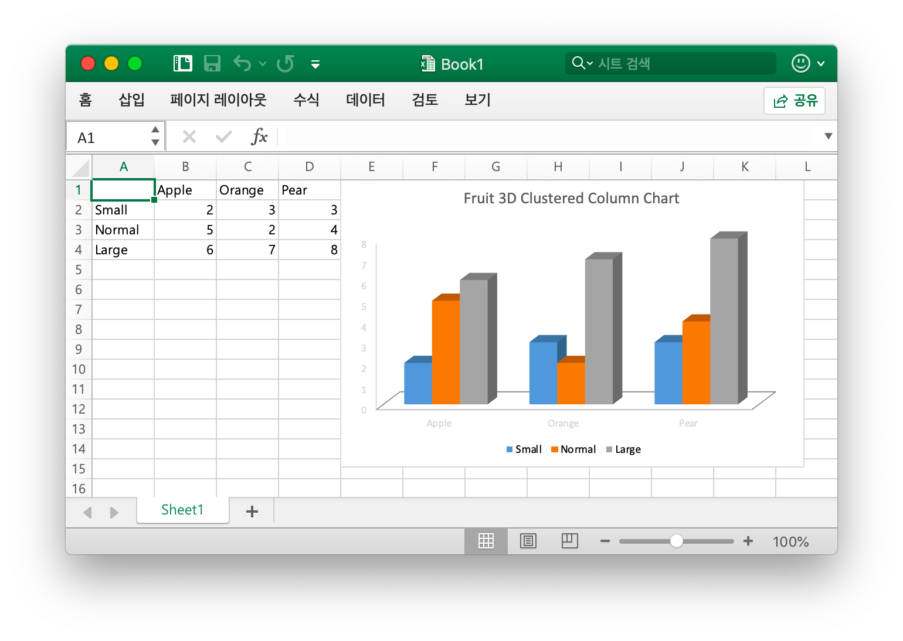

# 빠르게 시작 하기

## 설치 {#install}

최신 버전의 Excelize 라이브러리를 사용하려면 Go 버전 1.15 이상이 필요합니다.

- 설치 명령

```bash
go get github.com/xuri/excelize
```

- [Go Modules](https://blog.golang.org/using-go-modules) 로 패키지를 관리하는 경우 다음 명령으로 설치하십시오.

```bash
go get github.com/xuri/excelize/v2
```

## 업데이트 {#update}

- 업데이트 명령

```bash
go get -u github.com/xuri/excelize/v2
```

## Excel 문서 만들기 {#NewFile}

다음은 Excel 문서를 만드는 간단한 예제입니다：

```go
package main

import (
    "fmt"

    "github.com/xuri/excelize/v2"
)

func main() {
    f := excelize.NewFile()
    // 워크시트 만들기
    index := f.NewSheet("Sheet2")
    // 셀 값 설정
    f.SetCellValue("Sheet2", "A2", "Hello world.")
    f.SetCellValue("Sheet1", "B2", 100)
    // 통합 문서에 대 한 기본 워크시트를 설정 합니다
    f.SetActiveSheet(index)
    // 지정 된 경로를 기반으로 파일 저장
    if err := f.SaveAs("Book1.xlsx"); err != nil {
        fmt.Println(err)
    }
}
```

## Excel 문서 읽기 {#read}

다음은 Excel 문서를 읽는 예제입니다：

```go
package main

import (
    "fmt"

    "github.com/xuri/excelize/v2"
)

func main() {
    f, err := excelize.OpenFile("Book1.xlsx")
    if err != nil {
        fmt.Println(err)
        return
    }
    // 워크시트에서 지정 된 셀의 값을 가져옵니다
    cell, err := f.GetCellValue("Sheet1", "B2")
    if err != nil {
        fmt.Println(err)
        return
    }
    fmt.Println(cell)
    // Sheet1 의 모든 셀 가져오기
    rows, err := f.GetRows("Sheet1")
    if err != nil {
        fmt.Println(err)
        return
    }
    for _, row := range rows {
        for _, colCell := range row {
            fmt.Print(colCell, "\t")
        }
        fmt.Println()
    }
    if err = f.Close(); err != nil {
        fmt.Println(err)
    }
}
```

## Excel 문서에 차트 추가 {#chart}

Excelize 을 사용 하 여 차트를 생성 하는 것은 간단 하며 몇 줄의 코드만 필요 합니다. 워크시트의 기존 데이터를 기반으로 차트를 작성 하거나 워크시트에 데이터를 추가 하 고 차트를 만들 수 있습니다.

<p align="center"></p>

```go
package main

import (
    "fmt"

    "github.com/xuri/excelize/v2"
)

func main() {
    categories := map[string]string{
        "A2": "Small", "A3": "Normal", "A4": "Large",
        "B1": "Apple", "C1": "Orange", "D1": "Pear"}
    values := map[string]int{
        "B2": 2, "C2": 3, "D2": 3, "B3": 5, "C3": 2,
        "D3": 4, "B4": 6, "C4": 7, "D4": 8}
    f := excelize.NewFile()
    for k, v := range categories {
        f.SetCellValue("Sheet1", k, v)
    }
    for k, v := range values {
        f.SetCellValue("Sheet1", k, v)
    }
    if err := f.AddChart("Sheet1", "E1", `{
        "type": "col3DClustered",
        "series": [
        {
            "name": "Sheet1!$A$2",
            "categories": "Sheet1!$B$1:$D$1",
            "values": "Sheet1!$B$2:$D$2"
        },
        {
            "name": "Sheet1!$A$3",
            "categories": "Sheet1!$B$1:$D$1",
            "values": "Sheet1!$B$3:$D$3"
        },
        {
            "name": "Sheet1!$A$4",
            "categories": "Sheet1!$B$1:$D$1",
            "values": "Sheet1!$B$4:$D$4"
        }],
        "title":
        {
            "name": "Fruit 3D Clustered Column Chart"
        }
    }`); err != nil {
        fmt.Println(err)
        return
    }
    // 지정 된 경로를 기반으로 파일 저장
    if err := f.SaveAs("Book1.xlsx"); err != nil {
        fmt.Println(err)
    }
}
```

## Excel 문서에 그림 추가 {#image}

```go
package main

import (
    "fmt"
    _ "image/gif"
    _ "image/jpeg"
    _ "image/png"

    "github.com/xuri/excelize/v2"
)

func main() {
    f, err := excelize.OpenFile("Book1.xlsx")
    if err != nil {
        fmt.Println(err)
        return
    }
    // 그림 삽입
    if err := f.AddPicture("Sheet1", "A2", "image.png", ""); err != nil {
        fmt.Println(err)
    }
    // 워크시트에 그림을 삽입 하 고 그림의 확대/축소 배율을 설정 합니다
    if err := f.AddPicture("Sheet1", "D2", "image.jpg", `{
        "x_scale": 0.5,
        "y_scale": 0.5
    }`); err != nil {
        fmt.Println(err)
    }
    // 워크시트에 그림을 삽입 하 고 그림의 인쇄 속성을 설정 합니다
    if err := f.AddPicture("Sheet1", "H2", "image.gif", `{
        "x_offset": 15,
        "y_offset": 10,
        "print_obj": true,
        "lock_aspect_ratio": false,
        "locked": false
    }`); err != nil {
        fmt.Println(err)
    }
    // 파일 저장
    if err = f.Save(); err != nil {
        fmt.Println(err)
    }
    if err = f.Close(); err != nil {
        fmt.Println(err)
    }
}
```
