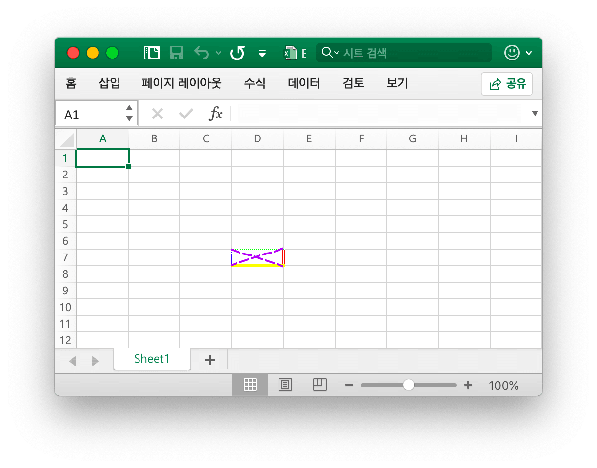
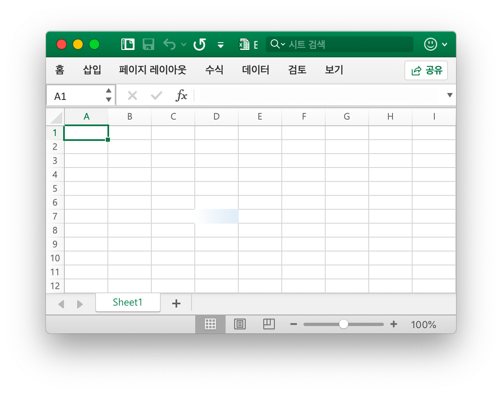
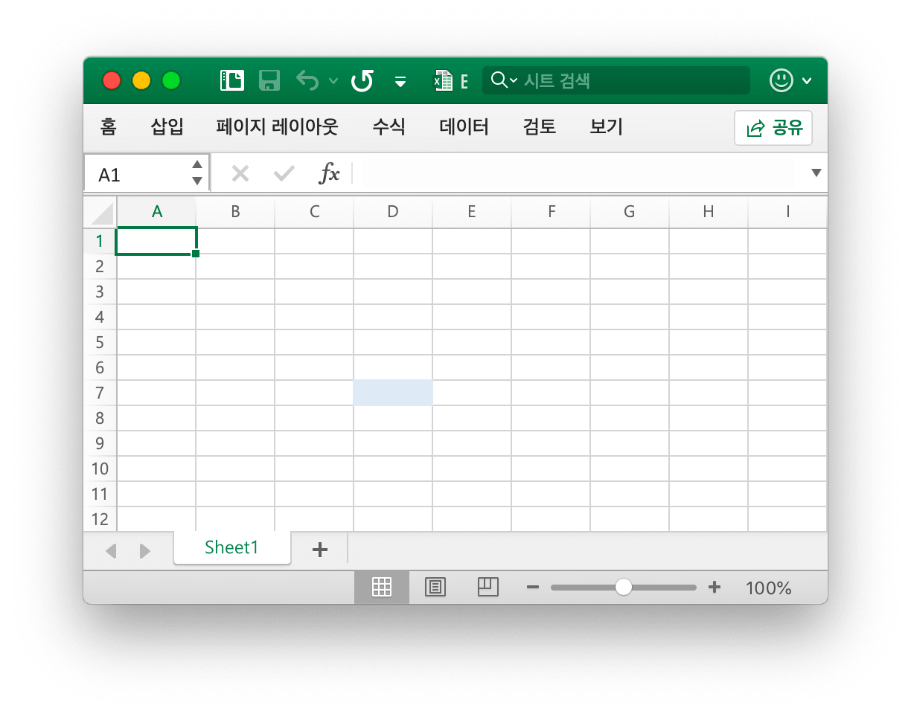
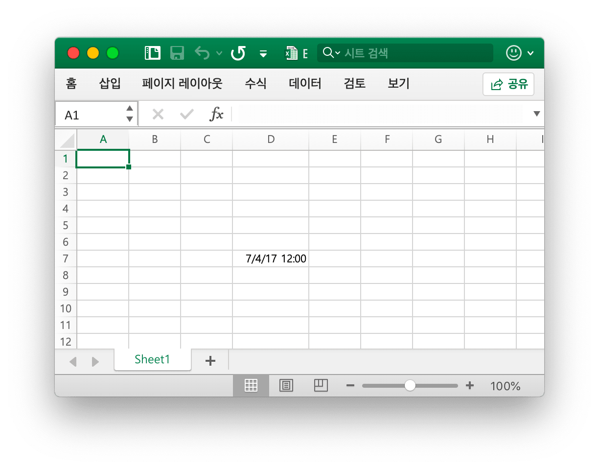
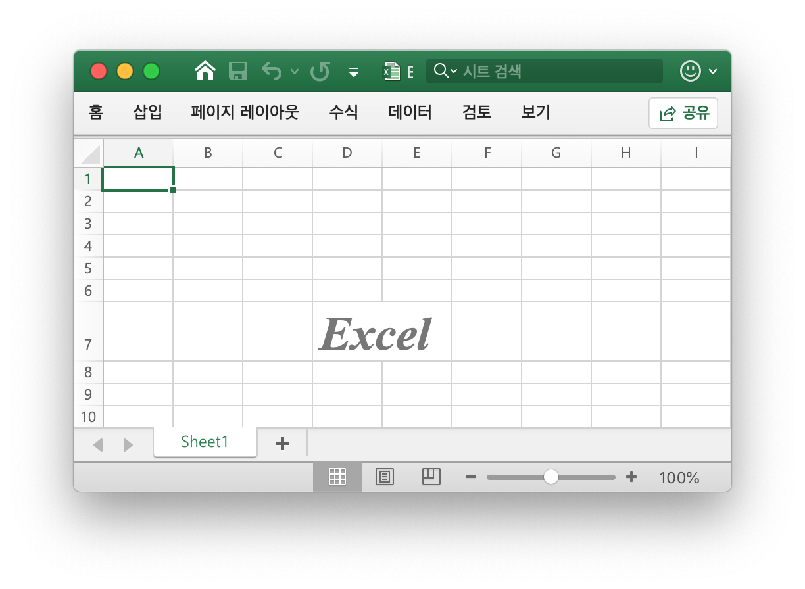
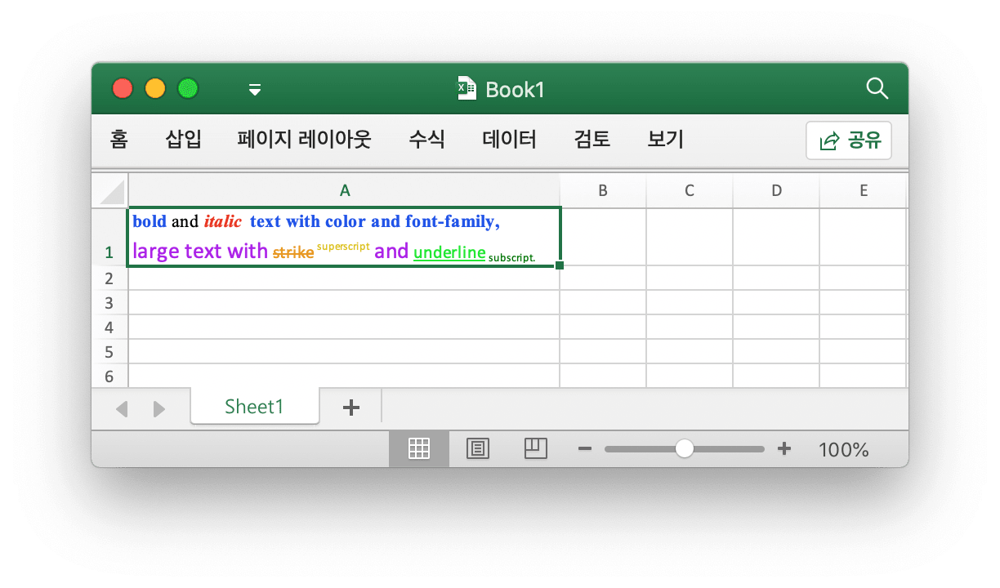
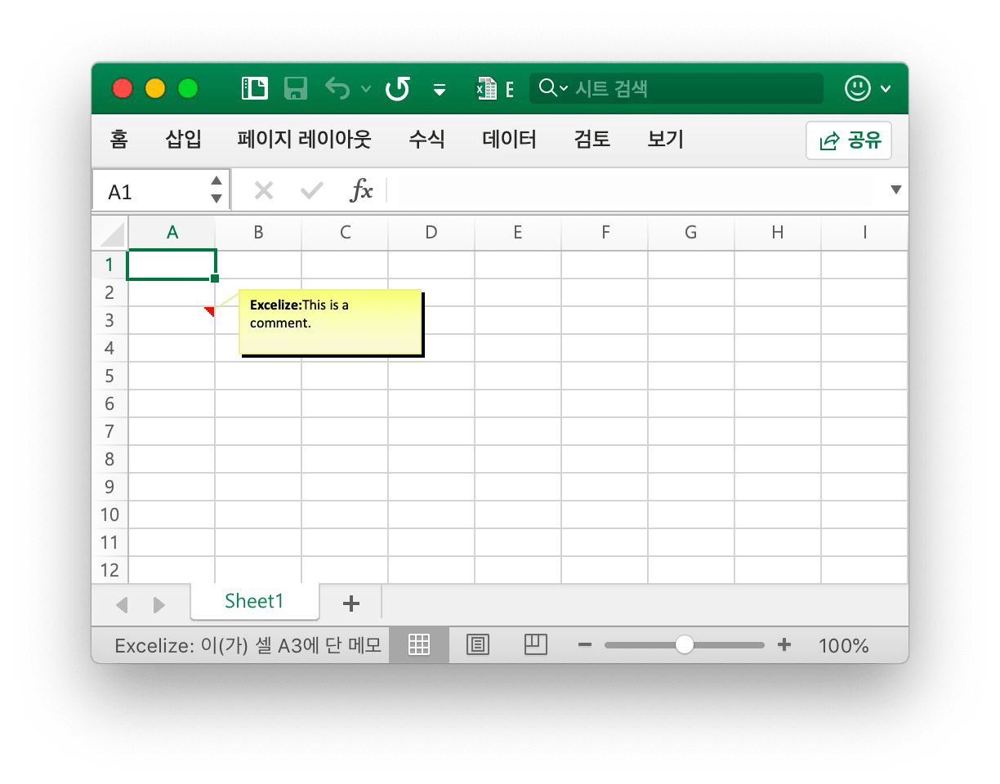

# 세포

`RichTextRun` 은 서식있는 텍스트 실행의 설정을 직접 맵핑합니다.

```go
type RichTextRun struct {
    Font *Font
    Text string
}
```

`HyperlinkOpts` 는 [`SetCellHyperlink`](cell.md#SetCellHyperlink) 에 전달되어 선택적 하이퍼 링크 속성 (예: 표시 할 텍스트 및 화면 팁 텍스트) 을 설정할 수 있습니다.

```go
type HyperlinkOpts struct {
    Display *string
    Tooltip *string
}
```

`FormulaOpts` 는 다른 수식 유형을 사용하기 위해 [`SetCellFormula`](cell.md#SetCellFormula) 로 전달할 수 있습니다.

```go
type FormulaOpts struct {
    Type *string // 수식 유형
    Ref  *string // 공유 수식 참조
}
```

## 셀 값 설정 {#SetCellValue}

```go
func (f *File) SetCellValue(sheet, cell string, value interface{}) error
```

SetCellValue 셀값을 설정하는 함수를 제공합니다. 지정된 좌표는 테이블의 첫 번째 행에 없어야합니다. 이 기능은 동시성 안전에 사용될 수 있습니다. 다음은 지원되는 데이터 형식을 보여 주며:

|지원되는 데이터 유형|
|---|
|int|
|int8|
|int16|
|int32|
|int64|
|uint|
|uint8|
|uint16|
|uint32|
|uint64|
|float32|
|float64|
|string|
|[]byte|
|time.Duration|
|time.Time|
|bool|
|nil|

기본 날짜 형식은 `time.Time` 유형 값의 `m/d/yy h:mm` 입니다. [`SetCellStyle`](cell.md#SetCellStyle) 방식으로 숫자 형식을 설정할 수 있습니다. 1900 년 1 월 0 일 또는 1900 년 2 월 29 일과 같이 Excel 에서 특수 날짜를 설정해야 하는 경우 이러한 시간은 Go 언어의 `time.Time` 데이터 형식으로 표현할 수 없습니다. 셀 값을 숫자 0 또는 60 으로 설정한 다음 셀에 대한 날짜-시간 숫자 형식 스타일을 만들고 바인딩하십시오.

## 부울 값 설정 {#SetCellBool}

```go
func (f *File) SetCellBool(sheet, cell string, value bool) error
```

SetCellBool 은 주어진 워크 시트 이름, 셀 좌표 및 셀 값에 의해 셀의 bool 형식 값을 설정하는 기능을 제공합니다.

## RAW 값 설정 {#SetCellDefault}

```go
func (f *File) SetCellDefault(sheet, cell, value string) error
```

SetCellDefault 는 셀을 이스케이프하지 않고 셀의 문자열 형식 값을 기본 형식으로 설정하는 기능을 제공합니다.

## 정수 값 설정 {#SetCellInt}

```go
func (f *File) SetCellInt(sheet, cell string, value int64) error
```

SetCellInt 는 지정된 워크 시트 이름, 셀 좌표 및 셀 값으로 셀의 `int64` 형식 값을 설정하는 기능을 제공합니다.

## 부호 없는 정수 값 설정 {#SetCellUint}

```go
func (f *File) SetCellUint(sheet, cell string, value uint64) error
```

SetCellUint 는 주어진 워크시트 이름, 셀 참조 및 셀 값을 기준으로 셀의 부호 없는 정수 데이터 유형 값을 설정하는 기능을 제공합니다.

## 부동 소수점 값 설정 {#SetCellFloat}

```go
func (f *File) SetCellFloat(sheet, cell string, value float64, precision, bitSize int) error
```

SetCellFloat 는 부동 소수점 값을 셀로 설정합니다. `precision` 매개변수는 소수점 이하 몇 자리까지 표시할지 지정하는 반면 `-1` 은 숫자를 표시하는 데 필요한 만큼의 소수점 이하 자릿수를 사용하는 특수 값입니다. `bitSize` 는 `float32` 또는 `float64` 가 원래 값에 사용되었는지 여부에 따라 `32` 또는 `64` 입니다.

## 문자열 값 설정 {#SetCellStr}

```go
func (f *File) SetCellStr(sheet, cell, value string) error
```

SetCellStr 셀의 문자열 형식 값을 설정하는 함수를 제공합니다. 셀에 `32767` 문자를 포함할 수 있는 총 문자 수입니다.

## 셀 스타일 설정 {#SetCellStyle}

```go
func (f *File) SetCellStyle(sheet, topLeftCell, bottomRightCell string, styleID int) error
```

SetCellStyle 지정된 워크 시트 이름, 좌표 영역 및 스타일 ID 에 의해 셀에 대 한 스타일 특성을 추가 하는 기능을 제공 합니다. 이 기능은 동시성 안전에 사용될 수 있습니다. 스타일 인덱스는 [`NewStyle`](style.md#NewStyle) 함수로 가져올 수 있습니다. `diagonalDown` 및 `diagonalUp` 유형 테두리는 동일한 좌표 영역에서 동일한 색상을 사용해야 합니다. SetCellStyle 은 셀의 기존 스타일을 덮어쓰며 기존 스타일에 스타일을 추가하거나 병합하지 않습니다.

- 예제 1 에서 `Sheet1` 에서 셀 `D7` 의 테두리를 만듭니다:

```go
style, err := f.NewStyle(&excelize.Style{
    Border: []excelize.Border{
        {Type: "left", Color: "0000FF", Style: 3},
        {Type: "top", Color: "00FF00", Style: 4},
        {Type: "bottom", Color: "FFFF00", Style: 5},
        {Type: "right", Color: "FF0000", Style: 6},
        {Type: "diagonalDown", Color: "A020F0", Style: 8},
        {Type: "diagonalUp", Color: "A020F0", Style: 8},
    },
})
if err != nil {
    fmt.Println(err)
}
err = f.SetCellStyle("Sheet1", "D7", "D7", style)
```

<p align="center"></p>

셀 `D7` 의 네 개의 테두리는 서로 다른 스타일과 색상으로 설정됩니다. 이는 [`NewStyle`](style.md#NewStyle) 함수를 호출할 때 매개 변수와 관련이 있습니다. 해당 장의 설명서를 참조하려면 다른 스타일을 설정해야 합니다.

- 예제 2, `Sheet1` 라는 워크 시트 `D7` 셀에 대한 그라데이션 스타일을 설정:

```go
style, err := f.NewStyle(&excelize.Style{
    Fill: excelize.Fill{Type: "gradient", Color: []string{"FFFFFF", "E0EBF5"}, Shading: 1},
})
if err != nil {
    fmt.Println(err)
}
err = f.SetCellStyle("Sheet1", "D7", "D7", style)
```

<p align="center"></p>

셀 `D7` 은 그라데이션 효과의 색상 채우기로 설정됩니다. 그라데이션 채우기 효과는 [`NewStyle`](style.md#NewStyle) 함수가 호출될 때 매개변수와 관련이 있습니다. 이 장의 설명서를 참조하려면 다른 스타일을 설정해야 합니다.

- 예제 3, `Sheet1` 이라는 이름의 `D7` 셀에 대한 솔리드 채우기를 설정합니다:

```go
style, err := f.NewStyle(&excelize.Style{
    Fill: excelize.Fill{Type: "pattern", Color: []string{"E0EBF5"}, Pattern: 1},
})
if err != nil {
    fmt.Println(err)
}
err = f.SetCellStyle("Sheet1", "D7", "D7", style)
```

<p align="center"></p>

셀 `D7` 은 솔리드 채우기로 설정됩니다.

- 예제 4, `Sheet1` 라는 이름의 `D7` 셀에 대한 문자 간격 및 회전 각도를 설정합니다:

```go
f.SetCellValue("Sheet1", "D7", "Style")
style, err := f.NewStyle(&excelize.Style{
    Alignment: &excelize.Alignment{
        Horizontal:      "center",
        Indent:          1,
        JustifyLastLine: true,
        ReadingOrder:    0,
        RelativeIndent:  1,
        ShrinkToFit:     true,
        TextRotation:    45,
        Vertical:        "",
        WrapText:        true,
    },
})
if err != nil {
    fmt.Println(err)
}
err = f.SetCellStyle("Sheet1", "D7", "D7", style)
```

<p align="center"></p>

- 예 5, Excel 의 날짜와 시간은 예를 들어 `2017/7/4 12:00:00 PM` 이라는 숫자로 `42920.5` 로 나타낼 수 있습니다. 워크시트 `D7` 셀의 시간 형식을 `Sheet1` 으로 설정합니다.

```go
f.SetCellValue("Sheet1", "D7", 42920.5)
f.SetColWidth("Sheet1", "D", "D", 13)
style, err := f.NewStyle(&excelize.Style{NumFmt: 22})
if err != nil {
    fmt.Println(err)
}
err = f.SetCellStyle("Sheet1", "D7", "D7", style)
```

<p align="center"></p>

셀 `D7` 은 시간 형식으로 설정됩니다. 시간 형식이 적용된 셀 너비가 너무 좁아서 완전히 표시되지 않으면 `####` 로 표시되며, `SetColWidth` 함수를 호출하여 열을 적절한 크기로 설정하여 일반 디스플레이로 만들 수 있습니다.

- 예제 6, `Sheet1` 이라는 워크시트 `D7` 셀의 글꼴, 글꼴 크기, 색상 및 기울이기 스타일을 설정합니다:

```go
f.SetCellValue("Sheet1", "D7", "Excel")
style, err := f.NewStyle(&excelize.Style{
    Font: &excelize.Font{
        Bold:   true,
        Italic: true,
        Family: "Times New Roman",
        Size:   36,
        Color:  "777777",
    },
})
if err != nil {
    fmt.Println(err)
}
err = f.SetCellStyle("Sheet1", "D7", "D7", style)
```

<p align="center"></p>

- 예 7, `Sheet1` 라는 워크 시트 `D7` 셀을 잠그고 숨김:

```go
style, err := f.NewStyle(&excelize.Style{
    Protection: &excelize.Protection{
        Hidden: true,
        Locked: true,
    },
})
if err != nil {
    fmt.Println(err)
}
err = f.SetCellStyle("Sheet1", "D7", "D7", style)
```

셀을 잠그거나 수식을 숨기려면 워크시트를 보호하십시오. "검토" 탭에서 "워크시트 보호"를 클릭합니다.

## 하이퍼 링크 설정 {#SetCellHyperLink}

```go
func (f *File) SetCellHyperLink(sheet, cell, link, linkType string, opts ...HyperlinkOpts) error
```

SetCellHyperLink 는 주어진 워크 시트 이름과 링크 URL 주소로 셀 하이퍼링크를 설정하는 기능을 제공합니다. LinkType 은 이 통합 문서의 셀 중 하나로 이동하기 위한 웹 사이트용 하이퍼링크 `External` 또는 `Location` 의 두 가지 유형을 정의합니다. 워크시트의 최대 제한 하이퍼링크는 `65530` 입니다. 이 함수는 셀의 하이퍼링크를 설정하는 데만 사용되며 셀의 값에는 영향을 미치지 않습니다. 셀의 값을 설정해야 하는 경우 [`SetCellStyle`](cell.md#SetCellStyle) 또는 [`SetSheetRow`](sheet.md#SetSheetRow) 와 같은 다른 기능을 사용하십시오. 다음은 외부 링크의 예입니다.

- 예제 1, `Sheet1` 이라는 워크시트의 `A3` 셀에 외부 링크를 추가합니다:

```go
display, tooltip := "https://github.com/xuri/excelize", "Excelize on GitHub"
if err := f.SetCellHyperLink("Sheet1", "A3",
    "https://github.com/xuri/excelize", "External", excelize.HyperlinkOpts{
        Display: &display,
        Tooltip: &tooltip,
    }); err != nil {
    fmt.Println(err)
}
// Set the font and underline style for the cell
style, err := f.NewStyle(&excelize.Style{
    Font: &excelize.Font{Color: "1265BE", Underline: "single"},
})
if err != nil {
    fmt.Println(err)
}
err = f.SetCellStyle("Sheet1", "A3", "A3", style)
```

- 예제 2, `Sheet1` 이라는 이름의 `A3` 셀에 내부 위치 링크를 추가합니다:

```go
err := f.SetCellHyperLink("Sheet1", "A3", "Sheet1!A40", "Location")
```

## 셀에 서식있는 텍스트 설정 {#SetCellRichText}

```go
func (f *File) SetCellRichText(sheet, cell string, runs []RichTextRun) error
```

SetCellRichText 는 주어진 워크 시트에 의해 리치 텍스트가있는 셀을 설정하는 기능을 제공합니다.

예를 들어, 이름이 `Sheet1` 인 워크 시트의 `A1` 셀에 서식있는 텍스트를 설정하십시오:

<p align="center"></p>

```go
package main

import (
    "fmt"

    "github.com/xuri/excelize/v2"
)

func main() {
    f := excelize.NewFile()
    defer func() {
        if err := f.Close(); err != nil {
            fmt.Println(err)
        }
    }()
    if err := f.SetRowHeight("Sheet1", 1, 35); err != nil {
        fmt.Println(err)
        return
    }
    if err := f.SetColWidth("Sheet1", "A", "A", 44); err != nil {
        fmt.Println(err)
        return
    }
    if err := f.SetCellRichText("Sheet1", "A1", []excelize.RichTextRun{
        {
            Text: "bold",
            Font: &excelize.Font{
                Bold:   true,
                Color:  "2354E8",
                Family: "Times New Roman",
            },
        },
        {
            Text: " and ",
            Font: &excelize.Font{
                Family: "Times New Roman",
            },
        },
        {
            Text: "italic ",
            Font: &excelize.Font{
                Bold:   true,
                Color:  "E83723",
                Italic: true,
                Family: "Times New Roman",
            },
        },
        {
            Text: "text with color and font-family,",
            Font: &excelize.Font{
                Bold:   true,
                Color:  "2354E8",
                Family: "Times New Roman",
            },
        },
        {
            Text: "\r\nlarge text with ",
            Font: &excelize.Font{
                Size:  14,
                Color: "AD23E8",
            },
        },
        {
            Text: "strike",
            Font: &excelize.Font{
                Color:  "E89923",
                Strike: true,
            },
        },
        {
            Text: " superscript",
            Font: &excelize.Font{
                Color:     "DBC21F",
                VertAlign: "superscript",
            },
        },
        {
            Text: " and ",
            Font: &excelize.Font{
                Size:      14,
                Color:     "AD23E8",
                VertAlign: "baseline",
            },
        },
        {
            Text: "underline",
            Font: &excelize.Font{
                Color:     "23E833",
                Underline: "single",
            },
        },
        {
            Text: " subscript.",
            Font: &excelize.Font{
                Color:     "017505",
                VertAlign: "subscript",
            },
        },
    }); err != nil {
        fmt.Println(err)
        return
    }
    style, err := f.NewStyle(&excelize.Style{
        Alignment: &excelize.Alignment{
            WrapText: true,
        },
    })
    if err != nil {
        fmt.Println(err)
        return
    }
    if err := f.SetCellStyle("Sheet1", "A1", "A1", style); err != nil {
        fmt.Println(err)
        return
    }
    if err := f.SaveAs("Book1.xlsx"); err != nil {
        fmt.Println(err)
    }
}
```

## 서식있는 텍스트 형식 가져 오기 {#GetCellRichText}

```go
func (f *File) GetCellRichText(sheet, cell string) ([]RichTextRun, error)
```

지정된 워크 시트 및 셀 좌표에 따라 지정된 셀의 서식있는 텍스트 형식을 가져옵니다.

## 셀 값 가져 오기 {#GetCellValue}

```go
func (f *File) GetCellValue(sheet, cell string, opts ...Options) (string, error)
```

셀의 값은 지정된 워크시트 및 셀 좌표에 따라 검색되고 반환 값은 `string` 유형으로 변환됩니다. 이 기능은 동시성 안전에 사용될 수 있습니다. 셀 형식을 셀 값에 적용할 수 있는 경우 적용된 값이 반환되고 그렇지 않으면 원래 값이 반환됩니다. 병합 범위 내의 모든 셀의 값은 동일합니다.

## 셀 유형 가져오기 {#GetCellType}

```go
func (f *File) GetCellType(sheet, cell string) (CellType, error)
```

GetCellType 은 스프레드시트 파일에서 주어진 워크시트 이름과 축으로 셀의 데이터 유형을 가져오는 기능을 제공합니다.

## 열로 모든 셀 값 가져 오기 {#GetCols}

```go
func (f *File) GetCols(sheet string, opts ...Options) ([][]string, error)
```

GetCols 는 지정된 워크시트 이름 을 기반으로 워크시트의 모든 셀 값을 가져오고, 2차원 배열로 반환되며, 여기서 셀 값은 `string` 유형으로 변환됩니다. 셀 형식을 셀 값에 적용할 수 있으면 적용된 값을 사용하고, 그렇지 않으면 원래 값을 사용합니다.

예를 들어, `Sheet1` 이라는 워크 시트에서 열을 기준으로 모든 셀의 값을 가져 오십시오.

```go
cols, err := f.GetCols("Sheet1")
if err != nil {
    fmt.Println(err)
    return
}
for _, col := range cols {
    for _, rowCell := range col {
        fmt.Print(rowCell, "\t")
    }
    fmt.Println()
}
```

## 행으로 모든 셀 값 가져 오기 {#GetRows}

```go
func (f *File) GetRows(sheet string, opts ...Options) ([][]string, error)
```

GetRows 는 시트의 모든 행을 지정된 워크시트 이름 으로 반환하고, 2 차원 배열로 반환되며, 여기서 셀 값은 `string` 유형으로 변환됩니다. 셀 형식을 셀 값에 적용할 수 있으면 적용된 값을 사용하고, 그렇지 않으면 원래 값을 사용합니다. GetRows 가 값 또는 수식 셀이 있는 행을 가져오면 각 행의 꼬리에 있는 계속해서 비어 있는 셀을 건너뛰므로 각 행의 길이가 일치하지 않을 수 있습니다.

예를 들어, `Sheet1` 이라는 워크 시트에서 모든 셀의 값을 행으로 가로지 릅니다.

```go
rows, err := f.GetRows("Sheet1")
if err != nil {
    fmt.Println(err)
    return
}
for _, row := range rows {
    for _, colCell := range row {
        fmt.Print(colCell, "\t")
    }
    fmt.Println()
}
```

## 하이퍼 링크 가져 오기 {#GetCellHyperLink}

```go
func (f *File) GetCellHyperLink(sheet, cell string) (bool, string, error)
```

지정된 워크시트 이름 및 셀 좌표를 기반으로 셀 하이퍼링크를 가져옵니다. 셀에 하이퍼링크가 있는 경우 `true` 와 링크 주소를 반환하고 그렇지 않으면 `false` 와 빈 링크 주소를 반환합니다.

예를 들어 `Sheet1` 이라는 워크시트에서 `H6` 셀에 대한 하이퍼링크를 가져옵니다.

```go
link, target, err := f.GetCellHyperLink("Sheet1", "H6")
```

## 스타일 색인 가져 오기 {#GetCellStyle}

```go
func (f *File) GetCellStyle(sheet, cell string) (int, error)
```

셀 스타일 인덱스는 지정된 워크시트 이름 및 셀 좌표에서 가져오며, 얻은 인덱스는 셀 스타일을 복사할 때 `SetCellStyle` 함수를 호출하는 매개 변수로 사용할 수 있습니다.

## 셀 병합 {#MergeCell}

```go
func (f *File) MergeCell(sheet, topLeftCell, bottomRightCell string) error
```

지정된 시트 이름 및 셀 좌표 범위를 기반으로 셀을 병합합니다. 병합 범위 내에서는 왼쪽 위 셀의 값만 유지되며 다른 셀의 값은 무시됩니다. 예를 들어 `Sheet1` 이라는 워크시트의 `D3:E9` 영역에서 셀을 병합합니다:

```go
err := f.MergeCell("Sheet1", "D3", "E9")
```

지정된 셀 좌표 영역이 다른 기존 병합셀과 겹치면 기존 병합된 셀이 삭제됩니다.

## 셀 병합 취소 {#UnmergeCell}

```go
func (f *File) UnmergeCell(sheet, topLeftCell, bottomRightCell string) error
```

UnmergeCell 은 주어진 좌표 영역을 병합 해제하는 기능을 제공합니다. 예를 들어 `Sheet1` 의 `D3:E9` 영역 병합 해제:

```go
err := f.UnmergeCell("Sheet1", "D3", "E9")
```

주의: 겹쳐진 영역도 병합되지 않습니다.

## 병합 셀 가져 오기 {#GetMergeCells}

```go
func (f *File) GetMergeCells(sheet string, withoutValues ...bool) ([]MergeCell, error)
```

특정 워크시트에서 병합된 모든 셀을 가져옵니다. `withoutValues` 매개변수를 `true` 로 설정하면 병합된 셀의 셀 값은 반환되지 않고 범위 참조만 반환됩니다. 예를 들어 `Sheet1` 의 모든 병합된 셀을 가져오려면 다음과 같이 합니다:

```go
mergeCells, err := f.GetMergeCells("Sheet1")
```

셀 값 없이 병합된 셀을 얻으려면 다음 코드를 사용하면 됩니다:

```go
mergeCells, err := f.GetMergeCells("Sheet1", true)
```

### 병합된 셀 값 가져오기

```go
func (m *MergeCell) GetCellValue() string
```

GetCellValue 는 병합된 셀 값을 반환합니다.

### 병합된 범위의 왼쪽 상단 셀 좌표 가져오기

```go
func (m *MergeCell) GetStartAxis() string
```

GetStartAxis 는 병합된 범위의 왼쪽 상단 셀 좌표를 반환합니다, 예: `C2`.

### 병합된 범위의 오른쪽 하단 셀 좌표 가져오기

```go
func (m *MergeCell) GetEndAxis() string
```

GetEndAxis 는 병합된 범위의 오른쪽 하단 셀 좌표를 반환합니다, 예: `D4`.

## 그림 셀 얻기 {#GetPictureCells}

```go
func (f *File) GetPictureCells(sheet string) ([]string, error)
```

GetPictureCells 는 특정 워크시트 이름으로 워크시트의 모든 그림 셀 참조를 반환합니다.

## 의견 추가 {#AddComment}

```go
func (f *File) AddComment(sheet string, comment Comment) error
```

AddComment 는 지정된 워크시트 인덱스, 셀 및 서식 (예: 작성자 및 텍스트) 을 사용하여 시트에 메모를 추가하는 메서드를 제공합니다. 최대 작성자 길이는 255 자이고 최대 텍스트 길이는 32512 자이며, 각 셀에는 메모를 하나만 추가할 수 있습니다. 이미 메모가 있는 셀에 메모를 추가하면 오류가 발생합니다. 예를 들어, `Sheet1!A3` 에 메모를 추가해 보겠습니다:

<p align="center"></p>

```go
err := f.AddComment("Sheet1", excelize.Comment{
    Cell:   "A3",
    Author: "Excelize",
    Paragraph: []excelize.RichTextRun{
        {Text: "Excelize: ", Font: &excelize.Font{Bold: true}},
        {Text: "This is a comment."},
    },
})
```

## 의견 가져 오기 {#GetComments}

```go
func (f *File) GetComments(sheet string) ([]Comment, error)
```

GetComments 는 지정된 워크시트 이름으로 워크시트의 모든 주석을 검색합니다.

## 댓글 삭제 {#DeleteComment}

```go
func (f *File) DeleteComment(sheet, cell string) error
```

DeleteComment 는 주어진 워크시트에 의해 시트의 주석을 삭제하는 방법을 제공합니다. 예를 들어 `Sheet1!A30` 에서 댓글을 삭제합니다:

```go
err := f.DeleteComment("Sheet1", "A30")
```

## 무시된 오류 추가 {#AddIgnoredErrors}

```go
func (f *File) AddIgnoredErrors(sheet, rangeRef string, ignoredErrorsType IgnoredErrorsType) error
```

AddIgnoredErrors 는 셀 범위에 대한 오류를 무시하는 방법을 제공합니다. 예를 들어: `Sheet1` 에서 `D15 C18:D19` 셀 범위에 대한 "텍스트로 저장된 숫자" 오류 무시:

```go
err := f.AddIgnoredErrors("Sheet1", "D15 C18:D19", excelize.IgnoredErrorsNumberStoredAsText)
```

## 셀 수식 설정 {#SetCellFormula}

```go
func (f *File) SetCellFormula(sheet, cell, formula string, opts ...FormulaOpts) error
```

SetCellFormula 는 주어진 워크시트 이름 과 셀 수식 설정에 따라 셀에 수식을 설정하는 기능을 제공합니다. 수식 셀의 결과는 Office Excel 응용 프로그램에서 워크시트를 열거나 [CalcCellValue](cell.md#CalcCellValue) 함수를 사용할 수 있을 때 계산된 셀 값을 얻을 수 있습니다. 엑셀 응용 프로그램이 통합 문서를 열었을 때 수식을 자동으로 계산하지 않으면 셀 수식 기능을 설정한 후 [UpdateLinkedValue](utils.md#UpdateLinkedValue) 를 호출하십시오.

- 예 1, `Sheet1` 의 `A3` 셀에 대해 일반 수식 `=SUM(A1,B1)` 설정:

```go
err := f.SetCellFormula("Sheet1", "A3", "SUM(A1,B1)")
```

- 예 2, `Sheet1` 의 `A3` 셀에 대해 1차원 수직 상수 배열 (열 배열) 수식 `1;2;3` 을 설정합니다:

```go
err := f.SetCellFormula("Sheet1", "A3", "{1;2;3}")
```

- 예 3, `Sheet1` 의 `A3` 셀에 대해 1차원 수평 상수 배열 (행 배열) 수식 `"a","b","c"` 를 설정합니다:

```go
err := f.SetCellFormula("Sheet1", "A3", "{\"a\",\"b\",\"c\"}")
```

- 예 4, `Sheet1` 의 `A3` 셀에 대해 2차원 상수 배열 수식 `{1,2;"a","b"}` 을 설정합니다:

```go
formulaType, ref := excelize.STCellFormulaTypeArray, "A3:A3"
err := f.SetCellFormula("Sheet1", "A3", "{1,2;\"a\",\"b\"}",
    excelize.FormulaOpts{Ref: &ref, Type: &formulaType})
```

- 예 5, `Sheet1` 의 `A3` 셀에 대해 범위 배열 수식 `A1:A2` 를 설정합니다:

```go
formulaType, ref := excelize.STCellFormulaTypeArray, "A3:A3"
err := f.SetCellFormula("Sheet1", "A3", "A1:A2",
    excelize.FormulaOpts{Ref: &ref, Type: &formulaType})
```

- 예 6, `Sheet1` 의 `C1:C5` 셀에 대해 공유 수식 `=A1+B1` 를 설정하고, `C1` 은 마스터 셀입니다:

```go
formulaType, ref := excelize.STCellFormulaTypeShared, "C1:C5"
err := f.SetCellFormula("Sheet1", "C1", "A1+B1",
    excelize.FormulaOpts{Ref: &ref, Type: &formulaType})
```

- 예 7, `Sheet1` 의 `C2` 셀에 대해 테이블 수식 `=SUM(Table1[[A]:[B]])` 를 설정합니다:

```go
package main

import (
    "fmt"

    "github.com/xuri/excelize/v2"
)

func main() {
    f := excelize.NewFile()
    defer func() {
        if err := f.Close(); err != nil {
            fmt.Println(err)
        }
    }()
    for idx, row := range [][]interface{}{{"A", "B", "C"}, {1, 2}} {
        if err := f.SetSheetRow("Sheet1", fmt.Sprintf("A%d", idx+1), &row); err != nil {
            fmt.Println(err)
            return
        }
    }
    if err := f.AddTable("Sheet1",
        &excelize.Table{
            Range:     "A1:C2",
            Name:      "Table1",
            StyleName: "TableStyleMedium2",
        }); err != nil {
        fmt.Println(err)
        return
    }
    formulaType := excelize.STCellFormulaTypeDataTable
    if err := f.SetCellFormula("Sheet1", "C2", "SUM(Table1[[A]:[B]])",
        excelize.FormulaOpts{Type: &formulaType}); err != nil {
        fmt.Println(err)
        return
    }
    if err := f.SaveAs("Book1.xlsx"); err != nil {
        fmt.Println(err)
    }
}
```

## 셀 수식 가져 오기 {#GetCellFormula}

```go
func (f *File) GetCellFormula(sheet, cell string) (string, error)
```

지정된 워크시트 이름 및 셀 좌표를 기반으로 셀에 수식을 가져옵니다.

## 셀 값 계산 {#CalcCellValue}

```go
func (f *File) CalcCellValue(sheet, cell string, opts ...Options) (string, error)
```

CalcCellValue 는 계산된 셀 값을 가져오는 함수를 제공합니다. 이 기능은 현재 처리 중입니다. 반복 계산, 암시적 교차, 명시적 교차, 배열 수식, 테이블 수식 및 일부 기타 수식은 현재 지원되지 않습니다.

지원되는 공식:

함수 이름 | 유형 및 설명
---|---
ABS                      | 숫자의 절대 값을 반환합니다
ACCRINT                  | 정기적으로 이자를 지급하는 유가 증권의 경과 이자를 반환합니다
ACCRINTM                 | 만기에 이자를 지급하는 유가 증권의 경과 이자를 반환합니다
ACOS                     | 숫자의 아크코사인을 반환합니다
ACOSH                    | 숫자의 역 하이퍼볼릭 코사인을 반환합니다
ACOT                     | 아크코탄젠트 값을 반환합니다
ACOTH                    | 하이퍼볼릭 아크코탄젠트 값을 반환합니다
AGGREGATE                | 목록 또는 데이터베이스에서 집계 값을 반환합니다
ADDRESS                  | 참조를 워크시트의 한 셀에 대한 텍스트로 반환합니다
AMORDEGRC                | 감가 상각 계수를 사용하여 매 회계 기간의 감가 상각액을 반환합니다
AMORLINC                 | 매 회계 기간에 대한 감가 상각액을 반환합니다
AND                      | 인수가 모두 TRUE 이면 TRUE 를 반환합니다
ARABIC                   | 로마 숫자를 아라비아 숫자로 변환합니다
ARRAYTOTEXT              | 지정된 범위에서 텍스트 값의 배열을 반환합니다
ASIN                     | 숫자의 아크사인을 반환합니다
ASINH                    | 숫자의 역 하이퍼볼릭 사인을 반환합니다
ATAN                     | 숫자의 아크탄젠트를 반환합니다
ATAN2                    | x, y 좌표의 아크탄젠트를 반환합니다
ATANH                    | 숫자의 역 하이퍼볼릭 탄젠트를 반환합니다
AVEDEV                   | 데이터 요소의 절대 편차의 평균을 반환합니다
AVERAGE                  | 인수의 평균을 반환합니다
AVERAGEA                 | 인수의 평균 (숫자, 텍스트, 논리값 포함) 을 반환합니다
AVERAGEIF                | 범위 내에서 주어진 조건에 맞는 모든 셀의 평균 (산술 평균) 을 반환합니다
AVERAGEIFS               | 여러 조건에 맞는 모든 셀의 평균 (산술 방식) 을 반환합니다
BAHTTEXT                 | 숫자를 태국어 텍스트로 변환하고 "Baht" 접미사를 추가합니다
BASE                     | 숫자를 지정된 기수의 텍스트 표현으로 변환합니다
BESSELI                  | 수정된 Bessel 함수 In(x) 값을 반환합니다
BESSELJ                  | Bessel 함수 Jn(x) 을 반환합니다
BESSELK                  | 수정된 Bessel 함수 Kn(x) 값을 반환합니다
BESSELY                  | Bessel 함수 Yn(x) 을 반환합니다
BETADIST                 | 누적 베타 분포 함수를 반환합니다. Excel 2007 에서 이 함수는 통계 함수입니다
BETA.DIST                | 누적 베타 분포 함수를 반환합니다
BETAINV                  | 지정된 베타 분포에 대한 역 누적 분포 함수를 반환합니다. Excel 2007 에서 이 함수는 통계 함수입니다
BETA.INV                 | 지정된 베타 분포에 대한 역 누적 분포 함수를 반환합니다
BIN2DEC                  | 2 진수를 10 진수로 변환합니다
BIN2HEX                  | 2 진수를 16 진수로 변환합니다
BIN2OCT                  | 2 진수를 8 진수로 변환합니다
BINOMDIST                | 개별항 이항 분포 확률을 반환합니다. Excel 2007 에서 이 함수는 통계 함수입니다
BINOM.DIST               | 개별항 이항 분포 확률을 반환합니다
BINOM.DIST.RANGE         | 이항 분포를 사용한 시행 결과의 확률을 반환합니다
BINOM.INV                | 누적 이항 분포가 기준치 이하가 되는 값 중 최소값을 반환합니다
BITAND                   | 두 숫자의 '비트 단위 And'를 반환합니다
BITLSHIFT                | shift_amount비트씩 왼쪽으로 이동한 값 숫자를 반환합니다
BITOR                    | 두 숫자의 비트 단위 OR을 반환합니다
BITRSHIFT                | shift_amount비트씩 오른쪽으로 이동한 값 숫자를 반환합니다
BITXOR                   | 두 숫자의 비트 단위 '배타적 Or' 를 반환합니다
CEILING                  | 가장 가까운 정수 또는 가장 가까운 significance 의 배수로 숫자를 반올림합니다
CEILING.MATH             | 가장 가까운 정수 또는 가장 가까운 significance 의 배수로 올림합니다
CEILING.PRECISE          | 가장 가까운 정수 또는 가장 가까운 significance 의 배수로 내림합니다. 숫자의 부호에 상관없이 숫자는 내림됩니다
CELL                     | 셀의 서식 지정이나 위치, 내용에 대한 정보를 반환합니다. 이 함수는 웹용 Excel 에서 사용할 수 없습니다
CHIDIST                  | 카이 제곱 분포의 단측 검정 확률을 반환합니다 Excel 2007 에서 이 함수는 통계 함수입니다
CHIINV                   | 카이 제곱 분포의 역 단측 검정 확률을 반환합니다 Excel 2007 에서 이 함수는 통계 함수입니다
CHITEST                  | 독립 검증 결과를 반환합니다 Excel 2007 에서 이 함수는 통계 함수입니다
CHISQ.DIST               | 누적 베타 확률 밀도 함수 값을 반환합니다
CHISQ.DIST.RT            | 카이 제곱 분포의 단측 검정 확률을 반환합니다
CHISQ.INV                | 누적 베타 확률 밀도 함수 값을 반환합니다
CHISQ.INV.RT             | 카이 제곱 분포의 역 단측 검정 확률을 반환합니다
CHISQ.TEST               | 독립 검증 결과를 반환합니다
CHOOSE                   | 값 목록에서 값을 선택합니다
CLEAN                    | 인쇄할 수 없는 모든 문자들을 텍스트에서 제거합니다
CODE                     | 텍스트 문자열의 첫째 문자를 나타내는 코드값을 반환합니다
COLUMN                   | 참조 영역의 열 번호를 반환합니다
COLUMNS                  | 참조 영역의 열 수를 반환합니다
COMBIN                   | 주어진 개체 수로 만들 수 있는 조합의 수를 반환합니다
COMBINA                  | 주어진 개체 수로 만들 수 있는 조합의 수 (반복 포함) 를 반환합니다
COMPLEX                  | 실수부와 허수부의 계수를 복소수로 변환합니다
CONCAT                   | 여러 범위 및/또는 문자열의 텍스트를 결합하지만 구분 기호나 IgnoreEmpty 인수는 제공하지 않습니다
CONCATENATE              | 여러 텍스트 항목을 한 텍스트 항목으로 조인시킵니다
CONFIDENCE               | 모집단 평균의 신뢰 구간을 반환합니다. Excel 2007 에서 이 함수는 통계 함수입니다
CONFIDENCE.NORM          | 모집단 평균의 신뢰 구간을 반환합니다
CONFIDENCE.T             | 스튜던트 t-분포를 사용하는 모집단 평균의 신뢰 구간을 반환합니다
CONVERT                  | 다른 단위 체계의 숫자로 변환합니다
CORREL                   | 두 데이터 집합 사이의 상관 계수를 반환합니다
COS                      | 숫자의 코사인을 반환합니다
COSH                     | 숫자의 하이퍼볼릭 코사인을 반환합니다
COT                      | 숫자의 하이퍼볼릭 코사인을 반환합니다
COTH                     | 각도의 코탄젠트 값을 반환합니다
COUNT                    | 인수 목록에서 숫자의 수를 계산합니다
COUNTA                   | 인수 목록에서 값의 수를 계산합니다
COUNTBLANK               | 범위 내에서 빈 셀의 수를 계산합니다
COUNTIF                  | 범위 내에서 주어진 조건에 맞는 셀의 수를 계산합니다
COUNTIFS                 | 범위 내에서 여러 조건에 맞는 셀의 수를 계산합니다
COUPDAYBS                | 이자 지급 기간의 시작일부터 결산일까지의 날짜 수를 반환합니다
COUPDAYS                 | 결산일이 들어 있는 이자 지급 기간의 날짜 수를 반환합니다
COUPDAYSNC               | 결산일부터 다음 이자 지급일까지의 날짜 수를 반환합니다
COUPNCD                  | 결산일 다음 첫 번째 이자 지급일을 나타내는 숫자를 반환합니다
COUPNUM                  | 결산일과 만기일 사이의 이자 지급 횟수를 반환합니다
COUPPCD                  | 결산일 바로 전 이자 지급일을 나타내는 숫자를 반환합니다
COVAR                    | 각 데이터 요소 쌍에 대한 편차의 곱의 평균 (공분산) 을 반환합니다. Excel 2007 에서 이 함수는 통계 함수입니다
COVARIANCE.P             | 각 데이터 요소 쌍에 대한 편차의 곱의 평균 (공분산) 을 반환합니다
COVARIANCE.S             | 두 데이터 집합 사이에서 각 데이터 요소 쌍에 대한 편차의 곱의 평균 (표본 집단 공분산) 을 반환합니다
CRITBINOM                | 누적 이항 분포가 기준치 이하가 되는 값 중 최소값을 반환합니다. Excel 2007 에서 이 함수는 통계 함수입니다
CSC                      | 각도의 코시컨트 값을 반환합니다
CSCH                     | 각도의 하이퍼볼릭 코시컨트 값을 반환합니다
CUMIPMT                  | 주어진 기간 중에 납입하는 대출금 이자의 누계액을 반환합니다
CUMPRINC                 | 주어진 기간 중에 납입하는 대출금 원금의 누계액을 반환합니다
DATE                     | 특정 날짜의 일련 번호를 반환합니다
DATEDIF                  | 두 날짜 사이의 일, 월 또는 연도 수를 계산합니다. 이 함수는 경과한 날짜를 계산해야 하는 수식에 유용합니다
DATEVALUE                | 텍스트 형태의 날짜를 일련 번호로 변환합니다
DAVERAGE                 | 선택한 데이터베이스 항목의 평균을 반환합니다
DAY                      | 일련 번호를 주어진 달의 날짜로 변환합니다
DAYS                     | 두 날짜 사이의 일 수를 반환합니다
DAYS360                  | 1 년을 360 일로 하여, 두 날짜 사이의 날짜 수를 계산합니다
DB                       | 정율법을 사용하여 지정한 기간 동안 자산의 감가상각을 반환합니다
DCOUNT                   | 데이터베이스에서 숫자가 있는 셀의 개수를 계산합니다
DCOUNTA                  | 데이터베이스에서 데이터가 들어 있는 셀의 개수를 계산합니다
DDB                      | 이중 체감법이나 기타 방법을 사용하여 지정된 기간의 감가 상각액을 반환합니다
DEC2BIN                  | 10 진수를 2 진수로 변환합니다
DEC2HEX                  | 10 진수를 16 진수로 변환합니다
DEC2OCT                  | 10 진수를 8 진수로 변환합니다
DECIMAL                  | 주어진 기수의 텍스트 표현을 10 진수로 변환합니다
DEGREES                  | 라디안 형태의 각도를 도 단위로 바꿉니다
DELTA                    | 두 값이 같은지 여부를 검사합니다
DEVSQ                    | 편차의 제곱의 합을 반환합니다
DGET                     | 데이터베이스에서 찾을 조건에 맞는 레코드가 하나인 경우 그 레코드를 추출합니다
DISC                     | 유가 증권의 할인율을 반환합니다
DMAX                     | 선택한 데이터베이스 항목 중에서 최대값을 반환합니다
DMIN                     | 선택한 데이터베이스 항목 중에서 최소값을 반환합니다
DOLLAR                   | 통화 형식을 사용하여 숫자를 텍스트로 변환하고, 소수 자릿수는 지정한 위치 수로 반올림됩니다
DOLLARDE                 | 분수로 표시된 금액을 소수로 표시된 금액으로 변환합니다
DOLLARFR                 | 소수로 표시된 금액을 분수로 표시된 금액으로 변환합니다
DPRODUCT                 | 데이터베이스에서 조건에 맞는 특정 레코드 필드의 값을 곱합니다
DSTDEV                   | 데이터베이스 필드 값들로부터 표본 집단의 표준 편차를 구합니다
DSTDEVP                  | 데이터베이스 필드 값들로부터 모집단의 표준 편차를 계산합니다
DSUM                     | 데이터베이스에서 조건에 맞는 레코드 필드 열 값들의 합을 구합니다
DURATION                 | 정기적으로 이자를 지급하는 유가 증권의 연간 듀레이션을 반환합니다
DVAR                     | 데이터베이스 필드 값들로부터 표본 집단의 분산을 구합니다
DVARP                    | 데이터베이스 필드 값들로부터 모집단의 분산을 계산합니다
EDATE                    | 지정한 날짜 전이나 후의 개월 수를 나타내는 날짜의 일련 번호를 반환합니다
EFFECT                   | 연간 실질 이자율을 반환합니다
ENCODEURL                | URL로 인코딩된 문자열을 반환합니다. 이 함수는 웹용 Excel 에서 사용할 수 없습니다
EOMONTH                  | 지정된 달 수 이전이나 이후 달의 마지막 날의 날짜 일련 번호를 반환합니다
ERF                      | 오차 함수를 반환합니다
ERF.PRECISE              | 오차 함수를 반환합니다
ERFC                     | ERF 함수의 여값을 반환합니다
ERFC.PRECISE             | x에서 무한대까지 적분된 ERF 함수의 여값을 반환합니다
ERROR.TYPE               | 오류 유형에 해당하는 숫자를 반환합니다
EUROCONVERT              | 숫자를 유로화로, 유로화에서 유로 회원국 통화로 또는 유로화를 매개 통화로 사용하여 숫자를 현재 유로 회원국 통화에서 다른 유로 회원국 통화로 변환 (3 각 변환) 합니다
EVEN                     | 가장 가까운 짝수로 숫자를 반올림합니다
EXACT                    | 두 텍스트 값이 동일한지 검사합니다
EXP                      | e를 주어진 수만큼 거듭제곱한 값을 반환합니다
EXPAND                   | 지정된 행 및 열 차원으로 배열을 확장하거나 채웁니다
EXPON.DIST               | 지수 분포값을 반환합니다
FACT                     | number 의 계승값을 반환합니다
FACTDOUBLE               | number 의 이중 계승값을 반환합니다
FALSE                    | 논리값 FALSE 를 반환합니다
F.DIST                   | F 확률 분포값을 반환합니다
FDIST                    | F 확률 분포값을 반환합니다. Excel 2007 에서 이 함수는 통계 함수입니다
F.DIST.RT                | F 확률 분포값을 반환합니다
FIND                     | 텍스트 값에서 다른 텍스트 값을 찾습니다 (대/소문자 구분)
FINDB                    | 텍스트 값에서 다른 텍스트 값을 찾습니다 (대/소문자 구분)
F.INV                    | F 확률 분포의 역함수를 반환합니다
F.INV.RT                 | F 확률 분포의 역함수를 반환합니다
FINV                     | F 확률 분포의 역함수를 반환합니다. Excel 2007 에서 이 함수는 통계 함수입니다
FISHER                   | Fisher 변환 값을 반환합니다
FISHERINV                | Fisher 변환의 역변환 값을 반환합니다
FIXED                    | 숫자 표시 형식을 고정 소수점을 사용하는 텍스트로 지정합니다
FLOOR                    | 0에 가까워지도록 수를 내림합니다. Excel 2007  및 Excel 2010 에서 이 함수는 수학 및 삼각법 함수입니다
FLOOR.MATH               | 가장 가까운 정수 또는 가장 가까운 significance 의 배수로 내림합니다
FLOOR.PRECISE            | 가장 가까운 정수 또는 가장 가까운 significance 의 배수로 내림합니다. 숫자의 부호에 상관없이 숫자는 내림됩니다
FORECAST                 | 선형 추세에 따라 값을 반환합니다
FORECAST.LINEAR          | 선형 추세에 따라 값을 반환합니다
FORMULATEXT              | 주어진 참조 영역에 있는 수식을 텍스트로 반환합니다
FREQUENCY                | 빈도 분포값을 세로 배열로 반환합니다
F.TEST                   | F-검정 결과를 반환합니다
FTEST                    | F-검정 결과를 반환합니다. Excel 2007 에서 이 함수는 통계 함수입니다
FV                       | 투자의 미래 가치를 반환합니다
FVSCHEDULE               | 초기 원금에 일련의 복리 이율을 적용했을 때의 예상 금액을 반환합니다
GAMMA                    | 감마 함수 값을 반환합니다
GAMMA.DIST               | 감마 분포값을 반환합니다
GAMMADIST                | 감마 분포값을 반환합니다. Excel 2007 에서 이 함수는 통계 함수입니다
GAMMA.INV                | 감마 누적 분포의 역함수 값을 반환합니다
GAMMAINV                 | 감마 누적 분포의 역함수 값을 반환합니다. Excel 2007 에서 이 함수는 통계 함수입니다
GAMMALN                  | 감마 함수 Γ(x) 의 자연 로그값을 반환합니다
GAMMALN.PRECISE          | 감마 함수 Γ(x) 의 자연 로그값을 반환합니다
GAUSS                    | 표준 정규 누적 분포값보다 0.5 작은 값을 반환합니다
GCD                      | 최대 공약수를 반환합니다
GEOMEAN                  | 기하 평균을 반환합니다
GESTEP                   | 숫자가 임계값보다 큰지 여부를 검사합니다
GROWTH                   | 지수 추세를 따라 값을 반환합니다
HARMEAN                  | 조화 평균을 반환합니다
HEX2BIN                  | 16진수를 2진수로 변환합니다
HEX2DEC                  | 16진수를 10진수로 변환합니다
HEX2OCT                  | 16진수를 8진수로 변환합니다
HLOOKUP                  | 배열의 첫 행을 찾아 표시된 셀의 값을 반환합니다
HOUR                     | 일련 번호를 시간으로 변환합니다
HYPERLINK                | 네트워크 서버, 인트라넷 또는 인터넷에 저장된 문서로 이동할 바로 가기 키를 만듭니다
HYPGEOM.DIST             | 초기하 분포값을 반환합니다
HYPGEOMDIST              | 초기하 분포값을 반환합니다. Excel 2007 에서 이 함수는 통계 함수입니다
IF                       | 수행할 논리 검사를 지정합니다
IFERROR                  | 수식이 오류이면 사용자가 지정한 값을 반환하고, 그렇지 않으면 수식 결과를 반환합니다
IFNA                     | 식이 #N/A 로 계산되면 지정한 값을 반환하고, 그렇지 않으면 식의 결과를 반환합니다
IFS                      | 하나 이상의 조건이 충족되는지 여부를 확인하고 첫 번째 TRUE 정의에 해당하는 값을 반환합니다
IMABS                    | 복소수의 절대값을 반환합니다
IMAGINARY                | 복소수의 허수부 계수를 반환합니다
IMARGUMENT               | 각도가 라디안으로 표시되는 테타 인수를 반환합니다
IMCONJUGATE              | 복소수의 켤레 복소수를 반환합니다
IMCOS                    | 복소수의 코사인을 반환합니다
IMCOSH                   | 복소수의 하이퍼볼릭 코사인 값을 반환합니다
IMCOT                    | 복소수의 코탄젠트 값을 반환합니다
IMCSC                    | 복소수의 코시컨트 값을 반환합니다
IMCSCH                   | 복소수의 하이퍼볼릭 코시컨트 값을 반환합니다
IMDIV                    | 두 복소수의 나눗셈 몫을 반환합니다
IMEXP                    | 복소수의 지수를 반환합니다
IMLN                     | 복소수의 자연 로그값을 반환합니다
IMLOG10                  | 복소수의 밑이 10 인 로그값을 반환합니다
IMLOG2                   | 복소수의 밑이 2 인 로그값을 반환합니다
IMPOWER                  | 복소수의 멱을 반환합니다
IMPRODUCT                | 복소수의 곱을 반환합니다
IMREAL                   | 복소수의 실수부 계수를 반환합니다
IMSEC                    | 복소수의 시컨트 값을 반환합니다
IMSECH                   | 복소수의 하이퍼볼릭 시컨트 값을 반환합니다
IMSIN                    | 복소수의 사인을 반환합니다
IMSINH                   | 복소수의 하이퍼볼릭 사인 값을 반환합니다
IMSQRT                   | 복소수의 제곱근을 반환합니다
IMSUB                    | 두 복소수 간의 차를 반환합니다
IMSUM                    | 복소수의 합을 반환합니다
IMTAN                    | 복소수의 탄젠트 값을 반환합니다
INDEX                    | 인덱스를 사용하여 참조 영역이나 배열의 값을 선택합니다
INDIRECT                 | 텍스트 값으로 표시된 참조를 반환합니다
INT                      | 가장 가까운 정수로 숫자를 내림합니다
INTERCEPT                | 선형 회귀선의 절편을 반환합니다
INTRATE                  | 완전 투자한 유가 증권의 이자율을 반환합니다
IPMT                     | 일정 기간 동안의 투자 금액에 대한 이자 지급액을 반환합니다
IRR                      | 일련의 현금 흐름에 대한 내부 수익률을 반환합니다
ISBLANK                  | 값이 비어 있으면 TRUE 를 반환합니다
ISERR                    | 값이 #N/A를 제외한 오류 값이면 TRUE 를 반환합니다
ISERROR                  | 값이 오류 값이면 TRUE 를 반환합니다
ISEVEN                   | 숫자가 짝수이면 TRUE 를 반환합니다
ISFORMULA                | 수식을 포함하는 셀에 대한 참조가 있으면 TRUE 를 반환합니다
ISLOGICAL                | 값이 논리값이면 TRUE 를 반환합니다
ISNA                     | 값이 #N/A 오류 값이면 TRUE 를 반환합니다
ISNONTEXT                | 값이 텍스트가 아니면 TRUE 를 반환합니다
ISNUMBER                 | 값이 숫자이면 TRUE 를 반환합니다
ISODD                    | 숫자가 홀수이면 TRUE 를 반환합니다
ISREF                    | 값이 셀 주소이면 TRUE 를 반환합니다
ISTEXT                   | 값이 텍스트이면 TRUE 를 반환합니다
ISO.CEILING              | 가장 가까운 정수 또는 significance 의 배수로 반올림한 숫자를 반환합니다
ISOWEEKNUM               | 지정된 날짜에 따른 해당 연도의 ISO 주 번호를 반환합니다
ISPMT                    | 일정 기간 동안의 투자에 대한 이자 지급액을 계산합니다
KURT                     | 데이터 집합의 첨도를 반환합니다
LARGE                    | 데이터 집합에서 k 번째로 큰 값을 반환합니다
LCM                      | 최소 공배수를 반환합니다
LEFT                     | 텍스트 값에서 맨 왼쪽의 문자를 반환합니다
LEFTB                    | 텍스트 값에서 맨 왼쪽의 문자를 반환합니다
LEN                      | 텍스트 문자열의 문자 수를 반환합니다
LENB                     | 텍스트 문자열의 문자 수를 반환합니다
LN                       | 숫자의 자연 로그를 반환합니다
LOG                      | 지정한 밑에 대한 로그를 반환합니다
LOG10                    | 밑이 10인 로그값을 반환합니다
LOGINV                   | 로그 정규 누적 분포의 역함수 값을 반환합니다
LOGNORM.DIST             | 로그 정규 누적 분포값을 반환합니다
LOGNORMDIST              | 로그 정규 누적 분포값을 반환합니다
LOGNORM.INV              | 로그 정규 누적 분포의 역함수 값을 반환합니다
LOOKUP                   | 벡터나 배열에서 값을 찾습니다
LOWER                    | 텍스트를 소문자로 변환합니다
MATCH                    | 참조 영역이나 배열에서 값을 찾습니다
MAX                      | 인수 목록에서 최대값을 반환합니다
MAXA                     | 인수 목록에서 최대값 (숫자, 텍스트, 논리값 포함) 을 반환합니다
MAXIFS                   | 주어진 조건에 맞는 셀에서 최대값을 반환합니다
MDETERM                  | 배열의 행렬 식을 반환합니다
MDURATION                | 가정된 액면가 $100 에 대한 유가 증권의 수정된 Macauley 듀레이션을 반환합니다
MEDIAN                   | 주어진 수들의 중간값을 반환합니다
MID                      | 지정된 위치에서 시작하여 특정 개수의 문자를 텍스트 문자열에서 반환합니다
MIDB                     | 지정된 위치에서 시작하여 특정 개수의 문자를 텍스트 문자열에서 반환합니다
MIN                      | 인수 목록에서 최소값을 반환합니다
MINIFS                   | 주어진 조건에 맞는 셀에서 최소값을 반환합니다
MINA                     | 인수 목록에서 최소값 (숫자, 텍스트, 논리값 포함) 을 반환합니다
MINUTE                   | 일련 번호를 분으로 변환합니다
MINVERSE                 | 배열의 역행렬을 반환합니다
MIRR                     | 다른 이율로 형성되는 양의 현금 흐름과 음의 현금 흐름에 대한 내부 수익률을 반환합니다
MMULT                    | 두 배열의 행렬 곱을 반환합니다
MOD                      | 나눗셈의 나머지를 반환합니다
MODE                     | 데이터 집합에서 가장 많이 나오는 값을 반환합니다. Excel 2007 에서 이 함수는 통계 함수입니다
MODE.MULT                | 배열이나 데이터 범위에서 가장 자주 발생하는 값의 세로 배열을 반환합니다
MODE.SNGL                | 데이터 집합에서 가장 많이 나오는 값을 반환합니다
MONTH                    | 일련 번호를 월로 변환합니다
MROUND                   | 원하는 배수로 반올림된 수를 반환합니다
MULTINOMIAL              | 각 계승값의 곱에 대한 합계의 계승값 비율을 반환합니다
MUNIT                    | 지정된 차원에 대한 단위 행렬을 반환합니다
N                        | 숫자로 변환된 값을 반환합니다
NA                       | #N/A 오류 값을 반환합니다
NEGBINOM.DIST            | 음 이항 분포값을 반환합니다
NEGBINOMDIST             | 음 이항 분포값을 반환합니다. Excel 2007 에서 이 함수는 통계 함수입니다
NETWORKDAYS              | 두 날짜 사이의 전체 작업 일수를 반환합니다
NETWORKDAYS.INTL         | 주말인 날짜와 해당 날짜 수를 나타내는 매개 변수를 사용하여 두 날짜 사이의 전체 작업일 수를 반환합니다
NOMINAL                  | 명목상의 연이율을 반환합니다
NORM.DIST                | 정규 누적 분포값을 반환합니다
NORMDIST                 | 정규 누적 분포값을 반환합니다. Excel 2007 에서 이 함수는 통계 함수입니다
NORMINV                  | 정규 누적 분포의 역함수 값을 반환합니다
NORM.INV                 | 정규 누적 분포의 역함수 값을 반환합니다 Excel 2007 에서 이 함수는 통계 함수입니다
NORM.S.DIST              | 표준 정규 누적 분포값을 반환합니다
NORMSDIST                | 표준 정규 누적 분포값을 반환합니다. Excel 2007 에서 이 함수는 통계 함수입니다
NORM.S.INV               | 표준 정규 누적 분포의 역함수 값을 반환합니다
NORMSINV                 | 표준 정규 누적 분포의 역함수 값을 반환합니다. Excel 2007 에서 이 함수는 통계 함수입니다
NOT                      | 인수의 논리 역을 반환합니다
NOW                      | 현재 날짜 및 시간의 일련 번호를 반환합니다
NPER                     | 투자의 기간을 반환합니다
NPV                      | 주기적인 현금 흐름과 할인율을 기준으로 투자의 순 현재 가치를 반환합니다
OCT2BIN                  | 8진수를 2진수로 변환합니다
OCT2DEC                  | 8진수를 10진수로 변환합니다
OCT2HEX                  | 8진수를 16진수로 변환합니다
ODD                      | 가장 가까운 홀수로 숫자를 반올림합니다
ODDFPRICE                | 첫 이수 기간이 경상 이수 기간과 다른 유가 증권의 액면가 $100 당 가격을 반환합니다
ODDFYIELD                | 첫 이수 기간이 경상 이수 기간과 다른 유가 증권의 수익률을 반환합니다
ODDLPRICE                | 마지막 이수 기간이 경상 이수 기간과 다른 유가 증권의 액면가 $100 당 가격을 반환합니다
ODDLYIELD                | 마지막 이수 기간이 경상 이수 기간과 다른 유가 증권의 수익률을 반환합니다
OR                       | 인수가 하나라도 TRUE 이면 TRUE 를 반환합니다
PDURATION                | 투자 금액이 지정된 값에 도달할 때까지 필요한 기간을 반환합니다
PEARSON                  | 피어슨 곱 모멘트 상관 계수를 반환합니다
PERCENTILE.EXC           | 이때 k 는 경계값을 제외한 0 에서 1 사이의 수입니다
PERCENTILE.INC           | 범위에서 k 번째 백분위수를 반환합니다
PERCENTILE               | 범위에서 k 번째 백분위수를 반환합니다. Excel 2007 에서 이 함수는 통계 함수입니다
PERCENTRANK.EXC          | 데이터 집합에서 경계값을 제외한 0에서 1 사이의 백분율 순위를 반환합니다
PERCENTRANK.INC          | 데이터 집합의 값에 대한 백분율 순위를 반환합니다
PERCENTRANK              | 데이터 집합의 값에 대한 백분율 순위를 반환합니다. Excel 2007 에서 이 함수는 통계 함수입니다
PERMUT                   | 주어진 개체 수로 만들 수 있는 순열의 수를 반환합니다
PERMUTATIONA             | 전체 개체에서 선택하여 주어진 개체 수 (반복 포함) 로 만들 수 있는 순열의 수를 반환합니다
PHI                      | 표준 정규 분포의 밀도 함수 값을 반환합니다
PI                       | 원주율 (파이) 값을 반환합니다
PMT                      | 연금의 정기 납입액을 반환합니다
POISSON.DIST             | 포아송 확률 분포값을 반환합니다
POISSON                  | 포아송 확률 분포값을 반환합니다. Excel 2007 에서 이 함수는 통계 함수입니다
POWER                    | 밑수를 지정한 만큼 거듭제곱한 결과를 반환합니다
PPMT                     | 일정 기간 동안의 투자에 대한 원금의 지급액을 반환합니다
PRICE                    | 정기적으로 이자를 지급하는 유가 증권의 액면가 $100 당 가격을 반환합니다
PRICEDISC                | 할인된 유가 증권의 액면가 $100 당 가격을 반환합니다
PRICEMAT                 | 만기일에 이자를 지급하는 유가 증권의 액면가 $100 당 가격을 반환합니다
PROB                     | 영역 내의 값이 두 한계값 사이에 있을 확률을 반환합니다
PRODUCT                  | 인수를 곱합니다
PROPER                   | 텍스트 값에 있는 각 단어의 첫째 문자를 대문자로 바꿉니다
PV                       | 투자의 현재 가치를 반환합니다
QUARTILE                 | 데이터 집합에서 사분위수를 반환합니다. Excel 2007 에서 이 함수는 통계 함수입니다
QUARTILE.EXC             | 데이터 집합에서 경계값을 제외한 0에서 1 사이의 사분위수를 반환합니다
QUARTILE.INC             | 데이터 집합에서 사분위수를 반환합니다
QUOTIENT                 | 나눗셈 몫의 정수 부분을 반환합니다
RADIANS                  | 도 단위로 표시된 각도를 라디안으로 변환합니다
RAND                     | 0과 1 사이의 난수를 반환합니다
RANDBETWEEN              | 지정한 두 수 사이의 난수를 반환합니다
RANK.EQ                  | 수 목록 내에서 지정한 수의 크기 순위를 반환합니다
RANK                     | 수 목록 내에서 지정한 수의 크기 순위를 반환합니다. Excel 2007 에서 이 함수는 통계 함수입니다
RATE                     | 연금의 기간별 이자율을 반환합니다
RECEIVED                 | 완전 투자 유가 증권에 대해 만기 시 수령하는 금액을 반환합니다
REPLACE                  | 텍스트 내의 문자를 바꿉니다
REPLACEB                 | 텍스트 내의 문자를 바꿉니다
REPT                     | 텍스트를 지정된 횟수만큼 반복합니다
RIGHT                    | 텍스트 값에서 맨 오른쪽의 문자를 반환합니다
RIGHTB                   | 텍스트 값에서 맨 오른쪽의 문자를 반환합니다
ROMAN                    | 아라비아 숫자를 텍스트인 로마 숫자로 변환합니다
ROUND                    | 수를 지정한 자릿수로 반올림합니다
ROUNDDOWN                | 0 에 가까워지도록 수를 내림합니다
ROUNDUP                  | 0 에서 멀어지도록 수를 올림합니다
ROW                      | 참조의 행 번호를 반환합니다
ROWS                     | 참조 영역에 있는 행 수를 반환합니다
RRI                      | 투자 수익에 해당하는 이자율을 반환합니다
RSQ                      | 피어슨 곱 모멘트 상관 계수의 제곱을 반환합니다
SEARCH                   | 지정한 텍스트 값을 다른 텍스트 값 내에서 찾습니다 (대/소문자 구분 안 함)
SEARCHB                  | 지정한 텍스트 값을 다른 텍스트 값 내에서 찾습니다 (대/소문자 구분 안 함)
SEC                      | 각도의 시컨트 값을 반환합니다
SECH                     | 각도의 하이퍼볼릭 시컨트 값을 반환합니다
SECOND                   | 일련 번호를 초로 변환합니다
SERIESSUM                | 수식에 따라 멱급수의 합을 반환합니다
SHEET                    | 참조된 시트의 시트 번호를 반환합니다
SHEETS                   | 참조 영역에 있는 시트 수를 반환합니다
SIGN                     | 수의 부호값을 반환합니다
SIN                      | 지정된 각도의 사인을 반환합니다
SINH                     | 숫자의 하이퍼볼릭 사인을 반환합니다
SKEW                     | 분포의 왜곡도를 반환합니다
SKEW.P                   | 왜곡도란 평균에 대한 분포의 비대칭 정도를 나타냅니다
SLN                      | 한 기간 동안 정액법에 의한 자산의 감가 상각액을 반환합니다
SLOPE                    | 선형 회귀선의 기울기를 반환합니다
SMALL                    | 데이터 집합에서 k번째로 작은 값을 반환합니다
SORT                     | 범위 또는 배열의 내용을 정렬합니다
SQRTPI                   | (number \* pi) 의 제곱근을 반환합니다
STANDARDIZE              | 정규화된 값을 반환합니다
STDEV                    | 표본 집단의 표준 편차를 구합니다
STDEV.P                  | 모집단의 표준 편차를 계산합니다
STDEV.S                  | 표본 집단의 표준 편차를 구합니다
STDEVA                   | 표본 집단의 표준 편차 (숫자, 텍스트, 논리값 포함) 를 구합니다
STDEVP                   | 모집단의 표준 편차를 계산합니다. Excel 2007 에서 이 함수는 통계 함수입니다
STDEVPA                  | 모집단의 표준 편차 (숫자, 텍스트, 논리값 포함) 를 계산합니다
STEYX                    | 회귀분석에 의해 예측한 y 값의 표준 오차를 각 x값에 대하여 반환합니다
SUBSTITUTE               | 텍스트 문자열에서 기존 텍스트를 새 텍스트로 바꿉니다
SUBTOTAL                 | 목록이나 데이터베이스의 부분합을 반환합니다
SUM                      | 인수의 합을 구합니다
SUMIF                    | 주어진 조건에 의해 지정된 셀들의 합을 구합니다
SUMIFS                   | 범위 내에서 여러 조건에 맞는 셀들의 합을 구합니다
SUMPRODUCT               | 배열의 대응되는 구성 요소끼리 곱해서 그 값을 반환합니다
SUMSQ                    | 인수의 제곱의 합을 반환합니다
SUMX2MY2                 | 두 배열에서 대응값의 제곱을 구한 다음 그 차이의 합을 반환합니다
SUMX2PY2                 | 두 배열에서 대응값의 제곱을 구한 다음 그 합의 합을 반환합니다
SUMXMY2                  | 두 배열에서 대응값의 차이를 구한 다음 그 제곱의 합을 반환합니다
SWITCH                   | 값의 목록에 대한 식을 계산하고 첫 번째 일치하는 값에 해당하는 결과를 반환합니다. 일치하는 항목이 없는 경우 선택적 기본값이 반환될 수 있습니다
SYD                      | 지정된 감가 상각 기간 중 자산의 감가 상각액을 연수 합계법으로 반환합니다
T                        | 인수를 텍스트로 변환합니다
TAN                      | 숫자의 탄젠트를 반환합니다
TANH                     | 숫자의 하이퍼볼릭 탄젠트를 반환합니다
TBILLEQ                  | 국채에 대해 채권에 해당하는 수익률을 반환합니다
TBILLPRICE               | 국채에 대해 액면가 $100 당 가격을 반환합니다
TBILLYIELD               | 국채의 수익률을 반환합니다
T.DIST                   | 스튜던트 t-분포의 백분율 (확률값) 을 반환합니다
T.DIST.2T                | 스튜던트 t-분포의 백분율 (확률값) 을 반환합니다
T.DIST.RT                | 스튜던트 t-분포값을 반환합니다
TDIST                    | 스튜던트 t-분포값을 반환합니다
TEXT                     | 숫자 표시 형식을 지정하고 텍스트로 변환합니다
TEXTAFTER                | 주어진 문자 또는 문자열 다음에 나오는 텍스트를 반환합니다
TEXTBEFORE               | 주어진 문자 또는 문자열 앞에 나오는 텍스트를 반환합니다
TEXTJOIN                 | 여러 범위 및/또는 문자열의 텍스트 결합
TIME                     | 특정 시간의 일련 번호를 반환합니다
TIMEVALUE                | 텍스트 형태의 시간을 일련 번호로 변환합니다
T.INV                    | 스튜던트 t-분포의 t-값을 확률과 자유도에 대한 함수로 반환합니다
T.INV.2T                 | 스튜던트 t-분포의 역함수 값을 반환합니다
TINV                     | 학생 t-분포의 역함수 값을 반환합니다
TODAY                    | 오늘 날짜의 일련 번호를 반환합니다
TRANSPOSE                | 배열의 행과 열을 바꿉니다
TREND                    | 선형 추세에 따라 값을 반환합니다
TRIM                     | 텍스트에서 공백을 제거합니다
TRIMMEAN                 | 데이터 집합의 양 끝값을 제외하고 평균을 구합니다
TRUE                     | 논리값 TRUE 를 반환합니다
TRUNC                    | 수의 소수점 이하를 버립니다
T.TEST                   | 스튜던트 t-검정에 근거한 확률을 반환합니다
TTEST                    | 스튜던트 t-검정에 근거한 확률을 반환합니다. Excel 2007 에서 이 함수는 통계 함수입니다
TYPE                     | 값의 데이터 형식을 나타내는 숫자를 반환합니다
UNICHAR                  | 주어진 숫자 값이 참조하는 유니코드 문자를 반환합니다
UNICODE                  | 텍스트의 첫 문자에 해당하는 숫자 (코드 포인트) 를 반환합니다
UNIQUE                   | 목록 또는 범위에서 고유 값의 목록을 반환합니다
UPPER                    | 텍스트를 대문자로 변환합니다
VALUETOTEXT              | 지정된 값의 텍스트를 반환합니다
VAR                      | 표본 집단의 분산을 구합니다. Excel 2007 에서 이 함수는 통계 함수입니다
VAR.P                    | 모집단의 분산을 계산합니다
VAR.S                    | 표본 집단의 분산을 구합니다
VARA                     | 표본 집합의 분산 (숫자, 텍스트, 논리값 포함) 을 구합니다
VARP                     | 모집단의 분산을 계산합니다. Excel 2007 에서 이 함수는 통계 함수입니다
VARPA                    | 모집단의 분산 (숫자, 텍스트, 논리값 포함) 을 계산합니다
VDB                      | 일정 또는 일부 기간 동안 체감법으로 자산의 감가 상각액을 반환합니다
VLOOKUP                  | 배열의 첫째 열을 찾아 행 쪽으로 이동하여 셀 값을 반환합니다
WEEKDAY                  | 일련 번호를 요일로 변환합니다
WEEKNUM                  | 일련 번호를 해당 주가 일 년 중 몇 번째 주인지 나타내는 숫자로 변환합니다
WEIBULL                  | 모집단의 분산 (숫자, 텍스트, 논리값 포함) 을 계산합니다. Excel 2007 에서 이 함수는 통계 함수입니다
WEIBULL.DIST             | 와이블 분포값을 반환합니다
WORKDAY                  | 특정 일 (시작 날짜) 의 전이나 후의 날짜 수에서 주말이나 휴일을 제외한 날짜 수, 즉 평일 수를 반환합니다
WORKDAY.INTL             | 주말인 날짜와 해당 날짜 수를 나타내는 매개 변수를 사용하여 지정된 작업 일수 이전 또는 이후 날짜의 일련 번호를 반환합니다
XIRR                     | 비정기적일 수도 있는 현금 흐름의 내부 회수율을 반환합니다
XLOOKUP                  | 범위 또는 배열을 검색하고 검색된 첫 번째 일치 항목에 해당하는 항목을 반환합니다. 일치 항목이 없는 경우 XLOOKUP 함수는 가장 가까운 (대략적인) 일치 항목을 반환할 수 있습니다
XNPV                     | 비정기적일 수도 있는 현금 흐름의 순 현재 가치를 반환합니다
XOR                      | 모든 인수의 논리 배타적 OR을 반환합니다
YEAR                     | 일련 번호를 연도로 변환합니다
YEARFRAC                 | start_date 와 end_date 사이의 날짜 수가 일 년 중 차지하는 비율을 반환합니다
YIELD                    | 정기적으로 이자를 지급하는 유가 증권의 수익률을 반환합니다
YIELDDISC                | 국채와 같이 할인된 유가 증권의 연 수익률을 반환합니다
YIELDMAT                 | 만기 시 이자를 지급하는 유가 증권의 연 수익률을 반환합니다
Z.TEST                   | z-test 의 편측 확률값을 추출합니다
ZTEST                    | z-test 의 편측 확률값을 추출합니다. Excel 2007 에서 이 함수는 통계 함수입니다
