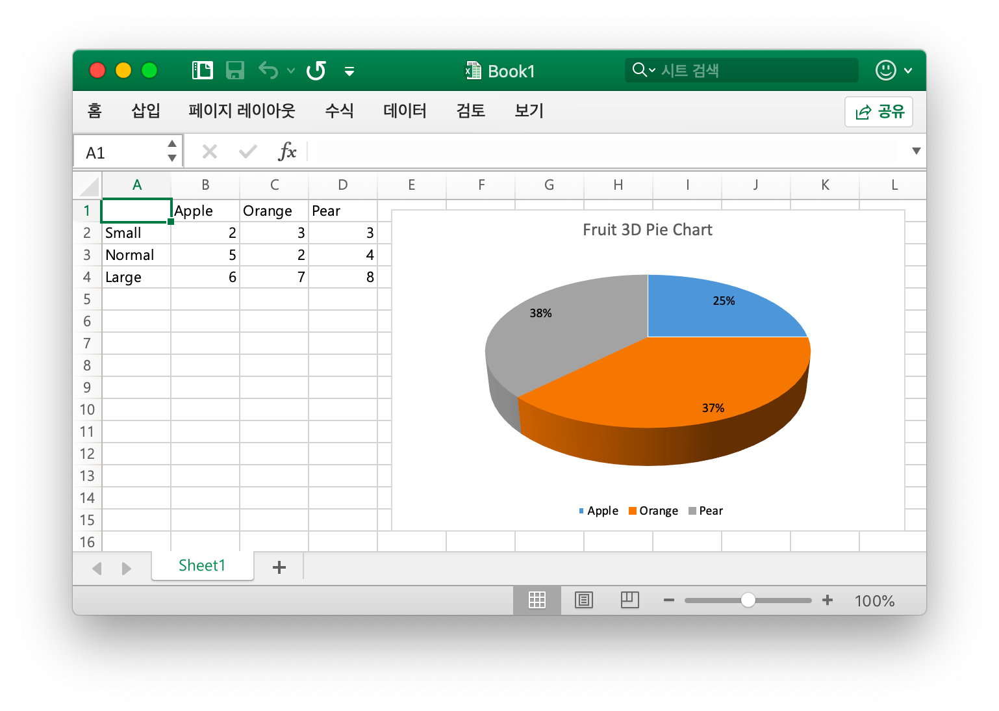

# 3D 원형 차트 {#pie3D}

예를 들어 다음과 같은 3D 원형 차트 를 추가합니다:

<p align="center"></p>

```go
package main

import (
    "fmt"

    "github.com/xuri/excelize/v2"
)

func main() {
    f := excelize.NewFile()
    defer func() {
        if err := f.Close(); err != nil {
            fmt.Println(err)
        }
    }()
    for idx, row := range [][]interface{}{
        {"사과", "오렌지", "배"},
        {2, 3, 3},
    } {
        cell, err := excelize.CoordinatesToCellName(1, idx+1)
        if err != nil {
            fmt.Println(err)
            return
        }
        if err := f.SetSheetRow("Sheet1", cell, &row); err != nil {
            fmt.Println(err)
            return
        }
    }
    if err := f.AddChart("Sheet1", "E1", &excelize.Chart{
        Type: excelize.Pie3D,
        Series: []excelize.ChartSeries{
            {
                Name:       "양",
                Categories: "Sheet1!$A$1:$C$1",
                Values:     "Sheet1!$A$2:$C$2",
            },
        },
        Format: excelize.GraphicOptions{
            OffsetX: 15,
            OffsetY: 10,
        },
        Title: excelize.ChartTitle{
            Name: "3D 원형 차트",
        },
        PlotArea: excelize.ChartPlotArea{
            ShowPercent: true,
        },
    }); err != nil {
        fmt.Println(err)
        return
    }
    // 통합 문서 저장
    if err := f.SaveAs("통합 문서1.xlsx"); err != nil {
        fmt.Println(err)
    }
}
```
