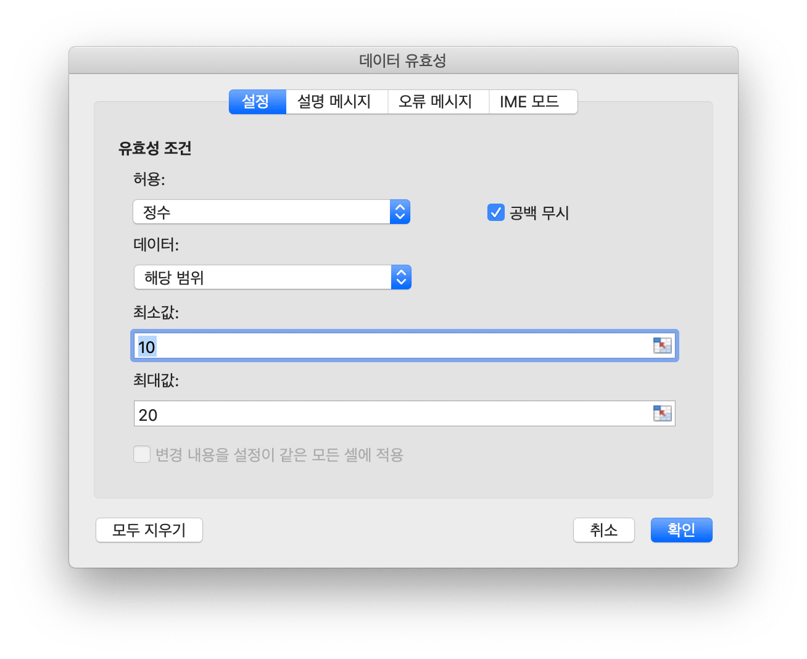
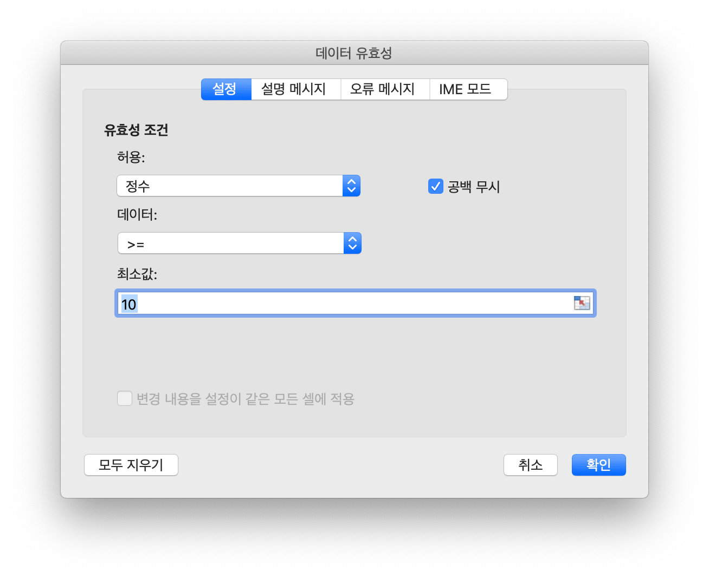
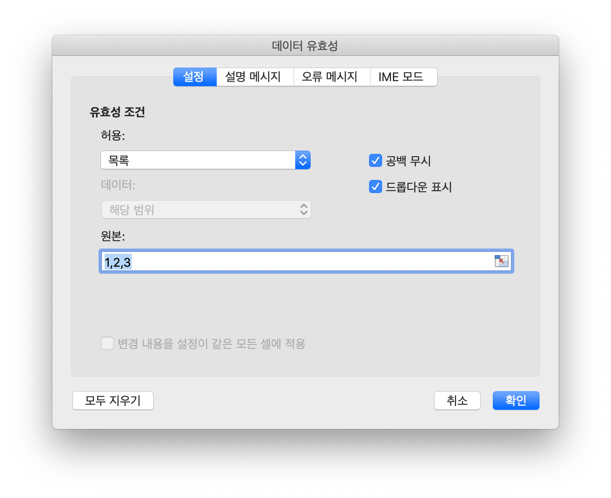
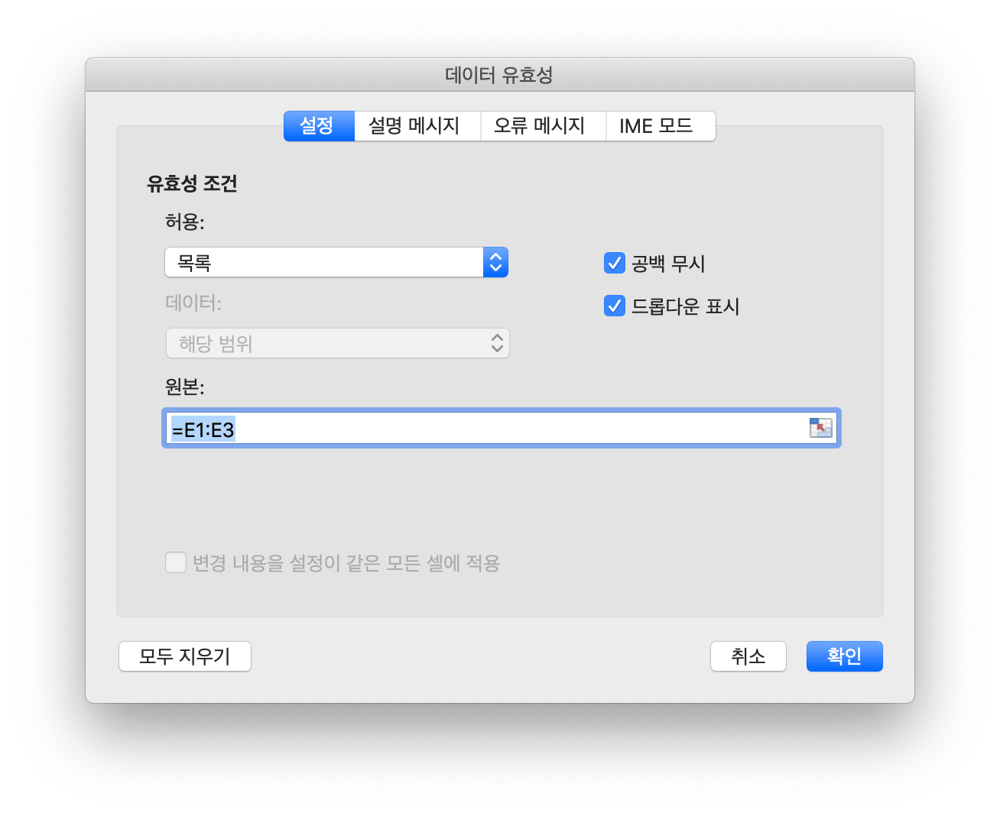

# 데이터

## 데이터 유효성 검사 {#AddDataValidation}

```go
func (f *File) AddDataValidation(sheet string, dv *DataValidation)
```

AddDataValidation는 주어진 데이터 유효성 검사 개체 및 워크 시트 이름으로 워크 시트 범위에 대한 집합 데이터 유효성 검사를 제공합니다. 데이터 유효성 검사 개체는 `NewDataValidation` 함수로 만들 수 있습니다. 데이터 유효성 검사 유형 및 연산자는 [상수](constants.md) 섹션에서 찾을 수 있습니다.

예제 1, 유효성 검사 조건 설정으로 `Sheet1!A1:B2` 에 대한 데이터 유효성 검사를 설정하고, 잘못된 데이터가 "Stop" 스타일 및 사용자 지정 제목 "error body" 로 입력된 후 오류 경고를 표시합니다:

<p align="center"></p>

```go
dvRange := excelize.NewDataValidation(true)
dvRange.Sqref = "A1:B2"
dvRange.SetRange(10, 20, excelize.DataValidationTypeWhole, excelize.DataValidationOperatorBetween)
dvRange.SetError(excelize.DataValidationErrorStyleStop, "error title", "error body")
f.AddDataValidation("Sheet1", dvRange)
```

예제 2, 에서는 유효성 검사 조건 설정을 사용하여 `Sheet1!A3:B4` 에 대한 데이터 유효성 검사를 설정하고 셀을 선택할 때 입력 메시지를 표시합니다:

<p align="center"></p>

```go
dvRange = excelize.NewDataValidation(true)
dvRange.Sqref = "A3:B4"
dvRange.SetRange(10, 20, excelize.DataValidationTypeWhole, excelize.DataValidationOperatorGreaterThan)
dvRange.SetInput("input title", "input body")
f.AddDataValidation("Sheet1", dvRange)
```

예제 3, 유효성 검사 기준 설정을 사용 하 여 `Sheet1!A5:B6` 에 데이터 유효성 검사를 설정, 목록 소스를 허용 하 여 셀 내 드롭다운을 만듭니다:

<p align="center"></p>

```go
dvRange = excelize.NewDataValidation(true)
dvRange.Sqref = "A5:B6"
dvRange.SetDropList([]string{"1", "2", "3"})
f.AddDataValidation("Sheet1", dvRange)
```

예제 4, 유효성 검사 기준 소스 `Sheet1!E1:E3` 설정으로 `Sheet1!A7:B8` 에 대한 데이터 유효성 검사를 설정하고 목록 소스를 허용하여 셀 내 드롭다운을 만듭니다:

<p align="center"></p>

```go
dvRange := excelize.NewDataValidation(true)
dvRange.Sqref = "A7:B8"
dvRange.SetSqrefDropList("$E$1:$E$3", true)
f.AddDataValidation("Sheet1", dvRange)
```
