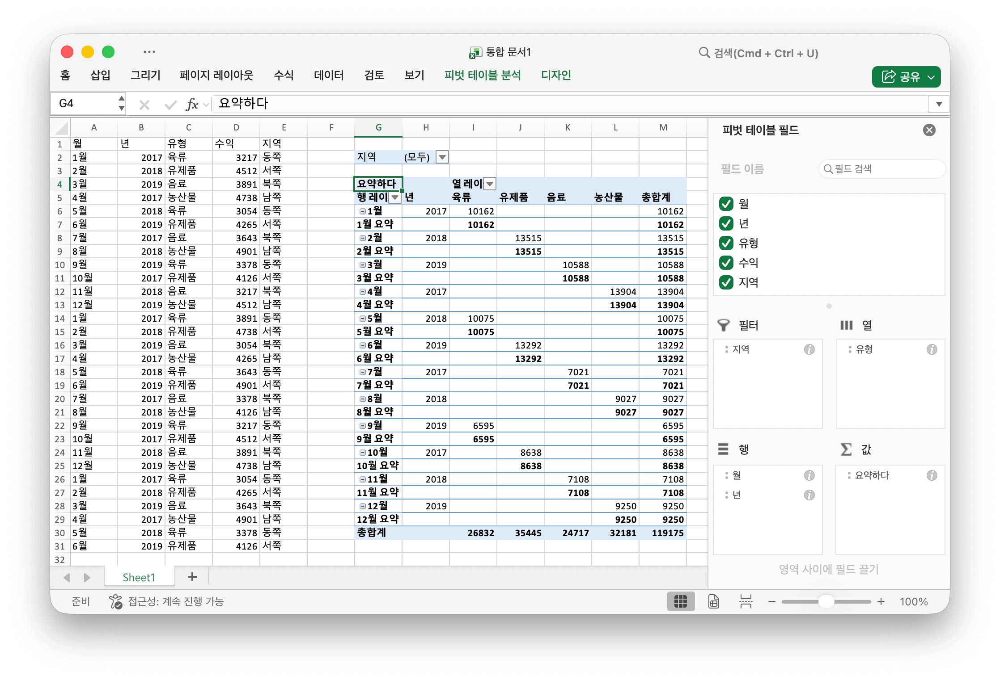

# 피벗 테이블 {#PivotTable}

피벗 테이블은보다 광범위한 테이블의 데이터 (예 : 데이터베이스, 스프레드 시트 또는 비즈니스 인텔리전스 프로그램)를 요약하는 통계 테이블입니다. 이 요약에는 피벗 테이블이 의미있는 방식으로 그룹화되는 합계, 평균 또는 기타 통계가 포함될 수 있습니다.

PivotTableOption 은 피벗 테이블의 형식 설정을 직접 매핑합니다.

```go
type PivotTableOption struct {
    DataRange           string
    PivotTableRange     string
    Rows                []PivotTableField
    Columns             []PivotTableField
    Data                []PivotTableField
    Filter              []PivotTableField
    RowGrandTotals      bool
    ColGrandTotals      bool
    ShowDrill           bool
    UseAutoFormatting   bool
    PageOverThenDown    bool
    MergeItem           bool
    CompactData         bool
    ShowRowHeaders      bool
    ShowColHeaders      bool
    ShowRowStripes      bool
    ShowColStripes      bool
    ShowLastColumn      bool
    PivotTableStyleName string
}
```

PivotTableField 는 피벗 테이블의 필드 설정을 직접 매핑합니다.

```go
type PivotTableField struct {
    Data            string
    Name            string
    Subtotal        string
    DefaultSubtotal bool
}
```

Subtotal 은이 데이터 필드에 적용되는 집계 함수를 지정합니다. 기본값은 `Sum` 입니다. 이 속성에 가능한 값은 다음과 같습니다.

|선택적 값|
|---|
|Average|
|Count|
|CountNums|
|Max|
|Min|
|Product|
|StdDev|
|StdDevp|
|Sum|
|Var|
|Varp|

Name 은 데이터 필드의 이름을 지정합니다. 데이터 필드 이름에 최대 `255` 자를 사용할 수 있으며 초과 문자는 잘립니다.

## 피벗 테이블 만들기 {#AddPivotTable}

```go
func (f *File) AddPivotTable(opt *PivotTableOption) error
```

AddPivotTable 은 지정된 피벗 테이블 옵션으로 피벗 테이블을 추가하는 방법을 제공합니다.

예를 들어, `Sheet1!$G$2:$M$34` 영역에 데이터 소스가 `Sheet1!$A$1:$E$31` 인 피벗 테이블을 작성하십시오.

<p align="center"></p>

```go
package main

import (
    "fmt"
    "math/rand"

    "github.com/360EntSecGroup-Skylar/excelize"
)

func main() {
    f := excelize.NewFile()
    // 시트에 일부 데이터 생성
    month := []string{"Jan", "Feb", "Mar", "Apr", "May",
        "Jun", "Jul", "Aug", "Sep", "Oct", "Nov", "Dec"}
    year := []int{2017, 2018, 2019}
    types := []string{"Meat", "Dairy", "Beverages", "Produce"}
    region := []string{"East", "West", "North", "South"}
    f.SetSheetRow("Sheet1", "A1", &[]string{"Month", "Year", "Type", "Sales", "Region"})
    for i := 0; i < 30; i++ {
        f.SetCellValue("Sheet1", fmt.Sprintf("A%d", i+2), month[rand.Intn(12)])
        f.SetCellValue("Sheet1", fmt.Sprintf("B%d", i+2), year[rand.Intn(3)])
        f.SetCellValue("Sheet1", fmt.Sprintf("C%d", i+2), types[rand.Intn(4)])
        f.SetCellValue("Sheet1", fmt.Sprintf("D%d", i+2), rand.Intn(5000))
        f.SetCellValue("Sheet1", fmt.Sprintf("E%d", i+2), region[rand.Intn(4)])
    }
    if err := f.AddPivotTable(&excelize.PivotTableOption{
        DataRange:       "Sheet1!$A$1:$E$31",
        PivotTableRange: "Sheet1!$G$2:$M$34",
        Rows: []excelize.PivotTableField{
            {Data: "Month", DefaultSubtotal: true}, {Data: "Year"}},
        Filter: []excelize.PivotTableField{
            {Data: "Region"}},
        Columns: []excelize.PivotTableField{
            {Data: "Type", DefaultSubtotal: true}},
        Data: []excelize.PivotTableField{
            {Data: "Sales", Name: "Summarize", Subtotal: "Sum"}},
        RowGrandTotals: true,
        ColGrandTotals: true,
        ShowDrill:      true,
        ShowRowHeaders: true,
        ShowColHeaders: true,
        ShowLastColumn: true,
    }); err != nil {
        fmt.Println(err)
    }
    if err := f.SaveAs("Book1.xlsx"); err != nil {
        fmt.Println(err)
    }
}
```
