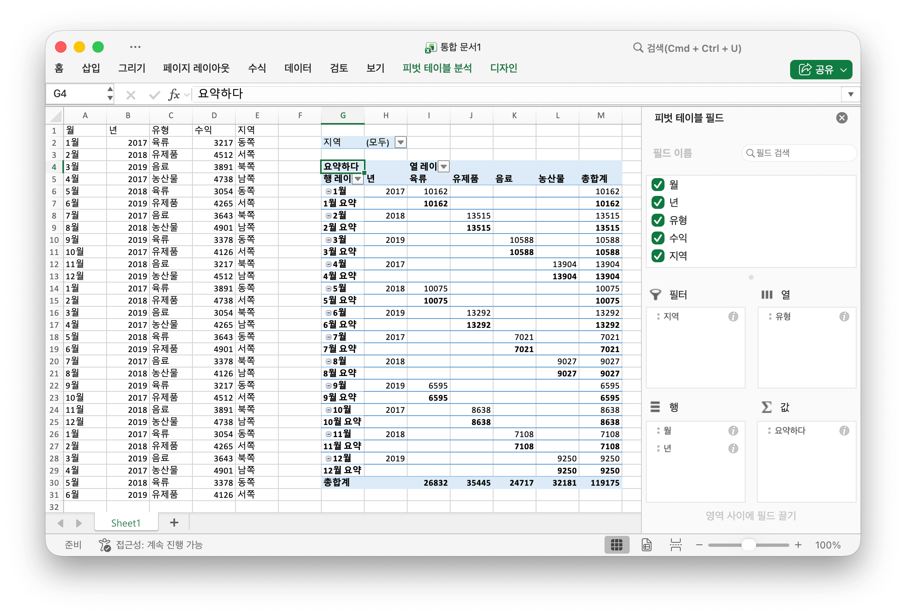

# 피벗 테이블 {#PivotTable}

피벗 테이블은보다 광범위한 테이블의 데이터 (예 : 데이터베이스, 스프레드 시트 또는 비즈니스 인텔리전스 프로그램)를 요약하는 통계 테이블입니다. 이 요약에는 피벗 테이블이 의미있는 방식으로 그룹화되는 합계, 평균 또는 기타 통계가 포함될 수 있습니다.

`PivotTableOptions` 은 피벗 테이블의 형식 설정을 직접 매핑합니다.

```go
type PivotTableOptions struct {
    DataRange           string
    PivotTableRange     string
    Name                string
    Rows                []PivotTableField
    Columns             []PivotTableField
    Data                []PivotTableField
    Filter              []PivotTableField
    RowGrandTotals      bool
    ColGrandTotals      bool
    ShowDrill           bool
    UseAutoFormatting   bool
    PageOverThenDown    bool
    MergeItem           bool
    ClassicLayout       bool
    CompactData         bool
    ShowError           bool
    ShowRowHeaders      bool
    ShowColHeaders      bool
    ShowRowStripes      bool
    ShowColStripes      bool
    ShowLastColumn      bool
    FieldPrintTitles    bool
    ItemPrintTitles     bool
    PivotTableStyleName string
    // 필터링되거나 내 보내지 않은 필드를 포함합니다
}
```

`PivotTableStyleName` 내장 피벗 테이블 스타일 이름:

```text
PivotStyleLight1 - PivotStyleLight28
PivotStyleMedium1 - PivotStyleMedium28
PivotStyleDark1 - PivotStyleDark28
```

`PivotTableField` 는 피벗 테이블의 필드 설정을 직접 매핑합니다.

```go
type PivotTableField struct {
    Compact         bool
    Data            string
    Name            string
    Outline         bool
    ShowAll         bool
    InsertBlankRow  bool
    Subtotal        string
    DefaultSubtotal bool
    NumFmt          int
    SelectedItems   []string
}
```

`Subtotal` 은이 데이터 필드에 적용되는 집계 함수를 지정합니다. 기본값은 `Sum` 입니다. 이 속성에 가능한 값은 다음과 같습니다.

|선택적 값|
|---|
|Average|
|Count|
|CountNums|
|Max|
|Min|
|Product|
|StdDev|
|StdDevp|
|Sum|
|Var|
|Varp|

`Name` 은 데이터 필드의 이름을 지정합니다. 데이터 필드 이름에 최대 `255` 자를 사용할 수 있으며 초과 문자는 잘립니다.

`SelectedItems` 는 피벗 테이블 필드에서 기본적으로 선택되는 항목을 지정합니다. 선택되는 항목은 해당 필드에서 참조하는 셀 범위 내의 값이어야 합니다.

## 피벗 테이블 만들기 {#AddPivotTable}

```go
func (f *File) AddPivotTable(opts *PivotTableOptions) error
```

AddPivotTable 은 지정된 피벗 테이블 옵션으로 피벗 테이블을 추가하는 방법을 제공합니다.

예를 들어, `Sheet1!G4:M30` 영역에 데이터 소스가 `Sheet1!A1:E31` 인 피벗 테이블을 작성하십시오.

<p align="center"></p>

```go
package main

import (
    "fmt"

    "github.com/xuri/excelize/v2"
)

func main() {
    f := excelize.NewFile()
    defer func() {
        if err := f.Close(); err != nil {
            fmt.Println(err)
        }
    }()
    // 시트에 일부 데이터 생성
    month := []string{"1월", "2월", "3월", "4월", "5월", "6월",
        "7월", "8월", "9월", "10월", "11월", "12월"}
    year := []int{2017, 2018, 2019}
    types := []string{"육류", "유제품", "음료", "농산물"}
    revenue := []int{3217, 4512, 3891, 4738, 3054, 4265, 3643, 4901, 3378, 4126}
    region := []string{"동쪽", "서쪽", "북쪽", "남쪽"}
    if err := f.SetSheetRow(
        "Sheet1", "A1", &[]string{"월", "년", "유형", "수익", "지역"},
    ); err != nil {
        fmt.Println(err)
        return
    }
    for row := 2; row < 32; row++ {
        f.SetCellValue("Sheet1", fmt.Sprintf("A%d", row), month[(row-2)%len(month)])
        f.SetCellValue("Sheet1", fmt.Sprintf("B%d", row), year[(row-2)%len(year)])
        f.SetCellValue("Sheet1", fmt.Sprintf("C%d", row), types[(row-2)%len(types)])
        f.SetCellValue("Sheet1", fmt.Sprintf("D%d", row), revenue[(row-2)%len(revenue)])
        f.SetCellValue("Sheet1", fmt.Sprintf("E%d", row), region[(row-2)%len(region)])
    }
    if err := f.AddPivotTable(&excelize.PivotTableOptions{
        DataRange:       "Sheet1!A1:E31",
        PivotTableRange: "Sheet1!G4:M30",
        Rows: []excelize.PivotTableField{
            {Data: "월", DefaultSubtotal: true}, {Data: "년"},
        },
        Filter: []excelize.PivotTableField{
            {Data: "지역"},
        },
        Columns: []excelize.PivotTableField{
            {Data: "유형", DefaultSubtotal: true},
        },
        Data: []excelize.PivotTableField{
            {Data: "수익", Name: "요약하다", Subtotal: "Sum"},
        },
        RowGrandTotals: true,
        ColGrandTotals: true,
        ShowDrill:      true,
        ShowRowHeaders: true,
        ShowColHeaders: true,
        ShowLastColumn: true,
    }); err != nil {
        fmt.Println(err)
        return
    }
    if err := f.SaveAs("통합 문서1.xlsx"); err != nil {
        fmt.Println(err)
    }
}
```

## 피벗 테이블 가져오기 {#GetPivotTables}

```go
func (f *File) GetPivotTables(sheet string) ([]PivotTableOptions, error)
```

GetPivotTables 는 지정된 워크시트 이름으로 워크시트의 모든 피벗 테이블 정의를 반환합니다.

## 피벗 테이블 삭제 {#DeletePivotTable}

```go
func (f *File) DeletePivotTable(sheet, name string) error
```

DeletePivotTable 는 워크시트 이름과 피벗 테이블 이름을 제공하여 피벗 테이블을 삭제합니다. 이 함수는 피벗 테이블 범위의 셀 값을 정리하지 않습니다.
