# 도형

## 셰이프 추가

```go
func (f *File) AddShape(sheet, cell, opts string) error
```

AddShape는 지정된 워크시트 인덱스, 모양 형식 집합(예: 간격띄우기, 축척, 종횡비 설정 및 인쇄 설정) 및 속성 집합을 사용하여 시트에 셰이프를 추가하는 방법을 제공합니다. 예를 들어 `Sheet1` 에 텍스트 상자 (직사각형 모양) 를 추가합니다:

```go
err := f.AddShape("Sheet1", "G6", `{
    "type": "rect",
    "color":
    {
        "line": "#4286F4",
        "fill": "#8eb9ff"
    },
    "paragraph": [
    {
        "text": "Rectangle Shape",
        "font":
        {
            "bold": true,
            "italic": true,
            "family": "Times New Roman",
            "size": 36,
            "color": "#777777",
            "underline": "sng"
        }
    }],
    "width": 180,
    "height": 90,
    "line":
    {
        "width": 1.5
    }
}`)
```

다음은 excelize 에서 지원하는 셰이프 유형을 보여 주며 다음과 같은 것입니다:

유형|모양|스타일
---|---|---
accentBorderCallout1 | Callout 1 with Border and Accent Shape | <p style="text-align: center;">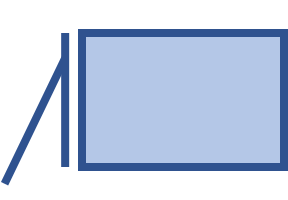</p>
accentBorderCallout2 | Callout 2 with Border and Accent Shape | <p style="text-align: center;">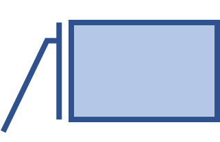</p>
accentBorderCallout3 | Callout 3 with Border and Accent Shape | <p style="text-align: center;">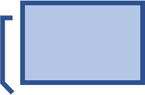</p>
accentCallout1 | Callout 1 Shape | <p style="text-align: center;">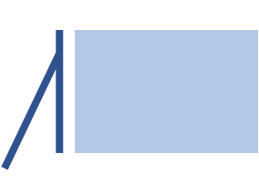</p>
accentCallout2 | Callout 2 Shape | <p style="text-align: center;">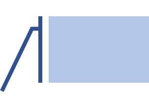</p>
accentCallout3 | Callout 3 Shape | <p style="text-align: center;">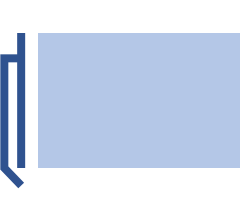</p>
actionButtonBackPrevious | Back or Previous Button Shape | <p style="text-align: center;">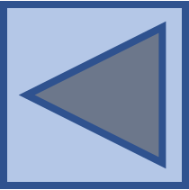</p>
actionButtonBeginning | Beginning Button Shape | <p style="text-align: center;">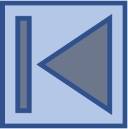</p>
actionButtonBlank | Blank Button Shape | <p style="text-align: center;"></p>
actionButtonDocument | Document Button Shape | <p style="text-align: center;"></p>
actionButtonEnd | End Button Shape | <p style="text-align: center;">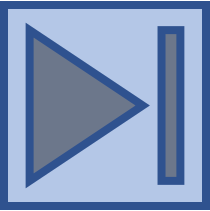</p>
actionButtonForwardNext | Forward or Next Button Shape | <p style="text-align: center;">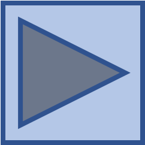</p>
actionButtonHelp | Help Button Shape | <p style="text-align: center;"></p>
actionButtonHome | Home Button Shape | <p style="text-align: center;">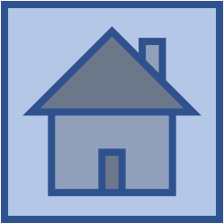</p>
actionButtonInformation | Information Button Shape | <p style="text-align: center;"></p>
actionButtonMovie | Movie Button Shape | <p style="text-align: center;">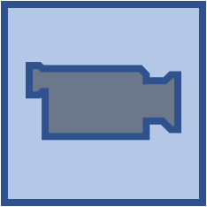</p>
actionButtonReturn | Return Button Shape | <p style="text-align: center;"></p>
actionButtonSound | Sound Button Shape | <p style="text-align: center;"></p>
arc | Curved Arc Shape | <p style="text-align: center;">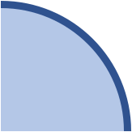</p>
bentArrow | Bent Arrow Shape | <p style="text-align: center;">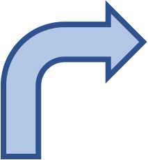</p>
bentConnector2 | Bent Connector 2 Shape | <p style="text-align: center;"></p>
bentConnector3 | Bent Connector 3 Shape | <p style="text-align: center;">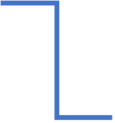</p>
bentConnector4 | Bent Connector 4 Shape | <p style="text-align: center;">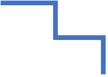</p>
bentConnector5 | Bent Connector 5 Shape | <p style="text-align: center;">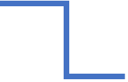</p>
bentUpArrow | Bent Up Arrow Shape | <p style="text-align: center;">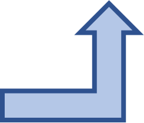</p>
bevel | Bevel Shape | <p style="text-align: center;">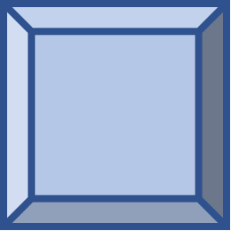</p>
blockArc | Block Arc Shape | <p style="text-align: center;"></p>
borderCallout1 | Callout 1 with Border Shape | <p style="text-align: center;">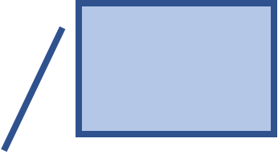</p>
borderCallout2 | Callout 2 with Border Shape | <p style="text-align: center;"></p>
borderCallout3 | Callout 3 with Border Shape | <p style="text-align: center;">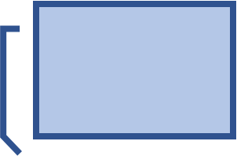</p>
bracePair | Brace Pair Shape | <p style="text-align: center;"></p>
bracketPair | Bracket Pair Shape | <p style="text-align: center;">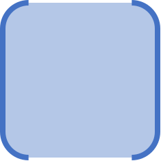</p>
callout1 | Callout 1 Shape | <p style="text-align: center;"></p>
callout2 | Callout 2 Shape | <p style="text-align: center;">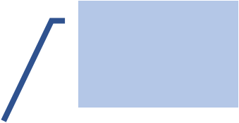</p>
callout3 | Callout 3 Shape | <p style="text-align: center;">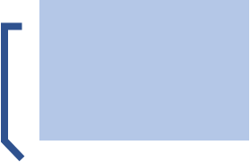</p>
can | Can Shape | <p style="text-align: center;">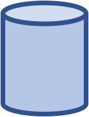</p>
chartPlus | Chart Plus Shape | <p style="text-align: center;">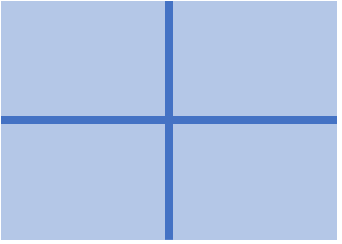</p>
chartStar | Chart Star Shape | <p style="text-align: center;">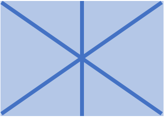</p>
chartX | Chart X Shape | <p style="text-align: center;"></p>
chevron | Chevron Shape | <p style="text-align: center;">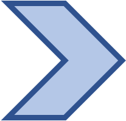</p>
chord | Chord Shape | <p style="text-align: center;">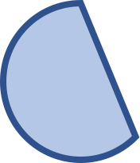</p>
circularArrow | Circular Arrow Shape | <p style="text-align: center;">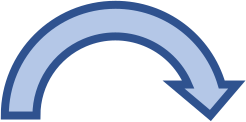</p>
cloud | Cloud Shape | <p style="text-align: center;"></p>
cloudCallout | Callout Cloud Shape | <p style="text-align: center;"></p>
corner | Corner Shape | <p style="text-align: center;">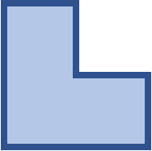</p>
cornerTabs | Corner Tabs Shape | <p style="text-align: center;"></p>
cube | Cube Shape | <p style="text-align: center;">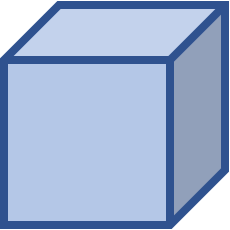</p>
curvedConnector2 | Curved Connector 2 Shape | <p style="text-align: center;">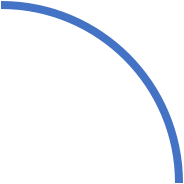</p>
curvedConnector3 | Curved Connector 3 Shape | <p style="text-align: center;">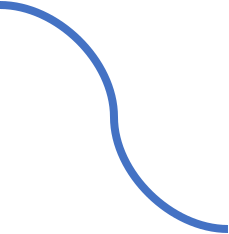</p>
curvedConnector4 | Curved Connector 4 Shape | <p style="text-align: center;"></p>
curvedConnector5 | Curved Connector 5 Shape | <p style="text-align: center;"></p>
curvedDownArrow | Curved Down Arrow Shape | <p style="text-align: center;">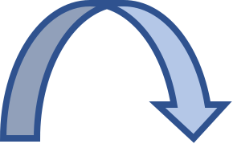</p>
curvedLeftArrow | Curved Left Arrow Shape | <p style="text-align: center;"></p>
curvedRightArrow | Curved Right Arrow Shape | <p style="text-align: center;">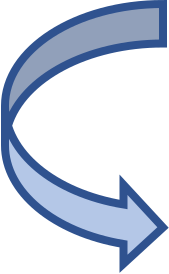</p>
curvedUpArrow | Curved Up Arrow Shape | <p style="text-align: center;">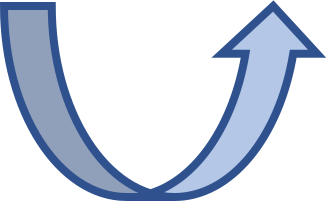</p>
decagon | Decagon Shape | <p style="text-align: center;">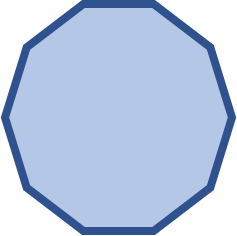</p>
diagStripe | Diagonal Stripe Shape | <p style="text-align: center;">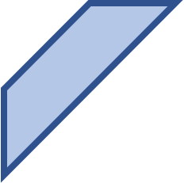</p>
diamond | Diamond Shape | <p style="text-align: center;">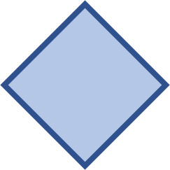</p>
dodecagon | Dodecagon Shape | <p style="text-align: center;">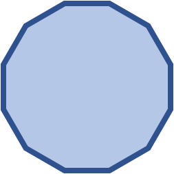</p>
donut | Donut Shape | <p style="text-align: center;">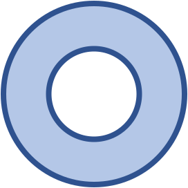</p>
doubleWave | Double Wave Shape | <p style="text-align: center;">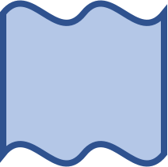</p>
downArrow | Down Arrow Shape | <p style="text-align: center;">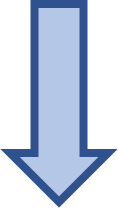</p>
downArrowCallout | Callout Down Arrow Shape | <p style="text-align: center;">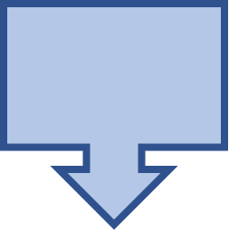</p>
ellipse | Ellipse Shape | <p style="text-align: center;">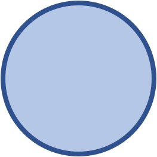</p>
ellipseRibbon | Ellipse Ribbon Shape | <p style="text-align: center;">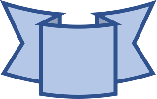</p>
ellipseRibbon2 | Ellipse Ribbon 2 Shape | <p style="text-align: center;"></p>
flowChartAlternateProcess | Alternate Process Flow Shape | <p style="text-align: center;">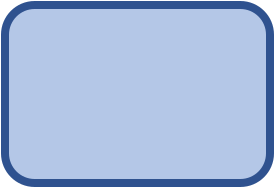</p>
flowChartCollate | Collate Flow Shape | <p style="text-align: center;"></p>
flowChartConnector | Connector Flow Shape | <p style="text-align: center;"></p>
flowChartDecision | Decision Flow Shape | <p style="text-align: center;">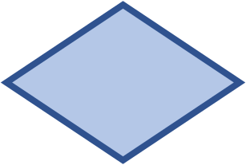</p>
flowChartDelay | Delay Flow Shape | <p style="text-align: center;">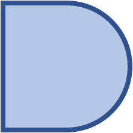</p>
flowChartDisplay | Display Flow Shape | <p style="text-align: center;"></p>
flowChartDocument | Document Flow Shape | <p style="text-align: center;"></p>
flowChartExtract | Extract Flow Shape | <p style="text-align: center;"></p>
flowChartInputOutput | Input Output Flow Shape | <p style="text-align: center;"></p>
flowChartInternalStorage | Internal Storage Flow Shape | <p style="text-align: center;"></p>
flowChartMagneticDisk | Magnetic Disk Flow Shape | <p style="text-align: center;"></p>
flowChartMagneticDrum | Magnetic Drum Flow Shape | <p style="text-align: center;"></p>
flowChartMagneticTape | Magnetic Tape Flow Shape | <p style="text-align: center;"></p>
flowChartManualInput | Manual Input Flow Shape | <p style="text-align: center;"></p>
flowChartManualOperation | Manual Operation Flow Shape | <p style="text-align: center;"></p>
flowChartMerge | Merge Flow Shape | <p style="text-align: center;"></p>
flowChartMultidocument | Multi-Document Flow Shape | <p style="text-align: center;"></p>
flowChartOfflineStorage | Offline Storage Flow Shape | <p style="text-align: center;"></p>
flowChartOffpageConnector | Off-Page Connector Flow Shape | <p style="text-align: center;"></p>
flowChartOnlineStorage | Online Storage Flow Shape | <p style="text-align: center;"></p>
flowChartOr | Or Flow Shape | <p style="text-align: center;"></p>
flowChartPredefinedProcess | Predefined Process Flow Shape | <p style="text-align: center;"></p>
flowChartPreparation | Preparation Flow Shape | <p style="text-align: center;"></p>
flowChartProcess | Process Flow Shape | <p style="text-align: center;"></p>
flowChartPunchedCard | Punched Card Flow Shape | <p style="text-align: center;"></p>
flowChartPunchedTape | Punched Tape Flow Shape | <p style="text-align: center;"></p>
flowChartSort | Sort Flow Shape | <p style="text-align: center;"></p>
flowChartSummingJunction | Summing Junction Flow Shape | <p style="text-align: center;"></p>
flowChartTerminator | Terminator Flow Shape | <p style="text-align: center;"></p>
foldedCorner | Folded Corner Shape | <p style="text-align: center;"></p>
frame | Frame Shape | <p style="text-align: center;"></p>
funnel | Funnel Shape | <p style="text-align: center;"></p>
gear6 | Gear 6 Shape | <p style="text-align: center;"></p>
gear9 | Gear 9 Shape | <p style="text-align: center;"></p>
halfFrame | Half Frame Shape | <p style="text-align: center;"></p>
heart | Heart Shape | <p style="text-align: center;"></p>
heptagon | Heptagon Shape | <p style="text-align: center;"></p>
hexagon | Hexagon Shape | <p style="text-align: center;"></p>
homePlate | Home Plate Shape | <p style="text-align: center;"></p>
horizontalScroll | Horizontal Scroll Shape | <p style="text-align: center;"></p>
irregularSeal1 | Irregular Seal 1 Shape | <p style="text-align: center;"></p>
irregularSeal2 | Irregular Seal 2 Shape | <p style="text-align: center;"></p>
leftArrow | Left Arrow Shape | <p style="text-align: center;"></p>
leftArrowCallout | Callout Left Arrow Shape | <p style="text-align: center;"></p>
leftBrace | Left Brace Shape | <p style="text-align: center;"></p>
leftBracket | Left Bracket Shape | <p style="text-align: center;"></p>
leftCircularArrow | Left Circular Arrow Shape | <p style="text-align: center;"></p>
leftRightArrow | Left Right Arrow Shape | <p style="text-align: center;"></p>
leftRightArrowCallout | Callout Left Right Arrow Shape | <p style="text-align: center;"></p>
leftRightCircularArrow | Left Right Circular Arrow Shape | <p style="text-align: center;"></p>
leftRightRibbon | Left Right Ribbon Shape | <p style="text-align: center;"></p>
leftRightUpArrow | Left Right Up Arrow Shape | <p style="text-align: center;"></p>
leftUpArrow | Left Up Arrow Shape | <p style="text-align: center;"></p>
lightningBolt | Lightning Bolt Shape | <p style="text-align: center;"></p>
line | Line Shape | <p style="text-align: center;"></p>
lineInv | Line Inverse Shape | <p style="text-align: center;"></p>
mathDivide | Divide Math Shape | <p style="text-align: center;"></p>
mathEqual | Equal Math Shape | <p style="text-align: center;"></p>
mathMinus | Minus Math Shape | <p style="text-align: center;"></p>
mathMultiply | Multiply Math Shape | <p style="text-align: center;"></p>
mathNotEqual | Not Equal Math Shape | <p style="text-align: center;"></p>
mathPlus | Plus Math Shape | <p style="text-align: center;"></p>
moon | Moon Shape | <p style="text-align: center;"></p>
nonIsoscelesTrapezoid | Non-Isosceles Trapezoid Shape | <p style="text-align: center;"></p>
noSmoking | No Smoking Shape | <p style="text-align: center;"></p>
notchedRightArrow | Notched Right Arrow Shape | <p style="text-align: center;"></p>
octagon | Octagon Shape | <p style="text-align: center;"></p>
parallelogram | Parallelogram Shape | <p style="text-align: center;"></p>
pentagon | Pentagon Shape | <p style="text-align: center;"></p>
pie | Pie Shape | <p style="text-align: center;"></p>
pieWedge | Pie Wedge Shape | <p style="text-align: center;"></p>
plaque | Plaque Shape | <p style="text-align: center;"></p>
plaqueTabs | Plaque Tabs Shape | <p style="text-align: center;"></p>
plus | Plus Shape | <p style="text-align: center;"></p>
quadArrow | Quad-Arrow Shape | <p style="text-align: center;"></p>
quadArrowCallout | Callout Quad-Arrow Shape | <p style="text-align: center;"></p>
rect | Rectangle Shape | <p style="text-align: center;"></p>
ribbon | Ribbon Shape | <p style="text-align: center;"></p>
ribbon2 | Ribbon 2 Shape | <p style="text-align: center;"></p>
rightArrow | Right Arrow Shape | <p style="text-align: center;"></p>
rightArrowCallout | Callout Right Arrow Shape | <p style="text-align: center;"></p>
rightBrace | Right Brace Shape | <p style="text-align: center;"></p>
rightBracket | Right Bracket Shape | <p style="text-align: center;"></p>
round1Rect | One Round Corner Rectangle Shape | <p style="text-align: center;"></p>
round2DiagRect | Two Diagonal Round Corner Rectangle Shape | <p style="text-align: center;"></p>
round2SameRect | Two Same-side Round Corner Rectangle Shape | <p style="text-align: center;"></p>
roundRect | Round Corner Rectangle Shape | <p style="text-align: center;"></p>
rtTriangle | Right Triangle Shape | <p style="text-align: center;"></p>
smileyFace | Smiley Face Shape | <p style="text-align: center;"></p>
snip1Rect | One Snip Corner Rectangle Shape | <p style="text-align: center;"></p>
snip2DiagRect | Two Diagonal Snip Corner Rectangle Shape | <p style="text-align: center;"></p>
snip2SameRect | Two Same-side Snip Corner Rectangle Shape | <p style="text-align: center;"></p>
snipRoundRect | One Snip One Round Corner Rectangle Shape | <p style="text-align: center;"></p>
squareTabs | Square Tabs Shape | <p style="text-align: center;"></p>
star10 | Ten Pointed Star Shape | <p style="text-align: center;"></p>
star12 | Twelve Pointed Star Shape | <p style="text-align: center;"></p>
star16 | Sixteen Pointed Star Shape | <p style="text-align: center;"></p>
star24 | Twenty Four Pointed Star Shape | <p style="text-align: center;"></p>
star32 | Thirty Two Pointed Star Shape | <p style="text-align: center;"></p>
star4 | Four Pointed Star Shape | <p style="text-align: center;"></p>
star5 | Five Pointed Star Shape | <p style="text-align: center;"></p>
star6 | Six Pointed Star Shape | <p style="text-align: center;"></p>
star7 | Seven Pointed Star Shape | <p style="text-align: center;"></p>
star8 | Eight Pointed Star Shape | <p style="text-align: center;"></p>
straightConnector1 | Straight Connector 1 Shape | <p style="text-align: center;"></p>
stripedRightArrow | Striped Right Arrow Shape | <p style="text-align: center;"></p>
sun | Sun Shape | <p style="text-align: center;"></p>
swooshArrow | Swoosh Arrow Shape | <p style="text-align: center;"></p>
teardrop | Teardrop Shape | <p style="text-align: center;"></p>
trapezoid | Trapezoid Shape | <p style="text-align: center;"></p>
triangle | Triangle Shape | <p style="text-align: center;"></p>
upArrow | Up Arrow Shape | <p style="text-align: center;"></p>
upArrowCallout | Callout Up Arrow Shape | <p style="text-align: center;"></p>
upDownArrow | Up Down Arrow Shape | <p style="text-align: center;"></p>
upDownArrowCallout | Callout Up Down Arrow Shape | <p style="text-align: center;"></p>
uturnArrow | U-Turn Arrow Shape | <p style="text-align: center;"></p>
verticalScroll | Vertical Scroll Shape | <p style="text-align: center;"></p>
wave | Wave Shape | <p style="text-align: center;"></p>
wedgeEllipseCallout | Callout Wedge Ellipse Shape | <p style="text-align: center;"></p>
wedgeRectCallout | Callout Wedge Rectangle Shape | <p style="text-align: center;"></p>
wedgeRoundRectCallout | Callout Wedge Round Rectangle Shape  | <p style="text-align: center;"></p>
